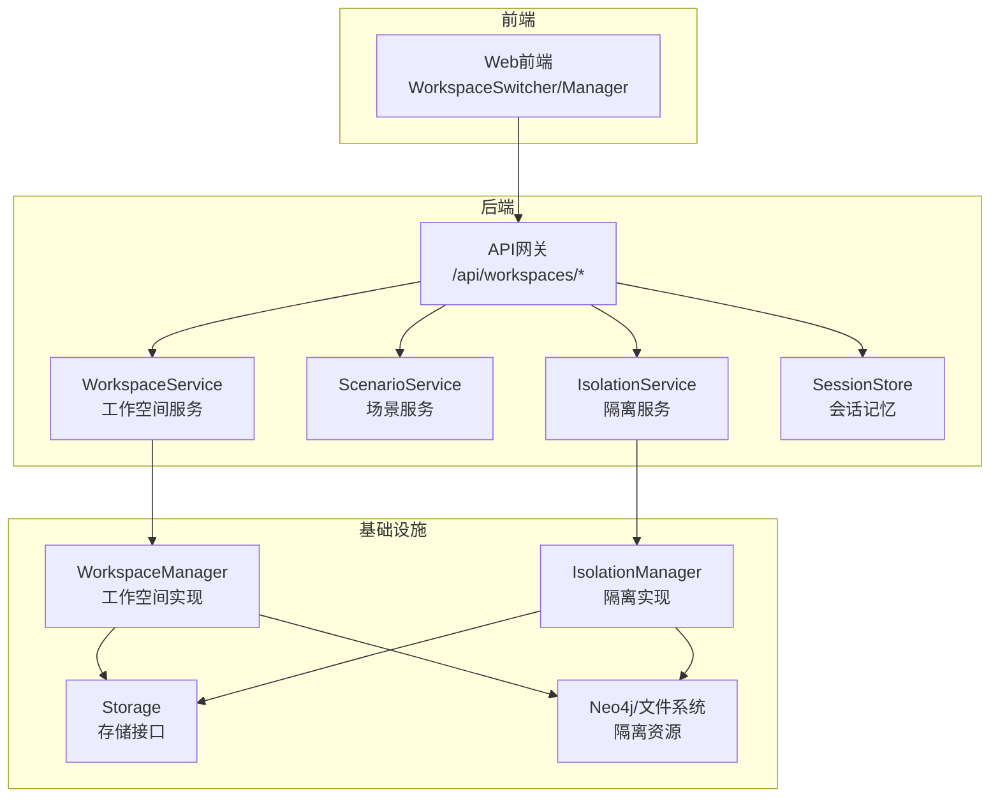
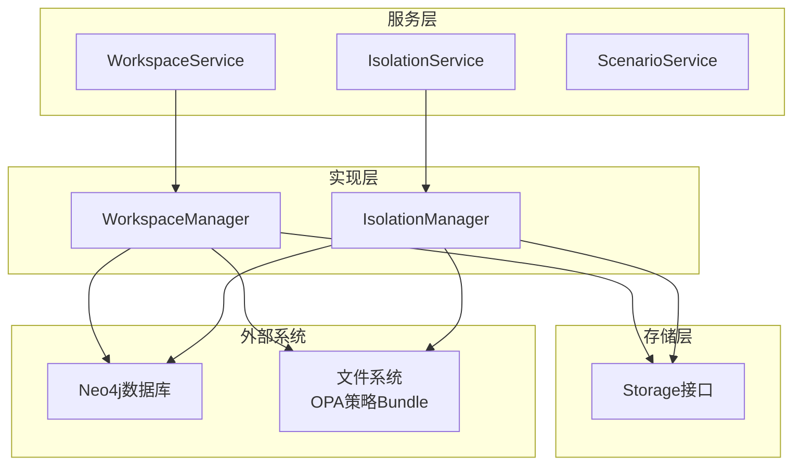
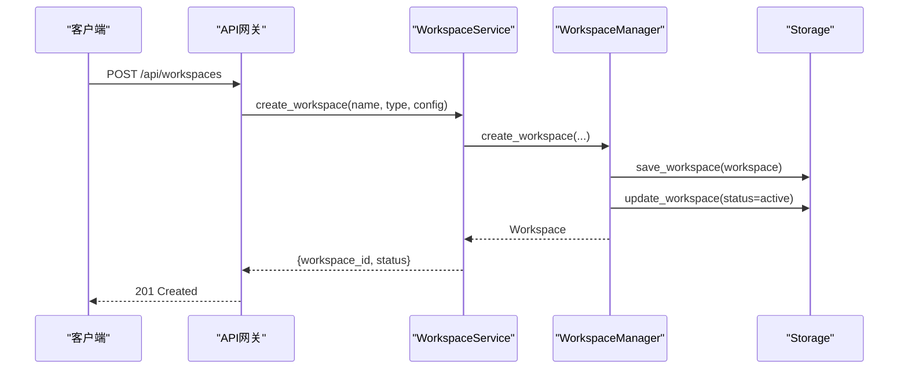
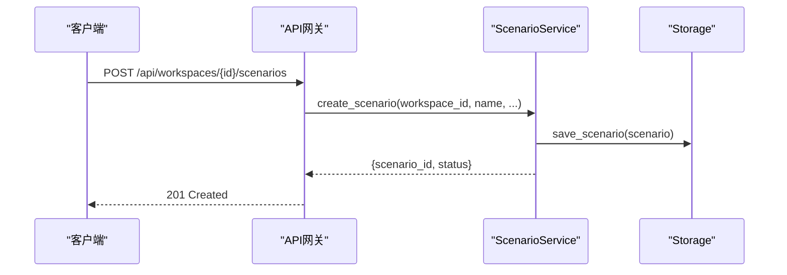
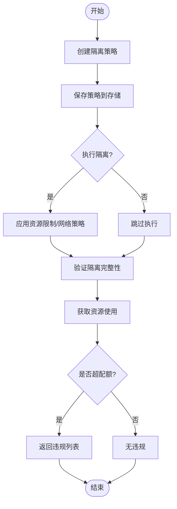
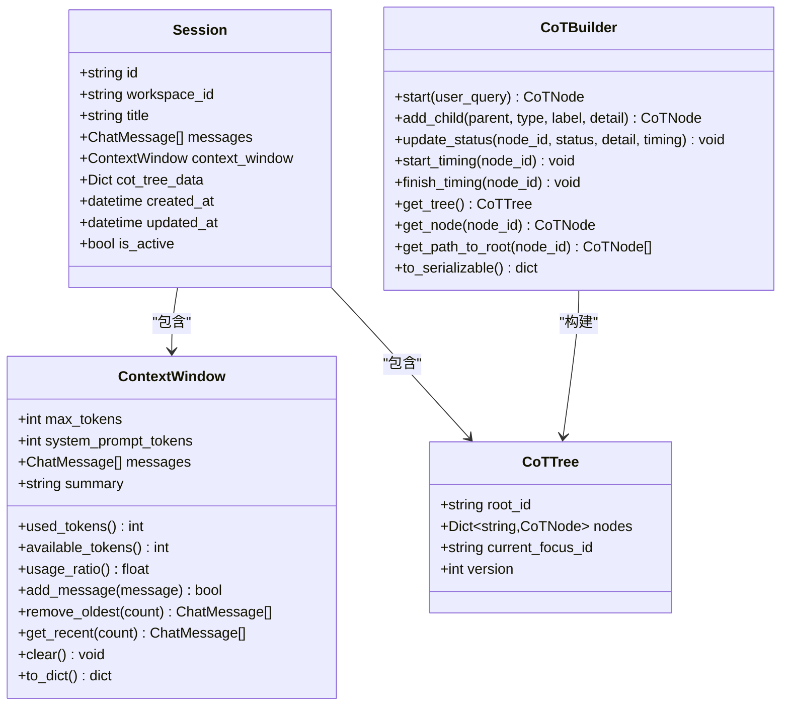
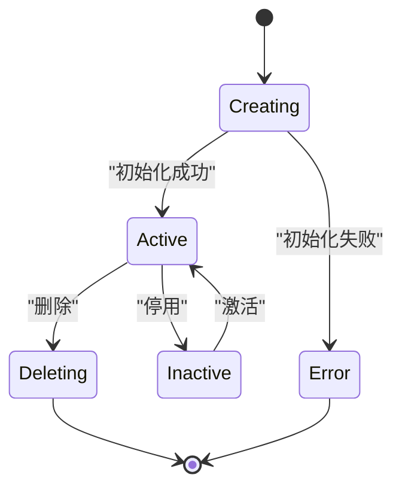
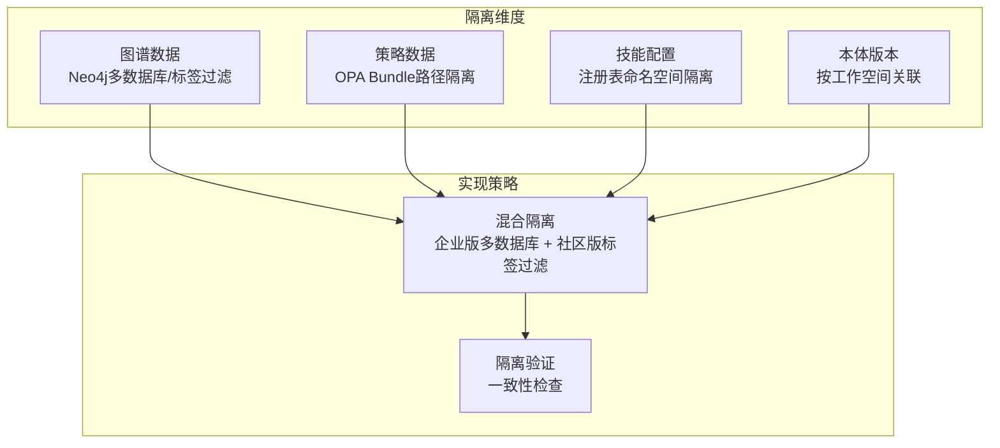
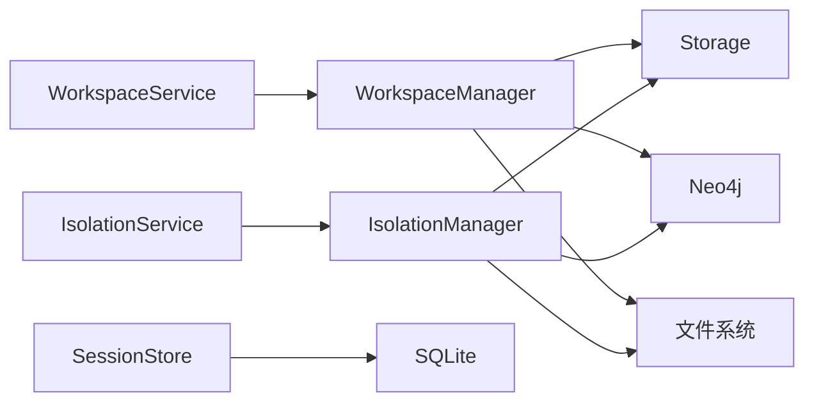

# 工作空间管理系统

<cite>
**本文引用的文件**
- [workspace_service.py](file://odap/biz/platform/workspace/services/workspace_service.py)
- [isolation_service.py](file://odap/biz/platform/workspace/services/isolation_service.py)
- [scenario_service.py](file://odap/biz/platform/workspace/services/scenario_service.py)
- [workspace.py](file://odap/biz/platform/workspace/impl/workspace.py)
- [isolation.py](file://odap/biz/platform/workspace/impl/isolation.py)
- [workspace.py](file://odap/biz/platform/workspace/models/workspace.py)
- [scenario.py](file://odap/biz/platform/workspace/models/scenario.py)
- [isolation.py](file://odap/biz/platform/workspace/models/isolation.py)
- [session_store.py](file://odap/biz/platform/session_memory/session_store.py)
- [context_window.py](file://odap/biz/platform/session_memory/context_window.py)
- [cot_builder.py](file://odap/biz/platform/session_memory/cot_builder.py)
- [DESIGN.md](file://docs/03-modules/workspace/DESIGN.md)
- [ADR-041_workspace_resource_isolation.md](file://docs/07-adr/ADR-041_workspace_resource_isolation.md)
- [routes.py](file://odap/biz/integration/openharness_agent/api/routes.py)
- [app.py](file://odap/web/app.py)
- [test_workspace.py](file://tests/unit/test_workspace.py)
- [test_storage_layers.py](file://tests/unit/test_storage_layers.py)
</cite>

## 目录
1. [简介](#简介)
2. [项目结构](#项目结构)
3. [核心组件](#核心组件)
4. [架构总览](#架构总览)
5. [详细组件分析](#详细组件分析)
6. [依赖关系分析](#依赖关系分析)
7. [性能考虑](#性能考虑)
8. [故障排查指南](#故障排查指南)
9. [结论](#结论)
10. [附录](#附录)

## 简介
本文件系统性阐述工作空间管理系统的设计与实现，重点覆盖以下方面：
- 工作空间隔离机制：基于Neo4j多数据库与标签过滤的混合隔离策略，确保图谱数据、策略与配置在工作空间间完全隔离。
- 场景管理策略：围绕场景的创建、绑定与生命周期管理，支撑多业务场景的快速实例化与复用。
- 资源配额控制：定义四级隔离策略（low/standard/high/strict）与资源配额、网络策略，结合使用量监控与违规检测。
- 会话记忆系统：提供对话上下文窗口、思维链树形结构与会话持久化能力，支撑Agent推理与交互。
- 生命周期管理：从创建、激活、成员管理到导入导出与删除的全生命周期流程。
- 权限控制模型：基于OPA的ABAC策略与workspace:*权限，结合软删除与审计日志保障安全。

## 项目结构
工作空间管理模块位于odap/biz/platform/workspace目录，采用“服务-实现-模型-存储”的分层设计，并与会话记忆、场景管理、隔离策略等子模块协同工作。前端通过API网关与后端交互，后端通过WorkspaceService、ScenarioService、IsolationService对外暴露能力。

**图表来源**
- [DESIGN.md:25-42](file://docs/03-modules/workspace/DESIGN.md#L25-L42)
- [workspace_service.py:10-16](file://odap/biz/platform/workspace/services/workspace_service.py#L10-L16)
- [isolation_service.py:8-13](file://odap/biz/platform/workspace/services/isolation_service.py#L8-L13)
- [scenario_service.py:10-15](file://odap/biz/platform/workspace/services/scenario_service.py#L10-L15)

**章节来源**
- [DESIGN.md:1-659](file://docs/03-modules/workspace/DESIGN.md#L1-L659)

## 核心组件
- WorkspaceService：封装工作空间的CRUD、成员管理、激活/停用、导入导出等业务逻辑，向上提供统一接口。
- ScenarioService：负责场景的创建、状态管理与绑定，支撑工作空间内的多场景并行。
- IsolationService：封装隔离策略的创建、查询、执行、验证与配额检查，配合资源监控实现合规运行。
- SessionStore/ContextWindow/CoTBuilder：会话记忆系统，提供消息上下文、Token用量与思维链追踪能力。
- WorkspaceManager/IsolationManager：具体实现类，负责与存储与外部系统（Neo4j/文件系统）交互。
- 模型层：Workspace、Scenario、IsolationLevel、ResourceQuota、NetworkPolicy等，定义数据结构与约束。

**章节来源**
- [workspace_service.py:10-304](file://odap/biz/platform/workspace/services/workspace_service.py#L10-L304)
- [scenario_service.py:10-40](file://odap/biz/platform/workspace/services/scenario_service.py#L10-L40)
- [isolation_service.py:8-122](file://odap/biz/platform/workspace/services/isolation_service.py#L8-L122)
- [workspace.py:10-178](file://odap/biz/platform/workspace/impl/workspace.py#L10-L178)
- [isolation.py:9-112](file://odap/biz/platform/workspace/impl/isolation.py#L9-L112)
- [workspace.py:10-52](file://odap/biz/platform/workspace/models/workspace.py#L10-L52)
- [scenario.py:10-38](file://odap/biz/platform/workspace/models/scenario.py#L10-L38)
- [isolation.py:8-35](file://odap/biz/platform/workspace/models/isolation.py#L8-L35)
- [session_store.py:16-151](file://odap/biz/platform/session_memory/session_store.py#L16-L151)
- [context_window.py:11-78](file://odap/biz/platform/session_memory/context_window.py#L11-L78)
- [cot_builder.py:11-151](file://odap/biz/platform/session_memory/cot_builder.py#L11-L151)

## 架构总览
工作空间管理采用“服务-实现-存储-外部系统”分层，服务层面向上提供REST API与内部接口，实现层负责业务编排与策略执行，存储层抽象数据持久化，外部系统包括Neo4j数据库与文件系统（OPA策略Bundle）。隔离策略通过混合方案在社区版与企业版之间动态切换。

**图表来源**
- [DESIGN.md:123-190](file://docs/03-modules/workspace/DESIGN.md#L123-L190)
- [ADR-041_workspace_resource_isolation.md:47-64](file://docs/07-adr/ADR-041_workspace_resource_isolation.md#L47-L64)

## 详细组件分析

### 工作空间服务 WorkspaceService
- 职责：创建工作空间、查询、更新、删除、列表、激活/停用、成员管理、导入导出。
- 关键流程：创建时构造Workspace对象并保存，状态从“creating”过渡到“active”；导入导出通过ImportExportManager完成。
- 错误处理：对不存在的工作空间返回错误信息；值错误捕获并返回标准化错误响应。

**图表来源**
- [workspace_service.py:17-55](file://odap/biz/platform/workspace/services/workspace_service.py#L17-L55)
- [workspace.py:16-36](file://odap/biz/platform/workspace/impl/workspace.py#L16-L36)

**章节来源**
- [workspace_service.py:17-304](file://odap/biz/platform/workspace/services/workspace_service.py#L17-L304)
- [workspace.py:16-114](file://odap/biz/platform/workspace/impl/workspace.py#L16-L114)

### 场景服务 ScenarioService
- 职责：为工作空间创建场景，维护场景状态、标签与本体绑定。
- 关键流程：生成场景ID与时间戳，若未提供本体ID则自动生成，保存至Storage。
- 与工作空间关系：每个场景绑定到特定workspace_id，支持多场景并行。

**图表来源**
- [scenario_service.py:16-40](file://odap/biz/platform/workspace/services/scenario_service.py#L16-L40)

**章节来源**
- [scenario_service.py:10-40](file://odap/biz/platform/workspace/services/scenario_service.py#L10-L40)
- [scenario.py:22-38](file://odap/biz/platform/workspace/models/scenario.py#L22-L38)

### 隔离服务 IsolationService
- 职责：创建/查询/更新隔离策略，执行隔离，验证隔离，获取资源使用与检查配额违规。
- 四级隔离策略：low/standard/high/strict，分别对应不同的资源配额与网络策略强度。
- 资源配额：CPU、内存、存储、最大连接数、最大进程数、速率限制等。
- 网络策略：允许/阻止IP与端口、出入站规则、防火墙开关等。

**图表来源**
- [isolation_service.py:14-122](file://odap/biz/platform/workspace/services/isolation_service.py#L14-L122)
- [isolation.py:15-112](file://odap/biz/platform/workspace/impl/isolation.py#L15-L112)
- [isolation.py:8-35](file://odap/biz/platform/workspace/models/isolation.py#L8-L35)

**章节来源**
- [isolation_service.py:8-122](file://odap/biz/platform/workspace/services/isolation_service.py#L8-L122)
- [isolation.py:9-112](file://odap/biz/platform/workspace/impl/isolation.py#L9-L112)
- [isolation.py:8-35](file://odap/biz/platform/workspace/models/isolation.py#L8-L35)

### 会话记忆系统 SessionMemory
- SessionStore：基于SQLite持久化会话，支持保存、加载、列表与删除（软删除标记）。
- ContextWindow：管理聊天消息与Token用量，提供最近消息、Token统计与可用容量。
- CoTBuilder：构建思维链树形结构，记录节点类型、状态、耗时与父子关系，便于调试与分析。

**图表来源**
- [session_store.py:16-26](file://odap/biz/platform/session_memory/session_store.py#L16-L26)
- [context_window.py:29-78](file://odap/biz/platform/session_memory/context_window.py#L29-L78)
- [cot_builder.py:41-151](file://odap/biz/platform/session_memory/cot_builder.py#L41-L151)

**章节来源**
- [session_store.py:38-151](file://odap/biz/platform/session_memory/session_store.py#L38-L151)
- [context_window.py:11-78](file://odap/biz/platform/session_memory/context_window.py#L11-L78)
- [cot_builder.py:48-151](file://odap/biz/platform/session_memory/cot_builder.py#L48-L151)

### 工作空间生命周期管理
- 创建：校验唯一性、保存记录、初始化隔离资源、导入模板、记录审计日志。
- 切换：验证目标空间存在且为ACTIVE、验证访问权限、清理当前上下文、加载新上下文、通知组件切换。
- 删除：默认软删除，后续清理或迁移。
- 导入/导出：ODAP Workspace Package(.owp)，包含本体、技能、策略、数据与配置。

**图表来源**
- [DESIGN.md:142-190](file://docs/03-modules/workspace/DESIGN.md#L142-L190)
- [workspace.py:16-74](file://odap/biz/platform/workspace/impl/workspace.py#L16-L74)

**章节来源**
- [DESIGN.md:520-550](file://docs/03-modules/workspace/DESIGN.md#L520-L550)
- [workspace.py:16-114](file://odap/biz/platform/workspace/impl/workspace.py#L16-L114)

### 数据隔离原理
- 图谱数据：优先Neo4j多数据库隔离；社区版回退到标签过滤；通过workspace_id强制过滤。
- 策略数据：OPA Bundle按工作空间路径隔离（/workspaces/{id}/policies/）。
- 技能配置：注册表内按workspace_id过滤。
- 本体版本：OntologyManager内按workspace_id关联。

**图表来源**
- [ADR-041_workspace_resource_isolation.md:24-43](file://docs/07-adr/ADR-041_workspace_resource_isolation.md#L24-L43)
- [DESIGN.md:195-235](file://docs/03-modules/workspace/DESIGN.md#L195-L235)

**章节来源**
- [ADR-041_workspace_resource_isolation.md:1-115](file://docs/07-adr/ADR-041_workspace_resource_isolation.md#L1-L115)
- [DESIGN.md:192-235](file://docs/03-modules/workspace/DESIGN.md#L192-L235)

### 权限控制模型
- 基于OPA的ABAC策略，使用workspace:{action}权限进行访问控制。
- 审计日志记录所有工作空间操作，支持软删除与定期一致性检查。
- 成员管理与绑定本体支持共享场景下的协作与复用。

**章节来源**
- [DESIGN.md:618-626](file://docs/03-modules/workspace/DESIGN.md#L618-L626)
- [workspace.py:89-167](file://odap/biz/platform/workspace/impl/workspace.py#L89-L167)

## 依赖关系分析
- 服务层依赖实现层，实现层依赖存储接口与外部系统。
- WorkspaceService依赖WorkspaceManager与ImportExportManager。
- IsolationService依赖IsolationManager。
- SessionStore依赖SQLite与Pydantic模型。
- 场景与工作空间通过workspace_id建立一对多关系。

**图表来源**
- [workspace_service.py:13-15](file://odap/biz/platform/workspace/services/workspace_service.py#L13-L15)
- [isolation_service.py:11-12](file://odap/biz/platform/workspace/services/isolation_service.py#L11-L12)
- [session_store.py:39-41](file://odap/biz/platform/session_memory/session_store.py#L39-L41)

**章节来源**
- [workspace_service.py:10-16](file://odap/biz/platform/workspace/services/workspace_service.py#L10-L16)
- [isolation_service.py:8-13](file://odap/biz/platform/workspace/services/isolation_service.py#L8-L13)
- [session_store.py:38-42](file://odap/biz/platform/session_memory/session_store.py#L38-L42)

## 性能考虑
- 工作空间创建/切换性能目标：创建<5s、切换<2s。
- 导出/导入性能目标：含数据10K节点时，导出<30s、导入<60s。
- 通过异步初始化、上下文缓存、流式导出与批量写入提升吞吐。
- 使用索引优化会话查询（workspace_id、is_active）。

**章节来源**
- [DESIGN.md:609-617](file://docs/03-modules/workspace/DESIGN.md#L609-L617)
- [session_store.py:46-62](file://odap/biz/platform/session_memory/session_store.py#L46-L62)

## 故障排查指南
- 工作空间不存在：WorkspaceService在查询不到时返回错误信息，检查workspace_id与状态。
- 隔离策略缺失：IsolationService在获取策略为空时返回错误，确认策略已创建并持久化。
- 资源配额告警：IsolationService的check_quota_violation返回违规列表，关注CPU使用率阈值。
- 会话加载失败：SessionStore.load_session返回None表示会话不存在或已被软删除，检查is_active标记。
- 初始化默认工作空间失败：web/app.py中的初始化逻辑记录警告，检查依赖服务与权限。

**章节来源**
- [workspace_service.py:57-68](file://odap/biz/platform/workspace/services/workspace_service.py#L57-L68)
- [isolation_service.py:38-49](file://odap/biz/platform/workspace/services/isolation_service.py#L38-L49)
- [isolation_service.py:107-121](file://odap/biz/platform/workspace/services/isolation_service.py#L107-L121)
- [session_store.py:86-96](file://odap/biz/platform/session_memory/session_store.py#L86-L96)
- [app.py:91-118](file://odap/web/app.py#L91-L118)
- [test_workspace.py:183-255](file://tests/unit/test_workspace.py#L183-L255)
- [test_storage_layers.py:64-72](file://tests/unit/test_storage_layers.py#L64-L72)

## 结论
工作空间管理系统以“混合隔离”为核心，结合服务-实现-存储分层与会话记忆能力，实现了多场景并行、强隔离与可运维的平台化能力。通过四级隔离策略与资源配额控制，系统在开发与生产环境中均可灵活适配。建议在生产环境采用Neo4j企业版实现数据库级隔离，并完善监控与自动化迁移机制。

## 附录

### 工作空间配置指南
- 隔离级别：根据场景安全要求选择low/standard/high/strict。
- 资源配额：为CPU、内存、存储、连接数与进程数设定合理上限。
- 网络策略：配置允许/阻止的IP与端口，启用防火墙并细化出入站规则。
- 环境变量：通过NEO4J_EDITION切换隔离策略（community/enterprise）。

**章节来源**
- [isolation.py:8-35](file://odap/biz/platform/workspace/models/isolation.py#L8-L35)
- [ADR-041_workspace_resource_isolation.md:69-72](file://docs/07-adr/ADR-041_workspace_resource_isolation.md#L69-L72)

### 多租户部署方案
- 租户隔离：每个租户拥有独立工作空间，采用数据库级隔离（企业版）或严格标签过滤（社区版）。
- 策略与配置：租户策略Bundle与技能注册表按租户命名空间隔离。
- 监控与审计：集中采集资源使用与操作日志，设置阈值告警与定期一致性检查。
- 迁移与升级：通过环境变量平滑从标签隔离升级到数据库隔离，制定数据搬迁与回滚预案。

**章节来源**
- [ADR-041_workspace_resource_isolation.md:66-80](file://docs/07-adr/ADR-041_workspace_resource_isolation.md#L66-L80)
- [DESIGN.md:618-634](file://docs/03-modules/workspace/DESIGN.md#L618-L634)