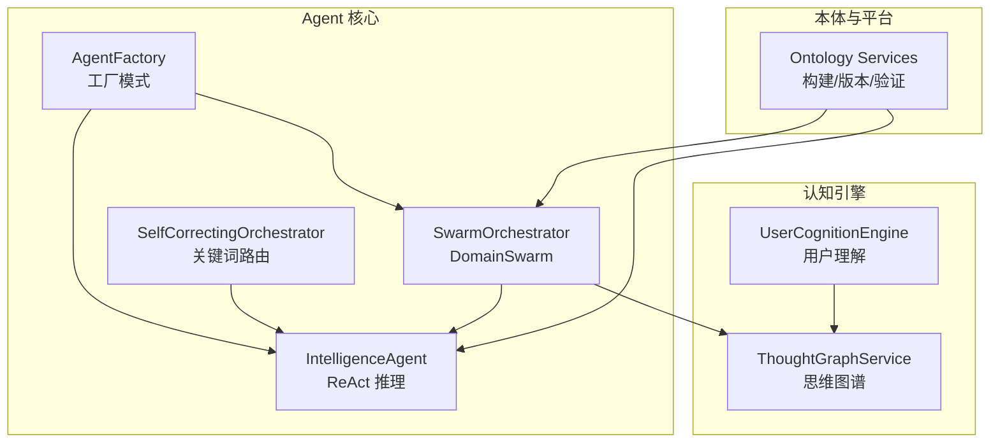
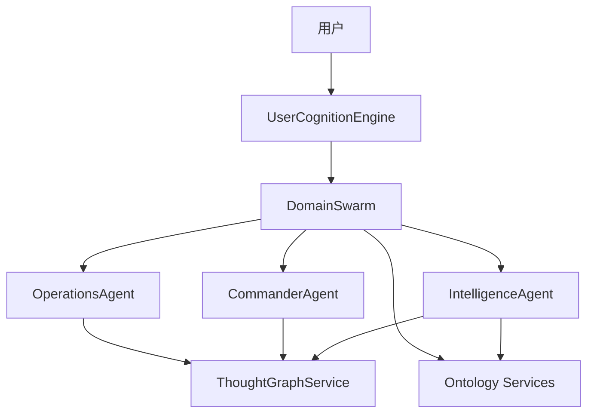
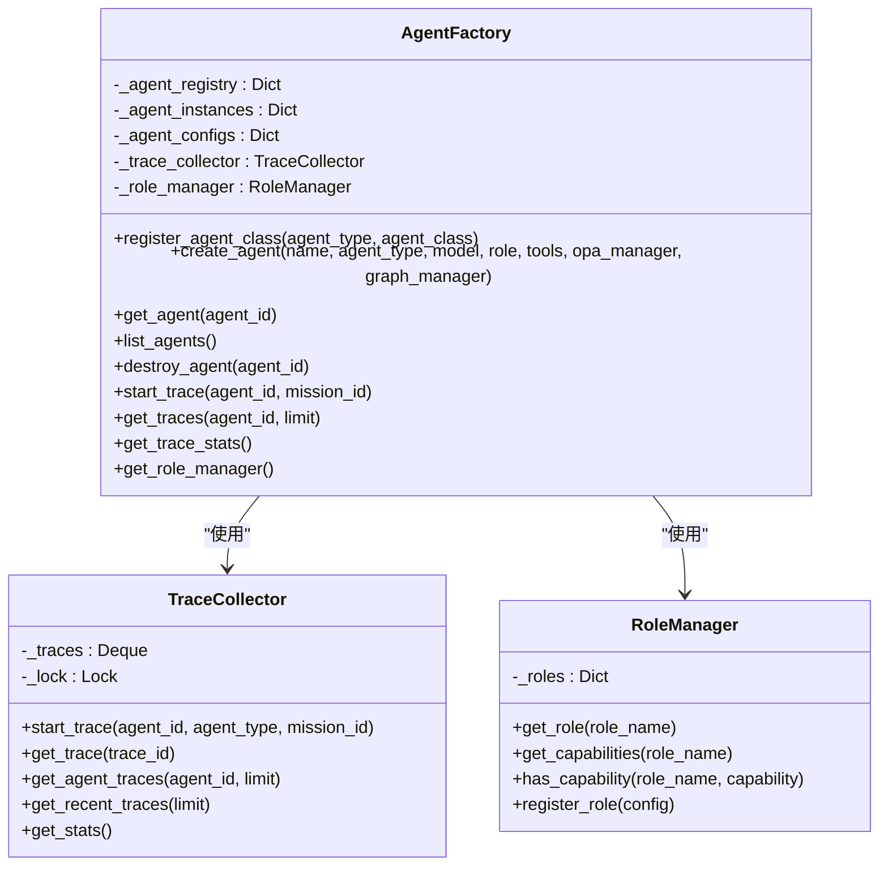
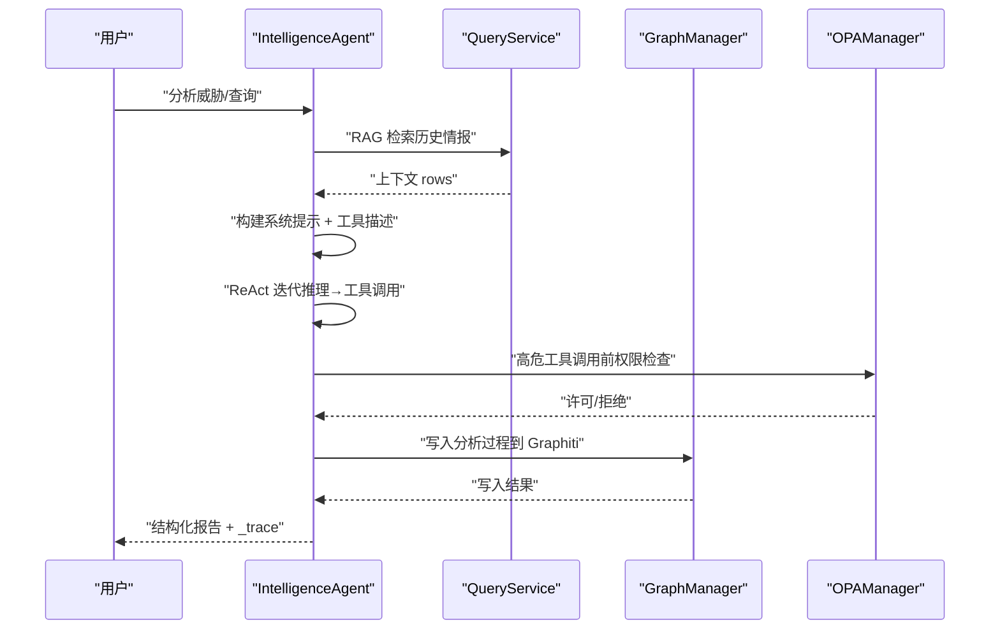
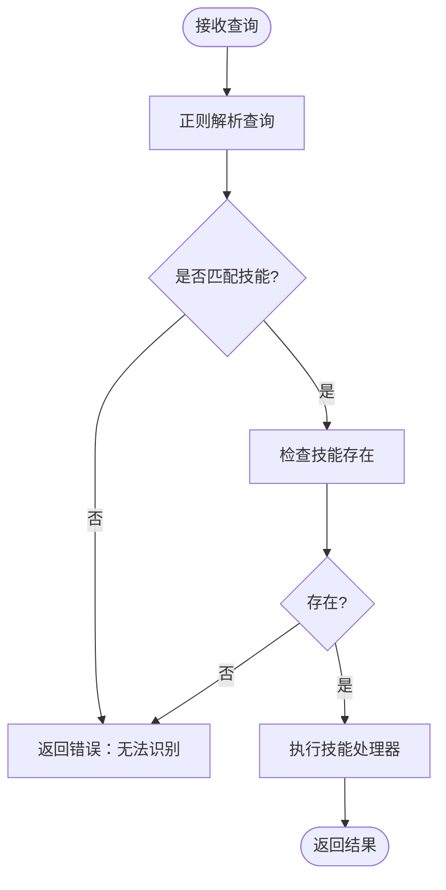
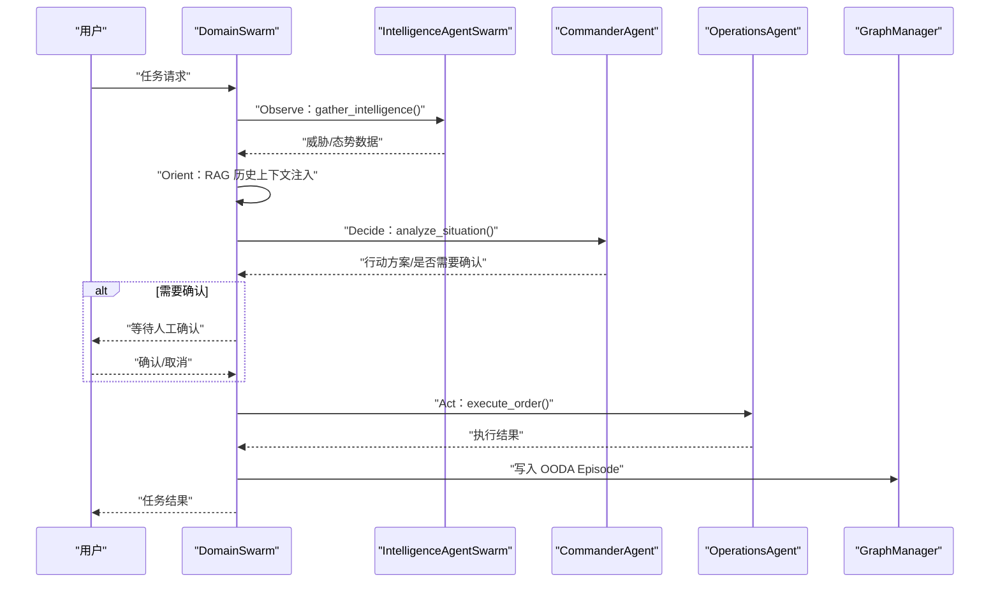
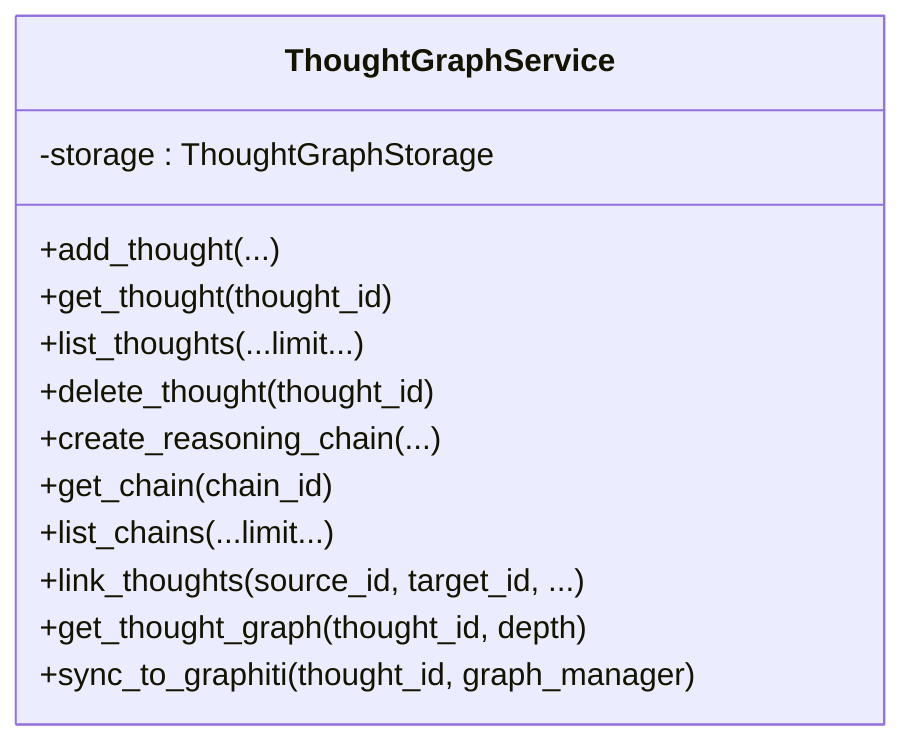
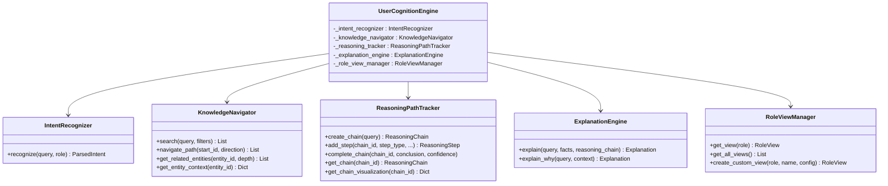
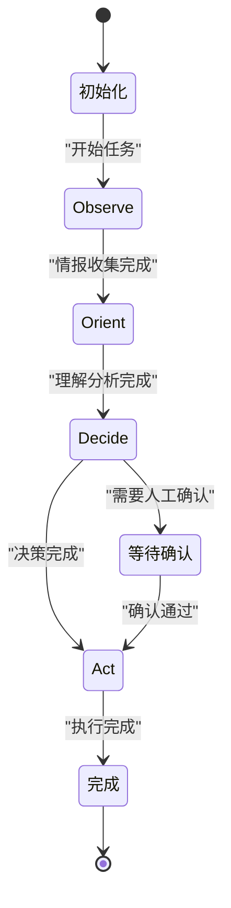
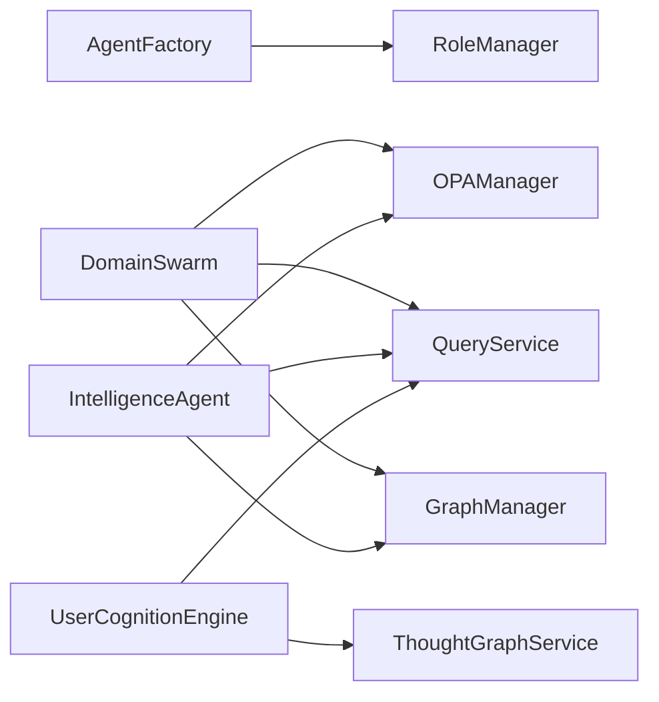

# 智能体协同系统

<cite>
**本文档引用的文件**
- [odap/biz/core/agent/agent_factory.py](file://odap/biz/core/agent/agent_factory.py)
- [odap/biz/core/agent/orchestrator.py](file://odap/biz/core/agent/orchestrator.py)
- [odap/biz/core/agent/swarm_orchestrator.py](file://odap/biz/core/agent/swarm_orchestrator.py)
- [odap/biz/core/agent/intelligence_agent.py](file://odap/biz/core/agent/intelligence_agent.py)
- [odap/biz/core/cognition/thought_graph/services/thought_graph_service.py](file://odap/biz/core/cognition/thought_graph/services/thought_graph_service.py)
- [odap/biz/core/cognition/user_cognition_engine.py](file://odap/biz/core/cognition/user_cognition_engine.py)
- [odap/biz/core/ontology/__init__.py](file://odap/biz/core/ontology/__init__.py)
- [odap/biz/core/agent/__init__.py](file://odap/biz/core/agent/__init__.py)
- [odap/biz/core/cognition/__init__.py](file://odap/biz/core/cognition/__init__.py)
</cite>

## 目录
1. [简介](#简介)
2. [项目结构](#项目结构)
3. [核心组件](#核心组件)
4. [架构总览](#架构总览)
5. [详细组件分析](#详细组件分析)
6. [依赖分析](#依赖分析)
7. [性能考量](#性能考量)
8. [故障排查指南](#故障排查指南)
9. [结论](#结论)
10. [附录](#附录)

## 简介
本文件面向“智能体协同系统”，围绕 Agent 编排与调度机制、Swarm 协作模式、OODA 循环实现、意图识别路由系统进行系统性梳理，并深入解释 Agent 工厂模式、IntelligenceAgent 设计、Orchestrator 协调机制、SwarmOrchestrator 的群体智能算法思想、ThoughtGraph 认知引擎、UserCognitionEngine 用户理解机制以及 Agent Loop 的执行流程。同时覆盖 Agent 生命周期管理、消息传递机制、状态同步与性能优化策略，并提供扩展指南与自定义 Agent 开发示例。

## 项目结构
系统以“业务域”划分模块，Agent 与 Cognition 两大核心子域分别承担“执行与编排”和“认知与理解”的职责；Ontology 子域提供本体构建与版本管理能力；SwarmOrchestrator 作为多 Agent 协同编排器，串联 Intelligence/Commander/Operations 三类 Agent，形成 OODA 闭环。

**图示来源**
- [odap/biz/core/agent/agent_factory.py:340-442](file://odap/biz/core/agent/agent_factory.py#L340-L442)
- [odap/biz/core/agent/swarm_orchestrator.py:288-687](file://odap/biz/core/agent/swarm_orchestrator.py#L288-L687)
- [odap/biz/core/agent/orchestrator.py:16-151](file://odap/biz/core/agent/orchestrator.py#L16-L151)
- [odap/biz/core/agent/intelligence_agent.py:73-599](file://odap/biz/core/agent/intelligence_agent.py#L73-L599)
- [odap/biz/core/cognition/thought_graph/services/thought_graph_service.py:7-167](file://odap/biz/core/cognition/thought_graph/services/thought_graph_service.py#L7-L167)
- [odap/biz/core/cognition/user_cognition_engine.py:787-1012](file://odap/biz/core/cognition/user_cognition_engine.py#L787-L1012)
- [odap/biz/core/ontology/__init__.py:1-19](file://odap/biz/core/ontology/__init__.py#L1-L19)

**章节来源**
- [odap/biz/core/agent/__init__.py:1-5](file://odap/biz/core/agent/__init__.py#L1-L5)
- [odap/biz/core/cognition/__init__.py:1-2](file://odap/biz/core/cognition/__init__.py#L1-L2)
- [odap/biz/core/ontology/__init__.py:1-19](file://odap/biz/core/ontology/__init__.py#L1-L19)

## 核心组件
- Agent 工厂模式与生命周期管理：提供 Agent 注册、实例化、销毁、追踪与角色能力管理，支持并发安全与统计分析。
- IntelligenceAgent：基于 LLM ReAct 的情报分析 Agent，具备 RAG 上下文注入、工具调用、权限检查与链路追踪。
- SelfCorrectingOrchestrator：关键词路由的编排器，负责将自然语言查询映射到具体技能执行。
- SwarmOrchestrator（DomainSwarm）：三 Agent 协同的 OODA 编排器，实现 Observe-Orient-Decide-Act 的闭环。
- ThoughtGraphService：思维图谱存储与检索服务，支撑认知与推理链可视化。
- UserCognitionEngine：意图识别、知识导航、解释与角色视图管理的用户理解系统。
- Ontology Services：本体构建、版本管理与验证服务，为 Agent 提供结构化知识基础。

**章节来源**
- [odap/biz/core/agent/agent_factory.py:340-442](file://odap/biz/core/agent/agent_factory.py#L340-L442)
- [odap/biz/core/agent/intelligence_agent.py:73-599](file://odap/biz/core/agent/intelligence_agent.py#L73-L599)
- [odap/biz/core/agent/orchestrator.py:16-151](file://odap/biz/core/agent/orchestrator.py#L16-L151)
- [odap/biz/core/agent/swarm_orchestrator.py:288-687](file://odap/biz/core/agent/swarm_orchestrator.py#L288-L687)
- [odap/biz/core/cognition/thought_graph/services/thought_graph_service.py:7-167](file://odap/biz/core/cognition/thought_graph/services/thought_graph_service.py#L7-L167)
- [odap/biz/core/cognition/user_cognition_engine.py:787-1012](file://odap/biz/core/cognition/user_cognition_engine.py#L787-L1012)
- [odap/biz/core/ontology/__init__.py:1-19](file://odap/biz/core/ontology/__init__.py#L1-L19)

## 架构总览
系统采用“多 Agent 协同 + 认知引擎 + 本体知识”的分层架构：上层由 SwarmOrchestrator 统一编排，中层由 IntelligenceAgent 进行 ReAct 推理与工具调用，下层由 ThoughtGraphService 与 Ontology Services 提供知识与推理支撑；UserCognitionEngine 作为用户交互入口，负责意图识别与解释。

**图示来源**
- [odap/biz/core/agent/swarm_orchestrator.py:288-687](file://odap/biz/core/agent/swarm_orchestrator.py#L288-L687)
- [odap/biz/core/agent/intelligence_agent.py:73-599](file://odap/biz/core/agent/intelligence_agent.py#L73-L599)
- [odap/biz/core/cognition/thought_graph/services/thought_graph_service.py:7-167](file://odap/biz/core/cognition/thought_graph/services/thought_graph_service.py#L7-L167)
- [odap/biz/core/cognition/user_cognition_engine.py:787-1012](file://odap/biz/core/cognition/user_cognition_engine.py#L787-L1012)
- [odap/biz/core/ontology/__init__.py:1-19](file://odap/biz/core/ontology/__init__.py#L1-L19)

## 详细组件分析

### Agent 工厂模式与生命周期管理
- 工厂职责：注册 Agent 类型、创建/销毁实例、维护配置与并发安全锁、提供追踪与统计。
- 追踪模型：Trace/TraceSpan 记录每个 Agent 的执行阶段、输入输出、状态与耗时，支持按 Agent 或最近记录查询。
- 角色管理：RoleManager 提供默认角色与能力矩阵，支持动态注册与能力查询。
- 全局工厂：get_agent_factory 返回单例工厂，自动注册三类 Agent 类型。

**图示来源**
- [odap/biz/core/agent/agent_factory.py:340-442](file://odap/biz/core/agent/agent_factory.py#L340-L442)

**章节来源**
- [odap/biz/core/agent/agent_factory.py:340-442](file://odap/biz/core/agent/agent_factory.py#L340-L442)

### IntelligenceAgent 设计与 ReAct 推理
- ReAct 循环：RAG 上下文注入 → LLM 推理 → 工具调用 → 结果整合 → 结构化报告 → 写入 Graphiti 记忆。
- 权限控制：对高危工具调用进行 OPA 权限检查。
- 链路追踪：每轮迭代生成 TraceSpan，记录事件与耗时，最终汇总为 _trace。
- 异常与重试：LLM 调用带指数退避重试，失败时返回结构化错误信息。

**图示来源**
- [odap/biz/core/agent/intelligence_agent.py:307-527](file://odap/biz/core/agent/intelligence_agent.py#L307-L527)

**章节来源**
- [odap/biz/core/agent/intelligence_agent.py:73-599](file://odap/biz/core/agent/intelligence_agent.py#L73-L599)

### SelfCorrectingOrchestrator 关键词路由
- 查询解析：基于正则匹配将自然语言映射到具体技能名称与参数。
- 执行与异常处理：从技能目录加载处理器并执行，捕获异常返回错误信息。
- 角色驱动：根据用户角色影响路由与权限。

**图示来源**
- [odap/biz/core/agent/orchestrator.py:64-114](file://odap/biz/core/agent/orchestrator.py#L64-L114)

**章节来源**
- [odap/biz/core/agent/orchestrator.py:16-151](file://odap/biz/core/agent/orchestrator.py#L16-L151)

### SwarmOrchestrator（DomainSwarm）与 OODA 闭环
- 三 Agent 角色：
  - IntelligenceAgentSwarm：情报收集与威胁评估。
  - CommanderAgent：态势理解与决策生成。
  - OperationsAgent：执行命令与资源调度。
- OODA 阶段：
  - Observe：Intelligence 收集领域与威胁数据。
  - Orient：结合历史上下文进行理解与分析。
  - Decide：Commander 生成行动方案与风险等级。
  - Act：Operations 执行命令并返回结果。
- 流式执行：execute_streaming 提供阶段进度回调，支持等待人工确认。
- 状态与持久化：checkpoint 保存任务中间态，健康监控与故障恢复贯穿执行。

**图示来源**
- [odap/biz/core/agent/swarm_orchestrator.py:379-657](file://odap/biz/core/agent/swarm_orchestrator.py#L379-L657)

**章节来源**
- [odap/biz/core/agent/swarm_orchestrator.py:288-687](file://odap/biz/core/agent/swarm_orchestrator.py#L288-L687)

### ThoughtGraph 认知引擎
- 思维图谱服务：提供思考节点与推理链的增删改查、邻接关系与图遍历，支持与 Graphiti 同步。
- 与 Swarm/Intelligence 集成：在 OODA 与 ReAct 过程中沉淀推理证据与结论，形成可回溯的知识图谱。

**图示来源**
- [odap/biz/core/cognition/thought_graph/services/thought_graph_service.py:7-167](file://odap/biz/core/cognition/thought_graph/services/thought_graph_service.py#L7-L167)

**章节来源**
- [odap/biz/core/cognition/thought_graph/services/thought_graph_service.py:7-167](file://odap/biz/core/cognition/thought_graph/services/thought_graph_service.py#L7-L167)

### UserCognitionEngine 用户理解机制
- 意图识别：基于正则模式识别 QUERY/ACTION/EXPLAIN/RECOMMEND/NAVIGATE/COMPARE/ANALYZE 等意图类型，提取实体与属性。
- 知识导航：通过 QueryService 或 Graph 客户端检索与拓扑导航，支持缓存与历史记录。
- 推理链追踪：ReasoningPathTracker 记录推理步骤、顺序与结论，支持可视化。
- 解释引擎：ExplanationEngine 基于推理链生成解释与替代解释，支持“为什么”查询。
- 角色视图：RoleViewManager 提供指挥官/情报员/操作员等默认视图与自定义视图。

**图示来源**
- [odap/biz/core/cognition/user_cognition_engine.py:787-1012](file://odap/biz/core/cognition/user_cognition_engine.py#L787-L1012)

**章节来源**
- [odap/biz/core/cognition/user_cognition_engine.py:140-785](file://odap/biz/core/cognition/user_cognition_engine.py#L140-L785)

### Agent Loop 执行流程与状态同步
- 执行循环：DomainSwarm 在每个 OODA 阶段间进行状态保存与进度回调，支持中断与恢复。
- 状态持久化：StatePersistenceManager 保存任务检查点，便于异常恢复与审计。
- 健康监控：HealthMonitor 实时监控系统健康度，配合 FaultRecoveryManager 进行容错恢复。

**图示来源**
- [odap/biz/core/agent/swarm_orchestrator.py:458-567](file://odap/biz/core/agent/swarm_orchestrator.py#L458-L567)

**章节来源**
- [odap/biz/core/agent/swarm_orchestrator.py:361-456](file://odap/biz/core/agent/swarm_orchestrator.py#L361-L456)

## 依赖分析
- 组件耦合：
  - AgentFactory 与 RoleManager 低耦合，通过枚举与配置解耦 Agent 类型与能力。
  - SwarmOrchestrator 依赖 GraphManager/QueryService/OPAManager/HealthMonitor/FaultRecoveryManager，体现编排器的跨域集成特性。
  - IntelligenceAgent 依赖工具目录、OPA 与 GraphManager，强调“工具+权限+记忆”的闭环。
- 外部依赖：
  - QueryService/GraphManager 提供知识检索与图谱写入。
  - OPA 提供权限策略执行。
  - httpx 异步客户端用于 LLM 调用。

**图示来源**
- [odap/biz/core/agent/agent_factory.py:340-442](file://odap/biz/core/agent/agent_factory.py#L340-L442)
- [odap/biz/core/agent/swarm_orchestrator.py:288-323](file://odap/biz/core/agent/swarm_orchestrator.py#L288-L323)
- [odap/biz/core/agent/intelligence_agent.py:31-36](file://odap/biz/core/agent/intelligence_agent.py#L31-L36)
- [odap/biz/core/cognition/user_cognition_engine.py:308-311](file://odap/biz/core/cognition/user_cognition_engine.py#L308-L311)

**章节来源**
- [odap/biz/core/agent/swarm_orchestrator.py:288-323](file://odap/biz/core/agent/swarm_orchestrator.py#L288-L323)
- [odap/biz/core/agent/intelligence_agent.py:31-36](file://odap/biz/core/agent/intelligence_agent.py#L31-L36)

## 性能考量
- 并发与锁：AgentFactory 使用可重入锁保护实例与配置，避免竞态。
- 异步 I/O：IntelligenceAgent 使用 httpx.AsyncClient，限制最大连接数与跟随重定向，提升吞吐。
- 指数退避：LLM 调用失败时采用指数退避重试，降低瞬时压力。
- 缓存与统计：TraceCollector 限制队列长度并提供统计接口，便于性能基线与容量规划。
- 图谱写入：GraphManager 写入失败降级为警告，不影响主流程。

**章节来源**
- [odap/biz/core/agent/agent_factory.py:180-242](file://odap/biz/core/agent/agent_factory.py#L180-L242)
- [odap/biz/core/agent/intelligence_agent.py:112-117](file://odap/biz/core/agent/intelligence_agent.py#L112-L117)
- [odap/biz/core/agent/swarm_orchestrator.py:614-631](file://odap/biz/core/agent/swarm_orchestrator.py#L614-L631)

## 故障排查指南
- 编排器路由失败：检查 SelfCorrectingOrchestrator 的正则匹配与技能目录是否存在。
- IntelligenceAgent 执行异常：查看链路追踪 _trace 与日志，确认工具调用与权限检查结果。
- Swarm 任务卡住：检查 execute_streaming 的进度回调与人工确认状态，必要时重启或恢复检查点。
- Graphiti 写入失败：关注 HealthMonitor 与 FaultRecoveryManager 的健康报告与故障汇总。
- 权限拒绝：核对 OPA 策略与用户角色，确认高危工具调用是否需要审批。

**章节来源**
- [odap/biz/core/agent/orchestrator.py:55-62](file://odap/biz/core/agent/orchestrator.py#L55-L62)
- [odap/biz/core/agent/intelligence_agent.py:222-232](file://odap/biz/core/agent/intelligence_agent.py#L222-L232)
- [odap/biz/core/agent/swarm_orchestrator.py:458-567](file://odap/biz/core/agent/swarm_orchestrator.py#L458-L567)
- [odap/biz/core/agent/swarm_orchestrator.py:639-653](file://odap/biz/core/agent/swarm_orchestrator.py#L639-L653)

## 结论
本系统通过“工厂化 Agent 生命周期管理 + Swarm 协同编排 + OODA 闭环 + 认知引擎 + 本体知识”的架构，实现了从意图识别、情报分析、决策制定到任务执行的全链路自动化与可观测。IntelligenceAgent 的 ReAct 推理与 RAG 增强、DomainSwarm 的三 Agent 协同与流式进度、UserCognitionEngine 的意图与解释能力，共同构成了可扩展、可审计、可恢复的智能体协同体系。

## 附录

### Agent 扩展指南
- 新增 Agent 类型：
  - 在 AgentFactory 中注册新类型与类映射。
  - 在 RoleManager 中补充角色与能力配置。
  - 在 DomainSwarm 的初始化中添加对应 Agent 实例。
- 新增工具：
  - 在技能目录中注册 handler 与输入 schema。
  - IntelligenceAgent 的工具列表会自动构建，注意分类过滤。
- 自定义 Swarm 配置：
  - 修改 DomainSwarm 的默认配置，调整并行度、超时与重试次数。
- 集成新知识源：
  - 通过 QueryService 或 Graph 客户端扩展检索与导航能力。

**章节来源**
- [odap/biz/core/agent/agent_factory.py:351-358](file://odap/biz/core/agent/agent_factory.py#L351-L358)
- [odap/biz/core/agent/agent_factory.py:435-441](file://odap/biz/core/agent/agent_factory.py#L435-L441)
- [odap/biz/core/agent/swarm_orchestrator.py:325-359](file://odap/biz/core/agent/swarm_orchestrator.py#L325-L359)
- [odap/biz/core/agent/intelligence_agent.py:126-168](file://odap/biz/core/agent/intelligence_agent.py#L126-L168)