# 本体管理引擎

<cite>
**本文引用的文件**
- [odap/biz/core/ontology/services/build_service.py](file://odap/biz/core/ontology/services/build_service.py)
- [odap/biz/core/ontology/services/version_service.py](file://odap/biz/core/ontology/services/version_service.py)
- [odap/biz/core/ontology/services/validation_service.py](file://odap/biz/core/ontology/services/validation_service.py)
- [odap/biz/core/ontology/services/ingest_service.py](file://odap/biz/core/ontology/services/ingest_service.py)
- [odap/biz/core/ontology/schema/document.py](file://odap/biz/core/ontology/schema/document.py)
- [odap/biz/core/ontology/models/validation.py](file://odap/biz/core/ontology/models/validation.py)
- [odap/web/app.py](file://odap/web/app.py)
- [odap/biz/core/ontology/__init__.py](file://odap/biz/core/ontology/__init__.py)
- [odap/biz/core/ontology/harness/blueprint/services/__init__.py](file://odap/biz/core/ontology/harness/blueprint/services/__init__.py)
- [odap/biz/core/ontology/harness/models/models.py](file://odap/biz/core/ontology/harness/models/models.py)
- [odap/biz/core/ontology/engine/api/routes.py](file://odap/biz/core/ontology/engine/api/routes.py)
- [odap/biz/core/ontology/engine/impl/version_manager_impl.py](file://odap/biz/core/ontology/engine/impl/version_manager_impl.py)
- [odap/biz/core/ontology/engine/storage/sqlite_engine_storage.py](file://odap/biz/core/ontology/engine/storage/sqlite_engine_storage.py)
- [odap/biz/core/ontology/engine/services/engine_service.py](file://odap/biz/core/ontology/engine/services/engine_service.py)
- [odap/biz/core/ontology/engine/models/version.py](file://odap/biz/core/ontology/engine/models/version.py)
- [odap/biz/core/ontology/impl/version.py](file://odap/biz/core/ontology/impl/version.py)
- [odap/biz/core/ontology/interfaces/version.py](file://odap/biz/core/ontology/interfaces/version.py)
- [odap/biz/core/ontology/storage/sqlite_ingest_storage.py](file://odap/biz/core/ontology/storage/sqlite_ingest_storage.py)
- [odap/infra/query/sources/temporal_source.py](file://odap/infra/query/sources/temporal_source.py)
- [odap/infra/logging/graphiti_events.py](file://odap/infra/logging/graphiti_events.py)
- [frontend/src/modules/ontology/stores/versionStore.ts](file://frontend/src/modules/ontology/stores/versionStore.ts)
- [tests/unit/test_ontology_engine_v2.py](file://tests/unit/test_ontology_engine_v2.py)
</cite>

## 更新摘要
**所做更改**
- 增强版本管理系统时序查询能力，新增 `/versions/temporal-query` API 端点
- 扩展版本追踪功能，支持基于有效时间戳的历史版本查询
- 完善版本管理器接口，新增 `query_at_time` 方法实现时序查询
- 增强前端版本管理界面，支持时序查询和版本历史展示
- 优化版本存储结构，支持有效时间和事务时间的双时态存储

## 目录
1. [简介](#简介)
2. [项目结构](#项目结构)
3. [核心组件](#核心组件)
4. [架构总览](#架构总览)
5. [详细组件分析](#详细组件分析)
6. [依赖分析](#依赖分析)
7. [性能考虑](#性能考虑)
8. [故障排查指南](#故障排查指南)
9. [结论](#结论)
10. [附录](#附录)

## 简介
本体管理引擎是面向复杂场景（如军事冲突、仿真推演、知识融合）的统一本体构建与治理平台。其目标是通过标准化的 OntologyDocument 数据模型，将多源异构数据清洗、解析、验证后，构建到图谱中，并以版本链形式进行持久化与回溯。同时提供蓝图设计与运行时、异常图谱、开放Harness桥接能力，支撑从"数据摄入—本体构建—版本治理—运行验证"的全链路闭环。

**更新** 新增强大的时序查询能力，支持基于有效时间戳的历史版本恢复和对比分析，为本体治理提供完整的版本追踪解决方案。

## 项目结构
本体管理引擎位于 odap/biz/core/ontology 子系统内，围绕以下关键模块组织：
- 数据摄入与预处理：IngestService 支持 URL 抓取、新闻检索、手动录入、JSON 导入、自然语言输入、随机事件生成等多入口。
- 本体构建：OntologyBuilderService 将 OntologyDocument 转换为图谱节点/边并写入底层图数据库。
- 版本管理：Enhanced VersionManager 实现 ADR-032 的版本链机制，支持 append（热写入）与 commit（稳定版本），新增时序查询能力。
- 验证服务：ValidationService 提供规则驱动的本体质量校验与问题修复。
- 数据模型：OntologyDocument 标准化四层本体结构（实体/关系/事件/行动/规则/约束），并定义版本引用与转换状态。
- 蓝图与运行时：BlueprintDesigner（蓝图设计）、BlueprintRuntime（蓝图运行时）。
- 异常图谱：AbutionGraph（异常图谱）用于异常检测与溯源。
- 开放Harness桥接：OpenHarness 生态集成，提供外部Agent与工具接入。

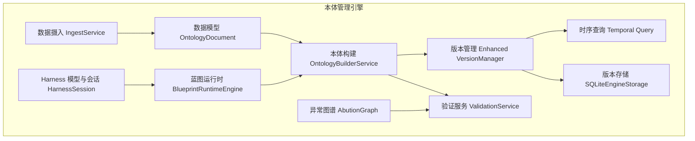

**图表来源**
- [odap/biz/core/ontology/services/ingest_service.py:330-793](file://odap/biz/core/ontology/services/ingest_service.py#L330-L793)
- [odap/biz/core/ontology/services/build_service.py:36-447](file://odap/biz/core/ontology/services/build_service.py#L36-L447)
- [odap/biz/core/ontology/services/version_service.py:84-502](file://odap/biz/core/ontology/services/version_service.py#L84-L502)
- [odap/biz/core/ontology/services/validation_service.py:8-203](file://odap/biz/core/ontology/services/validation_service.py#L8-L203)
- [odap/biz/core/ontology/schema/document.py:212-404](file://odap/biz/core/ontology/schema/document.py#L212-L404)
- [odap/biz/core/ontology/harness/blueprint/services/__init__.py:1-3](file://odap/biz/core/ontology/harness/blueprint/services/__init__.py#L1-L3)
- [odap/biz/core/ontology/harness/models/models.py:69-98](file://odap/biz/core/ontology/harness/models/models.py#L69-L98)
- [odap/biz/core/ontology/engine/api/routes.py:70-80](file://odap/biz/core/ontology/engine/api/routes.py#L70-L80)
- [odap/biz/core/ontology/engine/impl/version_manager_impl.py:62-63](file://odap/biz/core/ontology/engine/impl/version_manager_impl.py#L62-L63)

**章节来源**
- [odap/biz/core/ontology/services/ingest_service.py:1-972](file://odap/biz/core/ontology/services/ingest_service.py#L1-L972)
- [odap/biz/core/ontology/services/build_service.py:1-447](file://odap/biz/core/ontology/services/build_service.py#L1-L447)
- [odap/biz/core/ontology/services/version_service.py:1-503](file://odap/biz/core/ontology/services/version_service.py#L1-L503)
- [odap/biz/core/ontology/services/validation_service.py:1-203](file://odap/biz/core/ontology/services/validation_service.py#L1-L203)
- [odap/biz/core/ontology/schema/document.py:1-575](file://odap/biz/core/ontology/schema/document.py#L1-L575)
- [odap/biz/core/ontology/harness/blueprint/services/__init__.py:1-3](file://odap/biz/core/ontology/harness/blueprint/services/__init__.py#L1-L3)
- [odap/biz/core/ontology/harness/models/models.py:69-98](file://odap/biz/core/ontology/harness/models/models.py#L69-L98)

## 核心组件
- 数据摄入 IngestService：统一多源数据入口，负责记录生命周期、调用文档处理器、触发本体构建与版本提交。
- 本体构建 OntologyBuilderService：抽取实体/关系/事件，生成图谱节点/边，写入图数据库，并按需创建版本。
- 版本管理 Enhanced VersionManager：实现热写入 append 与稳定版本 commit 的双模式，维护版本链与快照合并，新增时序查询能力。
- 验证服务 ValidationService：基于规则引擎对本体进行质量检查，输出问题清单与修复建议。
- 数据模型 OntologyDocument：标准化四层本体结构，包含实体、关系、事件、行动、规则、约束与版本引用。
- 蓝图运行时 BlueprintRuntimeEngine：承接蓝图设计阶段产物，驱动本体构建与运行。
- 异常图谱 AbutionGraph：面向异常检测与溯源的图谱化治理能力。
- Harness 模型与会话：HarnessSession 等模型支撑蓝图工作流的阶段推进与上下文记忆。
- 时序查询 Temporal Query：基于有效时间戳的历史版本查询和恢复功能。

**更新** 版本管理器新增 `query_at_time` 方法，支持在指定时间点查询对应的本体版本，实现完整的版本追踪能力。

**章节来源**
- [odap/biz/core/ontology/services/ingest_service.py:330-793](file://odap/biz/core/ontology/services/ingest_service.py#L330-L793)
- [odap/biz/core/ontology/services/build_service.py:36-447](file://odap/biz/core/ontology/services/build_service.py#L36-L447)
- [odap/biz/core/ontology/services/version_service.py:84-502](file://odap/biz/core/ontology/services/version_service.py#L84-L502)
- [odap/biz/core/ontology/services/validation_service.py:8-203](file://odap/biz/core/ontology/services/validation_service.py#L8-L203)
- [odap/biz/core/ontology/schema/document.py:212-404](file://odap/biz/core/ontology/schema/document.py#L212-L404)
- [odap/biz/core/ontology/harness/blueprint/services/__init__.py:1-3](file://odap/biz/core/ontology/harness/blueprint/services/__init__.py#L1-L3)
- [odap/biz/core/ontology/harness/models/models.py:69-98](file://odap/biz/core/ontology/harness/models/models.py#L69-L98)

## 架构总览
本体管理引擎采用"数据摄入—本体构建—版本治理—验证—运行时"的分层架构，核心数据模型统一，版本链贯穿始终，验证与异常图谱提供质量保障与风险治理。新增的时序查询能力通过有效时间和事务时间的双时态存储，实现完整的版本追踪和历史恢复功能。

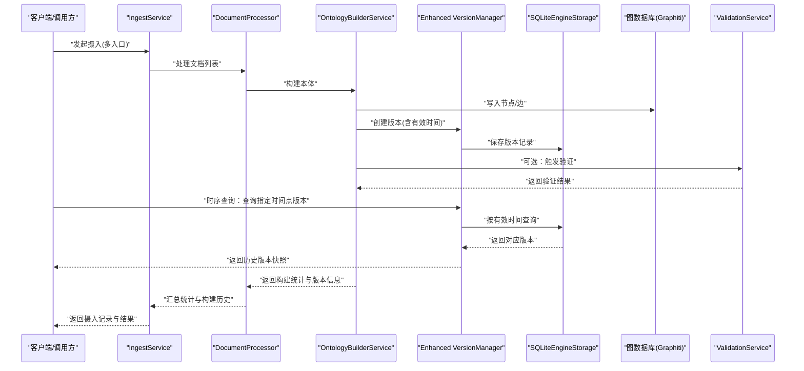

**图表来源**
- [odap/biz/core/ontology/services/ingest_service.py:262-327](file://odap/biz/core/ontology/services/ingest_service.py#L262-L327)
- [odap/biz/core/ontology/services/build_service.py:51-135](file://odap/biz/core/ontology/services/build_service.py#L51-L135)
- [odap/biz/core/ontology/services/version_service.py:152-277](file://odap/biz/core/ontology/services/version_service.py#L152-L277)
- [odap/biz/core/ontology/services/validation_service.py:92-119](file://odap/biz/core/ontology/services/validation_service.py#L92-L119)
- [odap/biz/core/ontology/engine/api/routes.py:70-80](file://odap/biz/core/ontology/engine/api/routes.py#L70-L80)
- [odap/biz/core/ontology/engine/impl/version_manager_impl.py:62-63](file://odap/biz/core/ontology/engine/impl/version_manager_impl.py#L62-L63)

## 详细组件分析

### 数据摄入管道（IngestService）
- 多入口支持：URL 抓取、新闻检索（自动/第三方）、手动录入、JSON 导入、自然语言输入、随机事件生成。
- 生命周期管理：IngestRecordBuilder/IngestRecordManager 负责记录创建、完成、失败与原始内容更新。
- 文档处理：DocumentProcessor 将 OntologyDocument 持久化并调用构建服务，收集统计与构建历史。
- LLM 客户端：在 OPENAI_API_KEY 配置下启用 LLM 辅助抽取；未配置时降级为规则抽取。
- 返回记录：统一返回摄入记录 ID，便于后续查询与追踪。

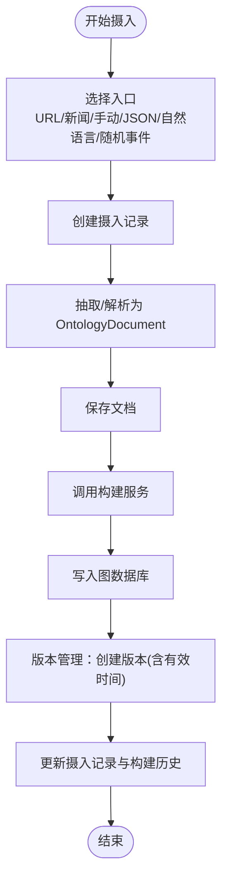

**图表来源**
- [odap/biz/core/ontology/services/ingest_service.py:373-536](file://odap/biz/core/ontology/services/ingest_service.py#L373-L536)
- [odap/biz/core/ontology/services/ingest_service.py:262-327](file://odap/biz/core/ontology/services/ingest_service.py#L262-L327)
- [odap/biz/core/ontology/services/build_service.py:256-302](file://odap/biz/core/ontology/services/build_service.py#L256-L302)

**章节来源**
- [odap/biz/core/ontology/services/ingest_service.py:330-793](file://odap/biz/core/ontology/services/ingest_service.py#L330-L793)

### 本体构建服务（OntologyBuilderService）
- 实体/关系/事件抽取：从 OntologyDocument 中提取实体、关系与事件，事件转为实体并建立参与者关系。
- 图谱元素创建：生成节点与边，填充属性与时间维度。
- 图数据库写入：通过 GraphManager 写入节点与关系，记录日志但不中断整体流程。
- 版本创建：委托版本管理器追加快照并提交新版本，返回版本信息。

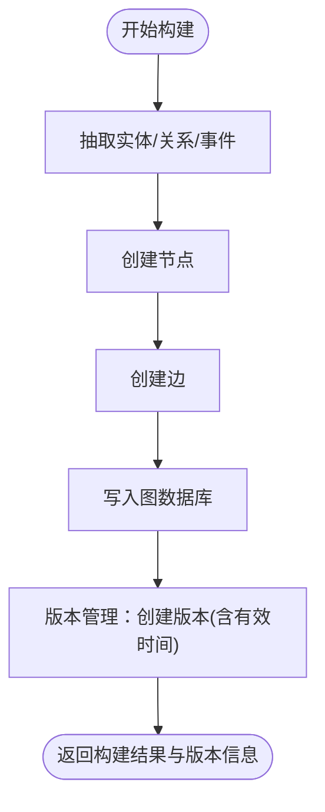

**图表来源**
- [odap/biz/core/ontology/services/build_service.py:137-210](file://odap/biz/core/ontology/services/build_service.py#L137-L210)
- [odap/biz/core/ontology/services/build_service.py:256-302](file://odap/biz/core/ontology/services/build_service.py#L256-L302)
- [odap/biz/core/ontology/services/build_service.py:303-354](file://odap/biz/core/ontology/services/build_service.py#L303-L354)

**章节来源**
- [odap/biz/core/ontology/services/build_service.py:36-447](file://odap/biz/core/ontology/services/build_service.py#L36-L447)

### 增强版本管理（Enhanced VersionManager）
- 双模式操作：
  - append：热写入自动触发，将新数据合并到当前版本快照，版本号与版本 ID 不变。
  - commit：锁定当前版本并创建新版本，版本号 minor 递增，形成版本链。
- 快照合并：按实体 ID 合并属性，去重关系与事件 ID。
- 历史追踪：记录实体历史快照，支持跨版本追溯。
- 查询接口：获取版本、差异对比、最新版本 ID、按本体列出版本等。
- **新增时序查询**：支持基于有效时间戳的历史版本查询和恢复。

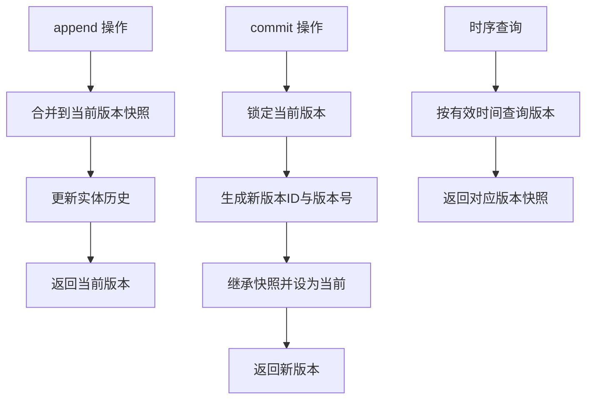

**图表来源**
- [odap/biz/core/ontology/services/version_service.py:152-204](file://odap/biz/core/ontology/services/version_service.py#L152-L204)
- [odap/biz/core/ontology/services/version_service.py:206-277](file://odap/biz/core/ontology/services/version_service.py#L206-L277)
- [odap/biz/core/ontology/services/version_service.py:330-373](file://odap/biz/core/ontology/services/version_service.py#L330-L373)
- [odap/biz/core/ontology/engine/impl/version_manager_impl.py:62-63](file://odap/biz/core/ontology/engine/impl/version_manager_impl.py#L62-L63)

**章节来源**
- [odap/biz/core/ontology/services/version_service.py:84-502](file://odap/biz/core/ontology/services/version_service.py#L84-L502)
- [odap/biz/core/ontology/engine/impl/version_manager_impl.py:13-76](file://odap/biz/core/ontology/engine/impl/version_manager_impl.py#L13-L76)

### 版本管理器接口与实现
- **接口定义**：IVersionManager 定义了版本管理的核心方法，包括创建、获取、列表、回滚、对比、合并和历史查询。
- **实现类**：VersionManagerImpl 提供完整的版本管理功能，支持有效时间和事务时间的双时态存储。
- **存储层**：SQLiteEngineStorage 负责版本数据的持久化，支持按时间范围查询和版本对比。

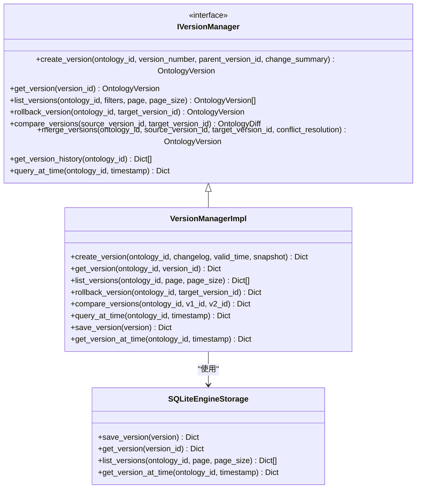

**图表来源**
- [odap/biz/core/ontology/interfaces/version.py:11-113](file://odap/biz/core/ontology/interfaces/version.py#L11-L113)
- [odap/biz/core/ontology/engine/impl/version_manager_impl.py:9-76](file://odap/biz/core/ontology/engine/impl/version_manager_impl.py#L9-L76)
- [odap/biz/core/ontology/engine/storage/sqlite_engine_storage.py:7-279](file://odap/biz/core/ontology/engine/storage/sqlite_engine_storage.py#L7-L279)

**章节来源**
- [odap/biz/core/ontology/interfaces/version.py:1-113](file://odap/biz/core/ontology/interfaces/version.py#L1-L113)
- [odap/biz/core/ontology/engine/impl/version_manager_impl.py:1-76](file://odap/biz/core/ontology/engine/impl/version_manager_impl.py#L1-L76)
- [odap/biz/core/ontology/engine/storage/sqlite_engine_storage.py:1-279](file://odap/biz/core/ontology/engine/storage/sqlite_engine_storage.py#L1-L279)

### 时序查询功能
- **API 端点**：新增 `/versions/temporal-query` 端点，支持基于时间戳的历史版本查询。
- **查询逻辑**：通过有效时间戳查询对应的版本记录，返回该时间点的本体快照。
- **前端集成**：前端版本管理界面新增时序查询功能，支持时间选择器和历史版本展示。
- **存储优化**：SQLiteEngineStorage 优化查询性能，支持有效时间范围的快速检索。

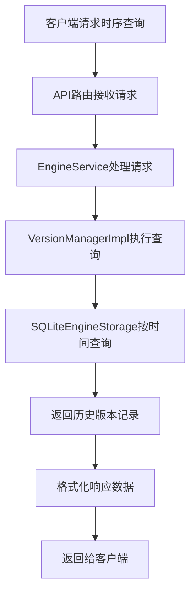

**图表来源**
- [odap/biz/core/ontology/engine/api/routes.py:70-80](file://odap/biz/core/ontology/engine/api/routes.py#L70-L80)
- [odap/biz/core/ontology/engine/services/engine_service.py:47-51](file://odap/biz/core/ontology/engine/services/engine_service.py#L47-L51)
- [odap/biz/core/ontology/engine/storage/sqlite_engine_storage.py:117-129](file://odap/biz/core/ontology/engine/storage/sqlite_engine_storage.py#L117-L129)

**章节来源**
- [odap/biz/core/ontology/engine/api/routes.py:70-80](file://odap/biz/core/ontology/engine/api/routes.py#L70-L80)
- [odap/biz/core/ontology/engine/services/engine_service.py:47-51](file://odap/biz/core/ontology/engine/services/engine_service.py#L47-L51)
- [odap/biz/core/ontology/engine/storage/sqlite_engine_storage.py:117-129](file://odap/biz/core/ontology/engine/storage/sqlite_engine_storage.py#L117-L129)

### 验证服务（ValidationService）
- 规则管理：添加、查询、列举验证规则，支持分页与过滤。
- 本体检索：对指定本体执行验证，返回统计与问题明细。
- 问题修复：针对具体问题执行修复动作。
- 模型支撑：ValidationRule、ValidationResult、ValidationIssue。

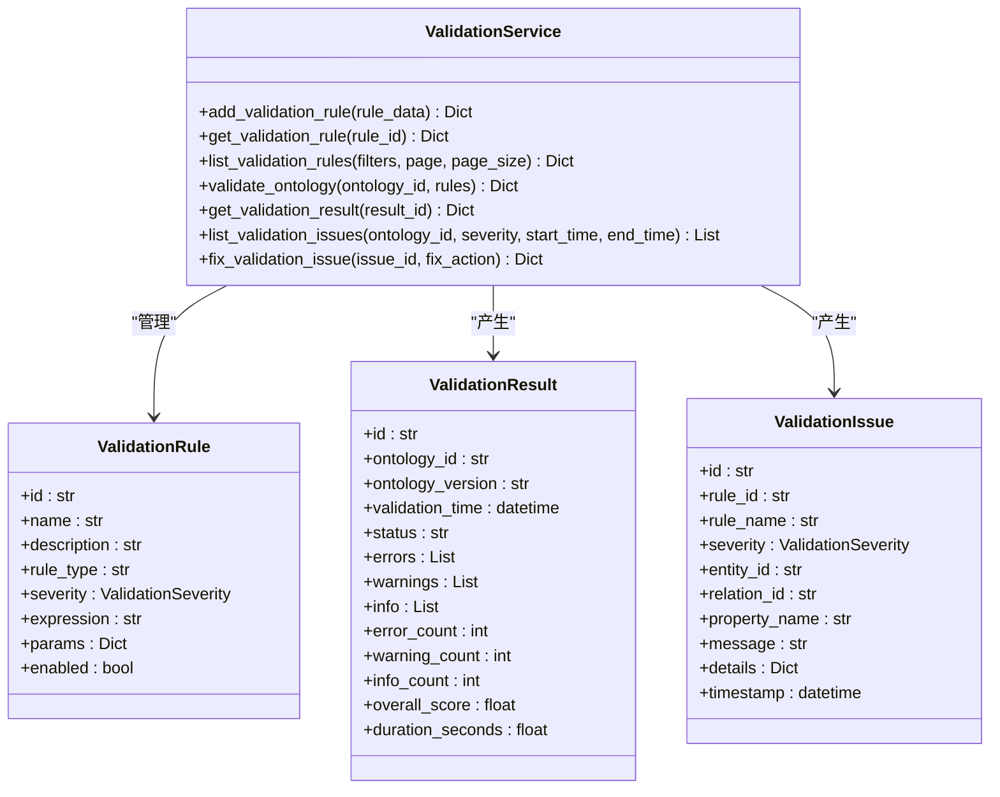

**图表来源**
- [odap/biz/core/ontology/services/validation_service.py:8-203](file://odap/biz/core/ontology/services/validation_service.py#L8-L203)
- [odap/biz/core/ontology/models/validation.py:10-58](file://odap/biz/core/ontology/models/validation.py#L10-L58)

**章节来源**
- [odap/biz/core/ontology/services/validation_service.py:8-203](file://odap/biz/core/ontology/services/validation_service.py#L8-L203)
- [odap/biz/core/ontology/models/validation.py:1-58](file://odap/biz/core/ontology/models/validation.py#L1-L58)

### 数据模型（OntologyDocument）
- 四层本体结构：实体（basic/statistical/capabilities/constraints）、关系（含时间维度）、事件、行动、规则、约束。
- 版本引用：VersionRef 指向版本链，支持 parent_version 指针。
- 序列化与反序列化：to_dict/to_json/from_dict/from_json。
- 转换与摘要：to_episode_text 输出人机可读摘要，extract_relations 生成边列表。

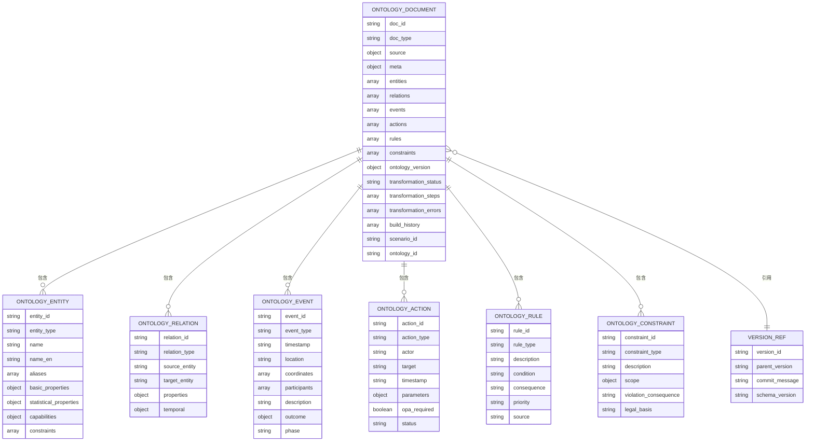

**图表来源**
- [odap/biz/core/ontology/schema/document.py:212-404](file://odap/biz/core/ontology/schema/document.py#L212-L404)

**章节来源**
- [odap/biz/core/ontology/schema/document.py:1-575](file://odap/biz/core/ontology/schema/document.py#L1-L575)

### 蓝图运行时与Harness
- BlueprintRuntimeEngine：蓝图运行时实例入口，承接蓝图设计阶段产物并驱动构建。
- HarnessSession：Harness 工作流会话模型，包含阶段、结果、Agent任务、上下文记忆等。
- BlueprintNode：蓝图节点模型，描述节点类型、标签、阶段与配置。

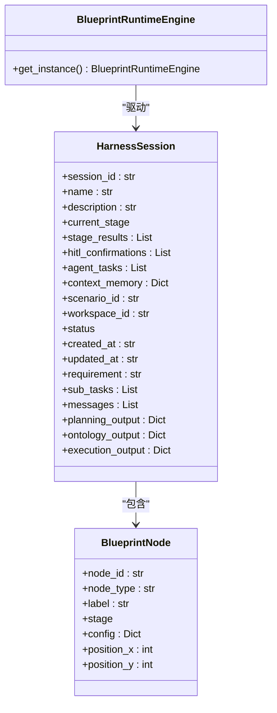

**图表来源**
- [odap/biz/core/ontology/harness/blueprint/services/__init__.py:1-3](file://odap/biz/core/ontology/harness/blueprint/services/__init__.py#L1-L3)
- [odap/biz/core/ontology/harness/models/models.py:69-98](file://odap/biz/core/ontology/harness/models/models.py#L69-L98)

**章节来源**
- [odap/biz/core/ontology/harness/blueprint/services/__init__.py:1-3](file://odap/biz/core/ontology/harness/blueprint/services/__init__.py#L1-L3)
- [odap/biz/core/ontology/harness/models/models.py:69-98](file://odap/biz/core/ontology/harness/models/models.py#L69-L98)

### 异常图谱（AbutionGraph）
- 作用：面向异常检测与溯源的图谱化治理能力，结合验证服务与版本链进行问题定位与回溯。
- 与验证联动：验证服务输出的问题可映射到异常图谱节点/边，形成治理闭环。

（本节为概念性说明，不直接分析具体代码文件）

## 依赖分析
- 组件耦合：
  - IngestService 依赖 DocumentProcessor 与 OntologyBuilderService；后者依赖 GraphManager 与 Enhanced VersionManager。
  - ValidationService 依赖 ValidationEngine 与规则模型。
  - BlueprintRuntimeEngine 与 HarnessSession 为上层编排与会话管理。
  - **新增依赖**：时序查询功能依赖 SQLiteEngineStorage 的时间查询能力。
- 外部依赖：
  - LLM 客户端（在配置存在时启用）。
  - 图数据库（Graphiti）写入。
  - SQLite 存储（版本快照与摄入记录）。

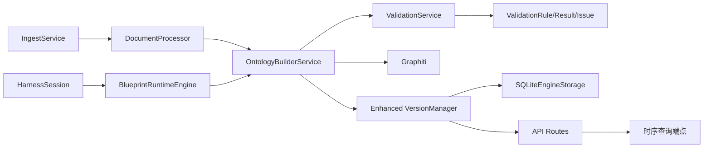

**图表来源**
- [odap/biz/core/ontology/services/ingest_service.py:330-352](file://odap/biz/core/ontology/services/ingest_service.py#L330-L352)
- [odap/biz/core/ontology/services/build_service.py:47-49](file://odap/biz/core/ontology/services/build_service.py#L47-L49)
- [odap/biz/core/ontology/services/version_service.py:100-105](file://odap/biz/core/ontology/services/version_service.py#L100-L105)
- [odap/biz/core/ontology/services/validation_service.py:8-12](file://odap/biz/core/ontology/services/validation_service.py#L8-L12)
- [odap/biz/core/ontology/harness/blueprint/services/__init__.py:1-3](file://odap/biz/core/ontology/harness/blueprint/services/__init__.py#L1-L3)
- [odap/biz/core/ontology/harness/models/models.py:69-98](file://odap/biz/core/ontology/harness/models/models.py#L69-L98)
- [odap/biz/core/ontology/engine/api/routes.py:70-80](file://odap/biz/core/ontology/engine/api/routes.py#L70-L80)
- [odap/biz/core/ontology/engine/impl/version_manager_impl.py:13-76](file://odap/biz/core/ontology/engine/impl/version_manager_impl.py#L13-L76)

**章节来源**
- [odap/biz/core/ontology/services/ingest_service.py:330-352](file://odap/biz/core/ontology/services/ingest_service.py#L330-L352)
- [odap/biz/core/ontology/services/build_service.py:47-49](file://odap/biz/core/ontology/services/build_service.py#L47-L49)
- [odap/biz/core/ontology/services/version_service.py:100-105](file://odap/biz/core/ontology/services/version_service.py#L100-L105)
- [odap/biz/core/ontology/services/validation_service.py:8-12](file://odap/biz/core/ontology/services/validation_service.py#L8-L12)
- [odap/biz/core/ontology/harness/blueprint/services/__init__.py:1-3](file://odap/biz/core/ontology/harness/blueprint/services/__init__.py#L1-L3)
- [odap/biz/core/ontology/harness/models/models.py:69-98](file://odap/biz/core/ontology/harness/models/models.py#L69-L98)

## 性能考虑
- LLM 客户端按需初始化：在未配置 OPENAI_API_KEY 时降级为规则抽取，避免不必要的初始化开载。
- 图写入幂等与容错：图写入失败仅记录警告，不影响整体流程，提升吞吐稳定性。
- 版本快照合并：append 模式采用增量合并，减少大文档全量写入成本。
- 并行化潜力：摄入入口与文档处理可并行化，建议在高并发场景下引入队列与限流。
- 存储优化：SQLite 存储版本快照，建议定期清理历史与归档，控制文件大小。
- **时序查询优化**：SQLiteEngineStorage 为版本查询建立索引，支持有效时间范围的快速检索。
- **前端缓存**：前端版本管理界面缓存查询结果，减少重复请求。

（本节为通用性能建议，不直接分析具体代码文件）

## 故障排查指南
- 摄入失败：检查摄入记录状态与错误字段，确认 LLM 客户端是否正确初始化，以及外部搜索/抓取服务可用性。
- 构建失败：查看构建进度与错误列表，定位实体/关系抽取与图写入阶段的具体异常。
- 版本创建失败：确认版本管理器初始化与 SQLite 存储可用性，检查快照合并逻辑与实体历史记录。
- 验证问题：根据验证结果中的问题清单逐项修复，必要时调整规则或数据。
- **时序查询失败**：检查有效时间戳格式，确认版本记录中有效时间字段是否正确设置，验证 SQLite 查询索引是否正常。

**章节来源**
- [odap/biz/core/ontology/services/ingest_service.py:212-231](file://odap/biz/core/ontology/services/ingest_service.py#L212-L231)
- [odap/biz/core/ontology/services/build_service.py:126-135](file://odap/biz/core/ontology/services/build_service.py#L126-L135)
- [odap/biz/core/ontology/services/version_service.py:344-354](file://odap/biz/core/ontology/services/version_service.py#L344-L354)
- [odap/biz/core/ontology/services/validation_service.py:187-202](file://odap/biz/core/ontology/services/validation_service.py#L187-L202)

## 结论
本体管理引擎通过标准化数据模型与版本链机制，实现了从多源数据到图谱的高效构建与治理。配合验证与异常图谱，形成质量与风险双保障。蓝图运行时与 Harness 桥接进一步提升了可扩展性与协作效率。

**更新** 新增的时序查询能力显著增强了版本管理系统的追踪和恢复能力，通过有效时间和事务时间的双时态存储，实现了完整的版本历史查询和恢复功能。建议在实际部署中关注 LLM 客户端配置、图写入容错、版本快照存储策略和时序查询性能优化，持续提升吞吐与稳定性。

## 附录
- API/路由注册：Web 应用集中注册本体相关路由（摄入、构建、版本、验证、异常图谱、状态机等），便于统一接入与监控。**新增时序查询路由**。
- 模块导出：核心服务通过 __init__.py 暴露统一接口，便于上层调用与测试。
- **前端集成**：前端版本管理界面新增时序查询功能，支持时间选择器和历史版本展示。

**章节来源**
- [odap/web/app.py:42-57](file://odap/web/app.py#L42-L57)
- [odap/biz/core/ontology/__init__.py:1-19](file://odap/biz/core/ontology/__init__.py#L1-L19)
- [odap/biz/core/ontology/engine/api/routes.py:70-80](file://odap/biz/core/ontology/engine/api/routes.py#L70-L80)
- [frontend/src/modules/ontology/stores/versionStore.ts:104-117](file://frontend/src/modules/ontology/stores/versionStore.ts#L104-L117)