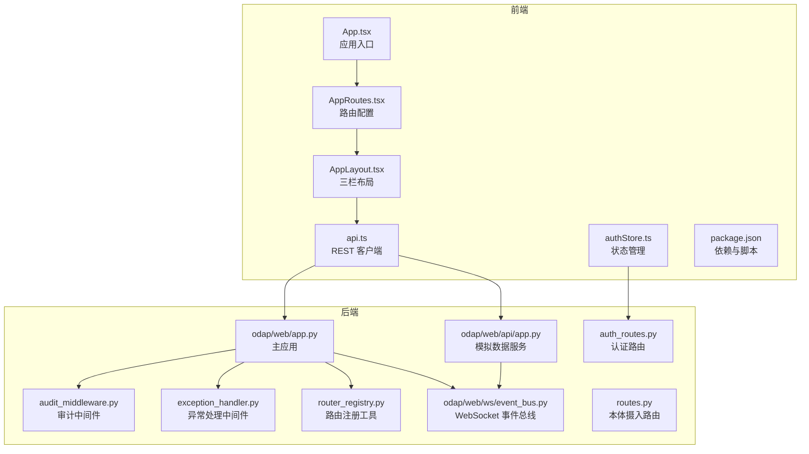
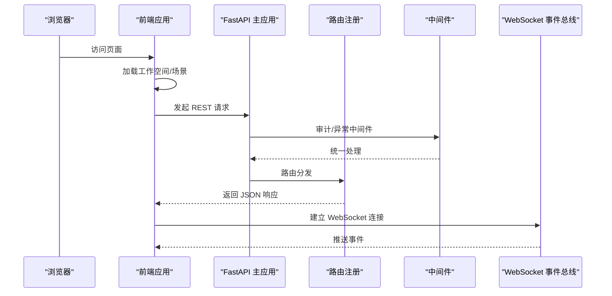
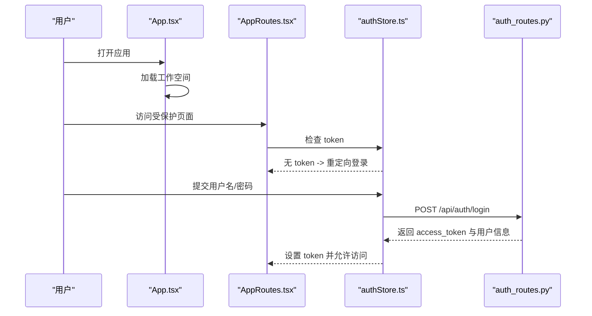
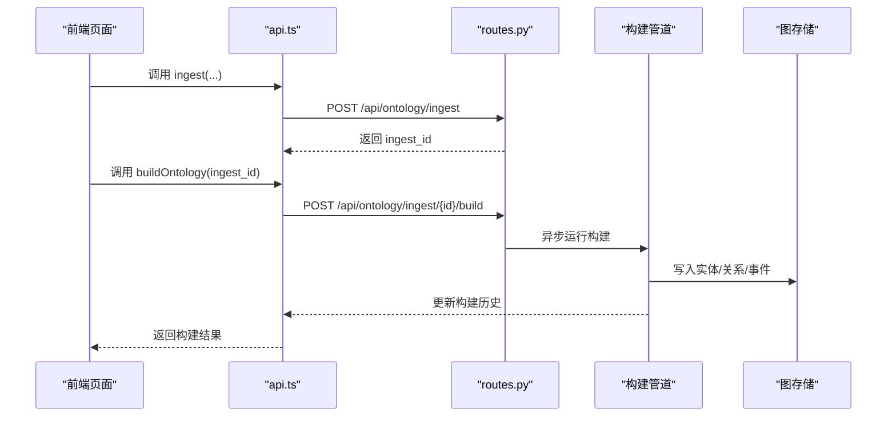
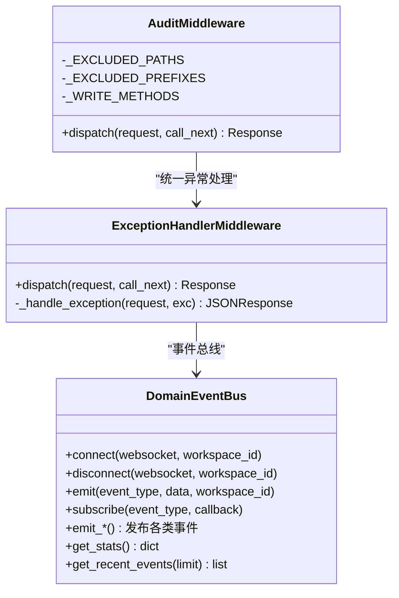
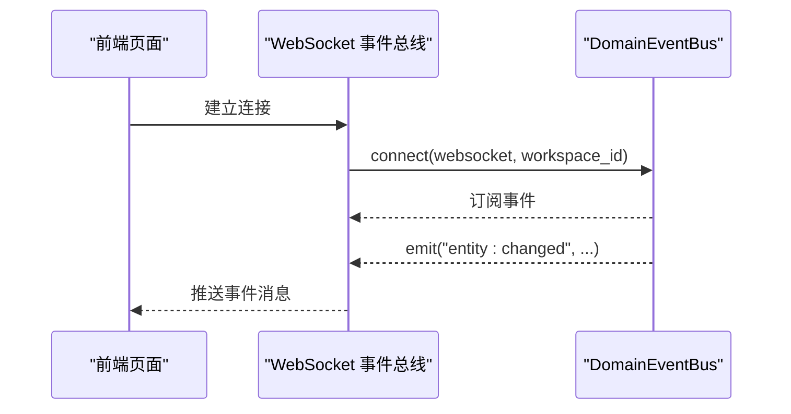
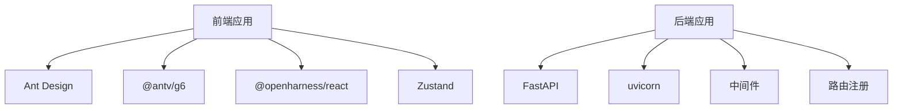

# L5-L6 接口层

<cite>
**本文档引用的文件**
- [frontend/src/App.tsx](file://frontend/src/App.tsx)
- [frontend/src/AppRoutes.tsx](file://frontend/src/AppRoutes.tsx)
- [frontend/src/modules/shared/components/AppLayout.tsx](file://frontend/src/modules/shared/components/AppLayout.tsx)
- [frontend/src/modules/shared/services/api.ts](file://frontend/src/modules/shared/services/api.ts)
- [frontend/src/modules/shared/stores/authStore.ts](file://frontend/src/modules/shared/stores/authStore.ts)
- [frontend/package.json](file://frontend/package.json)
- [odap/web/app.py](file://odap/web/app.py)
- [odap/web/api/app.py](file://odap/web/api/app.py)
- [odap/web/ws/event_bus.py](file://odap/web/ws/event_bus.py)
- [odap/web/router_registry.py](file://odap/web/router_registry.py)
- [odap/infra/middleware/audit_middleware.py](file://odap/infra/middleware/audit_middleware.py)
- [odap/infra/middleware/exception_handler.py](file://odap/infra/middleware/exception_handler.py)
- [odap/infra/security/auth_routes.py](file://odap/infra/security/auth_routes.py)
- [odap/biz/core/ontology/api/routes.py](file://odap/biz/core/ontology/api/routes.py)
- [docs/01-product-design/webui-enhancement-design.md](file://docs/01-product-design/webui-enhancement-design.md)
</cite>

## 目录
1. [简介](#简介)
2. [项目结构](#项目结构)
3. [核心组件](#核心组件)
4. [架构总览](#架构总览)
5. [详细组件分析](#详细组件分析)
6. [依赖分析](#依赖分析)
7. [性能考虑](#性能考虑)
8. [故障排除指南](#故障排除指南)
9. [结论](#结论)
10. [附录](#附录)

## 简介
本文件面向 ODAP 平台的 L5-L6 接口层，系统性梳理前端界面架构、管理后台设计与 API 端点实现。文档覆盖 React 前端应用的组件体系、状态管理与用户交互设计；同时解释 FastAPI 后端服务的路由架构、中间件机制与 API 设计规范，并提供 RESTful API 接口文档、WebSocket 实时通信、前端组件库与 UI 设计系统说明，以及接口使用示例、前端开发指南与后端服务部署方案。

## 项目结构
ODAP 平台采用前后端分离架构：
- 前端：基于 React 19 + Vite + Ant Design + Zustand，提供三栏布局、工作空间/场景上下文、右侧面板扩展能力。
- 后端：基于 FastAPI，采用模块化路由注册、中间件统一处理异常与审计、WebSocket 事件总线支持实时通信。

**图表来源**
- [frontend/src/App.tsx:1-65](file://frontend/src/App.tsx#L1-L65)
- [frontend/src/AppRoutes.tsx:1-61](file://frontend/src/AppRoutes.tsx#L1-L61)
- [frontend/src/modules/shared/components/AppLayout.tsx:1-712](file://frontend/src/modules/shared/components/AppLayout.tsx#L1-L712)
- [frontend/src/modules/shared/services/api.ts:1-800](file://frontend/src/modules/shared/services/api.ts#L1-L800)
- [frontend/src/modules/shared/stores/authStore.ts:1-148](file://frontend/src/modules/shared/stores/authStore.ts#L1-L148)
- [frontend/package.json:1-55](file://frontend/package.json#L1-L55)
- [odap/web/app.py:1-262](file://odap/web/app.py#L1-L262)
- [odap/web/api/app.py:1-862](file://odap/web/api/app.py#L1-L862)
- [odap/web/ws/event_bus.py:1-147](file://odap/web/ws/event_bus.py#L1-L147)
- [odap/web/router_registry.py:1-98](file://odap/web/router_registry.py#L1-L98)
- [odap/infra/middleware/audit_middleware.py:1-112](file://odap/infra/middleware/audit_middleware.py#L1-L112)
- [odap/infra/middleware/exception_handler.py:1-137](file://odap/infra/middleware/exception_handler.py#L1-L137)
- [odap/infra/security/auth_routes.py:1-143](file://odap/infra/security/auth_routes.py#L1-L143)
- [odap/biz/core/ontology/api/routes.py:1-527](file://odap/biz/core/ontology/api/routes.py#L1-L527)

**章节来源**
- [frontend/src/App.tsx:1-65](file://frontend/src/App.tsx#L1-L65)
- [frontend/src/AppRoutes.tsx:1-61](file://frontend/src/AppRoutes.tsx#L1-L61)
- [frontend/src/modules/shared/components/AppLayout.tsx:1-712](file://frontend/src/modules/shared/components/AppLayout.tsx#L1-L712)
- [frontend/src/modules/shared/services/api.ts:1-800](file://frontend/src/modules/shared/services/api.ts#L1-L800)
- [frontend/src/modules/shared/stores/authStore.ts:1-148](file://frontend/src/modules/shared/stores/authStore.ts#L1-L148)
- [frontend/package.json:1-55](file://frontend/package.json#L1-L55)
- [odap/web/app.py:1-262](file://odap/web/app.py#L1-L262)
- [odap/web/api/app.py:1-862](file://odap/web/api/app.py#L1-L862)
- [odap/web/ws/event_bus.py:1-147](file://odap/web/ws/event_bus.py#L1-L147)
- [odap/web/router_registry.py:1-98](file://odap/web/router_registry.py#L1-L98)
- [odap/infra/middleware/audit_middleware.py:1-112](file://odap/infra/middleware/audit_middleware.py#L1-L112)
- [odap/infra/middleware/exception_handler.py:1-137](file://odap/infra/middleware/exception_handler.py#L1-L137)
- [odap/infra/security/auth_routes.py:1-143](file://odap/infra/security/auth_routes.py#L1-L143)
- [odap/biz/core/ontology/api/routes.py:1-527](file://odap/biz/core/ontology/api/routes.py#L1-L527)

## 核心组件
- 前端应用入口与路由
  - 应用入口负责加载工作空间、处理登录状态与布局包裹，路由系统提供受保护页面与登录页。
- 三栏布局组件
  - 左侧导航菜单、顶部工作空间/场景选择、右侧扩展面板，支持折叠与动态内容更新。
- REST 客户端与状态管理
  - 统一的 API 客户端封装场景、本体摄入、版本管理、审计日志、查询等接口；Zustand 管理认证状态。
- 后端主应用与中间件
  - FastAPI 主应用集中注册各模块路由，配置 CORS、审计中间件与异常处理中间件；提供健康检查与性能监控端点。
- WebSocket 事件总线
  - 支持实体变更、情报更新、动作结果、OA DP 进度、OPA 校验、审计事件等事件广播与订阅。

**章节来源**
- [frontend/src/App.tsx:1-65](file://frontend/src/App.tsx#L1-L65)
- [frontend/src/AppRoutes.tsx:1-61](file://frontend/src/AppRoutes.tsx#L1-L61)
- [frontend/src/modules/shared/components/AppLayout.tsx:1-712](file://frontend/src/modules/shared/components/AppLayout.tsx#L1-L712)
- [frontend/src/modules/shared/services/api.ts:1-800](file://frontend/src/modules/shared/services/api.ts#L1-L800)
- [frontend/src/modules/shared/stores/authStore.ts:1-148](file://frontend/src/modules/shared/stores/authStore.ts#L1-L148)
- [odap/web/app.py:1-262](file://odap/web/app.py#L1-L262)
- [odap/web/ws/event_bus.py:1-147](file://odap/web/ws/event_bus.py#L1-L147)

## 架构总览
ODAP 接口层采用“前端三栏布局 + 后端模块化路由”的分层设计，前端通过 REST 与 WebSocket 与后端交互，后端通过中间件统一处理安全与可观测性。

**图表来源**
- [frontend/src/App.tsx:1-65](file://frontend/src/App.tsx#L1-L65)
- [frontend/src/modules/shared/components/AppLayout.tsx:1-712](file://frontend/src/modules/shared/components/AppLayout.tsx#L1-L712)
- [odap/web/app.py:1-262](file://odap/web/app.py#L1-L262)
- [odap/web/ws/event_bus.py:1-147](file://odap/web/ws/event_bus.py#L1-L147)
- [odap/web/router_registry.py:1-98](file://odap/web/router_registry.py#L1-L98)
- [odap/infra/middleware/audit_middleware.py:1-112](file://odap/infra/middleware/audit_middleware.py#L1-L112)
- [odap/infra/middleware/exception_handler.py:1-137](file://odap/infra/middleware/exception_handler.py#L1-L137)

## 详细组件分析

### 前端应用与路由
- 应用入口
  - 在非登录页时加载工作空间列表并设置当前工作空间，支持本地存储持久化。
- 路由系统
  - 使用受保护路由包装，未登录自动跳转至登录页；提供多模块页面路由（本体、业务、技能、模拟、知识、工作空间、角色、策略、审计、智能体管理等）。
- 登录与认证
  - 通过认证接口获取令牌与用户信息，Zustand 管理 token、用户与角色切换。

**图表来源**
- [frontend/src/App.tsx:1-65](file://frontend/src/App.tsx#L1-L65)
- [frontend/src/AppRoutes.tsx:1-61](file://frontend/src/AppRoutes.tsx#L1-L61)
- [frontend/src/modules/shared/stores/authStore.ts:1-148](file://frontend/src/modules/shared/stores/authStore.ts#L1-L148)
- [odap/infra/security/auth_routes.py:1-143](file://odap/infra/security/auth_routes.py#L1-L143)

**章节来源**
- [frontend/src/App.tsx:1-65](file://frontend/src/App.tsx#L1-L65)
- [frontend/src/AppRoutes.tsx:1-61](file://frontend/src/AppRoutes.tsx#L1-L61)
- [frontend/src/modules/shared/stores/authStore.ts:1-148](file://frontend/src/modules/shared/stores/authStore.ts#L1-L148)
- [odap/infra/security/auth_routes.py:1-143](file://odap/infra/security/auth_routes.py#L1-L143)

### 三栏布局与右侧面板
- 布局职责
  - 左侧：一级菜单与二级子菜单，支持折叠；顶部显示工作空间/场景选择与用户信息。
  - 主内容区：功能页面承载。
  - 右侧：扩展面板，支持动态内容与标题更新，可折叠。
- 上下文与状态
  - 工作空间/场景上下文通过 Context 提供；右侧面板通过 Context 控制显示与内容。
- 交互设计
  - 支持模式切换（我的智能体/管理后台）、菜单展开/折叠、右侧面板开关。

**图表来源**
- [frontend/src/modules/shared/components/AppLayout.tsx:1-712](file://frontend/src/modules/shared/components/AppLayout.tsx#L1-L712)

**章节来源**
- [frontend/src/modules/shared/components/AppLayout.tsx:1-712](file://frontend/src/modules/shared/components/AppLayout.tsx#L1-L712)

### REST 客户端与 API 封装
- 统一客户端
  - 通过 API 基础地址聚合场景、本体摄入、版本管理、审计日志、查询等接口，提供类型安全的返回值与错误处理。
- 本体摄入接口
  - 支持新闻、手动录入、JSON、自然语言、随机生成等多种摄入方式，统一入口与历史查询、构建状态跟踪。
- 工作空间与审计
  - 提供工作空间 CRUD、激活/停用、审计事件查询与统计等接口。

**图表来源**
- [frontend/src/modules/shared/services/api.ts:1-800](file://frontend/src/modules/shared/services/api.ts#L1-L800)
- [odap/biz/core/ontology/api/routes.py:1-527](file://odap/biz/core/ontology/api/routes.py#L1-L527)

**章节来源**
- [frontend/src/modules/shared/services/api.ts:1-800](file://frontend/src/modules/shared/services/api.ts#L1-L800)
- [odap/biz/core/ontology/api/routes.py:1-527](file://odap/biz/core/ontology/api/routes.py#L1-L527)

### 后端路由架构与中间件机制
- 路由注册
  - 主应用集中注册各模块路由（本体摄入、工作空间、角色、审计、技能、Hook、MCP、事件模拟、前端兼容、Agent、智能体管理、知识库、OMS、对象服务、动作、感知、决策、沙箱、业务、策略、会话记忆、数据仓库、查询、QA、认知、反馈等）。
- 中间件
  - 审计中间件：仅对写操作记录审计日志，排除文档与静态资源路径。
  - 异常处理中间件：统一捕获未处理异常，返回标准化错误响应。
- WebSocket 事件总线
  - 支持实体变更、情报更新、动作结果、OA DP 进度、OPA 校验、审计事件等事件广播，维护客户端集合与事件历史。

**图表来源**
- [odap/infra/middleware/audit_middleware.py:1-112](file://odap/infra/middleware/audit_middleware.py#L1-L112)
- [odap/infra/middleware/exception_handler.py:1-137](file://odap/infra/middleware/exception_handler.py#L1-L137)
- [odap/web/ws/event_bus.py:1-147](file://odap/web/ws/event_bus.py#L1-L147)

**章节来源**
- [odap/web/app.py:1-262](file://odap/web/app.py#L1-L262)
- [odap/web/router_registry.py:1-98](file://odap/web/router_registry.py#L1-L98)
- [odap/infra/middleware/audit_middleware.py:1-112](file://odap/infra/middleware/audit_middleware.py#L1-L112)
- [odap/infra/middleware/exception_handler.py:1-137](file://odap/infra/middleware/exception_handler.py#L1-L137)
- [odap/web/ws/event_bus.py:1-147](file://odap/web/ws/event_bus.py#L1-L147)

### WebSocket 实时通信
- 事件总线
  - 维护 WebSocket 客户端集合、按工作空间分组、事件历史与订阅回调；支持实体变更、情报更新、动作结果、OA DP 进度、OPA 校验、审计事件等事件类型。
- 使用场景
  - 本体图谱更新、摄入进度、构建状态、策略推演结果等实时推送。

**图表来源**
- [odap/web/ws/event_bus.py:1-147](file://odap/web/ws/event_bus.py#L1-L147)

**章节来源**
- [odap/web/ws/event_bus.py:1-147](file://odap/web/ws/event_bus.py#L1-L147)

### API 设计规范与接口文档
- RESTful 设计
  - 统一前缀与命名：/api/模块/资源，如 /api/ontology/ingest、/api/workspaces、/api/audit 等。
  - 标准化响应：成功返回资源对象或数组，错误返回统一错误结构。
- 认证与授权
  - JWT 令牌认证，支持刷新与用户管理；部分路由需管理员权限。
- 本体摄入与构建
  - 支持多种摄入源与构建触发，提供摄入历史、构建历史、处理日志与版本回滚。
- 查询与导出
  - 支持实体/关系查询、复杂条件查询、查询历史与导出。

**章节来源**
- [odap/biz/core/ontology/api/routes.py:1-527](file://odap/biz/core/ontology/api/routes.py#L1-L527)
- [odap/infra/security/auth_routes.py:1-143](file://odap/infra/security/auth_routes.py#L1-L143)
- [odap/web/router_registry.py:1-98](file://odap/web/router_registry.py#L1-L98)

## 依赖分析
- 前端依赖
  - React 19、Ant Design 6、@antv/g6、@openharness/react、Zustand 等，支撑三栏布局、图可视化与状态管理。
- 后端依赖
  - FastAPI、uvicorn、CORS、中间件与模块化路由注册，支撑统一的 API 网关与可观测性。

**图表来源**
- [frontend/package.json:1-55](file://frontend/package.json#L1-L55)
- [odap/web/app.py:1-262](file://odap/web/app.py#L1-L262)

**章节来源**
- [frontend/package.json:1-55](file://frontend/package.json#L1-L55)
- [odap/web/app.py:1-262](file://odap/web/app.py#L1-L262)

## 性能考虑
- 前端
  - 图谱渲染：大图建议采用虚拟化、分页加载与布局优化；合理使用缓存与防抖。
  - 状态管理：Zustand 轻量高效，避免不必要的全局订阅。
- 后端
  - 异步构建：摄入完成后立即返回，后台异步执行构建，降低请求延迟。
  - 中间件：审计与异常中间件仅处理必要路径，避免对读操作产生额外开销。
  - WebSocket：维护客户端集合与事件历史上限，定期清理无效连接。

[本节为通用指导，无需特定文件引用]

## 故障排除指南
- 认证失败
  - 检查 token 是否存在与过期；确认 /api/auth/login 返回的 access_token 与 refresh_token。
- 审计日志未记录
  - 确认审计中间件已注册且请求路径不在排除列表中；仅写操作会被记录。
- 异常响应
  - 查看异常处理中间件返回的统一错误结构，定位具体错误类型与请求 ID。
- WebSocket 连接问题
  - 检查事件总线连接与断开逻辑，确认客户端集合清理与广播流程。

**章节来源**
- [odap/infra/middleware/audit_middleware.py:1-112](file://odap/infra/middleware/audit_middleware.py#L1-L112)
- [odap/infra/middleware/exception_handler.py:1-137](file://odap/infra/middleware/exception_handler.py#L1-L137)
- [odap/web/ws/event_bus.py:1-147](file://odap/web/ws/event_bus.py#L1-L147)

## 结论
ODAP 平台 L5-L6 接口层通过清晰的前端三栏布局与后端模块化路由，实现了从数据摄入到本体构建、从问答到执行建议的端到端流程。前端以 React 生态为基础，后端以 FastAPI 为核心，配合中间件与 WebSocket 实现实时通信与统一的可观测性。该架构具备良好的扩展性与可维护性，适合在多场景与多角色的复杂业务环境中持续演进。

[本节为总结性内容，无需特定文件引用]

## 附录

### 接口使用示例（摘要）
- 登录
  - POST /api/auth/login
  - 返回 access_token、refresh_token 与用户信息。
- 场景管理
  - GET /api/scenarios
  - POST /api/scenarios
  - GET /api/scenarios/{id}
  - POST /api/scenarios/{id}/sync
- 本体摄入
  - POST /api/ontology/ingest
  - POST /api/ontology/ingest/{id}/build
- 审计日志
  - GET /api/audit/events
  - GET /api/audit/stats
- 查询
  - POST /api/query/entities
  - POST /api/query/relations
  - POST /api/query/complex

**章节来源**
- [odap/infra/security/auth_routes.py:1-143](file://odap/infra/security/auth_routes.py#L1-L143)
- [odap/biz/core/ontology/api/routes.py:1-527](file://odap/biz/core/ontology/api/routes.py#L1-L527)
- [frontend/src/modules/shared/services/api.ts:1-800](file://frontend/src/modules/shared/services/api.ts#L1-L800)

### 前端开发指南
- 三栏布局
  - 使用 AppLayout 提供的工作空间/场景上下文与右侧面板 Hook，实现动态内容更新。
- 组件库与 UI 设计
  - 基于 Ant Design 6，结合 @antv/g6 实现图谱可视化；参考设计文档中的三栏布局与右侧面板规范。
- 状态管理
  - 使用 Zustand 管理认证状态与角色切换；避免跨页面共享的全局状态污染。

**章节来源**
- [frontend/src/modules/shared/components/AppLayout.tsx:1-712](file://frontend/src/modules/shared/components/AppLayout.tsx#L1-L712)
- [frontend/src/modules/shared/stores/authStore.ts:1-148](file://frontend/src/modules/shared/stores/authStore.ts#L1-L148)
- [docs/01-product-design/webui-enhancement-design.md:1-627](file://docs/01-product-design/webui-enhancement-design.md#L1-L627)

### 后端服务部署方案
- 主应用
  - 使用 uvicorn 运行 odap/web/app.py；配置 CORS 与中间件；通过路由注册工具集中注册模块路由。
- 模拟数据服务
  - odap/web/api/app.py 提供模拟数据生成与本体热写入服务，支持 REST 与 WebSocket。
- 健康检查与监控
  - /health 提供服务状态；/api/v1/monitoring 提供性能指标查询与重置。

**章节来源**
- [odap/web/app.py:1-262](file://odap/web/app.py#L1-L262)
- [odap/web/api/app.py:1-862](file://odap/web/api/app.py#L1-L862)