# L5-L6 接口层

<cite>
**本文档引用的文件**
- [frontend/src/App.tsx](file://frontend/src/App.tsx)
- [frontend/src/AppRoutes.tsx](file://frontend/src/AppRoutes.tsx)
- [frontend/src/modules/shared/components/AppLayout.tsx](file://frontend/src/modules/shared/components/AppLayout.tsx)
- [frontend/src/modules/shared/services/api.ts](file://frontend/src/modules/shared/services/api.ts)
- [frontend/src/modules/shared/stores/authStore.ts](file://frontend/src/modules/shared/stores/authStore.ts)
- [frontend/package.json](file://frontend/package.json)
- [odap/web/app.py](file://odap/web/app.py)
- [odap/web/api/app.py](file://odap/web/api/app.py)
- [odap/web/ws/event_bus.py](file://odap/web/ws/event_bus.py)
- [odap/web/router_registry.py](file://odap/web/router_registry.py)
- [odap/infra/middleware/audit_middleware.py](file://odap/infra/middleware/audit_middleware.py)
- [odap/infra/middleware/exception_handler.py](file://odap/infra/middleware/exception_handler.py)
- [odap/infra/security/auth_routes.py](file://odap/infra/security/auth_routes.py)
- [odap/biz/core/ontology/api/routes.py](file://odap/biz/core/ontology/api/routes.py)
- [odap/biz/core/ontology/harness/storage/sqlite_harness_storage.py](file://odap/biz/core/ontology/harness/storage/sqlite_harness_storage.py)
- [odap/biz/core/ontology/harness/blueprint/storage/sqlite_blueprint_storage.py](file://odap/biz/core/ontology/harness/blueprint/storage/sqlite_blueprint_storage.py)
- [odap/biz/core/ontology/harness/models/models.py](file://odap/biz/core/ontology/harness/models/models.py)
- [odap/biz/core/ontology/harness/api/routes.py](file://odap/biz/core/ontology/harness/api/routes.py)
- [odap/biz/core/ontology/harness/blueprint/routes.py](file://odap/biz/core/ontology/harness/blueprint/routes.py)
- [odap/biz/core/ontology/harness/blueprint/api/runtime_routes.py](file://odap/biz/core/ontology/harness/blueprint/api/runtime_routes.py)
- [docs/01-product-design/webui-enhancement-design.md](file://docs/01-product-design/webui-enhancement-design.md)
</cite>

## 更新摘要
**所做更改**
- 新增 Harness 存储层（部署执行器）和 Blueprint 存储层（蓝图运行时引擎）的详细文档
- 添加会话管理和蓝图编排能力的技术规范
- 更新架构图以反映新的六层架构设计
- 增加新的 API 路由和存储层实现细节
- 扩展前端集成指南以支持新的会话和蓝图功能

## 目录
1. [简介](#简介)
2. [项目结构](#项目结构)
3. [核心组件](#核心组件)
4. [架构总览](#架构总览)
5. [详细组件分析](#详细组件分析)
6. [Harness 存储层](#harness-存储层)
7. [Blueprint 存储层](#blueprint-存储层)
8. [会话管理和蓝图编排](#会话管理和蓝图编排)
9. [依赖分析](#依赖分析)
10. [性能考虑](#性能考虑)
11. [故障排除指南](#故障排除指南)
12. [结论](#结论)
13. [附录](#附录)

## 简介
本文件面向 ODAP 平台的 L5-L6 接口层，系统性梳理前端界面架构、管理后台设计与 API 端点实现。文档覆盖 React 前端应用的组件体系、状态管理与用户交互设计；同时解释 FastAPI 后端服务的路由架构、中间件机制与 API 设计规范，并提供 RESTful API 接口文档、WebSocket 实时通信、前端组件库与 UI 设计系统说明，以及接口使用示例、前端开发指南与后端服务部署方案。

**更新** 本次更新重点介绍了新增的六层架构设计，包括 Harness 存储层（部署执行器）和 Blueprint 存储层（蓝图运行时引擎），提供完整的会话管理和蓝图编排能力。

## 项目结构
ODAP 平台采用前后端分离架构，现已扩展为六层架构设计：
- 前端：基于 React 19 + Vite + Ant Design + Zustand，提供三栏布局、工作空间/场景上下文、右侧面板扩展能力。
- 后端：基于 FastAPI，采用模块化路由注册、中间件统一处理异常与审计、WebSocket 事件总线支持实时通信。
- **新增** Harness 存储层：提供会话管理、阶段控制和人工干预（HITL）功能。
- **新增** Blueprint 存储层：提供蓝图设计、版本管理和运行时执行能力。

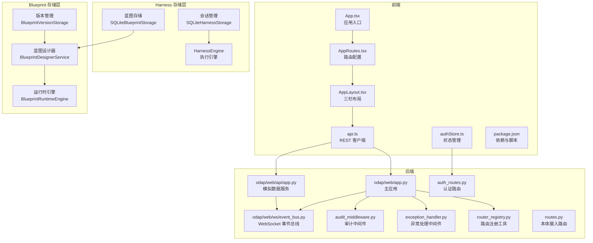

**图表来源**
- [frontend/src/App.tsx:1-65](file://frontend/src/App.tsx#L1-L65)
- [frontend/src/AppRoutes.tsx:1-61](file://frontend/src/AppRoutes.tsx#L1-L61)
- [frontend/src/modules/shared/components/AppLayout.tsx:1-712](file://frontend/src/modules/shared/components/AppLayout.tsx#L1-L712)
- [frontend/src/modules/shared/services/api.ts:1-800](file://frontend/src/modules/shared/services/api.ts#L1-L800)
- [frontend/src/modules/shared/stores/authStore.ts:1-148](file://frontend/src/modules/shared/stores/authStore.ts#L1-L148)
- [frontend/package.json:1-55](file://frontend/package.json#L1-L55)
- [odap/web/app.py:1-262](file://odap/web/app.py#L1-L262)
- [odap/web/api/app.py:1-862](file://odap/web/api/app.py#L1-L862)
- [odap/web/ws/event_bus.py:1-147](file://odap/web/ws/event_bus.py#L1-L147)
- [odap/web/router_registry.py:1-98](file://odap/web/router_registry.py#L1-L98)
- [odap/infra/middleware/audit_middleware.py:1-112](file://odap/infra/middleware/audit_middleware.py#L1-L112)
- [odap/infra/middleware/exception_handler.py:1-137](file://odap/infra/middleware/exception_handler.py#L1-L137)
- [odap/infra/security/auth_routes.py:1-143](file://odap/infra/security/auth_routes.py#L1-L143)
- [odap/biz/core/ontology/api/routes.py:1-527](file://odap/biz/core/ontology/api/routes.py#L1-L527)
- [odap/biz/core/ontology/harness/storage/sqlite_harness_storage.py:1-226](file://odap/biz/core/ontology/harness/storage/sqlite_harness_storage.py#L1-L226)
- [odap/biz/core/ontology/harness/blueprint/storage/sqlite_blueprint_storage.py:1-191](file://odap/biz/core/ontology/harness/blueprint/storage/sqlite_blueprint_storage.py#L1-L191)

**章节来源**
- [frontend/src/App.tsx:1-65](file://frontend/src/App.tsx#L1-L65)
- [frontend/src/AppRoutes.tsx:1-61](file://frontend/src/AppRoutes.tsx#L1-L61)
- [frontend/src/modules/shared/components/AppLayout.tsx:1-712](file://frontend/src/modules/shared/components/AppLayout.tsx#L1-L712)
- [frontend/src/modules/shared/services/api.ts:1-800](file://frontend/src/modules/shared/services/api.ts#L1-L800)
- [frontend/src/modules/shared/stores/authStore.ts:1-148](file://frontend/src/modules/shared/stores/authStore.ts#L1-L148)
- [frontend/package.json:1-55](file://frontend/package.json#L1-L55)
- [odap/web/app.py:1-262](file://odap/web/app.py#L1-L262)
- [odap/web/api/app.py:1-862](file://odap/web/api/app.py#L1-L862)
- [odap/web/ws/event_bus.py:1-147](file://odap/web/ws/event_bus.py#L1-L147)
- [odap/web/router_registry.py:1-98](file://odap/web/router_registry.py#L1-L98)
- [odap/infra/middleware/audit_middleware.py:1-112](file://odap/infra/middleware/audit_middleware.py#L1-L112)
- [odap/infra/middleware/exception_handler.py:1-137](file://odap/infra/middleware/exception_handler.py#L1-L137)
- [odap/infra/security/auth_routes.py:1-143](file://odap/infra/security/auth_routes.py#L1-L143)
- [odap/biz/core/ontology/api/routes.py:1-527](file://odap/biz/core/ontology/api/routes.py#L1-L527)

## 核心组件
- 前端应用入口与路由
  - 应用入口负责加载工作空间、处理登录状态与布局包裹，路由系统提供受保护页面与登录页。
- 三栏布局组件
  - 左侧导航菜单、顶部工作空间/场景选择、右侧扩展面板，支持折叠与动态内容更新。
- REST 客户端与状态管理
  - 统一的 API 客户端封装场景、本体摄入、版本管理、审计日志、查询等接口；Zustand 管理认证状态。
- 后端主应用与中间件
  - FastAPI 主应用集中注册各模块路由，配置 CORS、审计中间件与异常处理中间件；提供健康检查与性能监控端点。
- WebSocket 事件总线
  - 支持实体变更、情报更新、动作结果、OA DP 进度、OPA 校验、审计事件等事件广播与订阅。
- **新增** Harness 存储层
  - 提供会话生命周期管理、阶段控制、人工干预（HITL）和代理任务管理。
- **新增** Blueprint 存储层
  - 提供蓝图设计、版本管理、运行时执行和自动化布局功能。

**章节来源**
- [frontend/src/App.tsx:1-65](file://frontend/src/App.tsx#L1-L65)
- [frontend/src/AppRoutes.tsx:1-61](file://frontend/src/AppRoutes.tsx#L1-L61)
- [frontend/src/modules/shared/components/AppLayout.tsx:1-712](file://frontend/src/modules/shared/components/AppLayout.tsx#L1-L712)
- [frontend/src/modules/shared/services/api.ts:1-800](file://frontend/src/modules/shared/services/api.ts#L1-L800)
- [frontend/src/modules/shared/stores/authStore.ts:1-148](file://frontend/src/modules/shared/stores/authStore.ts#L1-L148)
- [odap/web/app.py:1-262](file://odap/web/app.py#L1-L262)
- [odap/web/ws/event_bus.py:1-147](file://odap/web/ws/event_bus.py#L1-L147)
- [odap/biz/core/ontology/harness/storage/sqlite_harness_storage.py:1-226](file://odap/biz/core/ontology/harness/storage/sqlite_harness_storage.py#L1-L226)
- [odap/biz/core/ontology/harness/blueprint/storage/sqlite_blueprint_storage.py:1-191](file://odap/biz/core/ontology/harness/blueprint/storage/sqlite_blueprint_storage.py#L1-L191)

## 架构总览
ODAP 接口层采用"前端三栏布局 + 后端模块化路由 + 存储层"的分层设计，前端通过 REST 与 WebSocket 与后端交互，后端通过中间件统一处理安全与可观测性。新增的存储层为平台提供了完整的会话管理和蓝图编排能力。

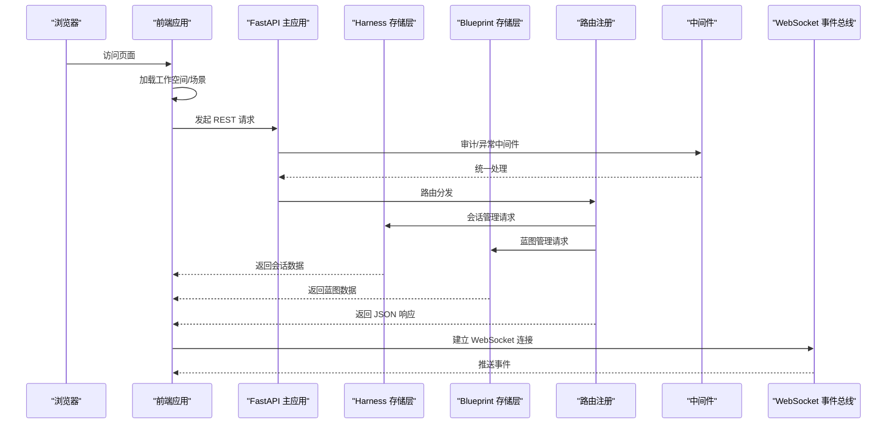

**图表来源**
- [frontend/src/App.tsx:1-65](file://frontend/src/App.tsx#L1-L65)
- [frontend/src/modules/shared/components/AppLayout.tsx:1-712](file://frontend/src/modules/shared/components/AppLayout.tsx#L1-L712)
- [odap/web/app.py:1-262](file://odap/web/app.py#L1-L262)
- [odap/web/ws/event_bus.py:1-147](file://odap/web/ws/event_bus.py#L1-L147)
- [odap/web/router_registry.py:1-98](file://odap/web/router_registry.py#L1-L98)
- [odap/infra/middleware/audit_middleware.py:1-112](file://odap/infra/middleware/audit_middleware.py#L1-L112)
- [odap/infra/middleware/exception_handler.py:1-137](file://odap/infra/middleware/exception_handler.py#L1-L137)

## 详细组件分析

### 前端应用与路由
- 应用入口
  - 在非登录页时加载工作空间列表并设置当前工作空间，支持本地存储持久化。
- 路由系统
  - 使用受保护路由包装，未登录自动跳转至登录页；提供多模块页面路由（本体、业务、技能、模拟、知识、工作空间、角色、策略、审计、智能体管理等）。
- 登录与认证
  - 通过认证接口获取令牌与用户信息，Zustand 管理 token、用户与角色切换。

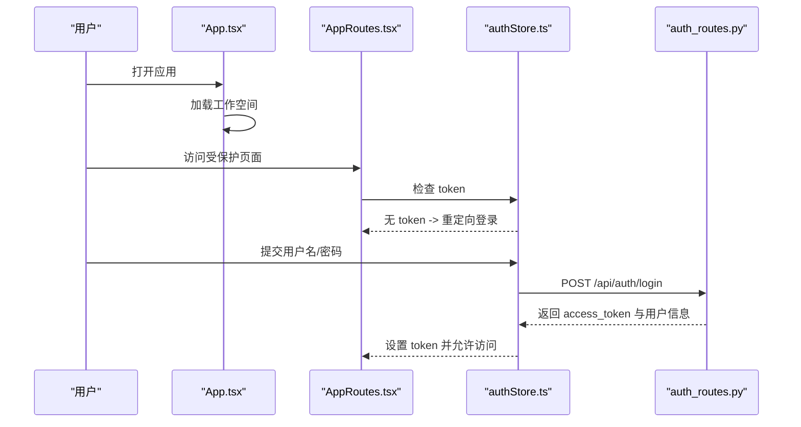

**图表来源**
- [frontend/src/App.tsx:1-65](file://frontend/src/App.tsx#L1-L65)
- [frontend/src/AppRoutes.tsx:1-61](file://frontend/src/AppRoutes.tsx#L1-L61)
- [frontend/src/modules/shared/stores/authStore.ts:1-148](file://frontend/src/modules/shared/stores/authStore.ts#L1-L148)
- [odap/infra/security/auth_routes.py:1-143](file://odap/infra/security/auth_routes.py#L1-L143)

**章节来源**
- [frontend/src/App.tsx:1-65](file://frontend/src/App.tsx#L1-L65)
- [frontend/src/AppRoutes.tsx:1-61](file://frontend/src/AppRoutes.tsx#L1-L61)
- [frontend/src/modules/shared/stores/authStore.ts:1-148](file://frontend/src/modules/shared/stores/authStore.ts#L1-L148)
- [odap/infra/security/auth_routes.py:1-143](file://odap/infra/security/auth_routes.py#L1-L143)

### 三栏布局与右侧面板
- 布局职责
  - 左侧：一级菜单与二级子菜单，支持折叠；顶部显示工作空间/场景选择与用户信息。
  - 主内容区：功能页面承载。
  - 右侧：扩展面板，支持动态内容与标题更新，可折叠。
- 上下文与状态
  - 工作空间/场景上下文通过 Context 提供；右侧面板通过 Context 控制显示与内容。
- 交互设计
  - 支持模式切换（我的智能体/管理后台）、菜单展开/折叠、右侧面板开关。

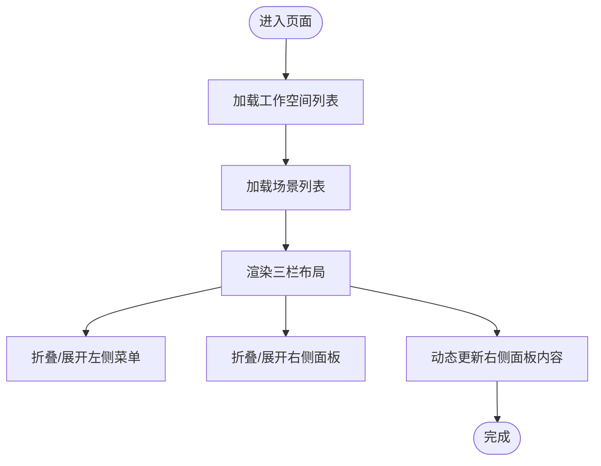

**图表来源**
- [frontend/src/modules/shared/components/AppLayout.tsx:1-712](file://frontend/src/modules/shared/components/AppLayout.tsx#L1-L712)

**章节来源**
- [frontend/src/modules/shared/components/AppLayout.tsx:1-712](file://frontend/src/modules/shared/components/AppLayout.tsx#L1-L712)

### REST 客户端与 API 封装
- 统一客户端
  - 通过 API 基础地址聚合场景、本体摄入、版本管理、审计日志、查询等接口，提供类型安全的返回值与错误处理。
- 本体摄入接口
  - 支持新闻、手动录入、JSON、自然语言、随机生成等多种摄入方式，统一入口与历史查询、构建状态跟踪。
- 工作空间与审计
  - 提供工作空间 CRUD、激活/停用、审计事件查询与统计等接口。

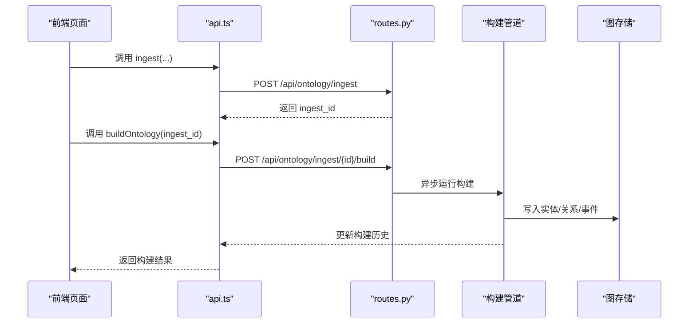

**图表来源**
- [frontend/src/modules/shared/services/api.ts:1-800](file://frontend/src/modules/shared/services/api.ts#L1-L800)
- [odap/biz/core/ontology/api/routes.py:1-527](file://odap/biz/core/ontology/api/routes.py#L1-L527)

**章节来源**
- [frontend/src/modules/shared/services/api.ts:1-800](file://frontend/src/modules/shared/services/api.ts#L1-L800)
- [odap/biz/core/ontology/api/routes.py:1-527](file://odap/biz/core/ontology/api/routes.py#L1-L527)

### 后端路由架构与中间件机制
- 路由注册
  - 主应用集中注册各模块路由（本体摄入、工作空间、角色、审计、技能、Hook、MCP、事件模拟、前端兼容、Agent、智能体管理、知识库、OMS、对象服务、动作、感知、决策、沙箱、业务、策略、会话记忆、数据仓库、查询、QA、认知、反馈等）。
- 中间件
  - 审计中间件：仅对写操作记录审计日志，排除文档与静态资源路径。
  - 异常处理中间件：统一捕获未处理异常，返回标准化错误响应。
- WebSocket 事件总线
  - 支持实体变更、情报更新、动作结果、OA DP 进度、OPA 校验、审计事件等事件广播，维护客户端集合与事件历史。

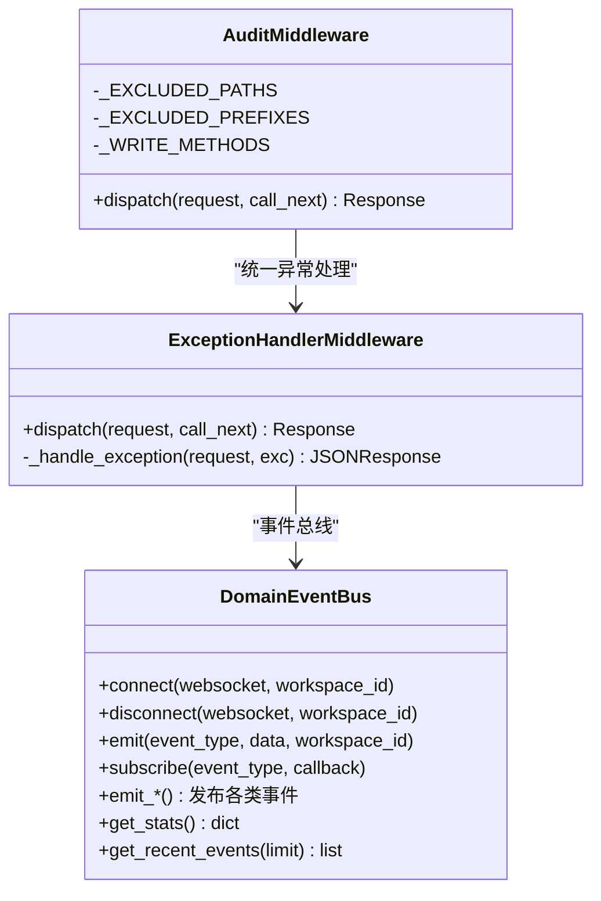

**图表来源**
- [odap/infra/middleware/audit_middleware.py:1-112](file://odap/infra/middleware/audit_middleware.py#L1-L112)
- [odap/infra/middleware/exception_handler.py:1-137](file://odap/infra/middleware/exception_handler.py#L1-L137)
- [odap/web/ws/event_bus.py:1-147](file://odap/web/ws/event_bus.py#L1-L147)

**章节来源**
- [odap/web/app.py:1-262](file://odap/web/app.py#L1-L262)
- [odap/web/router_registry.py:1-98](file://odap/web/router_registry.py#L1-L98)
- [odap/infra/middleware/audit_middleware.py:1-112](file://odap/infra/middleware/audit_middleware.py#L1-L112)
- [odap/infra/middleware/exception_handler.py:1-137](file://odap/infra/middleware/exception_handler.py#L1-L137)
- [odap/web/ws/event_bus.py:1-147](file://odap/web/ws/event_bus.py#L1-L147)

### WebSocket 实时通信
- 事件总线
  - 维护 WebSocket 客户端集合、按工作空间分组、事件历史与订阅回调；支持实体变更、情报更新、动作结果、OA DP 进度、OPA 校验、审计事件等事件类型。
- 使用场景
  - 本体图谱更新、摄入进度、构建状态、策略推演结果等实时推送。

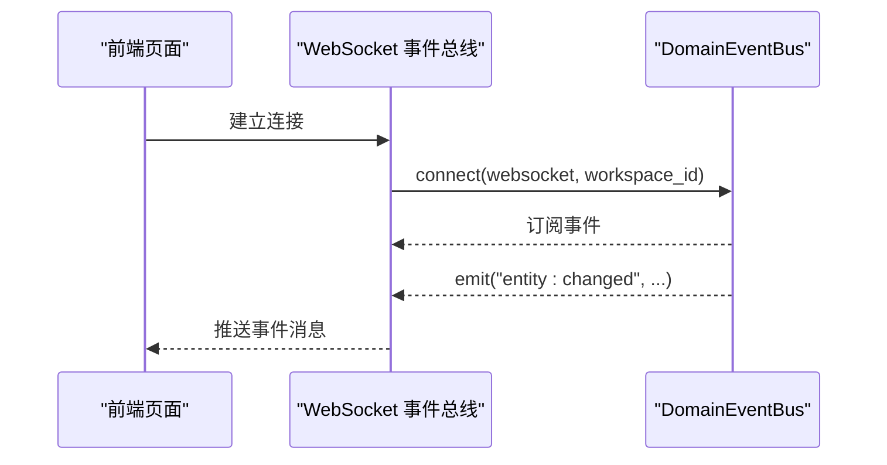

**图表来源**
- [odap/web/ws/event_bus.py:1-147](file://odap/web/ws/event_bus.py#L1-L147)

**章节来源**
- [odap/web/ws/event_bus.py:1-147](file://odap/web/ws/event_bus.py#L1-L147)

### API 设计规范与接口文档
- RESTful 设计
  - 统一前缀与命名：/api/模块/资源，如 /api/ontology/ingest、/api/workspaces、/api/audit 等。
  - 标准化响应：成功返回资源对象或数组，错误返回统一错误结构。
- 认证与授权
  - JWT 令牌认证，支持刷新与用户管理；部分路由需管理员权限。
- 本体摄入与构建
  - 支持多种摄入源与构建触发，提供摄入历史、构建历史、处理日志与版本回滚。
- 查询与导出
  - 支持实体/关系查询、复杂条件查询、查询历史与导出。
- **新增** Harness 会话管理 API
  - 会话创建、查询、更新、删除和阶段推进。
  - 人工干预（HITL）确认和风险评估。
  - 代理任务管理和上下文更新。
- **新增** Blueprint 蓝图管理 API
  - 蓝图创建、编辑、删除和版本管理。
  - 节点和边的增删改查，批量操作。
  - 自动布局和验证功能。
  - 运行时执行控制。

**章节来源**
- [odap/biz/core/ontology/api/routes.py:1-527](file://odap/biz/core/ontology/api/routes.py#L1-L527)
- [odap/infra/security/auth_routes.py:1-143](file://odap/infra/security/auth_routes.py#L1-L143)
- [odap/web/router_registry.py:1-98](file://odap/web/router_registry.py#L1-L98)
- [odap/biz/core/ontology/harness/api/routes.py:1-297](file://odap/biz/core/ontology/harness/api/routes.py#L1-L297)
- [odap/biz/core/ontology/harness/blueprint/routes.py:1-253](file://odap/biz/core/ontology/harness/blueprint/routes.py#L1-L253)

## Harness 存储层

### 存储架构
Harness 存储层提供完整的会话管理和蓝图编排能力，采用 SQLite 数据库存储会话状态和蓝图数据。

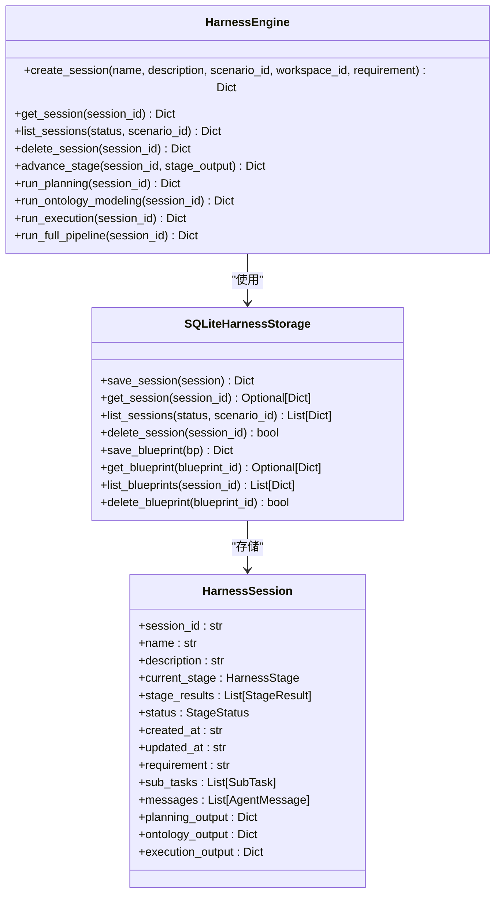

**图表来源**
- [odap/biz/core/ontology/harness/storage/sqlite_harness_storage.py:10-226](file://odap/biz/core/ontology/harness/storage/sqlite_harness_storage.py#L10-L226)
- [odap/biz/core/ontology/harness/impl/harness_engine.py:43-296](file://odap/biz/core/ontology/harness/impl/harness_engine.py#L43-L296)
- [odap/biz/core/ontology/harness/models/models.py:69-89](file://odap/biz/core/ontology/harness/models/models.py#L69-L89)

### 会话管理功能
- 会话生命周期管理
  - 创建会话：支持名称、描述、场景ID、工作空间ID和需求描述。
  - 查询会话：支持按状态和场景过滤，获取会话列表和详情。
  - 删除会话：软删除机制，确保数据完整性。
- 阶段控制
  - 需求分析：解析自然语言需求，提取业务对象与关系。
  - 业务校验：校验需求完整性与一致性。
  - ETL：数据抽取、转换、加载。
  - 数据图谱映射：将业务数据映射到图谱结构。
  - 图谱构建：构建知识图谱。
  - 本体建模：基于图谱数据构建本体模型。
  - 业务接口：生成业务API与Skill接口。
- 人工干预（HITL）
  - 风险评估：支持低、中、高风险级别。
  - 影响分析：识别受影响的对象和业务影响。
  - 决策支持：提供建议行动和解决流程。

**章节来源**
- [odap/biz/core/ontology/harness/storage/sqlite_harness_storage.py:19-226](file://odap/biz/core/ontology/harness/storage/sqlite_harness_storage.py#L19-L226)
- [odap/biz/core/ontology/harness/impl/harness_engine.py:32-40](file://odap/biz/core/ontology/harness/impl/harness_engine.py#L32-L40)
- [odap/biz/core/ontology/harness/impl/harness_engine.py:47-74](file://odap/biz/core/ontology/harness/impl/harness_engine.py#L47-L74)
- [odap/biz/core/ontology/harness/models/models.py:19-33](file://odap/biz/core/ontology/harness/models/models.py#L19-L33)

### API 路由设计
- 会话管理路由
  - POST /api/ontology/harness/sessions：创建会话
  - GET /api/ontology/harness/sessions：查询会话列表
  - GET /api/ontology/harness/sessions/{session_id}：获取会话详情
  - POST /api/ontology/harness/sessions/{session_id}/advance：推进会话阶段
  - POST /api/ontology/harness/sessions/{session_id}/fail：标记阶段失败
  - DELETE /api/ontology/harness/sessions/{session_id}：删除会话
- 人工干预路由
  - POST /api/ontology/harness/sessions/{session_id}/hitl：创建HITL确认
  - POST /api/ontology/harness/sessions/{session_id}/hitl/resolve：解决HITL确认
  - POST /api/ontology/harness/hitl/check：检查HITL需求
- 代理任务路由
  - POST /api/ontology/harness/sessions/{session_id}/tasks：添加代理任务
  - PUT /api/ontology/harness/sessions/{session_id}/tasks：更新代理任务
  - PUT /api/ontology/harness/sessions/{session_id}/context：更新上下文
- 蓝图管理路由
  - POST /api/ontology/harness/blueprints：创建蓝图
  - GET /api/ontology/harness/blueprints：查询蓝图列表
  - GET /api/ontology/harness/blueprints/{blueprint_id}：获取蓝图详情
  - PUT /api/ontology/harness/blueprints/{blueprint_id}：更新蓝图
  - DELETE /api/ontology/harness/blueprints/{blueprint_id}：删除蓝图
- 执行路由
  - POST /api/ontology/harness/sessions/{session_id}/planning：运行规划阶段
  - POST /api/ontology/harness/sessions/{session_id}/ontology：运行本体建模
  - POST /api/ontology/harness/sessions/{session_id}/execution：运行执行阶段
  - POST /api/ontology/harness/sessions/{session_id}/full-pipeline：运行完整流水线

**章节来源**
- [odap/biz/core/ontology/harness/api/routes.py:17-297](file://odap/biz/core/ontology/harness/api/routes.py#L17-L297)

## Blueprint 存储层

### 存储架构
Blueprint 存储层提供蓝图设计和版本管理功能，支持复杂的图谱设计和执行。

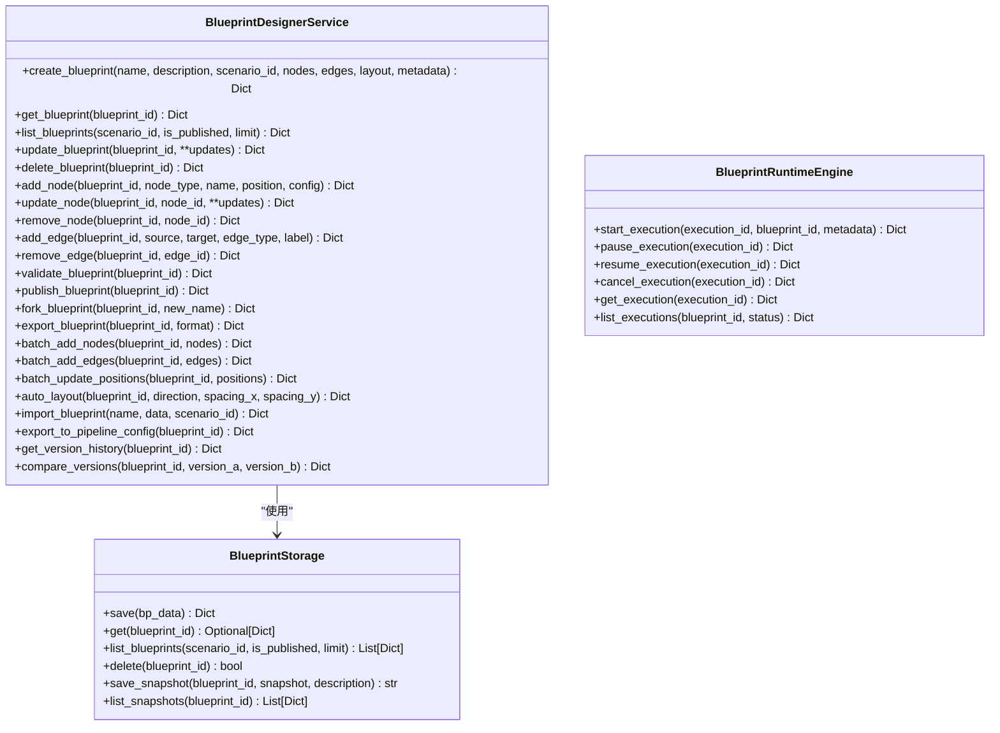

**图表来源**
- [odap/biz/core/ontology/harness/blueprint/storage/sqlite_blueprint_storage.py:9-191](file://odap/biz/core/ontology/harness/blueprint/storage/sqlite_blueprint_storage.py#L9-L191)
- [odap/biz/core/ontology/harness/blueprint/blueprint_service.py:12-474](file://odap/biz/core/ontology/harness/blueprint/blueprint_service.py#L12-L474)
- [odap/biz/core/ontology/harness/blueprint/api/runtime_routes.py:7-89](file://odap/biz/core/ontology/harness/blueprint/api/runtime_routes.py#L7-L89)

### 蓝图设计功能
- 蓝图创建与管理
  - 支持名称、描述、场景ID、版本号和元数据管理。
  - 支持发布状态和父版本关联。
  - 提供版本历史快照功能。
- 节点和边管理
  - 节点类型：数据源、转换、本体等。
  - 边类型：数据流、控制流等。
  - 支持批量添加和位置更新。
- 验证和布局
  - 蓝图完整性验证，检查节点和边的有效性。
  - 自动布局算法，支持多种布局方向和间距。
  - 手动位置调整和批量更新。
- 导出和导入
  - JSON格式导出，便于备份和分享。
  - 代码格式导出，生成可执行的Python代码。
  - 支持从外部数据导入蓝图。

**章节来源**
- [odap/biz/core/ontology/harness/blueprint/storage/sqlite_blueprint_storage.py:24-125](file://odap/biz/core/ontology/harness/blueprint/storage/sqlite_blueprint_storage.py#L24-L125)
- [odap/biz/core/ontology/harness/blueprint/blueprint_service.py:26-474](file://odap/biz/core/ontology/harness/blueprint/blueprint_service.py#L26-L474)

### 运行时执行
- 执行引擎
  - 支持执行启动、暂停、恢复和取消。
  - 提供执行状态查询和列表管理。
  - 支持元数据传递和执行上下文。
- 蓝图节点类型
  - 数据源节点：支持API、数据库、文件等多种数据源。
  - 转换节点：支持数据清洗、格式转换、计算等操作。
  - 本体节点：支持本体建模和知识图谱构建。
- 边连接管理
  - 数据映射：定义节点间的数据传递关系。
  - 条件连接：支持基于条件的数据流控制。
  - 错误处理：提供错误传播和异常处理机制。

**章节来源**
- [odap/biz/core/ontology/harness/blueprint/api/runtime_routes.py:11-89](file://odap/biz/core/ontology/harness/blueprint/api/runtime_routes.py#L11-L89)

### API 路由设计
- 蓝图设计器路由
  - POST /api/ontology/blueprints：创建蓝图
  - GET /api/ontology/blueprints/{blueprint_id}：获取蓝图详情
  - GET /api/ontology/blueprints：查询蓝图列表
  - PUT /api/ontology/blueprints/{blueprint_id}：更新蓝图
  - DELETE /api/ontology/blueprints/{blueprint_id}：删除蓝图
  - POST /api/ontology/blueprints/{blueprint_id}/nodes：添加节点
  - PUT /api/ontology/blueprints/{blueprint_id}/nodes/{node_id}：更新节点
  - DELETE /api/ontology/blueprints/{blueprint_id}/nodes/{node_id}：删除节点
  - POST /api/ontology/blueprints/{blueprint_id}/edges：添加边
  - DELETE /api/ontology/blueprints/{blueprint_id}/edges/{edge_id}：删除边
  - POST /api/ontology/blueprints/{blueprint_id}/nodes/batch：批量添加节点
  - POST /api/ontology/blueprints/{blueprint_id}/edges/batch：批量添加边
  - PUT /api/ontology/blueprints/{blueprint_id}/positions：批量更新位置
  - POST /api/ontology/blueprints/{blueprint_id}/auto-layout：自动布局
  - POST /api/ontology/blueprints/import：导入蓝图
  - GET /api/ontology/blueprints/{blueprint_id}/pipeline-config：导出管道配置
  - POST /api/ontology/blueprints/{blueprint_id}/validate：验证蓝图
  - POST /api/ontology/blueprints/{blueprint_id}/publish：发布蓝图
  - POST /api/ontology/blueprints/{blueprint_id}/fork：复制蓝图
  - GET /api/ontology/blueprints/{blueprint_id}/export：导出蓝图
  - GET /api/ontology/blueprints/{blueprint_id}/version-history：获取版本历史
- 蓝图运行时路由
  - POST /api/ontology/blueprints/executions：启动执行
  - POST /api/ontology/blueprints/executions/{execution_id}/pause：暂停执行
  - POST /api/ontology/blueprints/executions/{execution_id}/resume：恢复执行
  - POST /api/ontology/blueprints/executions/{execution_id}/cancel：取消执行
  - GET /api/ontology/blueprints/executions/{execution_id}：获取执行详情
  - GET /api/ontology/blueprints/executions：查询执行列表

**章节来源**
- [odap/biz/core/ontology/harness/blueprint/routes.py:21-253](file://odap/biz/core/ontology/harness/blueprint/routes.py#L21-L253)
- [odap/biz/core/ontology/harness/blueprint/api/runtime_routes.py:11-89](file://odap/biz/core/ontology/harness/blueprint/api/runtime_routes.py#L11-L89)

## 会话管理和蓝图编排

### 编排流程
Harness 执行引擎提供完整的会话编排能力，支持多阶段的自动化处理流程。

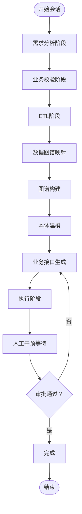

**图表来源**
- [odap/biz/core/ontology/harness/impl/harness_engine.py:32-40](file://odap/biz/core/ontology/harness/impl/harness_engine.py#L32-L40)
- [odap/biz/core/ontology/harness/impl/harness_engine.py:265-296](file://odap/biz/core/ontology/harness/impl/harness_engine.py#L265-L296)

### 会话状态管理
- 阶段状态
  - PENDING：待处理
  - RUNNING：运行中
  - COMPLETED：已完成
  - FAILED：失败
  - HITL_PENDING：人工干预等待
- 会话上下文
  - 支持要求描述和业务需求
  - 记录阶段结果和执行输出
  - 维护代理任务和消息历史
- 任务管理
  - 代理任务：规划、执行、验证等角色
  - 子任务：具体的执行步骤
  - 任务依赖：支持任务间的依赖关系

**章节来源**
- [odap/biz/core/ontology/harness/models/models.py:8-17](file://odap/biz/core/ontology/harness/models/models.py#L8-L17)
- [odap/biz/core/ontology/harness/models/models.py:35-67](file://odap/biz/core/ontology/harness/models/models.py#L35-L67)
- [odap/biz/core/ontology/harness/models/models.py:69-89](file://odap/biz/core/ontology/harness/models/models.py#L69-L89)

### 蓝图编排
- 节点编排
  - 节点类型：数据源、转换、本体、执行等
  - 配置参数：支持动态配置和参数传递
  - 位置管理：支持手动和自动布局
- 边连接编排
  - 数据映射：定义节点间的数据传递
  - 条件连接：支持基于条件的连接
  - 错误处理：提供错误传播机制
- 执行编排
  - 串行执行：按顺序执行的节点
  - 并行执行：支持并行处理的节点
  - 条件执行：基于条件的执行路径

**章节来源**
- [odap/biz/core/ontology/harness/models/models.py:91-107](file://odap/biz/core/ontology/harness/models/models.py#L91-L107)
- [odap/biz/core/ontology/harness/models/models.py:109-118](file://odap/biz/core/ontology/harness/models/models.py#L109-L118)

## 依赖分析
- 前端依赖
  - React 19、Ant Design 6、@antv/g6、@openharness/react、Zustand 等，支撑三栏布局、图可视化与状态管理。
- 后端依赖
  - FastAPI、uvicorn、CORS、中间件与模块化路由注册，支撑统一的 API 网关与可观测性。
- **新增** 存储层依赖
  - SQLite：提供轻量级的关系型数据库支持。
  - Pydantic：提供数据验证和序列化功能。
  - UUID：提供唯一标识符生成。

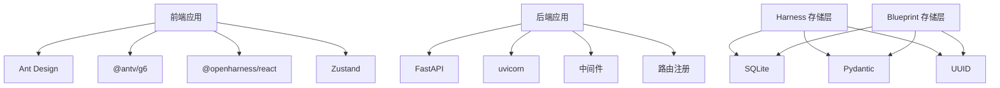

**图表来源**
- [frontend/package.json:1-55](file://frontend/package.json#L1-L55)
- [odap/web/app.py:1-262](file://odap/web/app.py#L1-L262)
- [odap/biz/core/ontology/harness/storage/sqlite_harness_storage.py:1-226](file://odap/biz/core/ontology/harness/storage/sqlite_harness_storage.py#L1-L226)
- [odap/biz/core/ontology/harness/blueprint/storage/sqlite_blueprint_storage.py:1-191](file://odap/biz/core/ontology/harness/blueprint/storage/sqlite_blueprint_storage.py#L1-L191)

**章节来源**
- [frontend/package.json:1-55](file://frontend/package.json#L1-L55)
- [odap/web/app.py:1-262](file://odap/web/app.py#L1-L262)
- [odap/biz/core/ontology/harness/storage/sqlite_harness_storage.py:1-226](file://odap/biz/core/ontology/harness/storage/sqlite_harness_storage.py#L1-L226)
- [odap/biz/core/ontology/harness/blueprint/storage/sqlite_blueprint_storage.py:1-191](file://odap/biz/core/ontology/harness/blueprint/storage/sqlite_blueprint_storage.py#L1-L191)

## 性能考虑
- 前端
  - 图谱渲染：大图建议采用虚拟化、分页加载与布局优化；合理使用缓存与防抖。
  - 状态管理：Zustand 轻量高效，避免不必要的全局订阅。
- 后端
  - 异步构建：摄入完成后立即返回，后台异步执行构建，降低请求延迟。
  - 中间件：审计与异常中间件仅处理必要路径，避免对读操作产生额外开销。
  - WebSocket：维护客户端集合与事件历史上限，定期清理无效连接。
- **新增** 存储层性能
  - SQLite 索引：为常用查询字段建立索引，提高查询性能。
  - 连接池：合理管理数据库连接，避免连接泄漏。
  - 数据压缩：对大型 JSON 数据进行压缩存储，减少磁盘占用。
  - 分页查询：对大量数据的查询使用分页机制，避免内存溢出。

## 故障排除指南
- 认证失败
  - 检查 token 是否存在与过期；确认 /api/auth/login 返回的 access_token 与 refresh_token。
- 审计日志未记录
  - 确认审计中间件已注册且请求路径不在排除列表中；仅写操作会被记录。
- 异常响应
  - 查看异常处理中间件返回的统一错误结构，定位具体错误类型与请求 ID。
- WebSocket 连接问题
  - 检查事件总线连接与断开逻辑，确认客户端集合清理与广播流程。
- **新增** Harness 会话问题
  - 检查会话状态是否正确更新，确认阶段推进逻辑。
  - 验证 HITL 确认流程，确保人工干预机制正常工作。
  - 确认代理任务的执行状态和输出结果。
- **新增** Blueprint 蓝图问题
  - 验证蓝图的节点和边关系，确保图结构的完整性。
  - 检查自动布局算法的执行结果，确认节点位置的合理性。
  - 验证蓝图导出功能，确保数据格式的正确性。

**章节来源**
- [odap/infra/middleware/audit_middleware.py:1-112](file://odap/infra/middleware/audit_middleware.py#L1-L112)
- [odap/infra/middleware/exception_handler.py:1-137](file://odap/infra/middleware/exception_handler.py#L1-L137)
- [odap/web/ws/event_bus.py:1-147](file://odap/web/ws/event_bus.py#L1-L147)
- [odap/biz/core/ontology/harness/storage/sqlite_harness_storage.py:19-226](file://odap/biz/core/ontology/harness/storage/sqlite_harness_storage.py#L19-L226)
- [odap/biz/core/ontology/harness/blueprint/storage/sqlite_blueprint_storage.py:24-191](file://odap/biz/core/ontology/harness/blueprint/storage/sqlite_blueprint_storage.py#L24-L191)

## 结论
ODAP 平台 L5-L6 接口层通过清晰的前端三栏布局与后端模块化路由，实现了从数据摄入到本体构建、从问答到执行建议的端到端流程。**更新后的架构**增加了 Harness 存储层和 Blueprint 存储层，提供了完整的会话管理和蓝图编排能力，支持多阶段的自动化处理和复杂的图谱设计。前端以 React 生态为基础，后端以 FastAPI 为核心，配合中间件与 WebSocket 实现实时通信与统一的可观测性。新增的存储层为平台提供了强大的数据持久化和业务编排能力，使该架构具备更好的扩展性与可维护性，适合在多场景与多角色的复杂业务环境中持续演进。

## 附录

### 接口使用示例（摘要）
- 登录
  - POST /api/auth/login
  - 返回 access_token、refresh_token 与用户信息。
- 场景管理
  - GET /api/scenarios
  - POST /api/scenarios
  - GET /api/scenarios/{id}
  - POST /api/scenarios/{id}/sync
- 本体摄入
  - POST /api/ontology/ingest
  - POST /api/ontology/ingest/{id}/build
- 审计日志
  - GET /api/audit/events
  - GET /api/audit/stats
- 查询
  - POST /api/query/entities
  - POST /api/query/relations
  - POST /api/query/complex
- **新增** Harness 会话管理
  - POST /api/ontology/harness/sessions
  - GET /api/ontology/harness/sessions
  - GET /api/ontology/harness/sessions/{session_id}
  - POST /api/ontology/harness/sessions/{session_id}/advance
  - POST /api/ontology/harness/sessions/{session_id}/planning
  - POST /api/ontology/harness/sessions/{session_id}/ontology
  - POST /api/ontology/harness/sessions/{session_id}/execution
- **新增** Blueprint 蓝图管理
  - POST /api/ontology/blueprints
  - GET /api/ontology/blueprints/{blueprint_id}
  - PUT /api/ontology/blueprints/{blueprint_id}
  - DELETE /api/ontology/blueprints/{blueprint_id}
  - POST /api/ontology/blueprints/{blueprint_id}/nodes
  - POST /api/ontology/blueprints/{blueprint_id}/edges
  - POST /api/ontology/blueprints/executions

**章节来源**
- [odap/infra/security/auth_routes.py:1-143](file://odap/infra/security/auth_routes.py#L1-L143)
- [odap/biz/core/ontology/api/routes.py:1-527](file://odap/biz/core/ontology/api/routes.py#L1-L527)
- [frontend/src/modules/shared/services/api.ts:1-800](file://frontend/src/modules/shared/services/api.ts#L1-L800)
- [odap/biz/core/ontology/harness/api/routes.py:17-297](file://odap/biz/core/ontology/harness/api/routes.py#L17-L297)
- [odap/biz/core/ontology/harness/blueprint/routes.py:21-253](file://odap/biz/core/ontology/harness/blueprint/routes.py#L21-L253)

### 前端开发指南
- 三栏布局
  - 使用 AppLayout 提供的工作空间/场景上下文与右侧面板 Hook，实现动态内容更新。
- 组件库与 UI 设计
  - 基于 Ant Design 6，结合 @antv/g6 实现图谱可视化；参考设计文档中的三栏布局与右侧面板规范。
- 状态管理
  - 使用 Zustand 管理认证状态与角色切换；避免跨页面共享的全局状态污染。
- **新增** Harness 集成
  - 使用新的 API 客户端访问会话管理功能。
  - 集成蓝图设计器组件，支持可视化编辑。
  - 实现会话状态的实时更新和同步。

**章节来源**
- [frontend/src/modules/shared/components/AppLayout.tsx:1-712](file://frontend/src/modules/shared/components/AppLayout.tsx#L1-L712)
- [frontend/src/modules/shared/stores/authStore.ts:1-148](file://frontend/src/modules/shared/stores/authStore.ts#L1-L148)
- [docs/01-product-design/webui-enhancement-design.md:1-627](file://docs/01-product-design/webui-enhancement-design.md#L1-L627)

### 后端服务部署方案
- 主应用
  - 使用 uvicorn 运行 odap/web/app.py；配置 CORS 与中间件；通过路由注册工具集中注册模块路由。
- 模拟数据服务
  - odap/web/api/app.py 提供模拟数据生成与本体热写入服务，支持 REST 与 WebSocket。
- 健康检查与监控
  - /health 提供服务状态；/api/v1/monitoring 提供性能指标查询与重置。
- **新增** 存储层配置
  - SQLite 数据库文件路径可通过环境变量 DATA_DIR 配置。
  - 支持数据库迁移和版本升级。
  - 提供数据库连接池配置和性能优化选项。

**章节来源**
- [odap/web/app.py:1-262](file://odap/web/app.py#L1-L262)
- [odap/web/api/app.py:1-862](file://odap/web/api/app.py#L1-L862)
- [odap/biz/core/ontology/harness/storage/sqlite_harness_storage.py:10-14](file://odap/biz/core/ontology/harness/storage/sqlite_harness_storage.py#L10-L14)
- [odap/biz/core/ontology/harness/blueprint/storage/sqlite_blueprint_storage.py:10-14](file://odap/biz/core/ontology/harness/blueprint/storage/sqlite_blueprint_storage.py#L10-L14)