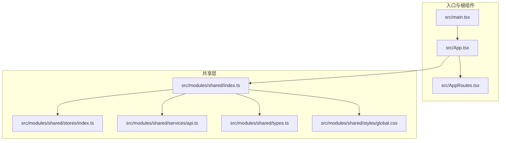
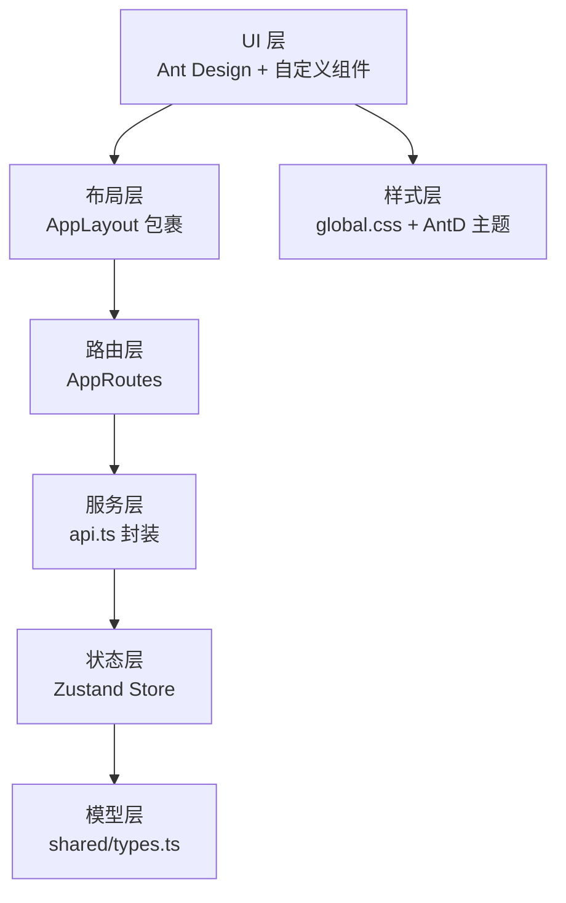
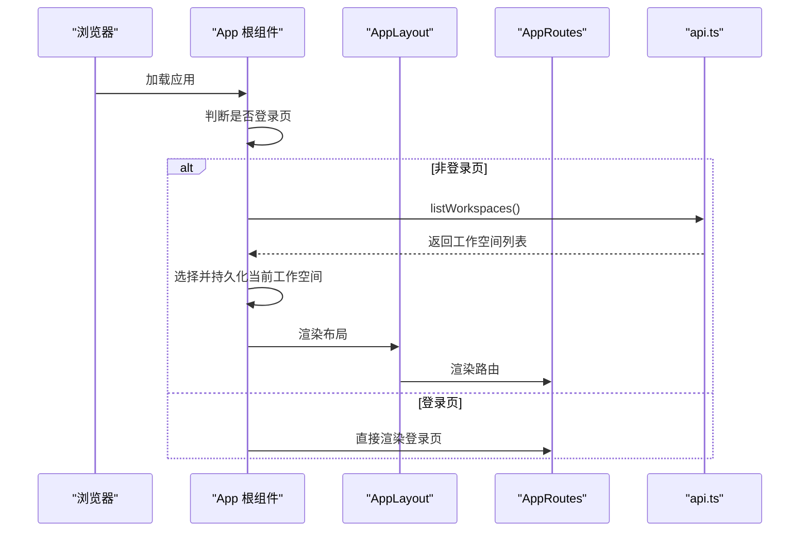
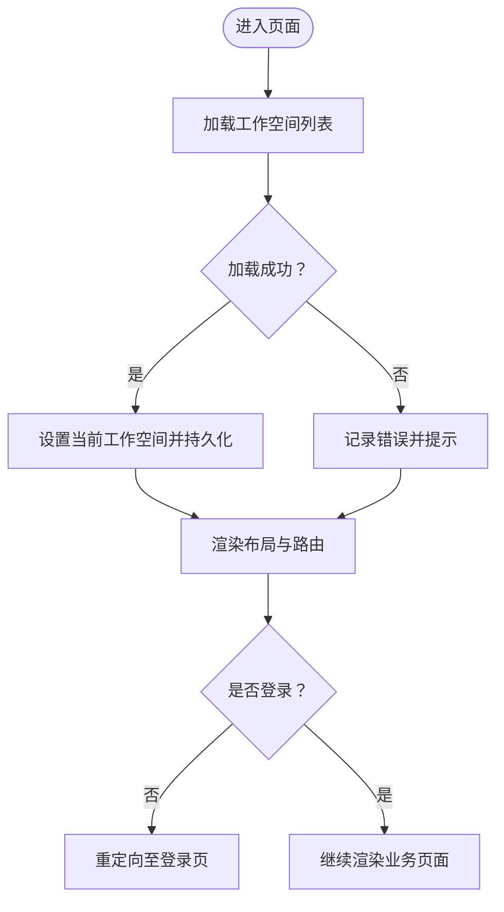
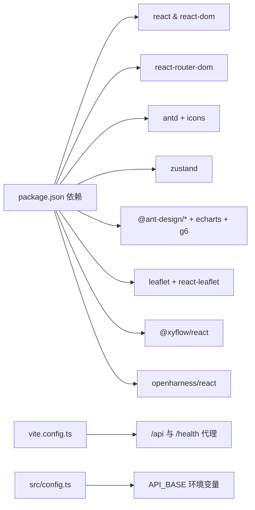

# 前端架构设计

<cite>
**本文引用的文件**
- [package.json](file://frontend/package.json)
- [vite.config.ts](file://frontend/vite.config.ts)
- [src/main.tsx](file://frontend/src/main.tsx)
- [src/App.tsx](file://frontend/src/App.tsx)
- [src/AppRoutes.tsx](file://frontend/src/AppRoutes.tsx)
- [src/config.ts](file://frontend/src/config.ts)
- [src/modules/shared/index.ts](file://frontend/src/modules/shared/index.ts)
- [src/modules/shared/stores/index.ts](file://frontend/src/modules/shared/stores/index.ts)
- [src/modules/shared/services/api.ts](file://frontend/src/modules/shared/services/api.ts)
- [src/modules/shared/types.ts](file://frontend/src/modules/shared/types.ts)
- [src/modules/shared/styles/global.css](file://frontend/src/modules/shared/styles/global.css)
</cite>

## 目录
1. [引言](#引言)
2. [项目结构](#项目结构)
3. [核心组件](#核心组件)
4. [架构总览](#架构总览)
5. [详细组件分析](#详细组件分析)
6. [依赖关系分析](#依赖关系分析)
7. [性能考量](#性能考量)
8. [故障排查指南](#故障排查指南)
9. [结论](#结论)
10. [附录](#附录)

## 引言
本文件面向 ODAP 平台前端团队与相关利益方，系统性阐述基于 React 19 的前端架构设计与实现方案。内容覆盖整体架构、组件层次、状态管理、路由与布局、样式系统、Ant Design 使用规范、自定义组件开发指南、UI 主题系统、开发环境配置、构建与部署策略，以及从基础组件到复杂业务页面的完整实现路径。

## 项目结构
前端工程位于 frontend 目录，采用模块化组织方式，按业务域划分模块，共享能力集中于 shared 子目录，页面与组件分别置于 pages 与 components 下，服务层封装 API 调用，状态管理采用 Zustand，路由由 React Router DOM 提供，构建工具为 Vite。



图示来源
- [src/main.tsx:1-11](file://frontend/src/main.tsx#L1-L11)
- [src/App.tsx:1-65](file://frontend/src/App.tsx#L1-L65)
- [src/AppRoutes.tsx:1-61](file://frontend/src/AppRoutes.tsx#L1-L61)
- [src/modules/shared/index.ts:1-11](file://frontend/src/modules/shared/index.ts#L1-L11)

章节来源
- [src/main.tsx:1-11](file://frontend/src/main.tsx#L1-L11)
- [src/App.tsx:1-65](file://frontend/src/App.tsx#L1-L65)
- [src/AppRoutes.tsx:1-61](file://frontend/src/AppRoutes.tsx#L1-L61)
- [src/modules/shared/index.ts:1-11](file://frontend/src/modules/shared/index.ts#L1-L11)

## 核心组件
- 应用根组件与路由
  - 根组件负责全局布局包装与登录保护，路由集中定义于 AppRoutes，并通过受保护路由组件实现访问控制。
- 状态管理
  - 使用 Zustand 创建应用与审计两类 Store，统一管理用户、令牌、工作空间、通知、加载与错误状态，以及审计事件列表与筛选器。
- 服务层与 API
  - 统一封装 fetch 请求与客户端上传，提供场景、实体、关系、本体摄入、版本、审计、查询等接口，支持多数据源与回退策略。
- 类型系统
  - 定义场景、实体、时间线事件、版本、差异结果、统计信息、地图单位等核心类型，确保前后端契约一致。
- 样式与主题
  - 全局样式定义通用滚动条、卡片、统计卡、图表示例容器、面板、控制栏等通用类名；提供 Flex 与间距辅助类，便于快速布局。

章节来源
- [src/App.tsx:1-65](file://frontend/src/App.tsx#L1-L65)
- [src/AppRoutes.tsx:1-61](file://frontend/src/AppRoutes.tsx#L1-L61)
- [src/modules/shared/stores/index.ts:1-219](file://frontend/src/modules/shared/stores/index.ts#L1-L219)
- [src/modules/shared/services/api.ts:1-800](file://frontend/src/modules/shared/services/api.ts#L1-L800)
- [src/modules/shared/types.ts:1-85](file://frontend/src/modules/shared/types.ts#L1-L85)
- [src/modules/shared/styles/global.css:1-232](file://frontend/src/modules/shared/styles/global.css#L1-L232)

## 架构总览
ODAP 前端采用“模块化 + 共享层 + 状态管理 + 服务层”的分层架构。顶层由 App 与 AppRoutes 组成，中间层为共享组件与服务，底层为状态存储与 API 客户端。Ant Design 作为 UI 基础库，结合自定义组件与样式系统，支撑复杂业务页面。



图示来源
- [src/App.tsx:1-65](file://frontend/src/App.tsx#L1-L65)
- [src/AppRoutes.tsx:1-61](file://frontend/src/AppRoutes.tsx#L1-L61)
- [src/modules/shared/services/api.ts:1-800](file://frontend/src/modules/shared/services/api.ts#L1-L800)
- [src/modules/shared/stores/index.ts:1-219](file://frontend/src/modules/shared/stores/index.ts#L1-L219)
- [src/modules/shared/types.ts:1-85](file://frontend/src/modules/shared/types.ts#L1-L85)
- [src/modules/shared/styles/global.css:1-232](file://frontend/src/modules/shared/styles/global.css#L1-L232)

## 详细组件分析

### 应用根与路由
- App 根组件负责：
  - 登录页直连，非登录页时加载工作空间列表并持久化当前工作空间。
  - 在 AppLayout 中渲染 AppRoutes，实现全局布局与侧边导航。
- AppRoutes：
  - 定义全部业务路由，使用受保护路由组件拦截未登录访问。
  - 登录路由与各业务模块页面映射清晰，便于扩展与维护。



图示来源
- [src/App.tsx:1-65](file://frontend/src/App.tsx#L1-L65)
- [src/AppRoutes.tsx:1-61](file://frontend/src/AppRoutes.tsx#L1-L61)
- [src/modules/shared/services/api.ts:639-642](file://frontend/src/modules/shared/services/api.ts#L639-L642)

章节来源
- [src/App.tsx:1-65](file://frontend/src/App.tsx#L1-L65)
- [src/AppRoutes.tsx:1-61](file://frontend/src/AppRoutes.tsx#L1-L61)

### 状态管理（Zustand）
- 应用状态（useAppStore）
  - 管理用户、令牌、当前工作空间、工作空间列表、通知、加载与错误状态。
  - 提供登录、登出、加载工作空间、切换工作空间、添加/移除通知、清空错误等动作。
- 审计状态（useAuditStore）
  - 管理审计事件列表、总数、加载状态与筛选器。
  - 提供加载事件、设置筛选器、清空筛选器等动作。



图示来源
- [src/modules/shared/stores/index.ts:116-145](file://frontend/src/modules/shared/stores/index.ts#L116-L145)

章节来源
- [src/modules/shared/stores/index.ts:1-219](file://frontend/src/modules/shared/stores/index.ts#L1-L219)

### 服务层与 API 设计
- 统一请求封装
  - 提供 fetchJson 与 apiClient.upload，统一处理 API 基址、参数拼接与错误处理。
- 场景与实体
  - 场景列表、详情、创建、同步、时间线、实体与关系查询。
- 本体摄入
  - 支持新闻、手动录入、JSON、自然语言、随机生成等多种摄入类型，统一返回摄入任务与状态。
- 版本与回滚
  - 版本列表、回滚、差异比较、文档查询。
- 审计
  - 审计事件列表、统计、时间线、创建。
- 查询与导出
  - 实体与关系查询、复杂条件查询、历史与导出。
- 工作空间
  - 列表、详情、创建、更新、删除、激活/停用。

```mermaid
classDiagram
class ApiService {
+listScenarios() Scenario[]
+getScenario(id) Scenario
+createScenario(data) Scenario
+syncScenario(id) {status}
+getTimeline(id) TimelineEvent[]
+getEntities(id, ws?) Entity[]
+getRelations(id, ws?) {nodes, edges}
+ingest(options) IngestResult
+ingestOntology(data) IngestResult
+getVersions(scenario?, limit) Version[]
+rollbackVersion(id, scenario) {status}
+listAuditEvents(params) {events,total}
+createAuditEvent(data) AuditEvent
+queryEntities(query, ws?) {entities,total}
+queryRelations(query, ws?) {relations,total}
+complexQuery(conditions, ws?) {results,total}
+listWorkspaces() Workspace[]
+getWorkspace(id) Workspace
+createWorkspace(data) Workspace
+updateWorkspace(id, data) Workspace
+deleteWorkspace(id) {status,message}
+activateWorkspace(id) {status}
+deactivateWorkspace(id) {status}
}
```

图示来源
- [src/modules/shared/services/api.ts:77-800](file://frontend/src/modules/shared/services/api.ts#L77-L800)

章节来源
- [src/modules/shared/services/api.ts:1-800](file://frontend/src/modules/shared/services/api.ts#L1-L800)

### 样式系统与主题
- 全局样式
  - 定义通用滚动条、字体、背景、卡片、统计卡、图表示例容器、面板、控制栏等类名，提供 Flex 与间距辅助类。
- 布局占位
  - 页面主内容区默认留出侧边宽度，配合 AppLayout 使用。
- Ant Design 主题
  - 通过 Ant Design 组件库与全局样式协同，保持视觉一致性与可维护性。

章节来源
- [src/modules/shared/styles/global.css:1-232](file://frontend/src/modules/shared/styles/global.css#L1-L232)

### 组件设计规范与 5 级组件层次
- 5 级组件层次设计原则
  - 第1级：页面容器（pages），承载业务页面骨架与路由出口。
  - 第2级：业务模块组件（modules/*/components），封装业务域内的复用组件。
  - 第3级：共享组件（shared/components），跨模块复用的基础 UI 组件。
  - 第4级：工具与服务（shared/services, shared/utils），封装 API、工具函数与数据处理。
  - 第5级：样式与主题（shared/styles），统一的样式与主题资源。
- 组件设计规范
  - 单一职责：每个组件聚焦一个功能点，避免过度耦合。
  - 可组合性：优先使用 props 与 children 组合，减少深层嵌套。
  - 可测试性：暴露必要的 props 与回调，便于单元测试。
  - 可访问性：遵循语义化标签与键盘导航，保证可用性。
- 样式系统
  - 使用 CSS 类名与 Ant Design 组件结合，必要时引入 Emotion 或 CSS Modules 以支持动态样式。
  - 通过全局样式与局部样式分离，避免样式污染。

章节来源
- [src/modules/shared/styles/global.css:51-232](file://frontend/src/modules/shared/styles/global.css#L51-L232)

### Ant Design 组件库使用规范
- 组件选择
  - 表单、表格、弹窗、按钮、标签页、面包屑等优先选用 Ant Design 组件，确保一致性与可维护性。
- 主题定制
  - 通过 CSS 变量或 Less 变量覆盖主题色、字号、圆角等，保持品牌一致性。
- 图表与可视化
  - 结合 Ant Design Charts、AntV G6、ECharts 等，满足本体图谱与态势展示需求。
- 图标
  - 使用 @ant-design/icons 提供图标，保持风格统一。

章节来源
- [package.json:15-32](file://frontend/package.json#L15-L32)

### 自定义组件开发指南
- 组件命名
  - 使用语义化名称，如 StatCard、PageHeader、QAPanel 等，避免缩写不清。
- Props 设计
  - 明确必填与可选属性，提供合理的默认值与类型约束。
- 事件回调
  - 通过回调暴露交互行为，避免直接操作内部状态。
- 样式隔离
  - 优先使用 CSS Modules 或 Emotion，避免全局样式冲突。
- 文档与示例
  - 为复杂组件提供使用示例与 API 文档，便于团队协作。

章节来源
- [src/modules/shared/index.ts:1-11](file://frontend/src/modules/shared/index.ts#L1-L11)

### 响应式设计策略
- 移动优先
  - 采用移动优先的断点策略，逐步增强桌面端体验。
- 弹性布局
  - 使用 Flex 与 CSS Grid 实现弹性布局，适配不同屏幕尺寸。
- 组件自适应
  - Ant Design 组件具备响应式特性，结合全局样式类名提升移动端体验。

章节来源
- [src/modules/shared/styles/global.css:204-232](file://frontend/src/modules/shared/styles/global.css#L204-L232)

## 依赖关系分析
- 运行时依赖
  - React 19、React Router DOM、Ant Design、Zustand、@ant-design/icons、@ant-design/charts、@ant-design/graphs、@ant-design/plots、@antv/g6、echarts、leaflet、react-leaflet、@xyflow/react、ai、@openharness/react。
- 开发依赖
  - Vite、TypeScript、ESLint、React 插件、Testing Library、Vitest、覆盖率插件等。
- 构建与代理
  - Vite 配置提供代理转发 /api 与 /health，支持环境变量注入与日志输出。



图示来源
- [package.json:15-32](file://frontend/package.json#L15-L32)
- [vite.config.ts:1-46](file://frontend/vite.config.ts#L1-L46)
- [src/config.ts:1-4](file://frontend/src/config.ts#L1-L4)

章节来源
- [package.json:1-55](file://frontend/package.json#L1-L55)
- [vite.config.ts:1-46](file://frontend/vite.config.ts#L1-L46)
- [src/config.ts:1-4](file://frontend/src/config.ts#L1-L4)

## 性能考量
- 路由懒加载
  - 对大型页面采用动态导入，减少首屏体积。
- 组件拆分
  - 将大组件拆分为更小的纯展示组件与容器组件，提升可维护性与可测试性。
- 状态分片
  - 将全局状态按模块拆分，避免不必要的重渲染。
- 缓存策略
  - 对高频查询与静态数据使用缓存，减少重复请求。
- 图表优化
  - 对大规模图数据采用虚拟化与增量渲染，降低渲染压力。
- 构建优化
  - 启用 Tree Shaking、代码分割与压缩，缩短构建时间与包体积。

## 故障排查指南
- 登录与鉴权
  - 检查本地存储 token 是否存在，确认登录接口返回与状态更新逻辑。
- 工作空间加载
  - 核对 API 基址与代理配置，确认 listWorkspaces 接口返回格式。
- 审计事件
  - 检查筛选器参数拼接与接口返回结构，确保事件列表渲染正常。
- 代理问题
  - 查看 Vite 代理日志，确认 /api 与 /health 转发目标与权限。
- 构建与预览
  - 使用 dev、build、preview 脚本验证开发与生产环境差异。

章节来源
- [src/App.tsx:14-34](file://frontend/src/App.tsx#L14-L34)
- [src/modules/shared/stores/index.ts:116-145](file://frontend/src/modules/shared/stores/index.ts#L116-L145)
- [vite.config.ts:17-44](file://frontend/vite.config.ts#L17-L44)

## 结论
ODAP 前端以 React 19 为核心，结合 Ant Design 与 Zustand，形成清晰的模块化架构与可扩展的状态管理方案。通过统一的服务层与类型系统，保障了前后端契约一致与可维护性。配合完善的路由与布局、样式与主题体系，能够高效支撑从基础组件到复杂业务页面的全栈实现。建议持续完善文档与测试，强化可观测性与性能优化，确保平台长期演进与稳定交付。

## 附录
- 开发环境配置
  - 环境变量：VITE_API_BASE 控制后端 API 基址；PROXY_TARGET 控制代理目标。
  - 代理规则：/api 与 /health 转发至后端服务，便于本地联调。
- 构建与部署
  - 使用 Vite 构建，TypeScript 类型检查与 ESLint 规范化；Dockerfile 用于容器化部署。
- 测试
  - Vitest 与 Testing Library 集成，支持组件与 API 层测试。

章节来源
- [vite.config.ts:5-8](file://frontend/vite.config.ts#L5-L8)
- [package.json:6-14](file://frontend/package.json#L6-L14)