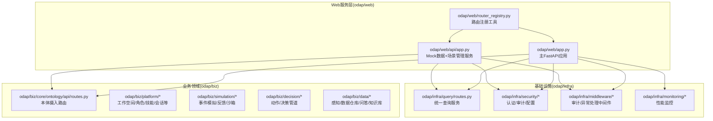
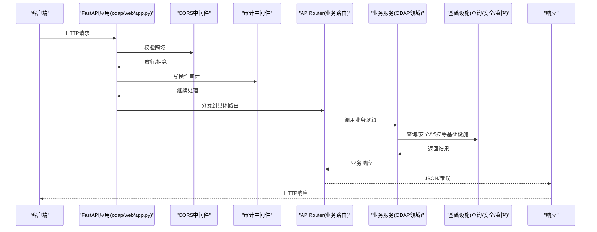
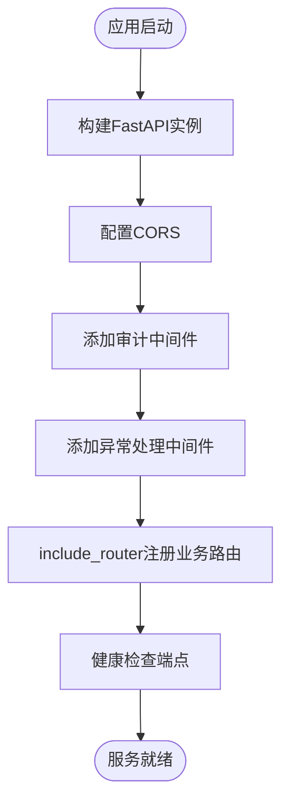
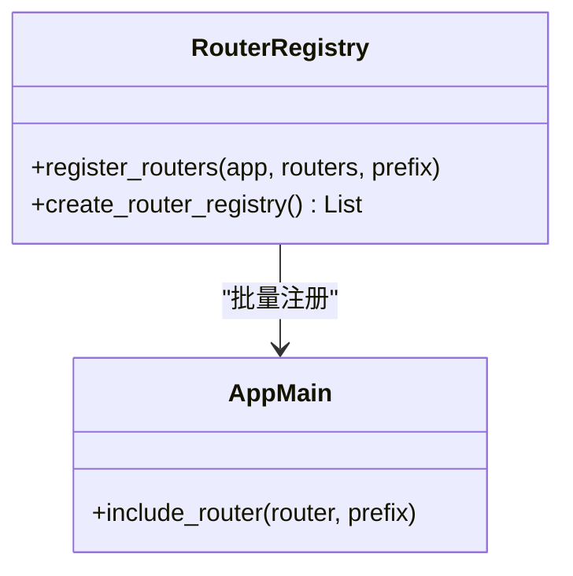
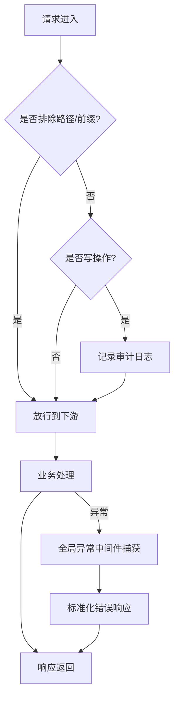
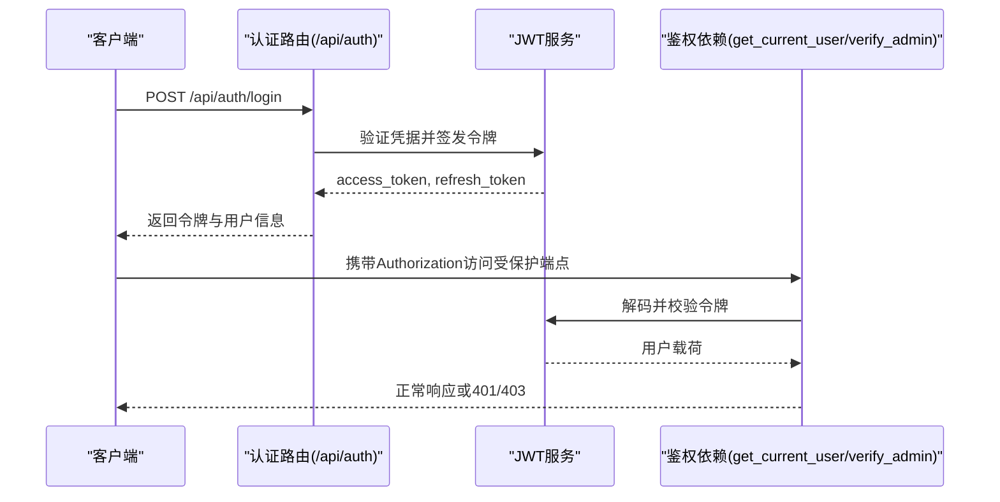
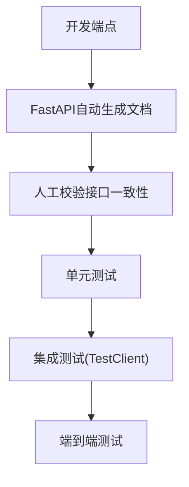
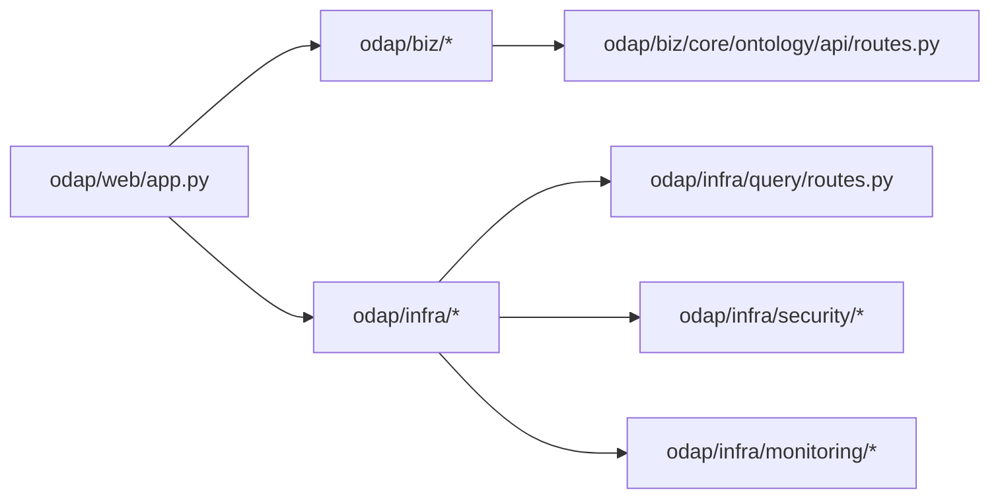

# 后端API服务

<cite>
**本文引用的文件**
- [odap/web/app.py](file://odap/web/app.py)
- [odap/web/api/app.py](file://odap/web/api/app.py)
- [odap/web/router_registry.py](file://odap/web/router_registry.py)
- [odap/infra/middleware/audit_middleware.py](file://odap/infra/middleware/audit_middleware.py)
- [odap/infra/middleware/exception_handler.py](file://odap/infra/middleware/exception_handler.py)
- [odap/infra/security/auth_routes.py](file://odap/infra/security/auth_routes.py)
- [odap/infra/security/jwt_auth.py](file://odap/infra/security/jwt_auth.py)
- [odap/infra/security/jwt_service.py](file://odap/infra/security/jwt_service.py)
- [odap/infra/security/config.py](file://odap/infra/security/config.py)
- [odap/biz/core/ontology/api/routes.py](file://odap/biz/core/ontology/api/routes.py)
- [odap/infra/query/routes.py](file://odap/infra/query/routes.py)
- [odap/infra/monitoring/performance_monitor.py](file://odap/infra/monitoring/performance_monitor.py)
- [tests/integration/test_api_integration.py](file://tests/integration/test_api_integration.py)
- [README.md](file://README.md)
- [docs/02-architecture/ARCHITECTURE_EVOLVE.md](file://docs/02-architecture/ARCHITECTURE_EVOLVE.md)
</cite>

## 目录
1. [简介](#简介)
2. [项目结构](#项目结构)
3. [核心组件](#核心组件)
4. [架构总览](#架构总览)
5. [详细组件分析](#详细组件分析)
6. [依赖分析](#依赖分析)
7. [性能考虑](#性能考虑)
8. [故障排查指南](#故障排查指南)
9. [结论](#结论)
10. [附录](#附录)

## 简介
本文件面向ODAP平台的后端API服务，系统性梳理基于FastAPI的应用架构、路由注册机制、中间件体系与安全策略，总结RESTful API设计规范、HTTP状态码使用与错误处理策略，并给出API版本管理、路由前缀规范、端点组织结构、API文档生成、测试策略与性能优化方案。文档旨在帮助开发者快速理解从基础路由到复杂业务API的完整实现路径。

## 项目结构
ODAP后端采用分层架构，Web服务位于odap/web，业务模块位于odap/biz，基础设施位于odap/infra，前端位于frontend，测试位于tests。FastAPI应用入口分别在odap/web/app.py（主应用）与odap/web/api/app.py（Mock数据与场景管理服务）。路由通过APIRouter集中注册，支持统一前缀与动态注册。

**图示来源**
- [odap/web/app.py:122-192](file://odap/web/app.py#L122-L192)
- [odap/web/api/app.py:303-516](file://odap/web/api/app.py#L303-L516)
- [odap/web/router_registry.py:10-32](file://odap/web/router_registry.py#L10-L32)
- [odap/biz/core/ontology/api/routes.py:13-13](file://odap/biz/core/ontology/api/routes.py#L13-L13)
- [odap/infra/query/routes.py:11-11](file://odap/infra/query/routes.py#L11-L11)
- [odap/infra/security/auth_routes.py:9-9](file://odap/infra/security/auth_routes.py#L9-L9)
- [odap/infra/middleware/audit_middleware.py:51-52](file://odap/infra/middleware/audit_middleware.py#L51-L52)
- [odap/infra/middleware/exception_handler.py:14-14](file://odap/infra/middleware/exception_handler.py#L14-L14)
- [odap/infra/monitoring/performance_monitor.py:12-12](file://odap/infra/monitoring/performance_monitor.py#L12-L12)

**章节来源**
- [README.md:27-122](file://README.md#L27-L122)
- [docs/02-architecture/ARCHITECTURE_EVOLVE.md:589-800](file://docs/02-architecture/ARCHITECTURE_EVOLVE.md#L589-L800)

## 核心组件
- FastAPI应用与生命周期
  - 主应用与Mock数据服务均通过FastAPI构造，设置title/description/version，并注册CORS、审计中间件与异常处理中间件。
  - 主应用在lifespan中初始化OpenHarness v1/v2集成与默认工作空间/场景。
- 路由注册机制
  - 通过APIRouter(prefix="/api/...")定义各模块路由前缀，集中include_router。
  - 提供router_registry工具批量注册与统一前缀管理。
- 中间件体系
  - 审计中间件：对写操作自动记录审计日志，排除健康检查、静态资源与审计自身端点。
  - 全局异常中间件：统一捕获未处理异常，输出标准化错误响应。
- 安全与认证
  - JWT鉴权：HTTPBearer，支持解码与过期/无效令牌处理。
  - 登录/刷新/用户管理：提供登录、用户列表/创建/更新/删除等端点。
  - 安全配置：从环境变量加载密钥、算法、CORS等。
- 查询与监控
  - 统一查询服务：支持schema/entity/topo/temporal四类查询源。
  - 性能监控：提供指标采集、统计与装饰器包装。

**章节来源**
- [odap/web/app.py:68-127](file://odap/web/app.py#L68-L127)
- [odap/web/api/app.py:516-540](file://odap/web/api/app.py#L516-L540)
- [odap/web/router_registry.py:10-32](file://odap/web/router_registry.py#L10-L32)
- [odap/infra/middleware/audit_middleware.py:51-112](file://odap/infra/middleware/audit_middleware.py#L51-L112)
- [odap/infra/middleware/exception_handler.py:14-137](file://odap/infra/middleware/exception_handler.py#L14-L137)
- [odap/infra/security/auth_routes.py:40-143](file://odap/infra/security/auth_routes.py#L40-L143)
- [odap/infra/security/jwt_auth.py:14-63](file://odap/infra/security/jwt_auth.py#L14-L63)
- [odap/infra/security/jwt_service.py:19-72](file://odap/infra/security/jwt_service.py#L19-L72)
- [odap/infra/security/config.py:29-80](file://odap/infra/security/config.py#L29-L80)
- [odap/infra/query/routes.py:18-101](file://odap/infra/query/routes.py#L18-L101)
- [odap/infra/monitoring/performance_monitor.py:12-184](file://odap/infra/monitoring/performance_monitor.py#L12-L184)

## 架构总览
下图展示ODAP后端API服务的整体交互：客户端请求进入FastAPI应用，经CORS与审计中间件，路由分发至各业务模块APIRouter，业务逻辑调用infra层服务，最终返回响应；异常统一由全局异常中间件处理；性能指标通过监控模块采集。

**图示来源**
- [odap/web/app.py:122-192](file://odap/web/app.py#L122-L192)
- [odap/infra/middleware/audit_middleware.py:51-112](file://odap/infra/middleware/audit_middleware.py#L51-L112)
- [odap/infra/middleware/exception_handler.py:20-67](file://odap/infra/middleware/exception_handler.py#L20-L67)
- [odap/biz/core/ontology/api/routes.py:74-126](file://odap/biz/core/ontology/api/routes.py#L74-L126)
- [odap/infra/query/routes.py:18-39](file://odap/infra/query/routes.py#L18-L39)

## 详细组件分析

### FastAPI应用与生命周期
- 主应用（odap/web/app.py）
  - 构造FastAPI实例，设置标题、描述、版本。
  - 配置CORS与审计中间件，注册全局异常处理。
  - 在lifespan中初始化OpenHarness v1/v2、默认工作空间与场景。
  - include_router注册各业务模块路由。
- Mock数据服务（odap/web/api/app.py）
  - 构建FastAPI实例，注册CORS与审计中间件。
  - include_router注册本体摄入、统一查询、OMS、工具注册表、技能系统、认证、角色、Agent、审计、工作空间、OPA策略、QA、知识库、Hook、MCP、前端兼容、事件模拟、决策、感知、模拟沙箱、业务管理、会话记忆、数据仓库、认知、反馈、推演、语义地图、对象服务、技能扩展等路由。
  - 提供基础端点：根路径、健康检查、场景管理、数据摄入、版本管理、实体历史、统计信息等。

**图示来源**
- [odap/web/app.py:122-192](file://odap/web/app.py#L122-L192)
- [odap/web/api/app.py:516-540](file://odap/web/api/app.py#L516-L540)

**章节来源**
- [odap/web/app.py:68-127](file://odap/web/app.py#L68-L127)
- [odap/web/api/app.py:303-516](file://odap/web/api/app.py#L303-L516)

### 路由注册机制与前缀规范
- APIRouter前缀
  - 本体摄入：/api/ontology/ingest
  - 工作空间：/api/workspaces
  - 角色：/api/roles
  - 审计：/api/audit
  - 技能：/api/skills
  - Hook：/api/hooks
  - MCP：/api/mcp
  - 事件模拟：/api/events
  - 前端兼容：/api/frontend
  - Agent：/api/agent
  - Agent管理：/api/management
  - 知识库：/api/knowledge
  - 本体管理：/api/ontology
  - 对象服务：/api/objects
  - 动作/决策：/api/actions,/api/decision
  - 感知：/api/perception
  - 沙箱：/api/sandbox
  - 业务管理：/api/business
  - 策略：/api/policies
  - 会话记忆：/api/sessions
  - 数据仓库：/api/data
  - 统一查询：/api/query
  - 问答：/api/qa
  - 认知：/api/cognition
  - 反馈：/api/feedback
- 路由注册工具
  - register_routers支持传入(路由, 前缀)元组，自动include_router。
  - create_router_registry维护默认路由注册表，便于集中管理与扩展。

**图示来源**
- [odap/web/router_registry.py:10-98](file://odap/web/router_registry.py#L10-L98)
- [odap/web/app.py:146-192](file://odap/web/app.py#L146-L192)

**章节来源**
- [odap/web/router_registry.py:10-98](file://odap/web/router_registry.py#L10-L98)
- [odap/web/app.py:146-192](file://odap/web/app.py#L146-L192)

### 中间件系统
- 审计中间件（AuditMiddleware）
  - 仅对写操作（POST/PUT/DELETE/PATCH）记录审计日志。
  - 排除/docs、/openapi.json、/redoc、/health、/favicon.ico及/static、/api/audit等前缀。
  - 从Authorization头解析JWT提取用户标识，记录方法、路径、状态码、耗时、客户端IP、Trace ID等。
- 全局异常中间件（ExceptionHandlerMiddleware）
  - 捕获未处理异常，输出标准化错误响应，区分400/403/500。
  - 支持自定义APIError/ValidationError/NotFoundError/ConflictError等。

**图示来源**
- [odap/infra/middleware/audit_middleware.py:51-112](file://odap/infra/middleware/audit_middleware.py#L51-L112)
- [odap/infra/middleware/exception_handler.py:20-67](file://odap/infra/middleware/exception_handler.py#L20-L67)

**章节来源**
- [odap/infra/middleware/audit_middleware.py:16-112](file://odap/infra/middleware/audit_middleware.py#L16-L112)
- [odap/infra/middleware/exception_handler.py:14-137](file://odap/infra/middleware/exception_handler.py#L14-L137)

### 认证授权机制与安全中间件
- JWT认证
  - HTTPBearer鉴权，decode_token解析并校验过期/无效令牌。
  - get_current_user/optional_current_user/verify_admin提供依赖注入。
  - JWTService负责签发access/refresh令牌、验证与载荷解析。
- 认证路由
  - /api/auth/login：用户名密码登录，返回access/refresh令牌与用户角色信息。
  - /api/auth/me：获取当前用户信息。
  - /api/auth/refresh：刷新令牌。
  - /api/auth/users：管理员用户管理（列表、创建、更新、删除）。
- 安全配置
  - 从环境变量加载OPENAI/NEO4J/JWT/CORS等配置，提供validate校验提示。

**图示来源**
- [odap/infra/security/auth_routes.py:40-143](file://odap/infra/security/auth_routes.py#L40-L143)
- [odap/infra/security/jwt_auth.py:14-63](file://odap/infra/security/jwt_auth.py#L14-L63)
- [odap/infra/security/jwt_service.py:19-72](file://odap/infra/security/jwt_service.py#L19-L72)
- [odap/infra/security/config.py:29-80](file://odap/infra/security/config.py#L29-L80)

**章节来源**
- [odap/infra/security/auth_routes.py:1-143](file://odap/infra/security/auth_routes.py#L1-L143)
- [odap/infra/security/jwt_auth.py:1-63](file://odap/infra/security/jwt_auth.py#L1-L63)
- [odap/infra/security/jwt_service.py:1-72](file://odap/infra/security/jwt_service.py#L1-L72)
- [odap/infra/security/config.py:1-80](file://odap/infra/security/config.py#L1-L80)

### RESTful API设计规范与HTTP状态码
- 设计规范
  - 资源命名：复数形式，如/api/workspaces、/api/roles、/api/skills。
  - 动作映射：GET/POST/PUT/DELETE/PATCH对应读取/创建/更新/删除/部分更新。
  - 响应模型：明确response_model，统一字段命名与嵌套结构。
  - 错误响应：遵循全局异常中间件输出的标准化结构，包含type/message/request_id/path。
- HTTP状态码使用
  - 2xx：成功，如200/201。
  - 4xx：客户端错误，如400/401/403/404/409。
  - 5xx：服务器错误，如500。
- 示例端点
  - 本体摄入：/api/ontology/ingest/*，支持news/manual/json/natural-language/random/tavily等。
  - 统一查询：/api/query/execute、/api/query/explain、/api/query/sources。
  - 性能监控：/api/v1/monitoring/performance、/api/v1/monitoring/performance/reset。

**章节来源**
- [odap/biz/core/ontology/api/routes.py:13-13](file://odap/biz/core/ontology/api/routes.py#L13-L13)
- [odap/infra/query/routes.py:18-101](file://odap/infra/query/routes.py#L18-L101)
- [odap/web/app.py:248-262](file://odap/web/app.py#L248-L262)
- [odap/infra/middleware/exception_handler.py:29-67](file://odap/infra/middleware/exception_handler.py#L29-L67)

### API版本管理与端点组织
- 版本管理
  - FastAPI实例设置version字段，如"2.0.0"。
  - 路由前缀体现版本意图，如/api/v1/monitoring。
- 端点组织
  - 按领域划分：本体/工作空间/角色/技能/Agent/事件模拟/决策/感知/沙箱/业务/策略/会话/数据/查询/问答/认知/反馈/推演/语义地图/对象服务等。
  - 统一前缀与标签(tags)，便于文档生成与维护。

**章节来源**
- [odap/web/app.py:122-127](file://odap/web/app.py#L122-L127)
- [odap/web/api/app.py:516-521](file://odap/web/api/app.py#L516-L521)
- [odap/web/router_registry.py:67-94](file://odap/web/router_registry.py#L67-L94)

### API文档生成与测试策略
- 文档生成
  - FastAPI自动生成/openapi.json与/docs、/redoc。
  - 通过title/description/version与tags提升文档质量。
- 测试策略
  - 集成测试覆盖工作空间、场景、本体摄入、问答、审计、事件模拟、技能、角色、Agent、策略、系统健康、图查询、前端兼容、完整摄入流程与错误处理等。
  - 使用TestClient发起请求，断言状态码与响应结构。

**图示来源**
- [tests/integration/test_api_integration.py:1-736](file://tests/integration/test_api_integration.py#L1-L736)

**章节来源**
- [tests/integration/test_api_integration.py:1-736](file://tests/integration/test_api_integration.py#L1-L736)

### 性能监控与优化
- 性能监控
  - PerformanceMonitor采集LLM调用、数据库查询、API请求、工具执行等指标，支持统计（均值/中位数/分位数）与导出。
  - 提供装饰器monitor_performance自动包裹函数，记录开始/结束与附加错误信息。
- 优化建议
  - 异步处理长耗时任务（如新闻摄入），避免阻塞主线程。
  - 合理设置CORS白名单，减少预检请求开销。
  - 使用审计中间件定位慢写操作，结合性能指标优化瓶颈。

**章节来源**
- [odap/infra/monitoring/performance_monitor.py:12-184](file://odap/infra/monitoring/performance_monitor.py#L12-L184)

## 依赖分析
- 组件耦合
  - Web应用与业务模块通过APIRouter解耦，业务逻辑下沉至biz层。
  - 安全与监控作为基础设施被各模块复用。
- 外部依赖
  - FastAPI/Starlette中间件生态、Pydantic数据模型、JWT库、uvicorn。
  - 环境变量驱动的安全与配置。

**图示来源**
- [odap/web/app.py:146-192](file://odap/web/app.py#L146-L192)
- [odap/infra/query/routes.py:11-11](file://odap/infra/query/routes.py#L11-L11)
- [odap/infra/security/auth_routes.py:9-9](file://odap/infra/security/auth_routes.py#L9-L9)
- [odap/infra/monitoring/performance_monitor.py:12-12](file://odap/infra/monitoring/performance_monitor.py#L12-L12)
- [odap/biz/core/ontology/api/routes.py:13-13](file://odap/biz/core/ontology/api/routes.py#L13-L13)

**章节来源**
- [odap/web/app.py:146-192](file://odap/web/app.py#L146-L192)

## 性能考虑
- 异步与并发
  - 使用async/await与异步任务（如新闻摄入后台处理）提升吞吐。
- 中间件与路由
  - 审计中间件仅对写操作记录，避免读操作日志风暴。
  - 路由前缀清晰，便于缓存与限流策略落地。
- 监控与告警
  - 结合性能监控指标与日志，建立慢请求与异常告警。

[本节为通用指导，无需特定文件引用]

## 故障排查指南
- 常见问题
  - 401/403：检查Authorization头与JWT有效性，确认get_current_user/verify_admin依赖注入。
  - 404：核对资源ID与路由前缀，确认include_router注册顺序。
  - 500：查看全局异常中间件日志，定位未捕获异常。
- 审计与日志
  - 审计中间件记录写操作详情，可用于回溯与取证。
  - 安全配置validate输出缺失或默认值提示，及时修正环境变量。

**章节来源**
- [odap/infra/middleware/exception_handler.py:29-67](file://odap/infra/middleware/exception_handler.py#L29-L67)
- [odap/infra/middleware/audit_middleware.py:51-112](file://odap/infra/middleware/audit_middleware.py#L51-L112)
- [odap/infra/security/config.py:55-80](file://odap/infra/security/config.py#L55-L80)

## 结论
ODAP后端API服务以FastAPI为核心，通过清晰的分层架构、统一的路由前缀与中间件体系，实现了高内聚、低耦合的服务组织。配合JWT认证、审计与异常处理中间件，以及统一查询与性能监控能力，满足从基础路由到复杂业务API的全栈需求。建议在实际部署中完善CORS白名单、接入OPA策略与细粒度权限控制，并持续通过测试与监控保障稳定性与性能。

[本节为总结，无需特定文件引用]

## 附录
- API端点清单（示例）
  - 认证：/api/auth/login、/api/auth/me、/api/auth/refresh、/api/auth/users
  - 本体摄入：/api/ontology/ingest、/api/ontology/ingest/news、/api/ontology/ingest/manual、/api/ontology/ingest/json、/api/ontology/ingest/natural-language、/api/ontology/ingest/random、/api/ontology/ingest/tavily
  - 统一查询：/api/query/execute、/api/query/explain、/api/query/sources
  - 性能监控：/api/v1/monitoring/performance、/api/v1/monitoring/performance/reset
- 测试参考
  - 集成测试覆盖工作空间、场景、本体摄入、问答、审计、事件模拟、技能、角色、Agent、策略、系统健康、图查询、前端兼容、完整摄入流程与错误处理。

**章节来源**
- [odap/infra/security/auth_routes.py:40-143](file://odap/infra/security/auth_routes.py#L40-L143)
- [odap/biz/core/ontology/api/routes.py:74-292](file://odap/biz/core/ontology/api/routes.py#L74-L292)
- [odap/infra/query/routes.py:18-101](file://odap/infra/query/routes.py#L18-L101)
- [odap/web/app.py:248-262](file://odap/web/app.py#L248-L262)
- [tests/integration/test_api_integration.py:1-736](file://tests/integration/test_api_integration.py#L1-L736)