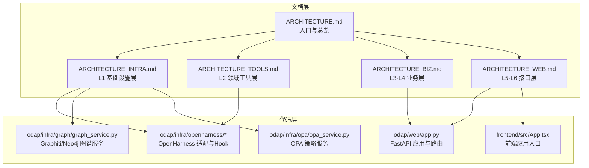
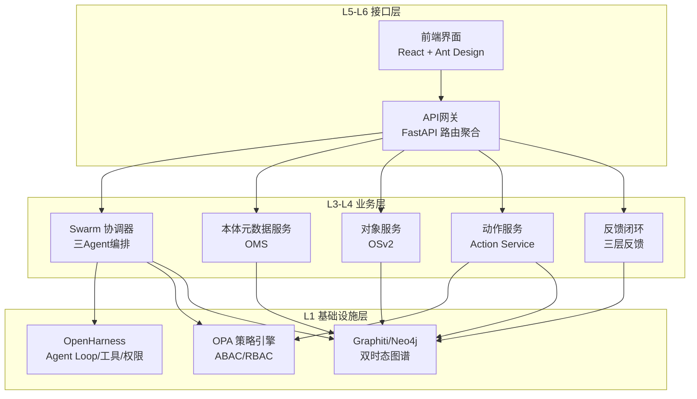
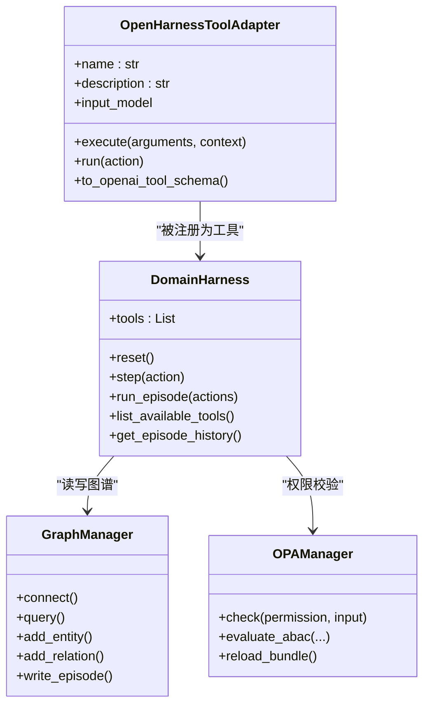
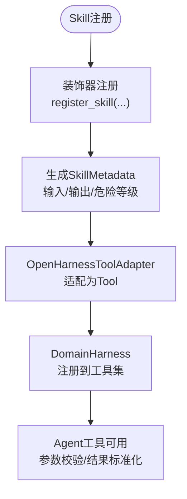
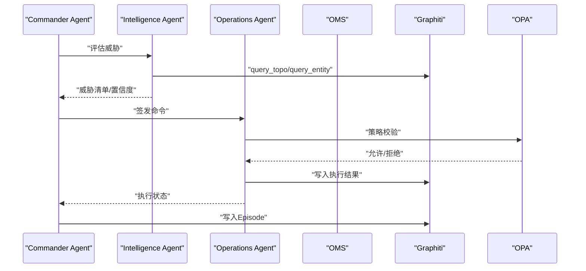
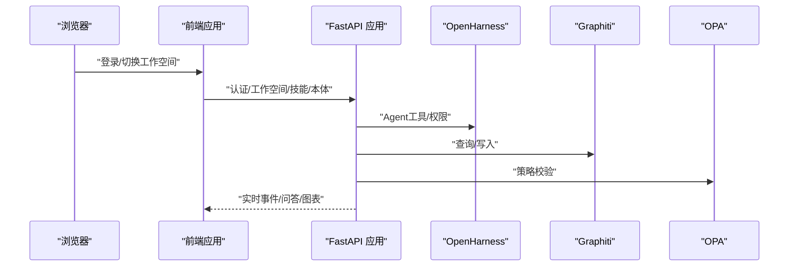
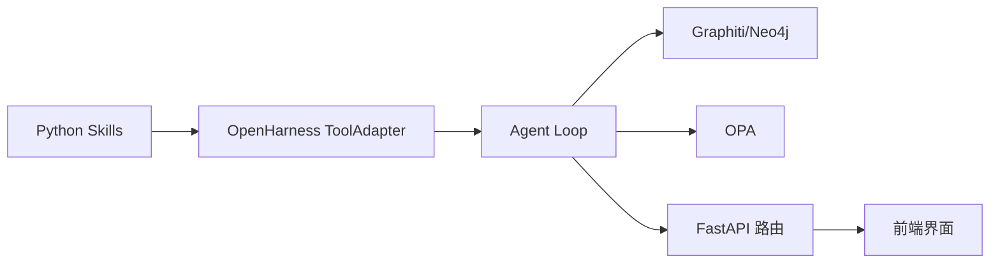

# 分层架构设计

<cite>
**本文引用的文件**
- [ARCHITECTURE.md](file://docs/02-architecture/ARCHITECTURE.md)
- [ARCHITECTURE_FULL_CHAIN.md](file://docs/02-architecture/ARCHITECTURE_FULL_CHAIN.md)
- [ARCHITECTURE_INFRA.md](file://docs/02-architecture/ARCHITECTURE_INFRA.md)
- [ARCHITECTURE_TOOLS.md](file://docs/02-architecture/ARCHITECTURE_TOOLS.md)
- [ARCHITECTURE_BIZ.md](file://docs/02-architecture/ARCHITECTURE_BIZ.md)
- [ARCHITECTURE_WEB.md](file://docs/02-architecture/ARCHITECTURE_WEB.md)
- [odap/web/app.py](file://odap/web/app.py)
- [odap/infra/openharness/tool_adapter.py](file://odap/infra/openharness/tool_adapter.py)
- [odap/infra/openharness/query_guard_hook.py](file://odap/infra/openharness/query_guard_hook.py)
- [odap/infra/graph/graph_service.py](file://odap/infra/graph/graph_service.py)
- [odap/infra/opa/opa_service.py](file://odap/infra/opa/opa_service.py)
- [frontend/src/App.tsx](file://frontend/src/App.tsx)
- [config/agent_config.yaml](file://config/agent_config.yaml)
</cite>

## 目录
1. [引言](#引言)
2. [项目结构](#项目结构)
3. [核心组件](#核心组件)
4. [架构总览](#架构总览)
5. [详细组件分析](#详细组件分析)
6. [依赖分析](#依赖分析)
7. [性能考虑](#性能考虑)
8. [故障排查指南](#故障排查指南)
9. [结论](#结论)
10. [附录](#附录)

## 引言
本文件面向ODAP平台的分层架构设计，围绕L1至L6各层的职责划分、组件构成与交互关系进行系统化阐述。重点覆盖：
- L1基础设施层（OpenHarness、Graphiti、OPA）如何提供Agent Loop、图谱与策略治理等基础能力；
- L2领域工具层（Python Skills）的可插拔特性与工具注册机制；
- L3-L4业务层（Agent协同、本体管理、动作服务、反馈闭环）的业务逻辑实现；
- L5-L6接口层（前端界面、API端点）的用户交互设计；
- 层间依赖关系与数据流向分析；
- 各层扩展点与定制化方案。

## 项目结构
ODAP采用“文档分层 + 代码分层”双层组织方式：文档按层级拆分为多篇子文档，代码按模块化分层组织，形成“文档指导设计、代码实现架构”的闭环。

**图表来源**
- [ARCHITECTURE.md:1-626](file://docs/02-architecture/ARCHITECTURE.md#L1-L626)
- [odap/web/app.py:1-262](file://odap/web/app.py#L1-L262)
- [odap/infra/openharness/tool_adapter.py:1-488](file://odap/infra/openharness/tool_adapter.py#L1-L488)
- [odap/infra/graph/graph_service.py:1-200](file://odap/infra/graph/graph_service.py#L1-L200)
- [odap/infra/opa/opa_service.py:1-200](file://odap/infra/opa/opa_service.py#L1-L200)
- [frontend/src/App.tsx:1-65](file://frontend/src/App.tsx#L1-L65)

**章节来源**
- [ARCHITECTURE.md:1-626](file://docs/02-architecture/ARCHITECTURE.md#L1-L626)

## 核心组件
- L1 基础设施层
  - OpenHarness：提供Agent Loop、Swarm协调、工具系统、权限与Hook机制，屏蔽Agent基础设施复杂度。
  - Graphiti：双时态知识图谱，支撑历史回溯与时序推理，兼容Neo4j直连与NetworkX回退。
  - OPA：策略治理引擎，提供ABAC/RBAC策略、策略热更新与沙箱模拟。
- L2 领域工具层
  - Python Skills：通过OpenHarness原生Tool接口接入，实现情报、操作、分析、可视化等可插拔工具。
- L3-L4 业务层
  - 三Agent协同（Commander/Intelligence/Operations）与OODA闭环；
  - 本体管理（OMS）与对象服务（OSv2）；
  - 动作服务（Action Service）与三层反馈闭环。
- L5-L6 接口层
  - 前端React应用，支持移动端优先、实时通信与问答图表系统；
  - 后端FastAPI路由聚合，统一暴露业务能力。

**章节来源**
- [ARCHITECTURE_INFRA.md:1-200](file://docs/02-architecture/ARCHITECTURE_INFRA.md#L1-L200)
- [ARCHITECTURE_TOOLS.md:1-160](file://docs/02-architecture/ARCHITECTURE_TOOLS.md#L1-L160)
- [ARCHITECTURE_BIZ.md:1-800](file://docs/02-architecture/ARCHITECTURE_BIZ.md#L1-L800)
- [ARCHITECTURE_WEB.md:1-200](file://docs/02-architecture/ARCHITECTURE_WEB.md#L1-L200)

## 架构总览
ODAP采用“四层组件定位 + 语义层统一查询”的总体架构，强调“本体为核心、Agent为载体、策略为边界、前端为入口”。

**图表来源**
- [ARCHITECTURE.md:392-588](file://docs/02-architecture/ARCHITECTURE.md#L392-L588)
- [odap/web/app.py:146-192](file://odap/web/app.py#L146-L192)

**章节来源**
- [ARCHITECTURE.md:392-588](file://docs/02-architecture/ARCHITECTURE.md#L392-L588)

## 详细组件分析

### L1 基础设施层（OpenHarness、Graphiti、OPA）
- OpenHarness
  - 通过Tool适配层将Python Skills转换为Agent可调用工具，统一参数校验与结果标准化。
  - 提供Swarm协调器、权限检查、Hook生命周期（PreTool/PostTool）等能力。
  - 通过QueryEngine（v2）或传统Harness（v1）承载Agent Loop。
- Graphiti
  - 三层降级策略：Graphiti（核心）→ Neo4j Driver直连 → NetworkX回退，确保在不同环境下的可用性。
  - 支持双时态知识图谱，满足历史回溯与时序推理需求。
- OPA
  - 支持ABAC/RBAC策略模型，提供策略热更新Bundle与策略沙箱。
  - 通过PreToolUse Hook拦截写操作，实现“Agent Safe”默认拒绝策略。

**图表来源**
- [odap/infra/openharness/tool_adapter.py:83-488](file://odap/infra/openharness/tool_adapter.py#L83-L488)
- [odap/infra/graph/graph_service.py:71-200](file://odap/infra/graph/graph_service.py#L71-L200)
- [odap/infra/opa/opa_service.py:114-200](file://odap/infra/opa/opa_service.py#L114-L200)

**章节来源**
- [odap/infra/openharness/tool_adapter.py:1-488](file://odap/infra/openharness/tool_adapter.py#L1-L488)
- [odap/infra/openharness/query_guard_hook.py:1-175](file://odap/infra/openharness/query_guard_hook.py#L1-L175)
- [odap/infra/graph/graph_service.py:1-200](file://odap/infra/graph/graph_service.py#L1-L200)
- [odap/infra/opa/opa_service.py:1-200](file://odap/infra/opa/opa_service.py#L1-L200)

### L2 领域工具层（Python Skills）
- 可插拔工具体系
  - 通过装饰器注册Skill，统一输入/输出模型与危险等级标注。
  - 适配为OpenHarness Tool，自动暴露到Agent工具集。
- 工具分类
  - 智能体工具（Intelligence）：雷达搜索、威胁评估、模式匹配等；
  - 操作工具（Operations）：攻击目标、命令部队、路线规划等；
  - 分析与可视化工具：异常检测、趋势分析、关系图可视化等。

**图表来源**
- [ARCHITECTURE_TOOLS.md:99-160](file://docs/02-architecture/ARCHITECTURE_TOOLS.md#L99-L160)
- [odap/infra/openharness/tool_adapter.py:83-310](file://odap/infra/openharness/tool_adapter.py#L83-L310)

**章节来源**
- [ARCHITECTURE_TOOLS.md:1-160](file://docs/02-architecture/ARCHITECTURE_TOOLS.md#L1-L160)
- [odap/infra/openharness/tool_adapter.py:1-488](file://odap/infra/openharness/tool_adapter.py#L1-L488)

### L3-L4 业务层（Agent协同、本体管理、动作服务、反馈闭环）
- 三Agent协同与OODA闭环
  - Commander：最终决策者，负责多方案排序与OPA复核；
  - Intelligence：态势感知与威胁分析，使用Graphiti进行时序检索；
  - Operations：行动计划生成与执行，写回Graphiti并触发反馈闭环。
- 本体管理与对象服务
  - OMS：对象类型、属性、链接、动作类型的元数据管理；
  - OSv2：多源联邦查询（图/业务/知识库/代理），统一对象访问。
- 动作服务与三层反馈
  - 动作生命周期：提交→校验→OPA→执行→写回→反馈；
  - 反馈闭环：收集→分析→聚合，更新图谱与触发Hook事件。

**图表来源**
- [ARCHITECTURE_BIZ.md:552-706](file://docs/02-architecture/ARCHITECTURE_BIZ.md#L552-L706)
- [odap/infra/openharness/query_guard_hook.py:40-83](file://odap/infra/openharness/query_guard_hook.py#L40-L83)

**章节来源**
- [ARCHITECTURE_BIZ.md:1-800](file://docs/02-architecture/ARCHITECTURE_BIZ.md#L1-L800)

### L5-L6 接口层（前端界面、API端点）
- 前端架构
  - React 19 + TypeScript，Ant Design 6，Zustand状态管理；
  - 移动优先响应式布局，WebSocket + SSE 实时推送；
  - 问答图表系统可扩展，支持多种图表类型与模板。
- API端点
  - FastAPI统一聚合路由，涵盖本体管理、工作空间、角色、技能、Hook、MCP、事件模拟、Agent、动作服务、感知、决策流水线、仿真沙盒、业务管理、会话记忆、数据仓库、查询服务、QA引擎、认知、反馈、语义地图、运行时、本体记忆、服务化与蓝图等。

**图表来源**
- [frontend/src/App.tsx:1-65](file://frontend/src/App.tsx#L1-L65)
- [odap/web/app.py:146-192](file://odap/web/app.py#L146-L192)

**章节来源**
- [ARCHITECTURE_WEB.md:1-200](file://docs/02-architecture/ARCHITECTURE_WEB.md#L1-L200)
- [odap/web/app.py:1-262](file://odap/web/app.py#L1-L262)
- [frontend/src/App.tsx:1-65](file://frontend/src/App.tsx#L1-L65)

## 依赖分析
- 层间依赖
  - L5-L6接口层依赖L3-L4业务层提供的API能力；
  - L3-L4业务层依赖L1基础设施层的OpenHarness、Graphiti与OPA；
  - L2工具层通过OpenHarness Tool接口被L3-L4业务层复用。
- 关键依赖点
  - OpenHarness Tool适配层将Python Skills注入Agent工具集；
  - QueryService统一查询服务通过OpenHarness Hook实现写操作安全边界；
  - GraphManager三层降级策略保障在不同环境下的可用性；
  - OPA策略热更新与沙箱提升策略治理的灵活性与安全性。

**图表来源**
- [odap/infra/openharness/tool_adapter.py:292-310](file://odap/infra/openharness/tool_adapter.py#L292-L310)
- [odap/web/app.py:146-192](file://odap/web/app.py#L146-L192)

**章节来源**
- [odap/infra/openharness/tool_adapter.py:1-488](file://odap/infra/openharness/tool_adapter.py#L1-L488)
- [odap/web/app.py:1-262](file://odap/web/app.py#L1-L262)

## 性能考虑
- 图谱访问
  - GraphManager采用连接池与断路器策略，降低连接开销与异常扩散；
  - 三层降级策略确保在graphiti-core或Neo4j不可用时仍可运行。
- 策略评估
  - OPA支持批量权限检查与缓存，减少重复评估；
  - 策略沙箱支持What-If模拟，避免线上策略变更风险。
- 前端体验
  - WebSocket + SSE 实时推送，降低轮询开销；
  - 移动优先设计减少不必要的渲染与网络请求。

**章节来源**
- [odap/infra/graph/graph_service.py:128-200](file://odap/infra/graph/graph_service.py#L128-L200)
- [odap/infra/opa/opa_service.py:82-112](file://odap/infra/opa/opa_service.py#L82-L112)
- [ARCHITECTURE_WEB.md:47-100](file://docs/02-architecture/ARCHITECTURE_WEB.md#L47-L100)

## 故障排查指南
- OpenHarness不可用
  - 现象：DomainHarness初始化失败或工具列表为空；
  - 排查：检查openharness安装路径与版本，确认v1或v2可用性。
- 图谱连接失败
  - 现象：GraphManager连接Neo4j失败，回落到NetworkX；
  - 排查：检查Neo4j URI/凭据、网络连通性与graphiti-core安装。
- OPA策略校验失败
  - 现象：写操作被拒绝或策略加载异常；
  - 排查：确认策略Bundle版本、策略沙箱模拟与环境变量配置。
- 前端工作空间切换异常
  - 现象：切换后未加载最新本体/技能/策略；
  - 排查：确认localStorage中的当前工作空间ID与后端工作空间列表一致性。

**章节来源**
- [odap/infra/openharness/tool_adapter.py:38-77](file://odap/infra/openharness/tool_adapter.py#L38-L77)
- [odap/infra/graph/graph_service.py:145-200](file://odap/infra/graph/graph_service.py#L145-L200)
- [odap/infra/opa/opa_service.py:93-112](file://odap/infra/opa/opa_service.py#L93-L112)
- [frontend/src/App.tsx:14-40](file://frontend/src/App.tsx#L14-L40)

## 结论
ODAP通过“四层组件定位 + 语义层统一查询”的架构设计，实现了以本体为核心、Agent为载体、策略为边界、前端为入口的闭环体系。L1基础设施层提供稳定可靠的基础能力，L2工具层实现可插拔的领域能力，L3-L4业务层承载复杂的决策与执行流程，L5-L6接口层提供友好的用户交互。该架构在保证安全性与可维护性的同时，提供了良好的扩展性与定制化能力。

## 附录
- 扩展点与定制化方案
  - L1：新增OpenHarness插件（Hook/权限/工具）与策略Bundle；
  - L2：新增Python Skill并通过装饰器注册，支持危险等级与OPA校验；
  - L3-L4：扩展三Agent角色与动作类型，完善本体元数据与对象服务；
  - L5-L6：前端组件化与图表系统扩展，支持多设备与国际化。

**章节来源**
- [ARCHITECTURE.md:298-378](file://docs/02-architecture/ARCHITECTURE.md#L298-L378)
- [ARCHITECTURE_TOOLS.md:99-160](file://docs/02-architecture/ARCHITECTURE_TOOLS.md#L99-L160)
- [ARCHITECTURE_WEB.md:14-45](file://docs/02-architecture/ARCHITECTURE_WEB.md#L14-L45)