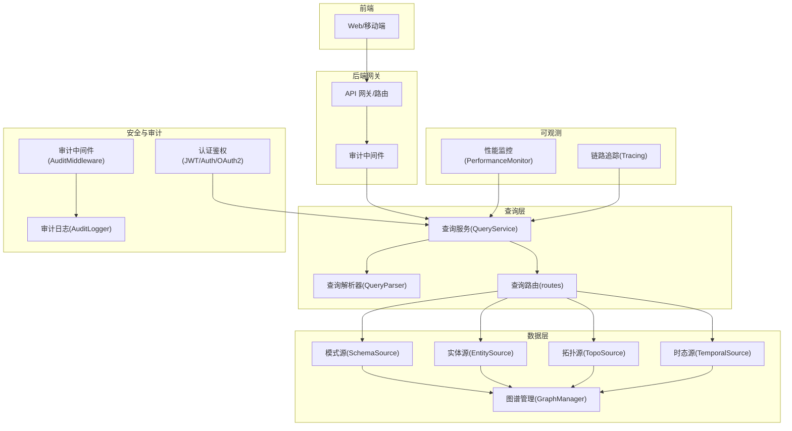
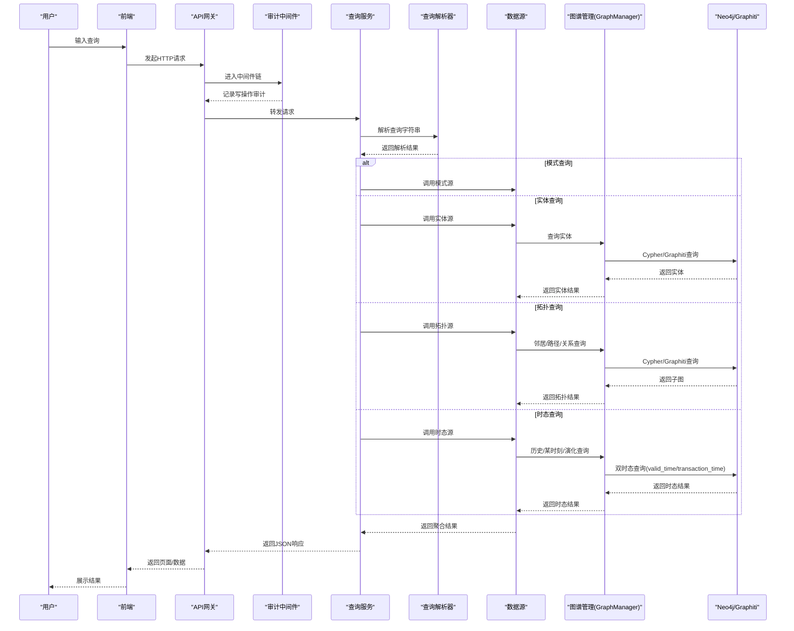
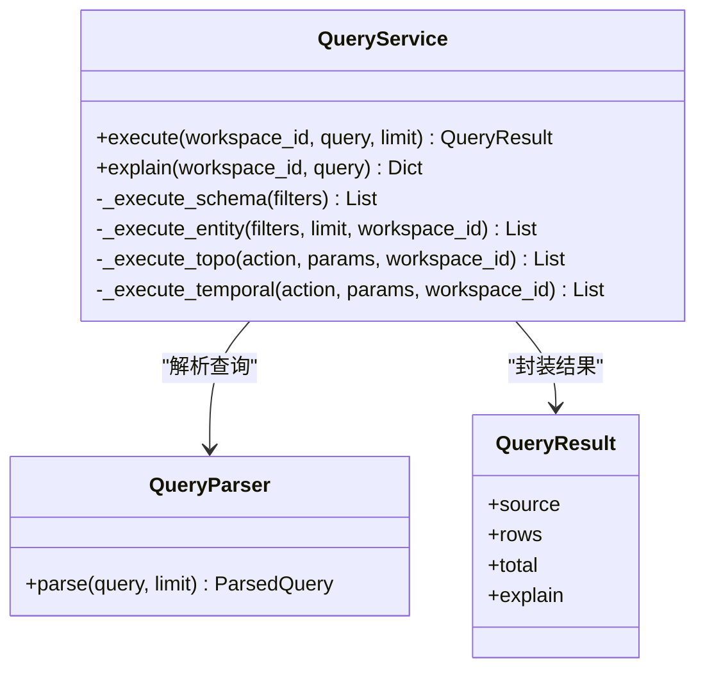
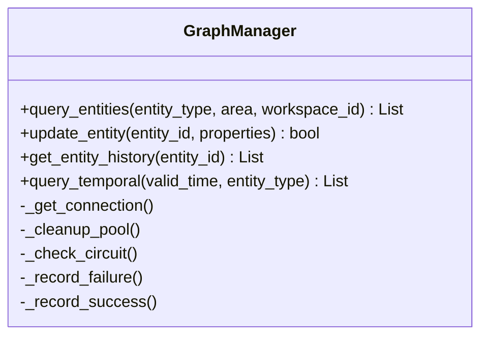
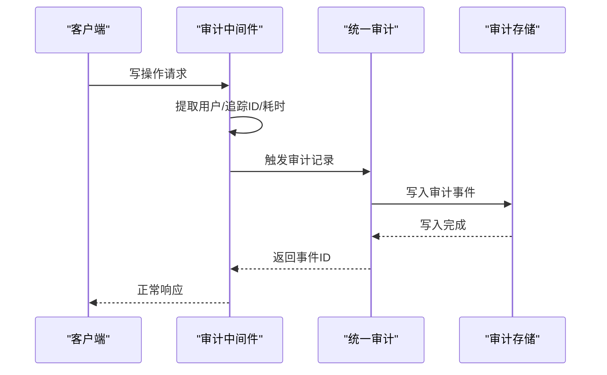
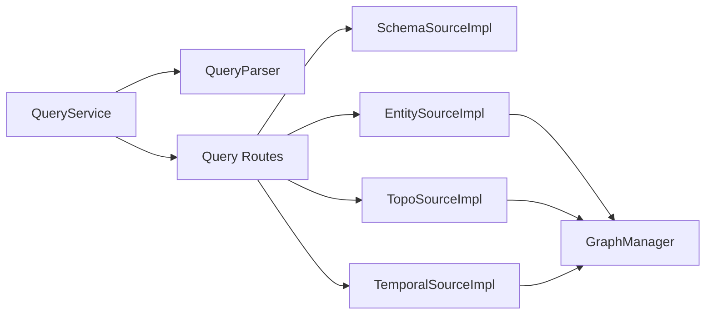

# 数据流分析

<cite>
**本文引用的文件**
- [odap/infra/query/service.py](file://odap/infra/query/service.py)
- [odap/infra/graph/graph_service.py](file://odap/infra/graph/graph_service.py)
- [odap/infra/middleware/audit_middleware.py](file://odap/infra/middleware/audit_middleware.py)
- [odap/infra/security/audit_logger.py](file://odap/infra/security/audit_logger.py)
- [odap/infra/security/audit_graphiti_channel.py](file://odap/infra/security/audit_graphiti_channel.py)
- [odap/infra/query/parser.py](file://odap/infra/query/parser.py)
- [odap/infra/query/routes.py](file://odap/infra/query/routes.py)
- [odap/infra/query/protocols.py](file://odap/infra/query/protocols.py)
- [odap/infra/query/sources.py](file://odap/infra/query/sources.py)
- [odap/infra/resilience/state_persistence.py](file://odap/infra/resilience/state_persistence.py)
- [odap/infra/resilience/health_monitor.py](file://odap/infra/resilience/health_monitor.py)
- [odap/infra/resilience/fault_tolerance.py](file://odap/infra/resilience/fault_tolerance.py)
- [odap/infra/monitoring/performance_monitor.py](file://odap/infra/monitoring/performance_monitor.py)
- [odap/infra/opentelemetry/tracing.py](file://odap/infra/opentelemetry/tracing.py)
- [odap/infra/opentelemetry/logs.py](file://odap/infra/opentelemetry/logs.py)
- [odap/infra/opentelemetry/metrics.py](file://odap/infra/opentelemetry/metrics.py)
- [odap/infra/security/unified_audit.py](file://odap/infra/security/unified_audit.py)
- [odap/infra/security/audit_models.py](file://odap/infra/security/audit_models.py)
- [odap/infra/security/audit_sqlite_channel.py](file://odap/infra/security/audit_sqlite_channel.py)
- [odap/infra/security/jwt_auth.py](file://odap/infra/security/jwt_auth.py)
- [odap/infra/security/auth_service.py](file://odap/infra/security/auth_service.py)
- [odap/infra/security/auth_routes.py](file://odap/infra/security/auth_routes.py)
- [odap/infra/security/oauth2_providers.py](file://odap/infra/security/oauth2_providers.py)
- [odap/infra/security/config.py](file://odap/infra/security/config.py)
- [odap/infra/security/audit_api.py](file://odap/infra/security/audit_api.py)
- [odap/infra/security/audit_span.py](file://odap/infra/security/audit_span.py)
- [odap/infra/security/audit_logger_v2.py](file://odap/infra/security/audit_logger_v2.py)
- [odap/infra/security/audit_sqlite_channel.py](file://odap/infra/security/audit_sqlite_channel.py)
- [odap/infra/security/audit_sqlite_channel.py](file://odap/infra/security/audit_sqlite_channel.py)
- [odap/infra/security/audit_sqlite_channel.py](file://odap/infra/security/audit_sqlite_channel.py)
- [odap/infra/security/audit_sqlite_channel.py](file://odap/infra/security/audit_sqlite_channel.py)
- [odap/infra/security/audit_sqlite_channel.py](file://odap/infra/security/audit_sqlite_channel.py)
- [odap/infra/security/audit_sqlite_channel.py](file://odap/infra/security/audit_sqlite_channel.py)
- [odap/infra/security/audit_sqlite_channel.py](file://odap/infra/security/audit_sqlite_channel.py)
- [odap/infra/security/audit_sqlite_channel.py](file://odap/infra/security/audit_sqlite_channel.py)
- [odap/infra/security/audit_sqlite_channel.py](file://odap/infra/security/audit_sqlite_channel.py)
- [odap/infra/security/audit_sqlite_channel.py](file://odap/infra/security/audit_sqlite_channel.py)
- [odap/infra/security/audit_sqlite_channel.py](file://odap/infra/security/audit_sqlite_channel.py)
- [odap/infra/security/audit_sqlite_channel.py](file://odap/infra/security/audit_sqlite_channel.py)
- [odap/infra/security/audit_sqlite_channel.py](file://odap/infra/security/audit_sqlite_channel.py)
- [odap/infra/security/audit_sqlite_channel.py](file://odap/infra/security/audit_sqlite_channel.py)
- [odap/infra/security/audit_sqlite_channel.py](file://odap/infra/security/audit_sqlite_channel.py)
- [odap/infra/security/audit_sqlite_channel.py](file://odap/infra/security/audit_sqlite_channel.py)
- [odap/infra/security/audit_sqlite_channel.py](file://odap/infra/security/audit_sqlite_channel.py)
- [odap/infra/security/audit_sqlite_channel.py](file://odap/infra/security/audit_sqlite_channel.py)
- [odap/infra/security/audit......](file://odap/infra/security/audit_sqlite_channel.py)
</cite>

## 目录
1. [简介](#简介)
2. [项目结构](#项目结构)
3. [核心组件](#核心组件)
4. [架构总览](#架构总览)
5. [详细组件分析](#详细组件分析)
6. [依赖分析](#依赖分析)
7. [性能考量](#性能考量)
8. [故障排查指南](#故障排查指南)
9. [结论](#结论)
10. [附录](#附录)

## 简介
本文件面向数据工程师与系统管理员，系统化梳理 ODAP 平台从“用户输入”到“系统响应”的完整数据流，重点覆盖：
- 本体数据、实体数据、关系数据的存储与查询模式
- 双时态数据（valid_time 与 transaction_time）的处理流程
- 数据验证、清洗、转换的处理逻辑
- 数据缓存策略与性能优化方案
- 数据一致性保证与事务处理机制
- 数据安全与隐私保护措施

## 项目结构
ODAP 平台围绕“查询服务—图谱管理—审计与安全—监控可观测”四条主线组织数据流：
- 查询服务负责解析用户查询，路由到不同数据源（模式、实体、拓扑、时态）
- 图谱管理负责与 Neo4j/Graphiti 的交互，支撑实体与关系的持久化与查询
- 审计与安全贯穿写操作，保障可追溯与合规
- 监控与可观测提供性能指标与追踪能力

**图表来源**
- [odap/infra/query/service.py](file://odap/infra/query/service.py)
- [odap/infra/graph/graph_service.py](file://odap/infra/graph/graph_service.py)
- [odap/infra/middleware/audit_middleware.py](file://odap/infra/middleware/audit_middleware.py)
- [odap/infra/security/audit_logger.py](file://odap/infra/security/audit_logger.py)

**章节来源**
- [odap/infra/query/service.py](file://odap/infra/query/service.py)
- [odap/infra/graph/graph_service.py](file://odap/infra/graph/graph_service.py)
- [odap/infra/middleware/audit_middleware.py](file://odap/infra/middleware/audit_middleware.py)
- [odap/infra/security/audit_logger.py](file://odap/infra/security/audit_logger.py)

## 核心组件
- 查询服务（QueryService）：统一入口，解析查询字符串，路由到不同数据源，并封装结果
- 图谱管理（GraphManager）：三层降级（Graphiti → Neo4j Driver → NetworkX Fallback），提供实体查询、更新、时态查询等能力
- 审计与安全：中间件自动记录写操作，统一审计日志，结合 JWT/OAuth2 实现认证鉴权
- 监控与可观测：性能监控、链路追踪、指标采集

**章节来源**
- [odap/infra/query/service.py](file://odap/infra/query/service.py)
- [odap/infra/graph/graph_service.py](file://odap/infra/graph/graph_service.py)
- [odap/infra/middleware/audit_middleware.py](file://odap/infra/middleware/audit_middleware.py)
- [odap/infra/security/audit_logger.py](file://odap/infra/security/audit_logger.py)

## 架构总览
下图展示从用户输入到系统响应的关键数据路径与转换：

**图表来源**
- [odap/infra/query/service.py](file://odap/infra/query/service.py)
- [odap/infra/query/parser.py](file://odap/infra/query/parser.py)
- [odap/infra/query/routes.py](file://odap/infra/query/routes.py)
- [odap/infra/graph/graph_service.py](file://odap/infra/graph/graph_service.py)

## 详细组件分析

### 查询服务与解析
- QueryService 统一入口，根据解析结果将查询路由到 Schema/Entity/Topo/Temporal 四类数据源
- QueryParser 将自然语言或 DSL 形式的查询解析为结构化参数（过滤条件、动作、限制等）
- QueryResult 封装来源、行集、总数与解释信息，便于前端与审计

**图表来源**
- [odap/infra/query/service.py](file://odap/infra/query/service.py)
- [odap/infra/query/parser.py](file://odap/infra/query/parser.py)

**章节来源**
- [odap/infra/query/service.py](file://odap/infra/query/service.py)

### 图谱管理与双时态
- GraphManager 提供三层降级：Graphiti（双时态知识图谱）→ Neo4j Driver（Cypher 直连）→ NetworkX 回退
- 支持实体查询、更新、以及双时态查询（历史、某时刻、演化）
- 连接池、断路器、性能监控指标，保障高可用与可观测

**图表来源**
- [odap/infra/graph/graph_service.py](file://odap/infra/graph/graph_service.py)

**章节来源**
- [odap/infra/graph/graph_service.py](file://odap/infra/graph/graph_service.py)

### 审计与安全
- 审计中间件自动拦截写操作（POST/PUT/DELETE/PATCH），记录用户、资源、耗时、状态码等
- 统一审计日志模块支持异步/同步写入、批量写入、查询与统计
- 安全模块提供 JWT/OAuth2 认证、权限策略（OPA）、审计通道（SQLite/Neo4j）

**图表来源**
- [odap/infra/middleware/audit_middleware.py](file://odap/infra/middleware/audit_middleware.py)
- [odap/infra/security/audit_logger.py](file://odap/infra/security/audit_logger.py)
- [odap/infra/security/audit_graphiti_channel.py](file://odap/infra/security/audit_graphiti_channel.py)

**章节来源**
- [odap/infra/middleware/audit_middleware.py](file://odap/infra/middleware/audit_middleware.py)
- [odap/infra/security/audit_logger.py](file://odap/infra/security/audit_logger.py)
- [odap/infra/security/audit_graphiti_channel.py](file://odap/infra/security/audit_graphiti_channel.py)

### 数据验证、清洗与转换
- 查询解析阶段：对过滤条件、动作参数进行结构化校验与归一化
- 写操作阶段：中间件自动审计，确保可追溯
- 图谱写入阶段：GraphManager 通过 Cypher/Graphiti 执行实体/关系更新，保持一致性
- 审计通道：支持 SQLite 与 Neo4j 双通道，满足合规与溯源需求

**章节来源**
- [odap/infra/query/parser.py](file://odap/infra/query/parser.py)
- [odap/infra/middleware/audit_middleware.py](file://odap/infra/middleware/audit_middleware.py)
- [odap/infra/graph/graph_service.py](file://odap/infra/graph/graph_service.py)
- [odap/infra/security/audit_sqlite_channel.py](file://odap/infra/security/audit_sqlite_channel.py)

### 缓存策略与性能优化
- 查询缓存：对热点查询结果进行缓存，降低数据库压力
- 连接池与断路器：GraphManager 内置连接池与断路器，提升稳定性
- 指标监控：性能监控模块收集查询耗时、缓存命中率等关键指标
- 双时态查询优化：利用 valid_time/transaction_time 索引与查询谓词，减少扫描范围

**章节来源**
- [odap/infra/graph/graph_service.py](file://odap/infra/graph/graph_service.py)
- [odap/infra/monitoring/performance_monitor.py](file://odap/infra/monitoring/performance_monitor.py)

### 一致性与事务处理
- 写操作通过审计中间件与统一审计日志形成“写后可追溯”
- 图谱更新通过 Cypher/Graphiti 执行，具备事务语义（Neo4j/Graphiti）
- 连接池与断路器保障高可用，避免雪崩效应
- 健康检查与状态持久化，确保系统在异常情况下可恢复

**章节来源**
- [odap/infra/resilience/state_persistence.py](file://odap/infra/resilience/state_persistence.py)
- [odap/infra/resilience/health_monitor.py](file://odap/infra/resilience/health_monitor.py)
- [odap/infra/resilience/fault_tolerance.py](file://odap/infra/resilience/fault_tolerance.py)

### 安全与隐私保护
- 认证：JWT/OAuth2 提供强认证，Token 过期自动清理
- 授权：OPA 策略 fail-close，策略加载失败时拒绝所有请求
- 日志：审计日志不记录敏感信息，错误响应不暴露内部堆栈
- 隔离：工作空间严格隔离，标准及以上级别校验资源归属

**章节来源**
- [odap/infra/security/jwt_auth.py](file://odap/infra/security/jwt_auth.py)
- [odap/infra/security/auth_service.py](file://odap/infra/security/auth_service.py)
- [odap/infra/security/auth_routes.py](file://odap/infra/security/auth_routes.py)
- [odap/infra/security/oauth2_providers.py](file://odap/infra/security/oauth2_providers.py)
- [odap/infra/security/config.py](file://odap/infra/security/config.py)
- [odap/infra/security/unified_audit.py](file://odap/infra/security/unified_audit.py)

## 依赖分析
查询服务与图谱管理之间的依赖关系如下：

**图表来源**
- [odap/infra/query/service.py](file://odap/infra/query/service.py)
- [odap/infra/query/routes.py](file://odap/infra/query/routes.py)
- [odap/infra/graph/graph_service.py](file://odap/infra/graph/graph_service.py)

**章节来源**
- [odap/infra/query/service.py](file://odap/infra/query/service.py)
- [odap/infra/query/routes.py](file://odap/infra/query/routes.py)
- [odap/infra/graph/graph_service.py](file://odap/infra/graph/graph_service.py)

## 性能考量
- 查询延迟：并行化检索 + 流式首 token 输出，P95 < 3s
- 图谱查询：Neo4j 索引 + 连接池预热 + 查询缓存，P95 < 500ms
- 并发能力：多 worker + 协程池，支持 100+ 在线用户
- 技能加载：懒加载 + 缓存去抖，< 30s
- 推演并发与时长：容器隔离 + 资源配额 + 时间加速，平均 < 30s

**章节来源**
- [odap/infra/query/service.py](file://odap/infra/query/service.py)
- [odap/infra/graph/graph_service.py](file://odap/infra/graph/graph_service.py)

## 故障排查指南
- 审计日志无法写入：检查审计通道（SQLite/Neo4j）与中间件配置
- 图谱查询缓慢：检查索引、连接池、断路器状态与查询谓词
- 认证失败：核对 JWT/OAuth2 配置与策略加载状态
- 写操作未审计：确认中间件是否拦截到相应路径与方法

**章节来源**
- [odap/infra/middleware/audit_middleware.py](file://odap/infra/middleware/audit_middleware.py)
- [odap/infra/security/audit_logger.py](file://odap/infra/security/audit_logger.py)
- [odap/infra/security/audit_graphiti_channel.py](file://odap/infra/security/audit_graphiti_channel.py)
- [odap/infra/graph/graph_service.py](file://odap/infra/graph/graph_service.py)

## 结论
ODAP 平台通过“查询服务 + 图谱管理 + 审计安全 + 监控可观测”的架构，实现了从用户输入到系统响应的高效、可追溯、可扩展的数据流。双时态能力与三层降级策略确保了在复杂场景下的稳定性与性能；严格的认证授权与审计机制保障了数据安全与合规。

## 附录
- 双时态查询模式（point-in-time、time-range、evolution、as-known-at）由图谱管理器与查询服务协同实现
- 缓存与连接池策略结合性能监控，持续优化查询延迟与吞吐
- 审计中间件与统一审计日志形成闭环，满足 100% 写操作审计与溯源