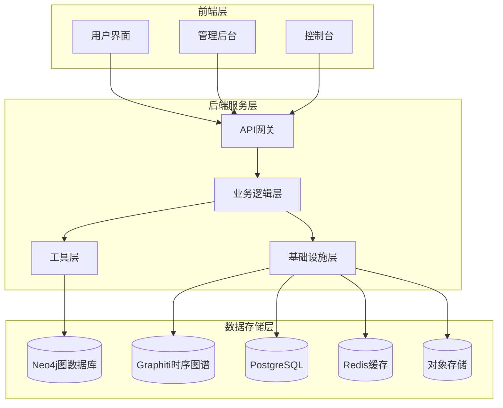
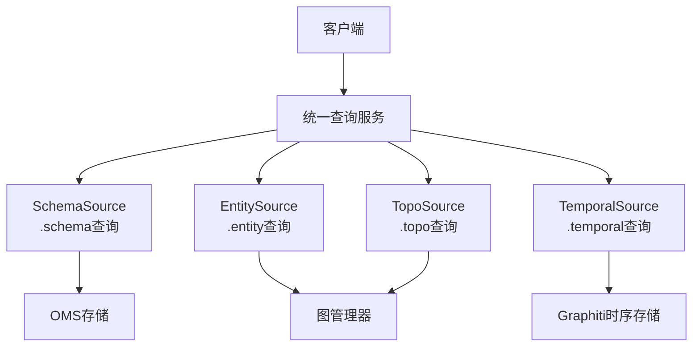
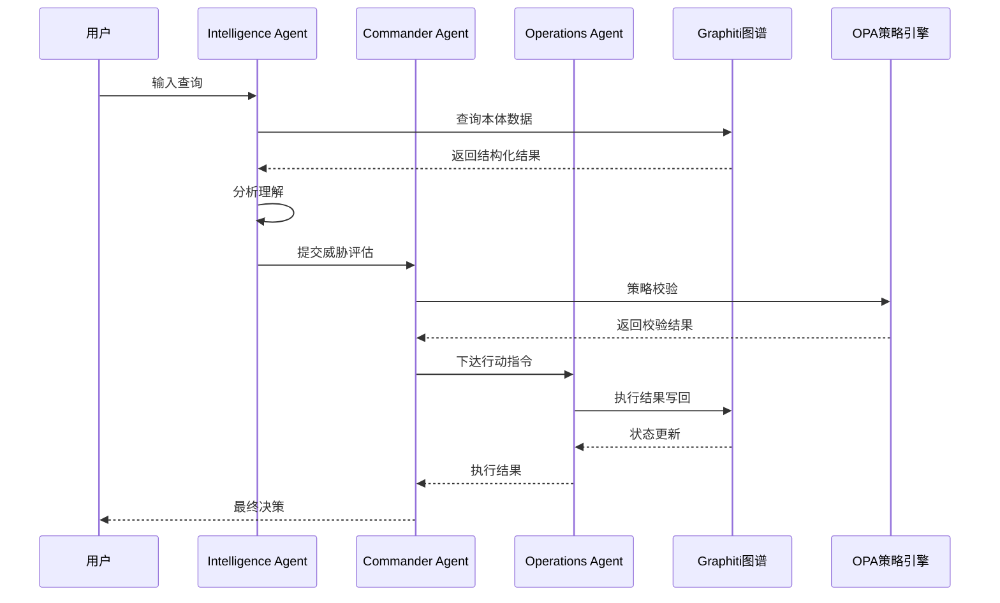
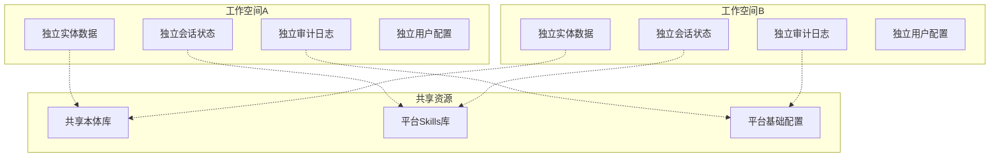
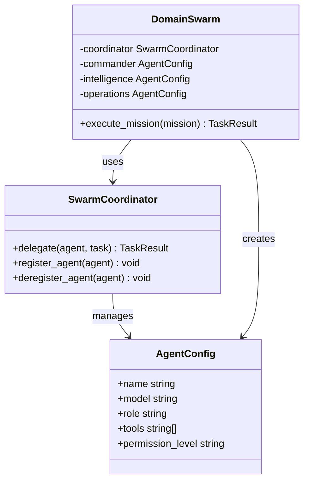
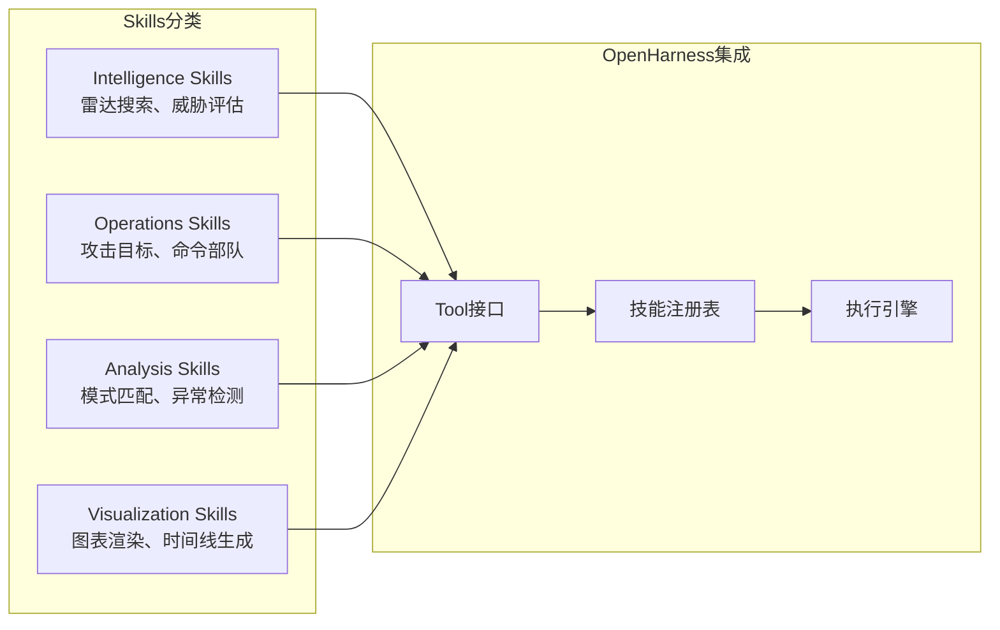
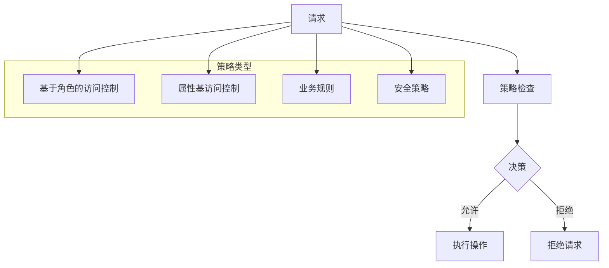
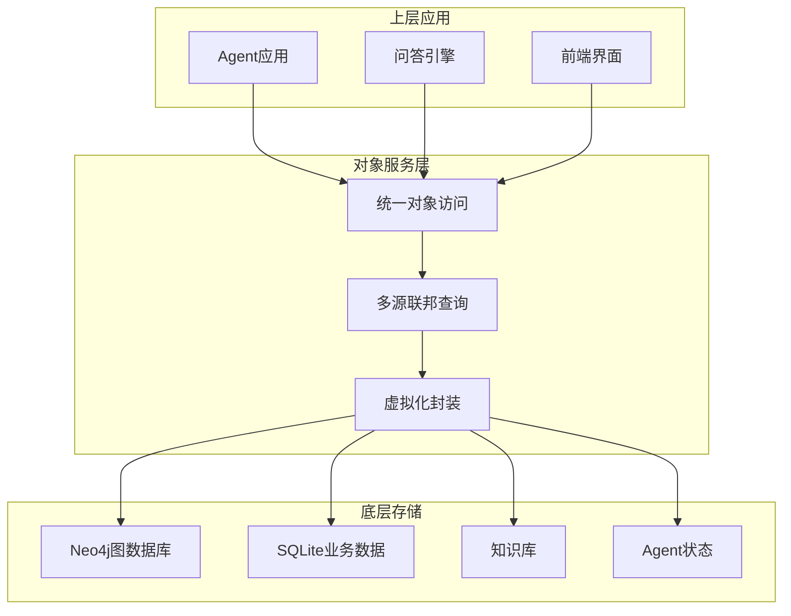
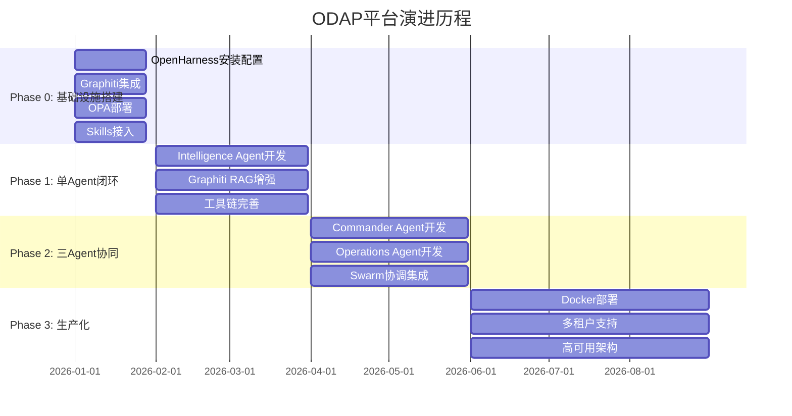

# 整体架构概览

<cite>
**本文档引用的文件**
- [ARCHITECTURE.md](file://docs/02-architecture/ARCHITECTURE.md)
- [ARCHITECTURE_BIZ.md](file://docs/02-architecture/ARCHITECTURE_BIZ.md)
- [ARCHITECTURE_INFRA.md](file://docs/02-architecture/ARCHITECTURE_INFRA.md)
- [ARCHITECTURE_TOOLS.md](file://docs/02-architecture/ARCHITECTURE_TOOLS.md)
- [ARCHITECTURE_WEB.md](file://docs/02-architecture/ARCHITECTURE_WEB.md)
- [ARCHITECTURE_EVOLVE.md](file://docs/02-architecture/ARCHITECTURE_EVOLVE.md)
- [ARCHITECTURE_FULL_CHAIN.md](file://docs/02-architecture/ARCHITECTURE_FULL_CHAIN.md)
- [README.md](file://README.md)
- [req-beta.md](file://docs/00-requirements/archive/req-beta.md)
</cite>

## 目录
1. [简介](#简介)
2. [项目结构](#项目结构)
3. [核心组件](#核心组件)
4. [架构总览](#架构总览)
5. [详细组件分析](#详细组件分析)
6. [依赖关系分析](#依赖关系分析)
7. [性能考虑](#性能考虑)
8. [故障排除指南](#故障排除指南)
9. [结论](#结论)
10. [附录](#附录)

## 简介

ODAP（本体驱动分析决策平台）是一个通用的本体驱动分析决策平台，通过工作空间机制实现多场景隔离，支持任意领域的本体建模和分析决策。平台采用四层架构设计，从用户交互层到Agent基础设施层，再到领域工具层和策略治理层，形成完整的分析决策闭环。

### 愿景与目标

ODAP的核心定位是"通用的本体驱动分析决策平台"，战争分析只是当前建设的一个实例化场景。平台致力于：

- **通用性优先**：不绑定任何垂直领域，支持任意领域的本体建模
- **多领域应用**：支持战争分析、金融分析、医疗诊断等多个领域
- **场景化部署**：通过工作空间实现多场景数据完全隔离
- **闭环反馈**：实现从感知→理解→决策→执行的完整闭环

### 核心价值主张

1. **本体驱动**：以Ontology为核心，实现语义级别的理解和推理
2. **多智能体协同**：通过OpenHarness实现Agent的自动化编排
3. **双时态知识图谱**：支持历史回溯和时序推理
4. **策略治理**：通过OPA实现fail-close安全边界
5. **工作空间隔离**：确保多场景数据的完全隔离

## 项目结构

项目采用模块化的分层架构，主要包含以下核心模块：

**图表来源**
- [README.md:27-122](file://README.md#L27-L122)
- [ARCHITECTURE.md:586-764](file://docs/02-architecture/ARCHITECTURE.md#L586-L764)

**章节来源**
- [README.md:27-122](file://README.md#L27-L122)
- [ARCHITECTURE.md:586-764](file://docs/02-architecture/ARCHITECTURE.md#L586-L764)

## 核心组件

### 四层架构设计理念

ODAP采用经典的四层架构设计，每层都有明确的职责和边界：

| 层次 | 组件 | 职责 | 核心价值 |
|------|------|------|---------|
| **L1** | OpenHarness | Agent Loop + Swarm + 工具调度 | 减少90% Agent基础设施代码 |
| **L2** | Graphiti | 双时态知识图谱 + 时序推理 | 支撑"当时发生了什么"的历史回溯 |
| **L3** | Python Skills | 领域特定工具（情报、决策），原生Tool接口 | 可插拔的领域能力 |
| **L4** | OPA | 策略治理 + 权限校验 | fail-close安全边界 |

### 统一查询服务

平台引入了统一查询服务（QueryService），借鉴阿里巴巴UModel的设计理念：

**图表来源**
- [ARCHITECTURE.md:482-509](file://docs/02-architecture/ARCHITECTURE.md#L482-L509)

**章节来源**
- [ARCHITECTURE.md:457-562](file://docs/02-architecture/ARCHITECTURE.md#L457-L562)

## 架构总览

### OADP业务语义体系

ODAP采用独特的OADP（Observe-Analyze-Decide-Perform）业务语义，区别于传统的OODA模型：

**图表来源**
- [ARCHITECTURE.md:98-126](file://docs/02-architecture/ARCHITECTURE.md#L98-L126)

### 工作空间隔离原则

平台实现了严格的工作空间隔离机制，确保多场景数据的完全独立：

**图表来源**
- [ARCHITECTURE.md:151-214](file://docs/02-architecture/ARCHITECTURE.md#L151-L214)

**章节来源**
- [ARCHITECTURE.md:144-297](file://docs/02-architecture/ARCHITECTURE.md#L144-L297)

## 详细组件分析

### Agent基础设施层

#### OpenHarness集成

平台采用OpenHarness作为Agent基础设施，实现了90%的代码复用：

**图表来源**
- [ARCHITECTURE_BIZ.md:95-186](file://docs/02-architecture/ARCHITECTURE_BIZ.md#L95-L186)

#### 三Agent协同编排

平台实现了三种Agent的专业化分工：

| Agent类型 | 定位 | 权限级别 | 主要职责 |
|-----------|------|----------|----------|
| **Commander** | 战术决策中枢 | commander | 最终决策者，高危操作唯一批准者 |
| **Intelligence** | 领域感知+态势理解 | intelligence | 传感器数据采集，威胁模式识别 |
| **Operations** | 行动计划生成+执行 | operations | 生成行动计划，执行命令 |

**章节来源**
- [ARCHITECTURE_BIZ.md:37-90](file://docs/02-architecture/ARCHITECTURE_BIZ.md#L37-L90)

### 领域工具层

#### Python Skills体系

平台采用Python Skills作为领域工具层，通过OpenHarness原生Tool接口直接接入：

**图表来源**
- [ARCHITECTURE_TOOLS.md:12-51](file://docs/02-architecture/ARCHITECTURE_TOOLS.md#L12-L51)

**章节来源**
- [ARCHITECTURE_TOOLS.md:6-160](file://docs/02-architecture/ARCHITECTURE_TOOLS.md#L6-L160)

### 策略治理层

#### OPA策略引擎

平台采用OPA（开放策略代理）作为统一的策略治理引擎：

**图表来源**
- [ARCHITECTURE_INFRA.md:169-200](file://docs/02-architecture/ARCHITECTURE_INFRA.md#L169-L200)

**章节来源**
- [ARCHITECTURE_INFRA.md:85-167](file://docs/02-architecture/ARCHITECTURE_INFRA.md#L85-L167)

### 基础设施层

#### 对象服务层（OSv2）

平台实现了Palantir AIP风格的对象服务层（OSv2），提供逻辑统一、物理解耦的访问层：

**图表来源**
- [ARCHITECTURE_INFRA.md:15-28](file://docs/02-architecture/ARCHITECTURE_INFRA.md#L15-L28)

**章节来源**
- [ARCHITECTURE_INFRA.md:7-82](file://docs/02-architecture/ARCHITECTURE_INFRA.md#L7-L82)

## 依赖关系分析

### 技术选型与权衡

平台在技术选型上采用了经过生产验证的成熟技术栈：

| 组件 | 选项A | 选项B | 选项C | 决策 | 权衡 |
|------|-------|-------|-------|------|------|
| **Agent框架** | LangGraph | OpenHarness | AutoGen | **OpenHarness** | 开源+生产级+多Agent内置，节省90%代码 |
| **知识图谱** | Neo4j | Amazon Neptune | Graphiti | **Graphiti** | 双时态原生支持，支撑历史回溯 |
| **策略引擎** | OPA | Cedar | Casbin | **OPA** | Rego语言灵活+生态丰富+生产验证 |
| **图数据库** | Neo4j | NetworkX | Memgraph | **Neo4j** | 向量检索+时序+ACID，成熟稳定 |
| **Agent LLM** | Claude | GPT-4 | DeepSeek | **混合** | Commander用强推理，Intelligence用快速 |

### 依赖流向

```mermaid
graph TD
subgraph "前端层"
React[React + TypeScript]
AntD[Ant Design]
G6[G6图表]
Leaflet[Leaflet地图]
end
subgraph "后端层"
FastAPI[FastAPI]
OpenHarness[OpenHarness]
Graphiti[Graphiti]
OPA[OPA策略引擎]
end
subgraph "数据层"
Neo4j[Neo4j图数据库]
PostgreSQL[PostgreSQL]
Redis[Redis缓存]
S3[S3对象存储]
end
React --> FastAPI
AntD --> React
G6 --> React
Leaflet --> React
FastAPI --> OpenHarness
OpenHarness --> Graphiti
OpenHarness --> OPA
Graphiti --> Neo4j
OPA --> PostgreSQL
FastAPI --> Redis
FastAPI --> S3
```

**图表来源**
- [ARCHITECTURE_EVOLVE.md:766-771](file://docs/02-architecture/ARCHITECTURE_EVOLVE.md#L766-L771)

**章节来源**
- [ARCHITECTURE_EVOLVE.md:6-46](file://docs/02-architecture/ARCHITECTURE_EVOLVE.md#L6-L46)

## 性能考虑

### 查询优化策略

平台通过统一查询服务实现了查询性能的显著提升：

1. **查询源抽象**：将Schema、Entity、Topo、Temporal四种查询源统一抽象
2. **Agent安全默认**：通过Hook机制实现Agent写操作的默认只读保护
3. **架构守卫**：通过测试强制执行边界规则，防止绕过QueryService

### 缓存策略

平台采用了多层次的缓存策略：

- **Redis缓存**：用于热点数据和会话状态缓存
- **浏览器缓存**：前端页面和静态资源缓存
- **数据库查询缓存**：针对频繁查询的本体数据进行缓存

### 并发处理

平台通过以下机制实现高并发处理：

- **异步任务队列**：使用Celery处理长时间运行的任务
- **连接池管理**：数据库和外部服务连接池优化
- **负载均衡**：支持多实例部署和水平扩展

## 故障排除指南

### 常见问题诊断

#### Agent执行问题

1. **Agent无法启动**
   - 检查OpenHarness配置
   - 验证LLM API密钥
   - 确认权限配置

2. **Agent执行失败**
   - 查看Agent日志
   - 检查工具调用参数
   - 验证OPA策略配置

#### 图谱查询问题

1. **查询超时**
   - 检查Neo4j连接状态
   - 优化查询语句
   - 增加索引

2. **数据不一致**
   - 检查事务提交
   - 验证双时态数据
   - 确认版本控制

#### 策略执行问题

1. **OPA策略拒绝**
   - 检查策略语法
   - 验证上下文数据
   - 确认权限配置

2. **策略加载失败**
   - 检查策略文件格式
   - 验证Bundle配置
   - 确认OPA服务状态

**章节来源**
- [ARCHITECTURE_EVOLVE.md:774-798](file://docs/02-architecture/ARCHITECTURE_EVOLVE.md#L774-L798)

## 结论

ODAP平台通过四层架构设计，成功实现了本体驱动分析决策的完整解决方案。平台的核心优势体现在：

1. **架构清晰**：四层架构职责明确，边界清晰
2. **技术先进**：采用经过生产验证的技术栈
3. **扩展性强**：支持多领域应用和场景化部署
4. **安全可靠**：通过OPA实现fail-close安全边界
5. **性能优异**：通过统一查询服务和缓存策略提升性能

平台的发展方向是进一步完善地理空间层、多模态情报处理和领域数字孪生能力，最终实现与Palantir架构的全面对齐。

## 附录

### 演进历程

平台经历了四个主要发展阶段：

### 核心设计原则

平台遵循以下核心设计原则：

1. **通用性优先**：不绑定任何垂直领域
2. **工作空间隔离**：多场景数据完全隔离
3. **本体为核心**：以Ontology为核心实现语义理解
4. **可视化配置管理**：各类规则/策略/逻辑统一定义
5. **用户体验优先**：针对本体管理、角色管理、前端会话等界面
6. **可维护性优先**：功能逐步迭代，技术选型具备优秀可扩展性
7. **技能可热插拔**：Skill注册无需重启，配置变更热生效
8. **OpenHarness First**：基于OpenHarness作为Agent基础设施
9. **Graphiti as Memory**：Graphiti作为双时态记忆
10. **Query First**：所有图谱读取必须通过统一QueryService

**章节来源**
- [ARCHITECTURE.md:298-390](file://docs/02-architecture/ARCHITECTURE.md#L298-L390)