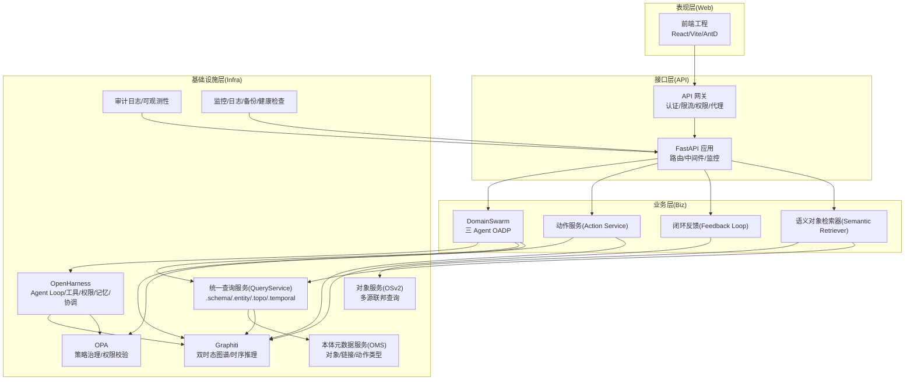
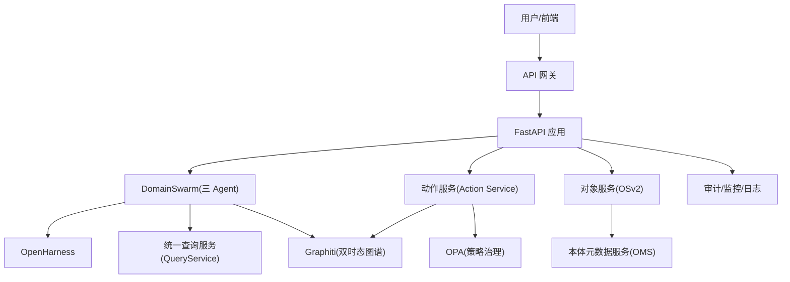
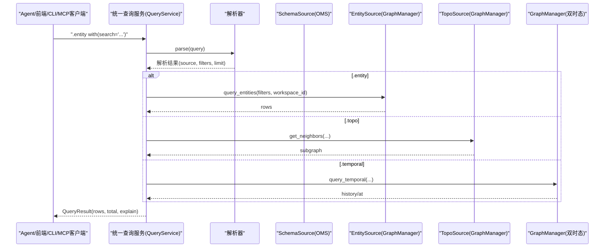
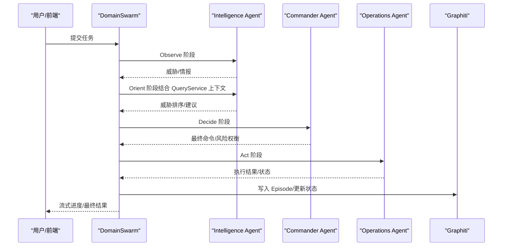
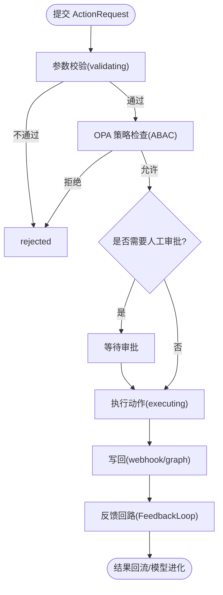
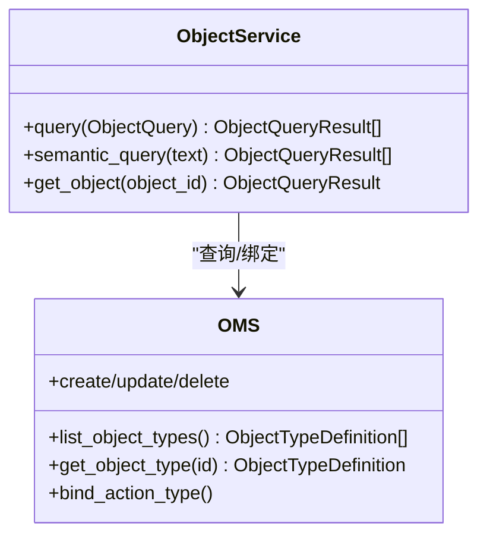
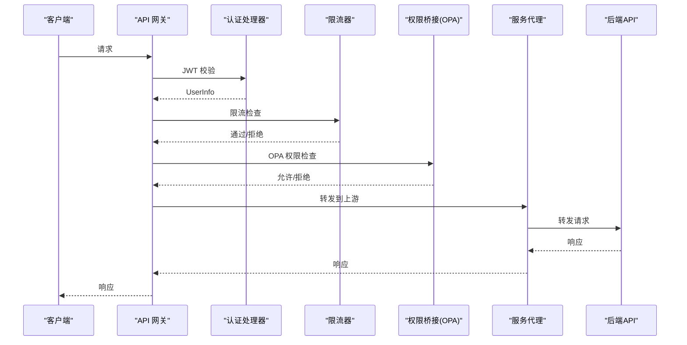
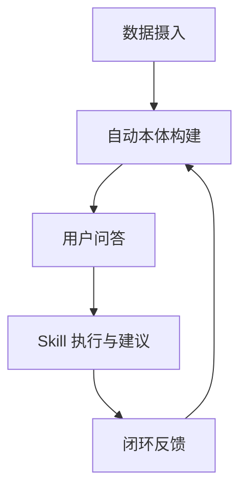
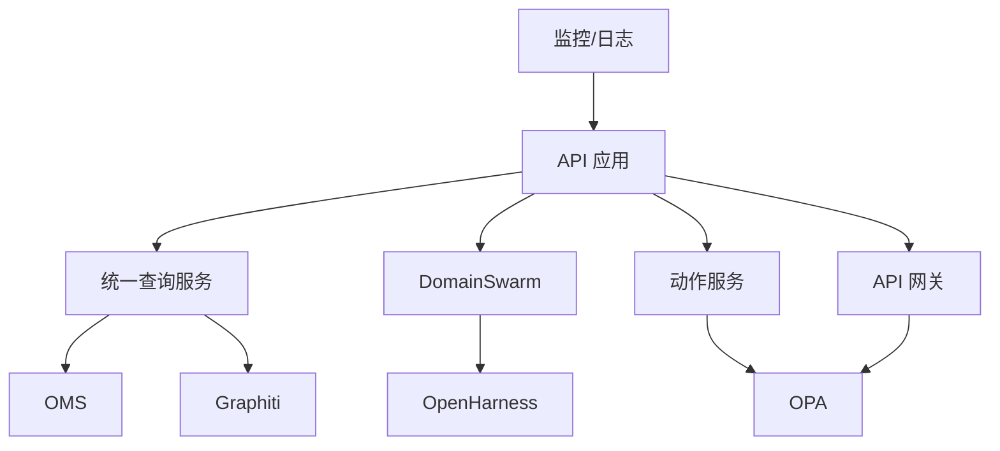

# 架构设计

<cite>
**本文引用的文件**
- [ARCHITECTURE.md](file://docs/02-architecture/ARCHITECTURE.md)
- [ARCHITECTURE_FULL_CHAIN.md](file://docs/02-architecture/ARCHITECTURE_FULL_CHAIN.md)
- [ARCHITECTURE_BIZ.md](file://docs/02-architecture/ARCHITECTURE_BIZ.md)
- [ARCHITECTURE_OPS.md](file://docs/02-architecture/ARCHITECTURE_OPS.md)
- [app.py](file://odap/web/app.py)
- [service.py](file://odap/infra/query/service.py)
- [swarm_orchestrator.py](file://odap/biz/core/agent/swarm_orchestrator.py)
- [api_gateway.py](file://odap/web/gateway/api_gateway.py)
</cite>

## 目录
1. [引言](#引言)
2. [项目结构](#项目结构)
3. [核心组件](#核心组件)
4. [架构总览](#架构总览)
5. [详细组件分析](#详细组件分析)
6. [依赖分析](#依赖分析)
7. [性能考量](#性能考量)
8. [故障排查指南](#故障排查指南)
9. [结论](#结论)
10. [附录](#附录)

## 引言
本架构文档面向 ODAP（本体驱动分析决策平台）的分层设计与关键模式，覆盖表现层、接口层、业务层、基础设施层的职责划分与交互关系，重点阐述统一查询服务、多智能体协同（三 Agent OADP 闭环）、工作空间管理等核心架构模式。同时给出技术选型依据、系统边界、外部依赖、集成点设计、演进历史与未来方向，并总结安全、可扩展性、性能等横切关注点。

## 项目结构
ODAP 采用模块化单体架构，围绕“本体 + 图谱 + Agent + 策略治理 + 可视化”的主线组织代码与文档。核心模块分布如下：
- 表现层（Web 前端）：React/Vite 前端工程，Ant Design 生态，提供工作空间、本体、问答、技能、事件模拟等界面。
- 接口层（FastAPI 后端）：统一 API 路由入口，集成认证、审计、异常处理、中间件与监控端点。
- 业务层（Biz）：Agent 协同（三 Agent OADP）、动作服务、反馈闭环、语义检索、Pipeline 增强等。
- 基础设施层（Infra）：OpenHarness（Agent Loop/工具/权限/记忆/协调）、Graphiti（双时态图谱/时序推理）、OPA（策略治理）、对象服务（OSv2）、本体元数据服务（OMS）、统一查询服务（QueryService）、审计日志、监控与日志、健康检查与自愈。

**图示来源**
- [app.py:122-192](file://odap/web/app.py#L122-L192)
- [ARCHITECTURE.md:396-446](file://docs/02-architecture/ARCHITECTURE.md#L396-L446)
- [ARCHITECTURE_BIZ.md:7-90](file://docs/02-architecture/ARCHITECTURE_BIZ.md#L7-L90)
- [ARCHITECTURE_OPS.md:24-50](file://docs/02-architecture/ARCHITECTURE_OPS.md#L24-L50)

**章节来源**
- [ARCHITECTURE.md:12-53](file://docs/02-architecture/ARCHITECTURE.md#L12-L53)
- [app.py:122-192](file://odap/web/app.py#L122-L192)

## 核心组件
- 统一查询服务（QueryService）：提供 .schema/.entity/.topo/.temporal 四类查询源，统一解析与执行，强制“Query First”与 Agent Safe 边界。
- 多智能体协同（DomainSwarm）：三 Agent（Commander/Intelligence/Operations）在 OpenHarness Swarm 上协同，实现 OADP 闭环（Observe-Analyze-Decide-Perform）。
- 动作服务（Action Service）：将决策转化为可执行动作，经 OPA 策略校验、人工审批、执行引擎与写回，形成闭环反馈。
- 对象服务（OSv2）：上层只看到“业务对象”，屏蔽底层存储差异，提供结构化/语义查询、链接遍历与动作发现。
- 本体元数据服务（OMS）：管理对象类型、属性、链接关系、动作类型的元数据，支撑运行时可管理的本体 Schema。
- API 网关：认证、限流、权限桥接、上游代理、连接管理与指标采集，统一对外入口。
- 运维可观测性：Prometheus/Grafana/AlertManager/Loki/备份恢复/健康检查与自愈。

**章节来源**
- [ARCHITECTURE.md:457-588](file://docs/02-architecture/ARCHITECTURE.md#L457-L588)
- [ARCHITECTURE_BIZ.md:7-90](file://docs/02-architecture/ARCHITECTURE_BIZ.md#L7-L90)
- [ARCHITECTURE_BIZ.md:310-402](file://docs/02-architecture/ARCHITECTURE_BIZ.md#L310-L402)
- [ARCHITECTURE_OPS.md:19-50](file://docs/02-architecture/ARCHITECTURE_OPS.md#L19-L50)

## 架构总览
ODAP 的分层架构以“本体 + 图谱 + Agent + 策略治理 + 可视化”为主线，强调：
- 通用性优先：不绑定垂直领域，支持任意领域的本体建模与工作空间隔离。
- 工作空间隔离：实体数据、会话状态、审计日志、用户配置强制隔离；本体、模拟数据、策略、Skills 可选共享。
- 本体为核心：以 Ontology 为核心，实现语义级的理解与推理。
- Query First：所有图谱读取必须通过统一 QueryService，禁止散落的域读取端点。
- OpenHarness First：基于 OpenHarness 作为 Agent 基础设施，减少 90% Agent 基础设施代码。
- Graphiti as Memory：Graphiti 作为双时态记忆，支撑时序推理与历史回溯。

**图示来源**
- [ARCHITECTURE.md:396-446](file://docs/02-architecture/ARCHITECTURE.md#L396-L446)
- [app.py:122-192](file://odap/web/app.py#L122-L192)

## 详细组件分析

### 统一查询服务（QueryService）
- 设计动机：解决多条独立 Agent 查询路径导致的意图识别重复、接口断裂、安全边界缺失与结果无结构化等问题。
- 三源查询模型：.schema（OMS）、.entity（GraphManager）、.topo（图遍历）、.temporal（双时态）。
- Agent 安全默认：通过 OpenHarness Hook 机制拦截写操作，调用 OPA 检查；只读工具默认暴露，写操作需显式启用。
- 架构守卫：通过测试强制执行边界规则，禁止在 QueryService 之外暴露域读取 API，禁止业务模块直接导入 GraphManager。

**图示来源**
- [service.py:33-125](file://odap/infra/query/service.py#L33-L125)

**章节来源**
- [ARCHITECTURE.md:457-588](file://docs/02-architecture/ARCHITECTURE.md#L457-L588)
- [service.py:11-126](file://odap/infra/query/service.py#L11-L126)

### 多智能体协同（DomainSwarm 与 OADP 闭环）
- 三 Agent 角色：Commander（决策中枢）、Intelligence（感知理解）、Operations（执行中心），均运行在 OpenHarness Swarm 之上。
- OADP 闭环：Observe（Intelligence 感知）→ Orient（Intelligence 理解）→ Decide（Commander 决策）→ Perform（Operations 执行），并在执行后回写 Graphiti。
- 流式执行：支持流式返回每一步的实时状态，便于前端交互与可观测性。

**图示来源**
- [ARCHITECTURE_BIZ.md:554-642](file://docs/02-architecture/ARCHITECTURE_BIZ.md#L554-L642)
- [swarm_orchestrator.py:379-657](file://odap/biz/core/agent/swarm_orchestrator.py#L379-L657)

**章节来源**
- [ARCHITECTURE_BIZ.md:7-90](file://docs/02-architecture/ARCHITECTURE_BIZ.md#L7-L90)
- [swarm_orchestrator.py:288-657](file://odap/biz/core/agent/swarm_orchestrator.py#L288-L657)

### 动作服务（Action Service）
- 架构定位：对齐 Palantir AIP 的动势层（Kinetic Layer），将决策转化为可执行业务动作。
- 生命周期：提交 → 参数校验 → OPA 策略检查 → 人工审批（可选）→ 执行动作 → 写回 → 反馈回路 → 结果回流。
- 写回机制：支持 webhook 或 graph 两种模式，满足内外部状态同步。

**图示来源**
- [ARCHITECTURE_BIZ.md:310-342](file://docs/02-architecture/ARCHITECTURE_BIZ.md#L310-L342)

**章节来源**
- [ARCHITECTURE_BIZ.md:310-402](file://docs/02-architecture/ARCHITECTURE_BIZ.md#L310-L402)

### 对象服务（OSv2）与本体元数据服务（OMS）
- OSv2：在底层异构存储（Neo4j/SQLite 等）与上层业务应用之间构建统一虚拟化封装层，提供结构化/语义查询、链接遍历与动作发现。
- OMS：管理对象类型、属性定义、链接关系、动作类型的元数据，支持运行时 CRUD 与绑定。

**图示来源**
- [ARCHITECTURE_INFRA.md:7-82](file://docs/02-architecture/ARCHITECTURE_INFRA.md#L7-L82)
- [ARCHITECTURE_INFRA.md:85-167](file://docs/02-architecture/ARCHITECTURE_INFRA.md#L85-L167)

**章节来源**
- [ARCHITECTURE_INFRA.md:7-167](file://docs/02-architecture/ARCHITECTURE_INFRA.md#L7-L167)

### API 网关
- 路由模型：支持路径匹配、方法匹配、上游转发、缓存 TTL、超时与重试。
- 认证与权限：JWT 认证、权限桥接（OPA）、限流（令牌桶/滑动窗口）。
- 连接管理：WebSocket/SSE 连接管理与广播。
- 指标采集：请求总量、成功率、平均延迟等。

**图示来源**
- [api_gateway.py:435-476](file://odap/web/gateway/api_gateway.py#L435-L476)

**章节来源**
- [api_gateway.py:360-494](file://odap/web/gateway/api_gateway.py#L360-L494)

### 全链路数据流（从数据摄入到 Skill 执行）
- Phase1 数据摄入：文件上传→文档解析→实体抽取→预览→审核确认。
- Phase2 自动本体构建：实体标准化→关系验证→一致性检查→人工审核→写入 Graphiti→版本快照。
- Phase3 用户问答：意图识别→实体链接→上下文检索→RAG 增强→LLM 推理→流式输出。
- Phase4 Skill 执行与建议：建议标签解析→右侧建议面板→OPA 策略校验→执行→结果展示。
- Phase5 闭环反馈：用户评分/技能结果/手动修正/会话摘要→本体增量更新→提示词优化。

**图示来源**
- [ARCHITECTURE_FULL_CHAIN.md:57-88](file://docs/02-architecture/ARCHITECTURE_FULL_CHAIN.md#L57-L88)

**章节来源**
- [ARCHITECTURE_FULL_CHAIN.md:1-637](file://docs/02-architecture/ARCHITECTURE_FULL_CHAIN.md#L1-L637)

## 依赖分析
- 组件耦合与内聚：业务层（Biz）通过统一查询服务与对象服务解耦基础设施细节；Agent 协同依赖 OpenHarness 的工具/权限/记忆/协调能力。
- 直接与间接依赖：API 应用集中注册路由，网关承担认证/限流/权限/代理；查询服务依赖解析器与多源实现；动作服务依赖 OPA 与图谱写回。
- 外部依赖：Neo4j/Graphiti（图谱）、OPA（策略治理）、Prometheus/Grafana（监控）、Loki（日志）、Nginx（反向代理）。
- 集成点：MCP 协议（外部仿真器/雷达模拟器/气象数据源）、OpenHarness v2 适配器、审计日志通道。

**图示来源**
- [app.py:122-192](file://odap/web/app.py#L122-L192)
- [ARCHITECTURE.md:396-446](file://docs/02-architecture/ARCHITECTURE.md#L396-L446)

**章节来源**
- [app.py:122-192](file://odap/web/app.py#L122-L192)

## 性能考量
- 查询性能：统一查询服务通过解析与多源执行，建议限制查询范围与分页；Graphiti 双时态查询需注意时间窗口与索引。
- Agent 执行：DomainSwarm 的流式执行降低前端等待，建议结合 SSE/WebSocket 实时推送；工具调用前的 OPA 校验可能引入延迟，建议缓存常用策略。
- 动作服务：OPA 策略检查与人工审批会增加端到端延迟，建议对高频低风险动作进行降级处理。
- 存储与并发：Neo4j/Graphiti 的连接池与查询并发需结合负载进行容量规划；对象服务多源联邦查询需关注慢源影响。

[本节为通用指导，无需特定文件引用]

## 故障排查指南
- 健康检查：/health 与 /health/ready 端点返回依赖组件状态；ready 端点失败时返回 503。
- 监控告警：Prometheus 抓取 FastAPI 指标、Neo4j 指标、OPA 指标；Grafana 展示延迟、错误率、资源使用；AlertManager 告警规则覆盖高错误率、高延迟、磁盘使用率等。
- 日志收集：结构化日志（JSON Lines）输出至 stdout，Loki 聚合；生产环境建议配合 Elasticsearch 进行高级搜索。
- 备份与恢复：Neo4j 全量 + 增量备份，PostgreSQL 全量 dump；定期灾难恢复演练验证 RPO/RTO。

**章节来源**
- [ARCHITECTURE_OPS.md:19-150](file://docs/02-architecture/ARCHITECTURE_OPS.md#L19-L150)
- [ARCHITECTURE_OPS.md:153-302](file://docs/02-architecture/ARCHITECTURE_OPS.md#L153-L302)
- [app.py:221-242](file://odap/web/app.py#L221-L242)

## 结论
ODAP 通过“本体 + 图谱 + Agent + 策略治理 + 可视化”的分层架构，实现了从数据摄入到本体构建、从用户问答到 Skill 执行的全链路闭环。统一查询服务与 Query First 原则强化了数据访问的统一性与安全性；三 Agent OADP 闭环与动作服务保障了从决策到执行的可靠落地；对象服务与本体元数据服务提供了运行时可管理的语义层；API 网关与运维可观测性确保了系统的可维护性与稳定性。未来可在多智能体协作模式、语义检索与提示词优化、工作空间资源治理等方面持续演进。

[本节为总结性内容，无需特定文件引用]

## 附录

### 系统边界与外部依赖
- 系统边界：工作空间为业务运行边界，实体数据、会话状态、审计日志、用户配置强制隔离；本体、模拟数据、策略、Skills 可选共享。
- 外部依赖：Neo4j/Graphiti（图谱）、OPA（策略治理）、LLM API（OpenAI/Anthropic/DeepSeek）、MCP（协议集成）、Docker Compose（部署）。

**章节来源**
- [ARCHITECTURE.md:144-287](file://docs/02-architecture/ARCHITECTURE.md#L144-L287)

### 技术选型与权衡
- OpenHarness：显著减少 Agent 基础设施代码量，复用成熟的工具/权限/记忆/协调能力。
- Graphiti：双时态记忆支撑时序推理与历史回溯，满足“当时发生了什么”的需求。
- OMS/OSv2：将本体 Schema 从静态字典升级为运行时可管理的服务，提升可维护性与可扩展性。
- API 网关：统一认证、限流、权限与代理，简化上游服务复杂度。

**章节来源**
- [ARCHITECTURE.md:392-456](file://docs/02-architecture/ARCHITECTURE.md#L392-L456)
- [ARCHITECTURE_INFRA.md:169-200](file://docs/02-architecture/ARCHITECTURE_INFRA.md#L169-L200)

### 演进历史与未来方向
- v5.1.0：新增语义层架构（统一查询服务 + Query First 原则 + Agent Safe + 架构守卫）。
- 未来方向：多智能体协作模式优化、语义检索与提示词优化、工作空间资源治理、平台共用资源的统一管理与热生效。

**章节来源**
- [ARCHITECTURE.md:604-614](file://docs/02-architecture/ARCHITECTURE.md#L604-L614)