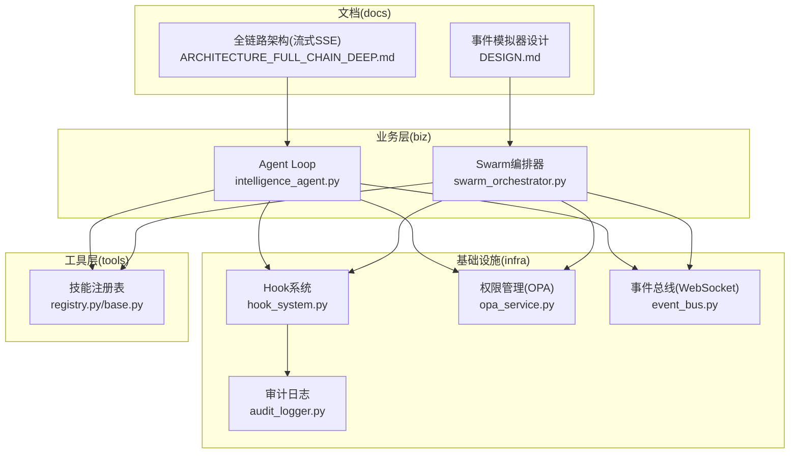
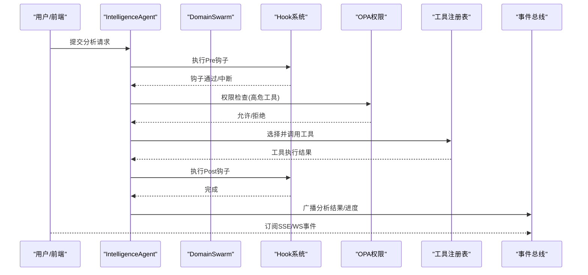
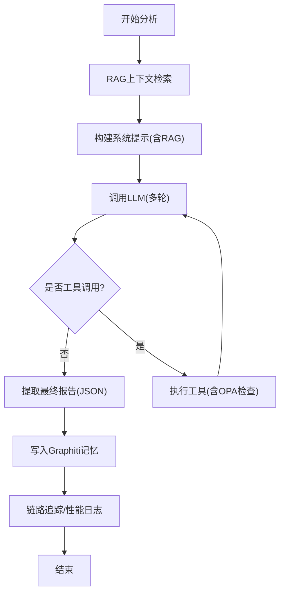
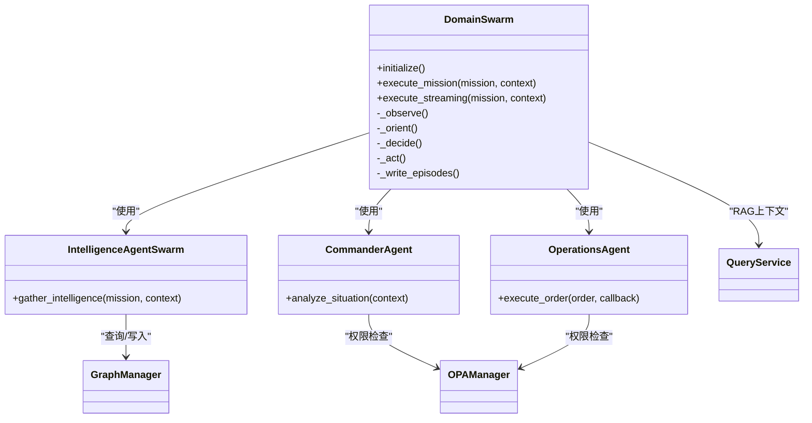
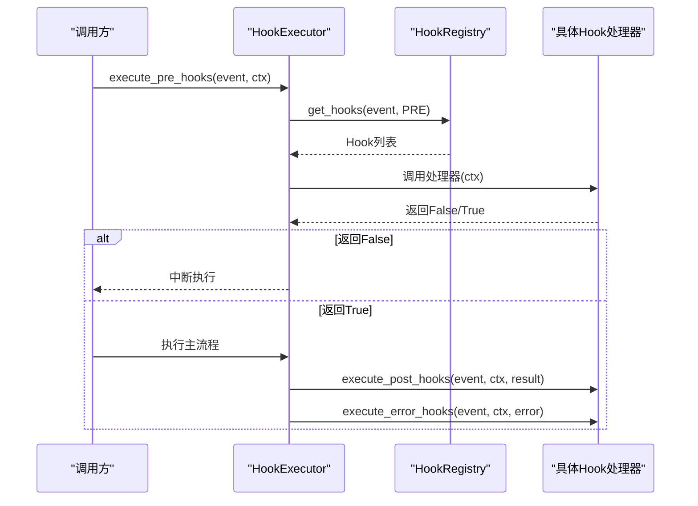
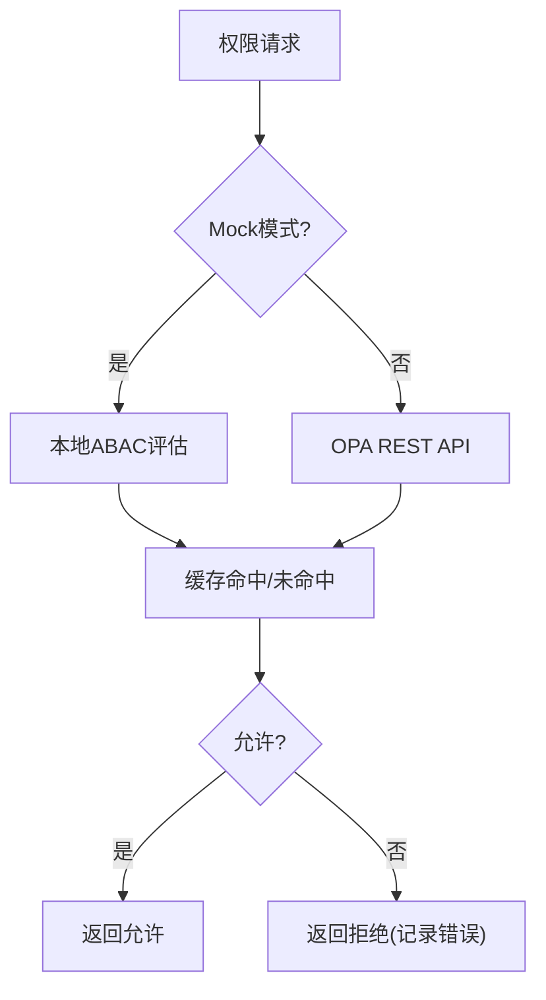
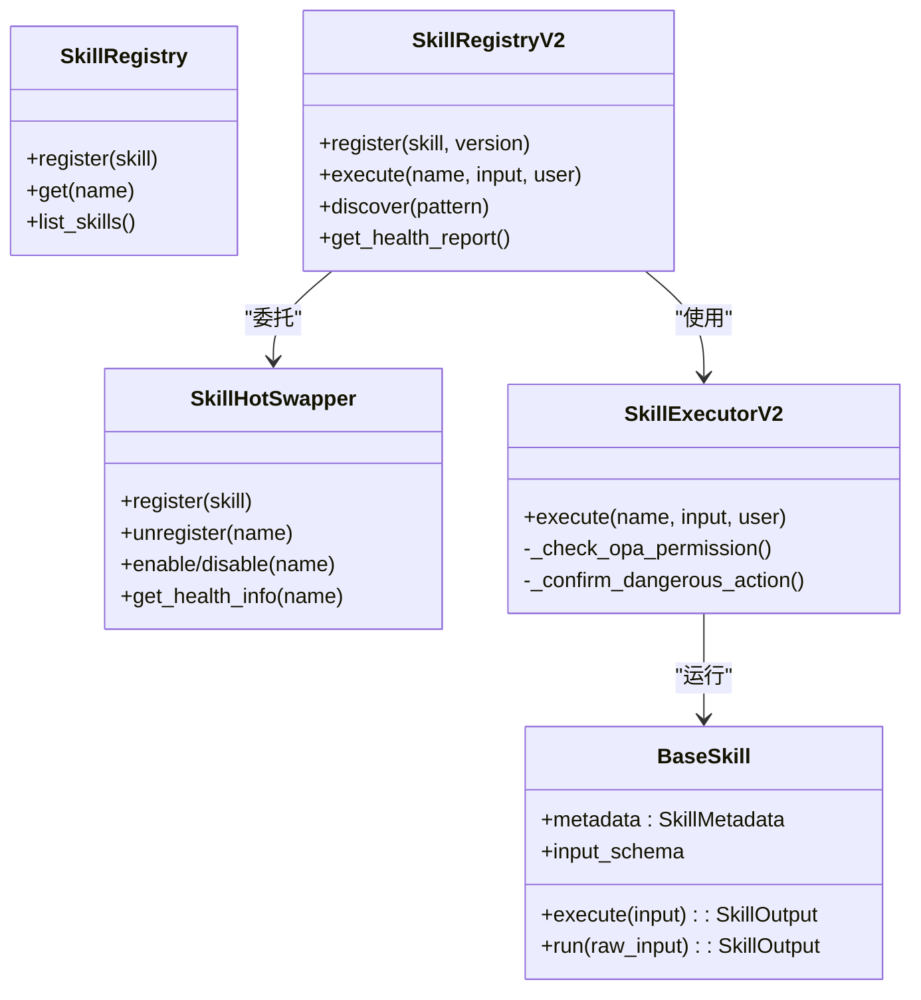
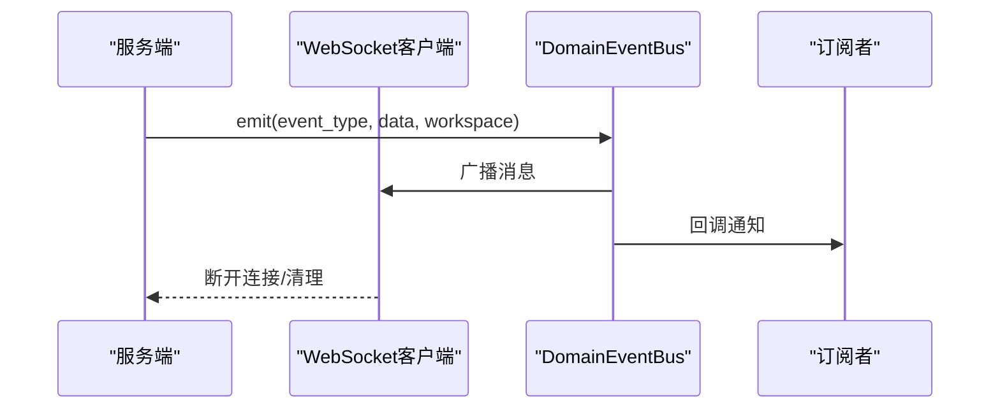
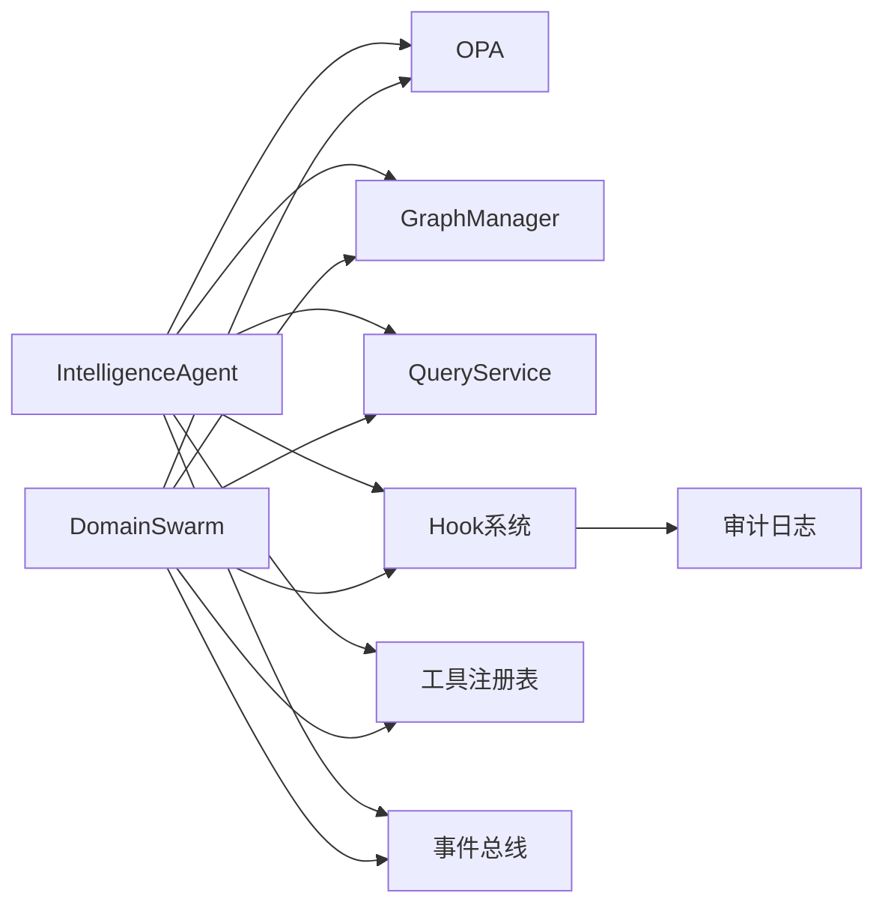

# 组件交互关系

<cite>
**本文档引用的文件**
- [swarm_orchestrator.py](file://odap/biz/core/agent/swarm_orchestrator.py)
- [hook_system.py](file://odap/infra/events/hook_system.py)
- [opa_service.py](file://odap/infra/opa/opa_service.py)
- [intelligence_agent.py](file://odap/biz/core/agent/intelligence_agent.py)
- [event_bus.py](file://odap/web/ws/event_bus.py)
- [registry.py](file://odap/tools/registry.py)
- [base.py](file://odap/tools/base.py)
- [audit_logger.py](file://odap/infra/security/audit_logger.py)
- [DESIGN.md](file://docs/03-modules/event_simulator/DESIGN.md)
- [ARCHITECTURE_FULL_CHAIN_DEEP.md](file://docs/02-architecture/ARCHITECTURE_FULL_CHAIN_DEEP.md)
</cite>

## 目录
1. [引言](#引言)
2. [项目结构](#项目结构)
3. [核心组件](#核心组件)
4. [架构总览](#架构总览)
5. [详细组件分析](#详细组件分析)
6. [依赖关系分析](#依赖关系分析)
7. [性能考量](#性能考量)
8. [故障排查指南](#故障排查指南)
9. [结论](#结论)
10. [附录](#附录)

## 引言
本文件面向ODAP平台的组件交互关系，聚焦Agent Loop、Swarm协调器、工具注册表、权限检查器等关键模块，系统阐述Hook横切关注点设计与生命周期管理、事件驱动架构与消息传递机制、组件间依赖与接口契约，并提供数据流与控制流图示，帮助系统集成与二次开发。

## 项目结构
ODAP平台采用“领域服务+基础设施+Web层”的分层组织，核心Agent与Swarm编排位于biz/core/agent；权限与审计位于infra；工具与技能注册位于tools；事件总线位于web/ws；文档与设计位于docs。

**图表来源**
- [swarm_orchestrator.py:1-687](file://odap/biz/core/agent/swarm_orchestrator.py#L1-L687)
- [hook_system.py:1-428](file://odap/infra/events/hook_system.py#L1-L428)
- [opa_service.py:1-750](file://odap/infra/opa/opa_service.py#L1-L750)
- [intelligence_agent.py:1-599](file://odap/biz/core/agent/intelligence_agent.py#L1-L599)
- [event_bus.py:1-147](file://odap/web/ws/event_bus.py#L1-L147)
- [registry.py:1-53](file://odap/tools/registry.py#L1-L53)
- [base.py:1-720](file://odap/tools/base.py#L1-L720)
- [audit_logger.py:1-378](file://odap/infra/security/audit_logger.py#L1-L378)
- [DESIGN.md:1-533](file://docs/03-modules/event_simulator/DESIGN.md#L1-L533)
- [ARCHITECTURE_FULL_CHAIN_DEEP.md:2621-2715](file://docs/02-architecture/ARCHITECTURE_FULL_CHAIN_DEEP.md#L2621-L2715)

**章节来源**
- [swarm_orchestrator.py:1-687](file://odap/biz/core/agent/swarm_orchestrator.py#L1-L687)
- [hook_system.py:1-428](file://odap/infra/events/hook_system.py#L1-L428)
- [opa_service.py:1-750](file://odap/infra/opa/opa_service.py#L1-L750)
- [intelligence_agent.py:1-599](file://odap/biz/core/agent/intelligence_agent.py#L1-L599)
- [event_bus.py:1-147](file://odap/web/ws/event_bus.py#L1-L147)
- [registry.py:1-53](file://odap/tools/registry.py#L1-L53)
- [base.py:1-720](file://odap/tools/base.py#L1-L720)
- [audit_logger.py:1-378](file://odap/infra/security/audit_logger.py#L1-L378)
- [DESIGN.md:1-533](file://docs/03-modules/event_simulator/DESIGN.md#L1-L533)
- [ARCHITECTURE_FULL_CHAIN_DEEP.md:2621-2715](file://docs/02-architecture/ARCHITECTURE_FULL_CHAIN_DEEP.md#L2621-L2715)

## 核心组件
- Agent Loop（情报Agent）：基于LLM ReAct循环，结合RAG上下文、工具调用、Graphiti记忆与OPA权限检查，形成闭环。
- Swarm编排器：领域三Agent（Commander/Intelligence/Operations）的OODA协同编排，提供阶段化进度流式输出。
- Hook系统：横切的生命周期拦截与增强，支持Pre/Post/Error三阶段、优先级与全局开关。
- 权限检查器（OPA）：ABAC策略评估、热更新Bundle、策略沙箱、批量权限检查与缓存。
- 工具注册表：统一技能注册与执行，支持BaseSkill抽象、版本管理、健康监控与热插拔。
- 事件总线：WebSocket事件广播，支持工作空间隔离、订阅回调与事件历史。
- 审计日志：统一审计通道，支持结构化字段、批量写入与多通道输出。

**章节来源**
- [intelligence_agent.py:73-599](file://odap/biz/core/agent/intelligence_agent.py#L73-L599)
- [swarm_orchestrator.py:288-687](file://odap/biz/core/agent/swarm_orchestrator.py#L288-L687)
- [hook_system.py:19-428](file://odap/infra/events/hook_system.py#L19-L428)
- [opa_service.py:30-750](file://odap/infra/opa/opa_service.py#L30-L750)
- [registry.py:1-53](file://odap/tools/registry.py#L1-L53)
- [base.py:64-720](file://odap/tools/base.py#L64-L720)
- [event_bus.py:13-147](file://odap/web/ws/event_bus.py#L13-L147)
- [audit_logger.py:19-378](file://odap/infra/security/audit_logger.py#L19-L378)

## 架构总览
ODAP平台采用事件驱动与横切关注点相结合的架构：
- 控制流：Agent Loop与Swarm编排器作为主控，按阶段推进（感知→理解→决策→行动），期间通过Hook系统进行横切增强与监控。
- 数据流：工具调用与权限检查贯穿Agent执行链，结果写入Graphiti记忆并通过事件总线广播。
- 通信机制：内部通过模块内函数/类调用，外部通过WebSocket事件总线与SSE流式响应。

**图表来源**
- [intelligence_agent.py:307-500](file://odap/biz/core/agent/intelligence_agent.py#L307-L500)
- [swarm_orchestrator.py:379-567](file://odap/biz/core/agent/swarm_orchestrator.py#L379-L567)
- [hook_system.py:171-241](file://odap/infra/events/hook_system.py#L171-L241)
- [opa_service.py:538-598](file://odap/infra/opa/opa_service.py#L538-L598)
- [registry.py:26-53](file://odap/tools/registry.py#L26-L53)
- [event_bus.py:34-95](file://odap/web/ws/event_bus.py#L34-L95)

## 详细组件分析

### Agent Loop（情报Agent）
- 职责：ReAct循环+RAG增强+工具调用+Graphiti记忆+OPA权限检查。
- 关键流程：
  - RAG检索→构建系统提示→LLM推理→工具调用→结果聚合→写入记忆→链路追踪。
- 权限集成：对高危工具类别进行OPA检查，拒绝后返回权限不足。
- 执行器：统一工具描述构建与函数式调用封装。

**图表来源**
- [intelligence_agent.py:277-500](file://odap/biz/core/agent/intelligence_agent.py#L277-L500)

**章节来源**
- [intelligence_agent.py:73-599](file://odap/biz/core/agent/intelligence_agent.py#L73-L599)

### Swarm编排器（领域三Agent）
- 职责：OODA四阶段（观察→理解→决策→行动）的编排与流式进度输出。
- 组件：
  - IntelligenceAgent：情报收集与态势理解。
  - CommanderAgent：威胁评估与行动推荐。
  - OperationsAgent：执行命令与风险确认。
- 依赖：OPA权限、GraphManager、QueryService、健康监控与状态持久化。

**图表来源**
- [swarm_orchestrator.py:288-657](file://odap/biz/core/agent/swarm_orchestrator.py#L288-L657)

**章节来源**
- [swarm_orchestrator.py:1-687](file://odap/biz/core/agent/swarm_orchestrator.py#L1-L687)

### Hook系统（横切关注点与生命周期）
- 设计要点：
  - 阶段：PRE/POST/ON_ERROR；优先级：CRITICAL/HIGH/MEDIUM/LOW/DEFAULT。
  - 注册表：按事件名维护Hook列表，支持启用/禁用/查询。
  - 执行器：按优先级顺序执行，支持异步/同步钩子，记录执行历史。
  - 内置钩子：审计日志、性能计时、OPA权限检查等。
- 生命周期：在Agent Loop与Swarm编排的关键节点插入Pre/Post钩子，实现无侵入增强。

**图表来源**
- [hook_system.py:171-241](file://odap/infra/events/hook_system.py#L171-L241)

**章节来源**
- [hook_system.py:1-428](file://odap/infra/events/hook_system.py#L1-L428)

### 权限检查器（OPA）
- 能力：
  - ABAC策略评估、策略Bundle热更新、策略沙箱、批量权限检查与缓存。
  - 支持Mock与真实OPA Server切换，自动加载策略。
- 集成点：Agent工具调用前的高危动作检查，Swarm编排的行动批准。

**图表来源**
- [opa_service.py:538-598](file://odap/infra/opa/opa_service.py#L538-L598)

**章节来源**
- [opa_service.py:1-750](file://odap/infra/opa/opa_service.py#L1-L750)

### 工具注册表（技能体系）
- 能力：
  - BaseSkill抽象、输入输出Schema、元数据与危险等级声明。
  - 热插拔、版本管理、健康监控、执行器重试与权限桥接。
- 集成点：Agent Loop与Swarm编排通过注册表发现与执行技能。

**图表来源**
- [base.py:64-720](file://odap/tools/base.py#L64-L720)
- [registry.py:1-53](file://odap/tools/registry.py#L1-L53)

**章节来源**
- [base.py:1-720](file://odap/tools/base.py#L1-L720)
- [registry.py:1-53](file://odap/tools/registry.py#L1-L53)

### 事件驱动架构与消息传递
- 事件总线：WebSocket客户端连接、工作空间隔离、事件广播与订阅回调。
- SSE流式：问答响应的SSE事件流，支持实体链接标记与执行建议。
- 事件模拟器：事件生成→注入→触发器检查→通知可视化与Agent。

**图表来源**
- [event_bus.py:13-147](file://odap/web/ws/event_bus.py#L13-L147)
- [ARCHITECTURE_FULL_CHAIN_DEEP.md:2698-2715](file://docs/02-architecture/ARCHITECTURE_FULL_CHAIN_DEEP.md#L2698-L2715)
- [DESIGN.md:495-510](file://docs/03-modules/event_simulator/DESIGN.md#L495-L510)

**章节来源**
- [event_bus.py:1-147](file://odap/web/ws/event_bus.py#L1-L147)
- [ARCHITECTURE_FULL_CHAIN_DEEP.md:2621-2715](file://docs/02-architecture/ARCHITECTURE_FULL_CHAIN_DEEP.md#L2621-L2715)
- [DESIGN.md:1-533](file://docs/03-modules/event_simulator/DESIGN.md#L1-L533)

## 依赖关系分析
- 组件耦合：
  - IntelligenceAgent与Swarm编排器均依赖OPA、GraphManager、QueryService与Hook系统。
  - 工具注册表为Agent与Swarm提供统一技能执行入口。
  - 事件总线为前端与内部模块提供解耦的消息通道。
- 外部依赖：
  - OPA Server（可Mock）、HTTP客户端、WebSocket服务器。
- 潜在循环依赖：
  - Hook系统与审计日志通过注册表与执行器间接交互，避免直接循环。

**图表来源**
- [intelligence_agent.py:89-120](file://odap/biz/core/agent/intelligence_agent.py#L89-L120)
- [swarm_orchestrator.py:294-306](file://odap/biz/core/agent/swarm_orchestrator.py#L294-L306)
- [hook_system.py:397-428](file://odap/infra/events/hook_system.py#L397-L428)
- [audit_logger.py:19-378](file://odap/infra/security/audit_logger.py#L19-L378)

**章节来源**
- [intelligence_agent.py:1-599](file://odap/biz/core/agent/intelligence_agent.py#L1-L599)
- [swarm_orchestrator.py:1-687](file://odap/biz/core/agent/swarm_orchestrator.py#L1-L687)
- [hook_system.py:1-428](file://odap/infra/events/hook_system.py#L1-L428)
- [audit_logger.py:1-378](file://odap/infra/security/audit_logger.py#L1-L378)

## 性能考量
- Hook系统：
  - 优先级排序与短路中断可降低额外开销；注意异步钩子的并发与异常处理。
- OPA：
  - 缓存命中率与批量检查可显著降低延迟；策略热更新需考虑版本一致性。
- Agent Loop：
  - LLM重试与指数退避、HTTP客户端连接池、RAG上下文长度控制。
- 事件总线：
  - 广播与订阅回调的异常隔离，避免死连接导致阻塞。

[本节为通用指导，无需特定文件引用]

## 故障排查指南
- 权限问题：
  - 检查OPA策略与缓存状态，确认高危工具是否被拒绝。
- Hook异常：
  - 查看Hook执行历史与错误记录，定位失败钩子。
- 事件丢失：
  - 检查事件总线订阅与广播逻辑，确认工作空间隔离与历史上限。
- 审计缺失：
  - 确认审计通道可用性与批量写入状态。

**章节来源**
- [opa_service.py:668-714](file://odap/infra/opa/opa_service.py#L668-L714)
- [hook_system.py:242-257](file://odap/infra/events/hook_system.py#L242-L257)
- [event_bus.py:114-139](file://odap/web/ws/event_bus.py#L114-L139)
- [audit_logger.py:217-241](file://odap/infra/security/audit_logger.py#L217-L241)

## 结论
ODAP平台通过Hook系统实现横切增强，通过OPA保障安全边界，通过工具注册表统一技能生态，通过事件总线实现前后端解耦。Agent Loop与Swarm编排器在清晰的阶段化控制流中协同工作，形成可扩展、可观测、可审计的智能体体系。

[本节为总结，无需特定文件引用]

## 附录
- 扩展点与插件机制：
  - Hook系统支持动态注册与优先级控制，适合接入审计、监控、告警等横切能力。
  - 工具注册表支持BaseSkill抽象与热插拔，便于新增技能与版本管理。
  - Swarm编排器支持阶段化扩展与外部事件驱动（如事件模拟器）。

[本节为概念性内容，无需特定文件引用]