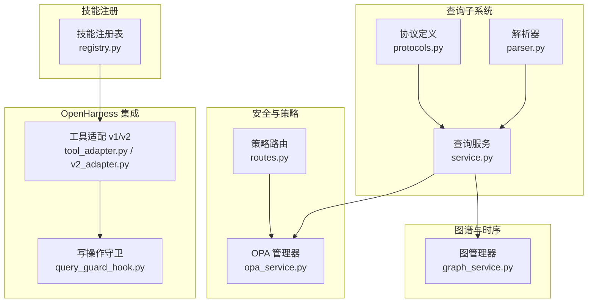
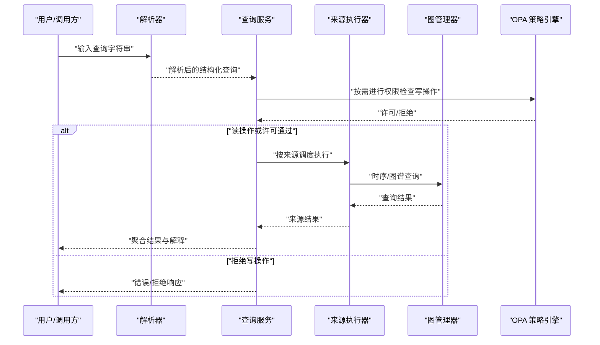
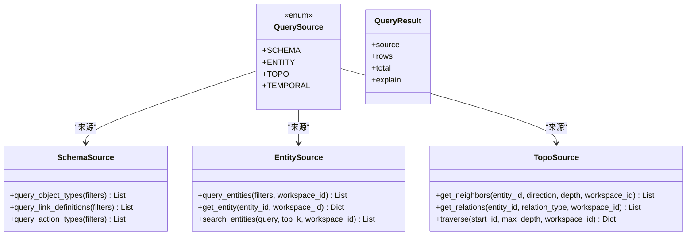
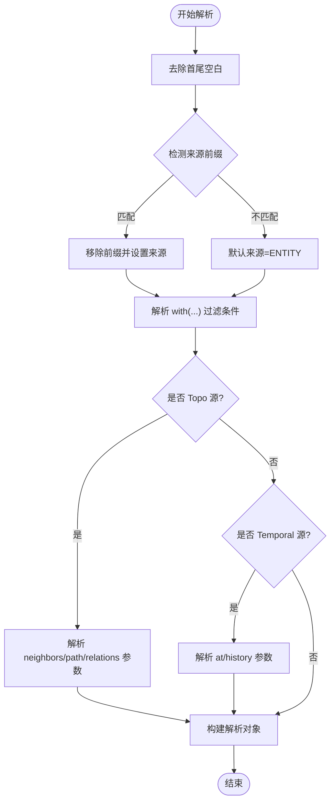
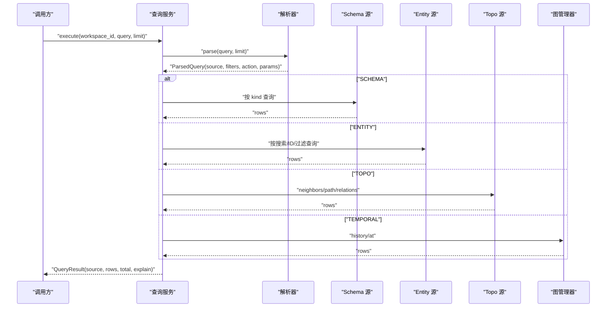
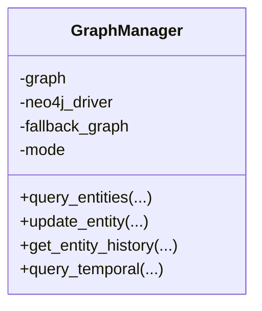
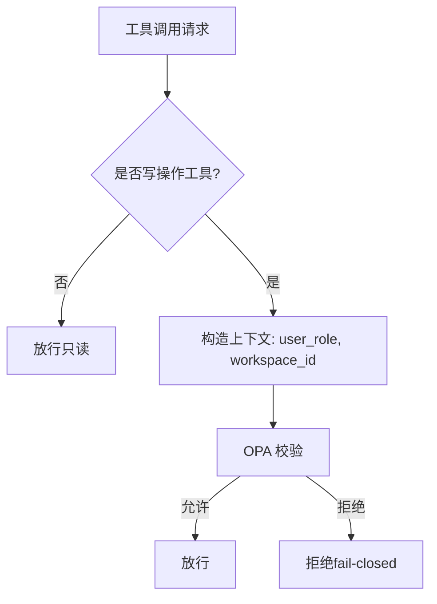
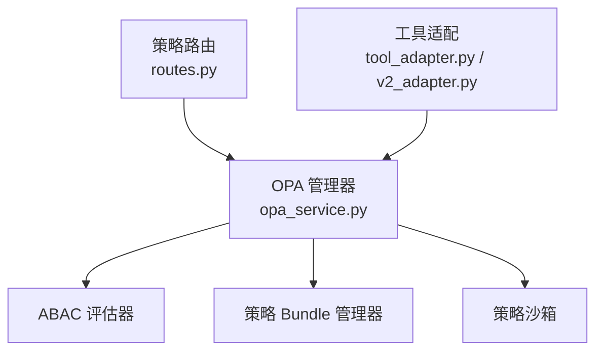
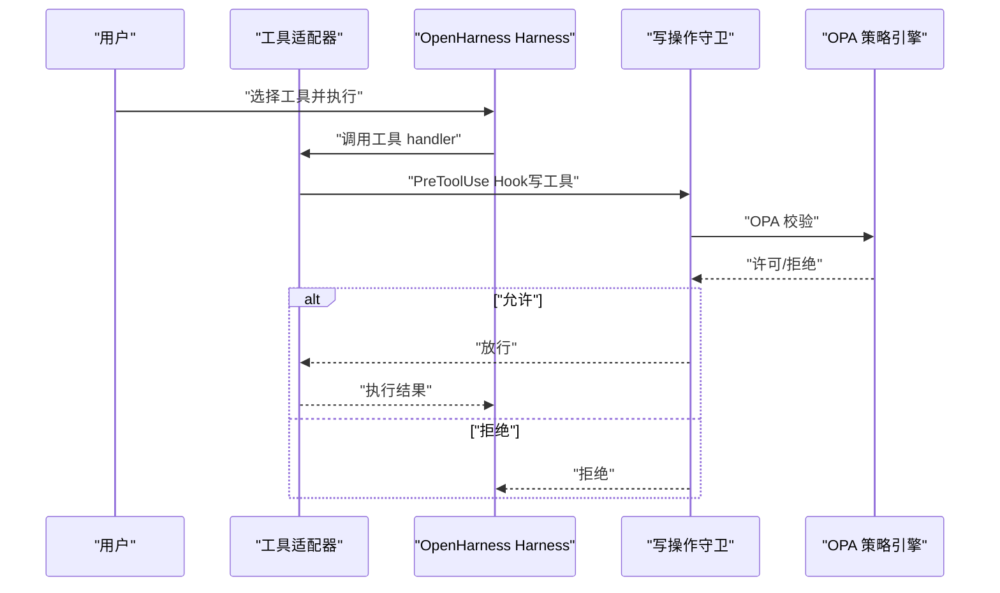
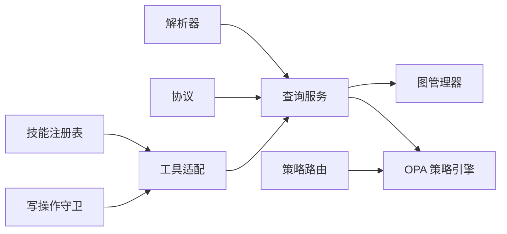

# 语义层架构

<cite>
**本文引用的文件**   
- [odap/infra/query/service.py](file://odap/infra/query/service.py)
- [odap/infra/query/parser.py](file://odap/infra/query/parser.py)
- [odap/infra/query/protocols.py](file://odap/infra/query/protocols.py)
- [odap/infra/opa/opa_service.py](file://odap/infra/opa/opa_service.py)
- [odap/infra/opa/routes.py](file://odap/infra/opa/routes.py)
- [odap/infra/openharness/query_guard_hook.py](file://odap/infra/openharness/query_guard_hook.py)
- [odap/infra/openharness/tool_adapter.py](file://odap/infra/openharness/tool_adapter.py)
- [odap/infra/openharness/v2_adapter.py](file://odap/infra/openharness/v2_adapter.py)
- [odap/infra/graph/graph_service.py](file://odap/infra/graph/graph_service.py)
- [odap/tools/registry.py](file://odap/tools/registry.py)
</cite>

## 目录
1. [简介](#简介)
2. [项目结构](#项目结构)
3. [核心组件](#核心组件)
4. [架构总览](#架构总览)
5. [详细组件分析](#详细组件分析)
6. [依赖分析](#依赖分析)
7. [性能考虑](#性能考虑)
8. [故障排查指南](#故障排查指南)
9. [结论](#结论)
10. [附录](#附录)

## 简介
本文件面向 ODAP 平台的语义层，系统化阐述统一查询服务的设计理念与实现架构，重点包括：
- 三源查询模型（Schema/Entity/Topo/Temporal）的理论基础与实践映射
- Query First 原则的含义、价值与落地策略
- Agent 安全默认机制（Agent Safe）的设计与实现
- 架构守卫（Architecture Guard）的测试驱动设计思想
- 查询解析器、规划器与执行器的详细设计
- 与 OpenHarness 的集成方案与工具注册机制
- 面向开发者的语义层扩展与定制指南

## 项目结构
语义层相关代码主要分布在以下模块：
- 查询子系统：解析、协议、服务与来源实现
- 安全与策略：OPA 策略引擎与路由
- OpenHarness 集成：工具适配、权限钩子与 v2 适配器
- 图谱与时序：GraphManager 支撑 Temporal 查询
- 技能注册：工具与技能的注册与暴露

**图表来源**
- [odap/infra/query/parser.py:1-113](file://odap/infra/query/parser.py#L1-L113)
- [odap/infra/query/protocols.py:1-40](file://odap/infra/query/protocols.py#L1-L40)
- [odap/infra/query/service.py:1-126](file://odap/infra/query/service.py#L1-L126)
- [odap/infra/opa/opa_service.py:1-750](file://odap/infra/opa/opa_service.py#L1-L750)
- [odap/infra/opa/routes.py:1-422](file://odap/infra/opa/routes.py#L1-L422)
- [odap/infra/openharness/query_guard_hook.py:1-175](file://odap/infra/openharness/query_guard_hook.py#L1-L175)
- [odap/infra/openharness/tool_adapter.py:1-488](file://odap/infra/openharness/tool_adapter.py#L1-L488)
- [odap/infra/openharness/v2_adapter.py:1-528](file://odap/infra/openharness/v2_adapter.py#L1-L528)
- [odap/infra/graph/graph_service.py:1-800](file://odap/infra/graph/graph_service.py#L1-L800)
- [odap/tools/registry.py:1-53](file://odap/tools/registry.py#L1-L53)

**章节来源**
- [odap/infra/query/service.py:1-126](file://odap/infra/query/service.py#L1-L126)
- [odap/infra/query/parser.py:1-113](file://odap/infra/query/parser.py#L1-L113)
- [odap/infra/query/protocols.py:1-40](file://odap/infra/query/protocols.py#L1-L40)
- [odap/infra/opa/opa_service.py:1-750](file://odap/infra/opa/opa_service.py#L1-L750)
- [odap/infra/opa/routes.py:1-422](file://odap/infra/opa/routes.py#L1-L422)
- [odap/infra/openharness/query_guard_hook.py:1-175](file://odap/infra/openharness/query_guard_hook.py#L1-L175)
- [odap/infra/openharness/tool_adapter.py:1-488](file://odap/infra/openharness/tool_adapter.py#L1-L488)
- [odap/infra/openharness/v2_adapter.py:1-528](file://odap/infra/openharness/v2_adapter.py#L1-L528)
- [odap/infra/graph/graph_service.py:1-800](file://odap/infra/graph/graph_service.py#L1-L800)
- [odap/tools/registry.py:1-53](file://odap/tools/registry.py#L1-L53)

## 核心组件
- 查询解析器：负责将自然语言风格的查询字符串解析为结构化的解析对象，识别来源与动作参数。
- 查询协议：定义查询来源枚举与结果模型，以及 Schema/Entity/Topo 源的协议接口。
- 查询服务：统一入口，根据解析结果调度不同来源的执行器，并封装结果与解释信息。
- 图管理器：支撑 Temporal 查询，提供实体历史与双时态查询能力。
- OPA 策略引擎：提供 ABAC/策略热更新/沙箱等能力，作为架构守卫的核心。
- OpenHarness 集成：将查询能力注册为工具，提供 v1/v2 适配与权限钩子。

**章节来源**
- [odap/infra/query/parser.py:23-81](file://odap/infra/query/parser.py#L23-L81)
- [odap/infra/query/protocols.py:7-39](file://odap/infra/query/protocols.py#L7-L39)
- [odap/infra/query/service.py:11-59](file://odap/infra/query/service.py#L11-L59)
- [odap/infra/graph/graph_service.py:71-144](file://odap/infra/graph/graph_service.py#L71-L144)
- [odap/infra/opa/opa_service.py:455-717](file://odap/infra/opa/opa_service.py#L455-L717)
- [odap/infra/openharness/query_guard_hook.py:17-83](file://odap/infra/openharness/query_guard_hook.py#L17-L83)

## 架构总览
统一查询服务以“解析-规划-执行”为主线，结合三源模型与安全默认策略，形成可扩展、可观测、可治理的语义层。

**图表来源**
- [odap/infra/query/parser.py:31-81](file://odap/infra/query/parser.py#L31-L81)
- [odap/infra/query/service.py:33-59](file://odap/infra/query/service.py#L33-L59)
- [odap/infra/opa/opa_service.py:538-583](file://odap/infra/opa/opa_service.py#L538-L583)
- [odap/infra/graph/graph_service.py:649-756](file://odap/infra/graph/graph_service.py#L649-L756)

## 详细组件分析

### 三源查询模型（Schema/Entity/Topo/Temporal）
- Schema 源：查询本体类型定义（对象类型、链接定义、动作类型），用于语义建模与约束。
- Entity 源：查询运行时实体，支持按过滤条件、ID、搜索等多维检索。
- Topo 源：图谱拓扑查询，支持邻居、路径、关系等图算法。
- Temporal 源：时序查询，支持实体历史与双时态查询。

**图表来源**
- [odap/infra/query/protocols.py:7-39](file://odap/infra/query/protocols.py#L7-L39)

**章节来源**
- [odap/infra/query/protocols.py:21-39](file://odap/infra/query/protocols.py#L21-L39)
- [odap/infra/query/service.py:72-125](file://odap/infra/query/service.py#L72-L125)

### 查询解析器（Parser）
- 识别来源前缀（.schema/.entity/.topo/.temporal），提取 with(...) 过滤条件。
- 对 Topo/Temporal 源解析动作与参数，如 neighbors/path/relations/at/history 等。
- 返回结构化解析对象，供查询服务后续规划与执行。

**图表来源**
- [odap/infra/query/parser.py:31-81](file://odap/infra/query/parser.py#L31-L81)

**章节来源**
- [odap/infra/query/parser.py:23-113](file://odap/infra/query/parser.py#L23-L113)

### 查询服务（Service）
- 单例模式，延迟初始化解析器与各来源实现。
- 根据解析结果调度对应执行器：
  - Schema：按 kind（对象类型/链接定义/动作类型）查询。
  - Entity：支持搜索、ID 获取、过滤查询。
  - Topo：邻居、路径、关系等图算法。
  - Temporal：历史与双时态查询，委托图管理器。
- 统一封装结果与解释信息，异常时返回错误解释。

**图表来源**
- [odap/infra/query/service.py:33-125](file://odap/infra/query/service.py#L33-L125)

**章节来源**
- [odap/infra/query/service.py:11-126](file://odap/infra/query/service.py#L11-L126)

### 图管理器（GraphManager）
- 三层降级：Graphiti（双时态知识图谱）→ Neo4j Driver → NetworkX fallback。
- 提供实体查询、更新、Episode/时序数据接入等能力。
- 为 Temporal 查询提供历史与双时态能力。

**图表来源**
- [odap/infra/graph/graph_service.py:71-144](file://odap/infra/graph/graph_service.py#L71-L144)

**章节来源**
- [odap/infra/graph/graph_service.py:649-756](file://odap/infra/graph/graph_service.py#L649-L756)

### Agent 安全默认机制（Agent Safe）
- 设计原则：查询工具默认只读；写操作需显式启用并通过 OPA 校验；OPA 不可用时 fail-closed。
- 写操作集合：写实体、写关系、新增/删除等。
- 守卫通过 OpenHarness PreToolUse Hook 拦截工具调用，携带 user_role/workspace_id 等上下文进行策略校验。

**图表来源**
- [odap/infra/openharness/query_guard_hook.py:17-83](file://odap/infra/openharness/query_guard_hook.py#L17-L83)

**章节来源**
- [odap/infra/openharness/query_guard_hook.py:17-83](file://odap/infra/openharness/query_guard_hook.py#L17-L83)

### 架构守卫（Architecture Guard）与策略治理
- OPA 管理器提供 ABAC 策略评估、策略热更新 Bundle、策略沙箱、批量权限检查与缓存。
- 策略路由提供策略的创建、更新、启停与版本管理，Markdown 到 Rego 的转换器。
- 与 OpenHarness 集成时，通过工具注册表区分 read/write 工具，实现“默认只读”的安全基线。

**图表来源**
- [odap/infra/opa/opa_service.py:455-717](file://odap/infra/opa/opa_service.py#L455-L717)
- [odap/infra/opa/routes.py:110-240](file://odap/infra/opa/routes.py#L110-L240)
- [odap/infra/openharness/tool_adapter.py:292-310](file://odap/infra/openharness/tool_adapter.py#L292-L310)

**章节来源**
- [odap/infra/opa/opa_service.py:114-225](file://odap/infra/opa/opa_service.py#L114-L225)
- [odap/infra/opa/routes.py:110-240](file://odap/infra/opa/routes.py#L110-L240)
- [odap/infra/openharness/tool_adapter.py:292-310](file://odap/infra/openharness/tool_adapter.py#L292-L310)

### 与 OpenHarness 的集成方案与工具注册机制
- 工具适配：将技能（SKILL_CATALOG）适配为 OpenHarness Tool，兼容 v1/v2 接口。
- 工具注册：通过工具注册表暴露 read/write 工具，写工具标注 requires_confirmation。
- 权限钩子：PreToolUse Hook 在执行前进行 OPA 校验，fail-closed 保证安全。
- v2 适配：提供 GraphitiAgentLoop 与 OpenHarness v2 QueryEngine 的集成，支持决策引擎与 LLM 客户端。

**图表来源**
- [odap/infra/openharness/tool_adapter.py:83-194](file://odap/infra/openharness/tool_adapter.py#L83-L194)
- [odap/infra/openharness/query_guard_hook.py:40-82](file://odap/infra/openharness/query_guard_hook.py#L40-L82)
- [odap/infra/openharness/v2_adapter.py:171-394](file://odap/infra/openharness/v2_adapter.py#L171-L394)

**章节来源**
- [odap/infra/openharness/tool_adapter.py:83-194](file://odap/infra/openharness/tool_adapter.py#L83-L194)
- [odap/infra/openharness/query_guard_hook.py:85-175](file://odap/infra/openharness/query_guard_hook.py#L85-L175)
- [odap/infra/openharness/v2_adapter.py:171-394](file://odap/infra/openharness/v2_adapter.py#L171-L394)
- [odap/tools/registry.py:11-53](file://odap/tools/registry.py#L11-L53)

### Query First 原则
- 含义：以“查询优先”的方式组织系统行为，先通过统一查询服务获取所需信息，再决定后续动作。
- 价值：降低耦合、提升一致性、便于审计与复用。
- 实施策略：
  - 统一查询入口：解析器/服务/来源执行器形成清晰边界。
  - 三源模型：Schema/Entity/Topo/Temporal 明确职责与边界。
  - 安全默认：写操作必须经 OPA 校验，减少误操作风险。
  - 可观测性：explain 字段记录来源、过滤条件与动作参数，便于调试与审计。

**章节来源**
- [odap/infra/query/service.py:61-70](file://odap/infra/query/service.py#L61-L70)
- [odap/infra/opa/opa_service.py:538-583](file://odap/infra/opa/opa_service.py#L538-L583)

## 依赖分析
- 解析器依赖协议中的来源枚举与结果模型。
- 查询服务依赖解析器与来源协议，内部组合图管理器以支持 Temporal。
- OPA 策略引擎与策略路由相互协作，前者提供决策，后者提供策略生命周期管理。
- OpenHarness 集成依赖工具注册表与守卫钩子，形成“默认只读”的安全基线。

**图表来源**
- [odap/infra/query/parser.py:1-113](file://odap/infra/query/parser.py#L1-L113)
- [odap/infra/query/protocols.py:1-40](file://odap/infra/query/protocols.py#L1-L40)
- [odap/infra/query/service.py:1-126](file://odap/infra/query/service.py#L1-L126)
- [odap/infra/opa/opa_service.py:1-750](file://odap/infra/opa/opa_service.py#L1-L750)
- [odap/infra/opa/routes.py:1-422](file://odap/infra/opa/routes.py#L1-L422)
- [odap/tools/registry.py:1-53](file://odap/tools/registry.py#L1-L53)
- [odap/infra/openharness/query_guard_hook.py:1-175](file://odap/infra/openharness/query_guard_hook.py#L1-L175)
- [odap/infra/openharness/tool_adapter.py:1-488](file://odap/infra/openharness/tool_adapter.py#L1-L488)

**章节来源**
- [odap/infra/query/service.py:1-126](file://odap/infra/query/service.py#L1-L126)
- [odap/infra/opa/opa_service.py:1-750](file://odap/infra/opa/opa_service.py#L1-L750)

## 性能考虑
- 查询服务对异常进行捕获并返回解释信息，避免崩溃传播，有利于可观测性与稳定性。
- 图管理器提供三层降级与连接池、断路器等机制，保障在不同部署环境下稳定运行。
- OPA 管理器内置缓存与批量检查，降低策略评估开销。
- 建议：
  - 对高频查询增加缓存与限流。
  - 合理设置 limit，避免大结果集返回。
  - 在 OpenHarness 场景中，优先使用只读工具，减少写操作带来的策略校验成本。

[本节为通用建议，无需特定文件引用]

## 故障排查指南
- 查询异常：检查解析器是否正确识别来源与参数；查看查询服务的 explain 输出定位问题。
- 写操作被拒：确认工具是否属于写操作集合；核对 user_role/workspace_id；检查 OPA 策略是否允许。
- 图查询失败：确认图管理器当前模式（graphiti/neo4j/fallback）；检查连接与索引状态。
- 策略路由异常：确认策略数据库初始化与 Markdown→Rego 转换是否成功。

**章节来源**
- [odap/infra/query/service.py:52-59](file://odap/infra/query/service.py#L52-L59)
- [odap/infra/opa/opa_service.py:538-583](file://odap/infra/opa/opa_service.py#L538-L583)
- [odap/infra/opa/routes.py:166-240](file://odap/infra/opa/routes.py#L166-L240)
- [odap/infra/graph/graph_service.py:145-213](file://odap/infra/graph/graph_service.py#L145-L213)

## 结论
ODAP 语义层以统一查询服务为核心，结合三源模型与 Query First 原则，构建了“可解析、可规划、可执行、可治理”的架构。通过 Agent Safe 默认安全与 OPA 策略治理，确保在开放生态中保持安全可控；借助 OpenHarness 的工具注册与权限钩子，实现与智能体系统的无缝集成。该架构既满足当前需求，又为未来扩展与定制提供了清晰的边界与路径。

[本节为总结性内容，无需特定文件引用]

## 附录

### 开发者扩展与定制指南
- 扩展来源实现：实现协议接口（Schema/Entity/Topo），在查询服务中注入自定义实现。
- 新增工具：通过技能注册表注册新技能，适配为 OpenHarness 工具；对于写操作工具，确保在守卫中声明并配置 requires_confirmation。
- 策略治理：通过策略路由创建/更新策略，使用 Markdown→Rego 转换器快速上线；利用策略沙箱进行 What-If 分析。
- Temporal 查询：基于图管理器提供的历史与双时态能力，扩展查询接口以满足业务场景。

**章节来源**
- [odap/infra/query/protocols.py:21-39](file://odap/infra/query/protocols.py#L21-L39)
- [odap/infra/query/service.py:19-31](file://odap/infra/query/service.py#L19-L31)
- [odap/tools/registry.py:26-53](file://odap/tools/registry.py#L26-L53)
- [odap/infra/opa/routes.py:137-240](file://odap/infra/opa/routes.py#L137-L240)
- [odap/infra/ograph/graph_service.py:649-756](file://odap/infra/graph/graph_service.py#L649-L756)