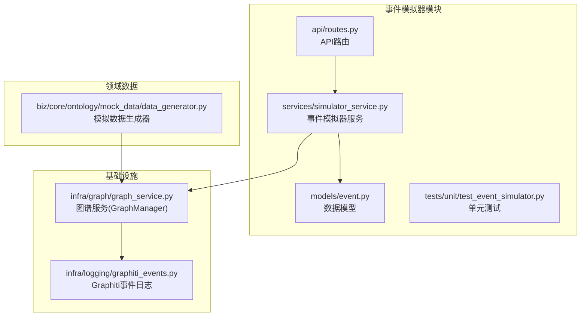
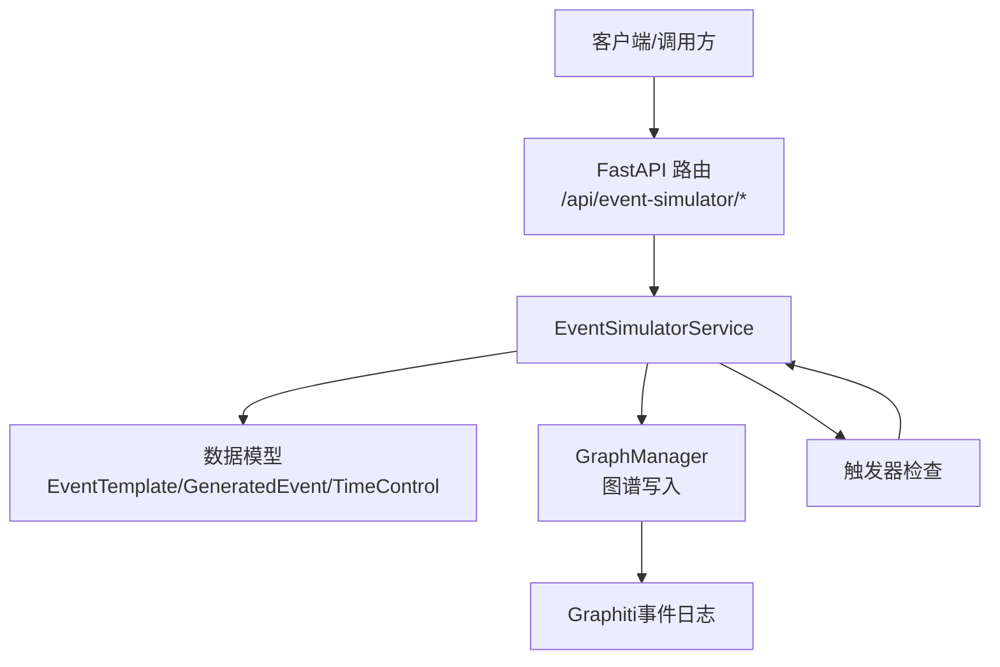
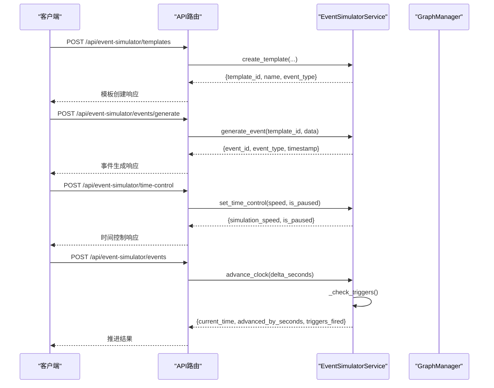
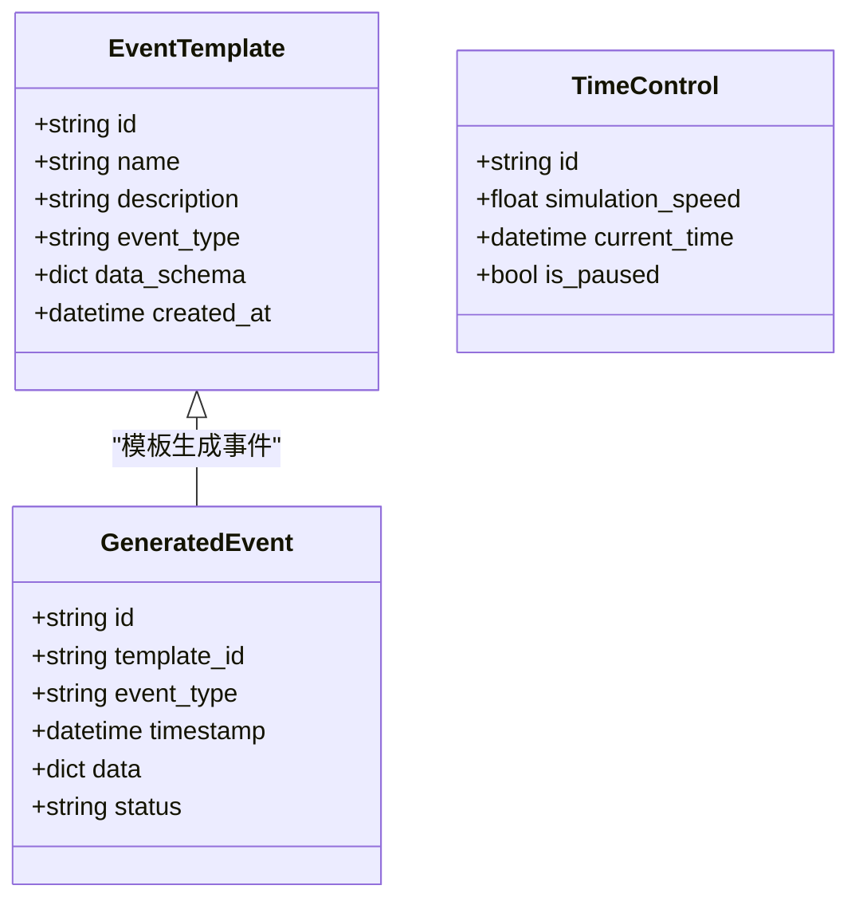
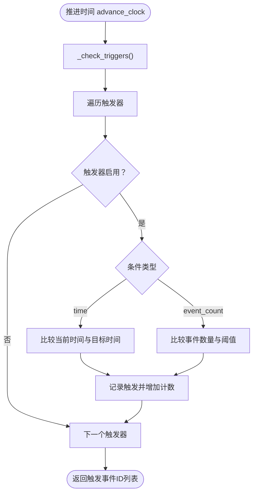
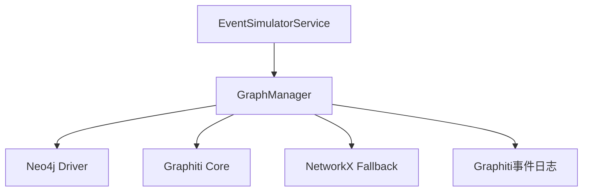
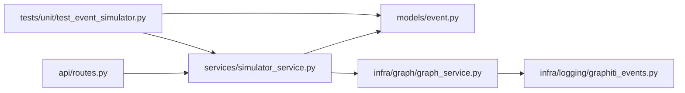

# 事件模拟器

<cite>
**本文引用的文件**
- [事件模拟器设计文档](file://docs/03-modules/event_simulator/DESIGN.md)
- [事件模拟器服务实现](file://odap/biz/simulation/event_simulator/services/simulator_service.py)
- [事件模拟器API路由](file://odap/biz/simulation/event_simulator/api/routes.py)
- [事件模拟器数据模型](file://odap/biz/simulation/event_simulator/models/event.py)
- [事件模拟器单元测试](file://tests/unit/test_event_simulator.py)
- [图谱服务（GraphManager）](file://odap/infra/graph/graph_service.py)
- [Graphiti事件日志](file://odap/infra/logging/graphiti_events.py)
- [模拟数据生成器](file://odap/biz/core/ontology/mock_data/data_generator.py)
</cite>

## 目录
1. [简介](#简介)
2. [项目结构](#项目结构)
3. [核心组件](#核心组件)
4. [架构总览](#架构总览)
5. [详细组件分析](#详细组件分析)
6. [依赖分析](#依赖分析)
7. [性能考虑](#性能考虑)
8. [故障排查指南](#故障排查指南)
9. [结论](#结论)
10. [附录](#附录)

## 简介
事件模拟器是 ODAP 平台的场景驱动引擎，负责自动生成和注入模拟事件到知识图谱，驱动本体状态演化。它通过模板化、脚本化、规则化和随机化的多种事件生成策略，结合时间控制与触发器机制，为上层推演与可视化提供高质量的事件流。

## 项目结构
事件模拟器位于 odap/biz/simulation/event_simulator 目录下，采用按职责分层的组织方式：
- models：事件数据模型定义（模板、生成事件、时间控制）
- services：事件模拟器服务（模板管理、事件生成、时间控制、触发器）
- api：FastAPI 路由与对外接口
- tests：单元测试覆盖

**图表来源**
- [事件模拟器数据模型:1-36](file://odap/biz/simulation/event_simulator/models/event.py#L1-L36)
- [事件模拟器服务实现:1-134](file://odap/biz/simulation/event_simulator/services/simulator_service.py#L1-L134)
- [事件模拟器API路由:1-69](file://odap/biz/simulation/event_simulator/api/routes.py#L1-L69)
- [事件模拟器单元测试:1-206](file://tests/unit/test_event_simulator.py#L1-L206)
- [图谱服务（GraphManager）:1-800](file://odap/infra/graph/graph_service.py#L1-L800)
- [Graphiti事件日志:1-81](file://odap/infra/logging/graphiti_events.py#L1-L81)
- [模拟数据生成器:1-267](file://odap/biz/core/ontology/mock_data/data_generator.py#L1-L267)

**章节来源**
- [事件模拟器设计文档:1-548](file://docs/03-modules/event_simulator/DESIGN.md#L1-L548)
- [事件模拟器数据模型:1-36](file://odap/biz/simulation/event_simulator/models/event.py#L1-L36)
- [事件模拟器服务实现:1-134](file://odap/biz/simulation/event_simulator/services/simulator_service.py#L1-L134)
- [事件模拟器API路由:1-69](file://odap/biz/simulation/event_simulator/api/routes.py#L1-L69)

## 核心组件
- 事件模板（EventTemplate）：定义事件的结构化模板，包含名称、类型、JSON Schema 和创建时间。
- 生成事件（GeneratedEvent）：基于模板生成的具体事件，包含事件类型、时间戳、数据和状态。
- 时间控制（TimeControl）：控制模拟速度、暂停状态与当前时间。
- 事件模拟器服务（EventSimulatorService）：提供模板管理、事件生成、时间控制与触发器注册能力。
- API 路由：提供模板创建、事件生成、事件列表、时间控制等 REST 接口。

**章节来源**
- [事件模拟器数据模型:10-36](file://odap/biz/simulation/event_simulator/models/event.py#L10-L36)
- [事件模拟器服务实现:9-134](file://odap/biz/simulation/event_simulator/services/simulator_service.py#L9-L134)
- [事件模拟器API路由:12-69](file://odap/biz/simulation/event_simulator/api/routes.py#L12-L69)

## 架构总览
事件模拟器采用“服务-模型-API”三层结构，并与图谱服务和日志系统协作，形成完整的事件生成与注入链路。

**图表来源**
- [事件模拟器API路由:1-69](file://odap/biz/simulation/event_simulator/api/routes.py#L1-L69)
- [事件模拟器服务实现:1-134](file://odap/biz/simulation/event_simulator/services/simulator_service.py#L1-L134)
- [图谱服务（GraphManager）:1-800](file://odap/infra/graph/graph_service.py#L1-L800)
- [Graphiti事件日志:1-81](file://odap/infra/logging/graphiti_events.py#L1-L81)

## 详细组件分析

### 事件模板与生成流程
- 模板创建：接收名称、事件类型、描述与 JSON Schema，生成唯一模板 ID 并存储。
- 事件生成：根据模板 ID 与传入数据生成具体事件，记录时间戳与状态。
- 事件列表：支持限制数量的事件列表查询。
- 时间控制：设置模拟速度与暂停状态；推进时间并触发条件检查。
- 触发器：注册基于时间或事件计数的触发条件，推进时间后检查并返回触发事件集合。

**图表来源**
- [事件模拟器API路由:12-69](file://odap/biz/simulation/event_simulator/api/routes.py#L12-L69)
- [事件模拟器服务实现:18-134](file://odap/biz/simulation/event_simulator/services/simulator_service.py#L18-L134)

**章节来源**
- [事件模拟器服务实现:18-134](file://odap/biz/simulation/event_simulator/services/simulator_service.py#L18-L134)
- [事件模拟器API路由:12-69](file://odap/biz/simulation/event_simulator/api/routes.py#L12-L69)

### 数据模型与类关系
事件模拟器的数据模型以 Pydantic BaseModel 为基础，保证字段类型与默认值的一致性。

**图表来源**
- [事件模拟器数据模型:10-36](file://odap/biz/simulation/event_simulator/models/event.py#L10-L36)

**章节来源**
- [事件模拟器数据模型:10-36](file://odap/biz/simulation/event_simulator/models/event.py#L10-L36)

### 触发器与条件检查
服务内部维护触发器字典，支持基于时间与事件计数的条件判断。推进时间时会遍历触发器并返回被触发的 ID 列表。

**图表来源**
- [事件模拟器服务实现:116-134](file://odap/biz/simulation/event_simulator/services/simulator_service.py#L116-L134)

**章节来源**
- [事件模拟器服务实现:116-134](file://odap/biz/simulation/event_simulator/services/simulator_service.py#L116-L134)

### 与图谱服务的集成
- 图谱写入：服务通过 GraphManager 进行实体与关系的创建、更新与删除。
- 事件日志：Graphiti 事件通过结构化日志系统记录，便于审计与追踪。
- 降级策略：支持 Neo4j 直连与 NetworkX 回退模式，确保在不同环境下稳定运行。

**图表来源**
- [事件模拟器服务实现:1-134](file://odap/biz/simulation/event_simulator/services/simulator_service.py#L1-L134)
- [图谱服务（GraphManager）:1-800](file://odap/infra/graph/graph_service.py#L1-L800)
- [Graphiti事件日志:1-81](file://odap/infra/logging/graphiti_events.py#L1-L81)

**章节来源**
- [图谱服务（GraphManager）:1-800](file://odap/infra/graph/graph_service.py#L1-L800)
- [Graphiti事件日志:1-81](file://odap/infra/logging/graphiti_events.py#L1-L81)

## 依赖分析
- 内部依赖：API 路由依赖服务层；服务层依赖数据模型。
- 外部依赖：图谱服务（GraphManager）依赖 Neo4j Driver、Graphiti Core 或 NetworkX；日志系统依赖结构化日志框架。
- 测试依赖：单元测试覆盖模板创建、事件生成、列表查询、时间控制与触发器逻辑。

**图表来源**
- [事件模拟器API路由:1-69](file://odap/biz/simulation/event_simulator/api/routes.py#L1-L69)
- [事件模拟器服务实现:1-134](file://odap/biz/simulation/event_simulator/services/simulator_service.py#L1-L134)
- [事件模拟器数据模型:1-36](file://odap/biz/simulation/event_simulator/models/event.py#L1-L36)
- [事件模拟器单元测试:1-206](file://tests/unit/test_event_simulator.py#L1-L206)
- [图谱服务（GraphManager）:1-800](file://odap/infra/graph/graph_service.py#L1-L800)
- [Graphiti事件日志:1-81](file://odap/infra/logging/graphiti_events.py#L1-L81)

**章节来源**
- [事件模拟器API路由:1-69](file://odap/biz/simulation/event_simulator/api/routes.py#L1-L69)
- [事件模拟器服务实现:1-134](file://odap/biz/simulation/event_simulator/services/simulator_service.py#L1-L134)
- [事件模拟器数据模型:1-36](file://odap/biz/simulation/event_simulator/models/event.py#L1-L36)
- [事件模拟器单元测试:1-206](file://tests/unit/test_event_simulator.py#L1-L206)

## 性能考虑
- 事件生成吞吐：通过批量生成与异步队列提升事件生成速率。
- 注入延迟：采用批量写入策略降低 Graphiti 写入延迟。
- 时间精度：高精度模拟时钟支持毫秒级时间推进。
- 时间缩放：最大支持 100x 缩放，结合事件预生成与缓冲队列提升性能。
- 并发场景：每场景独立时间线引擎，支持多场景并发运行。
- 可靠性：事务性写入与事件记录支持回滚与审计。

**章节来源**
- [事件模拟器设计文档:513-523](file://docs/03-modules/event_simulator/DESIGN.md#L513-L523)

## 故障排查指南
- 模板不存在：生成事件时若模板 ID 不存在，服务返回错误状态与消息。
- 触发器不生效：检查触发器是否启用，条件类型与阈值是否满足。
- 时间推进异常：确认模拟速度与暂停状态设置，核对当前时间推进是否符合预期。
- 图谱写入失败：检查 GraphManager 连接状态与降级策略，关注断路器与连接池状态。

**章节来源**
- [事件模拟器服务实现:47-65](file://odap/biz/simulation/event_simulator/services/simulator_service.py#L47-L65)
- [事件模拟器单元测试:66-69](file://tests/unit/test_event_simulator.py#L66-L69)
- [事件模拟器单元测试:196-205](file://tests/unit/test_event_simulator.py#L196-L205)

## 结论
事件模拟器通过清晰的分层设计与完善的事件生命周期管理，提供了灵活、可扩展的事件生成与注入能力。结合图谱服务与日志系统，能够在复杂场景下保持高性能与高可靠性，为上层推演与可视化提供坚实基础。

## 附录

### API 接口规范
- 创建模板
  - 方法：POST
  - 路径：/api/event-simulator/templates
  - 请求参数：name, event_type, description, schema
  - 响应：template_id, name, event_type
- 列出模板
  - 方法：GET
  - 路径：/api/event-simulator/templates
  - 响应：templates 数组
- 生成事件
  - 方法：POST
  - 路径：/api/event-simulator/events/generate
  - 请求参数：template_id, data
  - 响应：event_id, event_type, timestamp
- 列出事件
  - 方法：GET
  - 路径：/api/event-simulator/events
  - 请求参数：limit
  - 响应：events 数组
- 设置时间控制
  - 方法：POST
  - 路径：/api/event-simulator/time-control
  - 请求参数：speed, is_paused
  - 响应：simulation_speed, is_paused
- 获取时间控制
  - 方法：GET
  - 路径：/api/event-simulator/time-control
  - 响应：simulation_speed, current_time, is_paused

**章节来源**
- [事件模拟器API路由:12-69](file://odap/biz/simulation/event_simulator/api/routes.py#L12-L69)

### 事件场景设计最佳实践
- 军事冲突场景
  - 使用事件类型：部署、移动、交战、打击、侦察等。
  - 通过模板与脚本驱动事件序列，结合威胁评估与资源分配规则生成事件。
  - 利用触发器在特定条件下（如时间到达、事件发生）生成后续事件。
- 自然灾害场景
  - 使用环境变化与外部输入事件类型，结合地理与气象数据生成事件。
  - 通过概率分布模拟灾害强度与影响范围，支持多情景对比。
- 经济危机场景
  - 使用资源变更与关系变更事件类型，模拟市场波动与供应链中断。
  - 通过规则驱动事件生成，结合历史数据与趋势预测。

**章节来源**
- [事件模拟器设计文档:66-86](file://docs/03-modules/event_simulator/DESIGN.md#L66-L86)
- [模拟数据生成器:155-231](file://odap/biz/core/ontology/mock_data/data_generator.py#L155-L231)