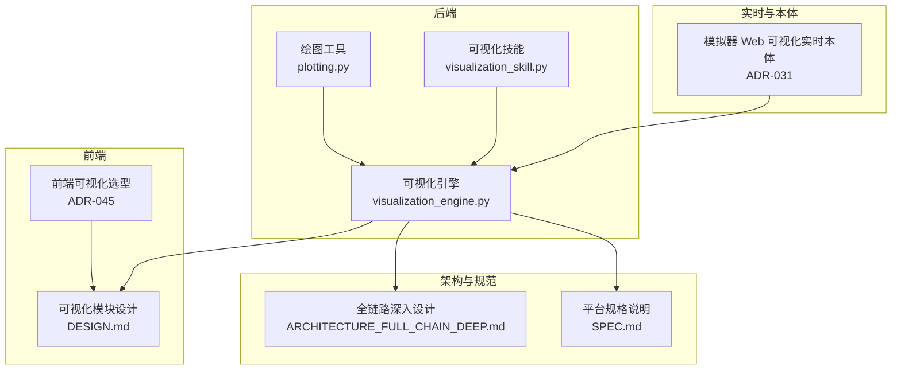
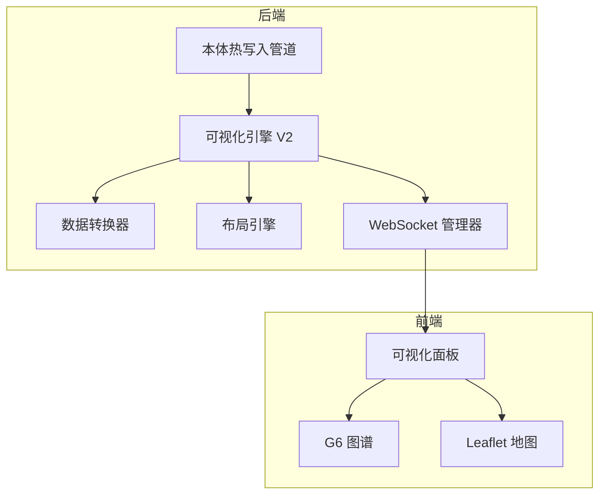
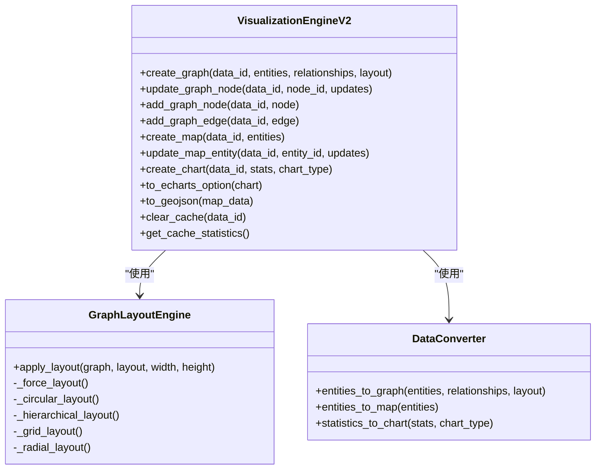
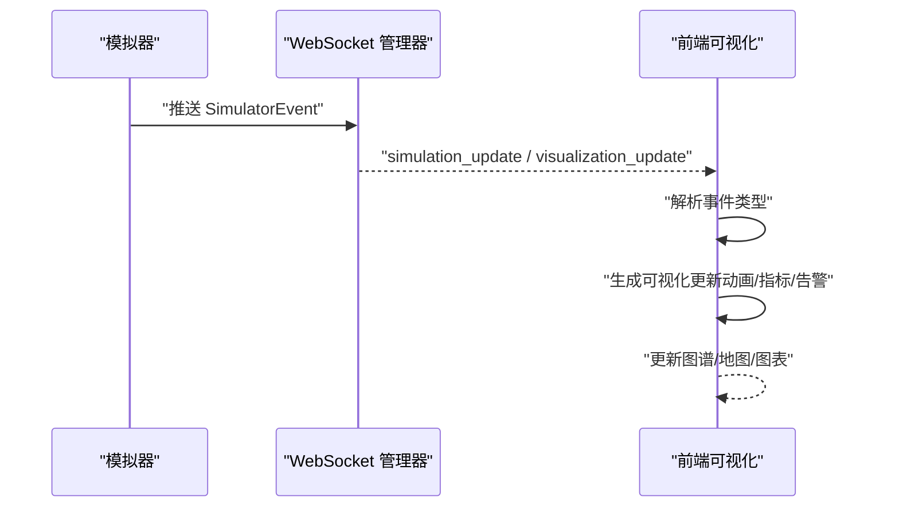
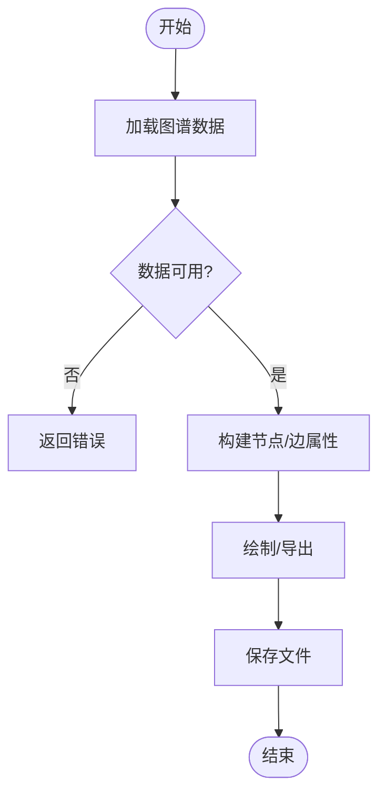
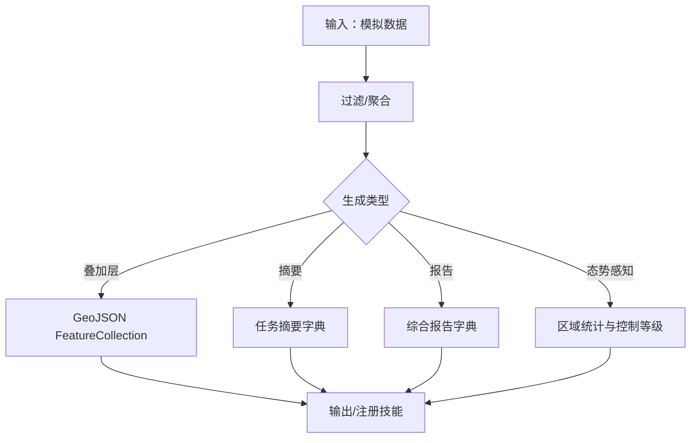
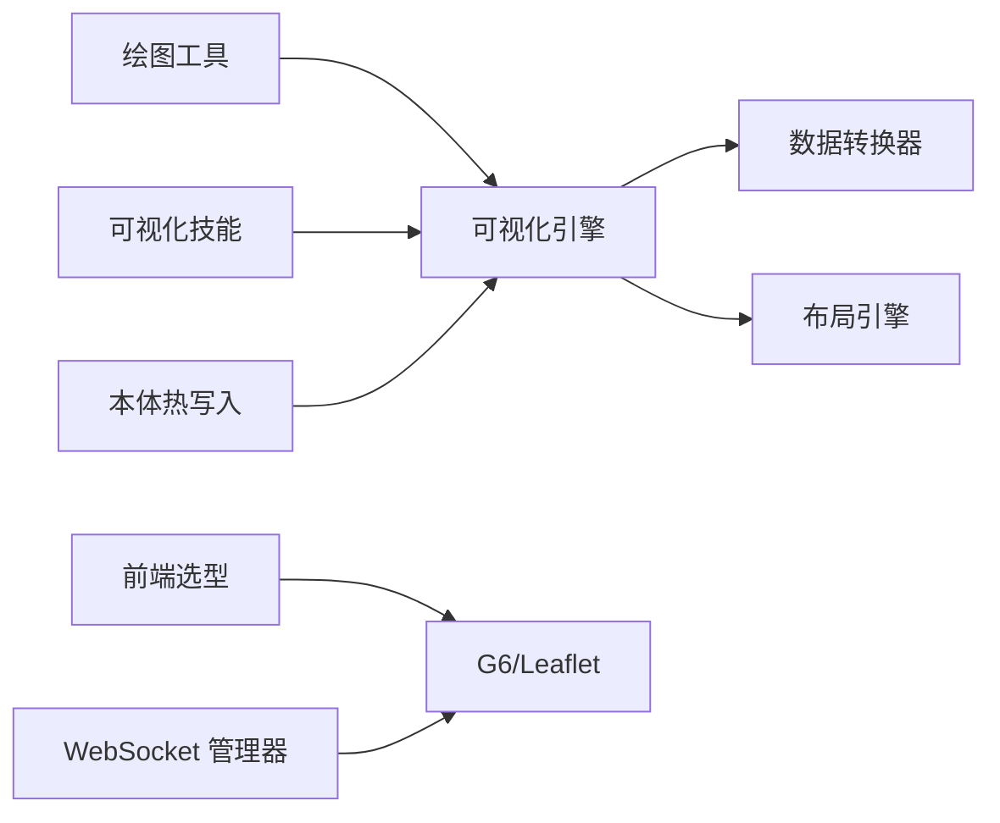

# 仿真可视化

<cite>
**本文引用的文件**   
- [visualization_engine.py](file://odap/biz/simulation/visualization/visualization_engine.py)
- [plotting.py](file://odap/tools/visualization/plotting.py)
- [visualization_skill.py](file://odap/tools/visualization/visualization_skill.py)
- [DESIGN.md](file://docs/03-modules/visualization/DESIGN.md)
- [ADR-045 前端可视化选型 G6 + Leaflet.md](file://docs/07-adr/ADR-045_frontend_visualization_g6_leaflet.md)
- [ADR-031 模拟器 Web 可视化实时本体.md](file://docs/07-adr/ADR-031_simulator_web_visualization_realtime_ontology.md)
- [ARCHITECTURE_FULL_CHAIN_DEEP.md](file://docs/02-architecture/ARCHITECTURE_FULL_CHAIN_DEEP.md)
- [SPEC.md](file://specs/001-odap-platform/spec.md)
- [test_visualization.py](file://tests/unit/test_visualization.py)
</cite>

## 目录
1. [简介](#简介)
2. [项目结构](#项目结构)
3. [核心组件](#核心组件)
4. [架构总览](#架构总览)
5. [详细组件分析](#详细组件分析)
6. [依赖分析](#依赖分析)
7. [性能考量](#性能考量)
8. [故障排查指南](#故障排查指南)
9. [结论](#结论)
10. [附录](#附录)

## 简介
本文件面向“仿真可视化”系统，聚焦于可视化引擎的架构与实现，涵盖渲染管线、图形抽象层、实时渲染机制、数据绑定与动态更新、交互响应、可视化组件设计模式（图表类型、样式系统、主题定制）、与前端集成方案（数据传输协议、状态同步、事件通信）、配置项与自定义方法，以及性能基准与优化建议。文档以仓库中的设计文档、实现代码与测试用例为依据，力求在技术深度与可读性之间取得平衡。

## 项目结构
仿真可视化相关代码主要分布在如下位置：
- 后端可视化引擎与数据转换：odap/biz/simulation/visualization/visualization_engine.py
- 后端图谱/地图/图表工具：odap/tools/visualization/plotting.py、odap/tools/visualization/visualization_skill.py
- 前端可视化选型与集成：docs/07-adr/ADR-045_frontend_visualization_g6_leaflet.md、docs/03-modules/visualization/DESIGN.md
- 实时推演与本体热写入：docs/07-adr/ADR-031_simulator_web_visualization_realtime_ontology.md
- 架构与规范：docs/02-architecture/ARCHITECTURE_FULL_CHAIN_DEEP.md、specs/001-odap-platform/spec.md
- 单元测试：tests/unit/test_visualization.py

**图示来源**
- [visualization_engine.py:1-652](file://odap/biz/simulation/visualization/visualization_engine.py#L1-L652)
- [plotting.py:1-491](file://odap/tools/visualization/plotting.py#L1-L491)
- [visualization_skill.py:1-261](file://odap/tools/visualization/visualization_skill.py#L1-L261)
- [ADR-045 前端可视化选型 G6 + Leaflet.md:1-76](file://docs/07-adr/ADR-045_frontend_visualization_g6_leaflet.md#L1-L76)
- [DESIGN.md:1-928](file://docs/03-modules/visualization/DESIGN.md#L1-L928)
- [ADR-031 模拟器 Web 可视化实时本体.md:20-137](file://docs/07-adr/ADR-031_simulator_web_visualization_realtime_ontology.md#L20-L137)
- [ARCHITECTURE_FULL_CHAIN_DEEP.md:1167-1236](file://docs/02-architecture/ARCHITECTURE_FULL_CHAIN_DEEP.md#L1167-L1236)
- [SPEC.md:118-156](file://specs/001-odap-platform/spec.md#L118-L156)

**章节来源**
- [visualization_engine.py:1-652](file://odap/biz/simulation/visualization/visualization_engine.py#L1-L652)
- [plotting.py:1-491](file://odap/tools/visualization/plotting.py#L1-L491)
- [visualization_skill.py:1-261](file://odap/tools/visualization/visualization_skill.py#L1-L261)
- [ADR-045 前端可视化选型 G6 + Leaflet.md:1-76](file://docs/07-adr/ADR-045_frontend_visualization_g6_leaflet.md#L1-L76)
- [DESIGN.md:1-928](file://docs/03-modules/visualization/DESIGN.md#L1-L928)
- [ADR-031 模拟器 Web 可视化实时本体.md:20-137](file://docs/07-adr/ADR-031_simulator_web_visualization_realtime_ontology.md#L20-L137)
- [ARCHITECTURE_FULL_CHAIN_DEEP.md:1167-1236](file://docs/02-architecture/ARCHITECTURE_FULL_CHAIN_DEEP.md#L1167-L1236)
- [SPEC.md:118-156](file://specs/001-odap-platform/spec.md#L118-L156)

## 核心组件
- 可视化引擎（VisualizationEngineV2）
  - 统一的图/地图/图表数据结构与缓存
  - 布局引擎（力导向、圆形、层次、网格、辐射）
  - 数据转换器（实体→图、实体→地图、统计→图表）
  - ECharts/GeoJSON 导出
- 绘图工具（DomainVisualization）
  - 基于 NetworkX/Plotly/Matplotlib 的静态/交互式图谱与态势可视化
- 可视化技能（Visualization Skills）
  - 地图叠加层生成、任务摘要、态势报告、区域态势感知
- 前端可视化选型
  - 图谱：AntV G6 + Ant Design Graphs
  - 地图：Leaflet + react-leaflet
- 实时推演与本体热写入
  - WebSocket 推送模拟事件流，前端维护本地状态机
  - 本体热写入：版本化→Hook→Graphiti 实时扩展

**章节来源**
- [visualization_engine.py:29-589](file://odap/biz/simulation/visualization/visualization_engine.py#L29-L589)
- [plotting.py:23-491](file://odap/tools/visualization/plotting.py#L23-L491)
- [visualization_skill.py:18-261](file://odap/tools/visualization/visualization_skill.py#L18-L261)
- [ADR-045 前端可视化选型 G6 + Leaflet.md:1-76](file://docs/07-adr/ADR-045_frontend_visualization_g6_leaflet.md#L1-L76)
- [ADR-031 模拟器 Web 可视化实时本体.md:20-137](file://docs/07-adr/ADR-031_simulator_web_visualization_realtime_ontology.md#L20-L137)

## 架构总览
后端采用“可视化引擎 + 数据转换 + 缓存”的统一抽象，前端采用“G6 图谱 + Leaflet 地图”的混合渲染策略。实时推演通过 WebSocket 将事件流推送到前端，前端根据事件类型生成对应的可视化更新。本体热写入通过版本化与 Hook 系统实现“无需重启”的实时扩展。

**图示来源**
- [visualization_engine.py:378-589](file://odap/biz/simulation/visualization/visualization_engine.py#L378-L589)
- [ADR-031 模拟器 Web 可视化实时本体.md:92-137](file://docs/07-adr/ADR-031_simulator_web_visualization_realtime_ontology.md#L92-L137)
- [ARCHITECTURE_FULL_CHAIN_DEEP.md:1167-1236](file://docs/02-architecture/ARCHITECTURE_FULL_CHAIN_DEEP.md#L1167-L1236)
- [ADR-045 前端可视化选型 G6 + Leaflet.md:31-65](file://docs/07-adr/ADR-045_frontend_visualization_g6_leaflet.md#L31-L65)

## 详细组件分析

### 可视化引擎（VisualizationEngineV2）
- 数据模型
  - GraphNode/GraphEdge/GraphData：图结构
  - MapEntity/MapLayer/MapData：地图数据
  - ChartSeries/ChartData：图表数据
- 布局引擎
  - 支持 force/circular/hierarchical/grid/radial 布局
  - 随机初始化 + 均匀分布/层次化/网格化/辐射状
- 数据转换器
  - entities_to_graph：实体→图（去重边、类别提取、布局）
  - entities_to_map：实体→地图（按类型分层、中心点计算）
  - statistics_to_chart：统计→图表（自动推断 series 类型）
- 导出与缓存
  - to_echarts_option：图表配置
  - to_geojson：GeoJSON 输出
  - 缓存统计与清理
- 并发与锁
  - 线程锁保护缓存与更新
  - 回调注册与全局引擎单例

**图示来源**
- [visualization_engine.py:153-589](file://odap/biz/simulation/visualization/visualization_engine.py#L153-L589)

**章节来源**
- [visualization_engine.py:153-589](file://odap/biz/simulation/visualization/visualization_engine.py#L153-L589)
- [test_visualization.py:175-205](file://tests/unit/test_visualization.py#L175-L205)

### 实时推演可视化（WebSocket 事件流）
- 后端 WebSocket 管理器负责连接生命周期与广播
- 前端维护本地状态机，按事件类型渲染实体移动、事件发生、指标更新、状态切换
- 事件类型映射到可视化更新对象，包含动画参数、图标、阈值与告警

**图示来源**
- [ARCHITECTURE_FULL_CHAIN_DEEP.md:1167-1236](file://docs/02-architecture/ARCHITECTURE_FULL_CHAIN_DEEP.md#L1167-L1236)
- [DESIGN.md:381-484](file://docs/03-modules/visualization/DESIGN.md#L381-L484)

**章节来源**
- [ARCHITECTURE_FULL_CHAIN_DEEP.md:1167-1236](file://docs/02-architecture/ARCHITECTURE_FULL_CHAIN_DEEP.md#L1167-L1236)
- [DESIGN.md:381-484](file://docs/03-modules/visualization/DESIGN.md#L381-L484)

### 后端绘图工具（DomainVisualization）
- 基于 NetworkX/Plotly/Matplotlib 的静态/交互式图谱可视化
- 支持领域状态饼图、处置动态表格、本体查询与属性聚合
- 生成 HTML/图片输出，便于离线报告与演示

**图示来源**
- [plotting.py:45-295](file://odap/tools/visualization/plotting.py#L45-L295)

**章节来源**
- [plotting.py:23-491](file://odap/tools/visualization/plotting.py#L23-L491)

### 可视化技能（Visualization Skills）
- generate_map_overlay：生成 GeoJSON 叠加层（位置/单位/武器）
- summarize_mission：任务摘要
- generate_domain_report：领域态势综合报告
- generate_situation_awareness：区域态势感知

**图示来源**
- [visualization_skill.py:18-261](file://odap/tools/visualization/visualization_skill.py#L18-L261)

**章节来源**
- [visualization_skill.py:18-261](file://odap/tools/visualization/visualization_skill.py#L18-L261)

### 前端可视化组件设计模式
- 图谱组件（G6）
  - 使用 AntV G6 v5 与 @ant-design/graphs，支持多种布局与交互
  - 通过统一数据结构驱动渲染，支持节点/边样式与动画
- 地图组件（Leaflet）
  - react-leaflet 封装，支持瓦片图层、叠加层、弹窗与交互
  - 与后端 GeoJSON/叠加层配合
- 样式系统与主题定制
  - 基于 Ant Design 设计语言，支持明暗主题与组件级样式覆盖
- 主题与配置
  - 通过配置文件与组件属性进行主题切换与样式定制

**章节来源**
- [ADR-045 前端可视化选型 G6 + Leaflet.md:1-76](file://docs/07-adr/ADR-045_frontend_visualization_g6_leaflet.md#L1-L76)
- [DESIGN.md:1-928](file://docs/03-modules/visualization/DESIGN.md#L1-L928)

### 与前端的集成方案
- 数据传输协议
  - WebSocket：实时事件流（实体移动、事件发生、指标更新、状态切换）
  - REST：初始数据加载与静态资源
- 状态同步
  - 前端维护本地状态机，按事件类型增量更新图谱/地图/图表
  - 本体热写入通过 Hook 触发，前端自动感知最新数据
- 事件通信
  - 事件类型映射到可视化更新对象，包含动画参数、图标、阈值与告警

**章节来源**
- [ADR-031 模拟器 Web 可视化实时本体.md:20-137](file://docs/07-adr/ADR-031_simulator_web_visualization_realtime_ontology.md#L20-L137)
- [ARCHITECTURE_FULL_CHAIN_DEEP.md:1167-1236](file://docs/02-architecture/ARCHITECTURE_FULL_CHAIN_DEEP.md#L1167-L1236)

### 可视化效果配置与自定义
- 配置项（示例）
  - 实时推演：更新频率、动画时长、最大数据点
  - 方案对比：雷达/柱状/热力/散点等图表类型
  - What-if分析：敏感性分析、趋势预测、参数范围
  - 版本管理：时间线可视化、差异可视化、影响分析
  - 性能监控：指标仪表盘、资源监控、告警可视化
  - 交互功能：下钻、筛选、高亮、标注、导出
- 自定义方法
  - 通过数据转换器扩展新的图表类型
  - 通过样式系统与主题配置定制外观
  - 通过 WebSocket 事件扩展新的可视化更新类型

**章节来源**
- [DESIGN.md:853-919](file://docs/03-modules/visualization/DESIGN.md#L853-L919)

## 依赖分析
- 后端
  - 可视化引擎依赖数据转换器与布局引擎，提供统一的图/地图/图表抽象
  - 绘图工具与可视化技能作为补充，支持离线报告与技能化输出
- 前端
  - G6 与 Leaflet 作为渲染引擎，与后端数据协议对接
- 实时与本体
  - WebSocket 管理器与本体热写入管道共同支撑实时可视化

**图示来源**
- [visualization_engine.py:378-589](file://odap/biz/simulation/visualization/visualization_engine.py#L378-L589)
- [plotting.py:1-491](file://odap/tools/visualization/plotting.py#L1-L491)
- [visualization_skill.py:1-261](file://odap/tools/visualization/visualization_skill.py#L1-L261)
- [ADR-045 前端可视化选型 G6 + Leaflet.md:1-76](file://docs/07-adr/ADR-045_frontend_visualization_g6_leaflet.md#L1-L76)
- [ADR-031 模拟器 Web 可视化实时本体.md:20-137](file://docs/07-adr/ADR-031_simulator_web_visualization_realtime_ontology.md#L20-L137)

**章节来源**
- [visualization_engine.py:378-589](file://odap/biz/simulation/visualization/visualization_engine.py#L378-L589)
- [plotting.py:1-491](file://odap/tools/visualization/plotting.py#L1-L491)
- [visualization_skill.py:1-261](file://odap/tools/visualization/visualization_skill.py#L1-L261)
- [ADR-045 前端可视化选型 G6 + Leaflet.md:1-76](file://docs/07-adr/ADR-045_frontend_visualization_g6_leaflet.md#L1-L76)
- [ADR-031 模拟器 Web 可视化实时本体.md:20-137](file://docs/07-adr/ADR-031_simulator_web_visualization_realtime_ontology.md#L20-L137)

## 性能考量
- 后端
  - 可视化引擎使用线程锁保护缓存，支持并发读取与增量更新
  - 布局算法复杂度与节点/边数量相关，建议在大规模场景启用虚拟化/聚合
  - 数据转换器与导出函数（ECharts/GeoJSON）按需调用，避免重复计算
- 前端
  - G6 v5 支持 WebGL 渲染，适合中大规模图谱；超大规模建议虚拟滚动与聚合
  - Leaflet 2D 地图体积小、性能稳定，满足大多数态势展示需求
- 实时推演
  - WebSocket 推送事件流，前端按事件类型增量更新，降低全量刷新开销
  - 本体热写入采用异步 Hook，避免阻塞主线程

**章节来源**
- [SPEC.md:133-133](file://specs/001-odap-platform/spec.md#L133-L133)
- [ARCHITECTURE_FULL_CHAIN_DEEP.md:5091-5103](file://docs/02-architecture/ARCHITECTURE_FULL_CHAIN_DEEP.md#L5091-L5103)
- [ADR-045 前端可视化选型 G6 + Leaflet.md:55-65](file://docs/07-adr/ADR-045_frontend_visualization_g6_leaflet.md#L55-L65)

## 故障排查指南
- 可视化引擎缓存异常
  - 症状：图表/地图/图谱不更新或显示旧数据
  - 处理：调用缓存清理接口或重建数据 ID 对应的缓存
- 布局异常
  - 症状：节点重叠或分布不合理
  - 处理：更换布局类型或调整布局参数；检查节点坐标初始化
- WebSocket 连接中断
  - 症状：前端无实时更新
  - 处理：检查后端 WebSocket 管理器连接状态与广播逻辑；前端重连与事件类型映射
- 本体热写入未生效
  - 症状：前端未感知新数据
  - 处理：确认 Hook 触发与 Graphiti 写入流程；检查版本号与查询过滤

**章节来源**
- [visualization_engine.py:553-577](file://odap/biz/simulation/visualization/visualization_engine.py#L553-L577)
- [ARCHITECTURE_FULL_CHAIN_DEEP.md:1167-1236](file://docs/02-architecture/ARCHITECTURE_FULL_CHAIN_DEEP.md#L1167-L1236)
- [ADR-031 模拟器 Web 可视化实时本体.md:92-137](file://docs/07-adr/ADR-031_simulator_web_visualization_realtime_ontology.md#L92-L137)

## 结论
仿真可视化系统通过“后端统一引擎 + 前端混合渲染 + 实时事件流 + 本体热写入”的架构，实现了从图谱、地图到图表的多维可视化，并具备良好的扩展性与性能表现。建议在大规模场景中结合前端虚拟化与后端缓存策略，持续优化渲染与交互体验。

## 附录
- 配置文件示例（来自设计文档）
  - 实时推演、方案对比、What-if分析、版本管理、性能监控、交互功能等配置项
- 单元测试要点（来自测试文件）
  - 图创建与布局、圆形布局节点非原点、统计转图表等用例

**章节来源**
- [DESIGN.md:853-919](file://docs/03-modules/visualization/DESIGN.md#L853-L919)
- [test_visualization.py:175-205](file://tests/unit/test_visualization.py#L175-L205)