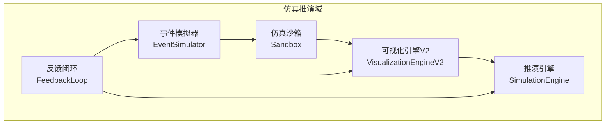
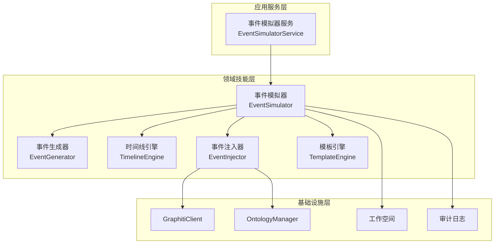
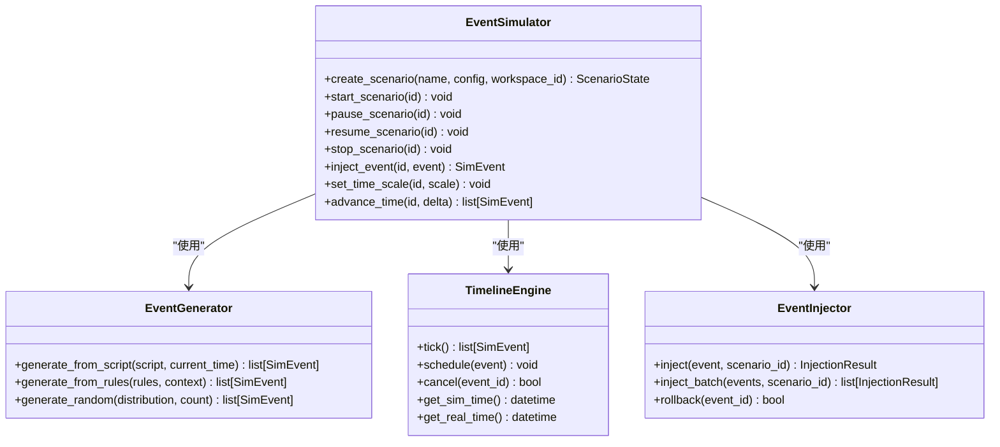
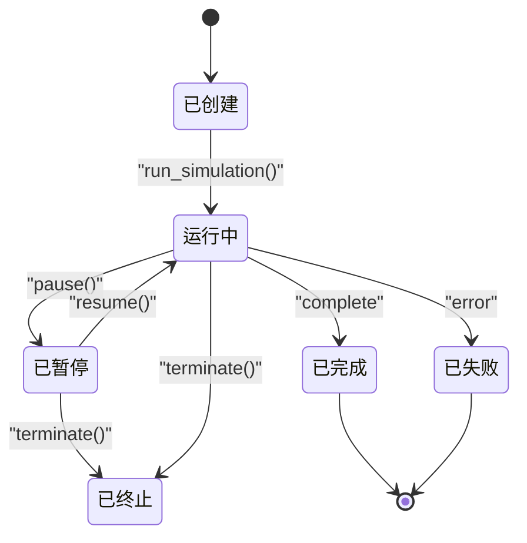
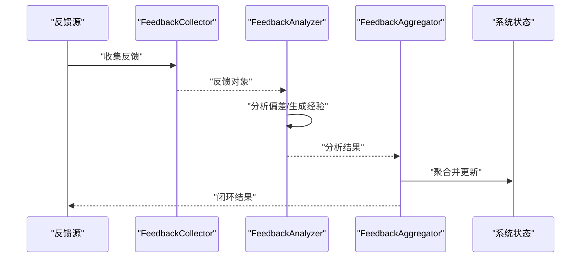
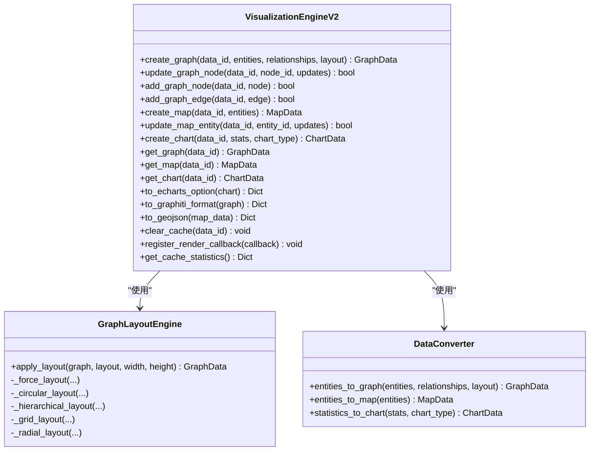
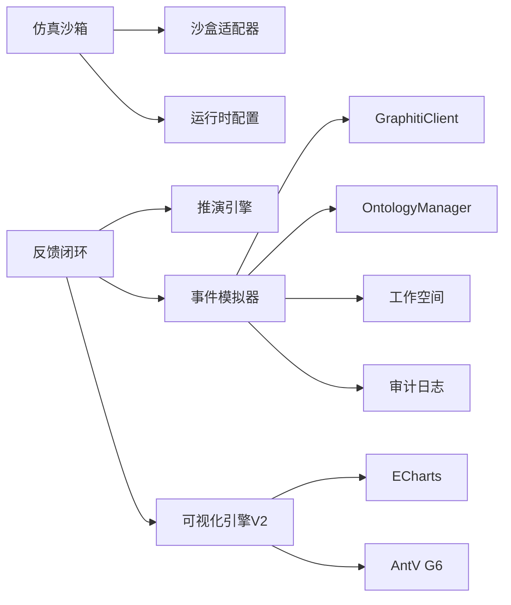

# 仿真推演模块

<cite>
**本文引用的文件**
- [仿真模块设计文档](file://docs/03-modules/simulator/DESIGN.md)
- [事件模拟器模块设计文档](file://docs/03-modules/event_simulator/DESIGN.md)
- [可视化模块设计文档](file://docs/03-modules/visualization/DESIGN.md)
- [仿真沙箱初始化](file://odap/biz/simulation/__init__.py)
- [反馈闭环主类](file://odap/biz/simulation/feedback/loop.py)
- [可视化引擎V2](file://odap/biz/simulation/visualization/visualization_engine.py)
- [单元测试：可视化引擎](file://tests/unit/test_visualization.py)
- [单元测试：反馈闭环](file://tests/unit/test_feedback.py)
- [前端API：模拟沙盒](file://frontend/src/modules/shared/services/api.ts)
- [OpenHarness沙盒适配器测试](file://openharness/tests/test_sandbox/test_adapter.py)
</cite>

## 目录
1. [引言](#引言)
2. [项目结构](#项目结构)
3. [核心组件](#核心组件)
4. [架构总览](#架构总览)
5. [详细组件分析](#详细组件分析)
6. [依赖关系分析](#依赖关系分析)
7. [性能考量](#性能考量)
8. [故障排查指南](#故障排查指南)
9. [结论](#结论)
10. [附录](#附录)

## 引言
本文件面向仿真推演模块，系统化阐述事件模拟器、仿真沙箱、反馈闭环与可视化系统的设计与实现要点，并给出场景设计模式、参数调优与结果分析方法，帮助读者快速理解并高效使用该模块。

## 项目结构
仿真推演模块由“事件模拟器 + 仿真沙箱 + 反馈闭环 + 可视化系统 + 推演引擎”构成，各组件通过清晰的接口与数据契约协同工作，形成“事件驱动—沙箱执行—闭环反馈—可视化呈现”的完整链路。

**图表来源**
- [事件模拟器模块设计文档:28-43](file://docs/03-modules/event_simulator/DESIGN.md#L28-L43)
- [仿真模块设计文档:28-56](file://docs/03-modules/simulator/DESIGN.md#L28-L56)
- [可视化模块设计文档:1-20](file://docs/03-modules/visualization/DESIGN.md#L1-L20)

**章节来源**
- [仿真模块设计文档:9-56](file://docs/03-modules/simulator/DESIGN.md#L9-L56)
- [事件模拟器模块设计文档:28-43](file://docs/03-modules/event_simulator/DESIGN.md#L28-L43)
- [可视化模块设计文档:1-20](file://docs/03-modules/visualization/DESIGN.md#L1-L20)

## 核心组件
- 事件模拟器：负责场景驱动的事件生成、时间线调度与注入，支撑推演的动态输入。
- 仿真沙箱：提供隔离的执行环境，承载推演过程的状态与资源，支持创建/运行/暂停/终止等生命周期管理。
- 反馈闭环：收集来自推演、事件与可视化等环节的反馈，进行偏差分析与经验沉淀，驱动持续优化。
- 可视化系统：提供图谱、地图、图表与实时推演看板，支持多维度态势呈现与交互控制。

**章节来源**
- [仿真模块设计文档:13-17](file://docs/03-modules/simulator/DESIGN.md#L13-L17)
- [事件模拟器模块设计文档:10-25](file://docs/03-modules/event_simulator/DESIGN.md#L10-L25)
- [可视化模块设计文档:9-19](file://docs/03-modules/visualization/DESIGN.md#L9-L19)

## 架构总览
下图展示了仿真推演模块的分层与交互关系，以及与外部模块的集成点。

**图表来源**
- [事件模拟器模块设计文档:28-43](file://docs/03-modules/event_simulator/DESIGN.md#L28-L43)
- [事件模拟器模块设计文档:177-267](file://docs/03-modules/event_simulator/DESIGN.md#L177-L267)
- [事件模拟器模块设计文档:484-509](file://docs/03-modules/event_simulator/DESIGN.md#L484-L509)

**章节来源**
- [事件模拟器模块设计文档:28-548](file://docs/03-modules/event_simulator/DESIGN.md#L28-L548)

## 详细组件分析

### 事件模拟器
- 职责边界
  - 场景的创建/销毁/控制（启动/暂停/恢复/停止）
  - 事件流的调度（自动/手动/触发器）
  - 模拟时钟管理与时间缩放
  - 事件注入到知识图谱并通知后续处理
- 核心数据模型
  - 模拟事件、事件类型、事件效果、事件模板、事件触发器、场景配置与运行时状态
- 事件生成策略
  - 剧本驱动：按时间推进的预定义事件序列
  - 规则驱动：基于当前态势的规则推断
  - 随机生成：基于概率分布的随机事件
  - 触发器驱动：条件满足时触发
- 非功能性设计
  - 事件生成吞吐 > 100 events/s
  - 注入延迟 < 100ms/event
  - 时间精度：毫秒级
  - 最大时间缩放：100x
  - 并发场景 > 10
  - 注入可回滚（事务性写入 + Episode 记录）

**图表来源**
- [事件模拟器模块设计文档:177-267](file://docs/03-modules/event_simulator/DESIGN.md#L177-L267)
- [事件模拟器模块设计文档:269-322](file://docs/03-modules/event_simulator/DESIGN.md#L269-L322)
- [事件模拟器模块设计文档:324-368](file://docs/03-modules/event_simulator/DESIGN.md#L324-L368)
- [事件模拟器模块设计文档:370-415](file://docs/03-modules/event_simulator/DESIGN.md#L370-L415)

**章节来源**
- [事件模拟器模块设计文档:10-25](file://docs/03-modules/event_simulator/DESIGN.md#L10-L25)
- [事件模拟器模块设计文档:177-415](file://docs/03-modules/event_simulator/DESIGN.md#L177-L415)
- [事件模拟器模块设计文档:513-523](file://docs/03-modules/event_simulator/DESIGN.md#L513-L523)

### 仿真沙箱
- 生命周期与状态机
  - CREATED → RUNNING → PAUSED → COMPLETED 或 FAILED；支持终止 TERMINATED
- 核心接口
  - 创建/运行/暂停/恢复/终止沙箱
  - 查询活跃沙箱状态
- 安全隔离与执行环境
  - 通过沙盒运行时配置实现网络与文件系统访问控制
  - 适配器负责命令包装与可用性检测
- 与前端集成
  - 提供 What-if 模拟与对比 API

**图表来源**
- [仿真模块设计文档:58-87](file://docs/03-modules/simulator/DESIGN.md#L58-L87)

**章节来源**
- [仿真模块设计文档:13-17](file://docs/03-modules/simulator/DESIGN.md#L13-L17)
- [仿真模块设计文档:93-135](file://docs/03-modules/simulator/DESIGN.md#L93-L135)
- [仿真模块设计文档:161-178](file://docs/03-modules/simulator/DESIGN.md#L161-L178)
- [OpenHarness沙盒适配器测试:23-37](file://openharness/tests/test_sandbox/test_adapter.py#L23-L37)

### 反馈闭环
- 组件分工
  - FeedbackCollector：采集各类反馈（动作结果、决策反馈、偏差、经验教训等）
  - FeedbackAnalyzer：分析偏差、生成经验教训
  - FeedbackAggregator：聚合并更新系统状态
- 典型流程
  - close_loop(feedback) → 分析 → 生成经验 → 聚合更新 → 返回结果
- 历史查询
  - get_feedback_history(source_id) 返回历史反馈集合

**图表来源**
- [反馈闭环主类:12-30](file://odap/biz/simulation/feedback/loop.py#L12-L30)

**章节来源**
- [反馈闭环主类:12-45](file://odap/biz/simulation/feedback/loop.py#L12-L45)
- [单元测试：反馈闭环:430-464](file://tests/unit/test_feedback.py#L430-L464)

### 可视化系统
- 可视化类型
  - 领域地图、知识图谱、时间线、图表（柱状/折线/饼/散点/仪表/矩形树图）
- 引擎能力
  - 图布局算法（力导向/环形/层次/网格/径向）
  - 数据转换器（实体→图/地图/图表）
  - 缓存与并发安全（线程锁）
- 实时推演
  - WebSocket 推送更新，支持实体移动动画、指标更新、状态变更等
- Web 界面集成
  - 提供 Dashboard 布局与交互控件（播放/暂停/速度控制等）

**图表来源**
- [可视化引擎V2:378-589](file://odap/biz/simulation/visualization/visualization_engine.py#L378-L589)

**章节来源**
- [可视化模块设计文档:11-19](file://docs/03-modules/visualization/DESIGN.md#L11-L19)
- [可视化模块设计文档:252-525](file://docs/03-modules/visualization/DESIGN.md#L252-L525)
- [可视化引擎V2:29-589](file://odap/biz/simulation/visualization/visualization_engine.py#L29-L589)
- [单元测试：可视化引擎:26-205](file://tests/unit/test_visualization.py#L26-L205)

## 依赖关系分析
- 事件模拟器依赖知识图谱写入与本体管理，确保注入的合法性与一致性
- 仿真沙箱通过适配器实现安全隔离与跨平台支持
- 反馈闭环贯穿事件、推演与可视化，形成闭环优化
- 可视化引擎提供统一的数据转换与渲染能力，支持多种图表与地图

**图表来源**
- [事件模拟器模块设计文档:484-509](file://docs/03-modules/event_simulator/DESIGN.md#L484-L509)
- [OpenHarness沙盒适配器测试:23-37](file://openharness/tests/test_sandbox/test_adapter.py#L23-L37)
- [可视化模块设计文档:13-19](file://docs/03-modules/visualization/DESIGN.md#L13-L19)

**章节来源**
- [事件模拟器模块设计文档:484-509](file://docs/03-modules/event_simulator/DESIGN.md#L484-L509)
- [OpenHarness沙盒适配器测试:40-43](file://openharness/tests/test_sandbox/test_adapter.py#L40-L43)

## 性能考量
- 事件生成与注入
  - 使用批量生成与异步队列提升吞吐
  - 批量写入 Graphiti 降低注入延迟
- 时间控制
  - 高精度模拟时钟与事件预生成缓冲，支持最大 100x 时间缩放
- 可视化渲染
  - 图布局算法与缓存机制减少重复计算
  - WebSocket 实时推送，结合前端动画与指标仪表
- 并发与隔离
  - 每场景独立 TimelineEngine，支持并发场景 > 10
  - 沙盒运行时配置限制网络与文件系统访问，保障安全

[本节为通用指导，无需列出具体文件来源]

## 故障排查指南
- 事件注入失败
  - 检查事件效果是否符合本体约束
  - 查看注入结果中的错误信息与触发的后续事件
- 沙箱不可用或平台不支持
  - 检查沙盒可用性与平台支持情况
  - 核对运行时配置映射（网络/文件系统权限）
- 反馈闭环异常
  - 通过 get_feedback_history(source_id) 获取历史反馈，定位问题来源
  - 关注偏差分析与经验生成阶段的日志输出
- 可视化渲染异常
  - 使用 get_cache_statistics() 检查缓存状态
  - 确认数据转换与 ECharts 配置生成是否正确

**章节来源**
- [事件模拟器模块设计文档:370-415](file://docs/03-modules/event_simulator/DESIGN.md#L370-L415)
- [OpenHarness沙盒适配器测试:40-43](file://openharness/tests/test_sandbox/test_adapter.py#L40-L43)
- [反馈闭环主类:32-34](file://odap/biz/simulation/feedback/loop.py#L32-L34)
- [可视化引擎V2:553-577](file://odap/biz/simulation/visualization/visualization_engine.py#L553-L577)

## 结论
仿真推演模块以事件模拟器为前端、以仿真沙箱为执行载体、以反馈闭环为优化动力、以可视化系统为呈现手段，形成了高并发、强隔离、可扩展的推演体系。通过明确的接口契约与数据模型，模块能够稳定支撑复杂场景的动态推演与持续优化。

[本节为总结性内容，无需列出具体文件来源]

## 附录

### 场景设计模式与参数调优
- 场景设计模式
  - 剧本驱动：适用于有明确时间线与流程的推演
  - 规则驱动：适用于需要根据态势动态生成事件的场景
  - 随机驱动：适用于探索不确定性与脆弱性分析
  - 触发器驱动：适用于条件满足时的自动化事件生成
- 参数调优建议
  - 时间缩放：根据推演节奏与观察需求设置，注意最大缩放限制
  - 事件密度：平衡事件生成吞吐与系统负载
  - 图布局：大规模图谱优先考虑力导向或层次布局
  - 缓存策略：合理清理缓存，避免内存膨胀

[本节为通用指导，无需列出具体文件来源]

### 结果分析方法
- 指标计算
  - 总事件数、最终指标、收敛得分、执行效率等
- 版本对比
  - 对比不同版本参数差异与结果差异，识别关键变量
- What-if 分析
  - 改变参数，观察指标变化，生成敏感性分析与推荐方案

**章节来源**
- [仿真模块设计文档:284-328](file://docs/03-modules/simulator/DESIGN.md#L284-L328)