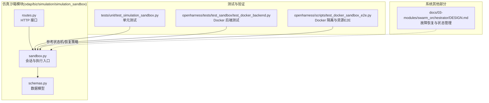
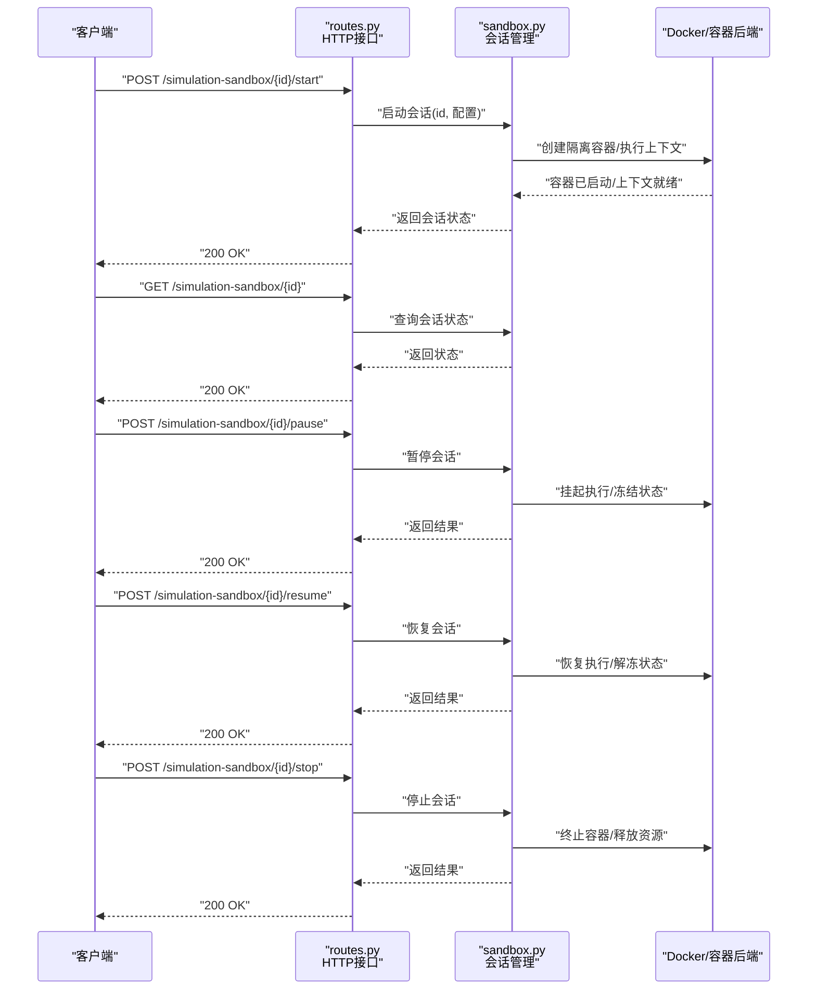
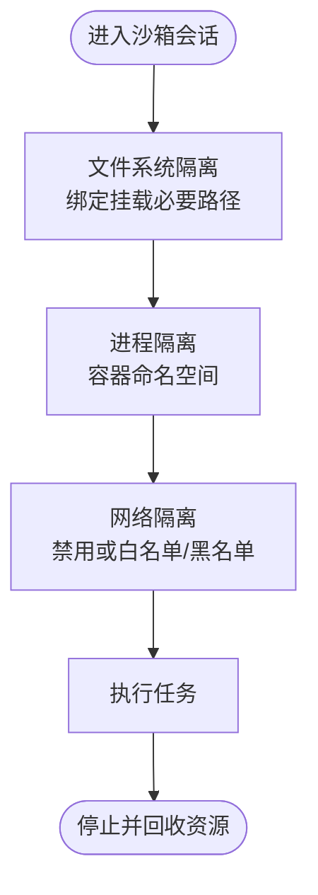
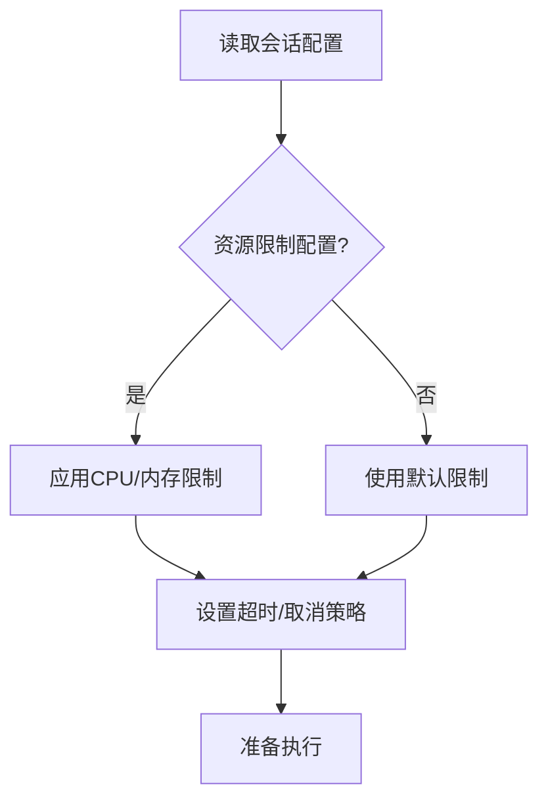
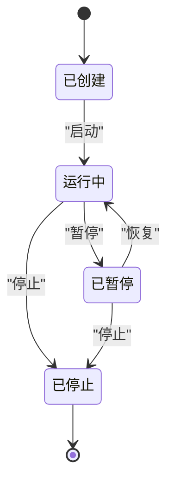
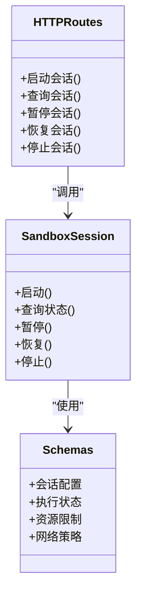
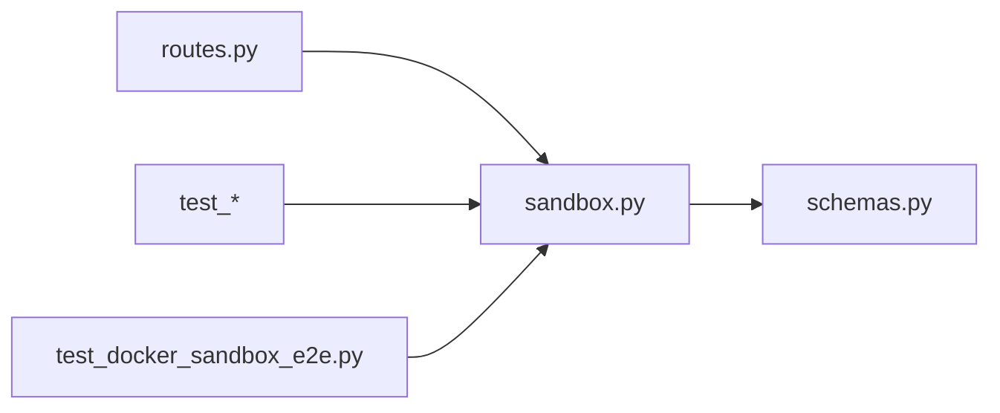

# 仿真沙箱

<cite>
**本文引用的文件**   
- [sandbox.py](file://odap/biz/simulation/simulation_sandbox/sandbox.py)
- [routes.py](file://odap/biz/simulation/simulation_sandbox/routes.py)
- [schemas.py](file://odap/biz/simulation/simulation_sandbox/schemas.py)
- [test_simulation_sandbox.py](file://tests/unit/test_simulation_sandbox.py)
- [test_docker_backend.py](file://openharness/tests/test_sandbox/test_docker_backend.py)
- [test_docker_sandbox_e2e.py](file://openharness/scripts/test_docker_sandbox_e2e.py)
- [DESIGN.md](file://docs/03-modules/swarm_orchestrator/DESIGN.md)
</cite>

## 目录
1. [简介](#简介)
2. [项目结构](#项目结构)
3. [核心组件](#核心组件)
4. [架构总览](#架构总览)
5. [详细组件分析](#详细组件分析)
6. [依赖关系分析](#依赖关系分析)
7. [性能考量](#性能考量)
8. [故障排查指南](#故障排查指南)
9. [结论](#结论)
10. [附录](#附录)

## 简介
本文件面向“仿真沙箱”组件，系统化阐述其在本项目中的安全隔离机制、执行环境配置与管理、生命周期管理、与主系统的交互接口，以及最佳实践与常见问题排查。仿真沙箱用于在受控环境中执行推演任务，确保进程、网络与文件系统层面的隔离，并通过资源限制、超时控制与内存管理保障系统稳定性。

## 项目结构
仿真沙箱位于后端业务模块 odap 的 simulation 子域下，核心由会话管理、路由与数据模型组成；同时在测试与脚本中提供了 Docker 后端的隔离与资源限制验证。

**图示来源**
- [sandbox.py](file://odap/biz/simulation/simulation_sandbox/sandbox.py)
- [routes.py](file://odap/biz/simulation/simulation_sandbox/routes.py)
- [schemas.py](file://odap/biz/simulation/simulation_sandbox/schemas.py)
- [test_simulation_sandbox.py](file://tests/unit/test_simulation_sandbox.py)
- [test_docker_backend.py](file://openharness/tests/test_sandbox/test_docker_backend.py)
- [test_docker_sandbox_e2e.py](file://openharness/scripts/test_docker_sandbox_e2e.py)
- [DESIGN.md](file://docs/03-modules/swarm_orchestrator/DESIGN.md)

**章节来源**
- [sandbox.py](file://odap/biz/simulation/simulation_sandbox/sandbox.py)
- [routes.py](file://odap/biz/simulation/simulation_sandbox/routes.py)
- [schemas.py](file://odap/biz/simulation/simulation_sandbox/schemas.py)
- [test_simulation_sandbox.py](file://tests/unit/test_simulation_sandbox.py)
- [test_docker_backend.py](file://openharness/tests/test_sandbox/test_docker_backend.py)
- [test_docker_sandbox_e2e.py](file://openharness/scripts/test_docker_sandbox_e2e.py)
- [DESIGN.md](file://docs/03-modules/swarm_orchestrator/DESIGN.md)

## 核心组件
- 会话与执行入口：负责启动、运行、暂停、恢复、销毁沙箱会话，协调资源限制与隔离策略。
- HTTP 接口：提供会话生命周期管理、状态查询、取消与恢复等 REST 接口。
- 数据模型：定义会话、执行状态、资源限制、网络策略等结构化数据。
- 测试与验证：覆盖 Docker 后端的文件系统隔离、网络隔离、资源限制等关键能力。

**章节来源**
- [sandbox.py](file://odap/biz/simulation/simulation_sandbox/sandbox.py)
- [routes.py](file://odap/biz/simulation/simulation_sandbox/routes.py)
- [schemas.py](file://odap/biz/simulation/simulation_sandbox/schemas.py)
- [test_docker_backend.py](file://openharness/tests/test_sandbox/test_docker_backend.py)
- [test_docker_sandbox_e2e.py](file://openharness/scripts/test_docker_sandbox_e2e.py)

## 架构总览
仿真沙箱以“会话”为中心，对外暴露 HTTP 接口，内部通过后端适配器（如 Docker）实现隔离与资源约束。会话状态与生命周期通过统一的状态机管理，结合故障恢复策略与健康监控，确保在复杂场景下的稳定运行。

**图示来源**
- [routes.py](file://odap/biz/simulation/simulation_sandbox/routes.py)
- [sandbox.py](file://odap/biz/simulation/simulation_sandbox/sandbox.py)

## 详细组件分析

### 安全隔离机制
- 进程隔离：通过容器后端（Docker）实现进程级隔离，每个会话在独立命名空间内运行，避免相互干扰。
- 文件系统隔离：仅绑定必要的工作目录与输入输出路径，限制对宿主机文件系统的访问；测试覆盖了绑定挂载的可读性与写入性。
- 网络隔离：默认禁用网络或按策略白名单/黑名单域名访问；测试验证了网络设置与域名过滤行为。

**图示来源**
- [test_docker_sandbox_e2e.py](file://openharness/scripts/test_docker_sandbox_e2e.py)
- [test_docker_backend.py](file://openharness/tests/test_sandbox/test_docker_backend.py)

**章节来源**
- [test_docker_sandbox_e2e.py](file://openharness/scripts/test_docker_sandbox_e2e.py)
- [test_docker_backend.py](file://openharness/tests/test_sandbox/test_docker_backend.py)

### 执行环境配置与管理
- 资源限制：支持 CPU 限额与内存限额，测试验证了参数传递与容器侧生效情况。
- 超时控制：会话接口提供取消与恢复能力，便于在长时间运行任务中进行中断与续跑。
- 内存管理：通过容器内存上限与垃圾回收策略配合，避免内存泄漏导致的系统不稳定。

**图示来源**
- [test_docker_backend.py](file://openharness/tests/test_sandbox/test_docker_backend.py)
- [routes.py](file://odap/biz/simulation/simulation_sandbox/routes.py)

**章节来源**
- [test_docker_backend.py](file://openharness/tests/test_sandbox/test_docker_backend.py)
- [routes.py](file://odap/biz/simulation/simulation_sandbox/routes.py)

### 生命周期管理
- 启动：初始化会话，创建隔离执行环境，加载必要资源。
- 运行：执行任务，持续监控状态与资源消耗。
- 暂停：冻结执行上下文，保留状态以便后续恢复。
- 恢复：从冻结状态继续执行，保证任务连续性。
- 销毁：终止执行环境，回收所有资源，清理临时文件。

**图示来源**
- [routes.py](file://odap/biz/simulation/simulation_sandbox/routes.py)
- [sandbox.py](file://odap/biz/simulation/simulation_sandbox/sandbox.py)

**章节来源**
- [routes.py](file://odap/biz/simulation/simulation_sandbox/routes.py)
- [sandbox.py](file://odap/biz/simulation/simulation_sandbox/sandbox.py)

### 与主系统的交互接口
- HTTP 接口：提供会话的启动、查询、暂停、恢复、停止等 REST API，便于前端与外部系统编排。
- 数据交换：通过统一的请求/响应模型（数据结构定义于 schemas），确保前后端一致的数据契约。
- 状态同步：接口返回标准化状态码与消息，便于前端与自动化流程进行状态同步。
- 事件通知：可结合 WebSocket 或轮询机制实现事件推送（具体实现参考前端与网关模块）。

**图示来源**
- [routes.py](file://odap/biz/simulation/simulation_sandbox/routes.py)
- [sandbox.py](file://odap/biz/simulation/simulation_sandbox/sandbox.py)
- [schemas.py](file://odap/biz/simulation/simulation_sandbox/schemas.py)

**章节来源**
- [routes.py](file://odap/biz/simulation/simulation_sandbox/routes.py)
- [sandbox.py](file://odap/biz/simulation/simulation_sandbox/sandbox.py)
- [schemas.py](file://odap/biz/simulation/simulation_sandbox/schemas.py)

### 最佳实践
- 安全配置
  - 明确最小权限原则：仅绑定必要路径，避免映射宿主机根目录。
  - 网络策略：默认禁用网络，按需开放白名单域名；避免全网访问。
- 性能调优
  - 合理设置 CPU/内存上限，避免资源争抢；根据任务特征动态调整。
  - 使用分阶段执行与检查点机制，提升长时间任务的鲁棒性。
- 故障恢复
  - 结合断路器与降级策略，当外部依赖异常时快速切换至降级模式。
  - 对关键会话启用自动重启与状态持久化，降低人工干预成本。

**章节来源**
- [DESIGN.md](file://docs/03-modules/swarm_orchestrator/DESIGN.md)

## 依赖关系分析
- 模块内聚：会话管理、接口路由、数据模型三者职责清晰，耦合度低，便于独立演进与测试。
- 外部依赖：Docker 后端作为隔离与资源限制的基础设施；测试脚本与单元测试共同覆盖隔离与资源限制的关键路径。
- 循环依赖：无明显循环依赖迹象；接口层仅依赖会话层，会话层不反向依赖接口层。

**图示来源**
- [routes.py](file://odap/biz/simulation/simulation_sandbox/routes.py)
- [sandbox.py](file://odap/biz/simulation/simulation_sandbox/sandbox.py)
- [schemas.py](file://odap/biz/simulation/simulation_sandbox/schemas.py)
- [test_simulation_sandbox.py](file://tests/unit/test_simulation_sandbox.py)
- [test_docker_sandbox_e2e.py](file://openharness/scripts/test_docker_sandbox_e2e.py)

**章节来源**
- [routes.py](file://odap/biz/simulation/simulation_sandbox/routes.py)
- [sandbox.py](file://odap/biz/simulation/simulation_sandbox/sandbox.py)
- [schemas.py](file://odap/biz/simulation/simulation_sandbox/schemas.py)
- [test_simulation_sandbox.py](file://tests/unit/test_simulation_sandbox.py)
- [test_docker_sandbox_e2e.py](file://openharness/scripts/test_docker_sandbox_e2e.py)

## 性能考量
- 资源限制直接影响吞吐与延迟：CPU/内存上限过低会导致频繁节流，过高则可能影响其他会话稳定性。
- I/O 与网络：文件系统绑定与网络策略会影响 I/O 延迟与连接成功率，建议在测试环境充分验证。
- 监控与告警：结合健康监控与断路器策略，及时发现并处理性能退化。

[本节为通用指导，无需特定文件来源]

## 故障排查指南
- 文件系统隔离问题
  - 症状：容器内无法读取/写入绑定路径。
  - 排查：确认挂载路径存在且权限正确；检查绑定挂载策略是否符合预期。
  - 参考：文件系统隔离测试用例。
- 网络隔离问题
  - 症状：容器无法访问指定域名或完全无网络。
  - 排查：核对网络策略配置；验证白名单/黑名单规则是否生效。
  - 参考：网络隔离与域名过滤测试。
- 资源限制问题
  - 症状：任务频繁被限速或 OOM。
  - 排查：检查 CPU/内存限额设置；观察容器侧指标是否达到上限。
  - 参考：资源限制应用测试。
- 会话生命周期异常
  - 症状：暂停/恢复后状态不一致。
  - 排查：确认会话状态机转换逻辑；检查冻结/解冻过程中的数据一致性。
  - 参考：会话接口与状态模型。

**章节来源**
- [test_docker_sandbox_e2e.py](file://openharness/scripts/test_docker_sandbox_e2e.py)
- [test_docker_backend.py](file://openharness/tests/test_sandbox/test_docker_backend.py)
- [routes.py](file://odap/biz/simulation/simulation_sandbox/routes.py)
- [sandbox.py](file://odap/biz/simulation/simulation_sandbox/sandbox.py)

## 结论
仿真沙箱通过容器化隔离与严格的资源限制，实现了安全可控的推演执行环境。结合完善的生命周期管理与故障恢复策略，能够在复杂场景下保持高可用与高性能。建议在生产环境中持续完善监控与告警体系，并基于实际负载不断优化资源配额与网络策略。

[本节为总结性内容，无需特定文件来源]

## 附录
- 关键接口与数据模型请参考模块内的 routes 与 schemas 文件。
- Docker 后端的隔离与资源限制验证请参考测试脚本与单元测试。

**章节来源**
- [routes.py](file://odap/biz/simulation/simulation_sandbox/routes.py)
- [schemas.py](file://odap/biz/simulation/simulation_sandbox/schemas.py)
- [test_docker_backend.py](file://openharness/tests/test_sandbox/test_docker_backend.py)
- [test_docker_sandbox_e2e.py](file://openharness/scripts/test_docker_sandbox_e2e.py)