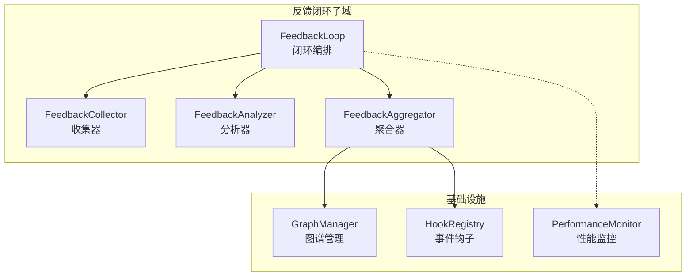
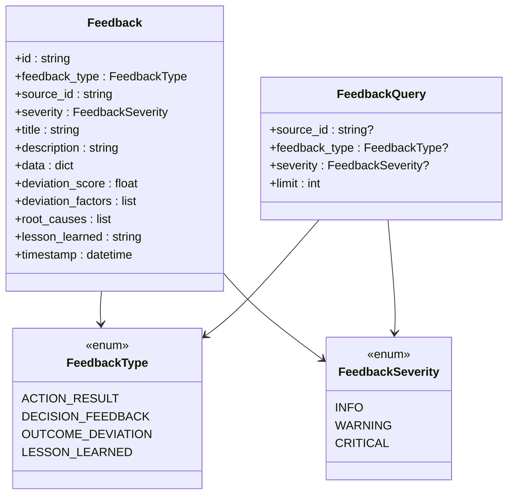
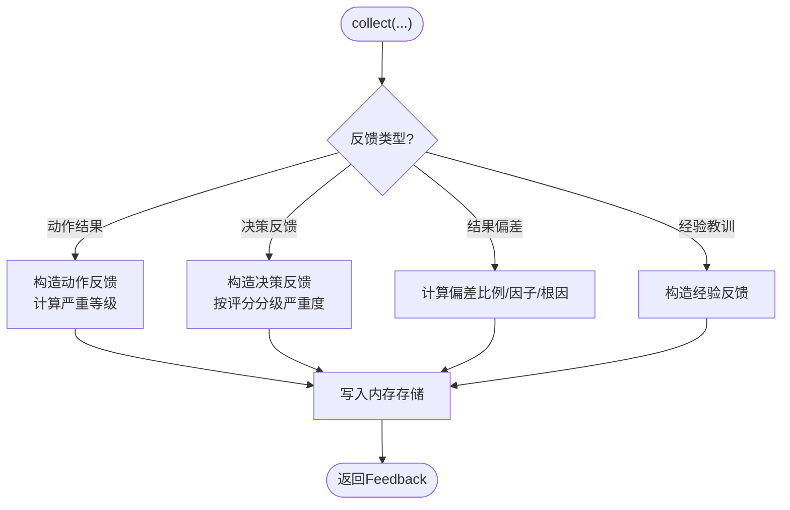
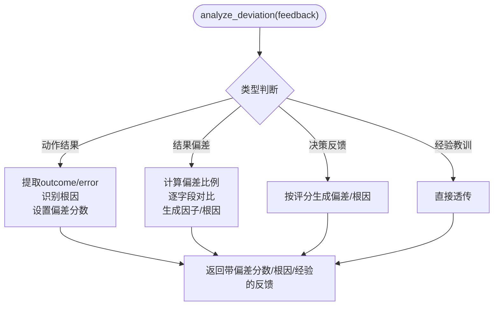
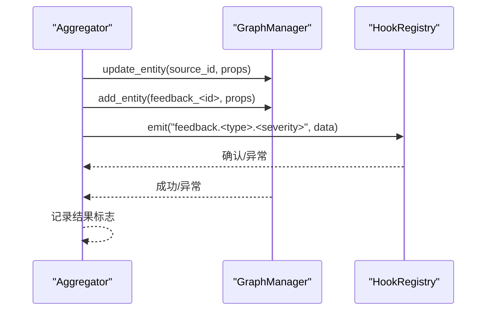
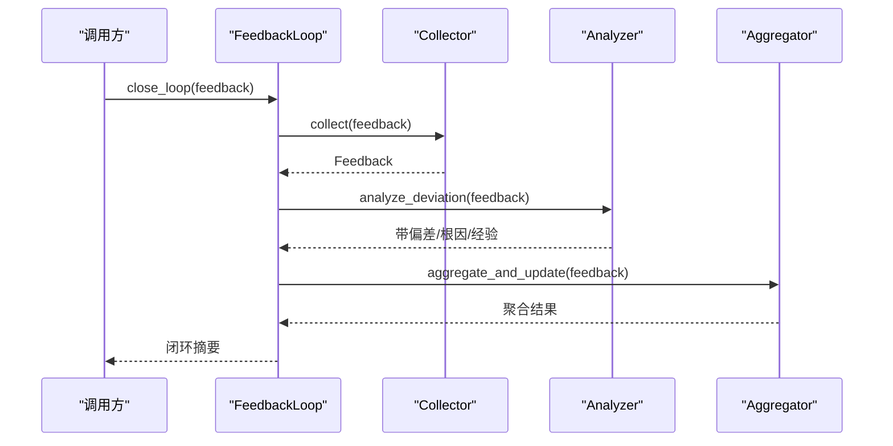
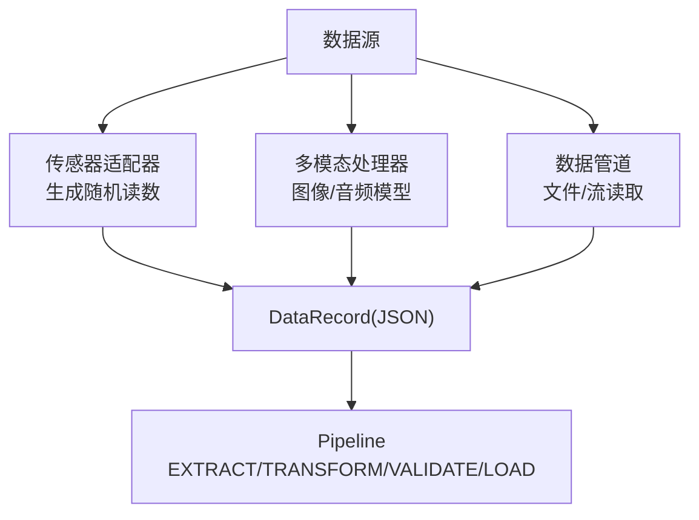
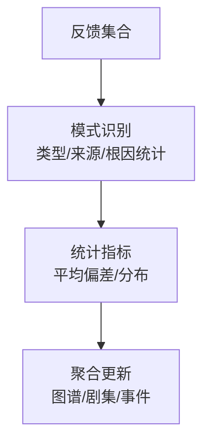
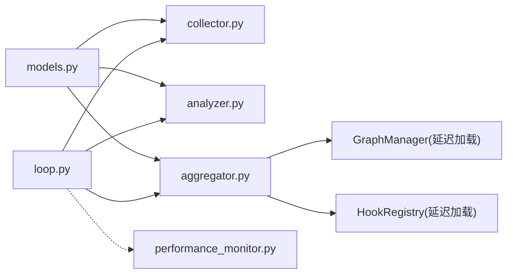

# 反馈闭环

<cite>
**本文引用的文件**
- [反馈闭环主类](file://odap/biz/simulation/feedback/loop.py)
- [反馈收集器](file://odap/biz/simulation/feedback/collector.py)
- [反馈分析器](file://odap/biz/simulation/feedback/analyzer.py)
- [反馈聚合器](file://odap/biz/simulation/feedback/aggregator.py)
- [反馈数据模型](file://odap/biz/simulation/feedback/models.py)
- [单元测试-反馈闭环](file://tests/unit/test_feedback.py)
- [性能监控器](file://odap/infra/monitoring/performance_monitor.py)
- [数据管道-传感器适配器](file://odap/infra/data_pipeline/adapters/sensor_adapter.py)
- [数据管道-多模态处理器](file://odap/infra/data_pipeline/multimodal_processor.py)
- [数据管道-统一接入](file://odap/infra/data_pipeline.py)
- [架构-反馈分析聚合引擎](file://docs/02-architecture/ARCHITECTURE_FULL_CHAIN_DEEP.md)
- [架构-业务模块](file://docs/02-architecture/ARCHITECTURE_BIZ.md)
- [健康监控-Swarm编排器](file://docs/03-modules/swarm_orchestrator/DESIGN.md)
- [Hook系统-执行监控](file://tests/unit/test_hook_system.py)
</cite>

## 目录
1. [简介](#简介)
2. [项目结构](#项目结构)
3. [核心组件](#核心组件)
4. [架构总览](#架构总览)
5. [详细组件分析](#详细组件分析)
6. [依赖关系分析](#依赖关系分析)
7. [性能考量](#性能考量)
8. [故障排查指南](#故障排查指南)
9. [结论](#结论)
10. [附录](#附录)

## 简介
本文件面向“反馈闭环系统”的技术文档，聚焦于反馈数据的采集、分析、聚合与闭环执行。内容涵盖：
- 反馈数据采集机制：传感器数据、日志数据、用户输入的收集策略
- 数据分析算法：统计分析、偏差识别、根因定位、经验提炼
- 数据聚合实现：知识图谱更新、事件钩子、反馈剧集创建
- 反馈循环执行逻辑：数据流、处理顺序、依赖关系
- 配置选项与调优参数：监控、阈值、权重、窗口
- 性能监控与质量保证：指标体系、告警策略、健康检查

## 项目结构
反馈闭环系统位于 odap 子域的 simulation/feedback 目录下，围绕 FeedbackLoop 主类协调 Collector、Analyzer、Aggregator 三件套，并与基础设施层的图谱服务、事件钩子、性能监控等模块协作。



**图表来源**
- [反馈闭环主类:12-34](file://odap/biz/simulation/feedback/loop.py#L12-L34)
- [反馈收集器:9-36](file://odap/biz/simulation/feedback/collector.py#L9-L36)
- [反馈分析器:9-19](file://odap/biz/simulation/feedback/analyzer.py#L9-L19)
- [反馈聚合器:9-62](file://odap/biz/simulation/feedback/aggregator.py#L9-L62)
- [性能监控器:12-61](file://odap/infra/monitoring/performance_monitor.py#L12-L61)

**章节来源**
- [反馈闭环主类:12-34](file://odap/biz/simulation/feedback/loop.py#L12-L34)
- [反馈收集器:9-36](file://odap/biz/simulation/feedback/collector.py#L9-L36)
- [反馈分析器:9-19](file://odap/biz/simulation/feedback/analyzer.py#L9-L19)
- [反馈聚合器:9-62](file://odap/biz/simulation/feedback/aggregator.py#L9-L62)

## 核心组件
- 反馈数据模型：定义反馈类型、严重等级、偏差因子、根因、学习经验等字段，支撑后续分析与聚合。
- 反馈收集器：统一收集动作结果、决策反馈、结果偏差、经验教训等，支持查询与历史检索。
- 反馈分析器：对不同类型的反馈进行偏差量化、根因归类、模式识别、经验生成。
- 反馈聚合器：将分析结果写入知识图谱、创建反馈剧集、触发事件钩子，形成闭环闭环证据链。
- 反馈闭环主类：编排收集-分析-聚合-输出的完整流程，提供历史查询能力。

**章节来源**
- [反馈数据模型:8-41](file://odap/biz/simulation/feedback/models.py#L8-L41)
- [反馈收集器:13-128](file://odap/biz/simulation/feedback/collector.py#L13-L128)
- [反馈分析器:10-174](file://odap/biz/simulation/feedback/analyzer.py#L10-L174)
- [反馈聚合器:34-114](file://odap/biz/simulation/feedback/aggregator.py#L34-L114)
- [反馈闭环主类:12-34](file://odap/biz/simulation/feedback/loop.py#L12-L34)

## 架构总览
反馈闭环在系统中的位置如下：上承决策与执行阶段，下接知识图谱与事件系统，中间以分析与聚合为核心，配合性能监控与健康检查保障运行质量。

```mermaid
sequenceDiagram
participant Exec as "执行层"
participant Loop as "FeedbackLoop"
participant Coll as "Collector"
participant Ana as "Analyzer"
participant Agg as "Aggregator"
participant Graph as "GraphManager"
participant Hook as "HookRegistry"
Exec->>Loop : 触发反馈上报
Loop->>Coll : collect(feedback)
Coll-->>Loop : Feedback对象
Loop->>Ana : analyze_deviation(feedback)
Ana-->>Loop : 带偏差分数/根因/经验
Loop->>Agg : aggregate_and_update(feedback)
Agg->>Graph : 更新实体属性/创建反馈实体
Agg->>Hook : emit(feedback.<type>.<severity>)
Agg-->>Loop : 聚合结果
Loop-->>Exec : 输出闭环摘要
```

**图表来源**
- [反馈闭环主类:18-30](file://odap/biz/simulation/feedback/loop.py#L18-L30)
- [反馈收集器:13-100](file://odap/biz/simulation/feedback/collector.py#L13-L100)
- [反馈分析器:10-95](file://odap/biz/simulation/feedback/analyzer.py#L10-L95)
- [反馈聚合器:34-114](file://odap/biz/simulation/feedback/aggregator.py#L34-L114)

## 详细组件分析

### 反馈数据模型
- 反馈类型：动作结果、决策反馈、结果偏差、经验教训
- 严重等级：信息、警告、严重
- 关键字段：偏差分数、偏差因子、根因、学习经验、时间戳
- 查询模型：支持按来源ID、类型、严重等级、上限排序查询



**图表来源**
- [反馈数据模型:8-41](file://odap/biz/simulation/feedback/models.py#L8-L41)

**章节来源**
- [反馈数据模型:8-41](file://odap/biz/simulation/feedback/models.py#L8-L41)

### 反馈收集器
- 功能：收集动作结果、决策反馈、结果偏差、经验教训；支持查询与历史检索
- 策略：根据结果自动判定严重等级；偏差场景计算偏差比例与因子
- 存储：内存字典存储，便于快速查询与聚合



**图表来源**
- [反馈收集器:13-128](file://odap/biz/simulation/feedback/collector.py#L13-L128)

**章节来源**
- [反馈收集器:13-128](file://odap/biz/simulation/feedback/collector.py#L13-L128)

### 反馈分析器
- 功能：对不同反馈类型进行偏差量化、根因归类、模式识别、经验生成
- 算法要点：
  - 动作结果：根据错误关键字识别根因，计算偏差分数
  - 结果偏差：比较期望与实际字段，统计偏差比例与因子
  - 决策反馈：基于评分生成偏差与根因
  - 模式识别：统计类型分布、来源重复、根因频次、平均偏差
  - 经验生成：将分析结果转化为可复用的经验



**图表来源**
- [反馈分析器:10-95](file://odap/biz/simulation/feedback/analyzer.py#L10-L95)

**章节来源**
- [反馈分析器:10-174](file://odap/biz/simulation/feedback/analyzer.py#L10-L174)

### 反馈聚合器
- 功能：将分析结果写入知识图谱、创建反馈剧集、触发事件钩子
- 图谱更新：根据反馈类型更新实体属性（如状态、结果、阶段）
- 剧集创建：新增“Feedback”实体，记录类型、来源、严重度、偏差、根因、经验
- 事件发射：按“feedback.<type>.<severity>”命名发射钩子事件
- 依赖注入：延迟加载图谱管理器与钩子注册表，增强容错



**图表来源**
- [反馈聚合器:34-114](file://odap/biz/simulation/feedback/aggregator.py#L34-L114)

**章节来源**
- [反馈聚合器:34-114](file://odap/biz/simulation/feedback/aggregator.py#L34-L114)

### 反馈闭环主类
- 编排：收集→分析→聚合→输出摘要
- 输出：包含反馈ID、分析结果、图谱更新状态、剧集创建状态、事件发射状态
- 历史查询：按来源ID查询反馈历史，支持限制条数与排序



**图表来源**
- [反馈闭环主类:18-34](file://odap/biz/simulation/feedback/loop.py#L18-L34)

**章节来源**
- [反馈闭环主类:18-34](file://odap/biz/simulation/feedback/loop.py#L18-L34)

### 数据采集与输入
- 传感器数据：通过传感器适配器生成温度、气压、湿度、位置、雷达、声纳等随机读数，统一为 JSON 数据记录
- 多模态数据：多模态处理器支持图像/音频模型优先级与降级回退
- 文件/流数据：数据管道支持多种格式读取、转换、验证与加载，具备阶段状态与错误记录



**图表来源**
- [数据管道-传感器适配器:12-84](file://odap/infra/data_pipeline/adapters/sensor_adapter.py#L12-L84)
- [数据管道-多模态处理器:19-124](file://odap/infra/data_pipeline/multimodal_processor.py#L19-L124)
- [数据管道-统一接入:275-426](file://odap/infra/data_pipeline.py#L275-L426)

**章节来源**
- [数据管道-传感器适配器:12-84](file://odap/infra/data_pipeline/adapters/sensor_adapter.py#L12-L84)
- [数据管道-多模态处理器:19-124](file://odap/infra/data_pipeline/multimodal_processor.py#L19-L124)
- [数据管道-统一接入:275-426](file://odap/infra/data_pipeline.py#L275-L426)

### 数据分析与聚合
- 统计分析：对反馈类型、来源、严重度、根因进行计数与分布统计，计算平均偏差
- 模式识别：识别重复来源、高频根因，辅助制定改进策略
- 聚合更新：将分析结果写入知识图谱，创建反馈实体，触发事件钩子



**图表来源**
- [反馈分析器:101-133](file://odap/biz/simulation/feedback/analyzer.py#L101-L133)
- [反馈聚合器:34-114](file://odap/biz/simulation/feedback/aggregator.py#L34-L114)

**章节来源**
- [反馈分析器:101-133](file://odap/biz/simulation/feedback/analyzer.py#L101-L133)
- [反馈聚合器:34-114](file://odap/biz/simulation/feedback/aggregator.py#L34-L114)

### 执行逻辑与依赖关系
- 顺序：收集→分析→聚合→输出
- 依赖：聚合器依赖图谱管理器与事件钩子；分析器依赖反馈模型；收集器依赖模型与查询
- 容错：聚合器延迟初始化图谱与钩子，失败时记录警告并继续

**章节来源**
- [反馈闭环主类:18-34](file://odap/biz/simulation/feedback/loop.py#L18-L34)
- [反馈聚合器:14-32](file://odap/biz/simulation/feedback/aggregator.py#L14-L32)

## 依赖关系分析



**图表来源**
- [反馈数据模型:8-41](file://odap/biz/simulation/feedback/models.py#L8-L41)
- [反馈收集器:4-5](file://odap/biz/simulation/feedback/collector.py#L4-L5)
- [反馈分析器:4-5](file://odap/biz/simulation/feedback/analyzer.py#L4-L5)
- [反馈聚合器:18-31](file://odap/biz/simulation/feedback/aggregator.py#L18-L31)
- [反馈闭环主类:4-7](file://odap/biz/simulation/feedback/loop.py#L4-L7)
- [性能监控器:12-28](file://odap/infra/monitoring/performance_monitor.py#L12-L28)

**章节来源**
- [反馈数据模型:8-41](file://odap/biz/simulation/feedback/models.py#L8-L41)
- [反馈收集器:4-5](file://odap/biz/simulation/feedback/collector.py#L4-L5)
- [反馈分析器:4-5](file://odap/biz/simulation/feedback/analyzer.py#L4-L5)
- [反馈聚合器:18-31](file://odap/biz/simulation/feedback/aggregator.py#L18-L31)
- [反馈闭环主类:4-7](file://odap/biz/simulation/feedback/loop.py#L4-L7)
- [性能监控器:12-28](file://odap/infra/monitoring/performance_monitor.py#L12-L28)

## 性能考量
- 指标体系：性能监控器提供 LLM 调用、数据库查询、API 请求、工具执行等指标的统计（均值、中位数、P95/P99、最小/最大）
- 装饰器用法：通过 monitor_performance 装饰器自动记录函数执行时延与附加错误信息
- 建议：
  - 为关键路径（分析、聚合、图谱写入）打点
  - 设置阈值告警，结合健康监控与异常检测
  - 对批量聚合进行分批处理，避免阻塞

**章节来源**
- [性能监控器:12-183](file://odap/infra/monitoring/performance_monitor.py#L12-L183)

## 故障排查指南
- 单元测试覆盖：
  - 偏差反馈闭环、经验教训闭环、历史查询等场景
- 健康监控：
  - SwarmOrchestrator 的健康监控包含 Agent 响应时间、故障次数、系统资源、外部依赖、性能指标等
- Hook 系统：
  - 执行监控记录成功/失败/超时/错误，支持阈值告警与回调
- 建议排查步骤：
  - 检查聚合器图谱与钩子初始化是否成功
  - 查看分析器偏差因子与根因是否合理
  - 核对历史查询过滤条件与排序
  - 结合性能监控与健康报告定位瓶颈

**章节来源**
- [单元测试-反馈闭环:430-464](file://tests/unit/test_feedback.py#L430-L464)
- [健康监控-编排器:783-1357](file://docs/03-modules/swarm_orchestrator/DESIGN.md#L783-L1357)
- [Hook系统-执行监控:411-472](file://tests/unit/test_hook_system.py#L411-L472)

## 结论
反馈闭环系统以“收集-分析-聚合-输出”为主线，结合知识图谱与事件钩子形成闭环证据链。通过统计分析与模式识别，系统能够沉淀经验、定位根因、指导改进。建议在生产环境中完善配置与阈值、强化性能监控与健康检查、持续迭代分析算法与聚合策略。

## 附录

### 配置选项与调优参数
- 反馈类型与严重度阈值：用于区分信息/警告/严重，影响后续处理策略
- 偏差阈值：如偏差比例阈值，决定严重等级与告警级别
- 聚合窗口：按来源ID/类型/严重度进行聚合的时间窗口与批大小
- 模式识别参数：根因Top-N、重复来源阈值、平均偏差阈值
- 监控参数：性能监控器的历史记录上限、百分位数、错误记录上限
- 健康监控参数：检查间隔、阈值（CPU/内存/磁盘/响应时间/成功率）

**章节来源**
- [反馈分析器:77-82](file://odap/biz/simulation/feedback/analyzer.py#L77-L82)
- [性能监控器:15-28](file://odap/infra/monitoring/performance_monitor.py#L15-L28)
- [健康监控-编排器:804-1038](file://docs/03-modules/swarm_orchestrator/DESIGN.md#L804-L1038)

### 数据聚合与多维分析
- 时间窗口聚合：按小时/天/周统计 QA 质量、技能性能、本体健康度、用户活跃度
- 空间聚合：按工作区/实体维度汇总更新与影响范围
- 多维度分析：类型分布、来源重复、根因频次、平均偏差、异常告警

**章节来源**
- [架构-反馈分析聚合引擎:4612-5211](file://docs/02-architecture/ARCHITECTURE_FULL_CHAIN_DEEP.md#L4612-L5211)