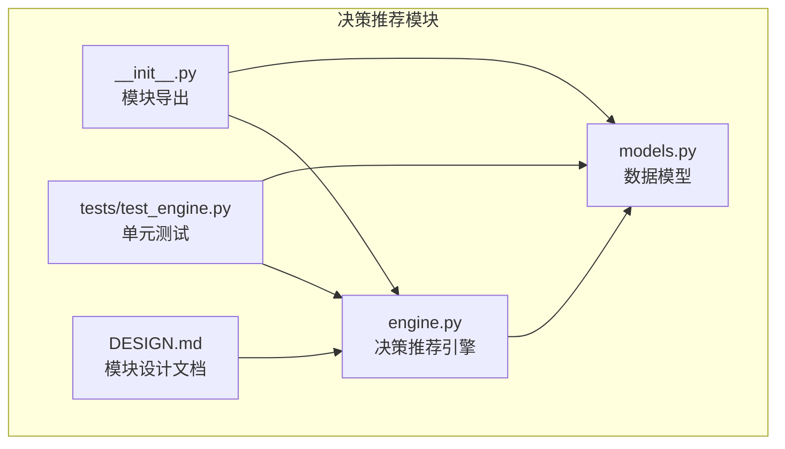
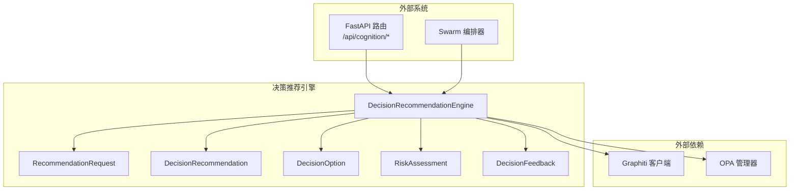
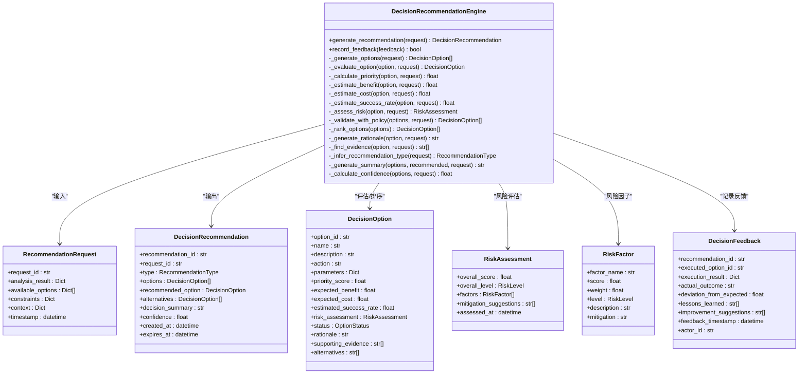
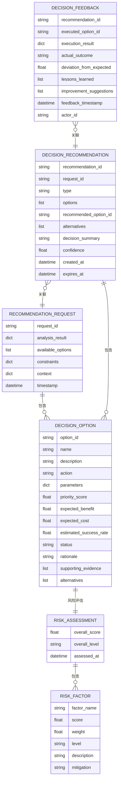
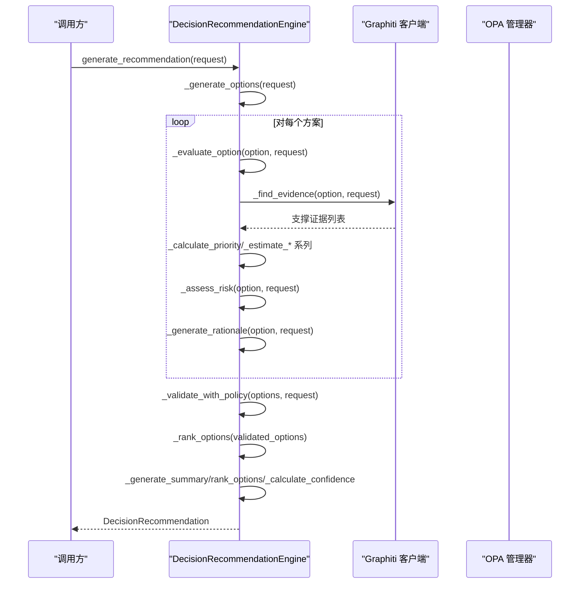
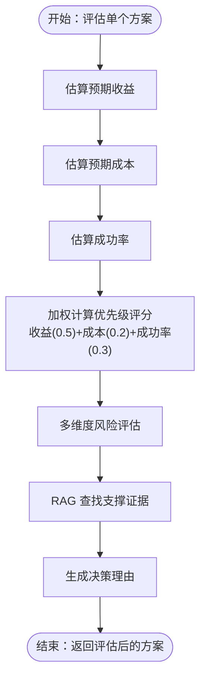
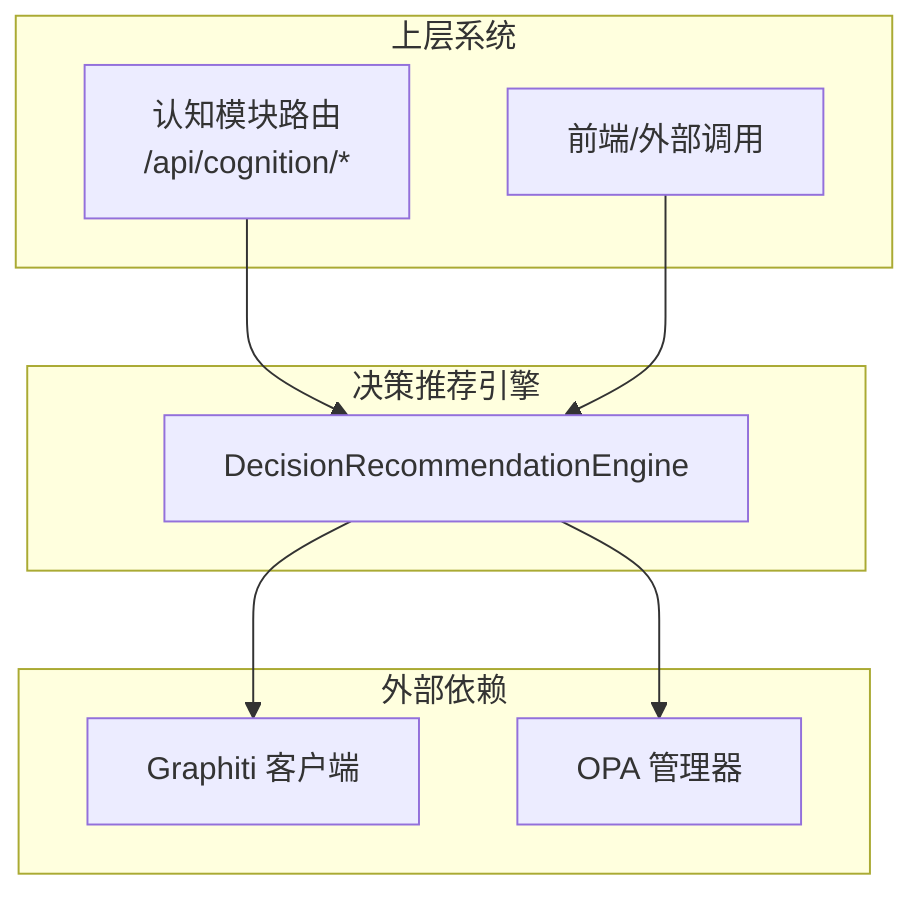
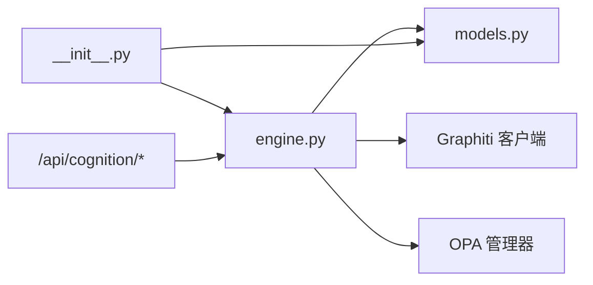

# 决策推荐引擎

<cite>
**本文档引用的文件**
- [engine.py](file://odap/biz/decision/decision_recommendation/engine.py)
- [models.py](file://odap/biz/decision/decision_recommendation/models.py)
- [__init__.py](file://odap/biz/decision/decision_recommendation/__init__.py)
- [test_engine.py](file://odap/biz/decision/decision_recommendation/tests/test_engine.py)
- [DESIGN.md](file://docs/03-modules/decision_recommendation/DESIGN.md)
- [graph_service.py](file://odap/infra/graph/graph_service.py)
- [opa_service.py](file://odap/infra/opa/opa_service.py)
- [routes.py](file://odap/biz/core/cognition/api/routes.py)
</cite>

## 目录
1. [简介](#简介)
2. [项目结构](#项目结构)
3. [核心组件](#核心组件)
4. [架构总览](#架构总览)
5. [详细组件分析](#详细组件分析)
6. [依赖分析](#依赖分析)
7. [性能考量](#性能考量)
8. [故障排查指南](#故障排查指南)
9. [结论](#结论)
10. [附录](#附录)

## 简介
本文件面向“决策推荐引擎”的使用者与维护者，系统性阐述其算法原理、评分机制、权重计算、推荐策略、数据结构、输入输出格式、处理流程与性能特征，并提供可操作的使用示例、与其他模块的集成方式、性能优化建议、错误处理机制与扩展接口说明。该引擎位于 OADP 决策阶段，负责接收理解阶段的分析结果，生成候选方案，评估优先级与风险，进行策略校验，并输出最终推荐结论。

## 项目结构
决策推荐引擎位于 odap/biz/decision/decision_recommendation 目录，核心由以下文件组成：
- engine.py：引擎主实现，包含推荐生成、方案评估、策略校验、排序与摘要生成等逻辑
- models.py：Pydantic 数据模型，定义请求、推荐结果、选项、风险评估、反馈等结构
- __init__.py：导出模块接口
- tests/test_engine.py：单元测试，覆盖关键流程与边界条件
- docs/03-modules/decision_recommendation/DESIGN.md：模块设计文档，包含接口设计、RAG增强、模拟推演集成等内容

**图表来源**
- [engine.py:1-603](file://odap/biz/decision/decision_recommendation/engine.py#L1-L603)
- [models.py:1-244](file://odap/biz/decision/decision_recommendation/models.py#L1-L244)
- [__init__.py:1-35](file://odap/biz/decision/decision_recommendation/__init__.py#L1-L35)
- [test_engine.py:1-309](file://odap/biz/decision/decision_recommendation/tests/test_engine.py#L1-L309)
- [DESIGN.md:1-860](file://docs/03-modules/decision_recommendation/DESIGN.md#L1-L860)

**章节来源**
- [engine.py:1-603](file://odap/biz/decision/decision_recommendation/engine.py#L1-L603)
- [models.py:1-244](file://odap/biz/decision/decision_recommendation/models.py#L1-L244)
- [__init__.py:1-35](file://odap/biz/decision/decision_recommendation/__init__.py#L1-L35)
- [test_engine.py:1-309](file://odap/biz/decision/decision_recommendation/tests/test_engine.py#L1-L309)
- [DESIGN.md:1-860](file://docs/03-modules/decision_recommendation/DESIGN.md#L1-L860)

## 核心组件
- 决策推荐引擎（DecisionRecommendationEngine）：异步主引擎，负责生成候选方案、评估指标、风险评估、策略校验、排序与摘要生成
- 数据模型（RecommendationRequest、DecisionRecommendation、DecisionOption、RiskAssessment、DecisionFeedback 等）：标准化输入输出与中间状态
- 便捷函数（create_recommendation）：简化调用流程，快速生成推荐
- 测试（test_engine.py）：覆盖推荐生成、优先级计算、风险评估、排序、置信度、摘要与反馈记录等

**章节来源**
- [engine.py:34-603](file://odap/biz/decision/decision_recommendation/engine.py#L34-L603)
- [models.py:38-244](file://odap/biz/decision/decision_recommendation/models.py#L38-L244)
- [test_engine.py:27-309](file://odap/biz/decision/decision_recommendation/tests/test_engine.py#L27-L309)

## 架构总览
引擎通过依赖注入的方式接入外部能力：
- Graphiti 客户端：用于 RAG 增强，检索历史案例与支撑证据
- OPA 管理器：用于策略校验，确保方案符合组织策略
- FastAPI 路由：对外暴露认知与解释接口，便于在上层系统中集成

**图表来源**
- [engine.py:46-61](file://odap/biz/decision/decision_recommendation/engine.py#L46-L61)
- [routes.py:60-159](file://odap/biz/core/cognition/api/routes.py#L60-L159)
- [graph_service.py:71-144](file://odap/infra/graph/graph_service.py#L71-L144)
- [opa_service.py:114-200](file://odap/infra/opa/opa_service.py#L114-L200)

## 详细组件分析

### 决策推荐引擎类（DecisionRecommendationEngine）
- 职责
  - 接收并验证分析结果
  - 生成或扩展候选方案
  - 评估每个方案的优先级、收益、成本、成功率与风险
  - 与 OPA 策略校验集成
  - 排序并输出推荐结论
  - 生成决策摘要与置信度
  - 记录执行反馈并写入知识图谱（可选）

- 关键方法
  - generate_recommendation：主流程入口
  - _generate_options：生成或扩展候选方案
  - _evaluate_option：评估单个方案（优先级、收益、成本、成功率、风险、理由、证据）
  - _calculate_priority/_estimate_benefit/_estimate_cost/_estimate_success_rate：评分与估算
  - _assess_risk：多维度风险评估
  - _validate_with_policy：策略校验
  - _rank_options：排序
  - _generate_summary/_calculate_confidence：摘要与置信度
  - record_feedback：反馈记录与写入知识图谱

**图表来源**
- [engine.py:34-603](file://odap/biz/decision/decision_recommendation/engine.py#L34-L603)
- [models.py:38-244](file://odap/biz/decision/decision_recommendation/models.py#L38-L244)

**章节来源**
- [engine.py:34-603](file://odap/biz/decision/decision_recommendation/engine.py#L34-L603)
- [models.py:38-244](file://odap/biz/decision/decision_recommendation/models.py#L38-L244)

### 数据模型与枚举
- RecommendationType：推荐类型（行动方案、资源配置、优先级排序、备选方案）
- RiskLevel：风险等级（低、中、高、危急）
- OptionStatus：方案状态（推荐、备选、已拒绝、待评估）
- RecommendationRequest：决策请求，包含分析结果、候选方案、约束条件、上下文与时间戳
- RiskAssessment/RiskFactor：风险评估与风险因子
- DecisionOption：决策选项，包含评估指标、状态、理由、证据与替代方案
- DecisionRecommendation：决策推荐结果，包含推荐类型、候选方案、推荐方案、摘要、置信度与审计信息
- DecisionFeedback：决策反馈，包含执行结果、实际结果、经验教训与元数据

**图表来源**
- [models.py:14-244](file://odap/biz/decision/decision_recommendation/models.py#L14-L244)

**章节来源**
- [models.py:14-244](file://odap/biz/decision/decision_recommendation/models.py#L14-L244)

### 处理流程与算法
- 主流程（generate_recommendation）
  1) 生成或获取候选方案
  2) 评估每个方案（优先级、收益、成本、成功率、风险、理由、证据）
  3) 策略校验（OPA）
  4) 排序（优先级评分与成功率）
  5) 生成推荐与摘要，计算置信度

**图表来源**
- [engine.py:63-123](file://odap/biz/decision/decision_recommendation/engine.py#L63-L123)
- [engine.py:125-195](file://odap/biz/decision/decision_recommendation/engine.py#L125-L195)
- [engine.py:351-395](file://odap/biz/decision/decision_recommendation/engine.py#L351-L395)
- [engine.py:397-426](file://odap/biz/decision/decision_recommendation/engine.py#L397-L426)
- [engine.py:489-530](file://odap/biz/decision/decision_recommendation/engine.py#L489-L530)

**章节来源**
- [engine.py:63-123](file://odap/biz/decision/decision_recommendation/engine.py#L63-L123)
- [engine.py:125-195](file://odap/biz/decision/decision_recommendation/engine.py#L125-L195)
- [engine.py:351-395](file://odap/biz/decision/decision_recommendation/engine.py#L351-L395)
- [engine.py:397-426](file://odap/biz/decision/decision_recommendation/engine.py#L397-L426)
- [engine.py:489-530](file://odap/biz/decision/decision_recommendation/engine.py#L489-L530)

### 评分机制与权重计算
- 优先级评分（Priority Score）
  - 权重：收益权重 0.5、成本权重 0.2、成功率权重 0.3
  - 成本得分采用 100 - cost 的形式，使成本越低优先级越高
  - 成功率得分按百分制转换
- 预期收益（Expected Benefit）
  - 基于分析结果中的价值评分，若方案描述包含高影响力关键词则进行倍数调整
- 预期成本（Expected Cost）
  - 若存在最大成本约束，则按比例归一化到 0-100
- 成功率（Estimated Success Rate）
  - 基于分析结果的成功率，若启用严格模式则下调
- 置信度（Confidence）
  - 综合方案数量、最高优先级评分、证据数量三部分加权合成

**图表来源**
- [engine.py:197-221](file://odap/biz/decision/decision_recommendation/engine.py#L197-L221)
- [engine.py:223-252](file://odap/biz/decision/decision_recommendation/engine.py#L223-L252)
- [engine.py:254-268](file://odap/biz/decision/decision_recommendation/engine.py#L254-L268)
- [engine.py:270-338](file://odap/biz/decision/decision_recommendation/engine.py#L270-L338)
- [engine.py:453-469](file://odap/biz/decision/decision_recommendation/engine.py#L453-L469)
- [engine.py:428-451](file://odap/biz/decision/decision_recommendation/engine.py#L428-L451)

**章节来源**
- [engine.py:197-221](file://odap/biz/decision/decision_recommendation/engine.py#L197-L221)
- [engine.py:223-252](file://odap/biz/decision/decision_recommendation/engine.py#L223-L252)
- [engine.py:254-268](file://odap/biz/decision/decision_recommendation/engine.py#L254-L268)
- [engine.py:270-338](file://odap/biz/decision/decision_recommendation/engine.py#L270-L338)
- [engine.py:428-451](file://odap/biz/decision/decision_recommendation/engine.py#L428-L451)
- [engine.py:453-469](file://odap/biz/decision/decision_recommendation/engine.py#L453-L469)

### 推荐策略与排序
- 过滤：移除被策略拒绝的方案
- 排序键：优先级评分降序，其次成功率降序
- 状态更新：第一个为推荐，其余为备选

**章节来源**
- [engine.py:397-426](file://odap/biz/decision/decision_recommendation/engine.py#L397-L426)

### 与其他模块的集成
- Graphiti 知识图谱（RAG 增强）
  - 通过 Graphiti 客户端检索历史案例与支撑证据，提升推荐的可解释性与可信度
  - 当 Graphiti 不可用时，引擎仍可正常工作，仅缺少证据支持
- OPA 策略校验
  - 将方案的动作、参数、上下文与约束条件封装为 OPA 输入，进行策略校验
  - 校验失败时方案状态标记为待定，不影响整体流程
- FastAPI 路由与认知模块
  - 认知模块提供意图识别、视图获取、导航与决策解释等接口，便于在上层系统中集成
  - 引擎可通过路由调用或直接在服务内使用

**图表来源**
- [routes.py:60-159](file://odap/biz/core/cognition/api/routes.py#L60-L159)
- [engine.py:46-61](file://odap/biz/decision/decision_recommendation/engine.py#L46-L61)
- [graph_service.py:71-144](file://odap/infra/graph/graph_service.py#L71-L144)
- [opa_service.py:114-200](file://odap/infra/opa/opa_service.py#L114-L200)

**章节来源**
- [routes.py:60-159](file://odap/biz/core/cognition/api/routes.py#L60-L159)
- [engine.py:46-61](file://odap/biz/decision/decision_recommendation/engine.py#L46-L61)
- [graph_service.py:71-144](file://odap/infra/graph/graph_service.py#L71-L144)
- [opa_service.py:114-200](file://odap/infra/opa/opa_service.py#L114-L200)

### 使用示例与调用方式
- 基本推荐生成
  - 构造 RecommendationRequest，传入分析结果与可选的候选方案、约束与上下文
  - 调用 generate_recommendation，得到 DecisionRecommendation
- 便捷函数
  - create_recommendation 接受分析结果与可选的 Graphiti 客户端与 OPA 管理器，内部自动构造请求并返回推荐
- 反馈记录
  - record_feedback 接收 DecisionFeedback，可选地将反馈写入知识图谱

参考测试用例中的典型用法：
- [test_engine.py:69-96](file://odap/biz/decision/decision_recommendation/tests/test_engine.py#L69-L96)
- [test_engine.py:198-212](file://odap/biz/decision/decision_recommendation/tests/test_engine.py#L198-L212)

**章节来源**
- [test_engine.py:69-96](file://odap/biz/decision/decision_recommendation/tests/test_engine.py#L69-L96)
- [test_engine.py:198-212](file://odap/biz/decision/decision_recommendation/tests/test_engine.py#L198-L212)
- [engine.py:578-602](file://odap/biz/decision/decision_recommendation/engine.py#L578-L602)

## 依赖分析
- 内部依赖
  - engine.py 依赖 models.py 中的 Pydantic 模型
  - __init__.py 导出引擎与模型，便于上层模块直接引用
- 外部依赖
  - Graphiti 客户端：用于检索历史案例与证据
  - OPA 管理器：用于策略校验
  - FastAPI 路由：对外提供认知与解释接口

**图表来源**
- [engine.py:15-25](file://odap/biz/decision/decision_recommendation/engine.py#L15-L25)
- [__init__.py:10-34](file://odap/biz/decision/decision_recommendation/__init__.py#L10-L34)
- [routes.py:60-159](file://odap/biz/core/cognition/api/routes.py#L60-L159)

**章节来源**
- [engine.py:15-25](file://odap/biz/decision/decision_recommendation/engine.py#L15-L25)
- [__init__.py:10-34](file://odap/biz/decision/decision_recommendation/__init__.py#L10-L34)
- [routes.py:60-159](file://odap/biz/core/cognition/api/routes.py#L60-L159)

## 性能考量
- 异步处理：引擎与外部依赖（Graphiti、OPA）均采用异步调用，适合高并发场景
- 评分与排序复杂度
  - 评分计算为 O(1)，对每个方案独立计算
  - 排序复杂度为 O(n log n)，其中 n 为有效方案数量
- RAG 查询
  - 查询限制与缓存策略需结合 Graphiti 配置，避免频繁检索造成延迟
- 策略校验
  - OPA 调用可能成为瓶颈，建议开启连接池与重试机制
- 日志与可观测性
  - 引擎内置日志，便于定位问题；建议配合集中式日志与指标采集

[本节为通用性能指导，不直接分析具体文件]

## 故障排查指南
- Graphiti 不可用
  - 现象：RAG 查询失败，返回空证据列表
  - 处理：确认 Graphiti 客户端初始化与连接；若不可用，引擎仍可运行但缺少证据支持
- OPA 校验失败
  - 现象：策略校验异常，方案状态标记为待定
  - 处理：检查 OPA 服务连通性与策略配置；必要时降级为允许所有方案
- 反馈写入失败
  - 现象：记录反馈时抛出异常
  - 处理：检查 Graphiti 写入权限与网络；记录失败不影响推荐流程
- 测试验证
  - 参考单元测试覆盖的关键路径：推荐生成、优先级计算、风险评估、排序、置信度、摘要与反馈记录

**章节来源**
- [engine.py:460-469](file://odap/biz/decision/decision_recommendation/engine.py#L460-L469)
- [engine.py:388-391](file://odap/biz/decision/decision_recommendation/engine.py#L388-L391)
- [engine.py:571-573](file://odap/biz/decision/decision_recommendation/engine.py#L571-L573)
- [test_engine.py:69-96](file://odap/biz/decision/decision_recommendation/tests/test_engine.py#L69-L96)
- [test_engine.py:106-121](file://odap/biz/decision/decision_recommendation/tests/test_engine.py#L106-L121)
- [test_engine.py:122-143](file://odap/biz/decision/decision_recommendation/tests/test_engine.py#L122-L143)
- [test_engine.py:145-164](file://odap/biz/decision/decision_recommendation/tests/test_engine.py#L145-L164)
- [test_engine.py:166-181](file://odap/biz/decision/decision_recommendation/tests/test_engine.py#L166-L181)
- [test_engine.py:183-196](file://odap/biz/decision/decision_recommendation/tests/test_engine.py#L183-L196)
- [test_engine.py:198-212](file://odap/biz/decision/decision_recommendation/tests/test_engine.py#L198-L212)

## 结论
决策推荐引擎以清晰的职责划分与模块化设计，实现了从分析结果到推荐结论的完整闭环。通过可插拔的 Graphiti 与 OPA 集成，既保证了推荐的可解释性与合规性，又具备良好的扩展性。建议在生产环境中结合异步部署、连接池与缓存策略，进一步提升吞吐与稳定性。

[本节为总结性内容，不直接分析具体文件]

## 附录
- 推荐类型与状态枚举
  - RecommendationType：行动方案、资源配置、优先级排序、备选方案
  - RiskLevel：低、中、高、危急
  - OptionStatus：推荐、备选、已拒绝、待评估
- 关键流程参考
  - 主流程：[engine.py:63-123](file://odap/biz/decision/decision_recommendation/engine.py#L63-L123)
  - 评分与估算：[engine.py:197-268](file://odap/biz/decision/decision_recommendation/engine.py#L197-L268)
  - 风险评估：[engine.py:270-338](file://odap/biz/decision/decision_recommendation/engine.py#L270-L338)
  - 策略校验：[engine.py:351-395](file://odap/biz/decision/decision_recommendation/engine.py#L351-L395)
  - 排序与摘要：[engine.py:397-530](file://odap/biz/decision/decision_recommendation/engine.py#L397-L530)
  - 反馈记录：[engine.py:532-575](file://odap/biz/decision/decision_recommendation/engine.py#L532-L575)
  - 便捷函数：[engine.py:578-602](file://odap/biz/decision/decision_recommendation/engine.py#L578-L602)
- 模块设计与模拟推演（参考）
  - [DESIGN.md:1-860](file://docs/03-modules/decision_recommendation/DESIGN.md#L1-L860)

**章节来源**
- [models.py:14-36](file://odap/biz/decision/decision_recommendation/models.py#L14-L36)
- [engine.py:63-123](file://odap/biz/decision/decision_recommendation/engine.py#L63-L123)
- [engine.py:197-268](file://odap/biz/decision/decision_recommendation/engine.py#L197-L268)
- [engine.py:270-338](file://odap/biz/decision/decision_recommendation/engine.py#L270-L338)
- [engine.py:351-395](file://odap/biz/decision/decision_recommendation/engine.py#L351-L395)
- [engine.py:397-530](file://odap/biz/decision/decision_recommendation/engine.py#L397-L530)
- [engine.py:532-575](file://odap/biz/decision/decision_recommendation/engine.py#L532-L575)
- [engine.py:578-602](file://odap/biz/decision/decision_recommendation/engine.py#L578-L602)
- [DESIGN.md:1-860](file://docs/03-modules/decision_recommendation/DESIGN.md#L1-L860)