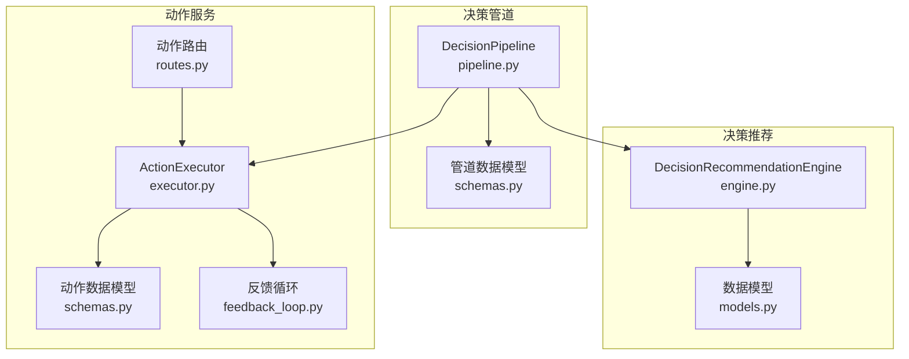
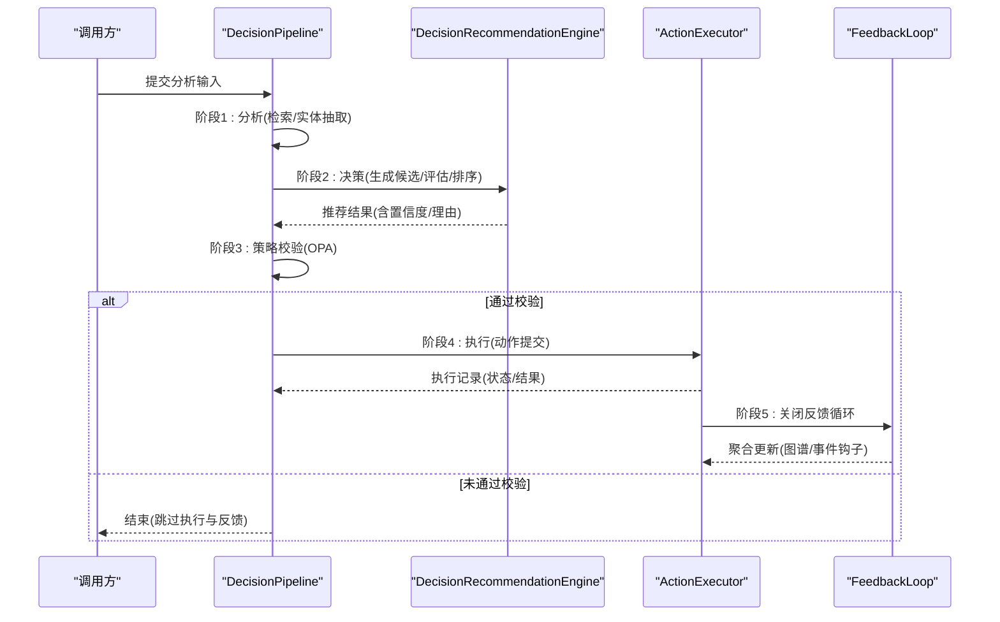
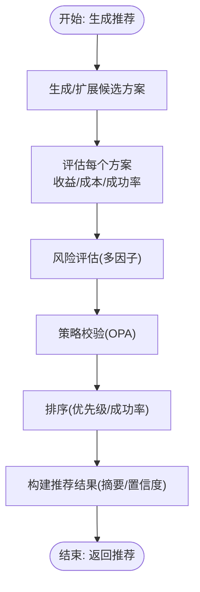
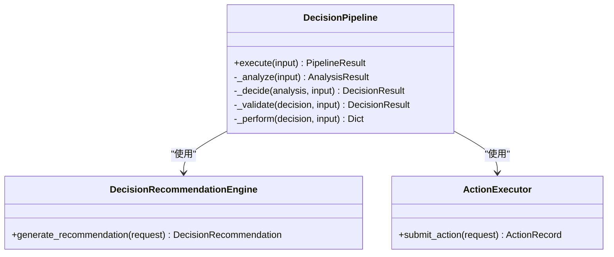
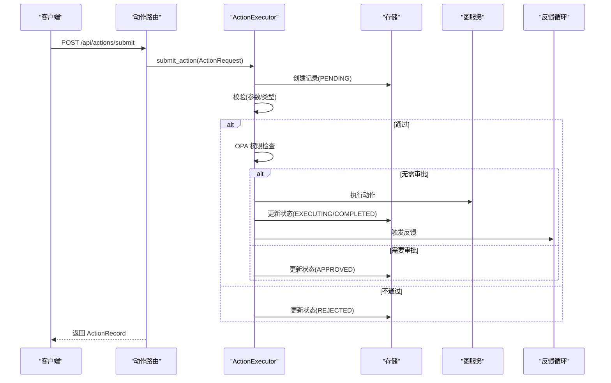
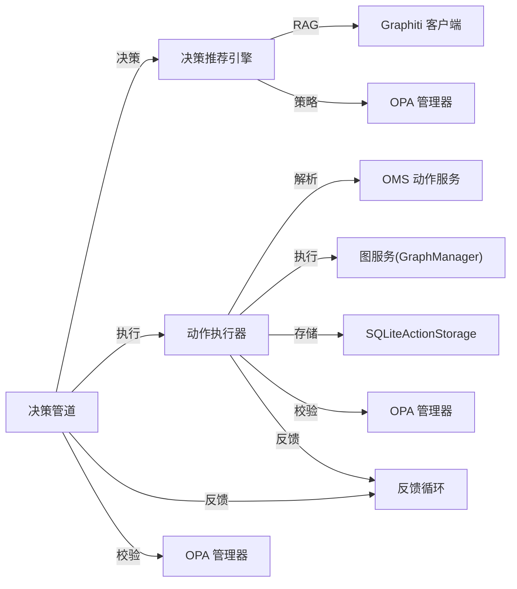

# 决策支持模块

<cite>
**本文档引用的文件**
- [engine.py](file://odap/biz/decision/decision_recommendation/engine.py)
- [models.py](file://odap/biz/decision/decision_recommendation/models.py)
- [pipeline.py](file://odap/biz/decision/decision_pipeline/pipeline.py)
- [schemas.py](file://odap/biz/decision/decision_pipeline/schemas.py)
- [executor.py](file://odap/biz/decision/action_service/executor.py)
- [schemas.py](file://odap/biz/decision/action_service/schemas.py)
- [routes.py](file://odap/biz/decision/action_service/routes.py)
- [feedback_loop.py](file://odap/biz/decision/action_service/feedback_loop.py)
- [test_decision_pipeline.py](file://tests/unit/test_decision_pipeline.py)
- [test_action_service.py](file://tests/unit/test_action_service.py)
</cite>

## 目录
1. [简介](#简介)
2. [项目结构](#项目结构)
3. [核心组件](#核心组件)
4. [架构总览](#架构总览)
5. [详细组件分析](#详细组件分析)
6. [依赖关系分析](#依赖关系分析)
7. [性能考虑](#性能考虑)
8. [故障排查指南](#故障排查指南)
9. [结论](#结论)
10. [附录](#附录)

## 简介
本文件面向决策支持模块，系统化梳理并说明三大核心子系统：决策推荐引擎、决策管道、动作服务。内容涵盖算法原理、数据流机制、执行调度策略、风险分析与方案评估、执行跟踪与闭环反馈、可视化展示思路、实时反馈机制以及性能优化策略，并提供扩展接口与定制化配置建议。

## 项目结构
决策支持模块位于 odap/biz/decision 下，按功能域划分为：
- decision_recommendation：决策推荐引擎与数据模型
- decision_pipeline：端到端决策流水线编排
- action_service：动作提交、校验、执行与反馈闭环

**图表来源**
- [engine.py:34-603](file://odap/biz/decision/decision_recommendation/engine.py#L34-L603)
- [models.py:1-244](file://odap/biz/decision/decision_recommendation/models.py#L1-L244)
- [pipeline.py:13-283](file://odap/biz/decision/decision_pipeline/pipeline.py#L13-L283)
- [schemas.py:1-74](file://odap/biz/decision/decision_pipeline/schemas.py#L1-L74)
- [executor.py:10-297](file://odap/biz/decision/action_service/executor.py#L10-L297)
- [schemas.py:1-57](file://odap/biz/decision/action_service/schemas.py#L1-L57)
- [routes.py:1-55](file://odap/biz/decision/action_service/routes.py#L1-L55)
- [feedback_loop.py:290-311](file://odap/biz/decision/action_service/feedback_loop.py#L290-L311)

**章节来源**
- [engine.py:1-603](file://odap/biz/decision/decision_recommendation/engine.py#L1-L603)
- [pipeline.py:1-283](file://odap/biz/decision/decision_pipeline/pipeline.py#L1-L283)
- [executor.py:1-297](file://odap/biz/decision/action_service/executor.py#L1-L297)

## 核心组件
- 决策推荐引擎：接收理解阶段结果，生成候选方案，进行收益/成本/成功率评估，风险综合分析，策略校验，排序并输出推荐结论，支持 RAG 增强与反馈写入。
- 决策管道：串联“理解-决策-策略校验-执行-反馈”五阶段，提供失败保护与阶段状态跟踪，支持降级路径与回退策略。
- 动作服务：负责动作请求的校验、权限检查（OPA）、执行、写回（Graph/外部 Webhook）、状态持久化与闭环反馈收集与聚合。

**章节来源**
- [engine.py:34-124](file://odap/biz/decision/decision_recommendation/engine.py#L34-L124)
- [pipeline.py:64-139](file://odap/biz/decision/decision_pipeline/pipeline.py#L64-L139)
- [executor.py:48-92](file://odap/biz/decision/action_service/executor.py#L48-L92)

## 架构总览
决策支持模块采用“流水线+引擎+服务”的分层架构，通过数据模型在各层之间传递，确保职责清晰、可扩展、可测试。

**图表来源**
- [pipeline.py:64-139](file://odap/biz/decision/decision_pipeline/pipeline.py#L64-L139)
- [engine.py:63-124](file://odap/biz/decision/decision_recommendation/engine.py#L63-L124)
- [executor.py:48-92](file://odap/biz/decision/action_service/executor.py#L48-L92)
- [feedback_loop.py:296-301](file://odap/biz/decision/action_service/feedback_loop.py#L296-L301)

## 详细组件分析

### 决策推荐引擎
- 输入：RecommendationRequest（分析结果、约束、上下文、候选方案）
- 输出：DecisionRecommendation（推荐方案、备选、摘要、置信度）
- 关键能力：
  - 候选方案生成：若请求提供则复用，否则基于分析结果生成默认方案
  - 评估指标：优先级评分（收益、成本、成功率加权）、预期收益/成本、成功率
  - 风险评估：多因子加权综合评分与等级映射，生成缓解建议
  - 策略校验：对接 OPA，根据返回决定状态（推荐/备选/拒绝），并记录理由
  - 排序与摘要：按优先级与成功率排序，生成推荐摘要与置信度
  - RAG 增强：基于 Graphiti 的相似性检索支撑证据
  - 闭环反馈：可将执行后的反馈写入知识图谱，形成学习闭环

**图表来源**
- [engine.py:63-124](file://odap/biz/decision/decision_recommendation/engine.py#L63-L124)
- [engine.py:160-196](file://odap/biz/decision/decision_recommendation/engine.py#L160-L196)
- [engine.py:270-339](file://odap/biz/decision/decision_recommendation/engine.py#L270-L339)
- [engine.py:351-396](file://odap/biz/decision/decision_recommendation/engine.py#L351-L396)
- [engine.py:397-427](file://odap/biz/decision/decision_recommendation/engine.py#L397-L427)

**章节来源**
- [engine.py:34-603](file://odap/biz/decision/decision_recommendation/engine.py#L34-L603)
- [models.py:14-244](file://odap/biz/decision/decision_recommendation/models.py#L14-L244)

### 决策管道
- 职责：编排“理解-决策-策略校验-执行-反馈”五阶段，提供 fail-closed 的安全策略与阶段状态跟踪
- 关键点：
  - 阶段状态：PENDING/RUNNING/COMPLETED/FAILED/SKIPPED
  - 理解阶段：通过语义检索器获取上下文、实体与模式
  - 决策阶段：优先使用推荐引擎，失败时回退到基于本体的动作类型生成
  - 策略校验：ABAC 权限检查，无 OPA 或异常时 fail-closed
  - 执行阶段：构造动作请求并提交给动作服务
  - 反馈阶段：仅当执行成功时触发闭环反馈

**图表来源**
- [pipeline.py:13-283](file://odap/biz/decision/decision_pipeline/pipeline.py#L13-L283)
- [engine.py:63-124](file://odap/biz/decision/decision_recommendation/engine.py#L63-L124)
- [executor.py:48-92](file://odap/biz/decision/action_service/executor.py#L48-L92)

**章节来源**
- [pipeline.py:13-283](file://odap/biz/decision/decision_pipeline/pipeline.py#L13-L283)
- [schemas.py:1-74](file://odap/biz/decision/decision_pipeline/schemas.py#L1-L74)

### 动作服务
- 职责：动作生命周期管理（校验-审批-执行-写回-反馈）
- 关键流程：
  - 校验：必填参数、目标对象类型匹配
  - 权限：OPA ABAC 检查，异常或未配置时 fail-closed
  - 执行：内置动作别名（update/create/delete/link 等）与通用属性更新
  - 写回：Graph 或 Webhook，支持扩展
  - 反馈：收集执行结果，分析偏差，聚合到图谱与事件钩子

**图表来源**
- [routes.py:13-55](file://odap/biz/decision/action_service/routes.py#L13-L55)
- [executor.py:48-92](file://odap/biz/decision/action_service/executor.py#L48-L92)
- [executor.py:103-138](file://odap/biz/decision/action_service/executor.py#L103-L138)
- [executor.py:177-246](file://odap/biz/decision/action_service/executor.py#L177-L246)
- [feedback_loop.py:296-301](file://odap/biz/decision/action_service/feedback_loop.py#L296-L301)

**章节来源**
- [executor.py:10-297](file://odap/biz/decision/action_service/executor.py#L10-L297)
- [schemas.py:1-57](file://odap/biz/decision/action_service/schemas.py#L1-L57)
- [routes.py:1-55](file://odap/biz/decision/action_service/routes.py#L1-L55)
- [feedback_loop.py:1-311](file://odap/biz/decision/action_service/feedback_loop.py#L1-L311)

## 依赖关系分析
- 决策推荐引擎依赖：
  - Graphiti 客户端（RAG 增强）
  - OPA 管理器（策略校验）
- 决策管道依赖：
  - 语义检索器（分析阶段）
  - 决策推荐引擎（决策阶段）
  - 动作执行器（执行阶段）
  - 反馈循环（反馈阶段）
  - OPA 管理器（策略校验）
- 动作服务依赖：
  - 本体动作服务（OMS）解析动作类型
  - 图服务（GraphManager）执行实体/关系操作
  - 存储（SQLiteActionStorage）持久化动作记录
  - OPA 管理器（OPAManagerV2）权限检查
  - 反馈循环（FeedbackLoop）闭环更新

**图表来源**
- [engine.py:46-61](file://odap/biz/decision/decision_recommendation/engine.py#L46-L61)
- [pipeline.py:22-62](file://odap/biz/decision/decision_pipeline/pipeline.py#L22-L62)
- [executor.py:17-46](file://odap/biz/decision/action_service/executor.py#L17-L46)

**章节来源**
- [engine.py:1-62](file://odap/biz/decision/decision_recommendation/engine.py#L1-L62)
- [pipeline.py:13-63](file://odap/biz/decision/decision_pipeline/pipeline.py#L13-L63)
- [executor.py:10-47](file://odap/biz/decision/action_service/executor.py#L10-L47)

## 性能考虑
- 异步化：推荐引擎与管道均采用异步方法，减少阻塞，提升吞吐
- 惰性初始化：管道与执行器的依赖组件按需加载，降低启动开销
- fail-closed 安全策略：在 OPA 不可用或异常时拒绝执行，避免误操作
- 缓存与降级：管道在推荐引擎不可用时回退到本体动作类型生成，保证系统可用性
- 写回策略：动作执行后可选择性写回（Graph/Webhook），避免不必要的网络开销
- 测试覆盖：单元测试对关键分支（OPA 拒绝、执行失败、反馈失败）进行验证，保障稳定性

[本节为通用指导，不直接分析具体文件]

## 故障排查指南
- 决策管道
  - 分析阶段失败：检查语义检索器可用性与网络连接
  - 决策阶段失败：确认推荐引擎导入与运行状态，关注回退逻辑
  - 策略校验失败：检查 OPA 配置与策略规则，注意 fail-closed 场景
  - 执行阶段失败：查看动作记录状态与错误信息
  - 反馈阶段失败：不影响主流程，但需关注日志与告警
- 动作服务
  - 参数缺失/类型不匹配：核对动作类型定义与请求参数
  - OPA 拒绝：检查用户权限、资源标识与环境变量
  - 执行异常：定位图服务调用与异常堆栈
  - 写回失败：检查目标系统连通性与写回配置

**章节来源**
- [test_decision_pipeline.py:277-502](file://tests/unit/test_decision_pipeline.py#L277-L502)
- [test_action_service.py:108-182](file://tests/unit/test_action_service.py#L108-L182)

## 结论
决策支持模块通过“推荐-管道-动作”三层协同，实现了从理解到执行再到反馈的完整闭环。推荐引擎提供可解释的优先级与风险评估，管道确保流程可控与安全，动作服务保障执行的合规与可观测。模块具备良好的扩展性与可测试性，适合在复杂业务场景中落地。

[本节为总结性内容，不直接分析具体文件]

## 附录

### 决策过程可视化展示
- 推荐流程图（见“决策推荐引擎”小节）
- 管道流程图（见“决策管道”小节）
- 动作执行序列图（见“动作服务”小节）

### 实时反馈机制
- 动作执行完成后自动触发反馈收集与分析
- 将执行结果与偏差归因写入知识图谱与事件钩子
- 为后续推荐提供学习信号

**章节来源**
- [feedback_loop.py:296-301](file://odap/biz/decision/action_service/feedback_loop.py#L296-L301)

### 性能优化策略
- 异步并发：在推荐与执行阶段充分利用异步 I/O
- 惰性加载：延迟初始化第三方依赖，减少冷启动时间
- 失败隔离：阶段内失败不影响其他阶段，必要时跳过后续阶段
- 写回策略：按需启用写回，避免冗余网络调用

[本节为通用指导，不直接分析具体文件]

### 扩展接口与定制化配置
- 推荐引擎
  - 新增评估因子：在风险评估与优先级评分中加入新维度
  - 自定义策略校验：扩展 OPA 输入与规则
  - RAG 增强：接入更多知识源或调整检索策略
- 决策管道
  - 新增阶段：在现有五阶段基础上扩展新的处理步骤
  - 回退策略：针对不同失败场景定制更细粒度的回退
- 动作服务
  - 新增动作别名：在执行器中注册新的动作类型
  - 写回扩展：新增写回目标（如数据库、消息队列）
  - 审批流程：扩展审批与人工干预接口

[本节为通用指导，不直接分析具体文件]