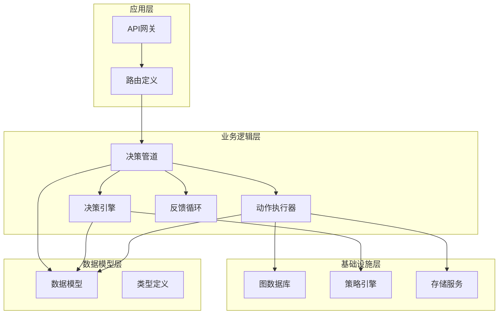
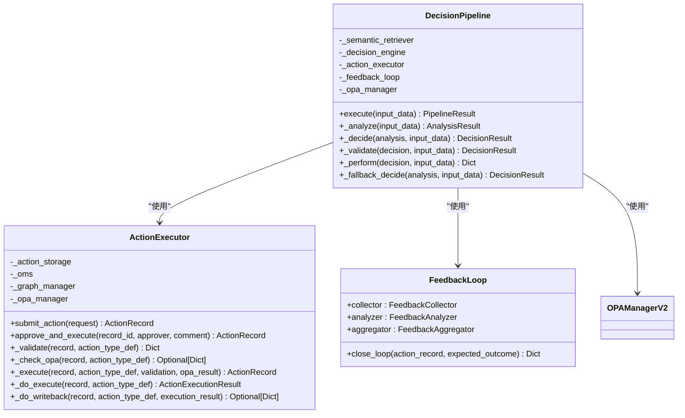
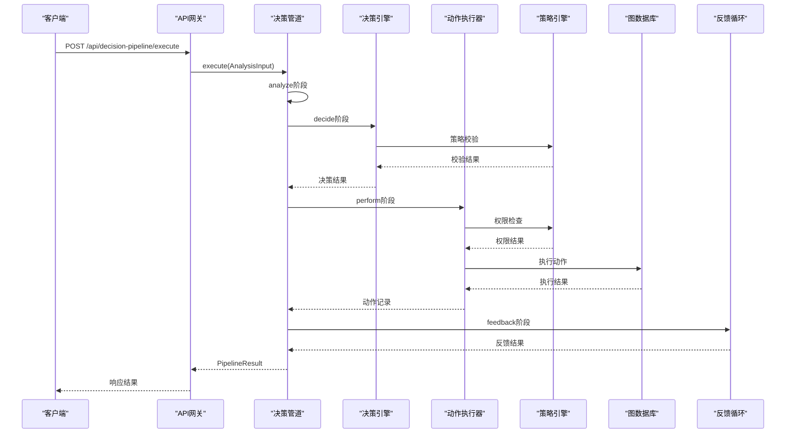
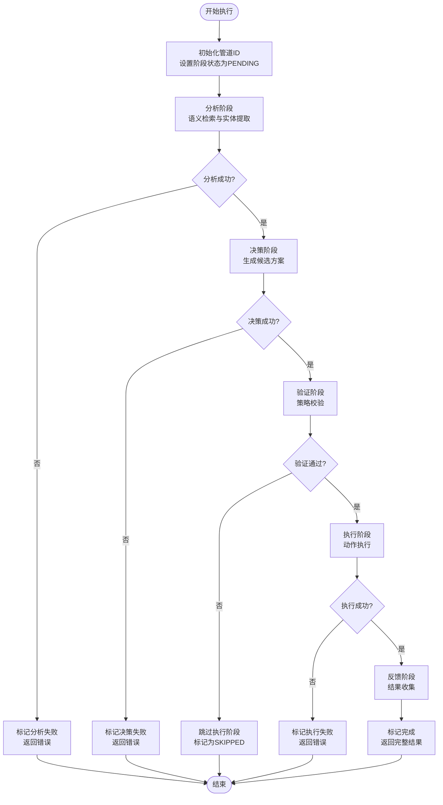
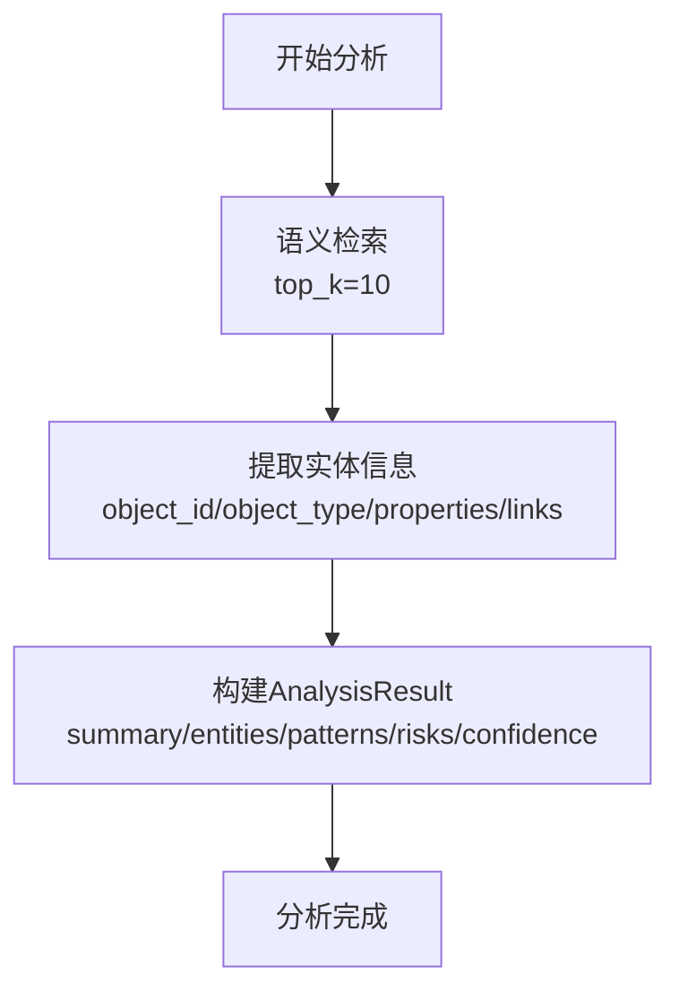
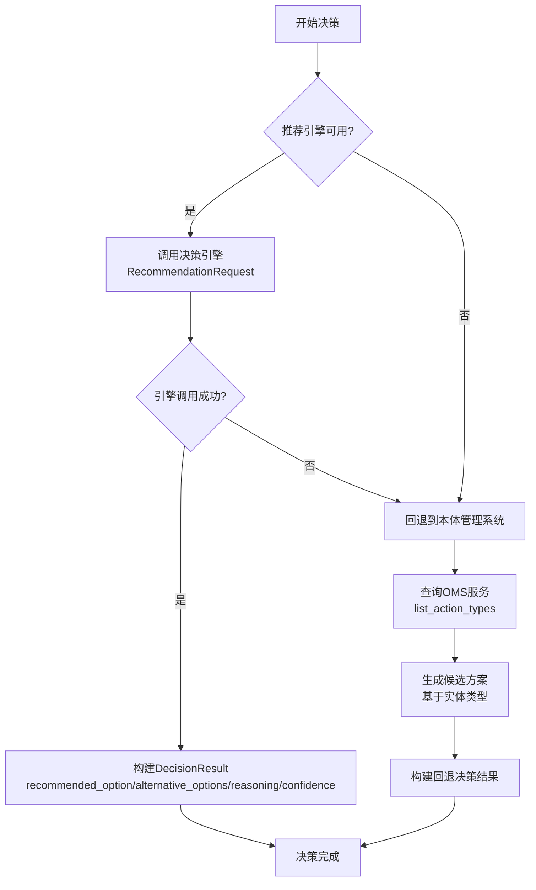
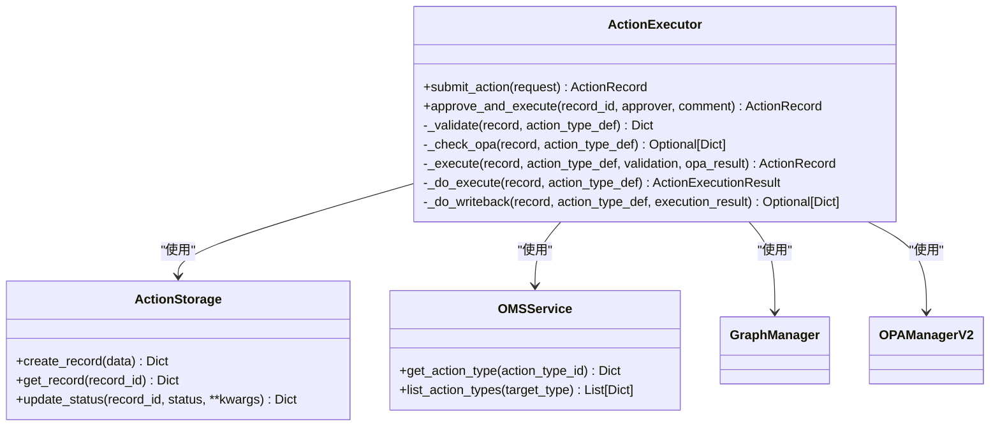
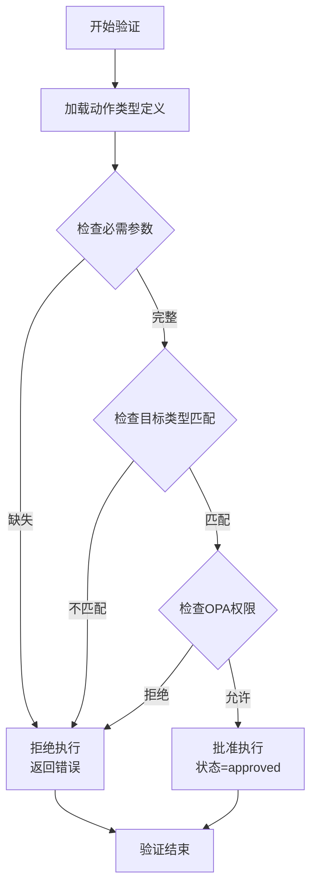
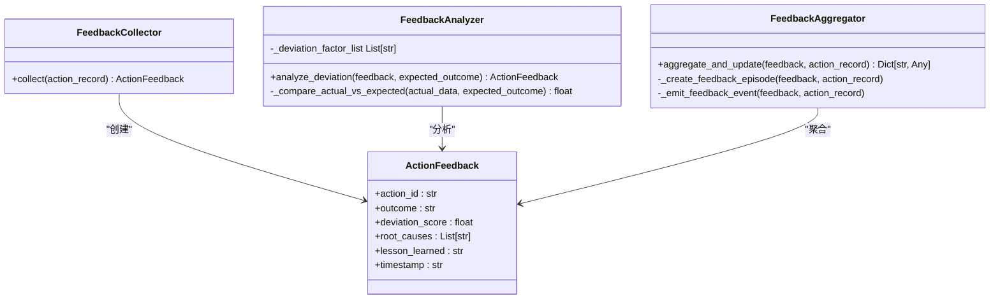
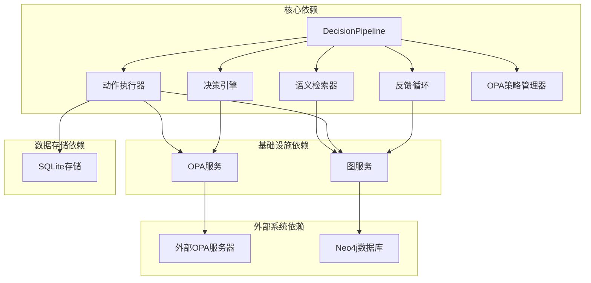

# 决策管道系统

<cite>
**本文档引用的文件**
- [pipeline.py](file://odap/biz/decision/decision_pipeline/pipeline.py)
- [schemas.py](file://odap/biz/decision/decision_pipeline/schemas.py)
- [routes.py](file://odap/biz/decision/decision_pipeline/routes.py)
- [engine.py](file://odap/biz/decision/decision_recommendation/engine.py)
- [models.py](file://odap/biz/decision/decision_recommendation/models.py)
- [executor.py](file://odap/biz/decision/action_service/executor.py)
- [schemas.py](file://odap/biz/decision/action_service/schemas.py)
- [feedback_loop.py](file://odap/biz/decision/action_service/feedback_loop.py)
- [opa_service.py](file://odap/infra/opa/opa_service.py)
- [graph_service.py](file://odap/infra/graph/graph_service.py)
- [app.py](file://odap/web/api/app.py)
</cite>

## 目录
1. [简介](#简介)
2. [项目结构](#项目结构)
3. [核心组件](#核心组件)
4. [架构概览](#架构概览)
5. [详细组件分析](#详细组件分析)
6. [依赖关系分析](#依赖关系分析)
7. [性能考虑](#性能考虑)
8. [故障排除指南](#故障排除指南)
9. [结论](#结论)
10. [附录](#附录)

## 简介

决策管道系统是基于本体图谱的智能化决策支持平台，旨在为复杂业务场景提供完整的决策生命周期管理。该系统集成了知识图谱、机器学习、策略引擎和自动化执行等多个技术领域，通过标准化的数据流和状态管理机制，实现了从数据采集、分析理解、决策生成到执行反馈的完整闭环。

系统采用模块化设计，主要包含四个核心阶段：数据分析与理解、决策生成与评估、策略校验与执行、反馈收集与优化。每个阶段都具备独立的处理能力和状态监控机制，确保整个决策过程的可控性和可追溯性。

## 项目结构

决策管道系统采用分层架构设计，按照功能职责划分为多个子模块：



**图表来源**
- [pipeline.py:13-283](file://odap/biz/decision/decision_pipeline/pipeline.py#L13-L283)
- [engine.py:34-603](file://odap/biz/decision/decision_recommendation/engine.py#L34-L603)
- [executor.py:10-297](file://odap/biz/decision/action_service/executor.py#L10-L297)

**章节来源**
- [pipeline.py:1-283](file://odap/biz/decision/decision_pipeline/pipeline.py#L1-L283)
- [routes.py:1-29](file://odap/biz/decision/decision_pipeline/routes.py#L1-L29)

## 核心组件

### 决策管道核心类

决策管道系统的核心是`DecisionPipeline`类，它负责协调整个决策流程的各个阶段。该类采用了延迟初始化模式，按需加载各个子组件，提高了系统的启动效率和资源利用率。



**图表来源**
- [pipeline.py:13-283](file://odap/biz/decision/decision_pipeline/pipeline.py#L13-L283)
- [executor.py:10-297](file://odap/biz/decision/action_service/executor.py#L10-L297)
- [feedback_loop.py:290-311](file://odap/biz/decision/action_service/feedback_loop.py#L290-L311)

### 数据模型体系

系统采用Pydantic模型定义，确保数据的完整性和一致性。主要数据模型包括：

- **输入输出模型**：AnalysisInput、AnalysisResult、PipelineResult
- **决策模型**：DecisionOption、DecisionResult、DecisionRecommendation
- **动作模型**：ActionRequest、ActionRecord、ActionExecutionResult
- **状态枚举**：PipelineStageStatus、ActionRequestStatus

**章节来源**
- [schemas.py:6-74](file://odap/biz/decision/decision_pipeline/schemas.py#L6-L74)
- [models.py:14-244](file://odap/biz/decision/decision_recommendation/models.py#L14-L244)
- [schemas.py:6-57](file://odap/biz/decision/action_service/schemas.py#L6-L57)

## 架构概览

决策管道系统采用异步非阻塞的设计模式，通过事件驱动的方式处理各种决策请求。整个架构遵循单一职责原则，每个组件都有明确的功能边界和责任范围。



**图表来源**
- [routes.py:10-13](file://odap/biz/decision/decision_pipeline/routes.py#L10-L13)
- [pipeline.py:64-139](file://odap/biz/decision/decision_pipeline/pipeline.py#L64-L139)
- [executor.py:48-92](file://odap/biz/decision/action_service/executor.py#L48-L92)

## 详细组件分析

### 决策管道执行流程

决策管道的执行流程严格按照预定义的阶段顺序进行，每个阶段都有明确的状态管理和错误处理机制。



**图表来源**
- [pipeline.py:64-139](file://odap/biz/decision/decision_pipeline/pipeline.py#L64-L139)

#### 分析阶段处理流程

分析阶段负责从知识图谱中检索相关信息，提取实体和关系，为后续决策提供数据基础。



**图表来源**
- [pipeline.py:141-160](file://odap/biz/decision/decision_pipeline/pipeline.py#L141-L160)

#### 决策阶段处理流程

决策阶段提供两种决策方式：基于推荐引擎的智能决策和基于本体管理系统的回退决策。



**图表来源**
- [pipeline.py:162-230](file://odap/biz/decision/decision_pipeline/pipeline.py#L162-L230)

### 动作执行器核心功能

动作执行器负责将决策结果转化为具体的操作，并确保操作的安全性和有效性。



**图表来源**
- [executor.py:10-297](file://odap/biz/decision/action_service/executor.py#L10-L297)

#### 动作验证与权限检查流程

动作执行前需要经过严格的验证和权限检查，确保操作的安全性和合规性。



**图表来源**
- [executor.py:103-137](file://odap/biz/decision/action_service/executor.py#L103-L137)

### 反馈循环机制

反馈循环是决策管道的重要组成部分，负责收集执行结果、分析偏差原因、总结经验教训，并将反馈信息写回到知识图谱中。



**图表来源**
- [feedback_loop.py:23-311](file://odap/biz/decision/action_service/feedback_loop.py#L23-L311)

**章节来源**
- [executor.py:1-297](file://odap/biz/decision/action_service/executor.py#L1-L297)
- [feedback_loop.py:1-311](file://odap/biz/decision/action_service/feedback_loop.py#L1-L311)

## 依赖关系分析

决策管道系统的依赖关系相对清晰，主要依赖关系如下：



**图表来源**
- [pipeline.py:21-62](file://odap/biz/decision/decision_pipeline/pipeline.py#L21-L62)
- [executor.py:17-46](file://odap/biz/decision/action_service/executor.py#L17-L46)
- [opa_service.py:452-717](file://odap/infra/opa/opa_service.py#L452-L717)

### 组件耦合度分析

系统采用松耦合设计，各组件间通过接口和抽象类进行交互，减少了直接依赖关系：

- **高内聚**：每个组件专注于特定的业务功能
- **低耦合**：组件间通过标准接口通信
- **可替换性**：核心组件支持插件化扩展
- **可测试性**：良好的接口设计便于单元测试

**章节来源**
- [pipeline.py:1-283](file://odap/biz/decision/decision_pipeline/pipeline.py#L1-L283)
- [engine.py:1-603](file://odap/biz/decision/decision_recommendation/engine.py#L1-L603)

## 性能考虑

### 异步处理机制

系统广泛采用异步编程模式，通过`async/await`语法提高并发处理能力：

- **非阻塞I/O**：数据库查询和外部API调用采用异步方式
- **并发控制**：合理控制并发数量，避免资源竞争
- **超时管理**：为外部依赖设置合理的超时时间

### 缓存策略

系统实现了多层次的缓存机制：

- **策略缓存**：OPA策略结果缓存，减少重复计算
- **查询缓存**：图数据库查询结果缓存
- **实例缓存**：组件实例缓存，避免重复创建

### 错误恢复机制

系统具备完善的错误处理和恢复能力：

- **降级策略**：核心功能降级到最小可用模式
- **重试机制**：对外部依赖提供有限次数的重试
- **熔断器模式**：防止级联故障传播
- **回滚机制**：执行失败时自动回滚已执行的操作

## 故障排除指南

### 常见问题诊断

#### 决策管道执行失败

当决策管道执行失败时，首先检查以下方面：

1. **分析阶段失败**：检查语义检索器配置和数据库连接
2. **决策阶段失败**：验证决策引擎可用性和模型加载
3. **验证阶段失败**：确认OPA服务正常运行和策略配置
4. **执行阶段失败**：检查动作类型定义和权限配置

#### 动作执行异常

动作执行失败的常见原因：

- **参数验证失败**：检查必需参数是否完整
- **权限检查失败**：验证用户权限和资源访问控制
- **图数据库操作失败**：确认实体存在性和关系完整性
- **写回操作失败**：检查外部系统连接和数据格式

### 日志分析方法

系统提供了详细的日志记录机制，便于问题定位：

- **错误级别日志**：记录具体的错误信息和堆栈跟踪
- **调试级别日志**：记录详细的处理流程和中间状态
- **性能日志**：记录关键操作的执行时间和资源消耗
- **审计日志**：记录所有重要的业务操作和决策过程

**章节来源**
- [pipeline.py:81-84](file://odap/biz/decision/decision_pipeline/pipeline.py#L81-L84)
- [executor.py:85-91](file://odap/biz/decision/action_service/executor.py#L85-L91)

## 结论

决策管道系统是一个高度模块化、可扩展的智能化决策支持平台。通过精心设计的架构和严格的状态管理机制，系统能够可靠地处理复杂的决策任务，并提供完整的执行反馈能力。

系统的主要优势包括：

1. **模块化设计**：清晰的组件分离和职责划分
2. **异步处理**：高效的并发处理能力和资源利用率
3. **安全控制**：多层次的权限验证和策略管理
4. **可观测性**：完整的日志记录和性能监控
5. **可扩展性**：插件化的架构设计支持功能扩展

未来可以考虑的改进方向：

- **并行处理优化**：进一步提升大规模决策场景的处理能力
- **机器学习集成**：引入更先进的AI算法提升决策质量
- **实时监控增强**：提供更丰富的实时监控和告警功能
- **用户体验优化**：改善用户界面和交互体验

## 附录

### API使用示例

#### 基本决策执行

```python
# 发送决策请求
{
    "query": "如何处理军事冲突升级",
    "context": {
        "workspace_id": "default",
        "user": "commander_001",
        "constraints": {
            "max_cost": 100,
            "strict_mode": true
        }
    }
}

# 获取执行结果
{
    "pipeline_id": "dp_abc123def456",
    "stages": {
        "analyze": "completed",
        "decide": "completed", 
        "validate": "completed",
        "perform": "completed",
        "feedback": "completed"
    },
    "decision": {
        "decision_id": "dec_789ghi012",
        "recommended_option": {
            "option_id": "opt_def345",
            "name": "战术撤退",
            "action_type_id": "withdraw",
            "risk_level": "low",
            "priority": 1
        },
        "confidence": 0.85
    }
}
```

#### 动作执行流程

```python
# 创建动作请求
{
    "action_type_id": "withdraw",
    "target_object_id": "unit_001",
    "target_object_type": "MilitaryUnit",
    "parameters": {
        "destination": "safe_zone_01",
        "speed": "normal"
    },
    "requested_by": "commander_001",
    "reason": "避免不必要的损失"
}

# 获取执行结果
{
    "action_record_id": "ar_123xyz456",
    "status": "completed",
    "execution_result": {
        "success": true,
        "message": "单位已成功撤退到安全区域",
        "data": {
            "unit_id": "unit_001",
            "new_location": "safe_zone_01"
        }
    }
}
```

### 最佳实践

1. **配置管理**：合理设置超时时间和重试策略
2. **错误处理**：实现完善的异常捕获和恢复机制
3. **性能监控**：建立全面的性能指标和告警系统
4. **安全控制**：严格执行权限验证和数据保护
5. **日志记录**：保持详细的审计日志和调试信息
6. **测试覆盖**：编写完整的单元测试和集成测试
7. **文档维护**：及时更新API文档和使用说明

### 集成方案

系统支持多种外部系统集成：

- **认证集成**：支持OAuth2、JWT等多种认证方式
- **数据库集成**：支持MySQL、PostgreSQL等主流数据库
- **消息队列**：支持RabbitMQ、Kafka等消息中间件
- **监控系统**：支持Prometheus、Grafana等监控工具
- **日志系统**：支持ELK Stack、Fluentd等日志收集