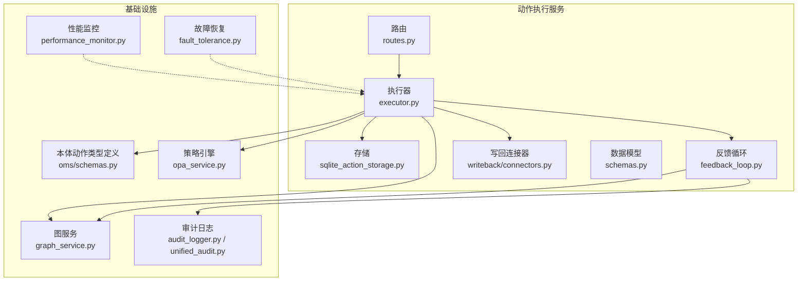
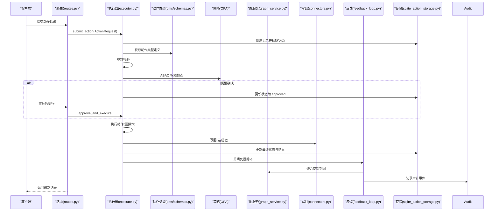
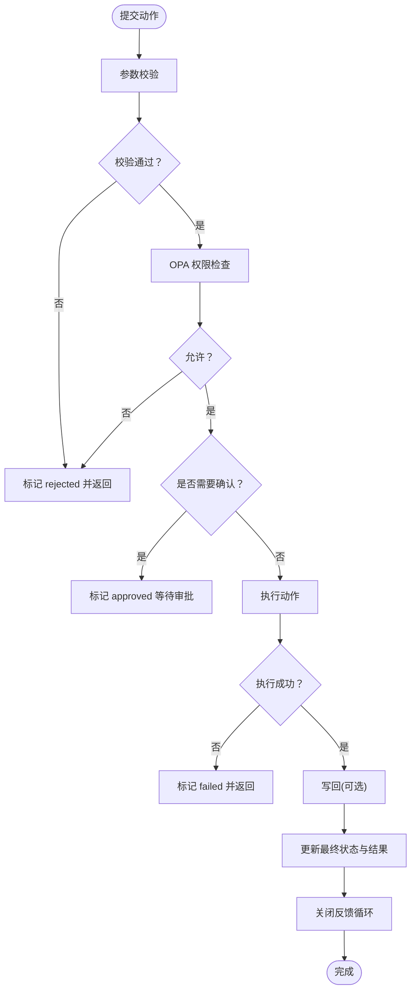
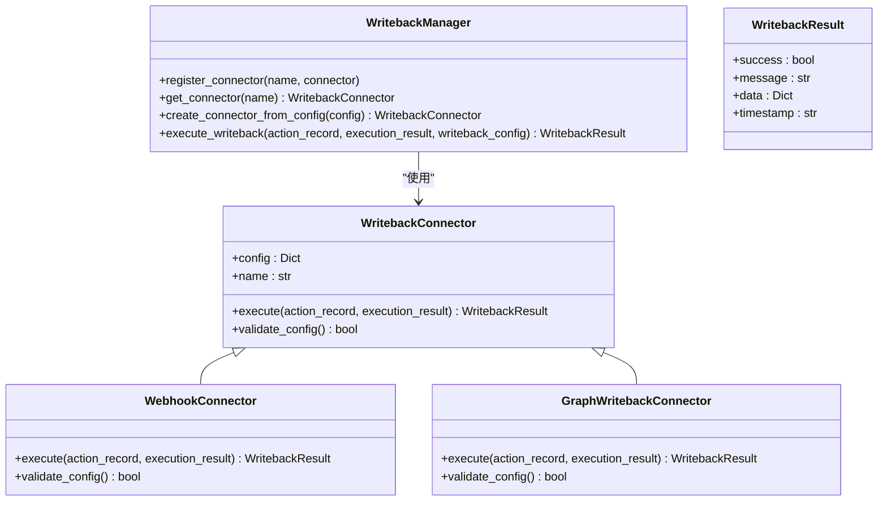
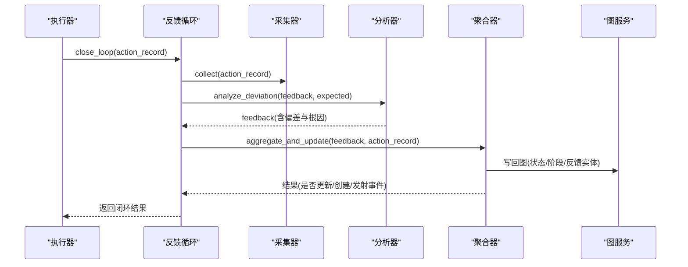
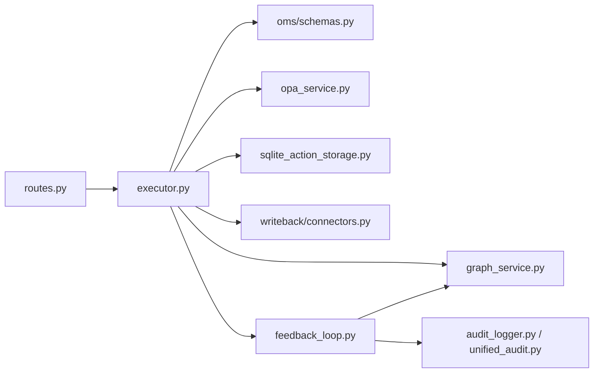

# 动作执行服务

<cite>
**本文引用的文件**
- [odap/biz/decision/action_service/executor.py](file://odap/biz/decision/action_service/executor.py)
- [odap/biz/decision/action_service/feedback_loop.py](file://odap/biz/decision/action_service/feedback_loop.py)
- [odap/biz/decision/action_service/writeback/connectors.py](file://odap/biz/decision/action_service/writeback/connectors.py)
- [odap/biz/decision/action_service/schemas.py](file://odap/biz/decision/action_service/schemas.py)
- [odap/biz/decision/action_service/storage/sqlite_action_storage.py](file://odap/biz/decision/action_service/storage/sqlite_action_storage.py)
- [odap/biz/decision/action_service/routes.py](file://odap/biz/decision/action_service/routes.py)
- [odap/biz/core/ontology/oms/schemas.py](file://odap/biz/core/ontology/oms/schemas.py)
- [odap/infra/opa/opa_service.py](file://odap/infra/opa/opa_service.py)
- [odap/infra/graph/graph_service.py](file://odap/infra/graph/graph_service.py)
- [odap/infra/security/audit_logger.py](file://odap/infra/security/audit_logger.py)
- [odap/infra/security/unified_audit.py](file://odap/infra/security/unified_audit.py)
- [odap/infra/resilience/fault_tolerance.py](file://odap/infra/resilience/fault_tolerance.py)
- [odap/infra/monitoring/performance_monitor.py](file://odap/infra/monitoring/performance_monitor.py)
- [tests/unit/test_action_service.py](file://tests/unit/test_action_service.py)
- [tests/e2e/test_military_e2e_flow.py](file://tests/e2e/test_military_e2e_flow.py)
</cite>

## 目录
1. [简介](#简介)
2. [项目结构](#项目结构)
3. [核心组件](#核心组件)
4. [架构总览](#架构总览)
5. [详细组件分析](#详细组件分析)
6. [依赖分析](#依赖分析)
7. [性能考量](#性能考量)
8. [故障排查指南](#故障排查指南)
9. [结论](#结论)
10. [附录](#附录)

## 简介
本文件面向“动作执行服务”的架构与实现，围绕动作解析、调度策略、并发控制与资源管理展开；详述动作写回机制（连接器抽象、数据同步与错误处理）、反馈循环（执行监控、状态跟踪与结果验证）；提供动作配置的完整指南（动作类型、参数设置与执行条件）；并给出安全控制、性能监控与故障恢复策略的具体实现。

## 项目结构
动作执行服务位于 odap/biz/decision/action_service 下，采用按职责分层组织：
- 路由与入口：FastAPI 路由负责接收动作请求，委派给执行器
- 执行器：负责动作生命周期管理（校验、策略审批、执行、写回、状态更新、反馈）
- 反馈循环：采集、分析偏差、聚合写回图谱与事件钩子
- 写回模块：抽象连接器，支持 Webhook 与图写回
- 存储：SQLite 动作记录持久化
- 配置：OMS 中的动作类型定义（参数、策略、写回配置、是否需要确认）

**图表来源**
- [odap/biz/decision/action_service/routes.py:1-41](file://odap/biz/decision/action_service/routes.py#L1-L41)
- [odap/biz/decision/action_service/executor.py:1-297](file://odap/biz/decision/action_service/executor.py#L1-L297)
- [odap/biz/decision/action_service/storage/sqlite_action_storage.py:1-153](file://odap/biz/decision/action_service/storage/sqlite_action_storage.py#L1-L153)
- [odap/biz/decision/action_service/feedback_loop.py:1-311](file://odap/biz/decision/action_service/feedback_loop.py#L1-L311)
- [odap/biz/decision/action_service/writeback/connectors.py:1-190](file://odap/biz/decision/action_service/writeback/connectors.py#L1-L190)
- [odap/biz/core/ontology/oms/schemas.py:58-135](file://odap/biz/core/ontology/oms/schemas.py#L58-L135)
- [odap/infra/opa/opa_service.py:559-583](file://odap/infra/opa/opa_service.py#L559-L583)
- [odap/infra/graph/graph_service.py](file://odap/infra/graph/graph_service.py)
- [odap/infra/security/audit_logger.py:195-239](file://odap/infra/security/audit_logger.py#L195-L239)
- [odap/infra/security/unified_audit.py:125-162](file://odap/infra/security/unified_audit.py#L125-L162)
- [odap/infra/monitoring/performance_monitor.py:1-184](file://odap/infra/monitoring/performance_monitor.py#L1-L184)
- [odap/infra/resilience/fault_tolerance.py:1-309](file://odap/infra/resilience/fault_tolerance.py#L1-L309)

**章节来源**
- [odap/biz/decision/action_service/routes.py:1-41](file://odap/biz/decision/action_service/routes.py#L1-L41)
- [odap/biz/decision/action_service/executor.py:1-297](file://odap/biz/decision/action_service/executor.py#L1-L297)
- [odap/biz/decision/action_service/storage/sqlite_action_storage.py:1-153](file://odap/biz/decision/action_service/storage/sqlite_action_storage.py#L1-L153)

## 核心组件
- 执行器 ActionExecutor：统一编排动作生命周期，含校验、策略审批、执行、写回、状态更新与反馈闭环
- 反馈循环 FeedbackLoop：采集执行结果，分析偏差与根因，聚合到图谱与事件钩子
- 写回连接器 WritebackManager：抽象 Webhook 与图写回，支持动态注册与配置校验
- 存储 SQLiteActionStorage：动作记录持久化，支持状态变更与查询
- 数据模型：ActionRequest、ActionRecord、ActionExecutionResult 等
- 配置来源：OMS 的 ActionTypeDefinition（参数、策略、写回配置、是否需要确认）

**章节来源**
- [odap/biz/decision/action_service/executor.py:10-297](file://odap/biz/decision/action_service/executor.py#L10-L297)
- [odap/biz/decision/action_service/feedback_loop.py:290-311](file://odap/biz/decision/action_service/feedback_loop.py#L290-L311)
- [odap/biz/decision/action_service/writeback/connectors.py:131-190](file://odap/biz/decision/action_service/writeback/connectors.py#L131-L190)
- [odap/biz/decision/action_service/storage/sqlite_action_storage.py:12-153](file://odap/biz/decision/action_service/storage/sqlite_action_storage.py#L12-L153)
- [odap/biz/decision/action_service/schemas.py:6-57](file://odap/biz/decision/action_service/schemas.py#L6-L57)
- [odap/biz/core/ontology/oms/schemas.py:58-135](file://odap/biz/core/ontology/oms/schemas.py#L58-L135)

## 架构总览
动作执行服务遵循“请求-校验-审批-执行-写回-状态-反馈”的闭环流程，并通过 OMS 配置驱动、OPA 策略治理、图服务写回与审计日志记录形成完整的可观测与可追溯体系。

**图表来源**
- [odap/biz/decision/action_service/routes.py:13-41](file://odap/biz/decision/action_service/routes.py#L13-L41)
- [odap/biz/decision/action_service/executor.py:48-175](file://odap/biz/decision/action_service/executor.py#L48-L175)
- [odap/biz/core/ontology/oms/schemas.py:58-135](file://odap/biz/core/ontology/oms/schemas.py#L58-L135)
- [odap/infra/opa/opa_service.py:559-583](file://odap/infra/opa/opa_service.py#L559-L583)
- [odap/infra/graph/graph_service.py](file://odap/infra/graph/graph_service.py)
- [odap/biz/decision/action_service/writeback/connectors.py:158-178](file://odap/biz/decision/action_service/writeback/connectors.py#L158-L178)
- [odap/biz/decision/action_service/feedback_loop.py:296-300](file://odap/biz/decision/action_service/feedback_loop.py#L296-L300)
- [odap/biz/decision/action_service/storage/sqlite_action_storage.py:102-124](file://odap/biz/decision/action_service/storage/sqlite_action_storage.py#L102-L124)

## 详细组件分析

### 执行器：动作生命周期与调度策略
- 生命周期状态机：pending → validating → approved/rejected → executing → completed/failed
- 调度策略：
  - 参数校验：必填参数与目标类型匹配
  - 策略审批：基于 OMS 的 opa_policy 与 required_roles，OPA 失败时 fail-closed
  - 执行：根据动作名映射到图操作（更新、创建、删除、关联等），未知动作走通用属性更新
  - 写回：仅在执行成功后进行，支持 Webhook 与图写回
  - 状态更新：将执行结果与写回结果写入存储
  - 反馈闭环：成功后触发反馈循环，写入图谱与事件钩子

**图表来源**
- [odap/biz/decision/action_service/executor.py:48-175](file://odap/biz/decision/action_service/executor.py#L48-L175)

**章节来源**
- [odap/biz/decision/action_service/executor.py:10-297](file://odap/biz/decision/action_service/executor.py#L10-L297)
- [tests/unit/test_action_service.py:108-171](file://tests/unit/test_action_service.py#L108-L171)

### 写回机制：连接器抽象、数据同步与错误处理
- 抽象接口：WritebackConnector，统一 execute 与 validate_config
- 内置连接器：
  - WebhookConnector：构造负载、签名、超时，异步 HTTP 请求
  - GraphWritebackConnector：将执行结果中的状态/阶段等属性写回图
- 管理器：WritebackManager 动态注册与按类型创建连接器，执行写回并返回结果
- 错误处理：捕获异常并返回失败结果，不影响主流程继续推进

**图表来源**
- [odap/biz/decision/action_service/writeback/connectors.py:20-190](file://odap/biz/decision/action_service/writeback/connectors.py#L20-L190)

**章节来源**
- [odap/biz/decision/action_service/writeback/connectors.py:1-190](file://odap/biz/decision/action_service/writeback/connectors.py#L1-L190)
- [odap/biz/decision/action_service/executor.py:247-286](file://odap/biz/decision/action_service/executor.py#L247-L286)

### 反馈循环：执行监控、状态跟踪与结果验证
- 采集：从动作记录提取执行结果，构造 ActionFeedback
- 分析：比较实际结果与期望，计算偏差分数与根因（超时、权限、缺失字段、数值差异等）
- 聚合：将结果写回图谱（实体 ActionFeedback 与事件），并发出钩子事件
- 闭环：成功时更新目标实体状态/阶段，失败时记录偏差因素与根因

**图表来源**
- [odap/biz/decision/action_service/feedback_loop.py:296-300](file://odap/biz/decision/action_service/feedback_loop.py#L296-L300)
- [odap/biz/decision/action_service/feedback_loop.py:34-50](file://odap/biz/decision/action_service/feedback_loop.py#L34-L50)
- [odap/biz/decision/action_service/feedback_loop.py:54-153](file://odap/biz/decision/action_service/feedback_loop.py#L54-L153)
- [odap/biz/decision/action_service/feedback_loop.py:177-212](file://odap/biz/decision/action_service/feedback_loop.py#L177-L212)

**章节来源**
- [odap/biz/decision/action_service/feedback_loop.py:1-311](file://odap/biz/decision/action_service/feedback_loop.py#L1-L311)

### 存储与并发控制
- 存储：SQLiteActionStorage 使用 WAL 友好的索引与 JSON 字段存储，支持按状态/目标查询
- 并发控制：当前实现为单进程同步调用，无显式锁；可通过外部网关/队列实现异步与限流
- 资源管理：动作记录作为轻量级事务单元，失败回滚通过状态重置与审计日志实现

**章节来源**
- [odap/biz/decision/action_service/storage/sqlite_action_storage.py:12-153](file://odap/biz/decision/action_service/storage/sqlite_action_storage.py#L12-L153)

### 安全控制与审计
- 策略治理：OPA ABAC 权限检查，fail-closed 且支持缓存与历史记录
- 审计日志：统一审计通道与查询接口，支持批量写入与查询
- 统一日志：动作执行成功/失败均记录审计事件，包含耗时、上下文等

**章节来源**
- [odap/infra/opa/opa_service.py:559-583](file://odap/infra/opa/opa_service.py#L559-L583)
- [odap/infra/security/audit_logger.py:195-239](file://odap/infra/security/audit_logger.py#L195-L239)
- [odap/infra/security/unified_audit.py:125-162](file://odap/infra/security/unified_audit.py#L125-L162)

### 性能监控与故障恢复
- 性能监控：装饰器与监控器记录 LLM/数据库/API/工具执行耗时，支持统计与导出
- 故障恢复：断路器、降级模式、重试与回退策略，结合故障分类与恢复动作

**章节来源**
- [odap/infra/monitoring/performance_monitor.py:1-184](file://odap/infra/monitoring/performance_monitor.py#L1-L184)
- [odap/infra/resilience/fault_tolerance.py:1-309](file://odap/infra/resilience/fault_tolerance.py#L1-L309)

## 依赖分析
- 执行器依赖 OMS（动作类型定义）、OPA（权限）、图服务（写回）、存储（持久化）、反馈循环（闭环）
- 写回模块独立于执行器，通过配置驱动
- 路由层薄封装，职责清晰

**图表来源**
- [odap/biz/decision/action_service/routes.py:1-41](file://odap/biz/decision/action_service/routes.py#L1-L41)
- [odap/biz/decision/action_service/executor.py:1-297](file://odap/biz/decision/action_service/executor.py#L1-L297)
- [odap/biz/decision/action_service/writeback/connectors.py:1-190](file://odap/biz/decision/action_service/writeback/connectors.py#L1-L190)
- [odap/biz/decision/action_service/feedback_loop.py:1-311](file://odap/biz/decision/action_service/feedback_loop.py#L1-L311)
- [odap/biz/core/ontology/oms/schemas.py:58-135](file://odap/biz/core/ontology/oms/schemas.py#L58-L135)
- [odap/infra/opa/opa_service.py:559-583](file://odap/infra/opa/opa_service.py#L559-L583)
- [odap/infra/graph/graph_service.py](file://odap/infra/graph/graph_service.py)
- [odap/infra/security/audit_logger.py:195-239](file://odap/infra/security/audit_logger.py#L195-L239)
- [odap/infra/security/unified_audit.py:125-162](file://odap/infra/security/unified_audit.py#L125-L162)

**章节来源**
- [odap/biz/decision/action_service/executor.py:1-297](file://odap/biz/decision/action_service/executor.py#L1-L297)
- [odap/biz/decision/action_service/writeback/connectors.py:1-190](file://odap/biz/decision/action_service/writeback/connectors.py#L1-L190)
- [odap/biz/decision/action_service/feedback_loop.py:1-311](file://odap/biz/decision/action_service/feedback_loop.py#L1-L311)

## 性能考量
- 执行路径尽量短路：校验与策略检查前置，避免无效执行
- 写回异步化：Webhook 使用异步客户端，降低阻塞
- 监控埋点：对关键路径使用装饰器记录耗时，便于定位瓶颈
- 存储优化：合理使用索引，避免大字段频繁更新

[本节为通用指导，无需特定文件引用]

## 故障排查指南
- 执行失败：检查 ActionExecutionResult 的 message 与存储中的 execution_result
- 策略拒绝：查看 OPA 返回与环境变量，确认用户角色与资源权限
- 写回失败：检查连接器配置与网络连通性，关注 WritebackResult 的错误信息
- 反馈未写回：确认反馈聚合器对图写回与事件钩子的调用是否抛错
- 单元测试参考：验证动作执行、异常返回与别名动作行为

**章节来源**
- [tests/unit/test_action_service.py:300-337](file://tests/unit/test_action_service.py#L300-L337)
- [odap/biz/decision/action_service/executor.py:241-245](file://odap/biz/decision/action_service/executor.py#L241-L245)
- [odap/biz/decision/action_service/writeback/connectors.py:85-89](file://odap/biz/decision/action_service/writeback/connectors.py#L85-L89)

## 结论
动作执行服务以 OMS 配置为驱动，结合 OPA 策略治理、图写回与反馈闭环，形成高内聚、低耦合的执行链路。通过连接器抽象与统一审计，具备良好的扩展性与可观测性。建议在生产环境中引入异步队列与断路器，进一步提升吞吐与稳定性。

[本节为总结性内容，无需特定文件引用]

## 附录

### 动作配置完整指南
- 动作类型定义（OMS）：
  - 必填字段：action_type_id、name、target_object_type
  - 参数：parameters（name、param_type、required、default、description）
  - 策略：opa_policy、required_roles
  - 写回：writeback_config（type: webhook/graph；webhook 支持 method、headers、timeout、secret）
  - 控制：confirmation_required（是否需要人工审批）、is_active
- 示例与验证：
  - E2E 流程中创建动作类型并校验 required_roles 与 confirmation_required
  - 单元测试覆盖别名动作与异常场景

**章节来源**
- [odap/biz/core/ontology/oms/schemas.py:58-135](file://odap/biz/core/ontology/oms/schemas.py#L58-L135)
- [tests/e2e/test_military_e2e_flow.py:154-181](file://tests/e2e/test_military_e2e_flow.py#L154-L181)
- [tests/unit/test_action_service.py:320-337](file://tests/unit/test_action_service.py#L320-L337)

### 执行条件与参数设置
- 执行条件：
  - confirmation_required：为真时，动作进入 approved 状态，需人工审批后执行
  - required_roles：结合 OPA 角色授权
  - opa_policy：ABAC 策略键，决定是否允许
- 参数设置：
  - 必填参数在提交时必须提供
  - 目标类型需与动作定义一致

**章节来源**
- [odap/biz/decision/action_service/executor.py:103-117](file://odap/biz/decision/action_service/executor.py#L103-L117)
- [odap/biz/decision/action_service/executor.py:119-137](file://odap/biz/decision/action_service/executor.py#L119-L137)
- [odap/biz/core/ontology/oms/schemas.py:58-135](file://odap/biz/core/ontology/oms/schemas.py#L58-L135)

### 安全控制措施
- 策略治理：OPA ABAC，fail-closed，带缓存与历史记录
- 审计日志：统一通道，支持批量写入与查询
- 写回签名：Webhook 支持 HMAC-SHA256 签名

**章节来源**
- [odap/infra/opa/opa_service.py:559-583](file://odap/infra/opa/opa_service.py#L559-L583)
- [odap/infra/security/audit_logger.py:195-239](file://odap/infra/security/audit_logger.py#L195-L239)
- [odap/biz/decision/action_service/writeback/connectors.py:55-61](file://odap/biz/decision/action_service/writeback/connectors.py#L55-L61)

### 性能监控与故障恢复策略
- 性能监控：装饰器与监控器记录关键路径耗时，支持统计与导出
- 故障恢复：断路器、降级模式、重试与回退策略，结合故障分类与恢复动作

**章节来源**
- [odap/infra/monitoring/performance_monitor.py:147-184](file://odap/infra/monitoring/performance_monitor.py#L147-L184)
- [odap/infra/resilience/fault_tolerance.py:41-309](file://odap/infra/resilience/fault_tolerance.py#L41-L309)