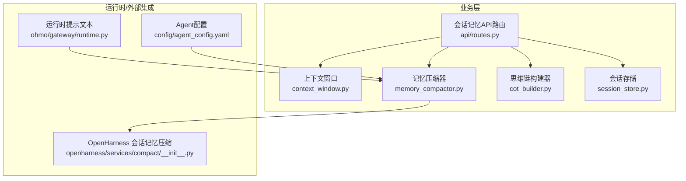
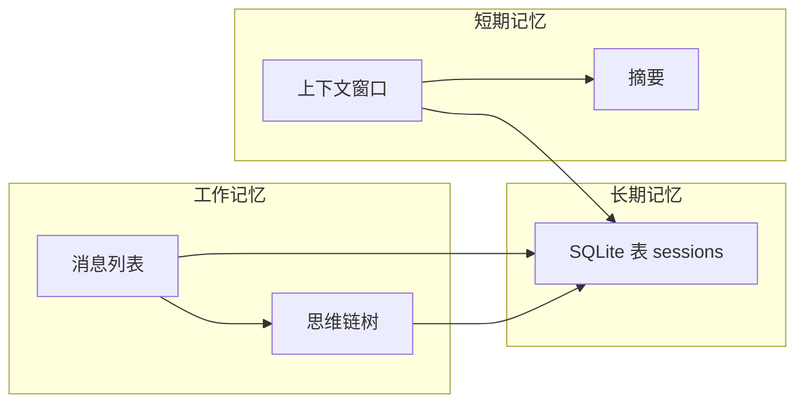
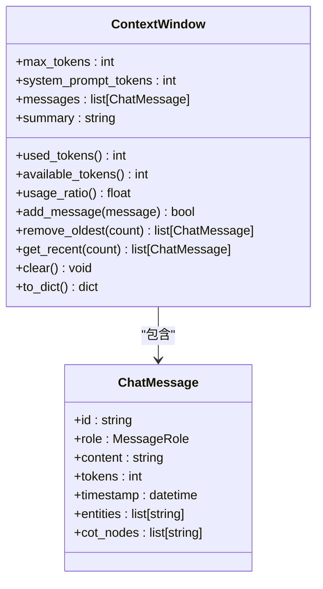
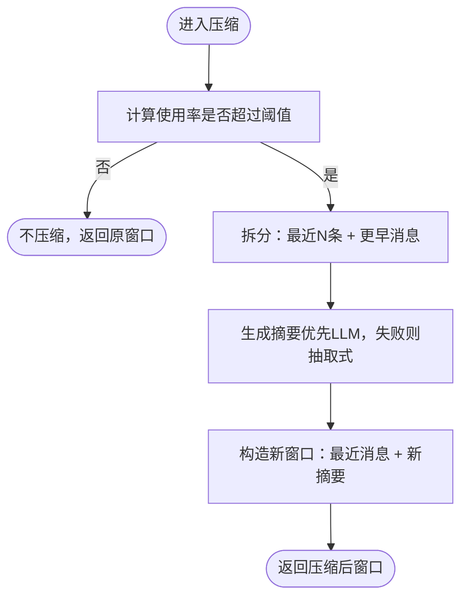
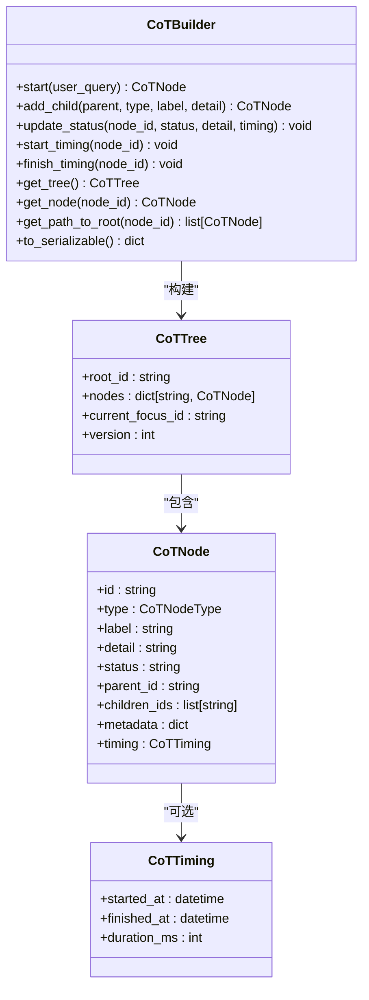
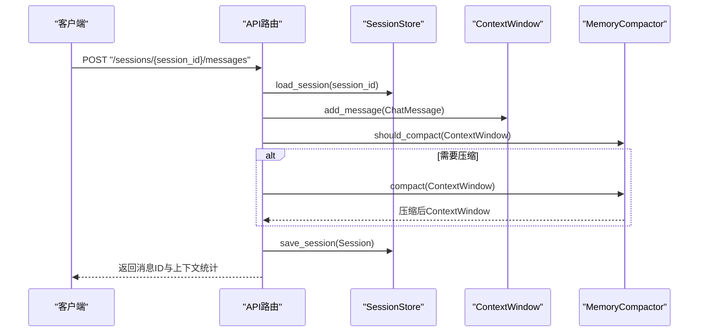
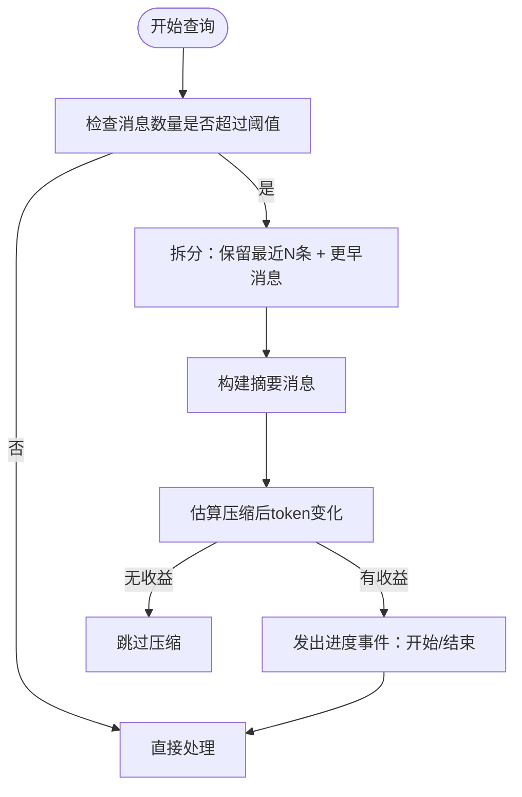
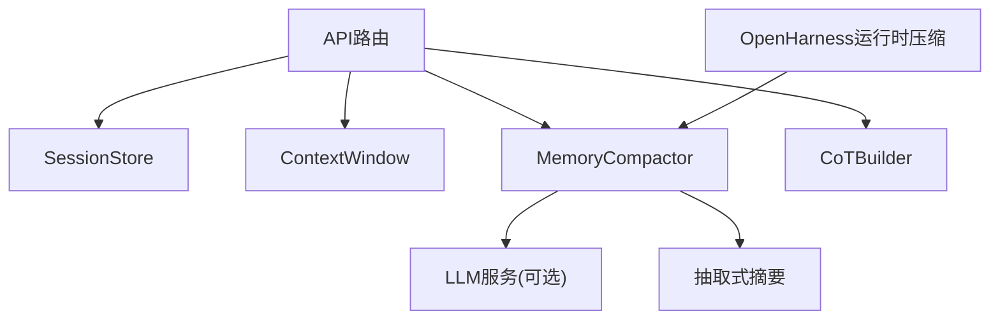

# 会话记忆

<cite>
**本文引用的文件**
- [会话记忆设计文档](file://docs/03-modules/session_memory/DESIGN.md)
- [上下文窗口](file://odap/biz/platform/session_memory/context_window.py)
- [记忆压缩器](file://odap/biz/platform/session_memory/memory_compactor.py)
- [思维链构建器](file://odap/biz/platform/session_memory/cot_builder.py)
- [会话存储](file://odap/biz/platform/session_memory/session_store.py)
- [会话记忆API路由](file://odap/biz/platform/session_memory/api/routes.py)
- [单元测试：会话记忆](file://tests/unit/test_session_memory.py)
- [OpenHarness 会话记忆压缩](file://openharness/src/openharness/services/compact/__init__.py)
- [会话记忆运行时提示文本](file://openharness/ohmo/gateway/runtime.py)
- [Agent配置](file://config/agent_config.yaml)
- [会话记忆搜索](file://openharness/src/openharness/memory/search.py)
</cite>

## 目录
1. [简介](#简介)
2. [项目结构](#项目结构)
3. [核心组件](#核心组件)
4. [架构总览](#架构总览)
5. [组件详解](#组件详解)
6. [依赖关系分析](#依赖关系分析)
7. [性能考量](#性能考量)
8. [故障排查指南](#故障排查指南)
9. [结论](#结论)
10. [附录](#附录)

## 简介
本文件面向“会话记忆系统”，系统性阐述其分层存储架构（短期记忆、工作记忆、长期记忆）、上下文窗口管理、思维链构建与可视化、记忆压缩优化策略、会话状态持久化、并发访问控制与性能优化，并补充检索算法、存储策略与隐私保护要点。文档同时结合模块设计文档与核心实现文件，提供代码级图示与流程图，帮助读者快速理解与落地。

## 项目结构
会话记忆系统位于业务层，围绕“上下文窗口”“记忆压缩”“思维链构建”“会话持久化”四大支柱展开，并通过FastAPI路由对外提供REST接口。OpenHarness侧提供会话记忆的轻量压缩与进度提示，形成“运行时压缩 + LLM压缩”的双层优化。

**图示来源**
- [会话记忆API路由:1-172](file://odap/biz/platform/session_memory/api/routes.py#L1-L172)
- [上下文窗口:1-78](file://odap/biz/platform/session_memory/context_window.py#L1-L78)
- [记忆压缩器:1-77](file://odap/biz/platform/session_memory/memory_compactor.py#L1-L77)
- [思维链构建器:1-151](file://odap/biz/platform/session_memory/cot_builder.py#L1-L151)
- [会话存储:1-151](file://odap/biz/platform/session_memory/session_store.py#L1-L151)
- [OpenHarness 会话记忆压缩:888-920](file://openharness/src/openharness/services/compact/__init__.py#L888-L920)
- [会话记忆运行时提示文本:635-654](file://openharness/ohmo/gateway/runtime.py#L635-L654)
- [Agent配置:1-23](file://config/agent_config.yaml#L1-L23)

**章节来源**
- [会话记忆设计文档:1-576](file://docs/03-modules/session_memory/DESIGN.md#L1-L576)
- [会话记忆API路由:1-172](file://odap/biz/platform/session_memory/api/routes.py#L1-L172)

## 核心组件
- 上下文窗口：以token为单位的窗口容量与使用统计，支持添加消息、移除最早消息、获取最近消息、清空与导出统计。
- 记忆压缩器：基于使用率阈值触发压缩，保留最近若干条消息并生成摘要，支持LLM摘要与抽取式摘要回退。
- 思维链构建器：树形结构的推理节点管理，支持状态更新、计时、路径回溯、序列化输出。
- 会话存储：SQLite持久化，保存会话标题、消息列表、上下文窗口、思维链数据等。
- API路由：提供创建/查询/追加消息/压缩/构建思维链/删除会话等REST接口。
- 运行时压缩：OpenHarness侧提供轻量确定性压缩，用于长会话在进入LLM压缩前的快速降本。

**章节来源**
- [上下文窗口:1-78](file://odap/biz/platform/session_memory/context_window.py#L1-L78)
- [记忆压缩器:1-77](file://odap/biz/platform/session_memory/memory_compactor.py#L1-L77)
- [思维链构建器:1-151](file://odap/biz/platform/session_memory/cot_builder.py#L1-L151)
- [会话存储:1-151](file://odap/biz/platform/session_memory/session_store.py#L1-L151)
- [会话记忆API路由:1-172](file://odap/biz/platform/session_memory/api/routes.py#L1-L172)
- [OpenHarness 会话记忆压缩:888-920](file://openharness/src/openharness/services/compact/__init__.py#L888-L920)

## 架构总览
会话记忆系统采用“分层存储 + 双层压缩”的架构：
- 短期记忆：上下文窗口中的近期消息与摘要。
- 工作记忆：当前会话的完整消息与思维链树。
- 长期记忆：SQLite持久化，支持按工作空间检索与软删除。

**图示来源**
- [上下文窗口:29-78](file://odap/biz/platform/session_memory/context_window.py#L29-L78)
- [会话存储:16-151](file://odap/biz/platform/session_memory/session_store.py#L16-L151)
- [思维链构建器:41-151](file://odap/biz/platform/session_memory/cot_builder.py#L41-L151)

## 组件详解

### 上下文窗口管理
- 关键属性：最大token、系统prompt占用、消息列表、摘要字符串。
- 核心方法：添加消息（含容量校验）、移除最早N条、获取最近N条、清空、导出统计。
- 使用率阈值：用于触发压缩判断。

**图示来源**
- [上下文窗口:11-78](file://odap/biz/platform/session_memory/context_window.py#L11-L78)

**章节来源**
- [上下文窗口:1-78](file://odap/biz/platform/session_memory/context_window.py#L1-L78)

### 记忆压缩策略
- 触发条件：使用率超过阈值（默认70%）。
- 压缩策略：保留最近若干条消息，对更早消息生成摘要；支持LLM摘要与抽取式摘要回退。
- 回退逻辑：当LLM不可用或失败时，采用抽取式摘要拼接。

**图示来源**
- [记忆压缩器:9-77](file://odap/biz/platform/session_memory/memory_compactor.py#L9-L77)

**章节来源**
- [记忆压缩器:1-77](file://odap/biz/platform/session_memory/memory_compactor.py#L1-L77)
- [会话记忆设计文档:94-125](file://docs/03-modules/session_memory/DESIGN.md#L94-L125)

### 思维链构建与可视化
- 数据模型：节点类型枚举、节点、计时、树根、当前焦点、版本号。
- 构建流程：从“意图识别”开始，逐步扩展“实体链接/上下文检索/RAG增强/LLM推理/工具调用/决策/综合回答”等节点。
- 序列化：输出树形结构供前端渲染，支持状态、时序、元数据展示。

**图示来源**
- [思维链构建器:11-151](file://odap/biz/platform/session_memory/cot_builder.py#L11-L151)

**章节来源**
- [思维链构建器:1-151](file://odap/biz/platform/session_memory/cot_builder.py#L1-L151)
- [会话记忆设计文档:159-286](file://docs/03-modules/session_memory/DESIGN.md#L159-L286)

### 会话持久化与API
- 持久化字段：会话ID、工作空间ID、标题、消息列表、上下文窗口、思维链数据、创建/更新时间、激活状态。
- SQLite表结构：主键ID、索引覆盖工作空间与激活状态。
- API能力：创建会话、列出会话、获取会话、追加消息（自动压缩）、获取上下文、手动压缩、构建思维链、删除会话。

**图示来源**
- [会话记忆API路由:82-104](file://odap/biz/platform/session_memory/api/routes.py#L82-L104)
- [会话存储:64-84](file://odap/biz/platform/session_memory/session_store.py#L64-L84)
- [上下文窗口:49-54](file://odap/biz/platform/session_memory/context_window.py#L49-L54)
- [记忆压缩器:16-17](file://odap/biz/platform/session_memory/memory_compactor.py#L16-L17)

**章节来源**
- [会话存储:1-151](file://odap/biz/platform/session_memory/session_store.py#L1-L151)
- [会话记忆API路由:1-172](file://odap/biz/platform/session_memory/api/routes.py#L1-L172)

### 运行时压缩与提示
- OpenHarness提供轻量确定性压缩，优先保留工具调用配对，避免破坏对话结构。
- 运行时提示文本根据压缩阶段与触发原因向用户反馈，提升透明度与体验。

**图示来源**
- [OpenHarness 会话记忆压缩:888-920](file://openharness/src/openharness/services/compact/__init__.py#L888-L920)
- [会话记忆运行时提示文本:635-654](file://openharness/ohmo/gateway/runtime.py#L635-L654)

**章节来源**
- [OpenHarness 会话记忆压缩:888-920](file://openharness/src/openharness/services/compact/__init__.py#L888-L920)
- [会话记忆运行时提示文本:635-654](file://openharness/ohmo/gateway/runtime.py#L635-L654)

### 记忆检索与搜索
- 会话记忆本身以SQLite存储，支持按工作空间与激活状态检索。
- OpenHarness提供项目级记忆搜索，基于标题/描述权重高于正文的启发式评分，便于在工程知识库中快速定位。

**章节来源**
- [会话存储:98-121](file://odap/biz/platform/session_memory/session_store.py#L98-L121)
- [会话记忆搜索:12-41](file://openharness/src/openharness/memory/search.py#L12-L41)

## 依赖关系分析
- API路由依赖上下文窗口、记忆压缩器、思维链构建器与会话存储。
- 记忆压缩器可调用LLM服务进行摘要生成，失败时回退至抽取式摘要。
- OpenHarness运行时压缩与LLM压缩互补，前者降低后续LLM成本，后者提升摘要质量。

**图示来源**
- [会话记忆API路由:1-172](file://odap/biz/platform/session_memory/api/routes.py#L1-L172)
- [记忆压缩器:35-61](file://odap/biz/platform/session_memory/memory_compactor.py#L35-L61)
- [OpenHarness 会话记忆压缩:888-920](file://openharness/src/openharness/services/compact/__init__.py#L888-L920)

**章节来源**
- [会话记忆API路由:1-172](file://odap/biz/platform/session_memory/api/routes.py#L1-L172)
- [记忆压缩器:1-77](file://odap/biz/platform/session_memory/memory_compactor.py#L1-L77)

## 性能考量
- 上下文窗口容量与系统prompt占用共同决定可用token，建议结合模型参数动态调整。
- 压缩阈值与保留条数需权衡“上下文连贯性”与“token预算”，默认阈值与最近保留数可按场景调参。
- LLM摘要依赖外部服务，失败回退至抽取式摘要，保障稳定性。
- 运行时压缩在进入LLM压缩前先行降本，减少LLM调用频率与成本。
- SQLite索引覆盖工作空间与激活状态，提升列表查询效率。

**章节来源**
- [上下文窗口:29-48](file://odap/biz/platform/session_memory/context_window.py#L29-L48)
- [记忆压缩器:9-17](file://odap/biz/platform/session_memory/memory_compactor.py#L9-L17)
- [会话存储:43-62](file://odap/biz/platform/session_memory/session_store.py#L43-L62)
- [OpenHarness 会话记忆压缩:888-920](file://openharness/src/openharness/services/compact/__init__.py#L888-L920)

## 故障排查指南
- 添加消息失败：检查消息token是否超过可用token，日志会记录警告。
- 压缩未触发：确认使用率是否超过阈值，或消息数量是否小于保留条数。
- LLM摘要失败：检查环境变量与API密钥配置，系统会回退至抽取式摘要。
- 会话加载为空：确认会话ID是否存在，或是否已被软删除（is_active=false）。
- 删除会话无效：确认会话ID存在且删除成功，受影响行数大于0。

**章节来源**
- [上下文窗口:49-54](file://odap/biz/platform/session_memory/context_window.py#L49-L54)
- [记忆压缩器:35-61](file://odap/biz/platform/session_memory/memory_compactor.py#L35-L61)
- [会话存储:123-131](file://odap/biz/platform/session_memory/session_store.py#L123-L131)
- [单元测试：会话记忆:14-181](file://tests/unit/test_session_memory.py#L14-L181)

## 结论
会话记忆系统通过“上下文窗口 + 记忆压缩 + 思维链构建 + SQLite持久化”的组合，实现了多轮对话的高效管理与可解释性推理。运行时压缩与LLM压缩协同，兼顾性能与质量；API路由提供完整的CRUD能力；OpenHarness侧的轻量压缩进一步优化长会话体验。建议在实际部署中结合业务场景调优阈值与保留策略，并完善监控与回退机制。

## 附录
- 相关模块与文档：会话记忆设计文档、QA引擎与可视化模块设计、全链路架构文档。
- 配置参考：Agent配置文件中模型与参数设置，影响token估算与LLM摘要质量。

**章节来源**
- [会话记忆设计文档:569-576](file://docs/03-modules/session_memory/DESIGN.md#L569-L576)
- [Agent配置:1-23](file://config/agent_config.yaml#L1-L23)