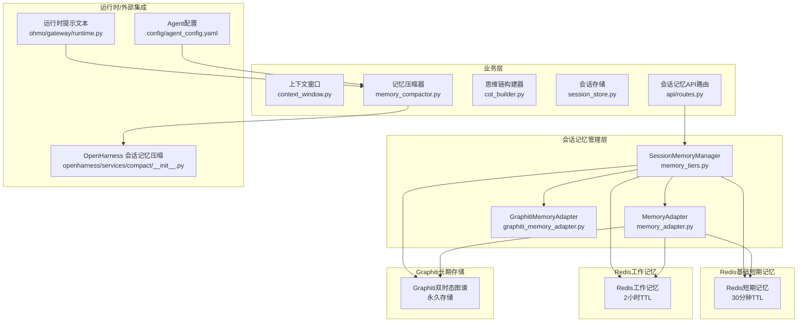
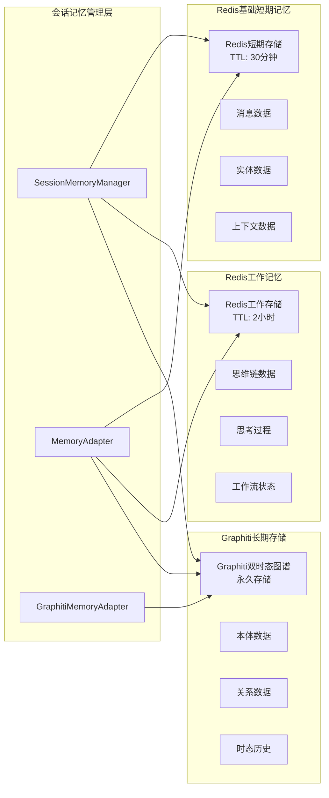
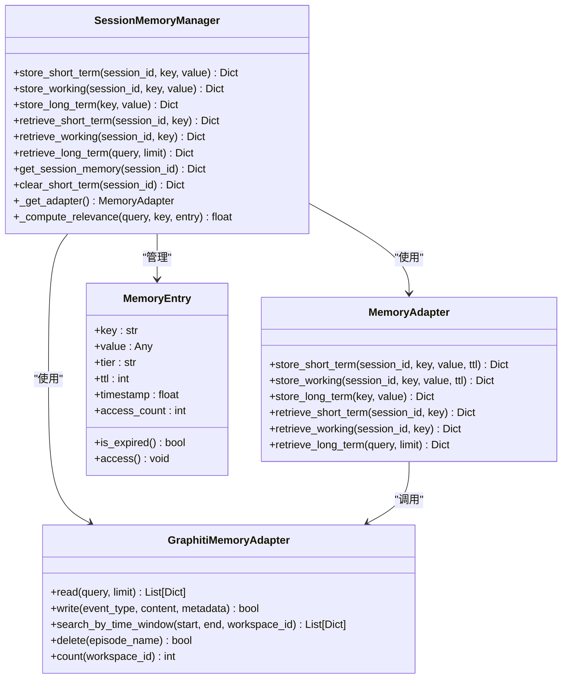
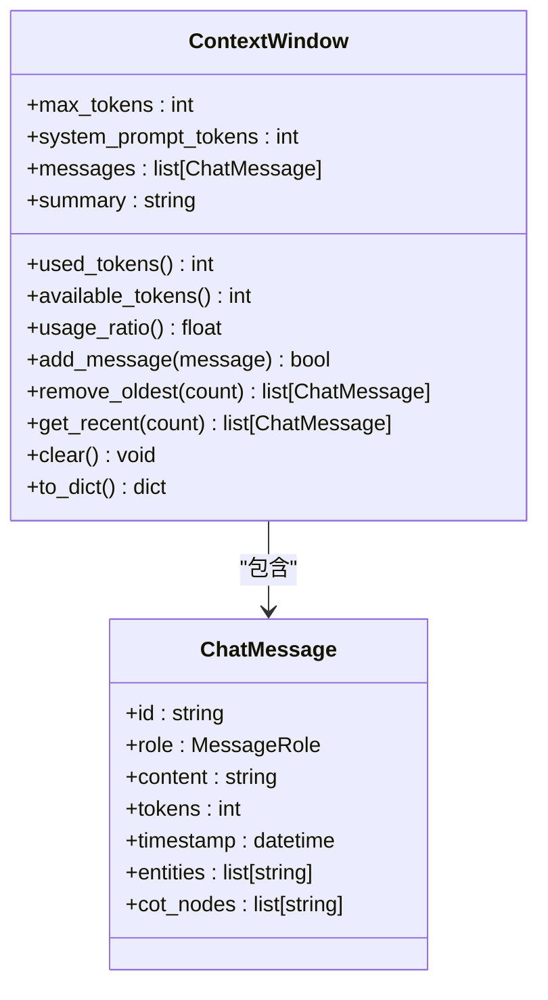
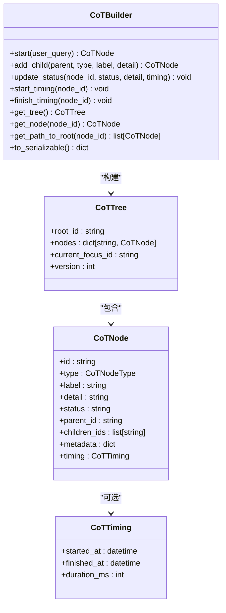
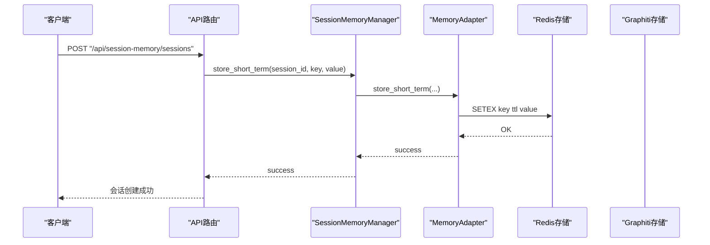
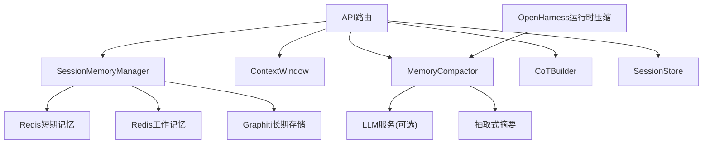

# 会话记忆

<cite>
**本文引用的文件**
- [会话记忆设计文档](file://docs/03-modules/session_memory/DESIGN.md)
- [上下文窗口](file://odap/biz/platform/session_memory/context_window.py)
- [记忆压缩器](file://odap/biz/platform/session_memory/memory_compactor.py)
- [思维链构建器](file://odap/biz/platform/session_memory/cot_builder.py)
- [会话存储](file://odap/biz/platform/session_memory/session_store.py)
- [会话记忆API路由](file://odap/biz/platform/session_memory/api/routes.py)
- [会话记忆管理层](file://odap/biz/platform/session_memory/memory_tiers.py)
- [会话记忆适配器](file://odap/biz/integration/openharness_agent/adapter/memory_adapter.py)
- [Graphiti长期记忆适配器](file://odap/infra/openharness/memory_adapter.py)
- [单元测试：会话记忆](file://tests/unit/test_session_memory.py)
- [OpenHarness 会话记忆压缩](file://openharness/src/openharness/services/compact/__init__.py)
- [会话记忆运行时提示文本](file://openharness/ohmo/gateway/runtime.py)
- [Agent配置](file://config/agent_config.yaml)
- [会话记忆搜索](file://openharness/src/openharness/memory/search.py)
- [Redis连接配置](file://odap/celery_app.py)
- [Docker Compose测试配置](file://docker/docker-compose.test.yml)
- [Graph服务](file://odap/infra/graph/graph_service.py)
</cite>

## 更新摘要
**所做更改**
- 新增Redis基础短期记忆和Redis工作记忆的三层记忆系统架构
- 新增Graphiti长期存储的Graphiti长期记忆适配器
- 更新会话记忆管理层以支持多层存储架构
- 新增Redis和Graphiti集成的技术实现细节
- 更新架构图以反映新的存储层次结构

## 目录
1. [简介](#简介)
2. [项目结构](#项目结构)
3. [核心组件](#核心组件)
4. [架构总览](#架构总览)
5. [组件详解](#组件详解)
6. [依赖关系分析](#依赖关系分析)
7. [性能考量](#性能考量)
8. [故障排查指南](#故障排查指南)
9. [结论](#结论)
10. [附录](#附录)

## 简介
本文件面向"会话记忆系统"，系统性阐述其分层存储架构（Redis基础短期记忆、Redis工作记忆、Graphiti长期存储）、上下文窗口管理、思维链构建与可视化、记忆压缩优化策略、会话状态持久化、并发访问控制与性能优化，并补充检索算法、存储策略与隐私保护要点。文档同时结合模块设计文档与核心实现文件，提供代码级图示与流程图，帮助读者快速理解与落地。

## 项目结构
会话记忆系统位于业务层，围绕"上下文窗口""记忆压缩""思维链构建""会话持久化"四大支柱展开，并通过FastAPI路由对外提供REST接口。系统现已升级为三层记忆架构：Redis基础短期记忆、Redis工作记忆和Graphiti长期存储，通过会话记忆管理层统一协调各层存储。

**图示来源**
- [会话记忆管理层:34-169](file://odap/biz/platform/session_memory/memory_tiers.py#L34-L169)
- [会话记忆适配器:13-93](file://odap/biz/integration/openharness_agent/adapter/memory_adapter.py#L13-L93)
- [Graphiti长期记忆适配器:8-64](file://odap/infra/openharness/memory_adapter.py#L8-L64)
- [会话记忆API路由:1-218](file://odap/biz/platform/session_memory/api/routes.py#L1-L218)

**章节来源**
- [会话记忆设计文档:1-576](file://docs/03-modules/session_memory/DESIGN.md#L1-L576)
- [会话记忆API路由:1-218](file://odap/biz/platform/session_memory/api/routes.py#L1-L218)

## 核心组件
- **Redis基础短期记忆**：基于Redis的短期记忆存储，支持30分钟TTL，用于存储会话级临时数据。
- **Redis工作记忆**：基于Redis的工作记忆存储，支持2小时TTL，用于存储会话级工作数据。
- **Graphiti长期存储**：基于Graphiti双时态图谱的长期记忆存储，支持永久存储和时态查询。
- **会话记忆管理层**：统一管理三层记忆的SessionMemoryManager，提供存储、检索、清理等功能。
- **记忆适配器**：MemoryAdapter负责协调Redis和Graphiti存储，实现数据同步和降级处理。
- **上下文窗口**：以token为单位的窗口容量与使用统计，支持添加消息、移除最早消息、获取最近消息、清空与导出统计。
- **记忆压缩器**：基于使用率阈值触发压缩，保留最近若干条消息并生成摘要，支持LLM摘要与抽取式摘要回退。
- **思维链构建器**：树形结构的推理节点管理，支持状态更新、计时、路径回溯、序列化输出。
- **会话存储**：SQLite持久化，保存会话标题、消息列表、上下文窗口、思维链数据等。
- **API路由**：提供创建/查询/追加消息/压缩/构建思维链/删除会话等REST接口。
- **运行时压缩**：OpenHarness侧提供轻量确定性压缩，用于长会话在进入LLM压缩前的快速降本。

**章节来源**
- [会话记忆管理层:34-169](file://odap/biz/platform/session_memory/memory_tiers.py#L34-L169)
- [会话记忆适配器:13-93](file://odap/biz/integration/openharness_agent/adapter/memory_adapter.py#L13-L93)
- [Graphiti长期记忆适配器:8-64](file://odap/infra/openharness/memory_adapter.py#L8-L64)
- [上下文窗口:1-78](file://odap/biz/platform/session_memory/context_window.py#L1-L78)
- [记忆压缩器:1-77](file://odap/biz/platform/session_memory/memory_compactor.py#L1-L77)
- [思维链构建器:1-151](file://odap/biz/platform/session_memory/cot_builder.py#L1-L151)
- [会话存储:1-151](file://odap/biz/platform/session_memory/session_store.py#L1-L151)
- [会话记忆API路由:1-218](file://odap/biz/platform/session_memory/api/routes.py#L1-L218)

## 架构总览
会话记忆系统采用"Redis基础短期记忆 + Redis工作记忆 + Graphiti长期存储"的三层架构：
- **Redis基础短期记忆**：Redis短期存储，30分钟TTL，用于会话级临时数据。
- **Redis工作记忆**：Redis工作存储，2小时TTL，用于会话级工作数据。
- **Graphiti长期存储**：Graphiti双时态图谱，永久存储，支持时态查询和关系分析。

**图示来源**
- [会话记忆管理层:42-50](file://odap/biz/platform/session_memory/memory_tiers.py#L42-L50)
- [会话记忆适配器:21-27](file://odap/biz/integration/openharness_agent/adapter/memory_adapter.py#L21-L27)
- [Graphiti长期记忆适配器:11-19](file://odap/infra/openharness/memory_adapter.py#L11-L19)

## 组件详解

### 会话记忆管理层
会话记忆管理层是整个三层记忆系统的核心协调者，负责管理Redis短期记忆、Redis工作记忆和Graphiti长期存储之间的数据流转和同步。

**图示来源**
- [会话记忆管理层:34-169](file://odap/biz/platform/session_memory/memory_tiers.py#L34-L169)
- [会话记忆适配器:13-93](file://odap/biz/integration/openharness_agent/adapter/memory_adapter.py#L13-L93)
- [Graphiti长期记忆适配器:8-64](file://odap/infra/openharness/memory_adapter.py#L8-L64)

**章节来源**
- [会话记忆管理层:34-169](file://odap/biz/platform/session_memory/memory_tiers.py#L34-L169)

### Redis基础短期记忆
Redis基础短期记忆用于存储会话的临时数据，具有30分钟TTL，适合存储短期对话状态、临时变量等数据。

**章节来源**
- [会话记忆管理层:48-70](file://odap/biz/platform/session_memory/memory_tiers.py#L48-L70)
- [会话记忆适配器:29-39](file://odap/biz/integration/openharness_agent/adapter/memory_adapter.py#L29-L39)

### Redis工作记忆
Redis工作记忆用于存储会话的工作数据，具有2小时TTL，适合存储思维链、工作流状态、思考过程等数据。

**章节来源**
- [会话记忆管理层:49-83](file://odap/biz/platform/session_memory/memory_tiers.py#L49-L83)
- [会话记忆适配器:41-51](file://odap/biz/integration/openharness_agent/adapter/memory_adapter.py#L41-L51)

### Graphiti长期存储
Graphiti长期存储基于双时态图谱，提供永久存储和强大的时态查询能力，适合存储重要的本体数据、关系数据和历史记录。

**章节来源**
- [会话记忆适配器:56-66](file://odap/biz/integration/openharness_agent/adapter/memory_adapter.py#L56-L66)
- [Graphiti长期记忆适配器:21-37](file://odap/infra/openharness/memory_adapter.py#L21-L37)

### 上下文窗口管理
- 关键属性：最大token、系统prompt占用、消息列表、摘要字符串。
- 核心方法：添加消息（含容量校验）、移除最早N条、获取最近N条、清空、导出统计。
- 使用率阈值：用于触发压缩判断。

**图示来源**
- [上下文窗口:11-78](file://odap/biz/platform/session_memory/context_window.py#L11-L78)

**章节来源**
- [上下文窗口:1-78](file://odap/biz/platform/session_memory/context_window.py#L1-L78)

### 记忆压缩策略
- 触发条件：使用率超过阈值（默认70%）。
- 压缩策略：保留最近若干条消息，对更早消息生成摘要；支持LLM摘要与抽取式摘要回退。
- 回退逻辑：当LLM不可用或失败时，采用抽取式摘要拼接。

**图示来源**
- [记忆压缩器:9-77](file://odap/biz/platform/session_memory/memory_compactor.py#L9-L77)

**章节来源**
- [记忆压缩器:1-77](file://odap/biz/platform/session_memory/memory_compactor.py#L1-L77)
- [会话记忆设计文档:94-125](file://docs/03-modules/session_memory/DESIGN.md#L94-L125)

### 思维链构建与可视化
- 数据模型：节点类型枚举、节点、计时、树根、当前焦点、版本号。
- 构建流程：从"意图识别"开始，逐步扩展"实体链接/上下文检索/RAG增强/LLM推理/工具调用/决策/综合回答"等节点。
- 序列化：输出树形结构供前端渲染，支持状态、时序、元数据展示。

**图示来源**
- [思维链构建器:11-151](file://odap/biz/platform/session_memory/cot_builder.py#L11-L151)

**章节来源**
- [思维链构建器:1-151](file://odap/biz/platform/session_memory/cot_builder.py#L1-L151)
- [会话记忆设计文档:159-286](file://docs/03-modules/session_memory/DESIGN.md#L159-L286)

### 会话持久化与API
- 持久化字段：会话ID、工作空间ID、标题、消息列表、上下文窗口、思维链数据、创建/更新时间、激活状态。
- SQLite表结构：主键ID、索引覆盖工作空间与激活状态。
- API能力：创建会话、列出会话、获取会话、追加消息（自动压缩）、获取上下文、手动压缩、构建思维链、删除会话。

**图示来源**
- [会话记忆API路由:17-28](file://odap/biz/platform/session_memory/api/routes.py#L17-L28)
- [会话记忆管理层:59-70](file://odap/biz/platform/session_memory/memory_tiers.py#L59-L70)
- [会话记忆适配器:31-39](file://odap/biz/integration/openharness_agent/adapter/memory_adapter.py#L31-L39)

**章节来源**
- [会话存储:1-151](file://odap/biz/platform/session_memory/session_store.py#L1-L151)
- [会话记忆API路由:1-218](file://odap/biz/platform/session_memory/api/routes.py#L1-L218)

### 运行时压缩与提示
- OpenHarness提供轻量确定性压缩，优先保留工具调用配对，避免破坏对话结构。
- 运行时提示文本根据压缩阶段与触发原因向用户反馈，提升透明度与体验。

**图示来源**
- [OpenHarness 会话记忆压缩:888-920](file://openharness/src/openharness/services/compact/__init__.py#L888-L920)
- [会话记忆运行时提示文本:635-654](file://openharness/ohmo/gateway/runtime.py#L635-L654)

**章节来源**
- [OpenHarness 会话记忆压缩:888-920](file://openharness/src/openharness/services/compact/__init__.py#L888-L920)
- [会话记忆运行时提示文本:635-654](file://openharness/ohmo/gateway/runtime.py#L635-L654)

### 记忆检索与搜索
- 会话记忆本身以SQLite存储，支持按工作空间与激活状态检索。
- OpenHarness提供项目级记忆搜索，基于标题/描述权重高于正文的启发式评分，便于在工程知识库中快速定位。
- Graphiti长期存储支持基于内容的全文搜索和时态查询。

**章节来源**
- [会话存储:98-121](file://odap/biz/platform/session_memory/session_store.py#L98-L121)
- [会话记忆搜索:12-41](file://openharness/src/openharness/memory/search.py#L12-L41)
- [Graphiti长期记忆适配器:21-23](file://odap/infra/openharness/memory_adapter.py#L21-L23)

## 依赖关系分析
- API路由依赖会话记忆管理层、上下文窗口、记忆压缩器、思维链构建器与会话存储。
- 会话记忆管理层协调Redis短期记忆、Redis工作记忆和Graphiti长期存储。
- 记忆压缩器可调用LLM服务进行摘要生成，失败时回退至抽取式摘要。
- OpenHarness运行时压缩与LLM压缩互补，前者降低后续LLM成本，后者提升摘要质量。

**图示来源**
- [会话记忆API路由:1-218](file://odap/biz/platform/session_memory/api/routes.py#L1-L218)
- [会话记忆管理层:34-169](file://odap/biz/platform/session_memory/memory_tiers.py#L34-L169)
- [记忆压缩器:35-61](file://odap/biz/platform/session_memory/memory_compactor.py#L35-L61)

**章节来源**
- [会话记忆API路由:1-218](file://odap/biz/platform/session_memory/api/routes.py#L1-L218)
- [会话记忆管理层:34-169](file://odap/biz/platform/session_memory/memory_tiers.py#L34-L169)
- [记忆压缩器:1-77](file://odap/biz/platform/session_memory/memory_compactor.py#L1-L77)

## 性能考量
- **Redis TTL策略**：短期记忆30分钟，工作记忆2小时，平衡数据新鲜度和存储成本。
- **会话窗口容量**：系统prompt占用与最大token共同决定可用token，建议结合模型参数动态调整。
- **压缩阈值与保留条数**：需权衡"上下文连贯性"与"token预算"，默认阈值与最近保留数可按场景调参。
- **LLM摘要依赖**：摘要生成依赖外部服务，失败回退至抽取式摘要，保障稳定性。
- **运行时压缩优化**：在进入LLM压缩前先行降本，减少LLM调用频率与成本。
- **SQLite索引优化**：覆盖工作空间与激活状态，提升列表查询效率。
- **Graphiti查询优化**：利用双时态特性和图遍历能力，支持复杂的关系查询和时态分析。

**章节来源**
- [会话记忆管理层:48-50](file://odap/biz/platform/session_memory/memory_tiers.py#L48-L50)
- [上下文窗口:29-48](file://odap/biz/platform/session_memory/context_window.py#L29-L48)
- [记忆压缩器:9-17](file://odap/biz/platform/session_memory/memory_compactor.py#L9-L17)
- [会话存储:43-62](file://odap/biz/platform/session_memory/session_store.py#L43-L62)
- [OpenHarness 会话记忆压缩:888-920](file://openharness/src/openharness/services/compact/__init__.py#L888-L920)

## 故障排查指南
- **Redis连接问题**：检查REDIS_URL环境变量配置，确认Redis服务正常运行。
- **Graphiti连接问题**：检查Neo4j连接配置，确认Graphiti服务可用。
- **短期记忆失效**：确认TTL设置正确，检查Redis数据是否过期。
- **工作记忆异常**：检查TTL设置和Redis存储状态。
- **长期存储写入失败**：检查Graphiti连接状态和权限配置。
- **添加消息失败**：检查消息token是否超过可用token，日志会记录警告。
- **压缩未触发**：确认使用率是否超过阈值，或消息数量是否小于保留条数。
- **LLM摘要失败**：检查环境变量与API密钥配置，系统会回退至抽取式摘要。
- **会话加载为空**：确认会话ID是否存在，或是否已被软删除（is_active=false）。
- **删除会话无效**：确认会话ID存在且删除成功，受影响行数大于0。

**章节来源**
- [Redis连接配置:5-8](file://odap/celery_app.py#L5-L8)
- [Docker Compose测试配置:78](file://docker/docker-compose.test.yml#L78)
- [Graph服务:108-110](file://odap/infra/graph/graph_service.py#L108-L110)
- [上下文窗口:49-54](file://odap/biz/platform/session_memory/context_window.py#L49-L54)
- [记忆压缩器:35-61](file://odap/biz/platform/session_memory/memory_compactor.py#L35-L61)
- [会话存储:123-131](file://odap/biz/platform/session_memory/session_store.py#L123-L131)
- [单元测试：会话记忆:14-181](file://tests/unit/test_session_memory.py#L14-L181)

## 结论
会话记忆系统通过"Redis基础短期记忆 + Redis工作记忆 + Graphiti长期存储"的三层架构，实现了高性能、高可靠性的会话管理。Redis层提供快速的短期数据存储，Graphiti层提供强大的长期存储和时态查询能力。会话记忆管理层统一协调各层存储，确保数据的一致性和完整性。运行时压缩与LLM压缩协同，兼顾性能与质量；API路由提供完整的CRUD能力；OpenHarness侧的轻量压缩进一步优化长会话体验。建议在实际部署中结合业务场景调优Redis TTL和Graphiti查询策略，并完善监控与回退机制。

## 附录
- **Redis配置**：REDIS_URL环境变量配置，支持Docker和本地开发环境。
- **Graphiti配置**：Neo4j连接配置，支持双时态知识图谱特性。
- **相关模块与文档**：会话记忆设计文档、QA引擎与可视化模块设计、全链路架构文档。
- **配置参考**：Agent配置文件中模型与参数设置，影响token估算与LLM摘要质量。

**章节来源**
- [Redis连接配置:5-8](file://odap/celery_app.py#L5-L8)
- [Docker Compose测试配置:78](file://docker/docker-compose.test.yml#L78)
- [会话记忆设计文档:569-576](file://docs/03-modules/session_memory/DESIGN.md#L569-L576)
- [Agent配置:1-23](file://config/agent_config.yaml#L1-L23)