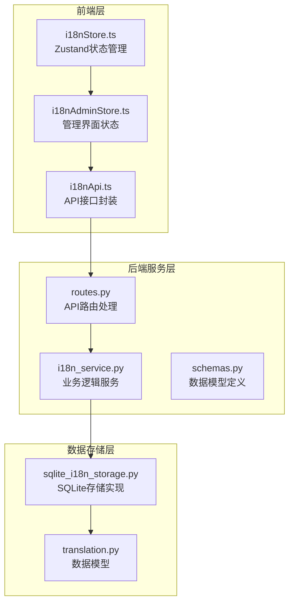
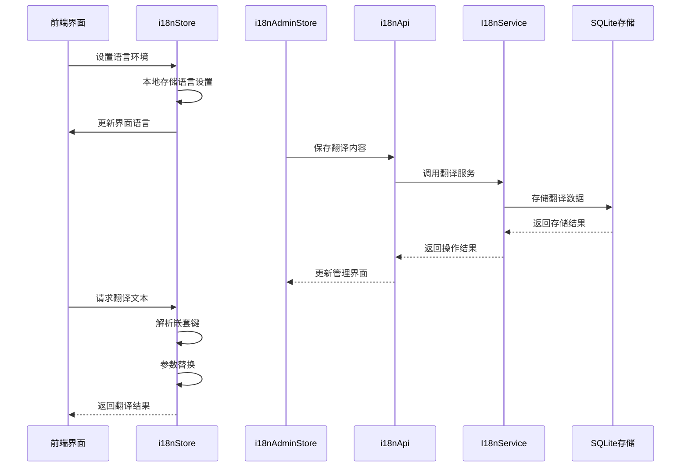
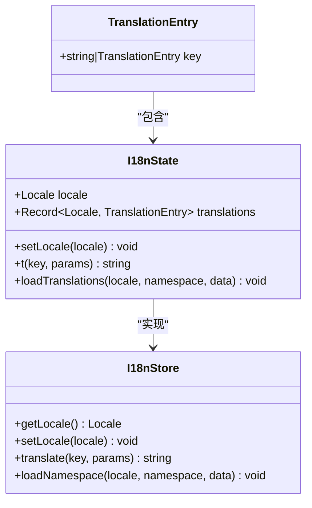
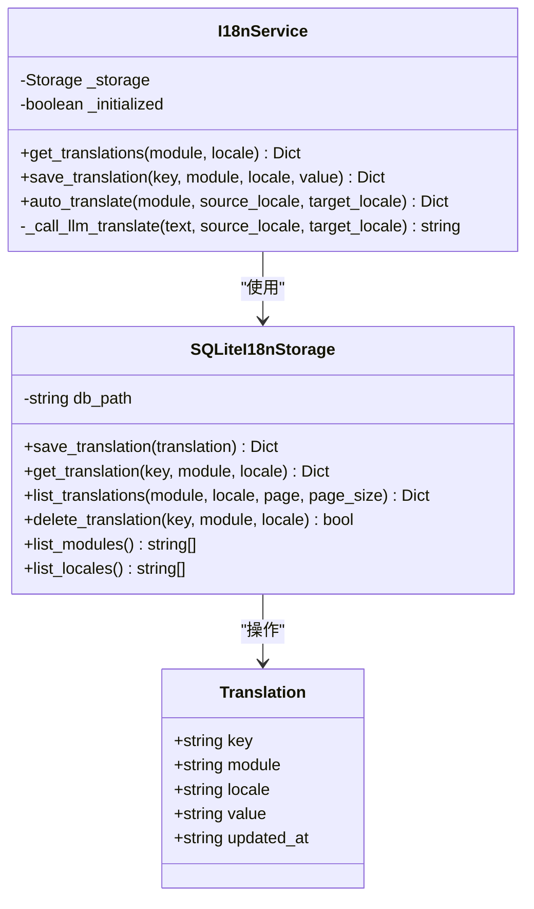
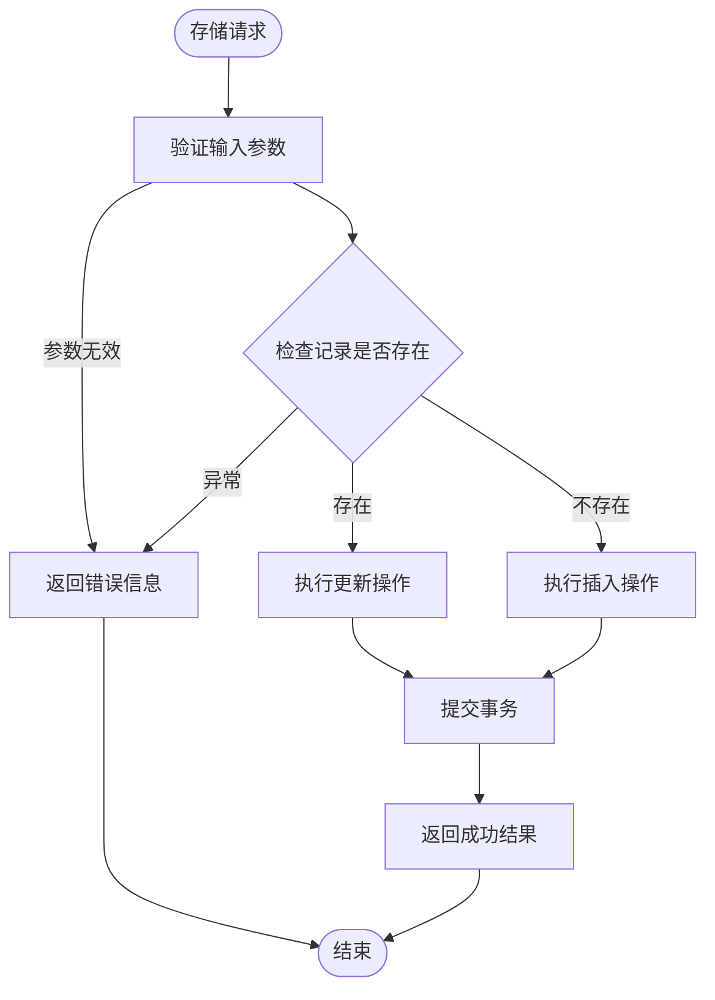
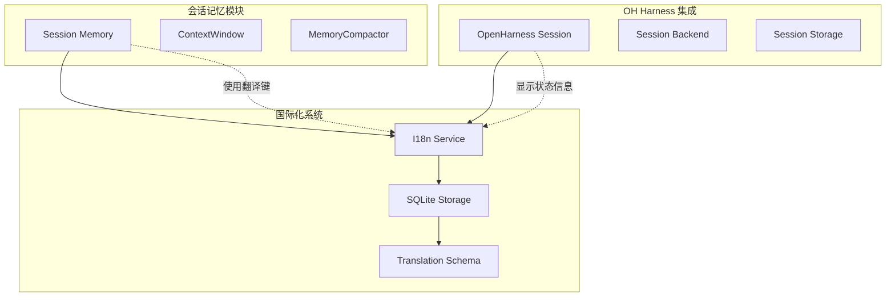

# 国际化存储系统

<cite>
**本文档引用的文件**
- [i18nStore.ts](file://frontend/src/modules/shared/stores/i18nStore.ts)
- [i18nAdminStore.ts](file://frontend/src/modules/i18n-admin/stores/i18nAdminStore.ts)
- [i18nApi.ts](file://frontend/src/modules/i18n-admin/services/i18nApi.ts)
- [i18n_service.py](file://odap/biz/platform/i18n/services/i18n_service.py)
- [sqlite_i18n_storage.py](file://odap/biz/platform/i18n/storage/sqlite_i18n_storage.py)
- [translation.py](file://odap/biz/platform/i18n/models/translation.py)
- [schemas.py](file://odap/biz/platform/i18n/api/schemas.py)
- [routes.py](file://odap/biz/platform/i18n/api/routes.py)
- [test_i18n_service.py](file://tests/unit/test_i18n_service.py)
- [session_memory DESIGN.md](file://docs/03-modules/session_memory/DESIGN.md)
- [session_storage.py](file://openharness/src/openharness/services/session_storage.py)
- [session_backend.py](file://openharness/src/openharness/services/session_backend.py)
- [ohmo session_storage.py](file://openharness/ohmo/session_storage.py)
</cite>

## 目录
1. [简介](#简介)
2. [项目结构](#项目结构)
3. [核心组件](#核心组件)
4. [架构概览](#架构概览)
5. [详细组件分析](#详细组件分析)
6. [依赖关系分析](#依赖关系分析)
7. [性能考虑](#性能考虑)
8. [故障排除指南](#故障排除指南)
9. [结论](#结论)

## 简介

国际化存储系统是 Ontology Graphiti 项目中的一个关键基础设施组件，负责管理多语言文本资源的存储、检索和翻译功能。该系统采用前后端分离的设计模式，结合 SQLite 数据库存储和前端 Zustand 状态管理，为整个应用提供完整的国际化支持。

系统的核心目标包括：
- 提供多语言文本的统一存储和管理
- 支持动态翻译和自动翻译功能
- 实现模块化的翻译键值管理系统
- 提供完整的前端国际化界面
- 确保数据的一致性和完整性

## 项目结构

国际化存储系统在项目中采用模块化组织方式，主要分为前端存储层、后端服务层和数据存储层三个部分：

**图表来源**
- [i18nStore.ts:1-79](file://frontend/src/modules/shared/stores/i18nStore.ts#L1-L79)
- [i18n_service.py:1-119](file://odap/biz/platform/i18n/services/i18n_service.py#L1-L119)
- [sqlite_i18n_storage.py:1-160](file://odap/biz/platform/i18n/storage/sqlite_i18n_storage.py#L1-L160)

**章节来源**
- [i18nStore.ts:1-79](file://frontend/src/modules/shared/stores/i18nStore.ts#L1-L79)
- [i18n_service.py:1-119](file://odap/biz/platform/i18n/services/i18n_service.py#L1-L119)
- [sqlite_i18n_storage.py:1-160](file://odap/biz/platform/i18n/storage/sqlite_i18n_storage.py#L1-L160)

## 核心组件

### 前端国际化存储 (i18nStore)

前端国际化存储使用 Zustand 状态管理库实现，提供响应式的国际化状态管理功能。该组件支持本地存储、嵌套键解析和参数替换等特性。

主要功能特性：
- **本地存储支持**：自动保存用户选择的语言设置到 localStorage
- **嵌套键解析**：支持点分隔符的嵌套对象访问
- **参数替换**：支持模板字符串参数替换
- **命名空间管理**：按模块组织翻译资源

### 后端国际化服务 (I18nService)

后端国际化服务是系统的核心业务逻辑组件，采用单例模式确保全局唯一性。该服务提供完整的翻译管理功能，包括手动翻译和自动翻译。

核心功能：
- **翻译存储管理**：提供翻译键值对的增删改查操作
- **模块化管理**：支持按模块分类的翻译资源管理
- **自动翻译功能**：集成 LLM 实现批量翻译
- **数据验证**：确保翻译数据的完整性和一致性

### SQLite 存储实现

SQLite 存储层提供高性能的数据持久化能力，采用关系型数据库的优势来管理复杂的翻译数据结构。

存储特点：
- **主键约束**：key + module + locale 组合主键确保唯一性
- **索引优化**：针对常用查询条件建立索引
- **事务支持**：保证数据操作的原子性和一致性
- **灵活查询**：支持按模块、语言等多维度查询

**章节来源**
- [i18nStore.ts:41-78](file://frontend/src/modules/shared/stores/i18nStore.ts#L41-L78)
- [i18n_service.py:15-27](file://odap/biz/platform/i18n/services/i18n_service.py#L15-L27)
- [sqlite_i18n_storage.py:9-34](file://odap/biz/platform/i18n/storage/sqlite_i18n_storage.py#L9-L34)

## 架构概览

国际化存储系统采用分层架构设计，确保各层之间的职责分离和松耦合：

**图表来源**
- [i18nStore.ts:48-65](file://frontend/src/modules/shared/stores/i18nStore.ts#L48-L65)
- [i18nAdminStore.ts:46-71](file://frontend/src/modules/i18n-admin/stores/i18nAdminStore.ts#L46-L71)
- [i18n_service.py:34-38](file://odap/biz/platform/i18n/services/i18n_service.py#L34-L38)

系统架构的关键优势：
- **前后端分离**：前端专注于用户体验，后端专注业务逻辑
- **模块化设计**：各组件职责明确，易于维护和扩展
- **数据一致性**：通过存储层保证翻译数据的完整性和一致性
- **可扩展性**：支持添加新的语言和模块

## 详细组件分析

### 前端状态管理组件

前端状态管理组件基于 Zustand 库实现，提供轻量级的状态管理解决方案：

**图表来源**
- [i18nStore.ts:10-16](file://frontend/src/modules/shared/stores/i18nStore.ts#L10-L16)

组件特性：
- **类型安全**：使用 TypeScript 确保类型安全
- **响应式更新**：自动触发界面更新
- **本地持久化**：语言设置自动保存到浏览器
- **参数化翻译**：支持动态参数替换

### 后端服务组件

后端服务组件采用面向对象设计，提供完整的国际化管理功能：

**图表来源**
- [i18n_service.py:15-27](file://odap/biz/platform/i18n/services/i18n_service.py#L15-L27)
- [sqlite_i18n_storage.py:9-15](file://odap/biz/platform/i18n/storage/sqlite_i18n_storage.py#L9-L15)
- [translation.py:8-13](file://odap/biz/platform/i18n/models/translation.py#L8-L13)

服务层设计模式：
- **单例模式**：确保全局唯一的服务实例
- **依赖注入**：通过构造函数注入存储依赖
- **异常处理**：统一的异常处理和错误返回
- **日志记录**：详细的操作日志便于调试

### 数据存储组件

数据存储组件提供高性能的关系型数据存储能力：

**图表来源**
- [sqlite_i18n_storage.py:35-61](file://odap/biz/platform/i18n/storage/sqlite_i18n_storage.py#L35-L61)

存储层优化策略：
- **连接池管理**：合理管理数据库连接生命周期
- **事务控制**：确保数据操作的原子性
- **查询优化**：针对常用查询模式进行优化
- **错误恢复**：完善的异常处理和恢复机制

**章节来源**
- [i18nStore.ts:28-39](file://frontend/src/modules/shared/stores/i18nStore.ts#L28-L39)
- [i18n_service.py:85-116](file://odap/biz/platform/i18n/services/i18n_service.py#L85-L116)
- [sqlite_i18n_storage.py:82-131](file://odap/biz/platform/i18n/storage/sqlite_i18n_storage.py#L82-L131)

## 依赖关系分析

国际化存储系统与其他模块存在密切的依赖关系：

**图表来源**
- [session_memory DESIGN.md:1-576](file://docs/03-modules/session_memory/DESIGN.md#L1-L576)
- [session_storage.py:1-47](file://openharness/src/openharness/services/session_storage.py#L1-L47)

依赖关系特点：
- **双向依赖**：会话记忆模块和 OH Harness 都依赖国际化系统
- **数据共享**：翻译资源在多个模块间共享使用
- **状态同步**：语言设置变化影响所有依赖模块
- **接口隔离**：通过清晰的接口定义降低耦合度

**章节来源**
- [session_memory DESIGN.md:127-158](file://docs/03-modules/session_memory/DESIGN.md#L127-L158)
- [session_storage.py:18-47](file://openharness/src/openharness/services/session_storage.py#L18-L47)

## 性能考虑

国际化存储系统在设计时充分考虑了性能优化：

### 数据库性能优化
- **索引策略**：为 key、module、locale 字段建立复合索引
- **查询优化**：支持分页查询和条件过滤
- **连接管理**：使用连接池减少连接开销
- **事务批处理**：批量操作提升写入性能

### 前端性能优化
- **状态缓存**：本地缓存已加载的翻译资源
- **懒加载**：按需加载翻译模块
- **防抖处理**：避免频繁的状态更新
- **内存管理**：及时清理不需要的翻译数据

### 缓存策略
系统采用多层次缓存策略：
- **浏览器缓存**：localStorage 持久化语言设置
- **应用缓存**：内存中缓存已加载的翻译资源
- **CDN 缓存**：静态翻译文件的 CDN 加速

## 故障排除指南

### 常见问题及解决方案

**问题1：翻译数据无法保存**
- 检查数据库连接权限
- 验证存储路径可写性
- 确认网络连接正常

**问题2：语言切换不生效**
- 检查 localStorage 是否被禁用
- 验证 i18nStore 状态更新
- 确认翻译键值正确性

**问题3：自动翻译失败**
- 检查 OPENAI_API_KEY 环境变量
- 验证网络连接和代理设置
- 查看日志中的具体错误信息

### 调试工具和方法

系统提供了完善的调试支持：
- **日志记录**：详细的操作日志便于问题定位
- **单元测试**：覆盖核心功能的测试用例
- **错误监控**：异常情况的自动捕获和报告
- **性能监控**：关键操作的性能指标跟踪

**章节来源**
- [test_i18n_service.py:32-105](file://tests/unit/test_i18n_service.py#L32-L105)

## 结论

国际化存储系统作为 Ontology Graphiti 项目的重要组成部分，展现了优秀的架构设计和实现质量。系统通过合理的分层设计、清晰的接口定义和完善的错误处理机制，为整个应用提供了稳定可靠的国际化支持。

系统的主要优势包括：
- **架构清晰**：前后端分离，职责明确
- **扩展性强**：支持新增语言和模块
- **性能优秀**：优化的数据库和缓存策略
- **易于维护**：模块化设计便于代码维护

未来可以考虑的改进方向：
- 支持更多的翻译源和格式
- 增强翻译质量评估机制
- 优化大规模数据的处理能力
- 添加翻译版本管理和回滚功能