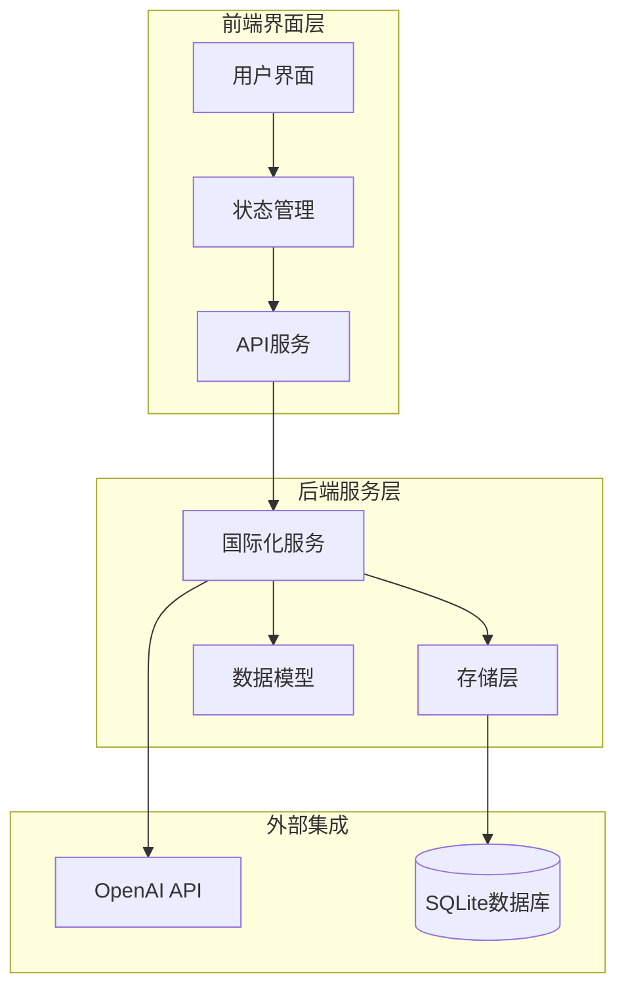
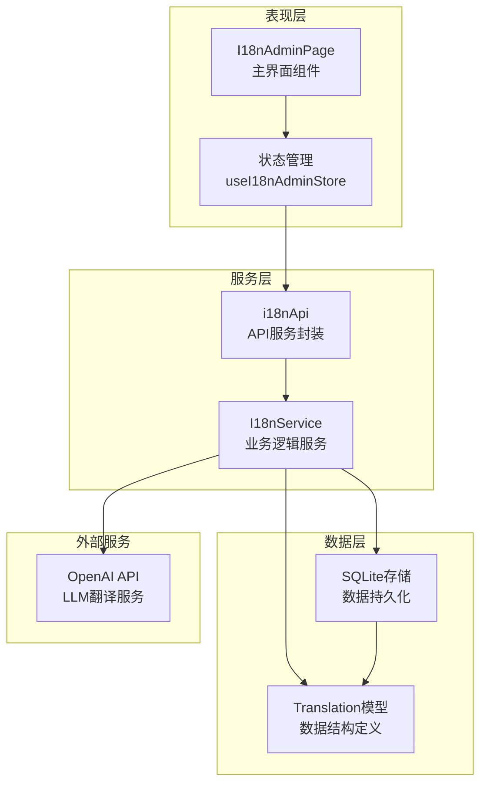
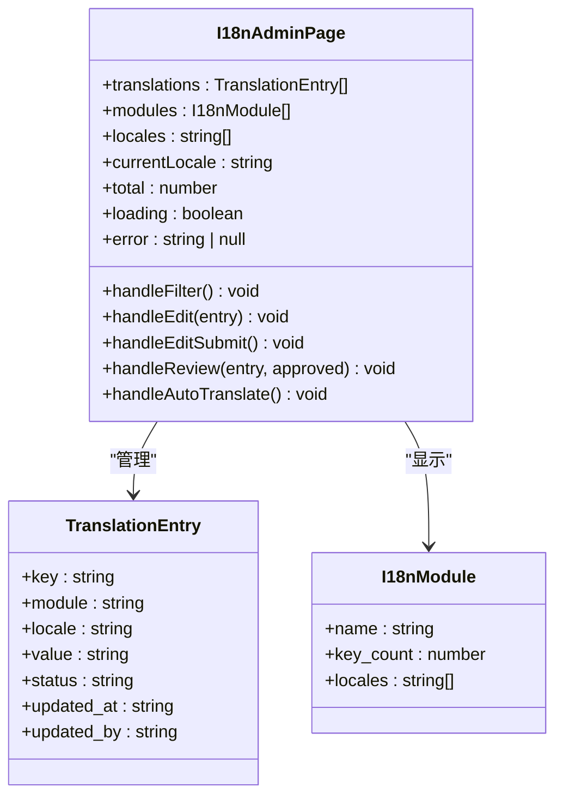
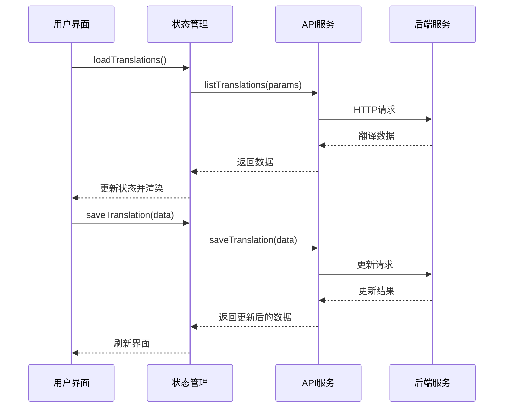
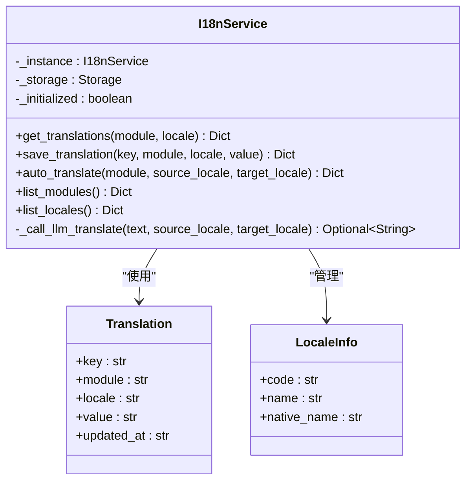
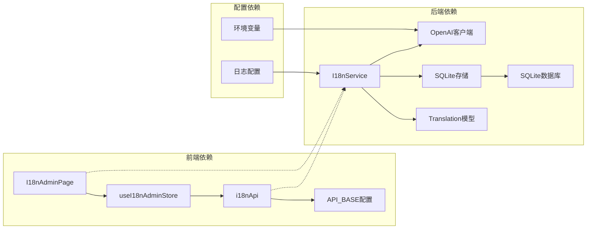

# 国际化管理后台系统

<cite>
**本文档引用的文件**
- [frontend/src/modules/i18n-admin/index.ts](file://frontend/src/modules/i18n-admin/index.ts)
- [frontend/src/modules/i18n-admin/pages/I18nAdminPage.tsx](file://frontend/src/modules/i18n-admin/pages/I18nAdminPage.tsx)
- [frontend/src/modules/i18n-admin/stores/i18nAdminStore.ts](file://frontend/src/modules/i18n-admin/stores/i18nAdminStore.ts)
- [frontend/src/modules/i18n-admin/services/i18nApi.ts](file://frontend/src/modules/i18n-admin/services/i18nApi.ts)
- [odap/biz/platform/i18n/services/i18n_service.py](file://odap/biz/platform/i18n/services/i18n_service.py)
- [odap/biz/platform/i18n/models/translation.py](file://odap/biz/platform/i18n/models/translation.py)
- [specs/001-odap-platform/plan.md](file://specs/001-odap-platform/plan.md)
- [specs/001-odap-platform/tasks.md](file://specs/001-odap-platform/tasks.md)
</cite>

## 目录
1. [简介](#简介)
2. [项目结构](#项目结构)
3. [核心组件](#核心组件)
4. [架构概览](#架构概览)
5. [详细组件分析](#详细组件分析)
6. [依赖关系分析](#依赖关系分析)
7. [性能考虑](#性能考虑)
8. [故障排除指南](#故障排除指南)
9. [结论](#结论)

## 简介

国际化管理后台系统是一个完整的多语言支持解决方案，为本体图数据库平台提供翻译管理和本地化功能。该系统采用前后端分离架构，结合React前端界面和Python后端服务，实现了翻译条目的增删改查、LLM自动翻译、人工审核等核心功能。

系统支持模块化的翻译管理，每个功能模块可以独立维护自己的翻译文件，并提供共享翻译资源。通过集成OpenAI API，系统能够实现高效的批量翻译功能，大大提升了多语言内容的管理效率。

## 项目结构

国际化管理后台系统采用模块化的设计理念，主要分为前端界面层和后端服务层两个核心部分：

**图表来源**
- [frontend/src/modules/i18n-admin/pages/I18nAdminPage.tsx:1-345](file://frontend/src/modules/i18n-admin/pages/I18nAdminPage.tsx#L1-L345)
- [frontend/src/modules/i18n-admin/stores/i18nAdminStore.ts:1-94](file://frontend/src/modules/i18n-admin/stores/i18nAdminStore.ts#L1-L94)
- [odap/biz/platform/i18n/services/i18n_service.py:1-134](file://odap/biz/platform/i18n/services/i18n_service.py#L1-L134)

系统的核心文件组织结构如下：

- **前端模块** (`frontend/src/modules/i18n-admin/`)
  - `pages/` - 页面组件
  - `stores/` - 状态管理
  - `services/` - API服务封装
  - `components/` - 可复用组件

- **后端模块** (`odap/biz/platform/i18n/`)
  - `services/` - 业务逻辑服务
  - `models/` - 数据模型定义
  - `storage/` - 数据持久化
  - `api/` - API路由定义

**章节来源**
- [frontend/src/modules/i18n-admin/index.ts:1-2](file://frontend/src/modules/i18n-admin/index.ts#L1-L2)
- [specs/001-odap-platform/plan.md:788-821](file://specs/001-odap-platform/plan.md#L788-L821)

## 核心组件

国际化管理后台系统包含以下核心组件：

### 前端组件
- **I18nAdminPage** - 主要的管理界面，提供翻译条目的展示和编辑功能
- **useI18nAdminStore** - 状态管理，负责数据获取、缓存和UI状态同步
- **i18nApi** - API服务封装，提供统一的HTTP请求接口

### 后端组件
- **I18nService** - 核心业务服务，处理翻译逻辑和LLM集成
- **Translation** - 数据模型，定义翻译条目的结构
- **SQLiteI18nStorage** - 存储实现，基于SQLite的数据持久化

### 关键特性
- 实时翻译编辑和审核流程
- LLM自动翻译功能
- 模块化翻译管理
- 支持多种语言环境
- 完整的错误处理和状态管理

**章节来源**
- [frontend/src/modules/i18n-admin/pages/I18nAdminPage.tsx:23-37](file://frontend/src/modules/i18n-admin/pages/I18nAdminPage.tsx#L23-L37)
- [frontend/src/modules/i18n-admin/stores/i18nAdminStore.ts:5-21](file://frontend/src/modules/i18n-admin/stores/i18nAdminStore.ts#L5-L21)
- [odap/biz/platform/i18n/services/i18n_service.py:15-28](file://odap/biz/platform/i18n/services/i18n_service.py#L15-L28)

## 架构概览

系统采用分层架构设计，确保了良好的可维护性和扩展性：

**图表来源**
- [frontend/src/modules/i18n-admin/pages/I18nAdminPage.tsx:1-345](file://frontend/src/modules/i18n-admin/pages/I18nAdminPage.tsx#L1-L345)
- [frontend/src/modules/i18n-admin/stores/i18nAdminStore.ts:1-94](file://frontend/src/modules/i18n-admin/stores/i18nAdminStore.ts#L1-L94)
- [frontend/src/modules/i18n-admin/services/i18nApi.ts:1-57](file://frontend/src/modules/i18n-admin/services/i18nApi.ts#L1-L57)
- [odap/biz/platform/i18n/services/i18n_service.py:1-134](file://odap/biz/platform/i18n/services/i18n_service.py#L1-L134)

### 数据流设计

系统的数据流遵循清晰的单向数据流模式：

1. **用户交互** → **状态管理** → **API调用** → **业务服务** → **数据持久化**
2. **数据持久化** → **业务服务** → **API响应** → **状态更新** → **界面渲染**

这种设计确保了数据的一致性和可预测性，便于调试和维护。

**章节来源**
- [frontend/src/modules/i18n-admin/stores/i18nAdminStore.ts:32-44](file://frontend/src/modules/i18n-admin/stores/i18nAdminStore.ts#L32-L44)
- [frontend/src/modules/i18n-admin/services/i18nApi.ts:23-31](file://frontend/src/modules/i18n-admin/services/i18nApi.ts#L23-L31)

## 详细组件分析

### 前端界面组件

#### I18nAdminPage 组件分析

I18nAdminPage 是整个管理后台的核心界面组件，采用了现代化的React Hooks模式：

**图表来源**
- [frontend/src/modules/i18n-admin/pages/I18nAdminPage.tsx:23-37](file://frontend/src/modules/i18n-admin/pages/I18nAdminPage.tsx#L23-L37)
- [frontend/src/modules/i18n-admin/services/i18nApi.ts:6-20](file://frontend/src/modules/i18n-admin/services/i18nApi.ts#L6-L20)

组件的主要功能包括：

1. **翻译条目管理** - 展示、筛选、编辑翻译内容
2. **模块化管理** - 支持按模块和语言进行筛选
3. **人工审核流程** - 提供翻译内容的审核和批准功能
4. **LLM自动翻译** - 集成AI翻译服务，批量生成翻译内容

#### 状态管理系统

useI18nAdminStore 实现了集中式的状态管理：

**图表来源**
- [frontend/src/modules/i18n-admin/stores/i18nAdminStore.ts:32-61](file://frontend/src/modules/i18n-admin/stores/i18nAdminStore.ts#L32-L61)
- [frontend/src/modules/i18n-admin/services/i18nApi.ts:23-37](file://frontend/src/modules/i18n-admin/services/i18nApi.ts#L23-L37)

**章节来源**
- [frontend/src/modules/i18n-admin/pages/I18nAdminPage.tsx:1-345](file://frontend/src/modules/i18n-admin/pages/I18nAdminPage.tsx#L1-L345)
- [frontend/src/modules/i18n-admin/stores/i18nAdminStore.ts:1-94](file://frontend/src/modules/i18n-admin/stores/i18nAdminStore.ts#L1-L94)

### 后端服务组件

#### I18nService 业务逻辑

I18nService 是系统的核心业务服务，实现了完整的翻译管理功能：

**图表来源**
- [odap/biz/platform/i18n/services/i18n_service.py:15-28](file://odap/biz/platform/i18n/services/i18n_service.py#L15-L28)
- [odap/biz/platform/i18n/models/translation.py:8-19](file://odap/biz/platform/i18n/models/translation.py#L8-L19)

服务的主要职责包括：

1. **翻译管理** - 提供翻译条目的CRUD操作
2. **LLM集成** - 调用OpenAI API进行自动翻译
3. **模块管理** - 管理各个功能模块的翻译资源
4. **语言支持** - 维护支持的语言列表和信息

#### 数据模型设计

Translation 和 LocaleInfo 模型定义了系统的核心数据结构：

| 字段名 | 类型 | 描述 | 必需 |
|--------|------|------|------|
| key | string | 翻译键标识 | 是 |
| module | string | 所属模块 | 是 |
| locale | string | 语言代码 | 是 |
| value | string | 翻译内容 | 是 |
| updated_at | string | 更新时间 | 否 |
| name | string | 语言名称 | 否 |
| native_name | string | 本地语言名称 | 否 |

**章节来源**
- [odap/biz/platform/i18n/services/i18n_service.py:85-116](file://odap/biz/platform/i18n/services/i18n_service.py#L85-L116)
- [odap/biz/platform/i18n/models/translation.py:1-20](file://odap/biz/platform/i18n/models/translation.py#L1-L20)

### API 接口设计

系统提供了RESTful API接口，支持完整的翻译管理功能：

| 接口 | 方法 | 描述 | 请求参数 | 响应数据 |
|------|------|------|----------|----------|
| `/api/i18n/translations` | GET | 获取翻译列表 | module, locale, page, page_size | translations[], total |
| `/api/i18n/translations` | PUT | 保存翻译 | key, module, locale, value | TranslationEntry |
| `/api/i18n/translations/auto-translate` | POST | LLM自动翻译 | module, source_locale, target_locale | {translated_count: number} |
| `/api/i18n/modules` | GET | 获取模块列表 | - | {modules: I18nModule[]} |
| `/api/i18n/locales` | GET | 获取语言列表 | - | {locales: string[]} |

**章节来源**
- [frontend/src/modules/i18n-admin/services/i18nApi.ts:22-56](file://frontend/src/modules/i18n-admin/services/i18nApi.ts#L22-L56)
- [specs/001-odap-platform/tasks.md:177-189](file://specs/001-odap-platform/tasks.md#L177-L189)

## 依赖关系分析

系统各组件之间的依赖关系清晰明确，遵循了单一职责原则：

**图表来源**
- [frontend/src/modules/i18n-admin/pages/I18nAdminPage.tsx:1-8](file://frontend/src/modules/i18n-admin/pages/I18nAdminPage.tsx#L1-L8)
- [frontend/src/modules/i18n-admin/services/i18nApi.ts:1-4](file://frontend/src/modules/i18n-admin/services/i18nApi.ts#L1-L4)
- [odap/biz/platform/i18n/services/i18n_service.py:1-7](file://odap/biz/platform/i18n/services/i18n_service.py#L1-L7)

### 外部依赖

系统对外部服务的依赖主要包括：

1. **OpenAI API** - 提供LLM翻译服务
2. **SQLite数据库** - 存储翻译数据
3. **Ant Design** - UI组件库
4. **Zustand** - 状态管理库

这些依赖关系确保了系统的功能完整性，同时保持了良好的可替换性。

**章节来源**
- [odap/biz/platform/i18n/services/i18n_service.py:89-98](file://odap/biz/platform/i18n/services/i18n_service.py#L89-L98)
- [frontend/src/modules/i18n-admin/stores/i18nAdminStore.ts:1-3](file://frontend/src/modules/i18n-admin/stores/i18nAdminStore.ts#L1-L3)

## 性能考虑

系统在设计时充分考虑了性能优化：

### 前端性能优化
- **状态局部化** - 使用Zustand实现细粒度的状态管理
- **懒加载** - 按需加载翻译数据，避免一次性加载大量数据
- **虚拟滚动** - 对于大量翻译条目，使用虚拟滚动提升渲染性能
- **缓存策略** - 实现数据缓存，减少重复请求

### 后端性能优化
- **批量处理** - LLM翻译采用批量处理，提高效率
- **连接池** - 数据库连接池管理，减少连接开销
- **异步处理** - 长耗时操作采用异步处理
- **索引优化** - 为常用查询字段建立数据库索引

### 缓存策略
- **内存缓存** - 热点数据缓存在内存中
- **浏览器缓存** - 前端静态资源缓存
- **CDN加速** - 静态资源通过CDN分发

## 故障排除指南

### 常见问题及解决方案

#### LLM翻译失败
**症状**：自动翻译功能无法正常工作
**可能原因**：
- OpenAI API密钥配置错误
- 网络连接问题
- API配额限制

**解决步骤**：
1. 检查环境变量 `OPENAI_API_KEY` 是否正确配置
2. 验证网络连接是否正常
3. 确认API配额是否充足
4. 查看后端日志获取详细错误信息

#### 翻译数据加载失败
**症状**：翻译列表无法显示或显示空白
**可能原因**：
- 数据库连接异常
- API接口返回错误
- 前端状态管理异常

**解决步骤**：
1. 检查数据库连接状态
2. 验证API接口可用性
3. 清除浏览器缓存
4. 重启应用服务

#### 状态同步问题
**症状**：界面显示与实际数据不一致
**解决步骤**：
1. 强制刷新页面数据
2. 检查状态管理器是否正常工作
3. 验证API响应格式是否正确

**章节来源**
- [odap/biz/platform/i18n/services/i18n_service.py:113-115](file://odap/biz/platform/i18n/services/i18n_service.py#L113-L115)
- [frontend/src/modules/i18n-admin/stores/i18nAdminStore.ts:41-43](file://frontend/src/modules/i18n-admin/stores/i18nAdminStore.ts#L41-L43)

## 结论

国际化管理后台系统是一个功能完整、架构清晰的多语言支持解决方案。系统通过前后端分离的设计，实现了高效的翻译管理功能，包括：

1. **完整的翻译管理** - 支持翻译条目的全生命周期管理
2. **智能翻译辅助** - 集成LLM自动翻译，大幅提升工作效率
3. **模块化设计** - 支持按功能模块独立管理翻译资源
4. **用户友好界面** - 提供直观易用的管理界面
5. **可扩展架构** - 良好的设计便于功能扩展和维护

该系统为本体图数据库平台提供了坚实的国际化基础，支持多语言内容的高效管理和维护。通过持续的优化和改进，系统将继续为用户提供更好的国际化体验。