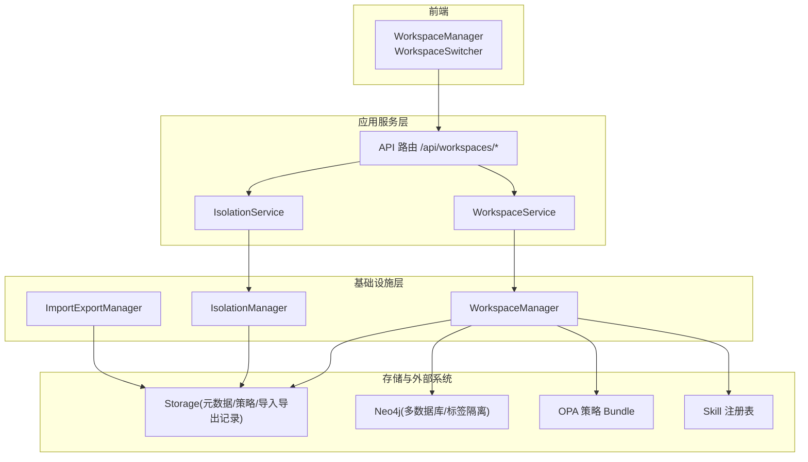
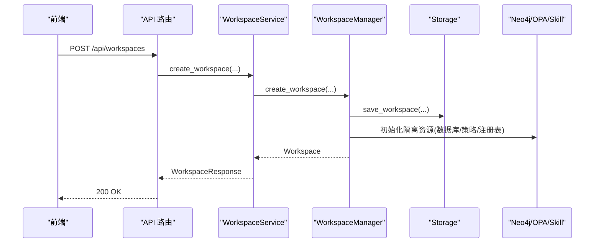
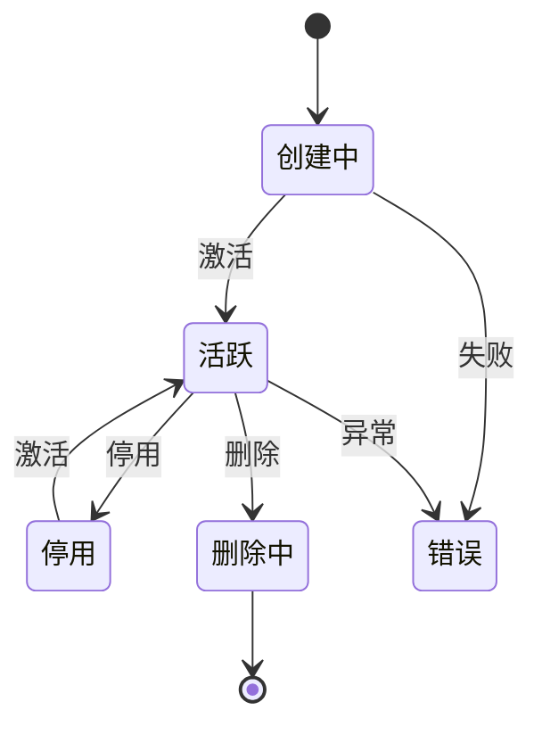
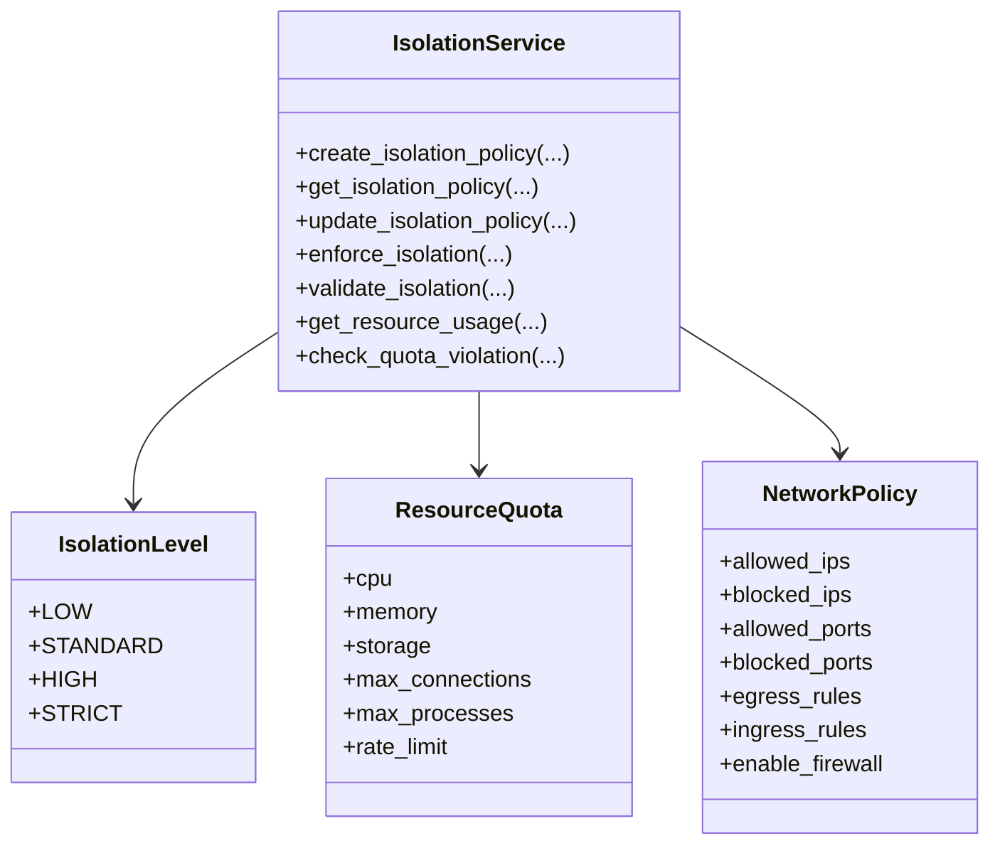
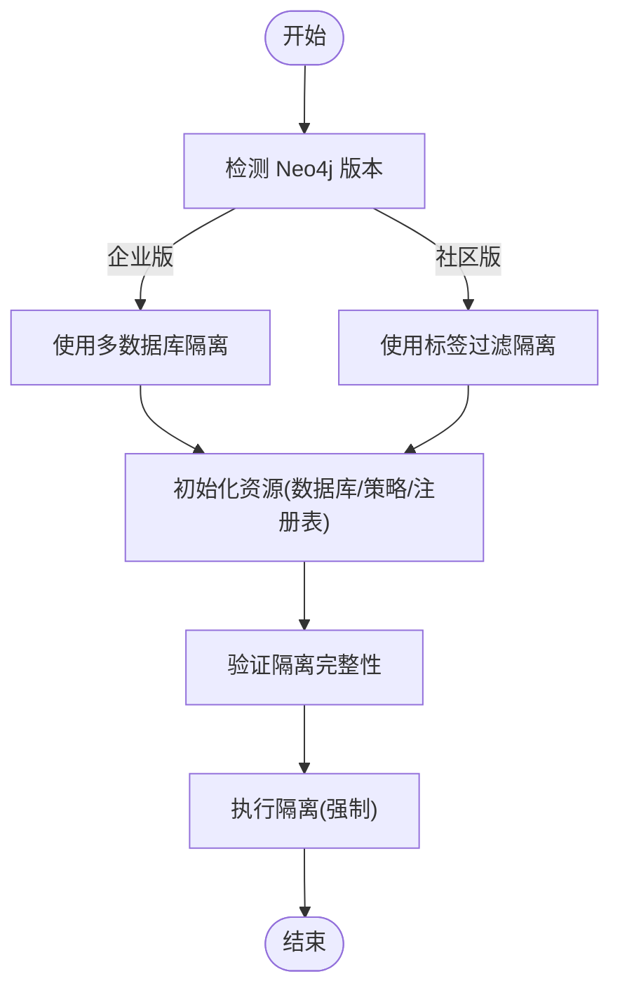
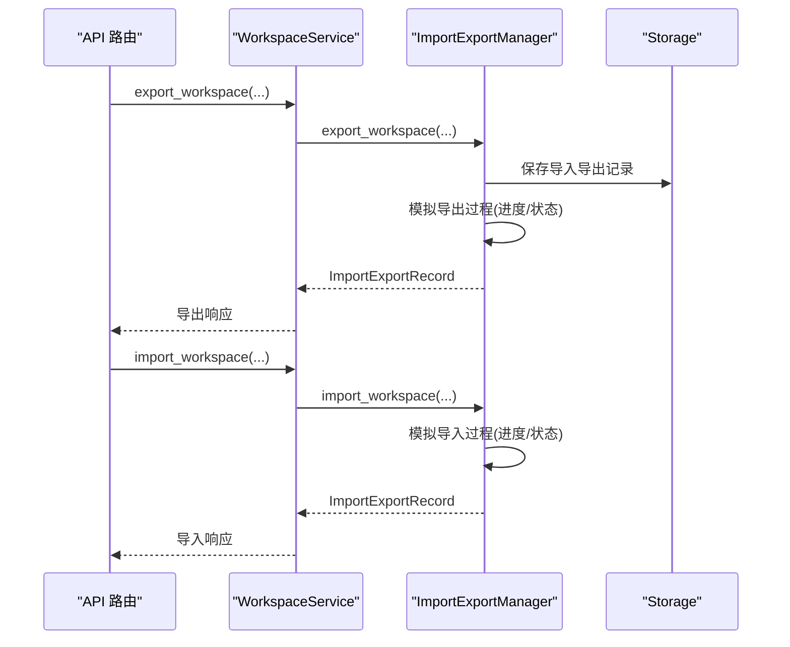
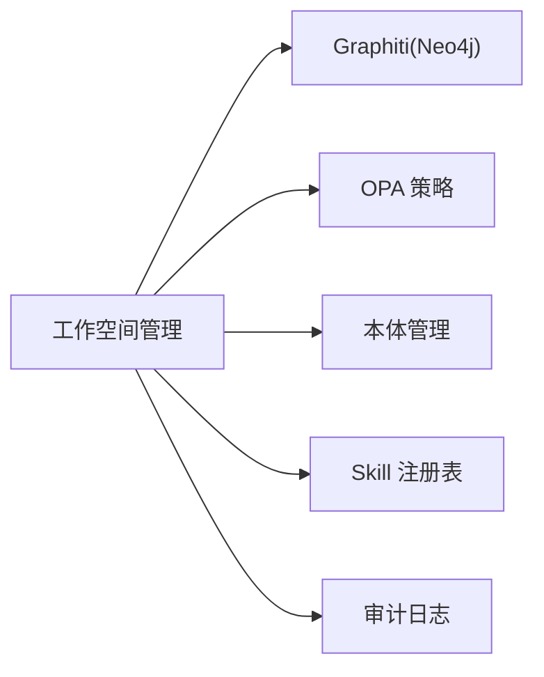

# 工作空间管理

<cite>
**本文引用的文件**
- [docs/03-modules/workspace/DESIGN.md](file://docs/03-modules/workspace/DESIGN.md)
- [docs/07-adr/ADR-041_workspace_resource_isolation.md](file://docs/07-adr/ADR-041_workspace_resource_isolation.md)
- [odap/biz/platform/workspace/models/workspace.py](file://odap/biz/platform/workspace/models/workspace.py)
- [odap/biz/platform/workspace/models/isolation.py](file://odap/biz/platform/workspace/models/isolation.py)
- [odap/biz/platform/workspace/api/schemas.py](file://odap/biz/platform/workspace/api/schemas.py)
- [odap/biz/platform/workspace/api/routes.py](file://odap/biz/platform/workspace/api/routes.py)
- [odap/biz/platform/workspace/services/workspace_service.py](file://odap/biz/platform/workspace/services/workspace_service.py)
- [odap/biz/platform/workspace/services/isolation_service.py](file://odap/biz/platform/workspace/services/isolation_service.py)
- [odap/biz/platform/workspace/impl/workspace.py](file://odap/biz/platform/workspace/impl/workspace.py)
- [odap/biz/platform/workspace/impl/isolation.py](file://odap/biz/platform/workspace/impl/isolation.py)
- [odap/biz/platform/workspace/impl/import_export.py](file://odap/biz/platform/workspace/impl/import_export.py)
- [frontend/src/modules/workspace/pages/WorkspaceManager.tsx](file://frontend/src/modules/workspace/pages/WorkspaceManager.tsx)
- [frontend/src/modules/workspace/components/WorkspaceSwitcher.tsx](file://frontend/src/modules/workspace/components/WorkspaceSwitcher.tsx)
- [tests/unit/test_workspace.py](file://tests/unit/test_workspace.py)
- [tests/unit/test_storage_layers.py](file://tests/unit/test_storage_layers.py)
- [check_api.py](file://check_api.py)
</cite>

## 目录
1. [简介](#简介)
2. [项目结构](#项目结构)
3. [核心组件](#核心组件)
4. [架构总览](#架构总览)
5. [详细组件分析](#详细组件分析)
6. [依赖关系分析](#依赖关系分析)
7. [性能考量](#性能考量)
8. [故障排查指南](#故障排查指南)
9. [结论](#结论)
10. [附录](#附录)

## 简介
本文件系统化阐述工作空间管理系统的场景隔离机制、资源配额与多租户支持策略，覆盖工作空间的创建、切换、导入导出流程，隔离级别的配置选项（low/standard/high/strict），生命周期管理、权限继承机制、数据隔离原理与性能优化策略，并提供完整的API接口文档与使用示例。

## 项目结构
工作空间管理模块位于 ODAP 平台 L1 基础设施层，向上通过 API 网关暴露 REST 接口，向下与存储、图数据库、策略引擎、技能注册表等基础设施协作，形成“工作空间上下文”驱动的多场景隔离运行时。

**图表来源**
- [docs/03-modules/workspace/DESIGN.md:25-42](file://docs/03-modules/workspace/DESIGN.md#L25-L42)
- [odap/biz/platform/workspace/api/routes.py:20-29](file://odap/biz/platform/workspace/api/routes.py#L20-L29)

**章节来源**
- [docs/03-modules/workspace/DESIGN.md:23-42](file://docs/03-modules/workspace/DESIGN.md#L23-L42)
- [odap/biz/platform/workspace/api/routes.py:20-29](file://odap/biz/platform/workspace/api/routes.py#L20-L29)

## 核心组件
- 工作空间模型与配置：定义工作空间状态、类型、配置（含隔离级别、资源配额、网络策略、环境变量、特性开关）。
- 隔离级别与策略：支持 low/standard/high/strict 四级隔离，结合资源配额与网络策略实现多维隔离。
- 服务与实现：WorkspaceService/IsolationService/ImportExportManager 分别封装业务逻辑与具体实现。
- API 路由：提供工作空间 CRUD、切换、资源使用、导入导出、场景管理等接口。
- 前端组件：工作空间管理面板与切换器，支撑用户操作。

**章节来源**
- [odap/biz/platform/workspace/models/workspace.py:10-52](file://odap/biz/platform/workspace/models/workspace.py#L10-L52)
- [odap/biz/platform/workspace/models/isolation.py:8-35](file://odap/biz/platform/workspace/models/isolation.py#L8-L35)
- [odap/biz/platform/workspace/api/schemas.py:13-18](file://odap/biz/platform/workspace/api/schemas.py#L13-L18)
- [odap/biz/platform/workspace/services/workspace_service.py:10-304](file://odap/biz/platform/workspace/services/workspace_service.py#L10-L304)
- [odap/biz/platform/workspace/services/isolation_service.py:8-122](file://odap/biz/platform/workspace/services/isolation_service.py#L8-L122)
- [odap/biz/platform/workspace/impl/workspace.py:10-178](file://odap/biz/platform/workspace/impl/workspace.py#L10-L178)
- [odap/biz/platform/workspace/impl/isolation.py:9-112](file://odap/biz/platform/workspace/impl/isolation.py#L9-L112)
- [odap/biz/platform/workspace/impl/import_export.py:10-164](file://odap/biz/platform/workspace/impl/import_export.py#L10-L164)
- [frontend/src/modules/workspace/pages/WorkspaceManager.tsx:21-556](file://frontend/src/modules/workspace/pages/WorkspaceManager.tsx#L21-L556)
- [frontend/src/modules/workspace/components/WorkspaceSwitcher.tsx:7-79](file://frontend/src/modules/workspace/components/WorkspaceSwitcher.tsx#L7-L79)

## 架构总览
工作空间管理的核心是“上下文绑定”。每次请求或 Agent 操作都会关联到一个 WorkspaceContext，所有基础设施组件通过该上下文确定资源边界，从而实现数据、策略、配置的场景级隔离。

**图表来源**
- [docs/03-modules/workspace/DESIGN.md:142-160](file://docs/03-modules/workspace/DESIGN.md#L142-L160)
- [odap/biz/platform/workspace/services/workspace_service.py:17-55](file://odap/biz/platform/workspace/services/workspace_service.py#L17-L55)
- [odap/biz/platform/workspace/impl/workspace.py:16-36](file://odap/biz/platform/workspace/impl/workspace.py#L16-L36)

## 详细组件分析

### 工作空间模型与生命周期
- 状态机：CREATING → ACTIVE → INACTIVE → DELETING → ERROR（软删除与归档预留）。
- 类型：DEFAULT/SHARED/PRIVATE/TEMPORARY，用于区分用途与权限范围。
- 生命周期：创建、激活/停用、成员管理、绑定/解绑本体、删除（软删除）。
- 配置：隔离级别、资源配额、网络策略、环境变量、特性开关。

**图表来源**
- [odap/biz/platform/workspace/models/workspace.py:10-16](file://odap/biz/platform/workspace/models/workspace.py#L10-L16)

**章节来源**
- [odap/biz/platform/workspace/models/workspace.py:10-52](file://odap/biz/platform/workspace/models/workspace.py#L10-L52)
- [odap/biz/platform/workspace/impl/workspace.py:76-113](file://odap/biz/platform/workspace/impl/workspace.py#L76-L113)

### 隔离级别与资源配额
- 隔离级别：low/standard/high/strict，分别对应不同的资源限制与网络控制强度。
- 资源配额：CPU、内存、存储、最大连接数、最大进程数、速率限制等。
- 网络策略：允许/阻断 IP/端口、防火墙开关、出入站规则等。
- 验证与执行：通过 IsolationService 对策略进行创建、获取、更新、强制执行、验证与资源使用情况检查。

**图表来源**
- [odap/biz/platform/workspace/models/isolation.py:8-35](file://odap/biz/platform/workspace/models/isolation.py#L8-L35)
- [odap/biz/platform/workspace/services/isolation_service.py:14-121](file://odap/biz/platform/workspace/services/isolation_service.py#L14-L121)

**章节来源**
- [odap/biz/platform/workspace/models/isolation.py:8-35](file://odap/biz/platform/workspace/models/isolation.py#L8-L35)
- [odap/biz/platform/workspace/services/isolation_service.py:14-121](file://odap/biz/platform/workspace/services/isolation_service.py#L14-L121)
- [odap/biz/platform/workspace/impl/isolation.py:15-112](file://odap/biz/platform/workspace/impl/isolation.py#L15-L112)

### 资源隔离策略（多租户）
- 设计依据：基于 ADR-041，采用“混合隔离”策略（Neo4j 多数据库优先，社区版回退到标签过滤；OPA 策略按工作空间路径隔离；Skill 注册表按命名空间隔离；本体版本按工作空间关联）。
- 隔离验证：定期验证数据库独立性、策略隔离、文件存储隔离与跨空间数据泄露风险。
- 策略切换：通过环境变量控制 Neo4j 版本，支持从标签隔离平滑迁移到数据库隔离。

**图表来源**
- [docs/07-adr/ADR-041_workspace_resource_isolation.md:46-80](file://docs/07-adr/ADR-041_workspace_resource_isolation.md#L46-L80)

**章节来源**
- [docs/07-adr/ADR-041_workspace_resource_isolation.md:12-44](file://docs/07-adr/ADR-041_workspace_resource_isolation.md#L12-L44)
- [docs/07-adr/ADR-041_workspace_resource_isolation.md:46-80](file://docs/07-adr/ADR-041_workspace_resource_isolation.md#L46-L80)

### 导入/导出与模板
- 导出包格式：.owp 包含 manifest.json、ontology、skills、policies、data、config 等。
- 导入策略：支持 skip/overwrite/rename/merge/ask 等冲突处理策略。
- 模板：从现有工作空间创建不含实例数据的模板，便于快速复制。

**图表来源**
- [odap/biz/platform/workspace/api/routes.py:239-272](file://odap/biz/platform/workspace/api/routes.py#L239-L272)
- [odap/biz/platform/workspace/services/workspace_service.py:240-303](file://odap/biz/platform/workspace/services/workspace_service.py#L240-L303)
- [odap/biz/platform/workspace/impl/import_export.py:16-101](file://odap/biz/platform/workspace/impl/import_export.py#L16-L101)

**章节来源**
- [docs/03-modules/workspace/DESIGN.md:237-298](file://docs/03-modules/workspace/DESIGN.md#L237-L298)
- [odap/biz/platform/workspace/impl/import_export.py:10-164](file://odap/biz/platform/workspace/impl/import_export.py#L10-L164)

### 权限继承与多租户
- 访问控制：基于 OPA ABAC 策略，权限键为 workspace:{action}，结合用户与工作空间上下文进行校验。
- 成员与共享：支持成员管理与本体共享（同一本体被多个工作空间共享时标记来源与共享范围）。
- 软删除与审计：默认软删除，配合审计日志追踪所有工作空间操作。

**章节来源**
- [docs/03-modules/workspace/DESIGN.md:519-530](file://docs/03-modules/workspace/DESIGN.md#L519-L530)
- [odap/biz/platform/workspace/impl/workspace.py:169-178](file://odap/biz/platform/workspace/impl/workspace.py#L169-L178)

### 前端交互与使用示例
- 工作空间管理面板：支持创建、编辑、激活/停用、删除、场景管理、构建图谱等。
- 工作空间切换器：下拉选择当前工作空间，支持新建与设置入口。
- 使用示例（通过 API）：
  - 列出工作空间：GET /api/workspaces?page_size=100
  - 创建工作空间：POST /api/workspaces
  - 切换工作空间：POST /api/workspaces/{id}/switch
  - 导出工作空间：POST /api/workspaces/import-export/export
  - 导入工作空间：POST /api/workspaces/import-export/import

**章节来源**
- [frontend/src/modules/workspace/pages/WorkspaceManager.tsx:21-556](file://frontend/src/modules/workspace/pages/WorkspaceManager.tsx#L21-L556)
- [frontend/src/modules/workspace/components/WorkspaceSwitcher.tsx:7-79](file://frontend/src/modules/workspace/components/WorkspaceSwitcher.tsx#L7-L79)
- [check_api.py:7-31](file://check_api.py#L7-L31)

## 依赖关系分析
- 依赖模块：Graphiti（Neo4j 数据库）、OPA（策略 Bundle）、本体管理（本体版本）、Skill（注册表）、审计日志（审计记录）。
- 事件流：创建工作空间 → 初始化隔离资源 → 记录审计日志；切换工作空间 → 更新上下文并通知各组件重新加载。

**图表来源**
- [docs/03-modules/workspace/DESIGN.md:519-530](file://docs/03-modules/workspace/DESIGN.md#L519-L530)

**章节来源**
- [docs/03-modules/workspace/DESIGN.md:519-550](file://docs/03-modules/workspace/DESIGN.md#L519-L550)

## 性能考量
- 目标指标：创建工作空间 < 5s；切换 < 2s；导出（含数据）< 30s（10K节点）；导入 < 60s（10K节点）。
- 优化策略：异步初始化资源、上下文缓存与预加载、流式导出与增量打包、批量写入与事务提交。
- 隔离策略：企业版推荐多数据库隔离以获得更强隔离与更好性能；社区版采用标签过滤作为过渡。

**章节来源**
- [docs/03-modules/workspace/DESIGN.md:609-617](file://docs/03-modules/workspace/DESIGN.md#L609-L617)
- [docs/07-adr/ADR-041_workspace_resource_isolation.md:30-44](file://docs/07-adr/ADR-041_workspace_resource_isolation.md#L30-L44)

## 故障排查指南
- 隔离策略缺失：若返回“隔离策略不存在”，需先创建策略再执行强制。
- 资源配额告警：通过检查配额违规接口获取 CPU/Memory/Storage 使用率与阈值。
- 导入导出异常：通过记录状态与错误信息定位问题，必要时取消任务并重试。
- 单元测试参考：包含工作空间 CRUD、成员管理、绑定/解绑本体、隔离策略创建与验证、资源使用与配额检查等测试用例。

**章节来源**
- [odap/biz/platform/workspace/services/isolation_service.py:38-51](file://odap/biz/platform/workspace/services/isolation_service.py#L38-L51)
- [odap/biz/platform/workspace/impl/isolation.py:95-112](file://odap/biz/platform/workspace/impl/isolation.py#L95-L112)
- [odap/biz/platform/workspace/impl/import_export.py:122-136](file://odap/biz/platform/workspace/impl/import_export.py#L122-L136)
- [tests/unit/test_workspace.py:137-255](file://tests/unit/test_workspace.py#L137-L255)
- [tests/unit/test_storage_layers.py:64-72](file://tests/unit/test_storage_layers.py#L64-L72)

## 结论
工作空间管理通过“上下文绑定 + 混合隔离策略 + 多租户权限控制 + 完整的导入导出与模板体系”，实现了多场景并行的强隔离与灵活复用。结合性能优化与完善的审计与测试体系，满足从开发到生产的多样化需求。

## 附录

### API 接口文档（摘要）
- 工作空间
  - GET /api/workspaces
  - POST /api/workspaces
  - GET /api/workspaces/{id}
  - PUT /api/workspaces/{id}
  - DELETE /api/workspaces/{id}
  - POST /api/workspaces/{id}/activate
  - POST /api/workspaces/{id}/deactivate
  - POST /api/workspaces/{id}/members/{user_id}
  - DELETE /api/workspaces/{id}/members/{user_id}
- 隔离策略
  - POST /api/workspaces/isolation/policies
  - GET /api/workspaces/isolation/policies/{workspace_id}
  - GET /api/workspaces/isolation/resource-usage/{workspace_id}
  - POST /api/workspaces/isolation/enforce/{workspace_id}
- 导入导出
  - POST /api/workspaces/import-export/export
  - POST /api/workspaces/import-export/import
  - GET /api/workspaces/import-export/records/{record_id}
  - GET /api/workspaces/import-export/records
  - POST /api/workspaces/import-export/records/{record_id}/cancel

**章节来源**
- [docs/03-modules/workspace/DESIGN.md:473-491](file://docs/03-modules/workspace/DESIGN.md#L473-L491)
- [odap/biz/platform/workspace/api/routes.py:32-350](file://odap/biz/platform/workspace/api/routes.py#L32-L350)

### 使用示例（命令行）
- 列出工作空间：python check_api.py
- 获取工作空间下的场景列表：python check_api.py

**章节来源**
- [check_api.py:7-31](file://check_api.py#L7-L31)