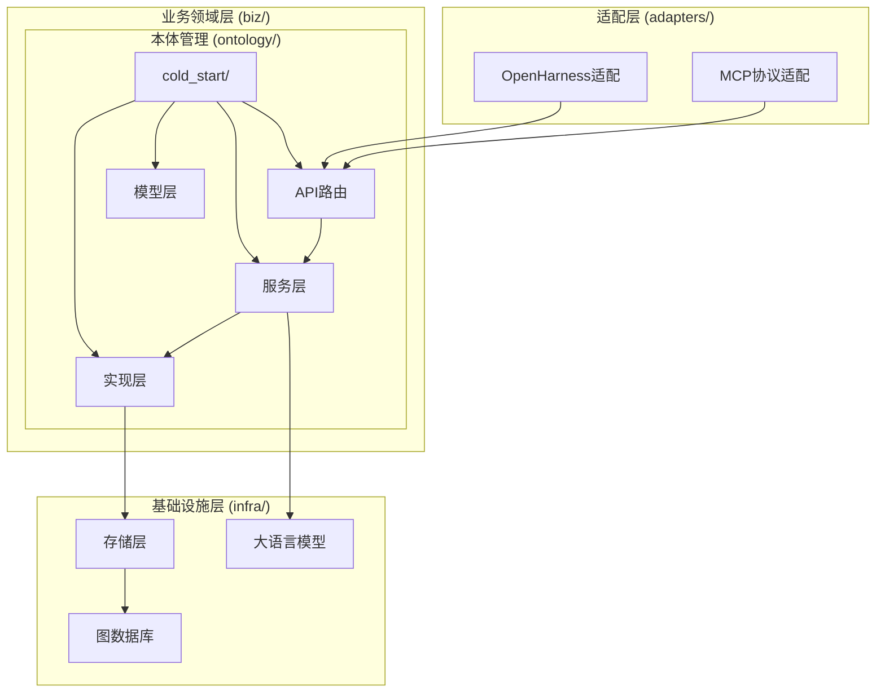
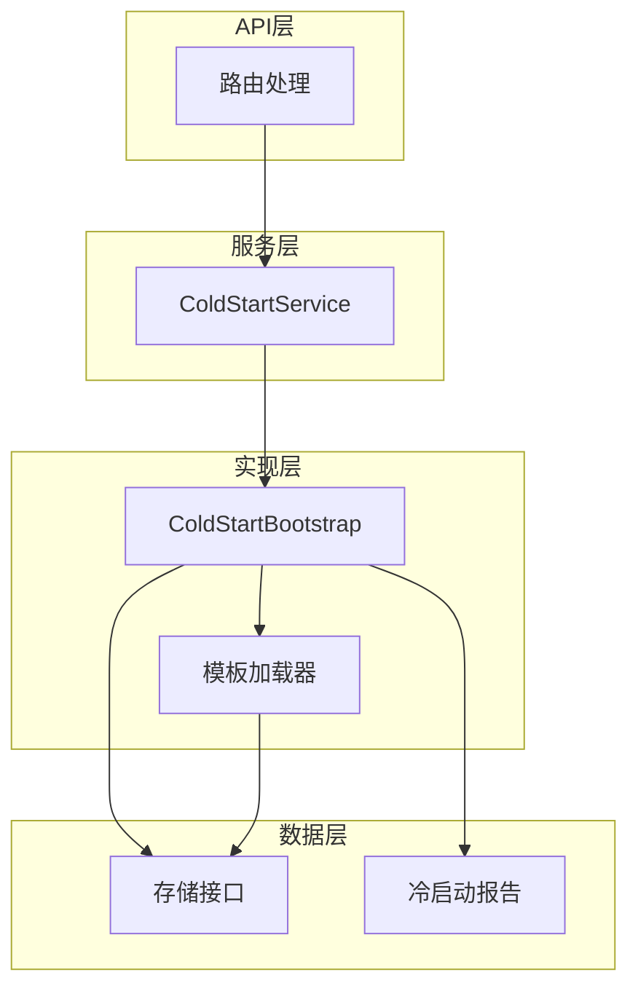
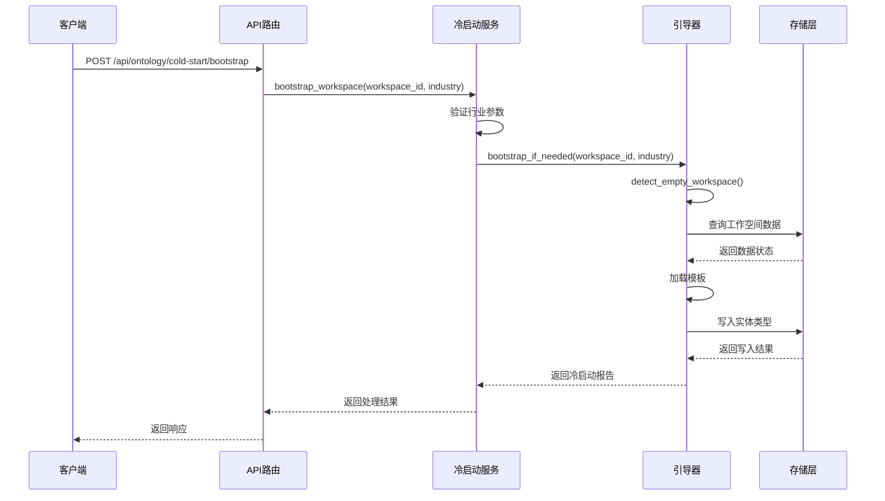
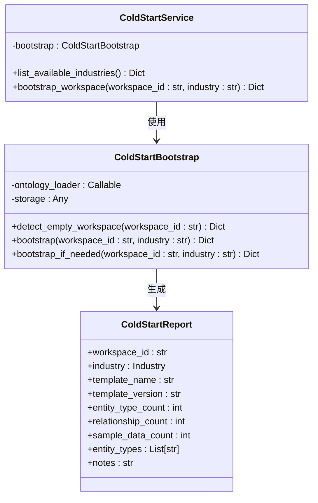
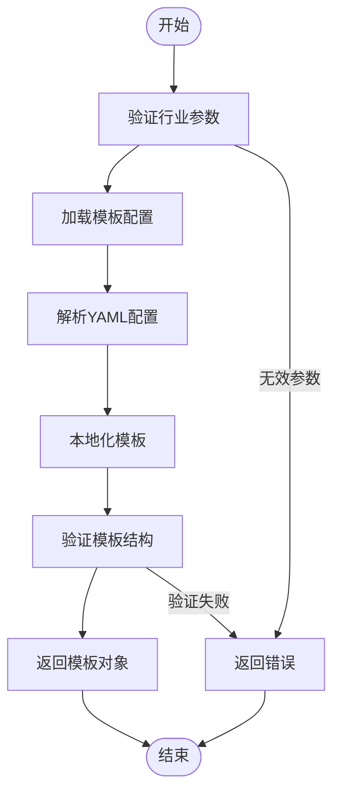
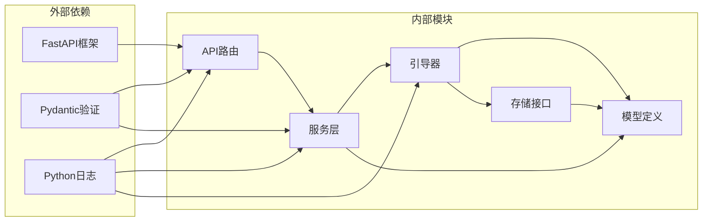

# 冷启动模板管理系统

<cite>
**本文档引用的文件**
- [routes.py](file://odap/biz/core/ontology/cold_start/api/routes.py)
- [cold_start_service.py](file://odap/biz/core/ontology/cold_start/services/cold_start_service.py)
- [bootstrap.py](file://odap/biz/core/ontology/cold_start/impl/bootstrap.py)
- [test_cold_start.py](file://tests/unit/test_cold_start.py)
- [DESIGN.md](file://docs/03-modules/ontology_management_engine/DESIGN.md)
- [ARCHITECTURE.md](file://docs/02-architecture/ARCHITECTURE.md)
- [RESTRUCTURE_PLAN.md](file://docs/02-architecture/reports/RESTRUCTURE_PLAN.md)
- [__init__.py](file://odap/biz/core/ontology/cold_start/__init__.py)
</cite>

## 目录
1. [简介](#简介)
2. [项目结构](#项目结构)
3. [核心组件](#核心组件)
4. [架构概览](#架构概览)
5. [详细组件分析](#详细组件分析)
6. [依赖关系分析](#依赖关系分析)
7. [性能考虑](#性能考虑)
8. [故障排除指南](#故障排除指南)
9. [结论](#结论)

## 简介

冷启动模板管理系统是本体图数据库平台中的一个关键模块，专门用于为新创建的工作空间提供快速启动和初始化功能。该系统通过预定义的行业模板，为用户提供完整的本体结构、实体类型、关系定义和示例数据，从而避免用户从零开始构建本体的繁琐过程。

该系统的核心价值在于：
- **加速新用户上手**：通过行业标准模板减少初始配置时间
- **确保一致性**：标准化的模板保证不同工作空间的本体结构一致性
- **降低学习成本**：提供可直接使用的示例数据和结构
- **提高效率**：避免重复劳动，专注于业务逻辑而非基础设施

## 项目结构

冷启动模板管理系统在整体架构中位于业务领域层（biz/），遵循四层架构设计原则：

**图表来源**
- [ARCHITECTURE.md](file://docs/02-architecture/ARCHITECTURE.md)
- [RESTRUCTURE_PLAN.md](file://docs/02-architecture/reports/RESTRUCTURE_PLAN.md)

**章节来源**
- [ARCHITECTURE.md](file://docs/02-architecture/ARCHITECTURE.md)
- [RESTRUCTURE_PLAN.md](file://docs/02-architecture/reports/RESTRUCTURE_PLAN.md)

## 核心组件

冷启动模板管理系统由四个主要层次构成，每个层次都有明确的职责分工：

### 1. API层（接口层）
负责HTTP请求处理和响应格式化，提供RESTful API接口。

### 2. 服务层（编排层）
作为业务逻辑的协调者，负责参数验证、流程控制和错误处理。

### 3. 实现层（核心逻辑层）
包含具体的业务实现，包括工作空间检测、模板加载和数据写入。

### 4. 模型层（数据层）
定义数据结构和验证规则，确保数据的一致性和完整性。

**章节来源**
- [routes.py](file://odap/biz/core/ontology/cold_start/api/routes.py)
- [cold_start_service.py](file://odap/biz/core/ontology/cold_start/services/cold_start_service.py)
- [bootstrap.py](file://odap/biz/core/ontology/cold_start/impl/bootstrap.py)

## 架构概览

系统采用分层架构设计，严格遵循依赖方向原则，确保模块间的松耦合和高内聚：

**图表来源**
- [routes.py](file://odap/biz/core/ontology/cold_start/api/routes.py)
- [cold_start_service.py](file://odap/biz/core/ontology/cold_start/services/cold_start_service.py)
- [bootstrap.py](file://odap/biz/core/ontology/cold_start/impl/bootstrap.py)

## 详细组件分析

### API路由组件

API路由组件提供了两个核心接口，分别用于行业列表查询和工作空间冷启动触发：

#### 接口定义

| 接口 | 方法 | 描述 |
|------|------|------|
| `/api/ontology/cold-start/industries` | GET | 获取可用的行业模板列表 |
| `/api/ontology/cold-start/bootstrap` | POST | 触发工作空间冷启动引导 |

#### 请求参数

**bootstrap 工作流序列图**

**图表来源**
- [routes.py](file://odap/biz/core/ontology/cold_start/api/routes.py)
- [cold_start_service.py](file://odap/biz/core/ontology/cold_start/services/cold_start_service.py)
- [bootstrap.py](file://odap/biz/core/ontology/cold_start/impl/bootstrap.py)

**章节来源**
- [routes.py](file://odap/biz/core/ontology/cold_start/api/routes.py)

### 冷启动服务组件

冷启动服务作为编排层，负责协调整个冷启动流程：

#### 核心功能

1. **行业验证**：确保请求的行业参数在支持的范围内
2. **工作流编排**：协调各个组件完成完整的冷启动流程
3. **错误处理**：提供统一的错误响应格式

#### 服务类结构

**图表来源**
- [cold_start_service.py](file://odap/biz/core/ontology/cold_start/services/cold_start_service.py)
- [bootstrap.py](file://odap/biz/core/ontology/cold_start/impl/bootstrap.py)

**章节来源**
- [cold_start_service.py](file://odap/biz/core/ontology/cold_start/services/cold_start_service.py)
- [bootstrap.py](file://odap/biz/core/ontology/cold_start/impl/bootstrap.py)

### 模板加载器组件

模板加载器负责管理行业模板的发现、加载和本地化：

#### 支持的行业模板

系统当前支持以下三个行业模板：
- **金融行业** (`finance`)
- **医疗保健** (`healthcare`) 
- **制造业** (`manufacturing`)

#### 模板加载流程

**图表来源**
- [bootstrap.py](file://odap/biz/core/ontology/cold_start/impl/bootstrap.py)

**章节来源**
- [bootstrap.py](file://odap/biz/core/ontology/cold_start/impl/bootstrap.py)

## 依赖关系分析

系统采用严格的依赖方向原则，确保模块间的清晰边界：

**图表来源**
- [routes.py](file://odap/biz/core/ontology/cold_start/api/routes.py)
- [cold_start_service.py](file://odap/biz/core/ontology/cold_start/services/cold_start_service.py)
- [bootstrap.py](file://odap/biz/core/ontology/cold_start/impl/bootstrap.py)

**章节来源**
- [RESTRUCTURE_PLAN.md](file://docs/02-architecture/reports/RESTRUCTURE_PLAN.md)

## 性能考虑

### 并发处理
系统支持并发处理多个冷启动请求，通过异步API设计实现高效的资源利用。

### 缓存策略
- **模板缓存**：已加载的模板在内存中缓存，避免重复读取
- **工作空间状态缓存**：最近检查的工作空间状态进行缓存

### 错误恢复
- **重试机制**：对于临时性错误提供自动重试
- **降级策略**：在存储服务不可用时提供基本功能

## 故障排除指南

### 常见问题及解决方案

#### 1. 行业参数验证失败
**症状**：返回 `unknown industry` 错误
**原因**：请求的行业不在支持列表中
**解决**：检查行业名称拼写或使用 `/industries` 接口获取有效列表

#### 2. 工作空间检测异常
**症状**：冷启动检测逻辑抛出异常
**原因**：存储层连接失败或权限不足
**解决**：检查数据库连接配置和访问权限

#### 3. 模板加载失败
**症状**：模板解析错误或格式不正确
**原因**：模板文件损坏或格式不符合规范
**解决**：验证模板文件完整性并检查YAML语法

**章节来源**
- [test_cold_start.py](file://tests/unit/test_cold_start.py)

## 结论

冷启动模板管理系统通过精心设计的分层架构和标准化的行业模板，为新用户提供了无缝的本体构建体验。系统的主要优势包括：

1. **易用性**：通过预定义模板大幅减少初始配置时间
2. **一致性**：标准化的模板确保不同工作空间的结构统一
3. **可扩展性**：模块化设计便于添加新的行业模板
4. **可靠性**：完善的错误处理和监控机制

该系统为整个本体图数据库平台奠定了坚实的基础，使得用户能够专注于业务逻辑而非基础设施搭建，显著提升了开发效率和用户体验。