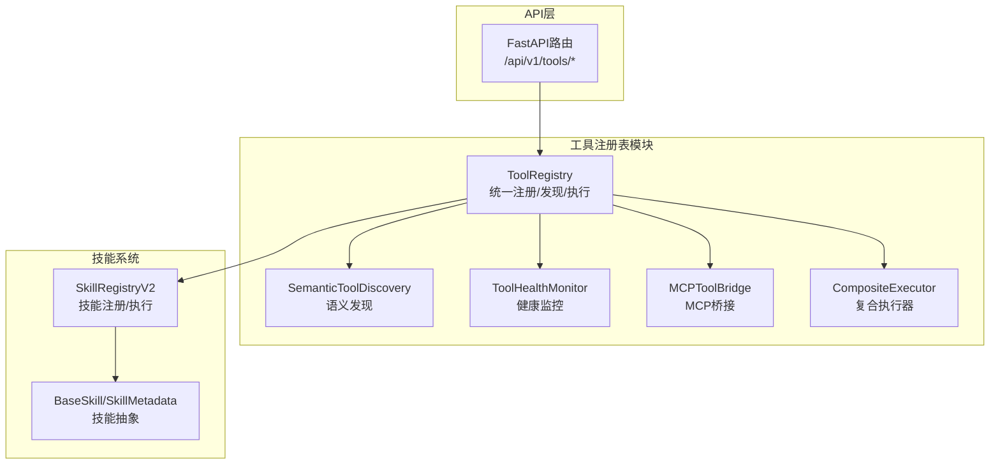
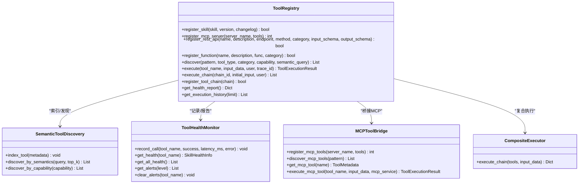
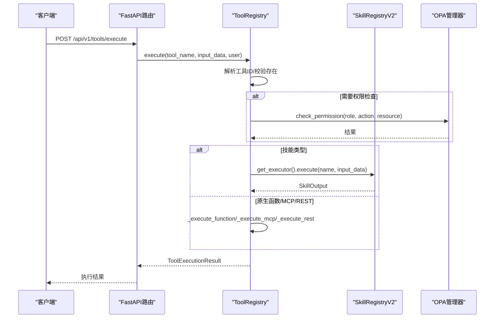
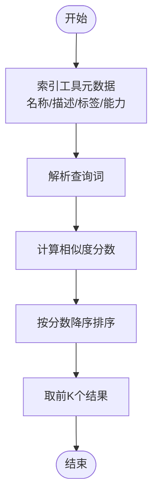
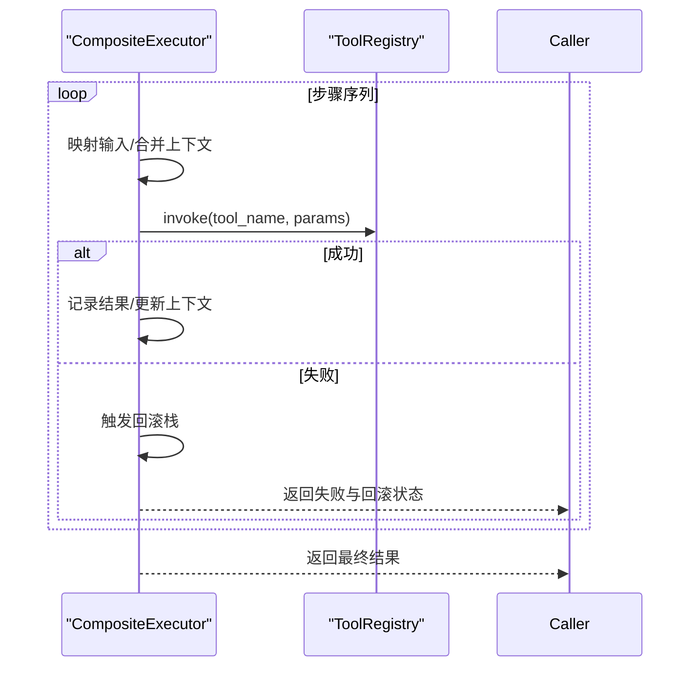
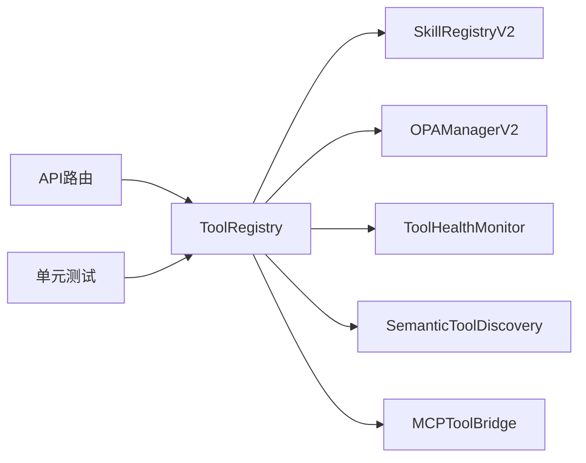

# 工具注册表

<cite>
**本文引用的文件**
- [odap/biz/platform/tool_registry/registry.py](file://odap/biz/platform/tool_registry/registry.py)
- [odap/biz/platform/tool_registry/composite_executor.py](file://odap/biz/platform/tool_registry/composite_executor.py)
- [odap/biz/platform/tool_registry/semantic_discovery.py](file://odap/biz/platform/tool_registry/semantic_discovery.py)
- [odap/biz/platform/tool_registry/api/routes.py](file://odap/biz/platform/tool_registry/api/routes.py)
- [odap/biz/platform/tool_registry/__init__.py](file://odap/biz/platform/tool_registry/__init__.py)
- [odap/tools/base.py](file://odap/tools/base.py)
- [odap/tools/registry.py](file://odap/tools/registry.py)
- [odap/tools/__init__.py](file://odap/tools/__init__.py)
- [tests/unit/test_tool_registry.py](file://tests/unit/test_tool_registry.py)
- [docs/10-api/BACKEND_API_DESIGN.md](file://docs/10-api/BACKEND_API_DESIGN.md)
- [odap/biz/platform/tool_registry/registry.py](file://odap/biz/platform/tool_registry/registry.py)
</cite>

## 目录
1. [简介](#简介)
2. [项目结构](#项目结构)
3. [核心组件](#核心组件)
4. [架构总览](#架构总览)
5. [详细组件分析](#详细组件分析)
6. [依赖关系分析](#依赖关系分析)
7. [性能考量](#性能考量)
8. [故障排查指南](#故障排查指南)
9. [结论](#结论)
10. [附录](#附录)

## 简介
本文件系统性阐述 ODAP 平台的“工具注册表”体系，覆盖统一注册机制、分类与能力管理、语义发现、复合执行器、工具链组合、生命周期与版本控制、兼容性检查、API 接口与性能监控等主题。该体系旨在为技能（Skill）、MCP 工具、REST API 与原生函数提供统一的注册、发现、执行与治理能力，并通过 OPA 权限桥接与健康监控保障运行稳定性。

## 项目结构
工具注册表位于业务层平台模块，核心文件包括：
- 统一注册表与执行器：odap/biz/platform/tool_registry/registry.py
- 复合执行器：odap/biz/platform/tool_registry/composite_executor.py
- 语义发现：odap/biz/platform/tool_registry/semantic_discovery.py
- REST API 路由：odap/biz/platform/tool_registry/api/routes.py
- 模块导出：odap/biz/platform/tool_registry/__init__.py
- 技能基础与注册：odap/tools/base.py、odap/tools/registry.py、odap/tools/__init__.py
- 单元测试：tests/unit/test_tool_registry.py
- API 设计文档：docs/10-api/BACKEND_API_DESIGN.md

**图表来源**
- [odap/biz/platform/tool_registry/registry.py:403-937](file://odap/biz/platform/tool_registry/registry.py#L403-L937)
- [odap/biz/platform/tool_registry/composite_executor.py:7-93](file://odap/biz/platform/tool_registry/composite_executor.py#L7-L93)
- [odap/biz/platform/tool_registry/semantic_discovery.py:9-92](file://odap/biz/platform/tool_registry/semantic_discovery.py#L9-L92)
- [odap/biz/platform/tool_registry/api/routes.py:1-310](file://odap/biz/platform/tool_registry/api/routes.py#L1-L310)
- [odap/tools/base.py:64-720](file://odap/tools/base.py#L64-L720)

**章节来源**
- [odap/biz/platform/tool_registry/registry.py:1-1000](file://odap/biz/platform/tool_registry/registry.py#L1-L1000)
- [odap/biz/platform/tool_registry/__init__.py:1-34](file://odap/biz/platform/tool_registry/__init__.py#L1-L34)

## 核心组件
- 统一注册表 ToolRegistry：集中管理技能、MCP、REST、原生函数四类工具；提供注册、发现、执行、工具链、健康报告与执行历史。
- 语义发现 SemanticToolDiscovery：基于关键词、语义标签与能力进行语义匹配与打分。
- 健康监控 ToolHealthMonitor：记录调用次数、成功率、平均耗时与告警阈值。
- MCP 桥接 MCPToolBridge：将 MCP 工具注册到统一注册表并提供执行入口。
- 复合执行器 CompositeExecutor：顺序执行多个工具，支持回滚与异常处理。
- 技能系统 SkillRegistryV2：提供技能的热插拔、版本管理、健康监控与执行器。
- REST API 路由：提供注册、发现、执行、工具链管理、健康与历史查询等接口。

**章节来源**
- [odap/biz/platform/tool_registry/registry.py:403-937](file://odap/biz/platform/tool_registry/registry.py#L403-L937)
- [odap/biz/platform/tool_registry/composite_executor.py:7-93](file://odap/biz/platform/tool_registry/composite_executor.py#L7-L93)
- [odap/biz/platform/tool_registry/semantic_discovery.py:9-92](file://odap/biz/platform/tool_registry/semantic_discovery.py#L9-L92)
- [odap/tools/base.py:599-720](file://odap/tools/base.py#L599-L720)
- [odap/biz/platform/tool_registry/api/routes.py:1-310](file://odap/biz/platform/tool_registry/api/routes.py#L1-L310)

## 架构总览
工具注册表采用“统一注册 + 多类型执行 + 语义发现 + 健康监控”的架构，支持：
- 统一元数据模型 ToolMetadata 与注册信息 ToolRegistration
- 多类型工具桥接与执行策略
- 语义检索与能力过滤的混合发现
- OPA 权限检查与健康阈值告警
- 工具链编排与复合执行器

**图表来源**
- [odap/biz/platform/tool_registry/registry.py:403-937](file://odap/biz/platform/tool_registry/registry.py#L403-L937)
- [odap/biz/platform/tool_registry/composite_executor.py:7-93](file://odap/biz/platform/tool_registry/composite_executor.py#L7-L93)
- [odap/biz/platform/tool_registry/semantic_discovery.py:9-92](file://odap/biz/platform/tool_registry/semantic_discovery.py#L9-L92)

## 详细组件分析

### 统一注册表与执行器（ToolRegistry）
- 注册能力
  - 技能注册：将 BaseSkill 封装为 ToolRegistration，生成统一 ToolMetadata，索引语义标签与能力映射。
  - MCP 注册：通过 MCPToolBridge 将远端工具批量注册为统一工具条目。
  - REST 注册：将外部 API 封装为工具，记录端点与方法。
  - 原生函数注册：将可调用对象作为工具注册，便于内联执行。
- 发现策略
  - 支持名称模式、类型、分类、能力与语义查询混合过滤。
  - 语义发现通过 SemanticToolDiscovery 基于关键词、标签与能力打分排序。
- 执行策略
  - 同步执行 execute 与异步 execute_async。
  - 执行前进行 OPA 权限检查（若开启 requires_opa_check）。
  - 统一记录执行统计、健康状态与执行历史。
- 工具链与复合执行
  - ToolChainStep 支持输入/输出映射与条件判断。
  - execute_chain 顺序执行，遇到失败则中断并触发回滚（由 CompositeExecutor 提供）。

**图表来源**
- [odap/biz/platform/tool_registry/api/routes.py:159-178](file://odap/biz/platform/tool_registry/api/routes.py#L159-L178)
- [odap/biz/platform/tool_registry/registry.py:579-668](file://odap/biz/platform/tool_registry/registry.py#L579-L668)
- [odap/tools/base.py:458-597](file://odap/tools/base.py#L458-L597)

**章节来源**
- [odap/biz/platform/tool_registry/registry.py:426-832](file://odap/biz/platform/tool_registry/registry.py#L426-L832)
- [odap/biz/platform/tool_registry/api/routes.py:75-178](file://odap/biz/platform/tool_registry/api/routes.py#L75-L178)

### 语义发现算法（SemanticToolDiscovery）
- 索引阶段：对工具名称、描述、语义标签与能力建立倒排索引。
- 查询阶段：对自然语言查询进行分词与权重计算，结合工具名称、描述、标签与能力进行打分排序。
- 返回前 K 个工具及其相似度分数，支持按能力过滤。

**图表来源**
- [odap/biz/platform/tool_registry/registry.py:216-298](file://odap/biz/platform/tool_registry/registry.py#L216-L298)

**章节来源**
- [odap/biz/platform/tool_registry/registry.py:216-298](file://odap/biz/platform/tool_registry/registry.py#L216-L298)

### 复合执行器（CompositeExecutor）
- 顺序执行多个工具，支持参数映射与上下文传递。
- 每步执行后将结果合并到上下文中，失败时触发回滚栈并返回失败信息。
- 支持同步与异步回滚函数。

**图表来源**
- [odap/biz/platform/tool_registry/composite_executor.py:12-93](file://odap/biz/platform/tool_registry/composite_executor.py#L12-L93)

**章节来源**
- [odap/biz/platform/tool_registry/composite_executor.py:7-93](file://odap/biz/platform/tool_registry/composite_executor.py#L7-L93)

### MCP 工具桥接（MCPToolBridge）
- 将 MCP 服务器提供的工具批量注册为统一工具条目，生成 ToolMetadata 并缓存。
- 提供发现与执行入口，执行时封装 ToolExecutionResult。

**章节来源**
- [odap/biz/platform/tool_registry/registry.py:149-214](file://odap/biz/platform/tool_registry/registry.py#L149-L214)

### 健康监控（ToolHealthMonitor）
- 记录每次调用的成功/失败、耗时与错误，动态计算健康状态。
- 阈值触发告警（警告/严重），支持查询与清理。

**章节来源**
- [odap/biz/platform/tool_registry/registry.py:304-401](file://odap/biz/platform/tool_registry/registry.py#L304-L401)

### 技能系统（SkillRegistryV2 与 BaseSkill）
- BaseSkill 定义输入输出模型与执行接口，支持声明式 OPA 权限与危险等级。
- SkillRegistryV2 提供热插拔、版本管理、健康监控与执行器，与 ToolRegistry 协同工作。

**章节来源**
- [odap/tools/base.py:64-720](file://odap/tools/base.py#L64-L720)
- [odap/biz/platform/tool_registry/registry.py:414-425](file://odap/biz/platform/tool_registry/registry.py#L414-L425)

## 依赖关系分析
- ToolRegistry 依赖：
  - 技能系统：SkillRegistryV2、SkillExecutorV2、BaseSkill
  - OPA 权限：OPAManagerV2（可选）
  - 健康监控：ToolHealthMonitor
  - 语义发现：SemanticToolDiscovery
  - MCP 桥接：MCPToolBridge
- API 路由依赖 ToolRegistry 提供的注册、发现、执行与工具链能力。
- 单元测试覆盖注册、发现、执行、健康监控、工具链与复合执行等场景。

**图表来源**
- [odap/biz/platform/tool_registry/registry.py:414-425](file://odap/biz/platform/tool_registry/registry.py#L414-L425)
- [odap/biz/platform/tool_registry/api/routes.py:69-72](file://odap/biz/platform/tool_registry/api/routes.py#L69-L72)
- [tests/unit/test_tool_registry.py:96-97](file://tests/unit/test_tool_registry.py#L96-L97)

**章节来源**
- [odap/biz/platform/tool_registry/registry.py:414-425](file://odap/biz/platform/tool_registry/registry.py#L414-L425)
- [odap/biz/platform/tool_registry/api/routes.py:69-72](file://odap/biz/platform/tool_registry/api/routes.py#L69-L72)
- [tests/unit/test_tool_registry.py:96-97](file://tests/unit/test_tool_registry.py#L96-L97)

## 性能考量
- 执行开销
  - ToolRegistry 在执行前后记录时间戳并更新统计，建议合理设置超时与速率限制。
  - 健康监控基于内存统计，注意并发访问的线程安全（已使用 RLock）。
- 语义发现
  - 索引构建与查询均基于内存字典，工具规模较大时建议优化分词与索引策略。
- 异步执行
  - 提供 execute_async 与 CompositeExecutor 的异步回滚，适合 IO 密集型工具链。

[本节为通用指导，无需具体文件引用]

## 故障排查指南
- 工具未找到
  - 检查工具名或 ID 是否正确；ToolRegistry 支持名称、ID 与别名解析。
- 权限拒绝
  - 若 requires_opa_check 为真，确认 OPA 策略与用户角色配置正确。
- 执行失败
  - 查看 ToolExecutionResult 的 error 字段与执行历史；结合 ToolHealthMonitor 的告警定位问题。
- 工具链失败
  - 使用 execute_chain 的返回信息定位失败步骤；确保输入/输出映射与条件表达式正确。

**章节来源**
- [odap/biz/platform/tool_registry/registry.py:595-662](file://odap/biz/platform/tool_registry/registry.py#L595-L662)
- [tests/unit/test_tool_registry.py:212-223](file://tests/unit/test_tool_registry.py#L212-L223)

## 结论
工具注册表通过统一元数据模型、多类型桥接与执行策略、语义发现与健康监控，实现了对技能、MCP、REST 与原生函数的统一治理。配合 API 路由与工具链/复合执行器，能够满足复杂业务场景下的工具编排与运行时治理需求。建议在生产环境中结合 OPA 权限与健康阈值告警，持续优化工具发现与执行性能。

[本节为总结性内容，无需具体文件引用]

## 附录

### API 接口文档（摘要）
- 路由前缀：/api/v1/tools
- 主要接口
  - POST /register：注册工具（技能/REST/函数）
  - GET /discover：发现工具（支持名称、类型、分类、能力、语义查询）
  - POST /execute：执行工具
  - POST /chains/register：注册工具链
  - POST /chains/{chain_id}/execute：执行工具链
  - GET /chains/{chain_id}：获取工具链
  - GET /chains：列出工具链
  - GET /health：健康报告
  - GET /history：执行历史
  - GET /{tool_name}：获取工具详情

**章节来源**
- [odap/biz/platform/tool_registry/api/routes.py:1-310](file://odap/biz/platform/tool_registry/api/routes.py#L1-L310)
- [docs/10-api/BACKEND_API_DESIGN.md:404-421](file://docs/10-api/BACKEND_API_DESIGN.md#L404-L421)

### 工具开发规范（要点）
- 技能开发
  - 继承 BaseSkill 并实现 execute；声明 SkillMetadata（含分类、危险等级、OPA 行为等）。
  - 使用 SkillInput/SkillOutput 标准模型，确保输入校验与输出一致性。
- 工具注册
  - 优先使用 ToolRegistry.register_skill 注册技能；REST/函数/MCP 通过对应注册方法。
  - 为工具提供语义标签与能力，提升语义发现效果。
- 权限与安全
  - 对敏感工具开启 requires_opa_check 并配置 opa_action；根据危险等级要求确认。
- 生命周期与版本
  - 使用 SkillRegistryV2 的热插拔与版本管理能力；变更日志与依赖声明清晰。

**章节来源**
- [odap/tools/base.py:48-161](file://odap/tools/base.py#L48-L161)
- [odap/biz/platform/tool_registry/registry.py:426-467](file://odap/biz/platform/tool_registry/registry.py#L426-L467)

### 性能监控策略（要点）
- 健康监控
  - 使用 ToolHealthMonitor 记录错误率与平均耗时，设置告警阈值。
- 执行历史
  - 通过 get_execution_history 获取最近执行记录，辅助性能回归分析。
- 健康报告
  - get_health_report 提供总体健康概览，便于运维巡检。

**章节来源**
- [odap/biz/platform/tool_registry/registry.py:719-744](file://odap/biz/platform/tool_registry/registry.py#L719-L744)
- [tests/unit/test_tool_registry.py:640-649](file://tests/unit/test_tool_registry.py#L640-L649)