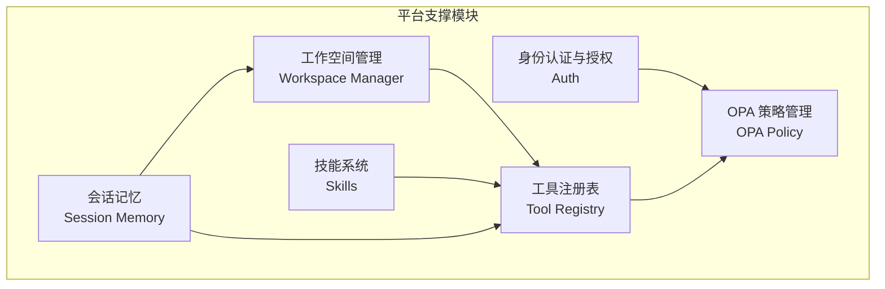
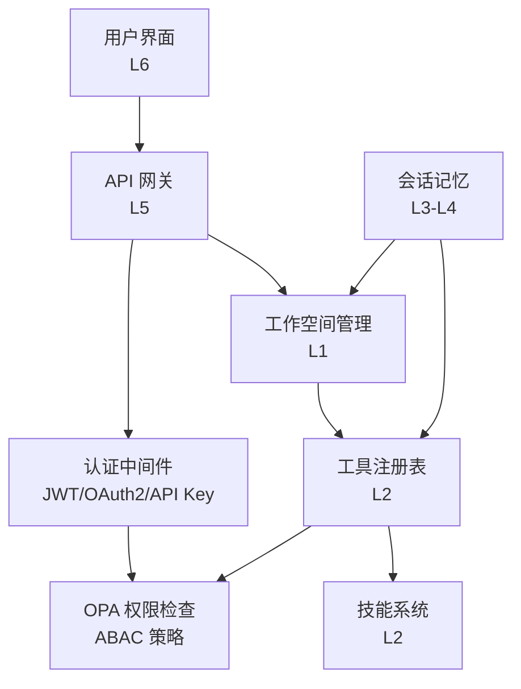
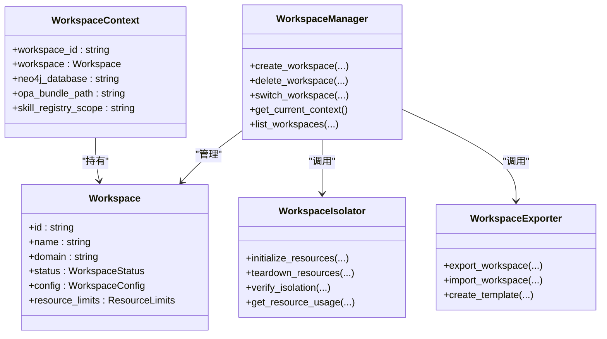
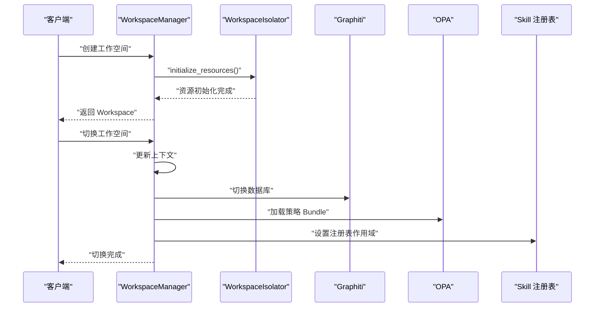
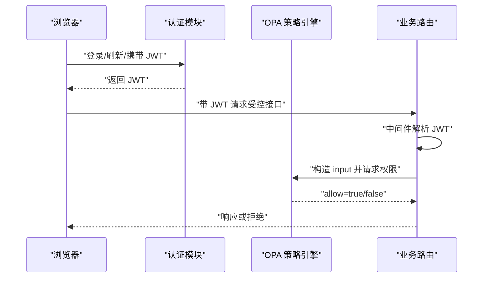
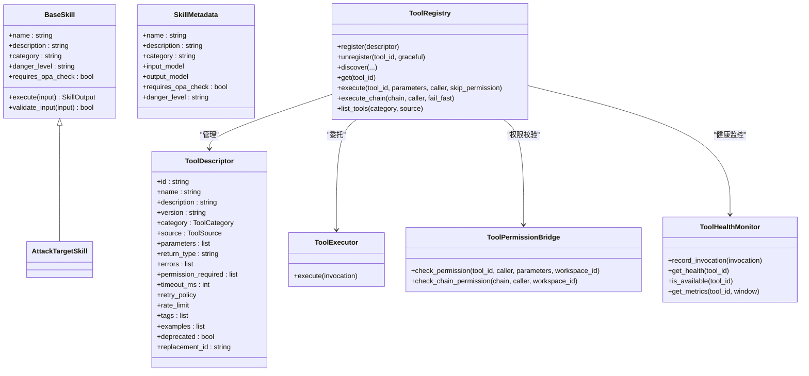
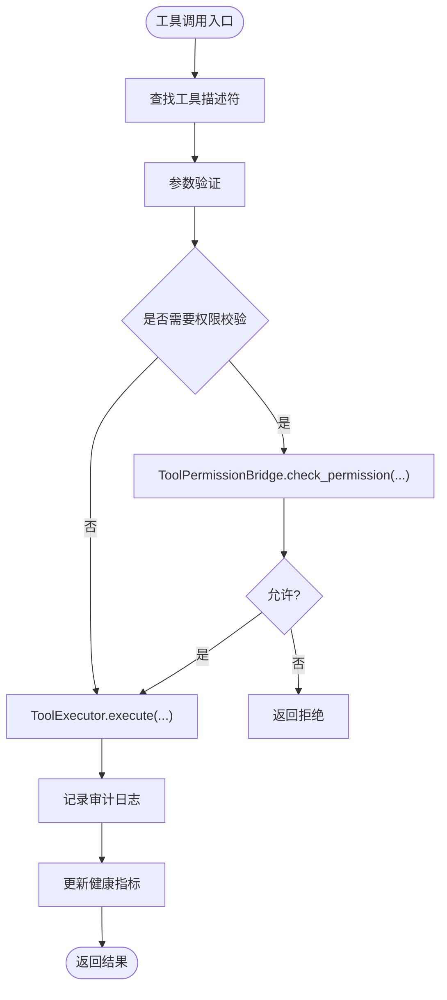
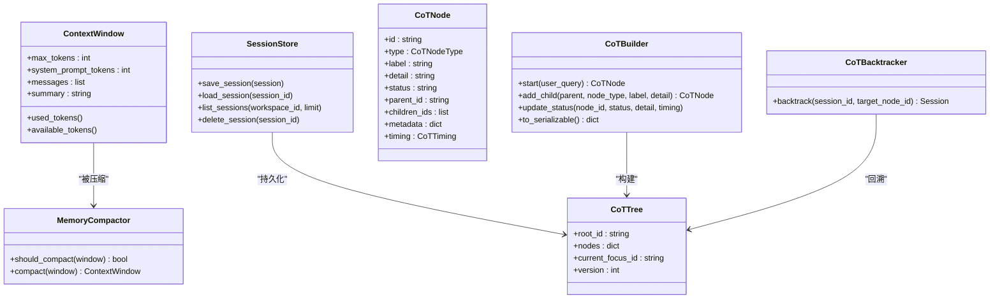
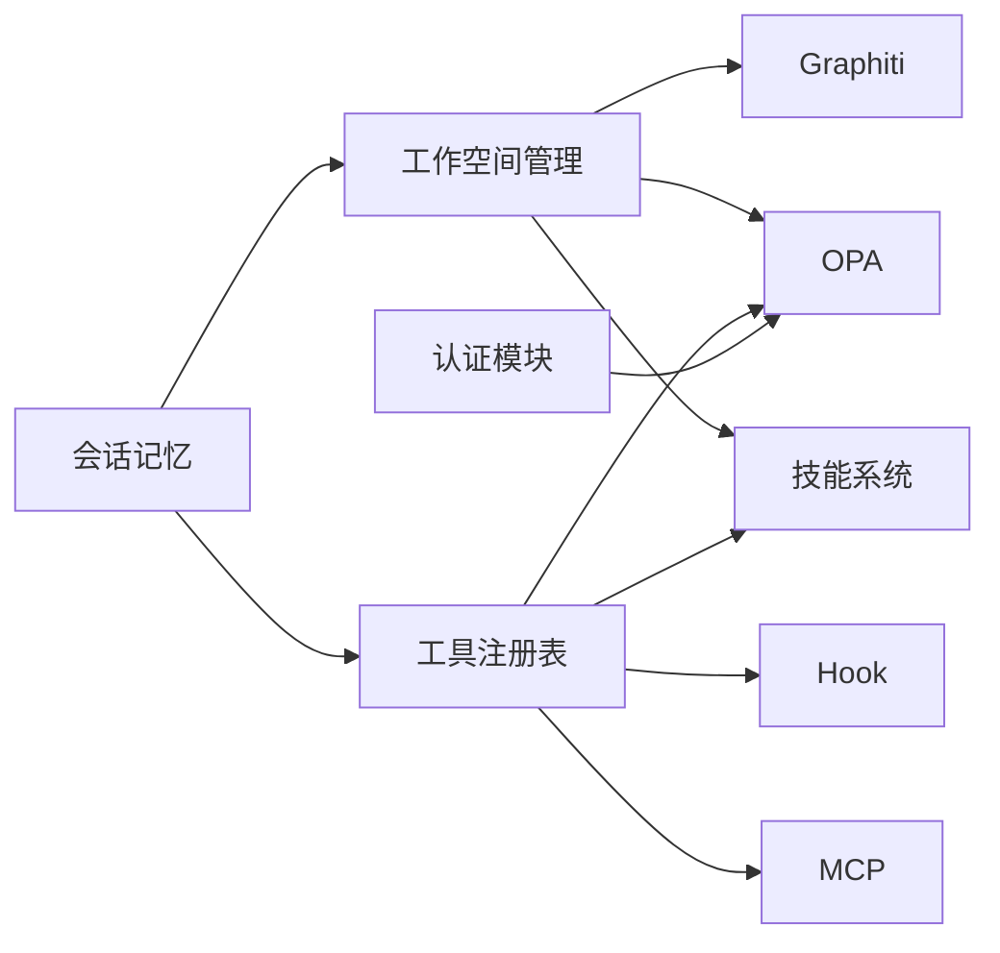

# 平台支撑模块

<cite>
**本文引用的文件**
- [工作空间管理模块设计](file://docs/03-modules/workspace/DESIGN.md)
- [身份认证与授权模块设计](file://docs/03-modules/auth/DESIGN.md)
- [技能系统模块设计](file://docs/03-modules/skills/DESIGN.md)
- [工具注册表模块设计](file://docs/03-modules/tool_registry/DESIGN.md)
- [会话记忆与思维链可视化模块设计](file://docs/03-modules/session_memory/DESIGN.md)
- [OPA 策略管理模块设计](file://docs/03-modules/opa_policy/DESIGN.md)
</cite>

## 目录
1. [简介](#简介)
2. [项目结构](#项目结构)
3. [核心组件](#核心组件)
4. [架构总览](#架构总览)
5. [详细组件分析](#详细组件分析)
6. [依赖关系分析](#依赖关系分析)
7. [性能考量](#性能考量)
8. [故障排查指南](#故障排查指南)
9. [结论](#结论)
10. [附录](#附录)

## 简介
本文件面向平台支撑模块，系统化梳理工作空间管理、角色权限、技能系统、工具注册表、会话记忆等平台级能力。重点阐述：
- 工作空间的场景隔离机制、资源配额与多租户支持
- 角色权限的细粒度控制、OPA 策略集成与权限同步机制
- 技能系统的热插拔架构与工具注册表的统一管理、服务化设计
- 会话记忆的分层存储与性能优化策略

## 项目结构
平台支撑模块位于文档目录 docs/03-modules 下，涵盖工作空间、认证授权、技能系统、工具注册表、会话记忆、OPA 策略等模块的设计文档。这些模块共同构成 ODAP 平台的基础设施与平台服务能力。

**章节来源**
- [工作空间管理模块设计:23-42](file://docs/03-modules/workspace/DESIGN.md#L23-L42)
- [身份认证与授权模块设计:15-32](file://docs/03-modules/auth/DESIGN.md#L15-L32)
- [技能系统模块设计:13-40](file://docs/03-modules/skills/DESIGN.md#L13-L40)
- [工具注册表模块设计:28-43](file://docs/03-modules/tool_registry/DESIGN.md#L28-L43)
- [会话记忆与思维链可视化模块设计:19-41](file://docs/03-modules/session_memory/DESIGN.md#L19-L41)
- [OPA 策略管理模块设计:7-21](file://docs/03-modules/opa_policy/DESIGN.md#L7-L21)

## 核心组件
- 工作空间管理：提供工作空间的创建、切换、生命周期管理与资源隔离初始化，支持模板化导入导出与多数据库隔离。
- 身份认证与授权：提供多方式认证（OAuth2/OIDC、本地账号、API Key）、JWT 签发与刷新、工作空间角色绑定，并与 OPA 权限系统解耦协作。
- 技能系统：定义技能接口、分类与危险等级，提供注册机制、编排与工作流引擎，支持热插拔与组合执行。
- 工具注册表：统一管理技能、内置工具、MCP 工具与外部 API 封装，提供发现、权限联动、健康监控与工具链执行。
- 会话记忆：管理多轮对话上下文窗口、记忆压缩、持久化与思维链可视化，支持实时 WebSocket 推送与回溯。
- OPA 策略管理：提供策略包组织、Fail-Close 安全机制、批量评估、缓存优化与审计监控。

**章节来源**
- [工作空间管理模块设计:12-22](file://docs/03-modules/workspace/DESIGN.md#L12-L22)
- [身份认证与授权模块设计:13-42](file://docs/03-modules/auth/DESIGN.md#L13-L42)
- [技能系统模块设计:7-11](file://docs/03-modules/skills/DESIGN.md#L7-L11)
- [工具注册表模块设计:10-14](file://docs/03-modules/tool_registry/DESIGN.md#L10-L14)
- [会话记忆与思维链可视化模块设计:11-16](file://docs/03-modules/session_memory/DESIGN.md#L11-L16)
- [OPA 策略管理模块设计:7-21](file://docs/03-modules/opa_policy/DESIGN.md#L7-L21)

## 架构总览
平台支撑模块在分层架构中的定位如下：
- L1 基础设施层：工作空间资源隔离（Neo4j 多数据库、策略 Bundle、Skill 注册表）
- L2 领域技能层：技能系统与工具注册表
- L3-L4 业务层/L6 交互层：会话记忆与可视化
- L5 API 网关层：认证与授权中间件、API 端点
- L1 安全基础设施：OPA 策略引擎与权限检查

**图表来源**
- [工作空间管理模块设计:23-42](file://docs/03-modules/workspace/DESIGN.md#L23-L42)
- [身份认证与授权模块设计:15-32](file://docs/03-modules/auth/DESIGN.md#L15-L32)
- [工具注册表模块设计:28-43](file://docs/03-modules/tool_registry/DESIGN.md#L28-L43)
- [会话记忆与思维链可视化模块设计:19-41](file://docs/03-modules/session_memory/DESIGN.md#L19-L41)
- [OPA 策略管理模块设计:7-21](file://docs/03-modules/opa_policy/DESIGN.md#L7-L21)

**章节来源**
- [工作空间管理模块设计:23-42](file://docs/03-modules/workspace/DESIGN.md#L23-L42)
- [身份认证与授权模块设计:15-32](file://docs/03-modules/auth/DESIGN.md#L15-L32)
- [工具注册表模块设计:28-43](file://docs/03-modules/tool_registry/DESIGN.md#L28-L43)
- [会话记忆与思维链可视化模块设计:19-41](file://docs/03-modules/session_memory/DESIGN.md#L19-L41)
- [OPA 策略管理模块设计:7-21](file://docs/03-modules/opa_policy/DESIGN.md#L7-L21)

## 详细组件分析

### 工作空间管理
- 场景隔离机制：通过 Neo4j 多数据库隔离（每工作空间独立数据库）、策略 Bundle 文件系统隔离、Skill 注册表命名空间隔离，确保数据与策略完全隔离。
- 资源配额与多租户：工作空间模型包含资源上限配置（节点/边/技能/Agent/并发/存储），支持多租户场景下的资源配额与审计。
- 生命周期与导入导出：支持工作空间创建、切换、归档、软删除；提供 .owp 包格式的导入导出，包含本体、技能、策略、数据与配置。
- 依赖与事件流：与 Graphiti、OPA、本体管理、技能系统、审计日志模块交互；切换时通知各组件更新上下文。

**图表来源**
- [工作空间管理模块设计:48-117](file://docs/03-modules/workspace/DESIGN.md#L48-L117)
- [工作空间管理模块设计:123-190](file://docs/03-modules/workspace/DESIGN.md#L123-L190)
- [工作空间管理模块设计:192-235](file://docs/03-modules/workspace/DESIGN.md#L192-L235)
- [工作空间管理模块设计:237-298](file://docs/03-modules/workspace/DESIGN.md#L237-L298)

**图表来源**
- [工作空间管理模块设计:533-550](file://docs/03-modules/workspace/DESIGN.md#L533-L550)

**章节来源**
- [工作空间管理模块设计:12-22](file://docs/03-modules/workspace/DESIGN.md#L12-L22)
- [工作空间管理模块设计:192-235](file://docs/03-modules/workspace/DESIGN.md#L192-L235)
- [工作空间管理模块设计:237-298](file://docs/03-modules/workspace/DESIGN.md#L237-L298)
- [工作空间管理模块设计:519-550](file://docs/03-modules/workspace/DESIGN.md#L519-L550)

### 角色权限与 OPA 集成
- 认证与授权分离：认证模块负责身份验证并签发 JWT，授权模块基于 OPA 执行 ABAC 权限决策，二者职责清晰。
- 多认证方式：支持 OAuth2/OIDC、本地账号密码、API Key；提供刷新令牌与吊销机制。
- 与 OPA 对接：认证中间件将用户身份注入请求上下文，OPA 输入包含用户、动作、资源与工作空间上下文，包名为 odap.authz。
- 策略执行：OPA 管理器提供检查、批量检查、重载策略与健康检查；支持 Fail-Close 与审计日志。

**图表来源**
- [身份认证与授权模块设计:386-397](file://docs/03-modules/auth/DESIGN.md#L386-L397)
- [OPA 策略管理模块设计:23-65](file://docs/03-modules/opa_policy/DESIGN.md#L23-L65)

**章节来源**
- [身份认证与授权模块设计:13-42](file://docs/03-modules/auth/DESIGN.md#L13-L42)
- [身份认证与授权模块设计:386-397](file://docs/03-modules/auth/DESIGN.md#L386-L397)
- [OPA 策略管理模块设计:11-21](file://docs/03-modules/opa_policy/DESIGN.md#L11-L21)
- [OPA 策略管理模块设计:23-65](file://docs/03-modules/opa_policy/DESIGN.md#L23-L65)

### 技能系统与工具注册表
- 技能接口与分类：定义统一的技能输入/输出模型、危险等级与类别，支持情报、作战、分析、可视化四类技能。
- 注册机制：通过装饰器自动注册技能，便于热插拔与扩展。
- 编排与工作流：提供技能编排器与工作流引擎，支持拓扑排序、并行执行、重试与结果聚合。
- 工具注册表：统一管理工具描述、执行器路由、权限桥接与健康监控；支持工具链（组合工具）与参数表达式引用。

**图表来源**
- [技能系统模块设计:48-85](file://docs/03-modules/skills/DESIGN.md#L48-L85)
- [技能系统模块设计:366-418](file://docs/03-modules/skills/DESIGN.md#L366-L418)
- [工具注册表模块设计:51-133](file://docs/03-modules/tool_registry/DESIGN.md#L51-L133)
- [工具注册表模块设计:171-286](file://docs/03-modules/tool_registry/DESIGN.md#L171-L286)
- [工具注册表模块设计:288-350](file://docs/03-modules/tool_registry/DESIGN.md#L288-L350)
- [工具注册表模块设计:351-400](file://docs/03-modules/tool_registry/DESIGN.md#L351-L400)
- [工具注册表模块设计:401-458](file://docs/03-modules/tool_registry/DESIGN.md#L401-L458)

**图表来源**
- [工具注册表模块设计:240-262](file://docs/03-modules/tool_registry/DESIGN.md#L240-L262)

**章节来源**
- [技能系统模块设计:46-504](file://docs/03-modules/skills/DESIGN.md#L46-L504)
- [技能系统模块设计:507-781](file://docs/03-modules/skills/DESIGN.md#L507-L781)
- [工具注册表模块设计:168-286](file://docs/03-modules/tool_registry/DESIGN.md#L168-L286)
- [工具注册表模块设计:288-458](file://docs/03-modules/tool_registry/DESIGN.md#L288-L458)

### 会话记忆与思维链可视化
- 上下文窗口与压缩：围绕当前对话裁剪记忆范围，使用 LLM 生成摘要以降低 token 使用；当使用率超过阈值时触发压缩。
- 会话持久化：PostgreSQL 存储会话消息、上下文窗口与 CoT 树，支持列表、加载与删除。
- 思维链可视化：CoT 树形结构支持节点状态、时序信息与元数据；前端提供树形渲染、展开/折叠、选中聚焦与回溯按钮。
- 实时推送与回溯：通过 WebSocket 实时推送节点状态变化；支持从任意节点回溯，裁剪后续子孙节点并回滚消息。

**图表来源**
- [会话记忆与思维链可视化模块设计:78-125](file://docs/03-modules/session_memory/DESIGN.md#L78-L125)
- [会话记忆与思维链可视化模块设计:130-155](file://docs/03-modules/session_memory/DESIGN.md#L130-L155)
- [会话记忆与思维链可视化模块设计:200-233](file://docs/03-modules/session_memory/DESIGN.md#L200-L233)
- [会话记忆与思维链可视化模块设计:238-286](file://docs/03-modules/session_memory/DESIGN.md#L238-L286)
- [会话记忆与思维链可视化模块设计:409-445](file://docs/03-modules/session_memory/DESIGN.md#L409-L445)

**章节来源**
- [会话记忆与思维链可视化模块设计:53-155](file://docs/03-modules/session_memory/DESIGN.md#L53-L155)
- [会话记忆与思维链可视化模块设计:159-445](file://docs/03-modules/session_memory/DESIGN.md#L159-L445)
- [会话记忆与思维链可视化模块设计:488-509](file://docs/03-modules/session_memory/DESIGN.md#L488-L509)

## 依赖关系分析
- 工作空间管理依赖：Graphiti（数据库连接切换）、OPA（策略 Bundle 加载）、本体管理（本体版本绑定）、技能系统（注册表作用域）、审计日志（操作审计）。
- 工具注册表依赖：OPA（权限校验）、Hook（注册/注销/执行事件）、MCP（协议桥接）、Skill（技能执行器）。
- 会话记忆依赖：工作空间（上下文隔离）、工具注册表（工具调用链路）。
- 认证模块与 OPA：认证中间件注入身份信息，OPA 以 Rego 包 odap.authz 执行策略。

**图表来源**
- [工作空间管理模块设计:519-530](file://docs/03-modules/workspace/DESIGN.md#L519-L530)
- [工具注册表模块设计:518-527](file://docs/03-modules/tool_registry/DESIGN.md#L518-L527)
- [会话记忆与思维链可视化模块设计:17-41](file://docs/03-modules/session_memory/DESIGN.md#L17-L41)
- [身份认证与授权模块设计:386-397](file://docs/03-modules/auth/DESIGN.md#L386-L397)

**章节来源**
- [工作空间管理模块设计:519-530](file://docs/03-modules/workspace/DESIGN.md#L519-L530)
- [工具注册表模块设计:518-527](file://docs/03-modules/tool_registry/DESIGN.md#L518-L527)
- [会话记忆与思维链可视化模块设计:17-41](file://docs/03-modules/session_memory/DESIGN.md#L17-L41)
- [身份认证与授权模块设计:386-397](file://docs/03-modules/auth/DESIGN.md#L386-L397)

## 性能考量
- 工作空间：创建/切换延迟目标明确，导出/导入性能与吞吐通过异步与批处理优化。
- 工具注册表：注册/发现延迟低，权限校验并行化，支持高并发与熔断隔离。
- 会话记忆：上下文窗口自动压缩，避免 token 超限；CoT 树仅在前端渲染，后端持久化结构简洁。
- OPA：策略预编译缓存、批量评估与线程池优化，Fail-Close 保证安全与稳定。

**章节来源**
- [工作空间管理模块设计:609-617](file://docs/03-modules/workspace/DESIGN.md#L609-L617)
- [工具注册表模块设计:556-565](file://docs/03-modules/tool_registry/DESIGN.md#L556-L565)
- [会话记忆与思维链可视化模块设计:513-565](file://docs/03-modules/session_memory/DESIGN.md#L513-L565)
- [OPA 策略管理模块设计:491-586](file://docs/03-modules/opa_policy/DESIGN.md#L491-L586)

## 故障排查指南
- 工作空间隔离验证：使用隔离验证接口检查 Neo4j 数据库、策略 Bundle 与存储目录是否独立，是否存在跨空间数据泄露。
- 权限拒绝排查：确认 JWT 中工作空间角色与策略 Bundle 是否正确加载；核对 OPA 输入字段（用户、动作、资源、上下文）。
- 工具调用失败：检查工具健康状态与熔断器；确认权限桥接是否通过；查看工具链参数表达式引用是否正确。
- 会话记忆异常：检查上下文窗口压缩策略是否触发；确认 CoT 树节点状态与 WebSocket 推送是否正常。
- OPA 策略问题：使用调试工具与沙盒环境评估策略；查看执行日志与缓存命中率；必要时重载策略包。

**章节来源**
- [工作空间管理模块设计:220-235](file://docs/03-modules/workspace/DESIGN.md#L220-L235)
- [工具注册表模块设计:365-399](file://docs/03-modules/tool_registry/DESIGN.md#L365-L399)
- [会话记忆与思维链可视化模块设计:409-445](file://docs/03-modules/session_memory/DESIGN.md#L409-L445)
- [OPA 策略管理模块设计:312-490](file://docs/03-modules/opa_policy/DESIGN.md#L312-L490)

## 结论
平台支撑模块通过工作空间场景隔离、认证授权与 OPA 策略的解耦协作、技能系统与工具注册表的统一管理、以及会话记忆与思维链可视化的可解释性设计，构建了具备多租户、可扩展、可观测与安全可控的平台能力。模块间职责清晰、接口契约明确，既满足当前阶段的功能落地，也为未来版本的工具版本管理、灰度发布与跨工作空间共享奠定基础。

## 附录
- 相关 ADR 与架构文档：工作空间资源隔离、权限检查 OPA 集成、技能管理选择、工具注册表分阶段实现等。
- API 端点与权限：工作空间、工具注册表、认证等模块的 REST API 与最小权限标识。

**章节来源**
- [工作空间管理模块设计:475-491](file://docs/03-modules/workspace/DESIGN.md#L475-L491)
- [工具注册表模块设计:541-552](file://docs/03-modules/tool_registry/DESIGN.md#L541-L552)
- [身份认证与授权模块设计:289-303](file://docs/03-modules/auth/DESIGN.md#L289-L303)
- [技能系统模块设计:464-504](file://docs/03-modules/skills/DESIGN.md#L464-L504)
- [会话记忆与思维链可视化模块设计:488-509](file://docs/03-modules/session_memory/DESIGN.md#L488-L509)
- [OPA 策略管理模块设计:274-294](file://docs/03-modules/opa_policy/DESIGN.md#L274-L294)