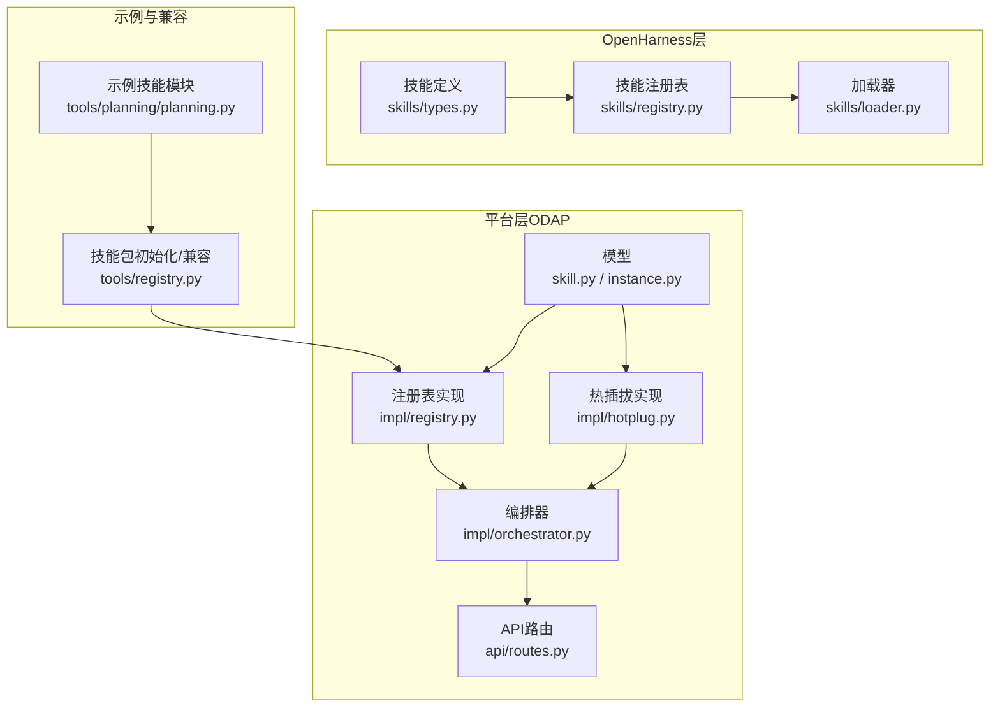
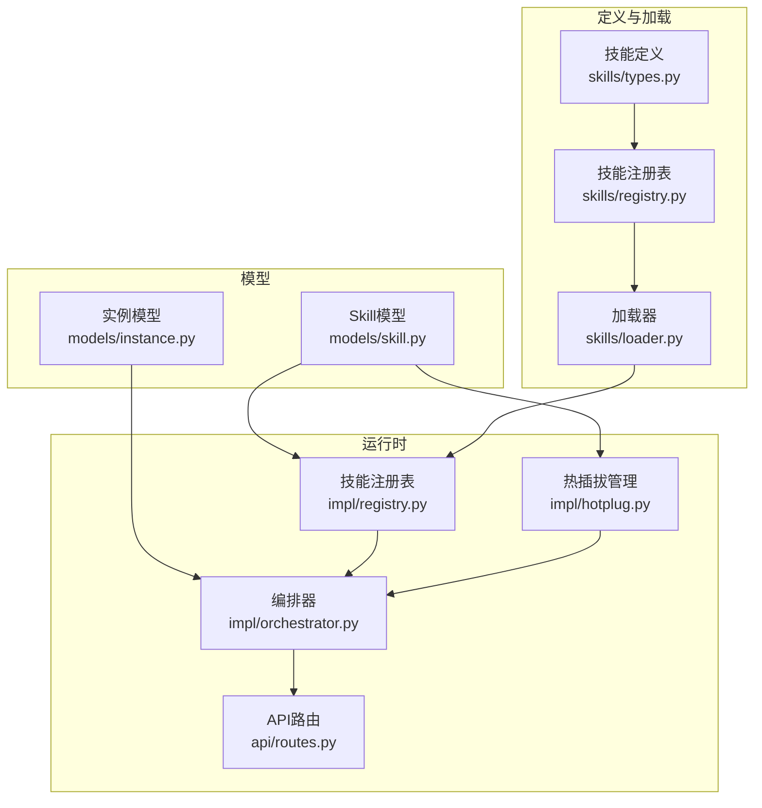
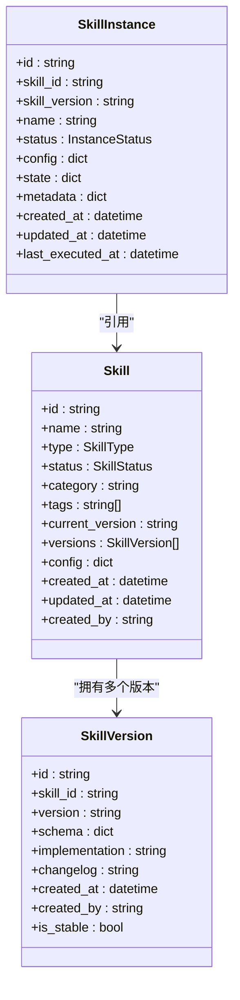
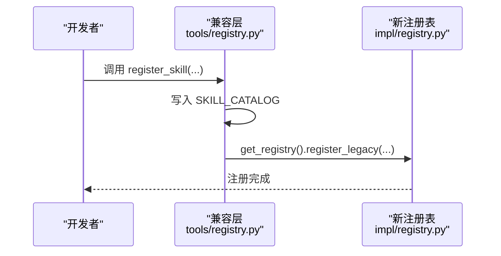
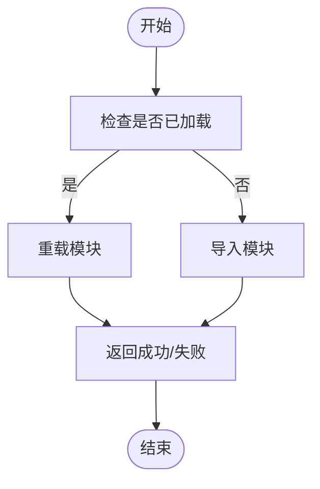
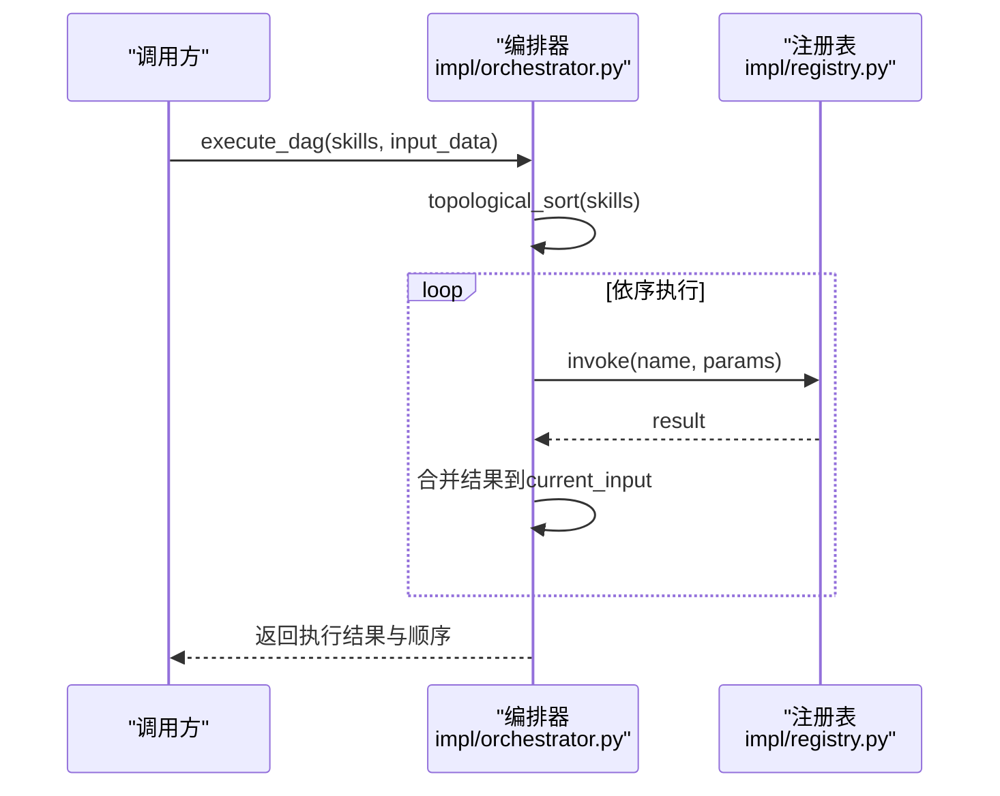
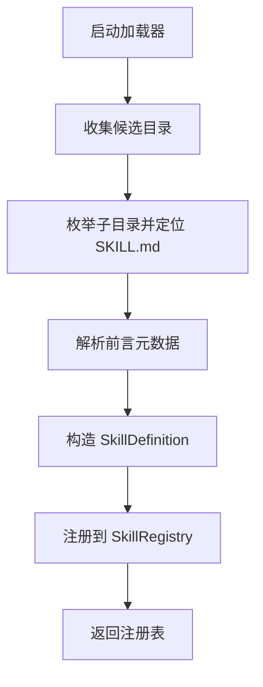
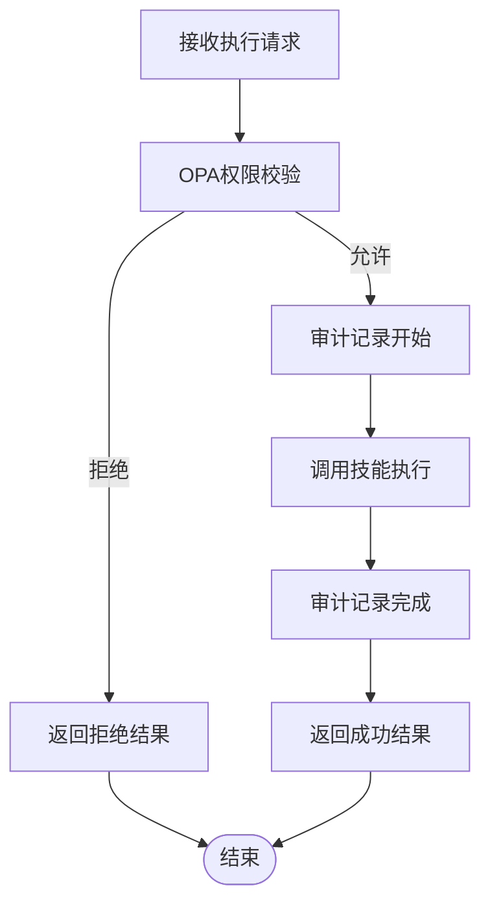
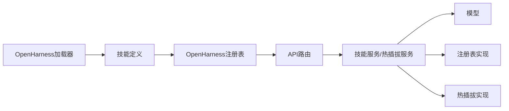
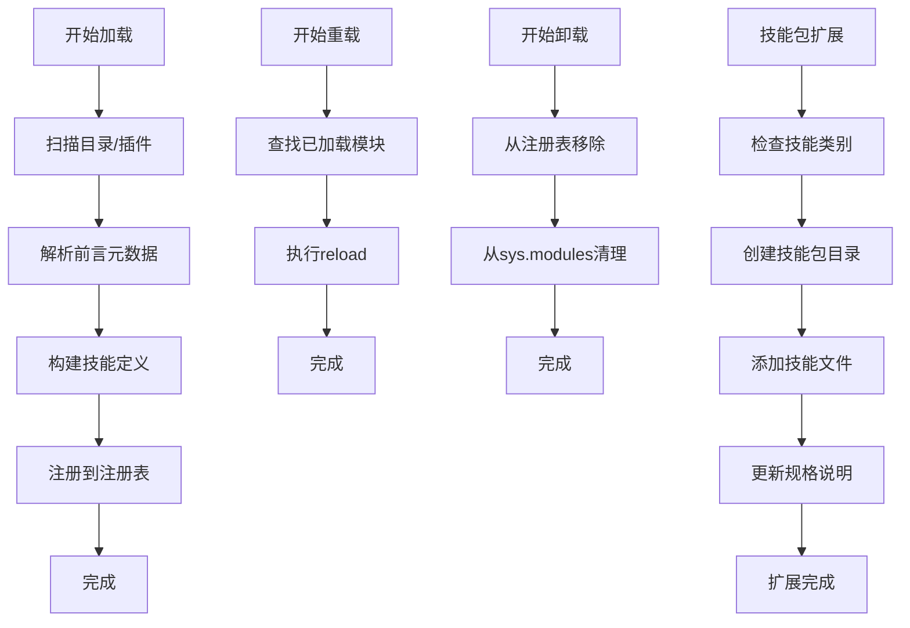

# 技能系统

<cite>
**本文引用的文件**   
- [skill_registry.py](file://odap/biz/platform/skill_system/registry/skill_registry.py)
- [orchestrator.py](file://odap/biz/platform/skill_system/impl/orchestrator.py)
- [hotplug.py](file://odap/biz/platform/skill_system/impl/hotplug.py)
- [hotplug.py（接口）](file://odap/biz/platform/skill_system/interfaces/hotplug.py)
- [registry.py](file://odap/biz/platform/skill_system/impl/registry.py)
- [skill.py](file://odap/biz/platform/skill_system/models/skill.py)
- [instance.py](file://odap/biz/platform/skill_system/models/instance.py)
- [routes.py](file://odap/biz/platform/skill_system/api/routes.py)
- [registry.py（OpenHarness）](file://openharness/src/openharness/skills/registry.py)
- [types.py（OpenHarness）](file://openharness/src/openharness/skills/types.py)
- [loader.py（OpenHarness）](file://openharness/src/openharness/skills/loader.py)
- [test_loader.py（OpenHarness测试）](file://openharness/tests/test_skills/test_loader.py)
- [planning.py（示例技能模块）](file://odap/tools/planning/planning.py)
- [registry.py（技能包初始化）](file://odap/tools/registry.py)
- [ARCHITECTURE_FULL_CHAIN_DEEP.md](file://docs/02-architecture/ARCHITECTURE_FULL_CHAIN_DEEP.md)
- [ARCHITECTURE_BIZ.md](file://docs/02-architecture/ARCHITECTURE_BIZ.md)
- [spec.md](file://specs/005-data-collection-opt/spec.md)
- [RESTRUCTURE_PLAN.md](file://docs/02-architecture/reports/RESTRUCTURE_PLAN.md)
- [skill_executor.py](file://odap/biz/core/ontology/action/impl/skill_executor.py)
- [skill_registry.py（本体应用）](file://odap/biz/core/ontology/application/skill_registry.py)
</cite>

## 更新摘要
**所做更改**   
- 更新了技能包扩展情况，从原有的3个技能包扩展到9个完整技能包
- 新增了完整的技能分类体系和数量统计
- 更新了技能系统架构图以反映扩展后的结构
- 增强了技能开发规范以适应新的技能包结构
- 更新了API接口文档以支持扩展的技能管理功能

## 目录
1. [引言](#引言)
2. [项目结构](#项目结构)
3. [核心组件](#核心组件)
4. [架构总览](#架构总览)
5. [详细组件分析](#详细组件分析)
6. [技能包扩展分析](#技能包扩展分析)
7. [依赖分析](#依赖分析)
8. [性能考虑](#性能考虑)
9. [故障排查指南](#故障排查指南)
10. [结论](#结论)
11. [附录](#附录)

## 引言
本文件面向"技能系统"的设计与实现，聚焦以下目标：
- 热插拔架构设计：支持技能的动态加载、卸载与重载，满足运行时扩展与灰度发布。
- 生命周期管理：覆盖技能注册、启用/停用、版本管理与状态跟踪。
- 分类与版本体系：基于类型、状态、分类与标签的规范化管理。
- 技能注册表与加载机制：统一注册表、目录扫描加载、插件集成与兼容层。
- 编排、调度与执行：拓扑排序、依赖解析、并发控制与审计。
- 开发规范、API 文档与性能优化建议。

**更新** 技能系统已大幅扩展，从原有的3个技能包扩展到9个完整技能包，包括analysis、computation、intelligence、operations、planning、policy、recommendation、task_management、visualization等，总计注册42个技能。

## 项目结构
技能系统由三层构成：
- 平台层（ODAP）：提供技能模型、注册表、热插拔管理、编排器与API路由。
- OpenHarness 层：提供技能定义、加载器与用户/插件技能发现。
- 示例与兼容层：示例技能模块与旧版注册表兼容。

**图示来源**
- [skill.py:1-54](file://odap/biz/platform/skill_system/models/skill.py#L1-L54)
- [instance.py:1-31](file://odap/biz/platform/skill_system/models/instance.py#L1-L31)
- [registry.py:1-36](file://odap/biz/platform/skill_system/impl/registry.py#L1-L36)
- [hotplug.py:1-109](file://odap/biz/platform/skill_system/impl/hotplug.py#L1-L109)
- [orchestrator.py:1-74](file://odap/biz/platform/skill_system/impl/orchestrator.py#L1-L74)
- [routes.py:1-185](file://odap/biz/platform/skill_system/api/routes.py#L1-L185)
- [types.py（OpenHarness）:1-17](file://openharness/src/openharness/skills/types.py#L1-L17)
- [registry.py（OpenHarness）:1-25](file://openharness/src/openharness/skills/registry.py#L1-L25)
- [loader.py（OpenHarness）:1-139](file://openharness/src/openharness/skills/loader.py#L1-L139)
- [planning.py（示例技能模块）:1-288](file://odap/tools/planning/planning.py#L1-L288)
- [registry.py（技能包初始化）:1-53](file://odap/tools/registry.py#L1-L53)

**章节来源**
- [skill.py:1-54](file://odap/biz/platform/skill_system/models/skill.py#L1-L54)
- [orchestrator.py:1-74](file://odap/biz/platform/skill_system/impl/orchestrator.py#L1-L74)
- [hotplug.py:1-109](file://odap/biz/platform/skill_system/impl/hotplug.py#L1-L109)
- [loader.py（OpenHarness）:1-139](file://openharness/src/openharness/skills/loader.py#L1-L139)

## 核心组件
- 模型层：定义技能类型、状态、版本与实例状态，支撑全生命周期管理。
- 注册表：统一存储技能处理器或技能定义，提供查询与遍历能力。
- 热插拔管理：负责技能模块的动态加载、卸载与重载，支持模块级资源回收。
- 编排器：基于依赖图进行拓扑排序与顺序执行，支持状态传播与错误短路。
- API 路由：提供技能注册、查询、版本管理、加载/卸载与同步等REST接口。
- OpenHarness 加载器：从内置、用户目录与插件中发现并加载技能定义。

**章节来源**
- [skill.py:1-54](file://odap/biz/platform/skill_system/models/skill.py#L1-L54)
- [instance.py:1-31](file://odap/biz/platform/skill_system/models/instance.py#L1-L31)
- [registry.py:1-36](file://odap/biz/platform/skill_system/impl/registry.py#L1-L36)
- [hotplug.py:1-109](file://odap/biz/platform/skill_system/impl/hotplug.py#L1-L109)
- [orchestrator.py:1-74](file://odap/biz/platform/skill_system/impl/orchestrator.py#L1-L74)
- [routes.py:1-185](file://odap/biz/platform/skill_system/api/routes.py#L1-L185)
- [types.py（OpenHarness）:1-17](file://openharness/src/openharness/skills/types.py#L1-L17)
- [registry.py（OpenHarness）:1-25](file://openharness/src/openharness/skills/registry.py#L1-L25)
- [loader.py（OpenHarness）:1-139](file://openharness/src/openharness/skills/loader.py#L1-L139)

## 架构总览
技能系统采用"模型-注册表-热插拔-编排-API"分层架构，并与 OpenHarness 的技能定义与加载器协同，形成"声明式技能定义 + 动态加载 + 运行时编排"的完整闭环。

**图示来源**
- [registry.py:1-36](file://odap/biz/platform/skill_system/impl/registry.py#L1-L36)
- [hotplug.py:1-109](file://odap/biz/platform/skill_system/impl/hotplug.py#L1-L109)
- [orchestrator.py:1-74](file://odap/biz/platform/skill_system/impl/orchestrator.py#L1-L74)
- [routes.py:1-185](file://odap/biz/platform/skill_system/api/routes.py#L1-L185)
- [types.py（OpenHarness）:1-17](file://openharness/src/openharness/skills/types.py#L1-L17)
- [registry.py（OpenHarness）:1-25](file://openharness/src/openharness/skills/registry.py#L1-L25)
- [loader.py（OpenHarness）:1-139](file://openharness/src/openharness/skills/loader.py#L1-L139)
- [skill.py:1-54](file://odap/biz/platform/skill_system/models/skill.py#L1-L54)
- [instance.py:1-31](file://odap/biz/platform/skill_system/models/instance.py#L1-L31)

## 详细组件分析

### 模型与分类体系
- 类型与状态：支持动作、查询、转换、集成等类型；状态包含草稿、激活、停用、弃用。
- 版本模型：版本包含标识、版本号、数据Schema、实现路径、变更日志与稳定性标记。
- 实例模型：实例状态涵盖待执行、运行中、已停止、异常，支持元数据与最后执行时间。

**图示来源**
- [skill.py:1-54](file://odap/biz/platform/skill_system/models/skill.py#L1-L54)
- [instance.py:1-31](file://odap/biz/platform/skill_system/models/instance.py#L1-L31)

**章节来源**
- [skill.py:1-54](file://odap/biz/platform/skill_system/models/skill.py#L1-L54)
- [instance.py:1-31](file://odap/biz/platform/skill_system/models/instance.py#L1-L31)

### 注册表与兼容层
- 平台注册表：以技能ID映射处理器，支持注册、注销、查询与列举。
- 兼容层：同时维护旧版 SKILL_CATALOG 与新版 SkillRegistry，保证向后兼容。
- 示例技能模块：通过 register_skill 将函数式技能注册到兼容层。

**图示来源**
- [registry.py（技能包初始化）:1-53](file://odap/tools/registry.py#L1-L53)
- [registry.py:1-36](file://odap/biz/platform/skill_system/impl/registry.py#L1-L36)
- [planning.py（示例技能模块）:1-288](file://odap/tools/planning/planning.py#L1-L288)

**章节来源**
- [registry.py（技能包初始化）:1-53](file://odap/tools/registry.py#L1-L53)
- [registry.py:1-36](file://odap/biz/platform/skill_system/impl/registry.py#L1-L36)
- [planning.py（示例技能模块）:1-288](file://odap/tools/planning/planning.py#L1-L288)

### 热插拔管理与生命周期
- 加载/卸载/重载：基于模块名动态导入与reload，支持模块缓存与sys.modules清理。
- 状态查询：提供已加载技能清单、模块映射与加载状态。
- 与编排器协作：编排器通过注册表调用已加载技能。

**图示来源**
- [hotplug.py:1-109](file://odap/biz/platform/skill_system/impl/hotplug.py#L1-L109)

**章节来源**
- [hotplug.py:1-109](file://odap/biz/platform/skill_system/impl/hotplug.py#L1-L109)
- [hotplug.py（接口）:1-79](file://odap/biz/platform/skill_system/interfaces/hotplug.py#L1-L79)

### 编排、调度与执行
- 依赖解析：基于拓扑排序，检测环依赖并按序执行。
- 状态传播：输出结果作为后续输入，字典合并驱动状态传播。
- 错误处理：单点失败即短路，记录错误并返回部分完成状态。

**图示来源**
- [orchestrator.py:1-74](file://odap/biz/platform/skill_system/impl/orchestrator.py#L1-L74)
- [registry.py:1-36](file://odap/biz/platform/skill_system/impl/registry.py#L1-L36)

**章节来源**
- [orchestrator.py:1-74](file://odap/biz/platform/skill_system/impl/orchestrator.py#L1-L74)

### OpenHarness 技能加载与发现
- 用户技能目录：默认在配置目录下创建 skills 子目录，扫描每个子目录下的 SKILL.md。
- 前言元数据：优先解析 YAML frontmatter 中的 name/description，否则回退到标题与首段。
- 插件集成：加载插件后将插件中的技能加入注册表。

**图示来源**
- [loader.py（OpenHarness）:1-139](file://openharness/src/openharness/skills/loader.py#L1-L139)
- [registry.py（OpenHarness）:1-25](file://openharness/src/openharness/skills/registry.py#L1-L25)
- [types.py（OpenHarness）:1-17](file://openharness/src/openharness/skills/types.py#L1-L17)

**章节来源**
- [loader.py（OpenHarness）:1-139](file://openharness/src/openharness/skills/loader.py#L1-L139)
- [registry.py（OpenHarness）:1-25](file://openharness/src/openharness/skills/registry.py#L1-L25)
- [types.py（OpenHarness）:1-17](file://openharness/src/openharness/skills/types.py#L1-L17)
- [test_loader.py（OpenHarness测试）:1-41](file://openharness/tests/test_skills/test_loader.py#L1-L41)

### API 接口文档
- 技能注册与查询
  - POST /api/skill/skills：注册技能（名称、类型、描述、分类、标签）
  - GET /api/skill/skills：分页查询（支持类型、状态、分类、名称过滤）
  - GET /api/skill/skills/by-name/{skill_name}：按名称查询
  - GET /api/skill/skills/{skill_id}：按ID查询
- 版本管理
  - POST /api/skill/skills/{skill_id}/versions：新增版本（版本号、实现、Schema、变更日志）
  - POST /api/skill/skills/{skill_id}/activate：激活技能
  - POST /api/skill/skills/{skill_id}/deactivate：停用技能
- 热插拔
  - POST /api/skill/skills/{skill_id}/load：加载技能
  - POST /api/skill/skills/{skill_id}/unload：卸载技能
  - GET /api/skill/skills/loaded：获取已加载技能清单
- 同步
  - GET /api/skill/catalog：获取目录同步信息
  - POST /api/skill/sync：手动触发从目录同步

**章节来源**
- [routes.py:1-185](file://odap/biz/platform/skill_system/api/routes.py#L1-L185)

### 执行引擎与并发控制（参考架构文档）
- 执行引擎：权限校验（OPA）、审计记录、异常捕获与结果封装。
- 并发控制：多层限流（技能级、工作区级、全局），冷却时间与超时控制。

**图示来源**
- [ARCHITECTURE_FULL_CHAIN_DEEP.md:3432-3536](file://docs/02-architecture/ARCHITECTURE_FULL_CHAIN_DEEP.md#L3432-L3536)

**章节来源**
- [ARCHITECTURE_FULL_CHAIN_DEEP.md:3432-3536](file://docs/02-architecture/ARCHITECTURE_FULL_CHAIN_DEEP.md#L3432-L3536)

## 技能包扩展分析

### 扩展后的技能分类体系
技能系统已从原有的3个技能包扩展到9个完整技能包，形成了完整的技能生态系统：

| 技能类别 | 技能数量 | 主要能力 | 联网能力 |
|---------|---------|---------|---------|
| intelligence | 2 | 雷达搜索、领域态势分析 | 无 |
| analysis | 6 | 实体/事件/力量/武器/基础设施/态势分析 | 无 |
| operations | 2 | 攻击目标、指挥部队（需 OPA 权限） | 无 |
| recommendation | 4 | 打击目标/任务规划/兵力部署/风险推荐 | 无 |
| planning | 4 | 计划创建/工作流执行/验证/资源估算 | 无 |
| policy | 10 | 策略模拟/版本/导入导出/权限/历史 | 无 |
| computation | 4 | 距离/预测/威胁/毁伤计算 | 无 |
| visualization | 4 | 地图叠加/任务摘要/报告/态势感知 | 无 |
| task_management | 6 | 任务预留/查询/取消/状态管理 | 无 |

**总计：42个技能**

### 技能包结构分析
- **intelligence**：提供基础情报分析能力，包括雷达搜索和领域态势分析
- **analysis**：深度分析能力，涵盖实体、事件、力量、武器、基础设施等多维度分析
- **operations**：操作执行能力，包含攻击目标和部队指挥
- **recommendation**：智能推荐能力，提供打击目标、任务规划、兵力部署和风险推荐
- **planning**：规划制定能力，支持计划创建、工作流执行、验证和资源估算
- **policy**：策略管理能力，包含策略模拟、版本管理、导入导出、权限控制和历史记录
- **computation**：计算分析能力，提供距离、预测、威胁和毁伤计算
- **visualization**：可视化展示能力，支持地图叠加、任务摘要、报告生成和态势感知
- **task_management**：任务管理能力，涵盖任务预留、查询、取消和状态管理

### 本体应用技能集成
技能系统还集成了本体应用层的技能适配器，支持：

- **技能执行器**：基于本体的应用程序技能执行
- **技能注册表**：应用程序级别的技能注册和管理
- **技能适配器**：不同应用场景下的技能适配和转换

**章节来源**
- [spec.md:25-38](file://specs/005-data-collection-opt/spec.md#L25-L38)
- [RESTRUCTURE_PLAN.md:166-200](file://docs/02-architecture/reports/RESTRUCTURE_PLAN.md#L166-L200)
- [skill_executor.py:25-103](file://odap/biz/core/ontology/action/impl/skill_executor.py#L25-L103)
- [skill_registry.py（本体应用）:9-19](file://odap/biz/core/ontology/application/skill_registry.py#L9-L19)

## 依赖分析
- 组件耦合
  - 编排器依赖注册表与热插拔管理器，实现"按依赖顺序执行 + 动态加载"。
  - API 路由依赖服务层（技能服务与热插拔服务），后者再依赖模型与注册表。
  - OpenHarness 加载器独立于平台层，但最终将技能注入平台注册表。
- 可能的循环依赖
  - 平台层与兼容层通过延迟导入与全局变量配合，避免直接循环。
- 外部依赖
  - OpenHarness 加载器依赖 YAML 解析与插件加载机制。

**图示来源**
- [routes.py:1-185](file://odap/biz/platform/skill_system/api/routes.py#L1-L185)
- [registry.py:1-36](file://odap/biz/platform/skill_system/impl/registry.py#L1-L36)
- [hotplug.py:1-109](file://odap/biz/platform/skill_system/impl/hotplug.py#L1-L109)
- [loader.py（OpenHarness）:1-139](file://openharness/src/openharness/skills/loader.py#L1-L139)
- [types.py（OpenHarness）:1-17](file://openharness/src/openharness/skills/types.py#L1-L17)

**章节来源**
- [routes.py:1-185](file://odap/biz/platform/skill_system/api/routes.py#L1-L185)
- [registry.py:1-36](file://odap/biz/platform/skill_system/impl/registry.py#L1-L36)
- [hotplug.py:1-109](file://odap/biz/platform/skill_system/impl/hotplug.py#L1-L109)
- [loader.py（OpenHarness）:1-139](file://openharness/src/openharness/skills/loader.py#L1-L139)

## 性能考虑
- 并发与限流：通过多层信号量控制并发，设置执行超时与最小调用间隔，避免热点技能导致拥塞。
- 模块缓存与清理：热插拔管理器复用已加载模块，卸载时清理 sys.modules，降低重复导入开销。
- 编排效率：拓扑排序一次计算，顺序执行减少重复依赖检查成本。
- I/O 优化：OpenHarness 加载器批量扫描目录，去重已见路径，减少重复解析。

**章节来源**
- [ARCHITECTURE_FULL_CHAIN_DEEP.md:3724-3836](file://docs/02-architecture/ARCHITECTURE_FULL_CHAIN_DEEP.md#L3724-L3836)
- [hotplug.py:1-109](file://odap/biz/platform/skill_system/impl/hotplug.py#L1-L109)
- [loader.py（OpenHarness）:1-139](file://openharness/src/openharness/skills/loader.py#L1-L139)

## 故障排查指南
- 环依赖检测：编排器在拓扑排序阶段检测并抛出异常，需检查技能依赖配置。
- 热插拔失败：确认模块名映射正确、模块存在且可导入；卸载时检查 sys.modules 清理是否成功。
- 权限拒绝：执行引擎会记录拒绝原因，检查 OPA 策略与用户角色。
- 加载器问题：确认 SKILL.md 文件格式、前言元数据与目录布局符合要求；查看测试用例验证加载行为。

**章节来源**
- [orchestrator.py:1-74](file://odap/biz/platform/skill_system/impl/orchestrator.py#L1-L74)
- [hotplug.py:1-109](file://odap/biz/platform/skill_system/impl/hotplug.py#L1-L109)
- [ARCHITECTURE_FULL_CHAIN_DEEP.md:3432-3536](file://docs/02-architecture/ARCHITECTURE_FULL_CHAIN_DEEP.md#L3432-L3536)
- [test_loader.py（OpenHarness测试）:1-41](file://openharness/tests/test_skills/test_loader.py#L1-L41)

## 结论
该技能系统通过"模型-注册表-热插拔-编排-API"的清晰分层，结合 OpenHarness 的声明式技能定义与动态加载能力，实现了高内聚、低耦合、可热插拔的技能管理体系。平台层提供完善的生命周期与版本管理，编排器保障依赖有序执行，API 提供统一运维入口，适合在复杂业务场景中实现技能的快速迭代与安全发布。

**更新** 技能系统已大幅扩展，从原有的3个技能包扩展到9个完整技能包，形成了完整的技能生态系统，能够支持更复杂的业务场景和更精细的技能分类管理。

## 附录

### 技能开发规范
- 定义规范
  - 使用明确的类型与状态，合理划分分类与标签。
  - 版本化实现与Schema，确保向后兼容与变更追踪。
- 注册规范
  - 优先使用新注册表与 BaseSkill 子类；如需兼容旧接口，通过兼容层统一写入。
  - 示例技能模块展示如何通过 register_skill 注册函数式技能。
- 加载规范
  - 遵循 OpenHarness 加载约定：每个技能目录下放置 SKILL.md，使用 YAML 前言元数据。
  - 插件中导出技能清单，由加载器统一注册。
- 技能包开发规范
  - 每个技能包应包含完整的功能模块，遵循统一的目录结构和命名规范。
  - 技能包之间应保持松耦合，通过标准接口进行交互。
  - 新增技能包时需提供完整的测试用例和文档说明。

**章节来源**
- [planning.py（示例技能模块）:1-288](file://odap/tools/planning/planning.py#L1-L288)
- [registry.py（技能包初始化）:1-53](file://odap/tools/registry.py#L1-L53)
- [loader.py（OpenHarness）:1-139](file://openharness/src/openharness/skills/loader.py#L1-L139)
- [RESTRUCTURE_PLAN.md:166-200](file://docs/02-architecture/reports/RESTRUCTURE_PLAN.md#L166-L200)

### 关键流程图（代码级）
- 热插拔加载/卸载/重载流程
- 编排器拓扑执行流程
- OpenHarness 技能加载与解析流程
- 技能包扩展与集成流程

**图示来源**
- [loader.py（OpenHarness）:1-139](file://openharness/src/openharness/skills/loader.py#L1-L139)
- [hotplug.py:1-109](file://odap/biz/platform/skill_system/impl/hotplug.py#L1-L109)
- [orchestrator.py:1-74](file://odap/biz/platform/skill_system/impl/orchestrator.py#L1-L74)
- [spec.md:25-38](file://specs/005-data-collection-opt/spec.md#L25-L38)