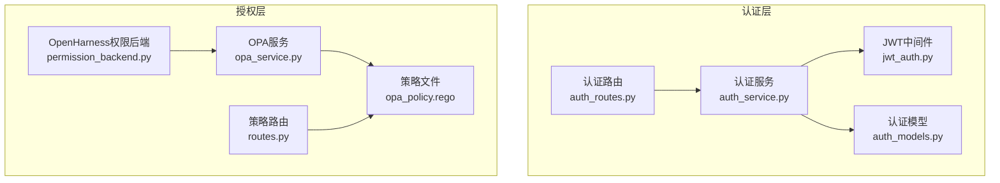
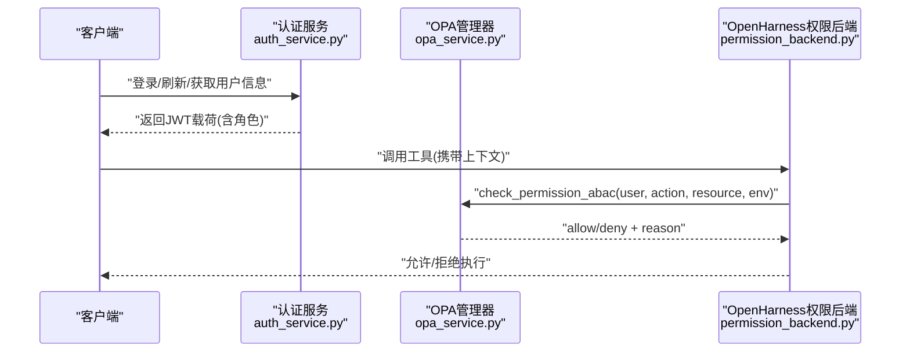
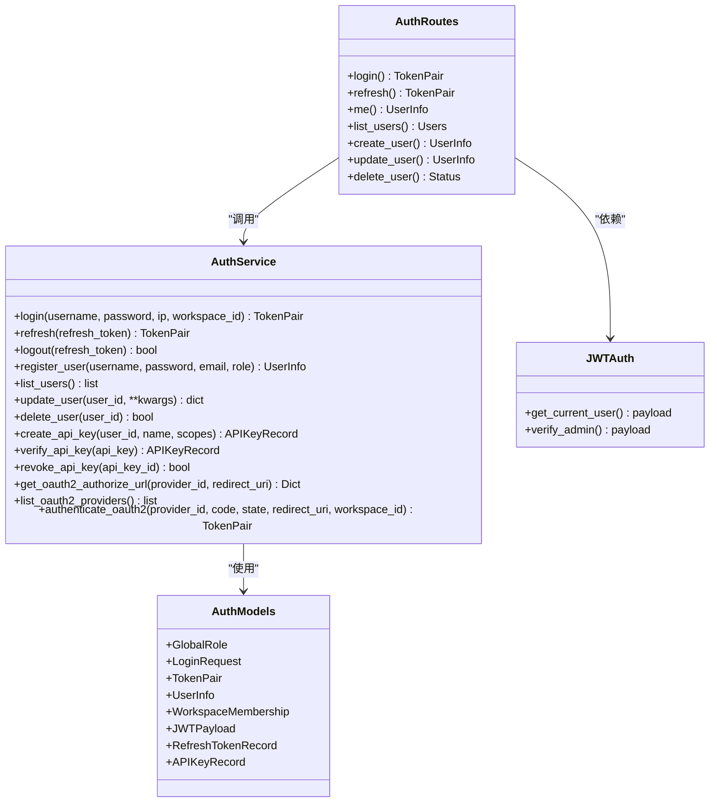
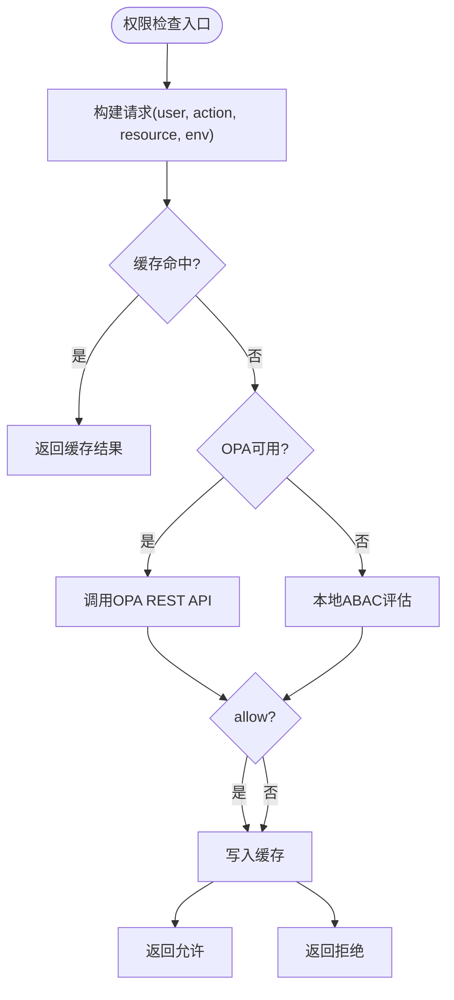
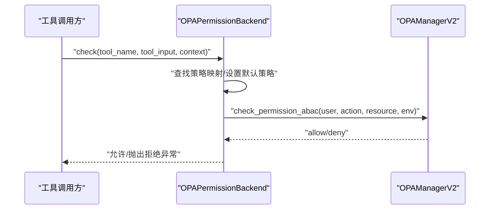
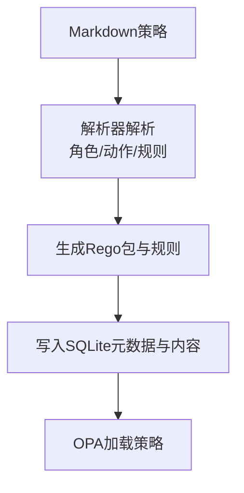
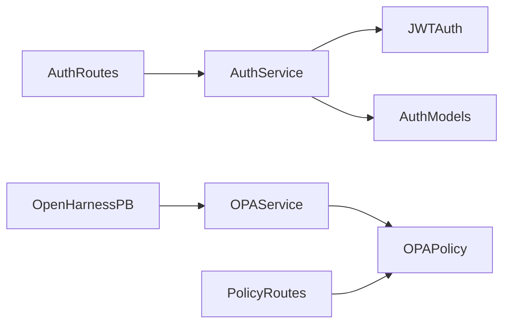

# 角色权限系统

<cite>
**本文档引用的文件**
- [auth_routes.py](file://odap/infra/security/auth_routes.py)
- [auth_service.py](file://odap/infra/security/auth_service.py)
- [auth_models.py](file://odap/infra/security/auth_models.py)
- [jwt_auth.py](file://odap/infra/security/jwt_auth.py)
- [opa_service.py](file://odap/infra/opa/opa_service.py)
- [routes.py](file://odap/infra/opa/routes.py)
- [opa_policy.rego](file://odap/infra/opa/opa_policy.rego)
- [permission_backend.py](file://odap/infra/openharness/permission_backend.py)
- [DESIGN.md](file://docs/03-modules/auth/DESIGN.md)
- [DESIGN.md](file://docs/03-modules/opa_policy/DESIGN.md)
- [test_roles.py](file://tests/unit/test_roles.py)
- [test_role_opa_sync.py](file://tests/unit/test_role_opa_sync.py)
</cite>

## 目录
1. [简介](#简介)
2. [项目结构](#项目结构)
3. [核心组件](#核心组件)
4. [架构总览](#架构总览)
5. [详细组件分析](#详细组件分析)
6. [依赖关系分析](#依赖关系分析)
7. [性能考虑](#性能考虑)
8. [故障排除指南](#故障排除指南)
9. [结论](#结论)
10. [附录](#附录)

## 简介
本文件面向角色权限系统，系统采用“认证层 + 授权层”的分层架构：认证层负责身份验证与凭证发放，授权层通过 OPA 策略引擎进行细粒度权限控制。系统支持多种认证方式（本地账号、OAuth2/OIDC、API Key），提供基于角色与属性的 ABAC 权限模型，具备策略热更新、缓存加速、审计追踪与合规检查能力。

## 项目结构
围绕角色权限系统的关键模块包括：
- 认证模块：用户管理、登录/刷新/登出、OAuth2/OIDC、API Key 管理
- 授权模块：OPA 策略引擎、策略热更新、缓存、批量检查、沙箱调试
- OpenHarness 权限后端：将工具调用与 OPA 策略对接
- 设计文档：模块职责、接口约定、安全最佳实践
- 测试：角色与权限同步、OPA 策略同步等单元测试

**图示来源**
- [auth_routes.py:1-143](file://odap/infra/security/auth_routes.py#L1-L143)
- [auth_service.py:1-439](file://odap/infra/security/auth_service.py#L1-L439)
- [auth_models.py:1-128](file://odap/infra/security/auth_models.py#L1-L128)
- [jwt_auth.py:1-63](file://odap/infra/security/jwt_auth.py#L1-L63)
- [opa_service.py:1-750](file://odap/infra/opa/opa_service.py#L1-L750)
- [routes.py:1-422](file://odap/infra/opa/routes.py#L1-L422)
- [opa_policy.rego:1-137](file://odap/infra/opa/opa_policy.rego#L1-L137)
- [permission_backend.py:1-83](file://odap/infra/openharness/permission_backend.py#L1-L83)

**章节来源**
- [auth_routes.py:1-143](file://odap/infra/security/auth_routes.py#L1-L143)
- [auth_service.py:1-439](file://odap/infra/security/auth_service.py#L1-L439)
- [opa_service.py:1-750](file://odap/infra/opa/opa_service.py#L1-L750)
- [routes.py:1-422](file://odap/infra/opa/routes.py#L1-L422)

## 核心组件
- 认证服务与路由
  - 提供登录、刷新、登出、用户管理等接口；支持本地账号密码与 OAuth2/OIDC；JWT 载荷包含用户身份与工作空间角色。
- 授权服务与策略
  - OPA 管理器支持 ABAC 权限评估、策略热更新、缓存、批量检查、沙箱模拟；策略以 Rego 编写并通过 REST API 管理。
- OpenHarness 权限后端
  - 将工具调用映射到具体策略包，执行 ABAC 决策，实现 Fail-Close 安全机制。
- 策略管理与转换
  - 提供策略 CRUD、状态切换、Markdown 到 Rego 的转换器，支持策略版本演进与回滚。

**章节来源**
- [auth_routes.py:40-142](file://odap/infra/security/auth_routes.py#L40-L142)
- [auth_service.py:82-439](file://odap/infra/security/auth_service.py#L82-L439)
- [opa_service.py:455-717](file://odap/infra/opa/opa_service.py#L455-L717)
- [routes.py:110-240](file://odap/infra/opa/routes.py#L110-L240)
- [permission_backend.py:7-83](file://odap/infra/openharness/permission_backend.py#L7-L83)

## 架构总览
系统采用“认证 + 授权”分层，认证模块负责身份与凭证，授权模块负责权限决策。认证中间件将用户身份注入请求上下文，授权模块基于 OPA 策略进行决策，OpenHarness 在工具执行前进行权限拦截。

**图示来源**
- [auth_service.py:118-218](file://odap/infra/security/auth_service.py#L118-L218)
- [opa_service.py:559-583](file://odap/infra/opa/opa_service.py#L559-L583)
- [permission_backend.py:40-76](file://odap/infra/openharness/permission_backend.py#L40-L76)

## 详细组件分析

### 认证模块（用户与凭证）
- 用户管理
  - 支持创建、查询、更新、删除用户；全局角色枚举覆盖 admin、commander、analyst、operator、observer 等。
- 登录与令牌
  - 本地登录进行密码校验与登录限流；签发短期 access_token 与长期 refresh_token；支持刷新与吊销。
- OAuth2/OIDC
  - 支持授权码流程，自动创建/关联 OIDC 用户；支持列出提供商与获取授权 URL。
- API Key
  - 支持创建、吊销、查询 API Key；支持作用域与过期时间控制。

**图示来源**
- [auth_service.py:82-439](file://odap/infra/security/auth_service.py#L82-L439)
- [auth_routes.py:1-143](file://odap/infra/security/auth_routes.py#L1-L143)
- [jwt_auth.py:1-63](file://odap/infra/security/jwt_auth.py#L1-L63)
- [auth_models.py:1-128](file://odap/infra/security/auth_models.py#L1-L128)

**章节来源**
- [auth_routes.py:40-142](file://odap/infra/security/auth_routes.py#L40-L142)
- [auth_service.py:82-439](file://odap/infra/security/auth_service.py#L82-L439)
- [auth_models.py:34-128](file://odap/infra/security/auth_models.py#L34-L128)
- [jwt_auth.py:14-63](file://odap/infra/security/jwt_auth.py#L14-L63)

### 授权模块（OPA策略引擎）
- ABAC 权限评估
  - 基于用户角色、属性、资源类型与环境约束进行决策；支持限制规则（如禁止攻击民用设施）与清分级检查。
- 策略热更新与版本管理
  - 支持 Bundle 管理、热更新、回滚；记录策略历史与版本信息。
- 缓存与批量检查
  - 基于请求键的缓存命中统计；支持批量权限检查提升吞吐。
- 沙箱与调试
  - 提供策略沙箱与 What-If 分析，支持策略模拟与执行路径可视化。
- 策略管理 API
  - 提供策略 CRUD、启用/禁用、Markdown 到 Rego 转换与版本演进。

**图示来源**
- [opa_service.py:538-583](file://odap/infra/opa/opa_service.py#L538-L583)
- [opa_service.py:684-706](file://odap/infra/opa/opa_service.py#L684-L706)

**章节来源**
- [opa_service.py:114-225](file://odap/infra/opa/opa_service.py#L114-L225)
- [opa_service.py:227-371](file://odap/infra/opa/opa_service.py#L227-L371)
- [opa_service.py:455-717](file://odap/infra/opa/opa_service.py#L455-L717)
- [routes.py:110-240](file://odap/infra/opa/routes.py#L110-L240)

### OpenHarness 权限后端
- 工具到策略映射
  - 将工具名称映射到具体策略包，若未找到则使用默认策略。
- ABAC 决策
  - 从上下文提取用户角色、ID、目标、武器等信息，调用 OPA 进行权限判断。
- Fail-Close
  - OPA 不可用或异常时，默认拒绝，确保安全边界。

**图示来源**
- [permission_backend.py:40-76](file://odap/infra/openharness/permission_backend.py#L40-L76)
- [opa_service.py:559-583](file://odap/infra/opa/opa_service.py#L559-L583)

**章节来源**
- [permission_backend.py:7-83](file://odap/infra/openharness/permission_backend.py#L7-L83)

### 策略管理与转换
- 策略持久化
  - 使用 SQLite 存储策略元数据与 Rego 内容，支持分页查询、状态切换与版本号递增。
- Markdown 到 Rego
  - 提供解析器将自然语言策略转换为 Rego 规则，支持角色、动作、条件映射与生成规则体。
- 默认策略
  - 初始化时插入访问控制、数据隐私、合规审计等默认策略，便于快速启动。

**图示来源**
- [routes.py:242-422](file://odap/infra/opa/routes.py#L242-L422)
- [routes.py:39-94](file://odap/infra/opa/routes.py#L39-L94)

**章节来源**
- [routes.py:110-240](file://odap/infra/opa/routes.py#L110-L240)
- [routes.py:242-422](file://odap/infra/opa/routes.py#L242-L422)

## 依赖关系分析
- 认证模块依赖
  - 依赖 JWT 中间件与认证模型；用户管理接口受管理员权限保护。
- 授权模块依赖
  - 依赖 OPA REST API；策略文件与策略路由共同构成策略治理。
- OpenHarness 依赖
  - 依赖 OPA 管理器；在工具执行前进行权限拦截。

**图示来源**
- [auth_routes.py:1-143](file://odap/infra/security/auth_routes.py#L1-L143)
- [auth_service.py:1-439](file://odap/infra/security/auth_service.py#L1-L439)
- [jwt_auth.py:1-63](file://odap/infra/security/jwt_auth.py#L1-L63)
- [opa_service.py:1-750](file://odap/infra/opa/opa_service.py#L1-L750)
- [routes.py:1-422](file://odap/infra/opa/routes.py#L1-L422)
- [permission_backend.py:1-83](file://odap/infra/openharness/permission_backend.py#L1-L83)

**章节来源**
- [auth_routes.py:1-143](file://odap/infra/security/auth_routes.py#L1-L143)
- [opa_service.py:1-750](file://odap/infra/opa/opa_service.py#L1-L750)
- [permission_backend.py:1-83](file://odap/infra/openharness/permission_backend.py#L1-L83)

## 性能考虑
- 缓存策略
  - 基于请求键的缓存命中统计，支持 TTL 与容量上限；可通过缓存统计指标优化命中率。
- 批量检查
  - 支持批量权限检查，减少网络往返与 OPA 调用次数。
- 策略优化
  - 提供策略预编译缓存与批量评估优化，降低重复计算开销。
- OPA 连接
  - 健康检查与降级（Mock）策略，避免 OPA 不可用导致的服务中断。

**章节来源**
- [opa_service.py:473-481](file://odap/infra/opa/opa_service.py#L473-L481)
- [opa_service.py:585-598](file://odap/infra/opa/opa_service.py#L585-L598)
- [opa_service.py:679-714](file://odap/infra/opa/opa_service.py#L679-L714)

## 故障排除指南
- 认证相关
  - 登录失败：检查用户名/密码、登录限流状态；确认刷新令牌有效性与过期时间。
  - OAuth2 失败：检查授权码交换与用户信息获取流程；确认提供商配置正确。
- 授权相关
  - OPA 调用失败：检查 OPA 服务健康状态；查看降级到本地评估的日志；核对策略包与规则。
  - 权限异常：通过缓存统计与策略历史定位问题；使用沙箱与 What-If 分析验证策略。
- OpenHarness
  - 工具调用被拒：检查工具到策略映射；核对上下文中的用户角色与资源属性；确认环境约束。

**章节来源**
- [auth_service.py:118-218](file://odap/infra/security/auth_service.py#L118-L218)
- [opa_service.py:444-449](file://odap/infra/opa/opa_service.py#L444-L449)
- [permission_backend.py:54-68](file://odap/infra/openharness/permission_backend.py#L54-L68)

## 结论
该角色权限系统通过“认证 + 授权”的清晰分层，结合 OPA 策略引擎实现了灵活、可演进、可观测的权限控制。认证模块提供多方式登录与凭证管理，授权模块提供 ABAC 决策、策略热更新与缓存优化，OpenHarness 将策略无缝嵌入工具执行流程。配合策略管理 API 与沙箱调试能力，系统在保证安全的同时兼顾了开发效率与运维便利。

## 附录

### API 接口文档（认证与策略）
- 认证接口
  - 登录：POST /api/auth/login
  - 刷新：POST /api/auth/refresh
  - 当前用户：GET /api/auth/me
  - 用户管理（管理员）：GET /api/auth/users, POST /api/auth/users, PUT /api/auth/users/{user_id}, DELETE /api/auth/users/{user_id}
- 策略接口
  - 列表：GET /api/policies
  - 创建：POST /api/policies
  - 查询：GET /api/policies/{policy_id}
  - 更新：PUT /api/policies/{policy_id}
  - 启用/禁用：POST /api/policies/{policy_id}/toggle

**章节来源**
- [auth_routes.py:40-142](file://odap/infra/security/auth_routes.py#L40-L142)
- [routes.py:110-240](file://odap/infra/opa/routes.py#L110-L240)

### 角色与权限同步（测试参考）
- 角色与权限 CRUD、技能绑定、策略绑定与优先级排序
- 角色到 OPA 策略同步：将角色权限映射为 Rego 策略并加载至 OPA

**章节来源**
- [test_roles.py:1-324](file://tests/unit/test_roles.py#L1-L324)
- [test_role_opa_sync.py:1-144](file://tests/unit/test_role_opa_sync.py#L1-L144)