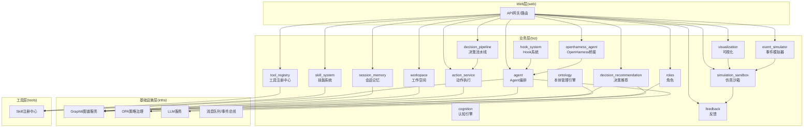
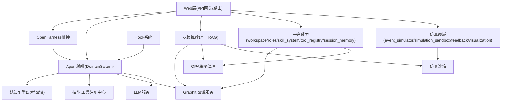
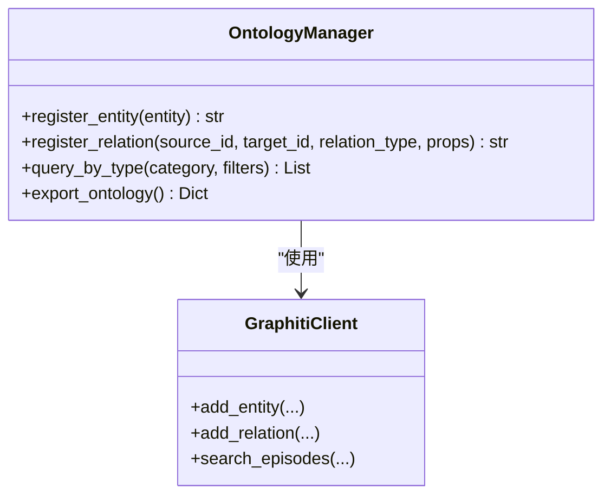
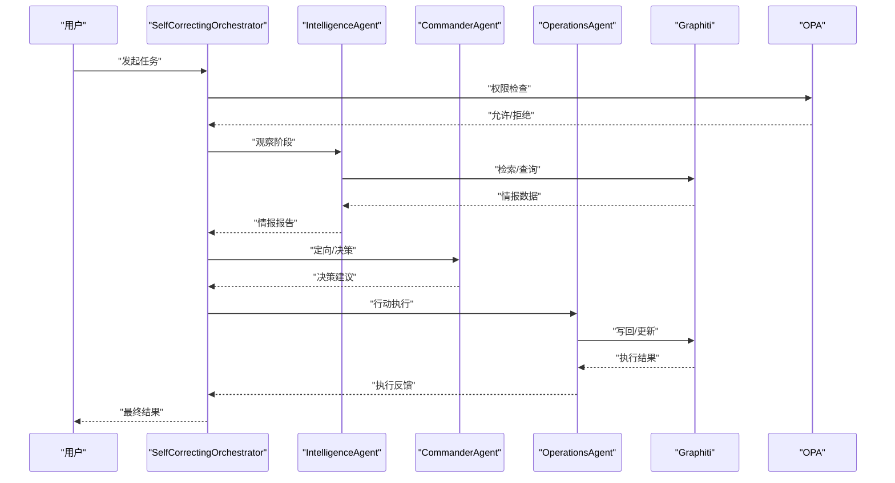
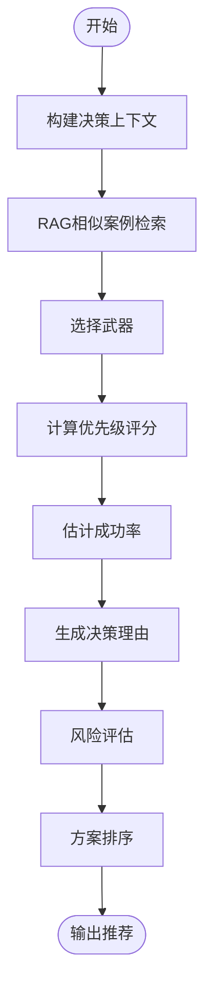
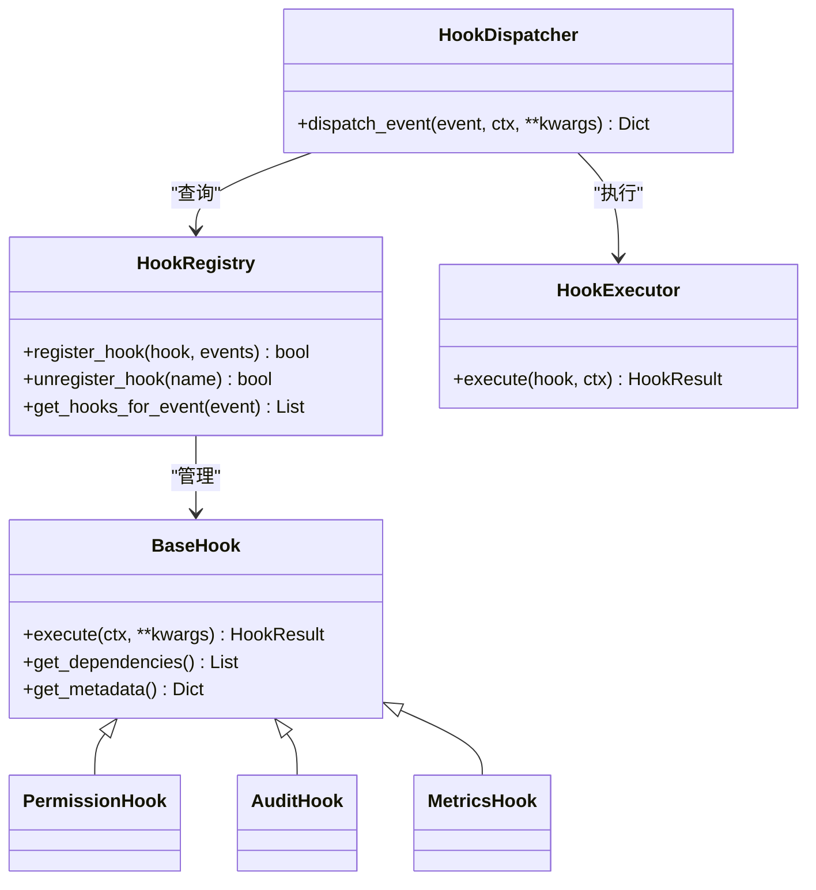
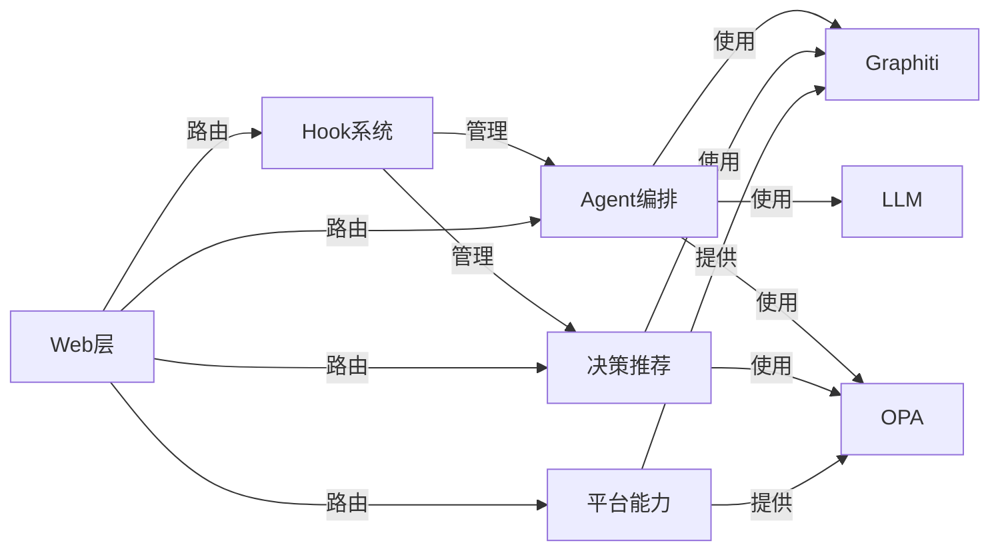

# 核心模块

<cite>
**本文引用的文件**
- [odap/biz/core/ontology/__init__.py](file://odap/biz/core/ontology/__init__.py)
- [odap/biz/core/cognition/__init__.py](file://odap/biz/core/cognition/__init__.py)
- [odap/biz/core/agent/__init__.py](file://odap/biz/core/agent/__init__.py)
- [odap/biz/decision/decision_recommendation/__init__.py](file://odap/biz/decision/decision_recommendation/__init__.py)
- [odap/biz/decision/decision_pipeline/__init__.py](file://odap/biz/decision/decision_pipeline/__init__.py)
- [odap/biz/decision/action_service/__init__.py](file://odap/biz/decision/action_service/__init__.py)
- [odap/biz/integration/openharness_agent/__init__.py](file://odap/biz/integration/openharness_agent/__init__.py)
- [odap/biz/integration/hook_system/__init__.py](file://odap/biz/integration/hook_system/__init__.py)
- [odap/biz/platform/workspace/__init__.py](file://odap/biz/platform/workspace/__init__.py)
- [odap/biz/platform/roles/__init__.py](file://odap/biz/platform/roles/__init__.py)
- [odap/biz/platform/skill_system/__init__.py](file://odap/biz/platform/skill_system/__init__.py)
- [odap/biz/platform/tool_registry/__init__.py](file://odap/biz/platform/tool_registry/__init__.py)
- [odap/biz/platform/session_memory/__init__.py](file://odap/biz/platform/session_memory/__init__.py)
- [odap/biz/simulation/event_simulator/__init__.py](file://odap/biz/simulation/event_simulator/__init__.py)
- [odap/biz/simulation/simulation_sandbox/__init__.py](file://odap/biz/simulation/simulation_sandbox/__init__.py)
- [odap/biz/simulation/feedback/__init__.py](file://odap/biz/simulation/feedback/__init__.py)
- [odap/biz/simulation/visualization/__init__.py](file://odap/biz/simulation/visualization/__init__.py)
- [odap/tools/__init__.py](file://odap/tools/__init__.py)
- [odap/web/__init__.py](file://odap/web/__init__.py)
- [odap/infra/__init__.py](file://odap/infra/__init__.py)
- [docs/03-modules/ontology/DESIGN.md](file://docs/03-modules/ontology/DESIGN.md)
- [docs/03-modules/agent/DESIGN.md](file://docs/03-modules/agent/DESIGN.md)
- [docs/03-modules/decision_recommendation/DESIGN.md](file://docs/03-modules/decision_recommendation/DESIGN.md)
- [docs/03-modules/hook_system/DESIGN.md](file://docs/03-modules/hook_system/DESIGN.md)
</cite>

## 目录
1. [引言](#引言)
2. [项目结构](#项目结构)
3. [核心组件](#核心组件)
4. [架构总览](#架构总览)
5. [详细组件分析](#详细组件分析)
6. [依赖分析](#依赖分析)
7. [性能考虑](#性能考虑)
8. [故障排查指南](#故障排查指南)
9. [结论](#结论)
10. [附录](#附录)

## 引言
本文件面向ODAP平台的核心业务模块，系统梳理并解释以下领域模块的设计理念、职责边界、关键实现与协作关系：核心领域（ontology、cognition、agent）、决策领域（decision_recommendation、decision_pipeline、action_service）、集成领域（openharness_agent、mcp_adapter、hook_system）、平台领域（workspace、roles、skill_system、tool_registry、session_memory）、仿真领域（event_simulator、simulation_sandbox、feedback、visualization）。文档同时提供扩展与定制指导、性能优化建议与最佳实践，帮助开发者进行模块级的技术参考与二次开发。

## 项目结构
ODAP平台采用“业务层biz + 基础设施层infra + 工具层tools + Web层web”的分层组织方式。核心模块分布在biz下的多子域中，分别承担本体建模、认知推理、Agent编排、决策推荐、仿真推演、平台能力与集成适配等职责。模块间通过统一的工具注册中心、权限与策略治理、以及OpenHarness桥接形成松耦合协作。

**图表来源**
- [odap/biz/core/ontology/__init__.py](file://odap/biz/core/ontology/__init__.py)
- [odap/biz/core/agent/__init__.py](file://odap/biz/core/agent/__init__.py)
- [odap/biz/decision/decision_recommendation/__init__.py](file://odap/biz/decision/decision_recommendation/__init__.py)
- [odap/biz/decision/decision_pipeline/__init__.py](file://odap/biz/decision/decision_pipeline/__init__.py)
- [odap/biz/decision/action_service/__init__.py](file://odap/biz/decision/action_service/__init__.py)
- [odap/biz/integration/openharness_agent/__init__.py](file://odap/biz/integration/openharness_agent/__init__.py)
- [odap/biz/integration/hook_system/__init__.py](file://odap/biz/integration/hook_system/__init__.py)
- [odap/biz/platform/workspace/__init__.py](file://odap/biz/platform/workspace/__init__.py)
- [odap/biz/platform/roles/__init__.py](file://odap/biz/platform/roles/__init__.py)
- [odap/biz/platform/skill_system/__init__.py](file://odap/biz/platform/skill_system/__init__.py)
- [odap/biz/platform/tool_registry/__init__.py](file://odap/biz/platform/tool_registry/__init__.py)
- [odap/biz/platform/session_memory/__init__.py](file://odap/biz/platform/session_memory/__init__.py)
- [odap/biz/simulation/event_simulator/__init__.py](file://odap/biz/simulation/event_simulator/__init__.py)
- [odap/biz/simulation/simulation_sandbox/__init__.py](file://odap/biz/simulation/simulation_sandbox/__init__.py)
- [odap/biz/simulation/feedback/__init__.py](file://odap/biz/simulation/feedback/__init__.py)
- [odap/biz/simulation/visualization/__init__.py](file://odap/biz/simulation/visualization/__init__.py)
- [odap/tools/__init__.py](file://odap/tools/__init__.py)
- [odap/web/__init__.py](file://odap/web/__init__.py)
- [odap/infra/__init__.py](file://odap/infra/__init__.py)

**章节来源**
- [odap/biz/core/ontology/__init__.py](file://odap/biz/core/ontology/__init__.py)
- [odap/biz/core/agent/__init__.py](file://odap/biz/core/agent/__init__.py)
- [odap/biz/decision/decision_recommendation/__init__.py](file://odap/biz/decision/decision_recommendation/__init__.py)
- [odap/biz/integration/openharness_agent/__init__.py](file://odap/biz/integration/openharness_agent/__init__.py)
- [odap/biz/integration/hook_system/__init__.py](file://odap/biz/integration/hook_system/__init__.py)
- [odap/biz/platform/workspace/__init__.py](file://odap/biz/platform/workspace/__init__.py)
- [odap/biz/platform/skill_system/__init__.py](file://odap/biz/platform/skill_system/__init__.py)
- [odap/biz/platform/tool_registry/__init__.py](file://odap/biz/platform/tool_registry/__init__.py)
- [odap/biz/platform/session_memory/__init__.py](file://odap/biz/platform/session_memory/__init__.py)
- [odap/biz/simulation/event_simulator/__init__.py](file://odap/biz/simulation/event_simulator/__init__.py)
- [odap/biz/simulation/simulation_sandbox/__init__.py](file://odap/biz/simulation/simulation_sandbox/__init__.py)
- [odap/biz/simulation/feedback/__init__.py](file://odap/biz/simulation/feedback/__init__.py)
- [odap/biz/simulation/visualization/__init__.py](file://odap/biz/simulation/visualization/__init__.py)
- [odap/tools/__init__.py](file://odap/tools/__init__.py)
- [odap/web/__init__.py](file://odap/web/__init__.py)
- [odap/infra/__init__.py](file://odap/infra/__init__.py)

## 核心组件
本节对各核心模块进行职责与能力概览，便于快速定位与扩展。

- 本体管理引擎（ontology）
  - 职责：定义领域实体与关系类型、版本管理、验证规则、与Graphiti图谱集成。
  - 关键点：支持常规本体与仿真推演本体扩展，提供实体/关系/验证器与管理器。
- 认知引擎（cognition）
  - 职责：支撑思考图谱、用户认知建模与推理。
  - 关键点：与Graphiti图谱服务、LLM服务协同，提供可解释的推理过程。
- Agent编排（agent）
  - 职责：OODA循环（观察-定向-决策-行动）与多Agent协同。
  - 关键点：DomainSwarm编排器、SelfCorrectingOrchestrator自校正、与Skill/OPA/Graphiti交互。
- 决策推荐（decision_recommendation）
  - 职责：基于RAG的历史案例生成打击方案、风险评估、解释生成与排序。
  - 关键点：与Graphiti知识图谱、OPA策略治理、仿真沙箱联动。
- 决策流水线（decision_pipeline）
  - 职责：承接推荐结果，形成可执行的决策流程与状态机。
  - 关键点：接口与路由、Schema定义、与动作服务对接。
- 动作服务（action_service）
  - 职责：执行具体动作（如下发打击指令），写回结果与反馈。
  - 关键点：执行器、反馈回路、存储与写回。
- OpenHarness桥接（openharness_agent）
  - 职责：将ODAP能力接入OpenHarness生态，提供统一路由入口。
  - 关键点：API路由、会话与内存适配、工具适配。
- Hook系统（hook_system）
  - 职责：在Agent生命周期与工具调用等关键点进行拦截、增强与监控。
  - 关键点：Hook注册表、分发器、执行器、编排器与多种Hook实现。
- 平台能力（workspace、roles、skill_system、tool_registry、session_memory）
  - 职责：工作空间隔离与资源管理、角色与权限、技能/工具注册与调度、会话记忆。
  - 关键点：与OPA策略治理、Graphiti图谱、OpenHarness桥接协同。
- 仿真领域（event_simulator、simulation_sandbox、feedback、visualization）
  - 职责：事件模拟、沙箱执行、结果反馈与可视化。
  - 关键点：模拟场景/版本/执行/结果建模，与决策推荐联动。

**章节来源**
- [odap/biz/core/ontology/__init__.py](file://odap/biz/core/ontology/__init__.py)
- [odap/biz/core/cognition/__init__.py](file://odap/biz/core/cognition/__init__.py)
- [odap/biz/core/agent/__init__.py](file://odap/biz/core/agent/__init__.py)
- [odap/biz/decision/decision_recommendation/__init__.py](file://odap/biz/decision/decision_recommendation/__init__.py)
- [odap/biz/decision/decision_pipeline/__init__.py](file://odap/biz/decision/decision_pipeline/__init__.py)
- [odap/biz/decision/action_service/__init__.py](file://odap/biz/decision/action_service/__init__.py)
- [odap/biz/integration/openharness_agent/__init__.py](file://odap/biz/integration/openharness_agent/__init__.py)
- [odap/biz/integration/hook_system/__init__.py](file://odap/biz/integration/hook_system/__init__.py)
- [odap/biz/platform/workspace/__init__.py](file://odap/biz/platform/workspace/__init__.py)
- [odap/biz/platform/roles/__init__.py](file://odap/biz/platform/roles/__init__.py)
- [odap/biz/platform/skill_system/__init__.py](file://odap/biz/platform/skill_system/__init__.py)
- [odap/biz/platform/tool_registry/__init__.py](file://odap/biz/platform/tool_registry/__init__.py)
- [odap/biz/platform/session_memory/__init__.py](file://odap/biz/platform/session_memory/__init__.py)
- [odap/biz/simulation/event_simulator/__init__.py](file://odap/biz/simulation/event_simulator/__init__.py)
- [odap/biz/simulation/simulation_sandbox/__init__.py](file://odap/biz/simulation/simulation_sandbox/__init__.py)
- [odap/biz/simulation/feedback/__init__.py](file://odap/biz/simulation/feedback/__init__.py)
- [odap/biz/simulation/visualization/__init__.py](file://odap/biz/simulation/visualization/__init__.py)

## 架构总览
ODAP平台以“业务域”为核心，围绕Agent编排与决策推荐形成闭环；通过OpenHarness桥接与Hook系统实现横切能力注入；平台能力提供资源隔离与权限治理；仿真领域为决策提供验证与优化手段；工具层与Web层提供统一的外部接口与扩展点。

**图表来源**
- [docs/03-modules/agent/DESIGN.md](file://docs/03-modules/agent/DESIGN.md)
- [docs/03-modules/decision_recommendation/DESIGN.md](file://docs/03-modules/decision_recommendation/DESIGN.md)
- [docs/03-modules/hook_system/DESIGN.md](file://docs/03-modules/hook_system/DESIGN.md)
- [odap/biz/core/agent/__init__.py](file://odap/biz/core/agent/__init__.py)
- [odap/biz/decision/decision_recommendation/__init__.py](file://odap/biz/decision/decision_recommendation/__init__.py)
- [odap/biz/integration/openharness_agent/__init__.py](file://odap/biz/integration/openharness_agent/__init__.py)
- [odap/biz/integration/hook_system/__init__.py](file://odap/biz/integration/hook_system/__init__.py)
- [odap/biz/platform/workspace/__init__.py](file://odap/biz/platform/workspace/__init__.py)
- [odap/biz/platform/roles/__init__.py](file://odap/biz/platform/roles/__init__.py)
- [odap/biz/platform/skill_system/__init__.py](file://odap/biz/platform/skill_system/__init__.py)
- [odap/biz/platform/tool_registry/__init__.py](file://odap/biz/platform/tool_registry/__init__.py)
- [odap/biz/platform/session_memory/__init__.py](file://odap/biz/platform/session_memory/__init__.py)
- [odap/biz/simulation/simulation_sandbox/__init__.py](file://odap/biz/simulation/simulation_sandbox/__init__.py)
- [odap/web/__init__.py](file://odap/web/__init__.py)

## 详细组件分析

### 本体管理引擎（ontology）
- 职责与能力
  - 定义领域实体与关系类型，提供验证规则与版本管理。
  - 与Graphiti图谱集成，支持实体/关系注册与查询。
  - 支持仿真推演本体扩展，覆盖场景、版本、执行、结果与分析实体。
- 关键实现要点
  - 实体/关系/验证器与管理器的模块化组织。
  - 与Graphiti客户端的异步交互封装。
  - 本体Schema导出与版本快照管理。
- 扩展与定制
  - 新增实体类型需补充模型、验证器与约束。
  - 通过管理器接口扩展注册/查询/导出能力。
- 性能与可靠性
  - 批量注册与查询时注意分页与并发控制。
  - 验证器前置校验降低下游错误率。

**图表来源**
- [docs/03-modules/ontology/DESIGN.md](file://docs/03-modules/ontology/DESIGN.md)

**章节来源**
- [docs/03-modules/ontology/DESIGN.md](file://docs/03-modules/ontology/DESIGN.md)

### 认知引擎（cognition）
- 职责与能力
  - 基于Graphiti图谱与LLM服务构建思考图谱，支撑用户认知建模与推理。
  - 提供可解释的分析过程与链路追踪。
- 关键实现要点
  - 与Graphiti图谱服务的时序事实检索与上下文构建。
  - 与LLM服务的ReAct式分析流程。
- 扩展与定制
  - 可替换LLM模型与提示词模板。
  - 可扩展思考图谱节点与边的类型。

**章节来源**
- [odap/biz/core/cognition/__init__.py](file://odap/biz/core/cognition/__init__.py)

### Agent编排（agent）
- 职责与能力
  - OODA循环：观察（情报收集）→定向（态势分析）→决策（制定方案）→行动（执行）。
  - 多Agent协同与自校正机制，支持权限检查与结果验证。
- 关键实现要点
  - DomainSwarm作为编排器，协调各Agent阶段转换与结果聚合。
  - SelfCorrectingOrchestrator在异常时触发校正策略。
  - 与Skill注册中心、Graphiti、OPA、LLM的集成。
- 扩展与定制
  - 可新增Agent类型并注册到编排器。
  - 可自定义校正触发条件与策略。

**图表来源**
- [docs/03-modules/agent/DESIGN.md](file://docs/03-modules/agent/DESIGN.md)

**章节来源**
- [docs/03-modules/agent/DESIGN.md](file://docs/03-modules/agent/DESIGN.md)

### 决策推荐（decision_recommendation）
- 职责与能力
  - 基于Graphiti知识图谱的RAG增强推理，生成打击方案、风险评估、解释生成与排序。
  - 与OPA策略治理集成，确保合规性。
  - 与仿真沙箱联动，支持策略对比与What-if分析。
- 关键实现要点
  - 方案生成器：相似案例检索、武器选择、优先级评分、成功率估算、理由生成。
  - 风险评估器：附带损伤、反击、天气、技术等多因子加权评估。
  - 上下文构建器：目标信息、历史案例、关联情报与时序变化。
- 扩展与定制
  - 可扩展风险因子权重与阈值。
  - 可新增相似案例检索策略与武器评分函数。

**图表来源**
- [docs/03-modules/decision_recommendation/DESIGN.md](file://docs/03-modules/decision_recommendation/DESIGN.md)

**章节来源**
- [docs/03-modules/decision_recommendation/DESIGN.md](file://docs/03-modules/decision_recommendation/DESIGN.md)

### 决策流水线（decision_pipeline）
- 职责与能力
  - 将决策推荐结果转化为可执行的流水线，管理状态与流转。
  - 提供接口、路由与Schema定义，与动作服务对接。
- 关键实现要点
  - 状态机驱动的流程控制。
  - 与动作服务的写回与反馈集成。
- 扩展与定制
  - 可新增流程节点与状态转换规则。
  - 可扩展写回与反馈处理逻辑。

**章节来源**
- [odap/biz/decision/decision_pipeline/__init__.py](file://odap/biz/decision/decision_pipeline/__init__.py)

### 动作服务（action_service）
- 职责与能力
  - 执行具体动作（如下发打击指令），写回结果与反馈。
  - 提供执行器、反馈回路与存储。
- 关键实现要点
  - 与Graphiti图谱的写回与状态更新。
  - 与决策流水线的状态同步。
- 扩展与定制
  - 可新增动作类型与执行器。
  - 可扩展反馈与写回策略。

**章节来源**
- [odap/biz/decision/action_service/__init__.py](file://odap/biz/decision/action_service/__init__.py)

### OpenHarness桥接（openharness_agent）
- 职责与能力
  - 提供统一API路由，将ODAP能力接入OpenHarness生态。
  - 适配会话、内存与工具，实现跨Agent协作。
- 关键实现要点
  - 路由器与运行时服务。
  - 与ODAP内部模块的适配层。
- 扩展与定制
  - 可新增适配器以支持新的工具或协议。

**章节来源**
- [odap/biz/integration/openharness_agent/__init__.py](file://odap/biz/integration/openharness_agent/__init__.py)

### Hook系统（hook_system）
- 职责与能力
  - 在Agent生命周期与工具调用等关键点进行拦截、增强与监控。
  - 支持权限校验、审计日志、性能监控、策略注入等横切关注点。
- 关键实现要点
  - Hook注册表、分发器、执行器、编排器。
  - 多种Hook实现：权限Hook、审计Hook、性能监控Hook等。
- 扩展与定制
  - 可新增Hook类型与执行模式（同步/异步/并行）。
  - 可配置Hook优先级与依赖关系。

**图表来源**
- [docs/03-modules/hook_system/DESIGN.md](file://docs/03-modules/hook_system/DESIGN.md)

**章节来源**
- [docs/03-modules/hook_system/DESIGN.md](file://docs/03-modules/hook_system/DESIGN.md)

### 平台能力（workspace、roles、skill_system、tool_registry、session_memory）
- 工作空间（workspace）
  - 职责：资源隔离、工作空间生命周期管理。
  - 关键点：与隔离服务协作，保障多租户/多任务隔离。
- 角色（roles）
  - 职责：角色定义与权限映射。
  - 关键点：与OPA策略治理同步。
- 技能系统（skill_system）
  - 职责：技能定义、分类与生命周期管理。
  - 关键点：与工具注册中心协同。
- 工具注册中心（tool_registry）
  - 职责：工具注册、发现与调度。
  - 关键点：与Skill注册中心统一管理。
- 会话记忆（session_memory）
  - 职责：会话上下文与历史记录管理。
  - 关键点：与Graphiti图谱结合，支持时序检索。

**章节来源**
- [odap/biz/platform/workspace/__init__.py](file://odap/biz/platform/workspace/__init__.py)
- [odap/biz/platform/roles/__init__.py](file://odap/biz/platform/roles/__init__.py)
- [odap/biz/platform/skill_system/__init__.py](file://odap/biz/platform/skill_system/__init__.py)
- [odap/biz/platform/tool_registry/__init__.py](file://odap/biz/platform/tool_registry/__init__.py)
- [odap/biz/platform/session_memory/__init__.py](file://odap/biz/platform/session_memory/__init__.py)

### 仿真领域（event_simulator、simulation_sandbox、feedback、visualization）
- 事件模拟器（event_simulator）
  - 职责：构造与注入仿真事件，驱动沙箱执行。
- 仿真沙箱（simulation_sandbox）
  - 职责：隔离执行环境，管理场景、版本、执行与结果。
- 反馈（feedback）
  - 职责：收集执行反馈，形成闭环。
- 可视化（visualization）
  - 职责：结果与指标的可视化展示。
- 关键实现要点
  - 场景/版本/执行/结果的实体建模与关系约束。
  - 与决策推荐的集成，支持策略对比与What-if分析。

**章节来源**
- [odap/biz/simulation/event_simulator/__init__.py](file://odap/biz/simulation/event_simulator/__init__.py)
- [odap/biz/simulation/simulation_sandbox/__init__.py](file://odap/biz/simulation/simulation_sandbox/__init__.py)
- [odap/biz/simulation/feedback/__init__.py](file://odap/biz/simulation/feedback/__init__.py)
- [odap/biz/simulation/visualization/__init__.py](file://odap/biz/simulation/visualization/__init__.py)

## 依赖分析
- 模块内聚与耦合
  - Agent编排与认知引擎高度内聚，与Graphiti/LLM/OPA耦合明确。
  - 决策推荐与本体/图谱/策略治理紧密耦合，与仿真沙箱存在运行期耦合。
  - Hook系统作为横切层，对上层模块低侵入，但需要统一的注册与分发机制。
  - 平台能力提供资源与权限治理，对多模块提供共享依赖。
- 外部依赖与集成点
  - Graphiti图谱服务：实体/关系注册与查询。
  - OPA策略治理：权限校验与策略强制。
  - LLM服务：ReAct分析与解释生成。
  - OpenHarness：统一路由与工具适配。
- 潜在循环依赖
  - 通过抽象接口与分层解耦避免循环依赖，例如Hook注册表与执行器分离。

**图表来源**
- [odap/biz/core/agent/__init__.py](file://odap/biz/core/agent/__init__.py)
- [odap/biz/decision/decision_recommendation/__init__.py](file://odap/biz/decision/decision_recommendation/__init__.py)
- [odap/biz/integration/hook_system/__init__.py](file://odap/biz/integration/hook_system/__init__.py)
- [odap/biz/platform/workspace/__init__.py](file://odap/biz/platform/workspace/__init__.py)
- [odap/web/__init__.py](file://odap/web/__init__.py)

**章节来源**
- [odap/biz/core/agent/__init__.py](file://odap/biz/core/agent/__init__.py)
- [odap/biz/decision/decision_recommendation/__init__.py](file://odap/biz/decision/decision_recommendation/__init__.py)
- [odap/biz/integration/hook_system/__init__.py](file://odap/biz/integration/hook_system/__init__.py)
- [odap/biz/platform/workspace/__init__.py](file://odap/biz/platform/workspace/__init__.py)
- [odap/web/__init__.py](file://odap/web/__init__.py)

## 性能考虑
- 图谱查询与写回
  - 使用分页与批量操作，避免单次请求过大。
  - 对高频查询建立缓存与索引，减少重复检索。
- LLM调用
  - 控制上下文长度与温度参数，合理设置超时与重试。
  - 对长对话采用摘要与检索增强，降低token消耗。
- Hook执行
  - 异步/并行执行适合I/O密集型Hook，同步执行适合CPU密集型。
  - 设置合理的超时与熔断策略，避免阻塞主流程。
- 决策推荐
  - RAG检索限制返回数量与相关度阈值，提升响应速度。
  - 风险评估与排序可并行化，减少整体延迟。
- 仿真沙箱
  - 严格控制资源上限与执行时长，防止资源泄漏。
  - 使用隔离级别与快照机制，提高可恢复性。

## 故障排查指南
- 权限问题
  - 检查OPA策略与用户角色映射，确认权限校验是否通过。
  - 通过Hook审计日志定位具体拒绝原因。
- 图谱一致性
  - 校验实体/关系验证器，确保注册前数据合法。
  - 对异常实体/关系进行回滚或修复。
- Agent执行异常
  - 查看链路追踪与Hook执行结果，定位失败环节。
  - 启用自校正策略，必要时降级到简化流程。
- 决策推荐偏差
  - 检查RAG检索质量与相似案例数量。
  - 调整风险因子权重与阈值，重新评估。
- 仿真沙箱异常
  - 检查资源限制与执行超时，查看错误堆栈。
  - 使用快照回滚到稳定版本。

**章节来源**
- [docs/03-modules/hook_system/DESIGN.md](file://docs/03-modules/hook_system/DESIGN.md)
- [docs/03-modules/agent/DESIGN.md](file://docs/03-modules/agent/DESIGN.md)
- [docs/03-modules/decision_recommendation/DESIGN.md](file://docs/03-modules/decision_recommendation/DESIGN.md)

## 结论
ODAP平台通过清晰的分层与模块化设计，实现了从本体建模、认知推理、Agent编排到决策推荐与仿真的完整闭环。OpenHarness与Hook系统提供了强大的扩展与治理能力，平台能力确保了资源与权限的可控性。建议在扩展新模块时遵循“接口先行、分层解耦、可观测性优先”的原则，并结合性能优化与故障排查的最佳实践，持续提升系统的稳定性与可维护性。

## 附录
- 扩展与定制指导
  - 新增实体/关系：在本体模块中定义模型与验证器，并通过管理器注册。
  - 新增Agent：实现BaseAgent接口并通过工厂注册到DomainSwarm。
  - 新增Hook：实现BaseHook并注册到Hook注册表，配置事件类型与优先级。
  - 新增工具/技能：在工具注册中心注册，确保与Skill系统一致。
  - 新增仿真场景：定义场景/版本/执行/结果实体，配置关系约束与验证器。
- 最佳实践
  - 使用Hook进行横切关注点注入，避免在核心逻辑中分散横切代码。
  - 对高频路径进行缓存与批量化处理，降低延迟。
  - 通过仿真沙箱进行策略验证与对比，形成闭环反馈。
  - 保持对外接口的稳定性，通过版本管理与向后兼容策略进行演进。