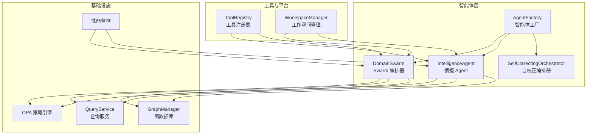
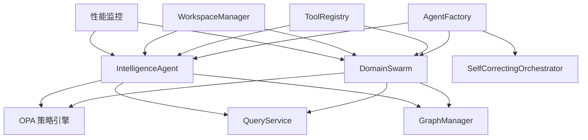
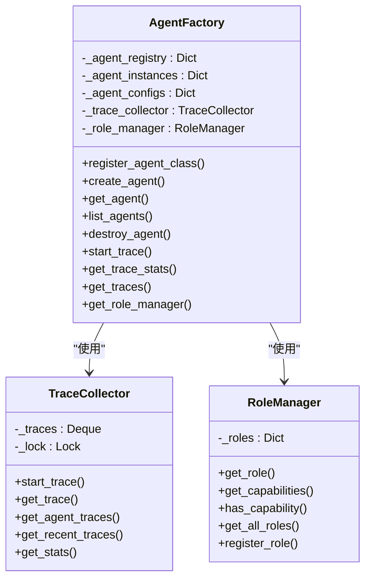
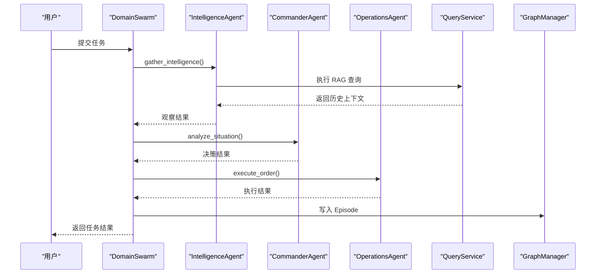
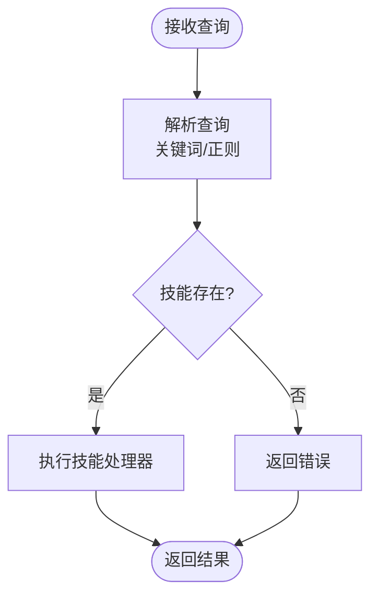
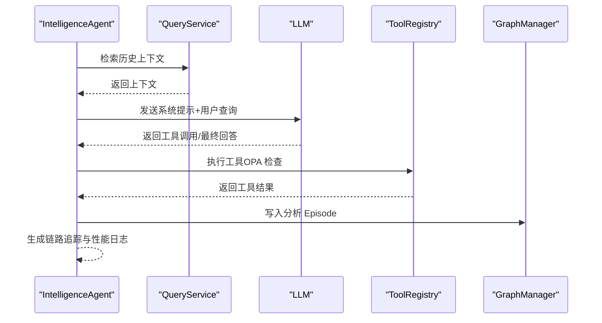
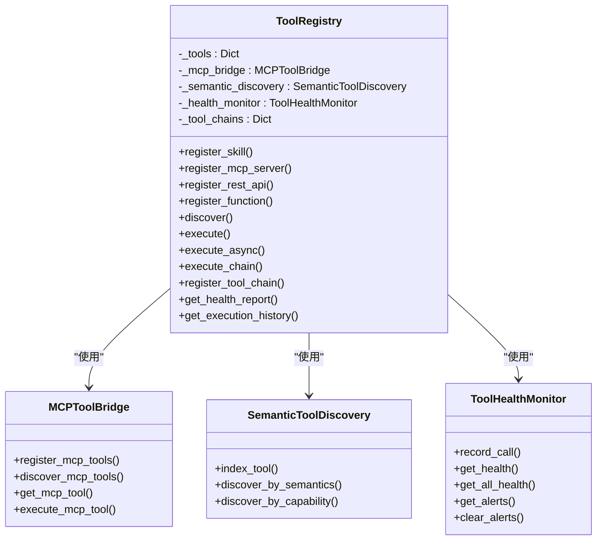
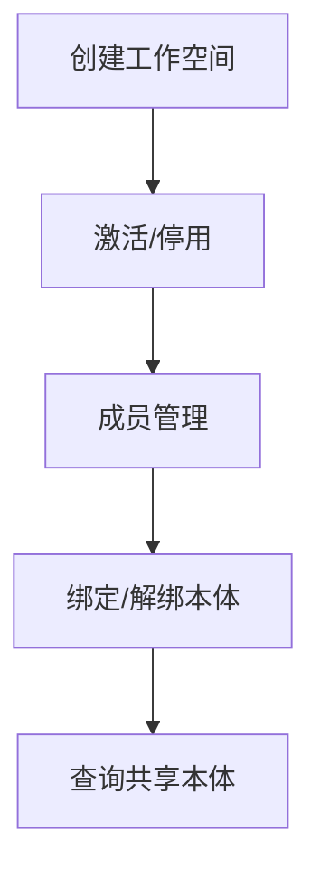
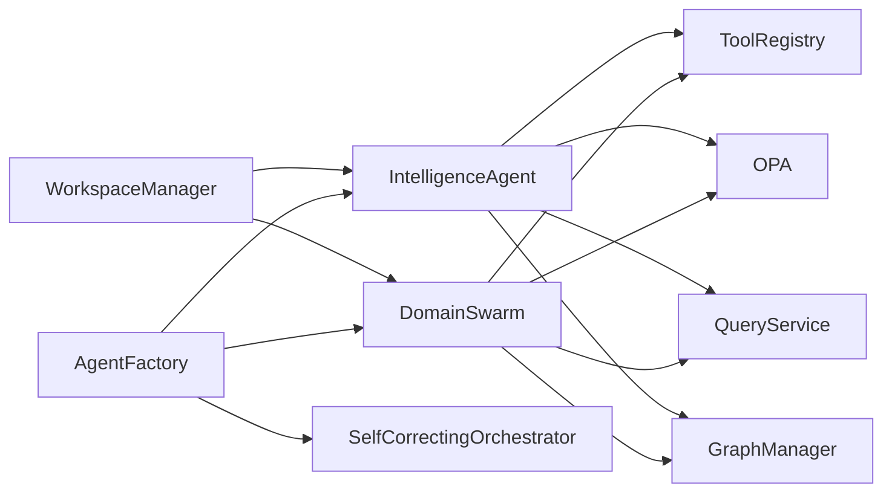

# 智能体系统

<cite>
**本文档引用的文件**
- [agent_factory.py](file://odap/biz/core/agent/agent_factory.py)
- [orchestrator.py](file://odap/biz/core/agent/orchestrator.py)
- [swarm_orchestrator.py](file://odap/biz/core/agent/swarm_orchestrator.py)
- [intelligence_agent.py](file://odap/biz/core/agent/intelligence_agent.py)
- [user_cognition_engine.py](file://odap/biz/core/cognition/user_cognition_engine.py)
- [registry.py](file://odap/biz/platform/tool_registry/registry.py)
- [workspace.py](file://odap/biz/platform/workspace/impl/workspace.py)
</cite>

## 目录
1. [简介](#简介)
2. [项目结构](#项目结构)
3. [核心组件](#核心组件)
4. [架构总览](#架构总览)
5. [详细组件分析](#详细组件分析)
6. [依赖分析](#依赖分析)
7. [性能考量](#性能考量)
8. [故障排查指南](#故障排查指南)
9. [结论](#结论)
10. [附录](#附录)

## 简介
本文件为智能体系统的技术文档，聚焦以下主题：
- 智能体工厂（Agent Factory）的设计与实现：涵盖智能体创建、配置、生命周期管理与追踪。
- 智能体编排器（Orchestrator）的工作原理：任务路由、状态管理与协调机制。
- Swarm 编排器的群体智能模式：多 Agent 协作与 OODA 循环。
- 智能体 API 接口、数据模型、存储策略与扩展机制。
- 智能体类型、行为模式、通信协议与性能优化。
- 实际部署案例与集成指导。

## 项目结构
系统采用分层与模块化组织，核心围绕“智能体”“编排器”“工具注册表”“工作空间”等模块展开，并通过“认知引擎”“查询服务”“图数据库”等基础设施支撑。

**图表来源**
- [agent_factory.py:340-442](file://odap/biz/core/agent/agent_factory.py#L340-L442)
- [swarm_orchestrator.py:288-360](file://odap/biz/core/agent/swarm_orchestrator.py#L288-L360)
- [intelligence_agent.py:73-125](file://odap/biz/core/agent/intelligence_agent.py#L73-L125)
- [orchestrator.py:16-63](file://odap/biz/core/agent/orchestrator.py#L16-L63)
- [registry.py:403-425](file://odap/biz/platform/tool_registry/registry.py#L403-L425)
- [workspace.py:10-114](file://odap/biz/platform/workspace/impl/workspace.py#L10-L114)

**章节来源**
- [agent_factory.py:1-442](file://odap/biz/core/agent/agent_factory.py#L1-L442)
- [swarm_orchestrator.py:1-687](file://odap/biz/core/agent/swarm_orchestrator.py#L1-L687)
- [intelligence_agent.py:1-599](file://odap/biz/core/agent/intelligence_agent.py#L1-L599)
- [orchestrator.py:1-151](file://odap/biz/core/agent/orchestrator.py#L1-L151)
- [registry.py:1-1000](file://odap/biz/platform/tool_registry/registry.py#L1-L1000)
- [workspace.py:1-178](file://odap/biz/platform/workspace/impl/workspace.py#L1-L178)

## 核心组件
- 智能体工厂（AgentFactory）
  - 负责智能体类注册、实例化、生命周期管理、追踪与角色能力管理。
  - 提供全局单例工厂，自动注册三类 Agent（Commander/Intelligence/Operations）。
- Swarm 编排器（DomainSwarm）
  - 实现三 Agent 协同的 OODA 循环（观察-理解-决策-行动），支持流式进度返回与持久化。
- 智能体编排器（SelfCorrectingOrchestrator）
  - 基于关键词正则的任务路由与执行，结合 OPA 权限控制。
- 情报 Agent（IntelligenceAgent）
  - 基于 LLM ReAct 的多步推理与工具调用，结合 RAG 增强与链路追踪。
- 工具注册表（ToolRegistry）
  - 统一管理 Skill/MCP/REST/Function 四类工具，提供发现、健康监控与权限桥接。
- 工作空间管理（WorkspaceManager）
  - 工作空间的创建、成员管理、本体绑定与共享。

**章节来源**
- [agent_factory.py:340-442](file://odap/biz/core/agent/agent_factory.py#L340-L442)
- [swarm_orchestrator.py:288-360](file://odap/biz/core/agent/swarm_orchestrator.py#L288-L360)
- [orchestrator.py:16-63](file://odap/biz/core/agent/orchestrator.py#L16-L63)
- [intelligence_agent.py:73-125](file://odap/biz/core/agent/intelligence_agent.py#L73-L125)
- [registry.py:403-425](file://odap/biz/platform/tool_registry/registry.py#L403-L425)
- [workspace.py:10-114](file://odap/biz/platform/workspace/impl/workspace.py#L10-L114)

## 架构总览
系统以“智能体工厂”为中心，向上提供统一的智能体生命周期与追踪能力；向下连接“工具注册表”“工作空间”“查询服务”“图数据库”“策略引擎”等基础设施，形成“感知-推理-决策-执行-回写”的闭环。

**图表来源**
- [agent_factory.py:340-442](file://odap/biz/core/agent/agent_factory.py#L340-L442)
- [swarm_orchestrator.py:288-360](file://odap/biz/core/agent/swarm_orchestrator.py#L288-L360)
- [intelligence_agent.py:73-125](file://odap/biz/core/agent/intelligence_agent.py#L73-L125)
- [orchestrator.py:16-63](file://odap/biz/core/agent/orchestrator.py#L16-L63)
- [registry.py:403-425](file://odap/biz/platform/tool_registry/registry.py#L403-L425)
- [workspace.py:10-114](file://odap/biz/platform/workspace/impl/workspace.py#L10-L114)

## 详细组件分析

### 智能体工厂（AgentFactory）
- 设计要点
  - 工厂模式：集中管理 Agent 类型与实例，提供注册、创建、销毁与查询。
  - 追踪体系：Trace/TraceSpan/TraceCollector 提供细粒度执行追踪与统计。
  - 角色能力：RoleManager 管理角色与能力映射，支持优先级与审批需求。
- 关键数据结构
  - AgentType/AgentState/TracePhase/TraceStatus/Capability/RoleCapability/RoleConfig
- 生命周期
  - 注册 → 创建 → 运行 → 销毁；支持并发安全锁与全局单例。
- 追踪与统计
  - 支持按 Agent/时间窗口查询追踪，聚合成功率、平均耗时、按 Agent 类型分布。

**图表来源**
- [agent_factory.py:340-442](file://odap/biz/core/agent/agent_factory.py#L340-L442)

**章节来源**
- [agent_factory.py:24-442](file://odap/biz/core/agent/agent_factory.py#L24-L442)

### Swarm 编排器（DomainSwarm）
- 设计要点
  - OODA 循环：Intelligence（感知）→ Commander（理解）→ Operations（决策）→ 执行。
  - 并发与容错：健康监控、状态持久化、故障恢复管理。
  - 流式输出：execute_streaming 提供阶段进度与异常中断。
- 关键数据结构
  - OODAPhase/OODAStatus/OODAProgress/MissionResult/AgentConfig
- 执行流程
  - initialize → execute_mission → 写入 Graphiti Episode → shutdown
- 与工具/策略/图数据库集成
  - 通过 QueryService/RAG 注入上下文；通过 OPA 控制高危操作；通过 GraphManager 写入 Episode。

**图表来源**
- [swarm_orchestrator.py:379-456](file://odap/biz/core/agent/swarm_orchestrator.py#L379-L456)
- [swarm_orchestrator.py:568-613](file://odap/biz/core/agent/swarm_orchestrator.py#L568-L613)

**章节来源**
- [swarm_orchestrator.py:288-687](file://odap/biz/core/agent/swarm_orchestrator.py#L288-L687)

### 智能体编排器（SelfCorrectingOrchestrator）
- 设计要点
  - 基于关键词正则的任务解析与路由，结合用户角色与 OPA 权限控制。
  - 支持多种查询意图（搜索雷达、分析领域、打击推荐、力量对比、攻击、指挥等）。
- 执行流程
  - run(query) → _parse_query() → 校验技能存在性 → 执行 handler → 返回结果或错误。

**图表来源**
- [orchestrator.py:33-63](file://odap/biz/core/agent/orchestrator.py#L33-L63)

**章节来源**
- [orchestrator.py:16-151](file://odap/biz/core/agent/orchestrator.py#L16-L151)

### 情报 Agent（IntelligenceAgent）
- 设计要点
  - ReAct 推理：LLM + 工具调用 + 结论生成；支持 RAG 上下文注入。
  - 权限控制：高危操作经 OPA 检查；工具参数由输入 Schema 驱动。
  - 链路追踪：TraceSpan 记录每轮迭代事件；性能日志输出。
  - 记忆回写：将分析过程写入 GraphManager。
- 执行流程
  - RAG 上下文检索 → 构造系统提示 → 多轮 LLM + 工具调用 → 结构化报告 → 写入记忆 → 性能日志。

**图表来源**
- [intelligence_agent.py:277-306](file://odap/biz/core/agent/intelligence_agent.py#L277-L306)
- [intelligence_agent.py:307-501](file://odap/biz/core/agent/intelligence_agent.py#L307-L501)
- [intelligence_agent.py:251-276](file://odap/biz/core/agent/intelligence_agent.py#L251-L276)

**章节来源**
- [intelligence_agent.py:73-599](file://odap/biz/core/agent/intelligence_agent.py#L73-L599)

### 工具注册表（ToolRegistry）
- 设计要点
  - 统一管理四类工具：Skill、MCP、REST、Function；支持语义发现、健康监控、权限桥接。
  - 提供执行链（ToolChain）与执行历史管理。
- 关键数据结构
  - ToolType/ToolCapability/ToolMetadata/ToolRegistration/ToolChain/ToolExecutionResult
- 执行流程
  - execute() → 解析工具 ID → OPA 权限检查 → 分派至具体执行器 → 记录健康与历史。

**图表来源**
- [registry.py:403-800](file://odap/biz/platform/tool_registry/registry.py#L403-L800)

**章节来源**
- [registry.py:1-1000](file://odap/biz/platform/tool_registry/registry.py#L1-L1000)

### 工作空间管理（WorkspaceManager）
- 设计要点
  - 工作空间的全生命周期管理：创建、激活/停用、成员管理、本体绑定与共享。
  - 支持跨工作空间共享本体，并展示来源（私有/共享）与共享对象。
- 关键数据结构
  - Workspace/WorkspaceStatus/WorkspaceType/WorkspaceConfig
- 操作流程
  - create/update/delete/list → 成员增删 → 本体绑定/解绑 → 查询共享本体信息。

**图表来源**
- [workspace.py:16-167](file://odap/biz/platform/workspace/impl/workspace.py#L16-L167)

**章节来源**
- [workspace.py:1-178](file://odap/biz/platform/workspace/impl/workspace.py#L1-L178)

## 依赖分析
- 组件耦合
  - AgentFactory 与 Swarm/Intelligence/Orchestrator 解耦，通过配置与接口交互。
  - Swarm/Intelligence 依赖 QueryService、GraphManager、OPA 策略引擎与健康监控。
  - ToolRegistry 作为工具统一入口，被 Intelligence 与 Swarm 使用。
  - WorkspaceManager 为上层编排与智能体提供工作空间与本体上下文。
- 外部依赖
  - LLM API（异步客户端）、HTTPX、环境变量加载、日志系统。
- 潜在风险
  - 工具执行失败与 LLM 超时需具备重试与降级策略。
  - OPA 权限检查失败需快速失败并记录追踪。

**图表来源**
- [agent_factory.py:340-442](file://odap/biz/core/agent/agent_factory.py#L340-L442)
- [swarm_orchestrator.py:288-360](file://odap/biz/core/agent/swarm_orchestrator.py#L288-L360)
- [intelligence_agent.py:73-125](file://odap/biz/core/agent/intelligence_agent.py#L73-L125)
- [registry.py:403-425](file://odap/biz/platform/tool_registry/registry.py#L403-L425)
- [workspace.py:10-114](file://odap/biz/platform/workspace/impl/workspace.py#L10-L114)

**章节来源**
- [agent_factory.py:340-442](file://odap/biz/core/agent/agent_factory.py#L340-L442)
- [swarm_orchestrator.py:288-360](file://odap/biz/core/agent/swarm_orchestrator.py#L288-L360)
- [intelligence_agent.py:73-125](file://odap/biz/core/agent/intelligence_agent.py#L73-L125)
- [registry.py:403-425](file://odap/biz/platform/tool_registry/registry.py#L403-L425)
- [workspace.py:10-114](file://odap/biz/platform/workspace/impl/workspace.py#L10-L114)

## 性能考量
- 并发与锁
  - AgentFactory 使用可重入锁保护实例与配置字典，避免竞态。
- 异步与超时
  - IntelligenceAgent 使用 httpx.AsyncClient 并设置超时与连接限制；LLM 调用采用指数退避重试。
- 资源回收
  - 智能体与编排器提供 shutdown/close 方法，释放异步客户端与追踪资源。
- 监控与追踪
  - 智能体侧输出结构化性能日志；编排器侧提供链路追踪与统计。
- 建议
  - 对高频工具调用增加本地缓存；对 LLM 调用引入熔断与隔离舱；对 GraphManager 写入进行批量化与幂等化。

[本节为通用性能建议，无需特定文件引用]

## 故障排查指南
- 常见问题定位
  - 工具执行失败：检查 ToolRegistry 的执行历史与健康报告，确认权限与参数 Schema。
  - LLM 调用超时/失败：查看重试日志与指数退避间隔，确认网络与鉴权。
  - OODA 循环中断：检查 execute_streaming 的阶段进度与错误信息，定位具体 Agent。
  - GraphManager 写入失败：确认 Graphiti 可用性与写入权限。
- 日志与追踪
  - 智能体侧：TraceSpan 事件与性能日志；编排器侧：TraceCollector 统计与按 Agent 分布。
  - 健康监控：ToolHealthMonitor 告警阈值与错误率统计。

**章节来源**
- [intelligence_agent.py:170-214](file://odap/biz/core/agent/intelligence_agent.py#L170-L214)
- [swarm_orchestrator.py:458-567](file://odap/biz/core/agent/swarm_orchestrator.py#L458-L567)
- [registry.py:304-401](file://odap/biz/platform/tool_registry/registry.py#L304-L401)

## 结论
本系统通过“智能体工厂 + Swarm 编排器 + 情报 Agent + 工具注册表 + 工作空间管理”的架构，实现了从“感知-推理-决策-执行-回写”的闭环。其关键优势在于：
- 统一的智能体生命周期与追踪体系；
- 基于 OODA 的多 Agent 协同与流式进度；
- 基于 LLM ReAct 的 RAG 增强推理与权限控制；
- 可扩展的工具注册表与工作空间共享能力。

建议在生产环境中进一步完善缓存、熔断、隔离与可观测性，以提升稳定性与吞吐。

[本节为总结性内容，无需特定文件引用]

## 附录

### 数据模型与接口概览
- 智能体与编排
  - AgentType/AgentState/TracePhase/TraceStatus/Capability/RoleCapability/RoleConfig/AgentConfig
  - OODAPhase/OODAStatus/OODAProgress/MissionResult
- 工具与执行
  - ToolType/ToolCapability/ToolMetadata/ToolRegistration/ToolChain/ToolExecutionResult
- 工作空间
  - Workspace/WorkspaceStatus/WorkspaceType/WorkspaceConfig

**章节来源**
- [agent_factory.py:24-100](file://odap/biz/core/agent/agent_factory.py#L24-L100)
- [swarm_orchestrator.py:45-87](file://odap/biz/core/agent/swarm_orchestrator.py#L45-L87)
- [registry.py:49-148](file://odap/biz/platform/tool_registry/registry.py#L49-L148)
- [workspace.py:3-11](file://odap/biz/platform/workspace/impl/workspace.py#L3-L11)

### 部署与集成指引
- 快速启动
  - 初始化 AgentFactory，注册三类 Agent；初始化 DomainSwarm 并调用 initialize。
  - 准备 LLM API、OPA、GraphManager、QueryService 等基础设施。
- 集成步骤
  - 将自定义工具注册到 ToolRegistry，或对接 MCP/REST。
  - 在 WorkspaceManager 中创建/绑定工作空间与本体。
  - 通过 SelfCorrectingOrchestrator 或 IntelligenceAgent/DomainSwarm 执行任务。
- 监控与运维
  - 启用性能监控与链路追踪；定期检查 ToolHealthMonitor 告警。
  - 对关键路径（LLM、工具执行、GraphManager 写入）进行压测与容量规划。

**章节来源**
- [swarm_orchestrator.py:361-378](file://odap/biz/core/agent/swarm_orchestrator.py#L361-L378)
- [registry.py:426-512](file://odap/biz/platform/tool_registry/registry.py#L426-L512)
- [workspace.py:16-80](file://odap/biz/platform/workspace/impl/workspace.py#L16-L80)