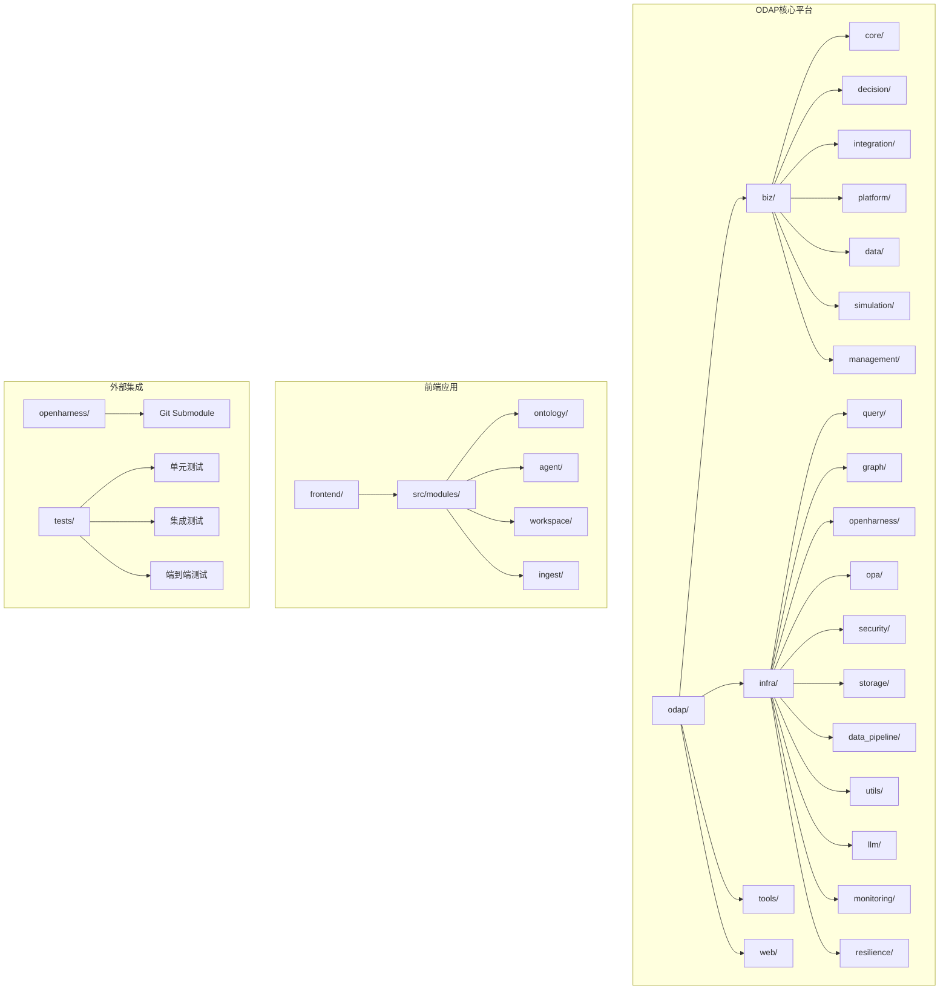
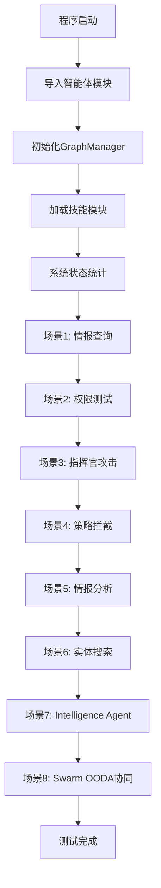
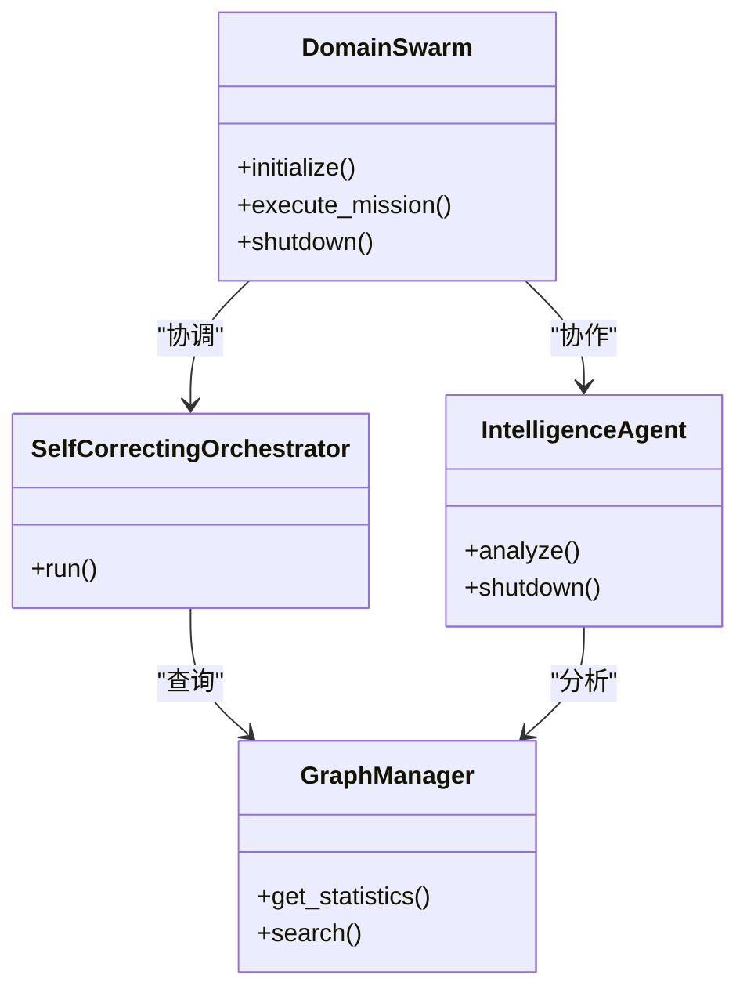
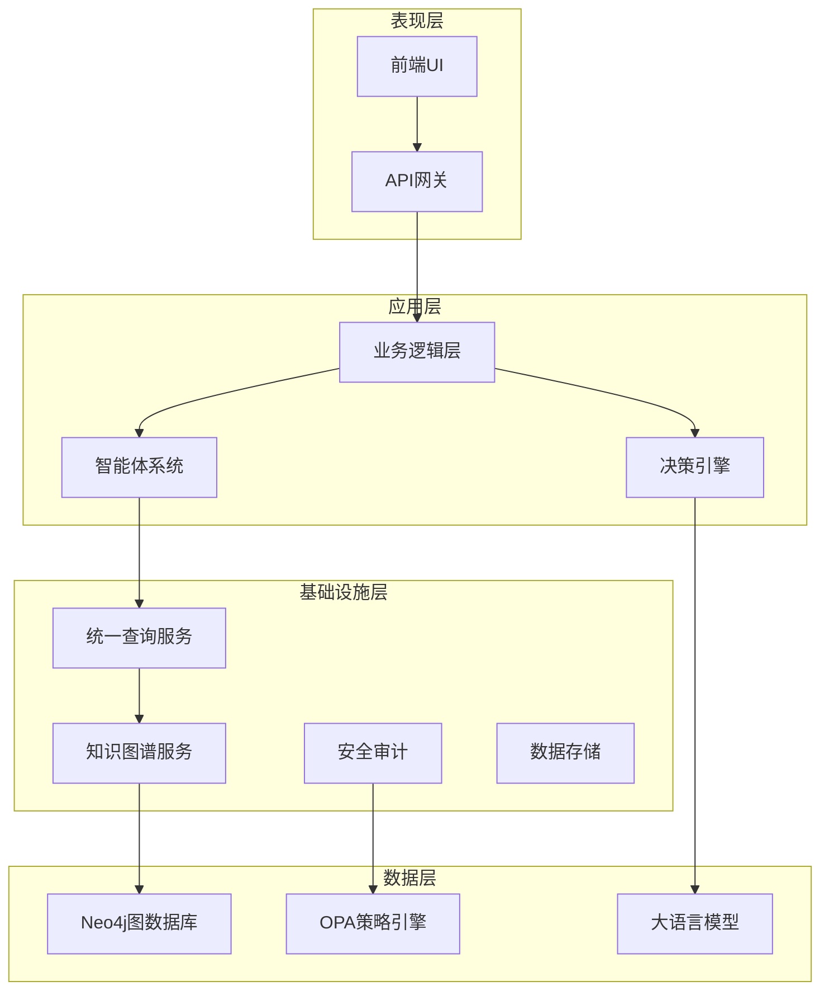
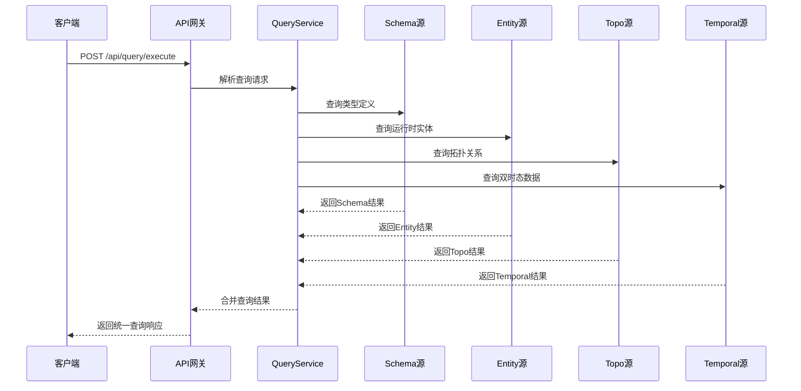
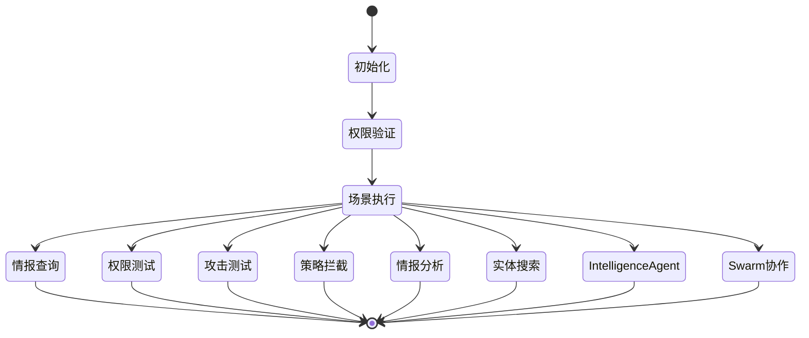
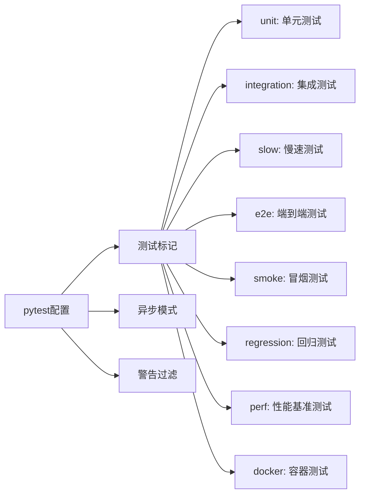

# 本体应用框架

<cite>
**本文档引用的文件**
- [README.md](file://README.md)
- [main.py](file://main.py)
- [pyproject.toml](file://pyproject.toml)
- [agent_config.yaml](file://config/agent_config.yaml)
</cite>

## 目录
1. [简介](#简介)
2. [项目结构](#项目结构)
3. [核心组件](#核心组件)
4. [架构概览](#架构概览)
5. [详细组件分析](#详细组件分析)
6. [依赖分析](#依赖分析)
7. [性能考虑](#性能考虑)
8. [故障排除指南](#故障排除指南)
9. [结论](#结论)

## 简介

本体应用框架（ODAP - Ontology-Driven Analysis & Decision Platform）是一个基于本体驱动的分析决策平台，通过工作空间机制实现多场景隔离，支持任意领域的本体建模和分析决策。该平台采用Graphiti双时态知识图谱组件，结合OpenHarness智能体协同系统，为用户提供强大的本体管理和分析能力。

ODAP平台的核心特性包括：
- **本体驱动**：OMS元模型框架 + 四层本体结构 + 版本链管理
- **统一查询服务**：QueryService四源查询（Schema/Entity/Topo/Temporal），Agent Safe默认只读
- **多智能体协同**：OpenHarness Agent Loop + Swarm三Agent OODA闭环
- **双时态知识图谱**：Graphiti支持valid_time + transaction_time时序推理
- **策略治理**：OPA fail-close安全边界 + Agent写操作守卫
- **工作空间隔离**：4级隔离（low/standard/high/strict）+资源配额

## 项目结构

ODAP项目采用模块化的分层架构设计，主要包含以下核心目录：

**图表来源**
- [README.md:27-122](file://README.md#L27-L122)

**章节来源**
- [README.md:27-122](file://README.md#L27-L122)

## 核心组件

### 主应用入口

主应用入口位于`main.py`，提供了完整的系统初始化和演示功能：

**图表来源**
- [main.py:58-200](file://main.py#L58-L200)

### 智能体系统

平台实现了多层次的智能体协作架构：

**图表来源**
- [main.py:14-18](file://main.py#L14-L18)

**章节来源**
- [main.py:58-200](file://main.py#L58-L200)

## 架构概览

ODAP平台采用分层架构设计，从底层基础设施到上层应用服务形成完整的生态系统：

**图表来源**
- [README.md:16-26](file://README.md#L16-L26)

### 技术栈架构

平台采用现代化的技术栈组合：

| 层级 | 技术选择 | 说明 |
|------|----------|------|
| 后端 | Python 3.11+, FastAPI | 核心业务逻辑和API服务 |
| 前端 | React 19, TypeScript, Ant Design | 用户界面和交互体验 |
| 知识图谱 | Graphiti (双时态) | 时序推理和关系建模 |
| 智能体 | OpenHarness (Agent Loop + Swarm + MCP) | 多智能体协同系统 |
| 策略治理 | OPA (开放策略代理) | fail-close安全边界 |
| LLM | OpenAI / Anthropic / DeepSeek | 大语言模型集成 |

**章节来源**
- [README.md:16-26](file://README.md#L16-L26)

## 详细组件分析

### 统一查询服务

ODAP提供统一的QueryService，支持四种查询源：

**图表来源**
- [README.md:187-199](file://README.md#L187-L199)

查询语法支持：
- **Schema查询**：`.schema with(type='Unit')` - 查询OMS类型定义
- **Entity查询**：`.entity with(type='MilitaryUnit')` - 查询运行时实体  
- **Topo查询**：`.topo neighbors(id='xxx', depth=2)` - 查询拓扑关系
- **Temporal查询**：`.temporal at('2025-01-01')` - 查询双时态数据

**章节来源**
- [README.md:187-199](file://README.md#L187-L199)

### 智能体协作系统

平台实现了复杂的智能体协作架构，支持多种角色和权限控制：

**图表来源**
- [main.py:99-195](file://main.py#L99-L195)

### 工作空间管理系统

平台支持4级工作空间隔离：

| 隔离级别 | 描述 | 资源限制 |
|----------|------|----------|
| low | 基础隔离 | 最小资源配额 |
| standard | 标准隔离 | 正常资源配额 |
| high | 高级隔离 | 增强资源配额 |
| strict | 严格隔离 | 最严格访问控制 |

**章节来源**
- [README.md:14](file://README.md#L14)

## 依赖分析

### 测试配置

项目使用pytest进行测试管理，配置了丰富的测试标记：

**图表来源**
- [pyproject.toml:1-21](file://pyproject.toml#L1-L21)

### LLM提供商配置

平台支持多个LLM提供商的灵活配置：

| 提供商 | 状态 | 模型 | 配置项 |
|--------|------|------|--------|
| anthropic | disabled | claude-3-5-sonnet-20241022 | enabled=false |
| openai | enabled | deepseek-v4-pro | enabled=true |
| http | disabled | deepseek-chat | enabled=false |

**章节来源**
- [pyproject.toml:1-21](file://pyproject.toml#L1-L21)
- [agent_config.yaml:1-23](file://config/agent_config.yaml#L1-L23)

## 性能考虑

### 查询优化策略

1. **缓存机制**：统一查询服务支持多级缓存，减少重复查询开销
2. **索引优化**：知识图谱建立适当的索引以加速查询
3. **并发处理**：智能体系统支持异步并发执行
4. **资源管理**：工作空间隔离确保资源合理分配

### 扩展性设计

- **模块化架构**：各组件松耦合，便于独立扩展
- **插件系统**：技能模块动态加载机制
- **容器化部署**：Docker支持弹性扩缩容
- **微服务拆分**：核心功能可独立部署

## 故障排除指南

### 常见问题诊断

1. **LLM配置错误**
   - 检查OPENAI_API_KEY配置
   - 验证API端点可达性
   - 确认模型权限设置

2. **知识图谱连接失败**
   - 检查Neo4j服务状态
   - 验证连接参数配置
   - 确认网络连通性

3. **智能体权限问题**
   - 检查OPA策略配置
   - 验证角色权限映射
   - 确认工作空间隔离设置

### 调试工具

- **健康检查端点**：`GET /health`
- **API文档**：`GET /docs`
- **日志查看**：`python bootstep.py logs`
- **状态监控**：`python bootstep.py status`

**章节来源**
- [README.md:175-186](file://README.md#L175-L186)

## 结论

ODAP本体应用框架提供了一个完整、可扩展的本体驱动分析决策平台。通过模块化的架构设计、强大的智能体协作系统和完善的治理机制，该平台能够满足复杂领域的本体建模和分析需求。

### 主要优势

1. **架构完整性**：从基础设施到应用层的完整解决方案
2. **扩展性强**：模块化设计支持灵活的功能扩展
3. **安全性高**：多层安全防护和权限控制机制
4. **智能化程度高**：集成LLM和智能体系统
5. **可视化丰富**：支持多种图表和地图展示

### 发展方向

- 进一步优化查询性能和缓存策略
- 增强多模态数据处理能力
- 扩展更多领域本体模板
- 提升用户体验和交互设计

该框架为构建企业级本体应用提供了坚实的基础，适合在军事、情报、金融等对本体建模有高要求的领域中部署和应用。