# 本体管理系统

<cite>
**本文引用的文件**
- [架构总览（高级特性）](file://docs/02-architecture/ARCHITECTURE_EVOLVE.md)
- [全链路深入实现设计 v2.0](file://docs/02-architecture/ARCHITECTURE_FULL_CHAIN_DEEP.md)
- [本体模块设计](file://docs/03-modules/ontology/DESIGN.md)
- [本体管理引擎模块设计](file://docs/03-modules/ontology_management_engine/DESIGN.md)
- [本体管理引擎-架构](file://docs/02-architecture/ARCHITECTURE_BIZ.md)
- [数据库设计](file://docs/02-architecture/ARCHITECTURE_FULL_CHAIN_DEEP.md)
- [API设计-后端API](file://docs/01-api/BACKEND_API_DESIGN.md)
- [数据库设计-数据库设计](file://docs/01-api/DATABASE_DESIGN.md)
- [OMS-路由](file://odap/biz/core/ontology/oms/routes.py)
- [OMS-Schemas](file://odap/biz/core/ontology/oms/schemas.py)
- [OMS-服务](file://odap/biz/core/ontology/oms/services/__init__.py)
- [OMS-存储](file://odap/biz/core/ontology/oms/storage/__init__.py)
- [数据摄入-新闻采集](file://odap/biz/core/ontology/ingestion_split/news_ingester.py)
- [数据摄入-文档导入导出](file://odap/biz/core/ontology/ingestion_split/document_io.py)
- [数据摄入-网页抓取](file://odap/biz/core/ontology/ingestion_split/web_scraper.py)
- [数据摄入-生成器工厂](file://odap/biz/core/ontology/ingestion_split/generator_factory.py)
- [数据摄入-统一导出](file://odap/biz/core/ontology/ingestion_split/__init__.py)
- [思维图谱-服务](file://odap/biz/core/cognition/thought_graph/services/thought_graph_service.py)
- [思维图谱-API路由](file://odap/biz/core/cognition/thought_graph/api/routes.py)
- [思维图谱-类型定义](file://odap/biz/core/cognition/thought_graph/models/types.py)
- [蓝图设计器-服务](file://odap/biz/core/ontology/harness/blueprint/blueprint_service.py)
- [蓝图设计器-API路由](file://odap/biz/core/ontology/harness/blueprint/routes.py)
- [蓝图设计器-运行时路由](file://odap/biz/core/ontology/harness/blueprint/api/runtime_routes.py)
- [蓝图设计器-运行时模式](file://odap/biz/core/ontology/harness/blueprint/api/runtime_schemas.py)
- [动作服务-执行器](file://odap/biz/decision/action_service/executor.py)
- [动作服务-反馈回路](file://odap/biz/decision/action_service/feedback_loop.py)
- [动作服务-路由](file://odap/biz/decision/action_service/routes.py)
- [动作服务-模式](file://odap/biz/decision/action_service/schemas.py)
- [版本管理-版本管理器](file://odap/biz/core/ontology/version_manager.py)
- [版本管理-版本管理器实现](file://docs/02-architecture/ARCHITECTURE_FULL_CHAIN_DEEP.md)
- [对象虚拟化层-对象服务](file://odap/infra/object_service/object_service.py)
- [对象虚拟化层-路由](file://odap/infra/object_service/routes.py)
- [对象虚拟化层-模式](file://odap/infra/object_service/schemas.py)
- [统一查询服务-服务](file://odap/infra/query/service.py)
- [统一查询服务-路由](file://odap/infra/query/routes.py)
- [统一查询服务-协议](file://odap/infra/query/protocols.py)
- [统一查询服务-解析器](file://odap/infra/query/parser.py)
- [Hook系统-管理器](file://odap/biz/core/hook_system/hook_manager_v2.py)
- [Hook系统-API路由](file://odap/biz/core/hook_system/api/routes.py)
- [Hook系统-实现](file://odap/biz/core/hook_system/impl/__init__.py)
- [Hook系统-模型](file://odap/biz/core/hook_system/models/__init__.py)
- [Hook系统-服务](file://odap/biz/core/hook_system/services/__init__.py)
- [安全-审计API](file://odap/infra/security/audit_api.py)
- [安全-认证路由](file://odap/infra/security/auth_routes.py)
- [安全-认证服务](file://odap/infra/security/auth_service.py)
- [安全-审计模型](file://odap/infra/security/audit_models.py)
- [安全-审计日志](file://odap/infra/security/audit_logger.py)
- [安全-审计日志v2](file://odap/infra/security/audit_logger_v2.py)
- [安全-审计通道](file://odap/infra/security/audit_graphiti_channel.py)
- [安全-审计SQLite通道](file://odap/infra/security/audit_sqlite_channel.py)
- [安全-统一审计](file://odap/infra/security/unified_audit.py)
- [安全-JWT服务](file://odap/infra/security/jwt_service.py)
- [安全-JWT认证](file://odap/infra/security/jwt_auth.py)
- [安全-OAuth2提供者](file://odap/infra/security/oauth2_providers.py)
- [安全-安全审计](file://odap/infra/security/security_audit.py)
- [安全-认证模型](file://odap/infra/security/auth_models.py)
- [前端-本体构建UI](file://docs/04-ui/ONTOLOGY_BUILD_UI.md)
- [前端-组件层次](file://docs/04-ui/COMPONENT_HIERARCHY.md)
- [前端-组件规范](file://docs/04-ui/COMPONENT_SPEC.md)
- [前端-移动端优先设计](file://docs/04-ui/MOBILE_FIRST_DESIGN.md)
- [前端-思维图谱](file://frontend/src/modules/knowledge/pages/ThoughtGraphPage.tsx)
- [前端-蓝图设计器](file://frontend/src/modules/ontology/pages/BlueprintDesignerPage.tsx)
- [前端-动作面板](file://frontend/src/modules/ontology/pages/ActionPanelPage.tsx)
- [前端-对象服务](file://frontend/src/modules/ontology/services/ObjectService.ts)
- [前端-统一查询](file://frontend/src/modules/ontology/services/QueryService.ts)
- [前端-动作服务](file://frontend/src/modules/ontology/services/ActionService.ts)
- [前端-Hook系统](file://frontend/src/modules/ontology/services/HookSystemService.ts)
- [前端-安全认证](file://frontend/src/modules/auth/services/AuthService.ts)
- [前端-工作空间](file://frontend/src/modules/workspace/services/WorkspaceService.ts)
- [前端-会话记忆](file://frontend/src/modules/session_memory/services/SessionMemoryService.ts)
- [前端-工具注册表](file://frontend/src/modules/tool_registry/services/ToolRegistryService.ts)
- [前端-可视化引擎](file://frontend/src/modules/visualization/services/VisualizationEngineService.ts)
- [前端-决策推荐](file://frontend/src/modules/decision_recommendation/services/DecisionRecommendationService.ts)
- [前端-事件模拟器](file://frontend/src/modules/event_simulator/services/EventSimulatorService.ts)
- [前端-用户认知引擎](file://frontend/src/modules/user_cognition_engine/services/UserCognitionEngineService.ts)
- [前端-服务化引擎](file://frontend/src/modules/ontology/services/ServitizationEngineService.ts)
- [前端-思维图谱API](file://frontend/src/modules/knowledge/services/ThoughtGraphService.ts)
- [前端-蓝图设计器API](file://frontend/src/modules/ontology/services/BlueprintDesignerService.ts)
- [前端-动作服务API](file://frontend/src/modules/ontology/services/ActionService.ts)
- [前端-统一查询API](file://frontend/src/modules/ontology/services/QueryService.ts)
- [前端-Hook系统API](file://frontend/src/modules/ontology/services/HookSystemService.ts)
- [前端-安全认证API](file://frontend/src/modules/auth/services/AuthService.ts)
- [前端-工作空间API](file://frontend/src/modules/workspace/services/WorkspaceService.ts)
- [前端-会话记忆API](file://frontend/src/modules/session_memory/services/SessionMemoryService.ts)
- [前端-工具注册表API](file://frontend/src/modules/tool_registry/services/ToolRegistryService.ts)
- [前端-可视化引擎API](file://frontend/src/modules/visualization/services/VisualizationEngineService.ts)
- [前端-决策推荐API](file://frontend/src/modules/decision_recommendation/services/DecisionRecommendationService.ts)
- [前端-事件模拟器API](file://frontend/src/modules/event_simulator/services/EventSimulatorService.ts)
- [前端-用户认知引擎API](file://frontend/src/modules/user_cognition_engine/services/UserCognitionEngineService.ts)
- [前端-服务化引擎API](file://frontend/src/modules/ontology/services/ServitizationEngineService.ts)
</cite>

## 目录
1. [引言](#引言)
2. [项目结构](#项目结构)
3. [核心组件](#核心组件)
4. [架构总览](#架构总览)
5. [详细组件分析](#详细组件分析)
6. [依赖分析](#依赖分析)
7. [性能考虑](#性能考虑)
8. [故障排查指南](#故障排查指南)
9. [结论](#结论)
10. [附录](#附录)

## 引言
本体管理系统以“四层本体”（Object/Property/Action/Rule）为核心，结合双时态知识图谱、OMS（本体元数据服务）、数据摄入管道（ingestion_split）、多模态数据处理、实体解析与验证、版本链管理、本体构建服务、运行时引擎、蓝图设计器、思维图谱、服务化引擎等模块，形成从数据到知识再到决策的完整链路。系统强调可扩展、可观测、可审计与可回溯，支持多源异构数据的统一建模与运行时演化。

## 项目结构
系统采用分层架构与模块化组织：
- 基础设施层（L1）：图谱服务、LLM服务、OPA策略引擎、事件/Hook系统、对象虚拟化层、韧性与监控、安全与审计、配置Composer等
- 领域工具层（L2）：可插拔技能（intelligence/operations/analysis/planning/recommendation/policy/computation/task_management/visualization）
- 业务领域层（L3-L4）：本体管理、工作空间、Agent协同、动作服务、事件模拟器、MCP协议适配、角色管理、用户认知引擎、决策推荐引擎、前端兼容层、Hook系统、OpenHarness Agent适配、QA引擎、技能系统、工具注册表、可视化业务层
- Web服务层：REST路由、WebSocket、静态资源
- 存储层：场景数据、版本、Agent状态、导出文件
- 前端：React + TypeScript + Vite，模块化页面与服务封装

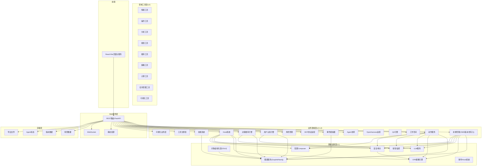

**图表来源**
- [架构总览（高级特性）](file://docs/02-architecture/ARCHITECTURE_EVOLVE.md)
- [全链路深入实现设计 v2.0](file://docs/02-architecture/ARCHITECTURE_FULL_CHAIN_DEEP.md)

**章节来源**
- [架构总览（高级特性）](file://docs/02-architecture/ARCHITECTURE_EVOLVE.md)
- [全链路深入实现设计 v2.0](file://docs/02-architecture/ARCHITECTURE_FULL_CHAIN_DEEP.md)

## 核心组件
- 四层本体设计：Object（对象类型/属性/链接）、Property（属性定义/约束）、Action（动作类型/参数/策略）、Rule（规则定义/约束）
- 双时态知识图谱：实体/关系/事件具备时间窗口与当前标记，支持历史回放与实时演化
- OMS（本体元数据服务）：运行时管理对象类型与动作类型，支持CRUD、绑定与激活状态控制
- 数据摄入管道（ingestion_split）：新闻采集、网页抓取、文档导入导出、随机事件生成器工厂
- 多模态数据处理：OCR + LLM抽取结构化信息，统一为OntologyDocument
- 实体解析与验证：Schema校验、冲突检测、Mock降级
- 版本链管理：语义版本号、快照、差异比较、父子链路、回滚支持
- 本体构建服务：与Graphiti/Neo4j集成，支持热写入与审计
- 运行时引擎：动作执行器、反馈回路、Hook系统、策略注入、审计日志
- 蓝图设计器：本体设计与运行时编排
- 思维图谱：推理节点与推理链，支持观察、推理、假设、决策、反思、计划
- 服务化引擎：统一查询、对象虚拟化、工具注册表、可视化引擎

**章节来源**
- [本体模块设计](file://docs/03-modules/ontology/DESIGN.md)
- [本体管理引擎-架构](file://docs/02-architecture/ARCHITECTURE_BIZ.md)
- [OMS-路由](file://odap/biz/core/ontology/oms/routes.py)
- [OMS-Schemas](file://odap/biz/core/ontology/oms/schemas.py)
- [数据摄入-新闻采集](file://odap/biz/core/ontology/ingestion_split/news_ingester.py)
- [数据摄入-文档导入导出](file://odap/biz/core/ontology/ingestion_split/document_io.py)
- [数据摄入-网页抓取](file://odap/biz/core/ontology/ingestion_split/web_scraper.py)
- [数据摄入-生成器工厂](file://odap/biz/core/ontology/ingestion_split/generator_factory.py)
- [思维图谱-服务](file://odap/biz/core/cognition/thought_graph/services/thought_graph_service.py)
- [蓝图设计器-服务](file://odap/biz/core/ontology/harness/blueprint/blueprint_service.py)
- [动作服务-执行器](file://odap/biz/decision/action_service/executor.py)
- [动作服务-反馈回路](file://odap/biz/decision/action_service/feedback_loop.py)
- [Hook系统-管理器](file://odap/biz/core/hook_system/hook_manager_v2.py)

## 架构总览
系统以“数据-本体-动作-反馈”的闭环为核心，结合多源数据接入、统一建模、运行时编排与可视化呈现，支撑复杂领域场景的动态演化与决策支持。

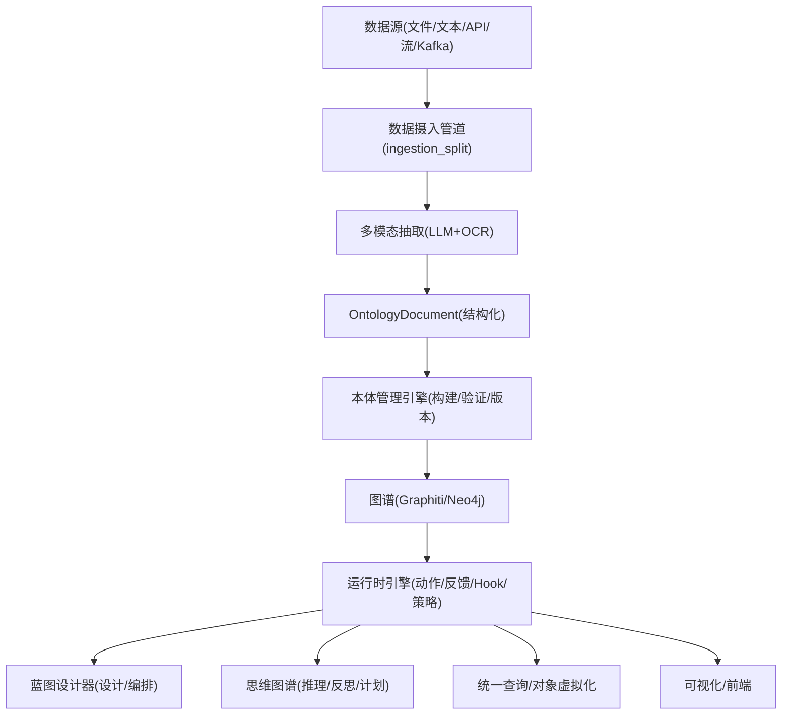

**图表来源**
- [本体管理引擎-架构](file://docs/02-architecture/ARCHITECTURE_BIZ.md)
- [全链路深入实现设计 v2.0](file://docs/02-architecture/ARCHITECTURE_FULL_CHAIN_DEEP.md)

## 详细组件分析

### 组件A：OMS（本体元数据服务）
- 职责：运行时管理对象类型与动作类型，支持CRUD、绑定/解绑、激活状态控制
- 数据模型：对象类型定义、动作类型定义、属性定义、链接定义、参数定义
- API：对象类型与动作类型的GET/POST/PUT/DELETE，以及绑定/解绑接口
- 存储：SQLite存储，支持种子数据与版本化

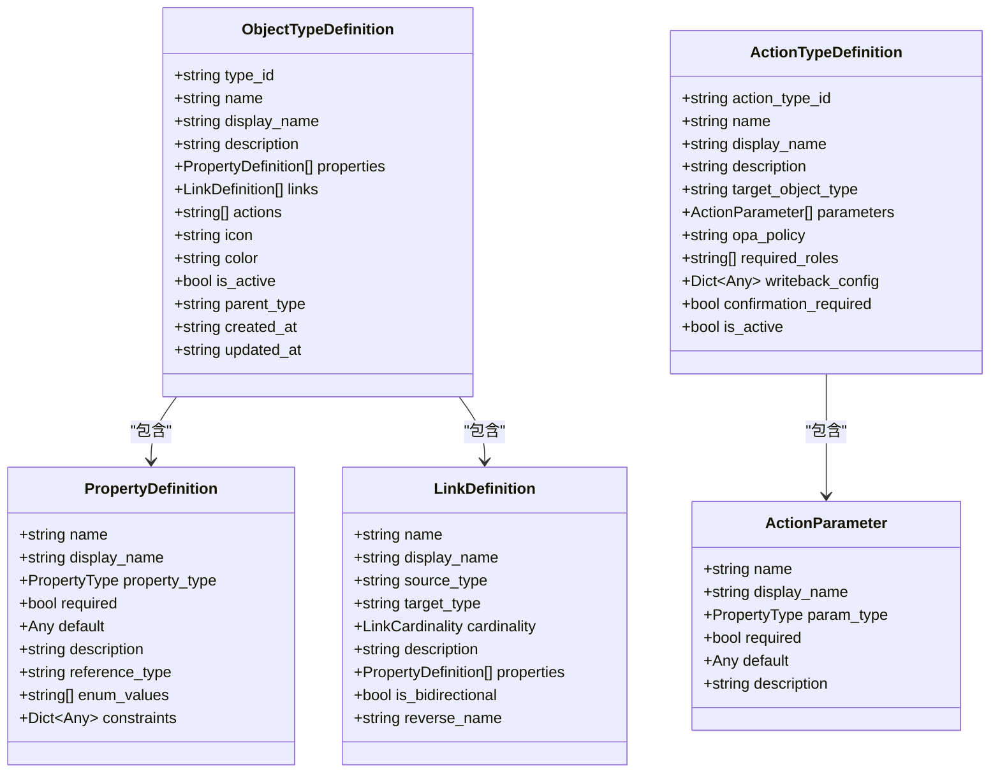

**图表来源**
- [OMS-Schemas](file://odap/biz/core/ontology/oms/schemas.py)

**章节来源**
- [OMS-路由](file://odap/biz/core/ontology/oms/routes.py)
- [OMS-Schemas](file://odap/biz/core/ontology/oms/schemas.py)
- [OMS-服务](file://odap/biz/core/ontology/oms/services/__init__.py)
- [OMS-存储](file://odap/biz/core/ontology/oms/storage/__init__.py)

### 组件B：数据摄入管道（ingestion_split）
- 新闻采集：多源检索（本地DDG/Tavily/SerpAPI/DDG HTML）+ LLM归纳为OntologyDocument
- 网页抓取：免费方案，提取标题、正文、描述、链接、发布日期
- 文档导入导出：支持单文档、场景包、版本快照的导入导出
- 随机事件生成器工厂：军事/商业/科技/医疗事件生成器

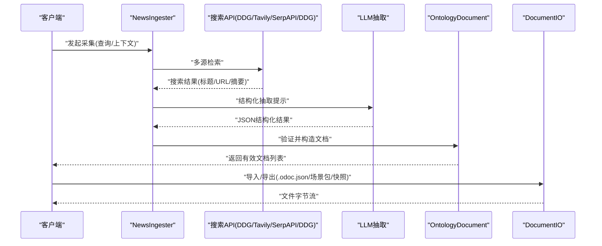

**图表来源**
- [数据摄入-新闻采集](file://odap/biz/core/ontology/ingestion_split/news_ingester.py)
- [数据摄入-文档导入导出](file://odap/biz/core/ontology/ingestion_split/document_io.py)
- [数据摄入-网页抓取](file://odap/biz/core/ontology/ingestion_split/web_scraper.py)
- [数据摄入-生成器工厂](file://odap/biz/core/ontology/ingestion_split/generator_factory.py)

**章节来源**
- [数据摄入-新闻采集](file://odap/biz/core/ontology/ingestion_split/news_ingester.py)
- [数据摄入-文档导入导出](file://odap/biz/core/ontology/ingestion_split/document_io.py)
- [数据摄入-网页抓取](file://odap/biz/core/ontology/ingestion_split/web_scraper.py)
- [数据摄入-生成器工厂](file://odap/biz/core/ontology/ingestion_split/generator_factory.py)
- [数据摄入-统一导出](file://odap/biz/core/ontology/ingestion_split/__init__.py)

### 组件C：版本链管理
- 语义版本号递增（每次摄入补丁版本+1）
- 快照：实体、关系、元数据完整快照
- 差异比较：实体增删改、关系数量变化
- 版本链可视化：前端展示版本演化轨迹

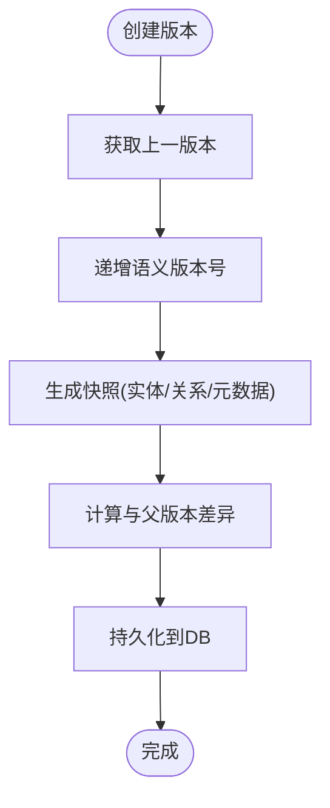

**图表来源**
- [版本管理-版本管理器实现](file://docs/02-architecture/ARCHITECTURE_FULL_CHAIN_DEEP.md)

**章节来源**
- [版本管理-版本管理器实现](file://docs/02-architecture/ARCHITECTURE_FULL_CHAIN_DEEP.md)
- [版本管理-版本管理器](file://odap/biz/core/ontology/version_manager.py)

### 组件D：动作服务（运行时引擎）
- 执行器：校验→OPA策略→执行→写回→反馈
- 反馈回路：三层反馈架构（执行结果自动回流）
- 路由与模式：动作请求/记录/结果的数据模型与API

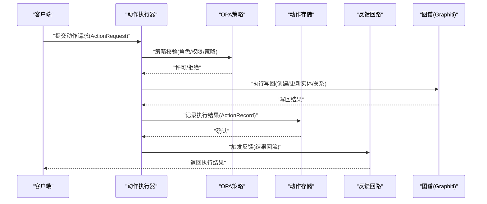

**图表来源**
- [动作服务-执行器](file://odap/biz/decision/action_service/executor.py)
- [动作服务-反馈回路](file://odap/biz/decision/action_service/feedback_loop.py)
- [动作服务-路由](file://odap/biz/decision/action_service/routes.py)
- [动作服务-模式](file://odap/biz/decision/action_service/schemas.py)

**章节来源**
- [动作服务-执行器](file://odap/biz/decision/action_service/executor.py)
- [动作服务-反馈回路](file://odap/biz/decision/action_service/feedback_loop.py)
- [动作服务-路由](file://odap/biz/decision/action_service/routes.py)
- [动作服务-模式](file://odap/biz/decision/action_service/schemas.py)

### 组件E：思维图谱
- 思想节点：观察、推理、假设、决策、反思、计划
- 推理方法：演绎、归纳、溯因、类比、启发式
- 服务：添加思想节点、查询、列表、删除

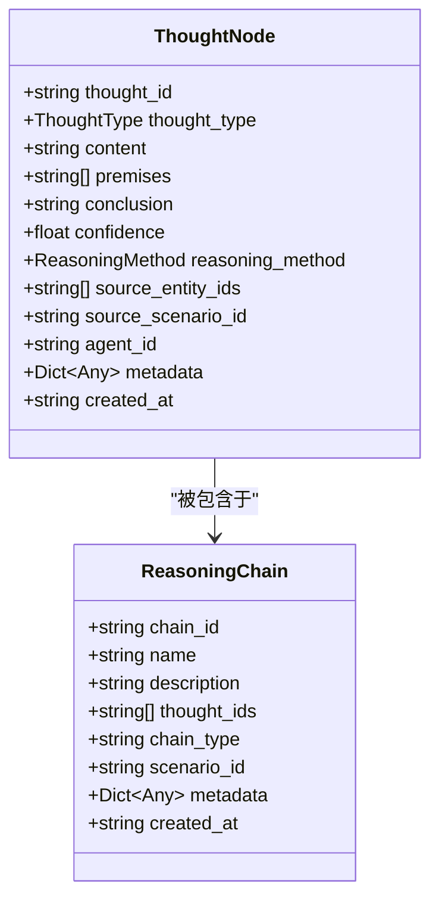

**图表来源**
- [思维图谱-类型定义](file://odap/biz/core/cognition/thought_graph/models/types.py)

**章节来源**
- [思维图谱-服务](file://odap/biz/core/cognition/thought_graph/services/thought_graph_service.py)
- [思维图谱-API路由](file://odap/biz/core/cognition/thought_graph/api/routes.py)
- [思维图谱-类型定义](file://odap/biz/core/cognition/thought_graph/models/types.py)

### 组件F：蓝图设计器
- 设计与运行时编排：蓝图服务、API路由、运行时路由与模式
- 与本体/动作/Hook/策略集成，支持可视化设计与执行

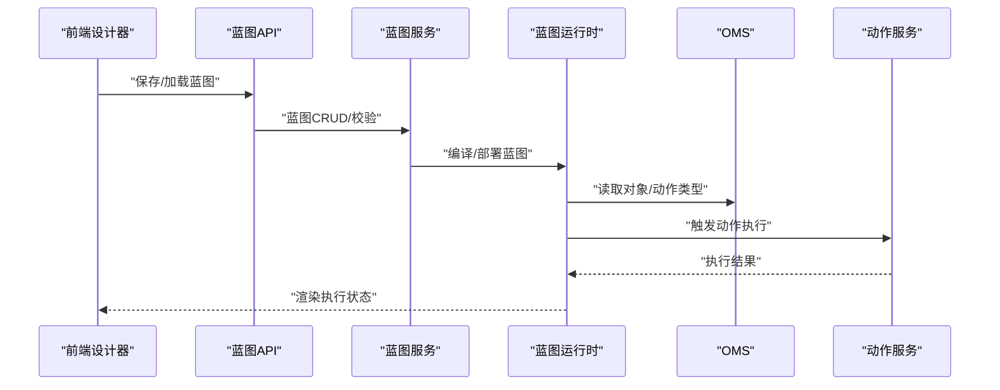

**图表来源**
- [蓝图设计器-服务](file://odap/biz/core/ontology/harness/blueprint/blueprint_service.py)
- [蓝图设计器-API路由](file://odap/biz/core/ontology/harness/blueprint/routes.py)
- [蓝图设计器-运行时路由](file://odap/biz/core/ontology/harness/blueprint/api/runtime_routes.py)
- [蓝图设计器-运行时模式](file://odap/biz/core/ontology/harness/blueprint/api/runtime_schemas.py)

**章节来源**
- [蓝图设计器-服务](file://odap/biz/core/ontology/harness/blueprint/blueprint_service.py)
- [蓝图设计器-API路由](file://odap/biz/core/ontology/harness/blueprint/routes.py)
- [蓝图设计器-运行时路由](file://odap/biz/core/ontology/harness/blueprint/api/runtime_routes.py)
- [蓝图设计器-运行时模式](file://odap/biz/core/ontology/harness/blueprint/api/runtime_schemas.py)

### 组件G：统一查询服务与对象虚拟化层
- 统一查询：整合schema/entity/topo/temporal四种查询源，Agent默认只读
- 对象虚拟化：多源联邦查询与链接遍历，统一对象访问层

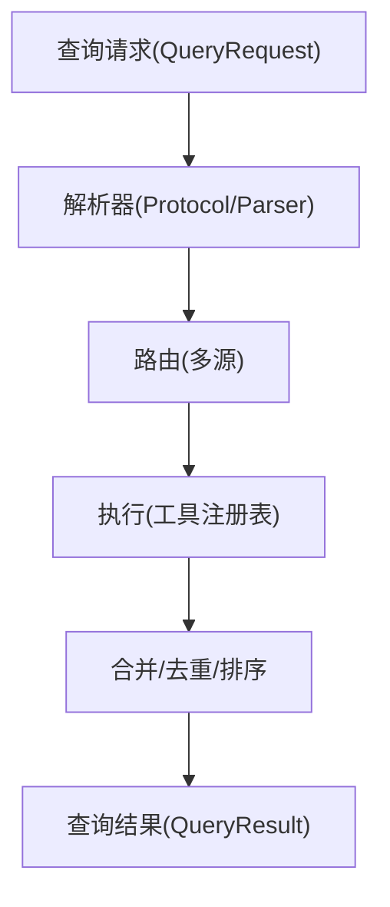

**图表来源**
- [统一查询服务-服务](file://odap/infra/query/service.py)
- [统一查询服务-路由](file://odap/infra/query/routes.py)
- [统一查询服务-协议](file://odap/infra/query/protocols.py)
- [统一查询服务-解析器](file://odap/infra/query/parser.py)
- [对象虚拟化层-对象服务](file://odap/infra/object_service/object_service.py)
- [对象虚拟化层-路由](file://odap/infra/object_service/routes.py)
- [对象虚拟化层-模式](file://odap/infra/object_service/schemas.py)

**章节来源**
- [统一查询服务-服务](file://odap/infra/query/service.py)
- [统一查询服务-路由](file://odap/infra/query/routes.py)
- [统一查询服务-协议](file://odap/infra/query/protocols.py)
- [统一查询服务-解析器](file://odap/infra/query/parser.py)
- [对象虚拟化层-对象服务](file://odap/infra/object_service/object_service.py)
- [对象虚拟化层-路由](file://odap/infra/object_service/routes.py)
- [对象虚拟化层-模式](file://odap/infra/object_service/schemas.py)

### 组件H：Hook系统与安全审计
- Hook系统：生命周期钩子、策略注入、审计日志、性能监控
- 安全审计：统一审计通道、SQLite通道、认证/授权/JWT/OAuth2

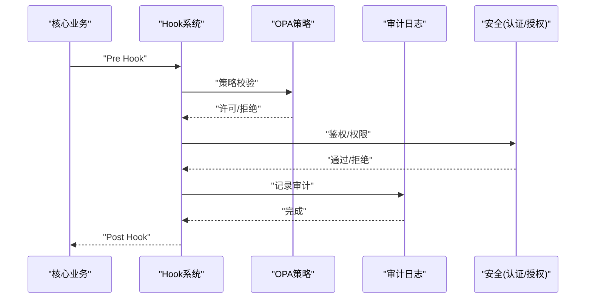

**图表来源**
- [Hook系统-管理器](file://odap/biz/core/hook_system/hook_manager_v2.py)
- [Hook系统-API路由](file://odap/biz/core/hook_system/api/routes.py)
- [安全-审计API](file://odap/infra/security/audit_api.py)
- [安全-认证路由](file://odap/infra/security/auth_routes.py)
- [安全-认证服务](file://odap/infra/security/auth_service.py)
- [安全-审计模型](file://odap/infra/security/audit_models.py)
- [安全-审计日志](file://odap/infra/security/audit_logger.py)
- [安全-审计日志v2](file://odap/infra/security/audit_logger_v2.py)
- [安全-审计通道](file://odap/infra/security/audit_graphiti_channel.py)
- [安全-审计SQLite通道](file://odap/infra/security/audit_sqlite_channel.py)
- [安全-统一审计](file://odap/infra/security/unified_audit.py)
- [安全-JWT服务](file://odap/infra/security/jwt_service.py)
- [安全-JWT认证](file://odap/infra/security/jwt_auth.py)
- [安全-OAuth2提供者](file://odap/infra/security/oauth2_providers.py)
- [安全-安全审计](file://odap/infra/security/security_audit.py)
- [安全-认证模型](file://odap/infra/security/auth_models.py)

**章节来源**
- [Hook系统-管理器](file://odap/biz/core/hook_system/hook_manager_v2.py)
- [Hook系统-API路由](file://odap/biz/core/hook_system/api/routes.py)
- [安全-审计API](file://odap/infra/security/audit_api.py)
- [安全-认证路由](file://odap/infra/security/auth_routes.py)
- [安全-认证服务](file://odap/infra/security/auth_service.py)
- [安全-审计模型](file://odap/infra/security/audit_models.py)
- [安全-审计日志](file://odap/infra/security/audit_logger.py)
- [安全-审计日志v2](file://odap/infra/security/audit_logger_v2.py)
- [安全-审计通道](file://odap/infra/security/audit_graphiti_channel.py)
- [安全-审计SQLite通道](file://odap/infra/security/audit_sqlite_channel.py)
- [安全-统一审计](file://odap/infra/security/unified_audit.py)
- [安全-JWT服务](file://odap/infra/security/jwt_service.py)
- [安全-JWT认证](file://odap/infra/security/jwt_auth.py)
- [安全-OAuth2提供者](file://odap/infra/security/oauth2_providers.py)
- [安全-安全审计](file://odap/infra/security/security_audit.py)
- [安全-认证模型](file://odap/infra/security/auth_models.py)

## 依赖分析
- 组件耦合：OMS与本体管理引擎紧密耦合；动作服务与Hook/OPA/审计强耦合；思维图谱与图谱服务耦合；蓝图设计器与OMS/动作服务耦合
- 外部依赖：Graphiti/Neo4j、LLM服务、Redis（队列）、OPA、Kafka、OCR服务
- 潜在循环依赖：避免业务层直接依赖基础设施层，通过接口与服务抽象解耦

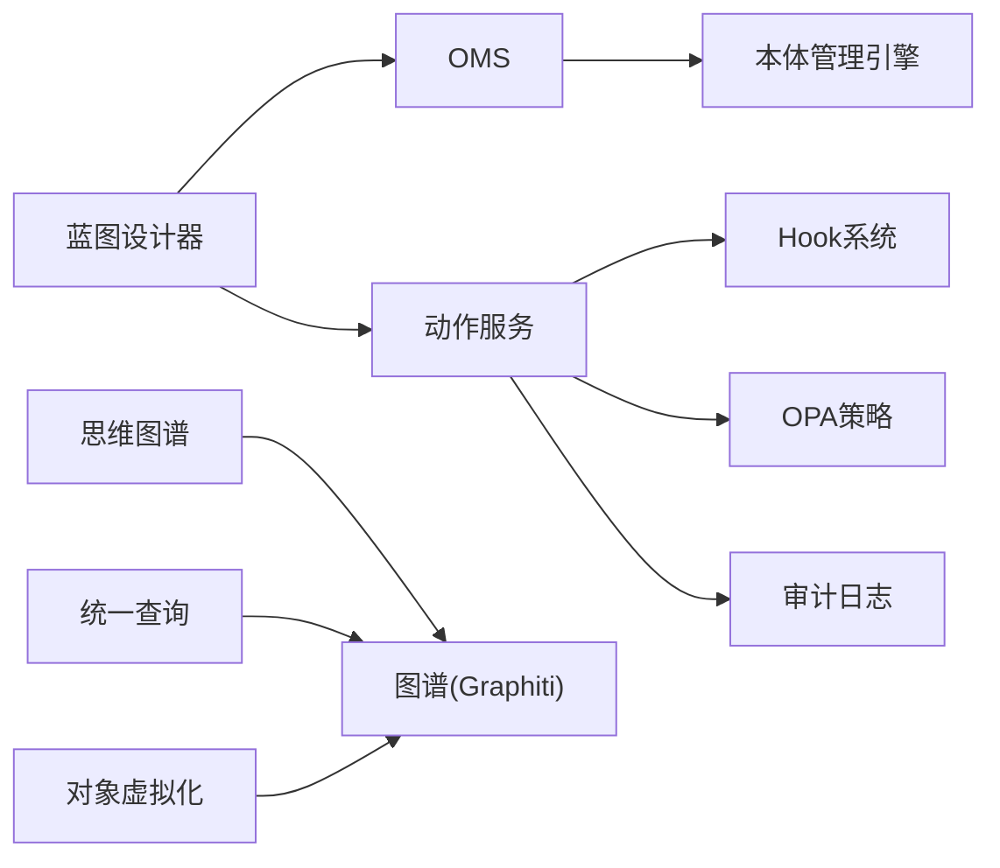

**图表来源**
- [OMS-路由](file://odap/biz/core/ontology/oms/routes.py)
- [动作服务-执行器](file://odap/biz/decision/action_service/executor.py)
- [Hook系统-管理器](file://odap/biz/core/hook_system/hook_manager_v2.py)
- [思维图谱-服务](file://odap/biz/core/cognition/thought_graph/services/thought_graph_service.py)
- [蓝图设计器-服务](file://odap/biz/core/ontology/harness/blueprint/blueprint_service.py)
- [统一查询服务-服务](file://odap/infra/query/service.py)
- [对象虚拟化层-对象服务](file://odap/infra/object_service/object_service.py)

**章节来源**
- [OMS-路由](file://odap/biz/core/ontology/oms/routes.py)
- [动作服务-执行器](file://odap/biz/decision/action_service/executor.py)
- [Hook系统-管理器](file://odap/biz/core/hook_system/hook_manager_v2.py)
- [思维图谱-服务](file://odap/biz/core/cognition/thought_graph/services/thought_graph_service.py)
- [蓝图设计器-服务](file://odap/biz/core/ontology/harness/blueprint/blueprint_service.py)
- [统一查询服务-服务](file://odap/infra/query/service.py)
- [对象虚拟化层-对象服务](file://odap/infra/object_service/object_service.py)

## 性能考虑
- 并发与限流：队列与信号量控制最大并发，超时保护与重试策略
- 缓存与索引：图谱嵌入向量索引、Redis缓存、Schema校验缓存
- 异步处理：LLM抽取、OCR、Kafka流处理、异步任务队列
- 查询优化：统一查询路由与合并策略，对象虚拟化层减少跨源往返
- 存储优化：版本快照与差异比较，增量写入与批量提交

## 故障排查指南
- 数据摄入失败：检查搜索API密钥、网络连通性、Mock降级开关
- LLM抽取异常：检查提示词格式、响应解析、JSON提取逻辑
- Schema验证失败：核对字段类型、必填项、枚举值、引用类型
- 动作执行失败：检查OPA策略、角色权限、写回状态、反馈回路
- Hook执行异常：检查Hook注册表优先级、依赖关系、审计日志
- 审计日志缺失：检查审计通道配置、SQLite通道、统一审计策略
- 前端交互问题：核对API路由、服务封装、错误拦截与提示

**章节来源**
- [数据摄入-新闻采集](file://odap/biz/core/ontology/ingestion_split/news_ingester.py)
- [数据摄入-文档导入导出](file://odap/biz/core/ontology/ingestion_split/document_io.py)
- [动作服务-执行器](file://odap/biz/decision/action_service/executor.py)
- [Hook系统-管理器](file://odap/biz/core/hook_system/hook_manager_v2.py)
- [安全-审计日志](file://odap/infra/security/audit_logger.py)
- [安全-审计SQLite通道](file://odap/infra/security/audit_sqlite_channel.py)
- [安全-统一审计](file://odap/infra/security/unified_audit.py)

## 结论
本体管理系统通过四层本体与双时态知识图谱，结合OMS元数据服务、数据摄入管道、版本链管理与运行时引擎，实现了从多模态数据到结构化本体、再到可执行动作与反馈闭环的完整链路。系统具备良好的扩展性、可观测性与可审计性，适合复杂领域场景的动态演化与智能决策支持。

## 附录
- API接口规范：参见后端API设计文档与各模块路由定义
- 数据模型定义：参见各模块Schemas与数据库设计
- 存储策略：版本快照、差异比较、审计日志、对象虚拟化
- 扩展机制：Hook系统、技能系统、工具注册表、MCP协议适配
- 前端集成：蓝图设计器、思维图谱、动作面板、统一查询、Hook系统、安全认证、工作空间、会话记忆、工具注册表、可视化引擎、决策推荐、事件模拟器、用户认知引擎、服务化引擎

**章节来源**
- [API设计-后端API](file://docs/01-api/BACKEND_API_DESIGN.md)
- [数据库设计-数据库设计](file://docs/01-api/DATABASE_DESIGN.md)
- [数据库设计](file://docs/02-architecture/ARCHITECTURE_FULL_CHAIN_DEEP.md)
- [前端-本体构建UI](file://docs/04-ui/ONTOLOGY_BUILD_UI.md)
- [前端-组件层次](file://docs/04-ui/COMPONENT_HIERARCHY.md)
- [前端-组件规范](file://docs/04-ui/COMPONENT_SPEC.md)
- [前端-移动端优先设计](file://docs/04-ui/MOBILE_FIRST_DESIGN.md)
- [前端-思维图谱](file://frontend/src/modules/knowledge/pages/ThoughtGraphPage.tsx)
- [前端-蓝图设计器](file://frontend/src/modules/ontology/pages/BlueprintDesignerPage.tsx)
- [前端-动作面板](file://frontend/src/modules/ontology/pages/ActionPanelPage.tsx)
- [前端-对象服务](file://frontend/src/modules/ontology/services/ObjectService.ts)
- [前端-统一查询](file://frontend/src/modules/ontology/services/QueryService.ts)
- [前端-动作服务](file://frontend/src/modules/ontology/services/ActionService.ts)
- [前端-Hook系统](file://frontend/src/modules/ontology/services/HookSystemService.ts)
- [前端-安全认证](file://frontend/src/modules/auth/services/AuthService.ts)
- [前端-工作空间](file://frontend/src/modules/workspace/services/WorkspaceService.ts)
- [前端-会话记忆](file://frontend/src/modules/session_memory/services/SessionMemoryService.ts)
- [前端-工具注册表](file://frontend/src/modules/tool_registry/services/ToolRegistryService.ts)
- [前端-可视化引擎](file://frontend/src/modules/visualization/services/VisualizationEngineService.ts)
- [前端-决策推荐](file://frontend/src/modules/decision_recommendation/services/DecisionRecommendationService.ts)
- [前端-事件模拟器](file://frontend/src/modules/event_simulator/services/EventSimulatorService.ts)
- [前端-用户认知引擎](file://frontend/src/modules/user_cognition_engine/services/UserCognitionEngineService.ts)
- [前端-服务化引擎](file://frontend/src/modules/ontology/services/ServitizationEngineService.ts)
- [前端-思维图谱API](file://frontend/src/modules/knowledge/services/ThoughtGraphService.ts)
- [前端-蓝图设计器API](file://frontend/src/modules/ontology/services/BlueprintDesignerService.ts)
- [前端-动作服务API](file://frontend/src/modules/ontology/services/ActionService.ts)
- [前端-统一查询API](file://frontend/src/modules/ontology/services/QueryService.ts)
- [前端-Hook系统API](file://frontend/src/modules/ontology/services/HookSystemService.ts)
- [前端-安全认证API](file://frontend/src/modules/auth/services/AuthService.ts)
- [前端-工作空间API](file://frontend/src/modules/workspace/services/WorkspaceService.ts)
- [前端-会话记忆API](file://frontend/src/modules/session_memory/services/SessionMemoryService.ts)
- [前端-工具注册表API](file://frontend/src/modules/tool_registry/services/ToolRegistryService.ts)
- [前端-可视化引擎API](file://frontend/src/modules/visualization/services/VisualizationEngineService.ts)
- [前端-决策推荐API](file://frontend/src/modules/decision_recommendation/services/DecisionRecommendationService.ts)
- [前端-事件模拟器API](file://frontend/src/modules/event_simulator/services/EventSimulatorService.ts)
- [前端-用户认知引擎API](file://frontend/src/modules/user_cognition_engine/services/UserCognitionEngineService.ts)
- [前端-服务化引擎API](file://frontend/src/modules/ontology/services/ServitizationEngineService.ts)