# 本体设计器系统

<cite>
**本文档引用的文件**
- [README.md](file://README.md)
- [main.py](file://main.py)
- [odap/web/app.py](file://odap/web/app.py)
- [odap/infra/graph/graph_service.py](file://odap/infra/graph/graph_service.py)
- [odap/infra/query/service.py](file://odap/infra/query/service.py)
- [odap/biz/core/ontology/engine/api/routes.py](file://odap/biz/core/ontology/engine/api/routes.py)
- [odap/biz/core/ontology/oms/routes.py](file://odap/biz/core/ontology/oms/routes.py)
- [odap/infra/security/auth_routes.py](file://odap/infra/security/auth_routes.py)
- [odap/infra/opa/opa_service.py](file://odap/infra/opa/opa_service.py)
- [config/agent_config.yaml](file://config/agent_config.yaml)
- [frontend/src/modules/shared/components/AppLayout.tsx](file://frontend/src/modules/shared/components/AppLayout.tsx)
- [frontend/src/modules/ontology/pages/OntologySemanticNetwork.tsx](file://frontend/src/modules/ontology/pages/OntologySemanticNetwork.tsx)
- [frontend/src/modules/ontology/components/blueprint\BlueprintDesigner.tsx](file://frontend/src/modules/ontology/components/blueprint\BlueprintDesigner.tsx)
- [frontend/src/modules/ontology/stores/blueprintStore.ts](file://frontend/src/modules/ontology/stores/blueprintStore.ts)
- [frontend/src/AppRoutes.tsx](file://frontend/src/AppRoutes.tsx)
- [odap/biz/core/ontology/harness/blueprint/api/runtime_routes.py](file://odap/biz/core/ontology/harness/blueprint/api/runtime_routes.py)
</cite>

## 更新摘要
**所做更改**
- 更新了语义地图菜单结构，从原来的6个项目重构为以本体设计器为中心的新结构
- 新增了蓝图设计功能的相关内容和架构说明
- 完善了数据摄入能力的技术细节
- 增强了版本历史跟踪功能的描述
- 更新了前端路由和组件结构

## 目录
1. [简介](#简介)
2. [项目结构](#项目结构)
3. [核心组件](#核心组件)
4. [架构概览](#架构概览)
5. [详细组件分析](#详细组件分析)
6. [菜单结构重组](#菜单结构重组)
7. [依赖关系分析](#依赖关系分析)
8. [性能考虑](#性能考虑)
9. [故障排除指南](#故障排除指南)
10. [结论](#结论)

## 简介

本体设计器系统（ODAP - Ontology-Driven Analysis & Decision Platform）是一个通用的本体驱动分析决策平台，通过工作空间机制实现多场景隔离，支持任意领域的本体建模和分析决策。该系统集成了双时态知识图谱、多智能体协同、策略治理等核心技术。

### 核心特性

- **本体驱动**：OMS元模型框架 + 四层本体结构 + 版本链管理
- **统一查询服务**：QueryService四源查询（Schema/Entity/Topo/Temporal），Agent Safe默认只读
- **多智能体协同**：OpenHarness Agent Loop + Swarm三Agent OODA闭环
- **双时态知识图谱**：Graphiti支持valid_time + transaction_time时序推理
- **策略治理**：OPA fail-close安全边界 + Agent写操作守卫
- **工作空间隔离**：4级隔离（low/standard/high/strict）+资源配额
- **蓝图设计**：可视化本体构建流程，支持数据摄入和版本管理
- **语义地图**：自动生成和管理语义网络图谱

### 技术栈

| 层级 | 技术 |
|------|------|
| 后端 | Python 3.11+, FastAPI, Neo4j / NetworkX |
| 前端 | React 19, TypeScript, Ant Design, G6, React Flow |
| Agent | OpenHarness (Agent Loop + Swarm + MCP) |
| 知识图谱 | Graphiti (双时态知识图谱) |
| 策略治理 | OPA (开放策略代理) |
| LLM | OpenAI / Anthropic / DeepSeek |

## 项目结构

系统采用模块化的分层架构，主要包含以下核心模块：

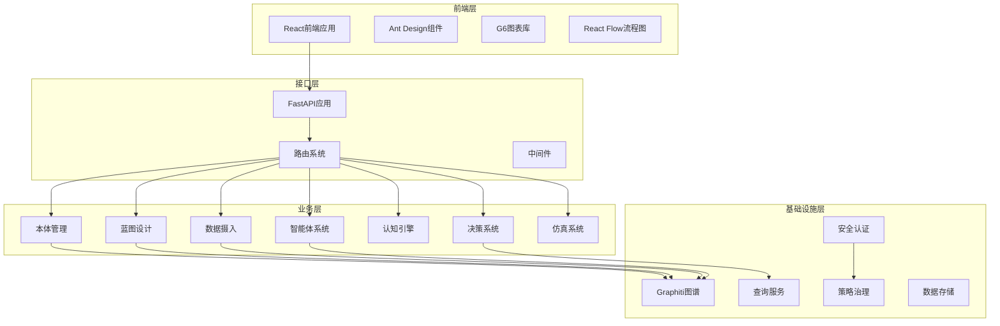

**图表来源**
- [README.md:27-122](file://README.md#L27-L122)
- [odap/web/app.py:127-272](file://odap/web/app.py#L127-L272)

**章节来源**
- [README.md:27-122](file://README.md#L27-L122)
- [odap/web/app.py:127-272](file://odap/web/app.py#L127-L272)

## 核心组件

### 图谱管理系统

GraphManager是系统的核心组件，负责管理双时态知识图谱，支持三层降级策略：

1. **Graphiti模式**：双时态知识图谱，核心功能
2. **Neo4j Driver直连**：无graphiti-core，Cypher直接操作
3. **NetworkX回退模式**：纯内存，零外部依赖

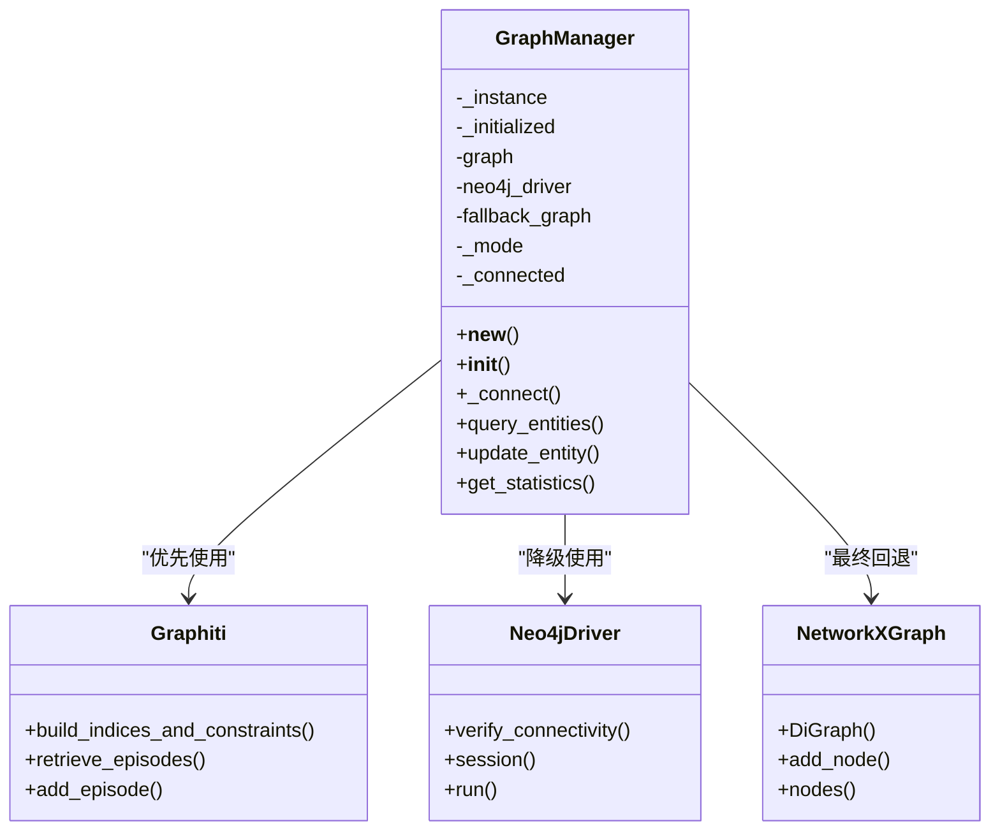

**图表来源**
- [odap/infra/graph/graph_service.py:71-800](file://odap/infra/graph/graph_service.py#L71-L800)

### 统一查询服务

QueryService提供统一的查询接口，支持四种查询源：

- **Schema查询**：查询OMS类型定义
- **Entity查询**：查询运行时实体
- **Topo查询**：查询拓扑关系
- **Temporal查询**：查询双时态数据

**章节来源**
- [odap/infra/query/service.py:11-130](file://odap/infra/query/service.py#L11-L130)

### 权限治理系统

OPA（开放策略代理）提供ABAC（基于属性的访问控制）权限管理：

- **策略评估**：支持RBAC、ABAC、PBAC、CBAC多种模型
- **策略热更新**：Bundle机制支持策略动态更新
- **策略沙箱**：What-If权限模拟
- **批量权限检查**：支持并发权限验证

**章节来源**
- [odap/infra/opa/opa_service.py:455-750](file://odap/infra/opa/opa_service.py#L455-L750)

## 架构概览

系统采用分层架构设计，各层职责明确，耦合度低：

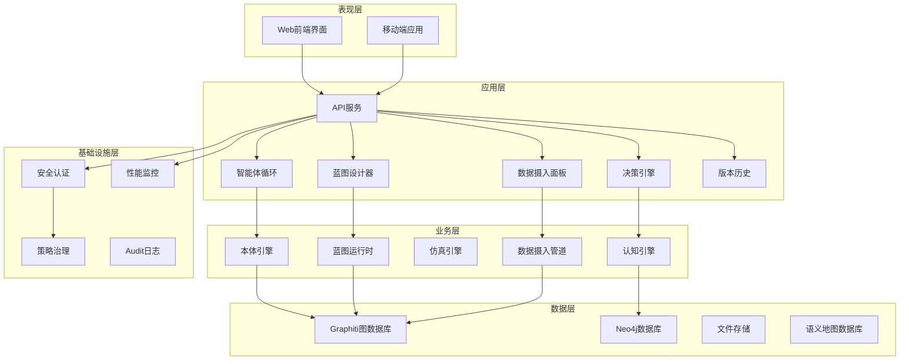

**图表来源**
- [README.md:16-26](file://README.md#L16-L26)
- [odap/web/app.py:127-272](file://odap/web/app.py#L127-L272)

## 详细组件分析

### 本体引擎组件

本体引擎提供完整的本体生命周期管理：

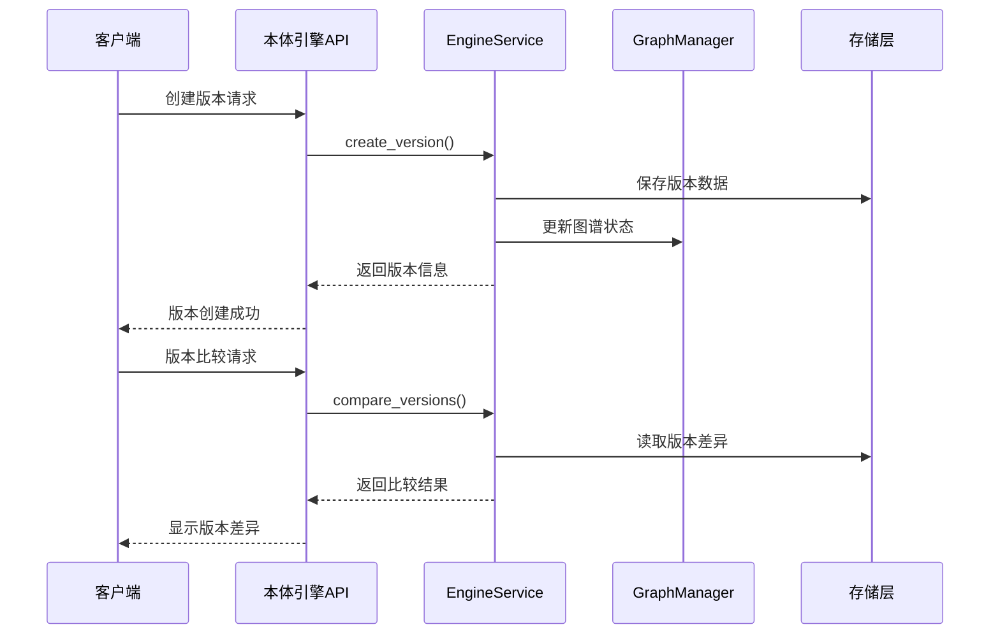

**图表来源**
- [odap/biz/core/ontology/engine/api/routes.py:11-81](file://odap/biz/core/ontology/engine/api/routes.py#L11-L81)

**章节来源**
- [odap/biz/core/ontology/engine/api/routes.py:1-143](file://odap/biz/core/ontology/engine/api/routes.py#L1-L143)

### 认知引擎组件

认知引擎支持LLM驱动的ReAct分析流程：

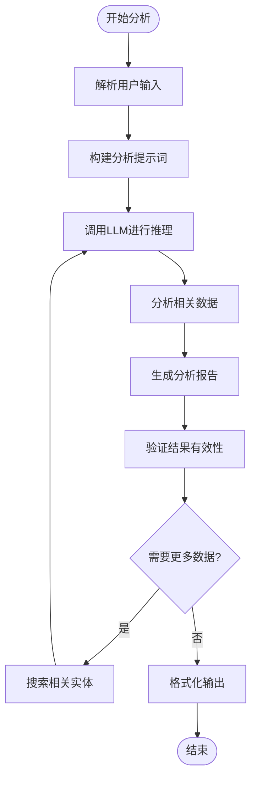

**图表来源**
- [main.py:136-158](file://main.py#L136-L158)

**章节来源**
- [main.py:20-255](file://main.py#L20-L255)

### 安全认证组件

安全认证系统提供多层级的安全保护：

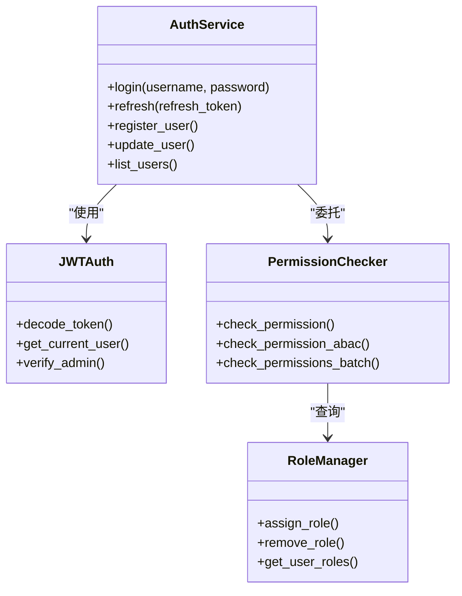

**图表来源**
- [odap/infra/security/auth_routes.py:40-143](file://odap/infra/security/auth_routes.py#L40-L143)

**章节来源**
- [odap/infra/security/auth_routes.py:1-143](file://odap/infra/security/auth_routes.py#L1-L143)

### 蓝图设计系统

蓝图设计系统提供可视化的本体构建流程：

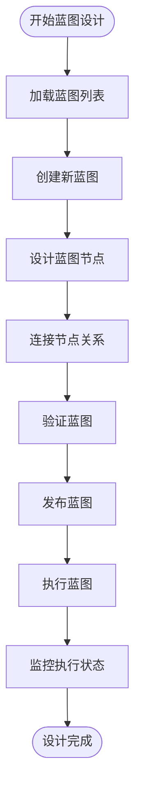

**图表来源**
- [frontend/src/modules/ontology/components/blueprint\BlueprintDesigner.tsx:68-252](file://frontend/src/modules/ontology/components/blueprint\BlueprintDesigner.tsx#L68-L252)

**章节来源**
- [frontend/src/modules/ontology/components/blueprint\BlueprintDesigner.tsx:1-252](file://frontend/src/modules/ontology/components/blueprint\BlueprintDesigner.tsx#L1-L252)
- [frontend/src/modules/ontology/stores/blueprintStore.ts:1-227](file://frontend/src/modules/ontology/stores/blueprintStore.ts#L1-L227)

### 数据摄入系统

数据摄入系统支持多种数据源的本体构建：

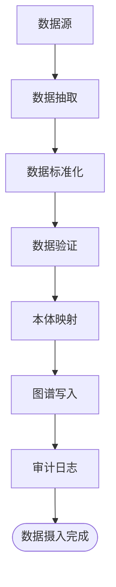

**图表来源**
- [odap/biz/core/ontology/engine/api/routes.py:1869-1940](file://odap/biz/core/ontology/engine/api/routes.py#L1869-L1940)

**章节来源**
- [odap/biz/core/ontology/engine/api/routes.py:1-143](file://odap/biz/core/ontology/engine/api/routes.py#L1-L143)

## 菜单结构重组

### 重组后的语义地图菜单

语义地图菜单已完全重组，从原来的6个项目重构为以本体设计器为中心的结构：

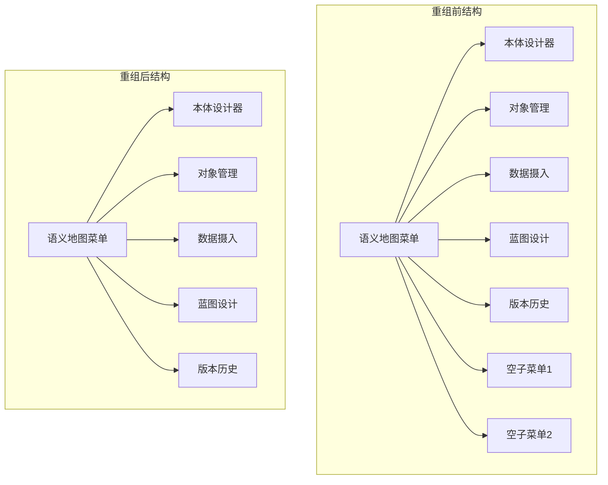

**更新** 菜单结构已完全重组，移除了原有的空子菜单，形成了更加清晰的功能组织

**章节来源**
- [frontend/src/modules/shared/components/AppLayout.tsx:133-201](file://frontend/src/modules/shared/components/AppLayout.tsx#L133-L201)

### 前端路由映射

重组后的前端路由结构：

| 路由路径 | 页面组件 | 功能描述 |
|----------|----------|----------|
| `/ontology/designer` | OntologyDesignerPage | 本体设计器主入口 |
| `/business/entities` | ObjectManagement | 对象管理 |
| `/ingest` | IngestPanel | 数据摄入面板 |
| `/blueprint` | BlueprintDesignerPage | 蓝图设计工具 |
| `/versions` | VersionHistory | 版本历史管理 |

**章节来源**
- [frontend/src/AppRoutes.tsx:38-52](file://frontend/src/AppRoutes.tsx#L38-L52)

### 语义地图功能增强

语义地图功能已集成到新的菜单结构中：

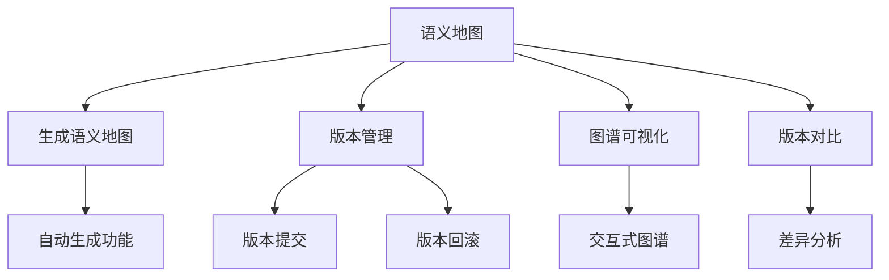

**图表来源**
- [frontend/src/modules/ontology/pages/OntologySemanticNetwork.tsx:276-327](file://frontend/src/modules/ontology/pages/OntologySemanticNetwork.tsx#L276-L327)

**章节来源**
- [frontend/src/modules/ontology/pages/OntologySemanticNetwork.tsx:1-726](file://frontend/src/modules/ontology/pages/OntologySemanticNetwork.tsx#L1-L726)

## 依赖关系分析

系统采用模块化设计，各组件间依赖关系清晰：

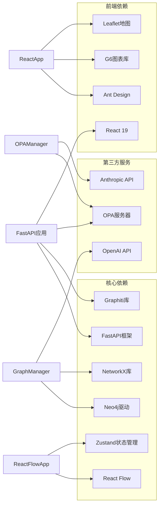

**图表来源**
- [README.md:16-26](file://README.md#L16-L26)
- [odap/web/app.py:127-272](file://odap/web/app.py#L127-L272)

**章节来源**
- [README.md:16-26](file://README.md#L16-L26)
- [config/agent_config.yaml:1-23](file://config/agent_config.yaml#L1-L23)

## 性能考虑

系统在多个层面考虑了性能优化：

### 连接池管理
- 最大连接数：20个
- 连接超时：30秒
- 空闲超时：300秒
- 断路器机制：失败阈值5次，恢复时间60秒

### 缓存策略
- LRU缓存：最大1000条记录
- TTL设置：300秒
- 命中率统计：实时监控

### 查询优化
- 批量操作：支持100实体批量加载
- 连接复用：连接池减少连接开销
- 异步处理：支持异步查询操作

### 蓝图设计性能
- React Flow优化：虚拟滚动支持大量节点
- Zustand状态管理：避免不必要的重渲染
- 懒加载：按需加载蓝图组件

## 故障排除指南

### 常见问题及解决方案

**图谱连接失败**
- 检查Neo4j服务状态
- 验证连接参数配置
- 查看断路器状态

**权限检查异常**
- 确认OPA服务可用性
- 检查策略文件完整性
- 验证用户角色配置

**查询性能问题**
- 监控连接池使用情况
- 检查缓存命中率
- 优化查询语句

**蓝图设计问题**
- 检查React Flow依赖版本
- 验证节点类型配置
- 确认状态管理正确性

**语义地图生成失败**
- 验证本体版本有效性
- 检查数据摄入完整性
- 确认图谱索引状态

**章节来源**
- [odap/infra/graph/graph_service.py:186-443](file://odap/infra/graph/graph_service.py#L186-L443)
- [odap/infra/opa/opa_service.py:538-750](file://odap/infra/opa/opa_service.py#L538-L750)

## 结论

本体设计器系统经过菜单结构重组后，形成了以本体设计器为中心的全新架构。系统通过模块化设计实现了高内聚、低耦合的架构，支持复杂的本体建模、蓝图设计和数据分析需求。

### 主要优势

1. **架构合理性**：分层清晰，职责明确，易于维护和扩展
2. **功能完整性**：集成本体设计器、蓝图设计、数据摄入、版本管理等功能
3. **用户体验优化**：菜单结构重组提升了用户操作效率
4. **性能优化**：多层次的性能优化策略，包括连接池、缓存、异步处理等
5. **安全性保障**：完善的权限治理体系，支持多种访问控制模型
6. **可扩展性**：模块化设计支持功能扩展和定制开发

### 发展建议

1. **监控完善**：增强系统监控和告警机制
2. **文档优化**：完善API文档和技术文档
3. **测试覆盖**：扩大单元测试和集成测试覆盖面
4. **性能调优**：持续优化查询性能和系统响应时间
5. **用户体验**：进一步优化蓝图设计和语义地图的交互体验