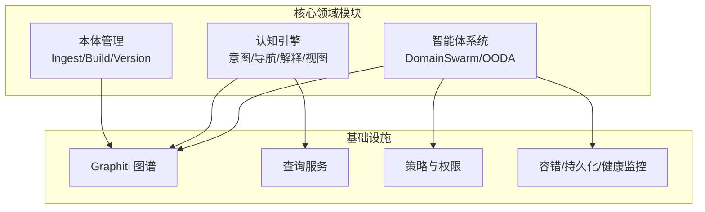
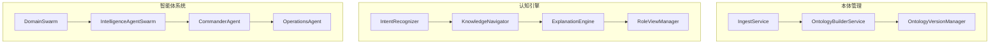
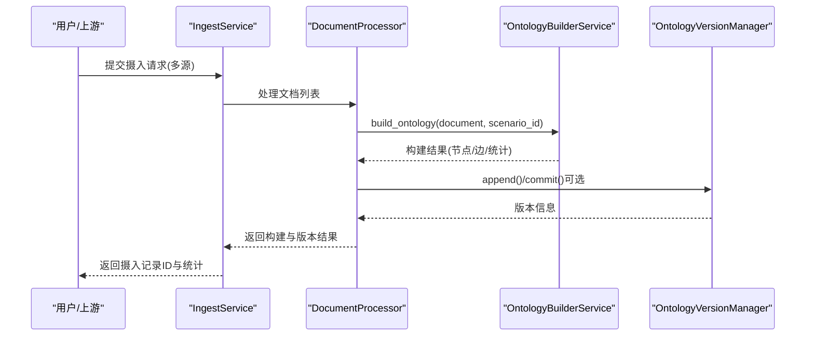
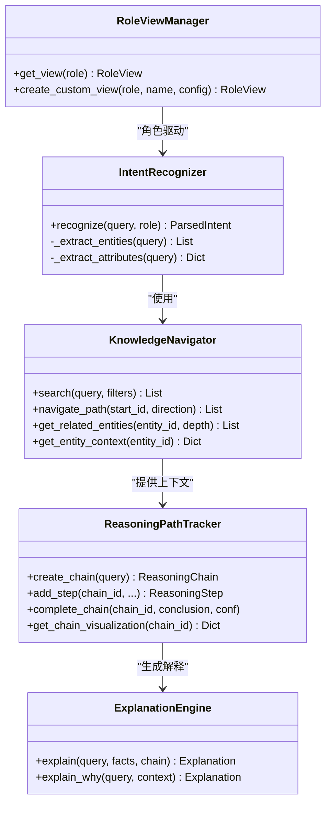
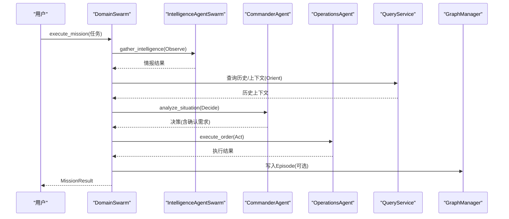
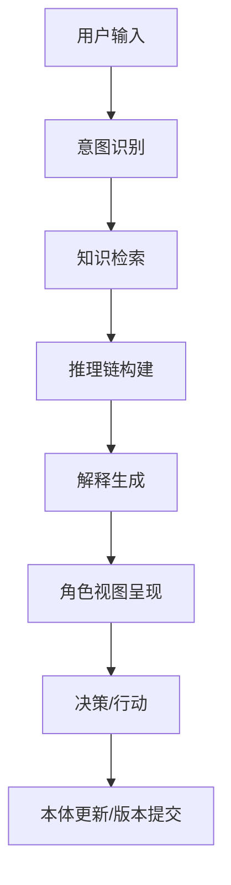
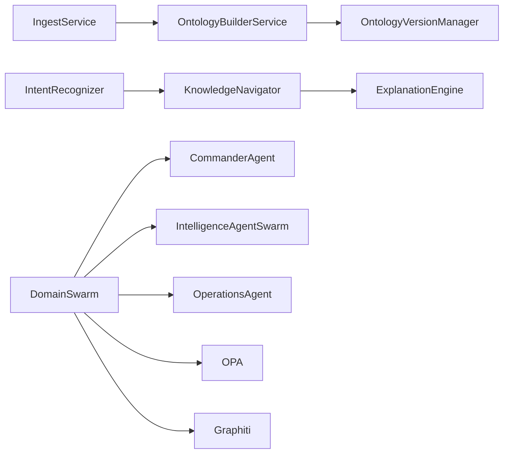

# 核心领域模块

<cite>
**本文引用的文件**
- [docs/03-modules/ontology/DESIGN.md](file://docs/03-modules/ontology/DESIGN.md)
- [docs/03-modules/user_cognition_engine/DESIGN.md](file://docs/03-modules/user_cognition_engine/DESIGN.md)
- [docs/03-modules/swarm_orchestrator/DESIGN.md](file://docs/03-modules/swarm_orchestrator/DESIGN.md)
- [docs/03-modules/agent/DESIGN.md](file://docs/03-modules/agent/DESIGN.md)
- [odap/biz/core/ontology/__init__.py](file://odap/biz/core/ontology/__init__.py)
- [odap/biz/core/cognition/__init__.py](file://odap/biz/core/cognition/__init__.py)
- [odap/biz/core/agent/__init__.py](file://odap/biz/core/agent/__init__.py)
- [odap/biz/core/ontology/services/build_service.py](file://odap/biz/core/ontology/services/build_service.py)
- [odap/biz/core/ontology/services/ingest_service.py](file://odap/biz/core/ontology/services/ingest_service.py)
- [odap/biz/core/ontology/services/version_service.py](file://odap/biz/core/ontology/services/version_service.py)
- [odap/biz/core/cognition/user_cognition_engine.py](file://odap/biz/core/cognition/user_cognition_engine.py)
- [odap/biz/core/agent/swarm_orchestrator.py](file://odap/biz/core/agent/swarm_orchestrator.py)
</cite>

## 目录
1. [引言](#引言)
2. [项目结构](#项目结构)
3. [核心组件](#核心组件)
4. [架构总览](#架构总览)
5. [详细组件分析](#详细组件分析)
6. [依赖分析](#依赖分析)
7. [性能考量](#性能考量)
8. [故障排查指南](#故障排查指南)
9. [结论](#结论)
10. [附录](#附录)

## 引言
本文件聚焦于系统核心领域模块：本体管理（ontology）、认知引擎（cognition）、智能体系统（agent）。围绕以下目标展开：
- 本体建模与管理：实体/关系/验证规则、版本链管理与回滚
- 数据摄入与验证：多源摄入、LLM辅助抽取、构建与版本化
- 认知引擎：意图识别、知识导航、解释生成、角色视图
- 智能体编排：三 Agent（Commander/Intelligence/Operations）的 OODA 协同、故障恢复与状态持久化
- 模块间协作、数据流与接口设计
- 扩展与定制化实践建议

## 项目结构
核心领域模块由三大子系统构成：
- 本体管理（ontology）：负责数据摄入、本体构建、版本管理与回滚
- 认知引擎（cognition）：负责用户意图识别、知识导航、解释生成与角色视图
- 智能体系统（agent）：负责 OODA 循环编排与多 Agent 协同

**章节来源**
- [odap/biz/core/ontology/__init__.py:1-19](file://odap/biz/core/ontology/__init__.py#L1-L19)
- [odap/biz/core/cognition/__init__.py:1-2](file://odap/biz/core/cognition/__init__.py#L1-L2)
- [odap/biz/core/agent/__init__.py:1-5](file://odap/biz/core/agent/__init__.py#L1-L5)

## 核心组件
- 本体管理
  - 数据摄入服务：统一入口，支持 URL/新闻/手动/JSON/自然语言/随机事件
  - 本体构建服务：实体/关系抽取、图谱写入、版本创建
  - 版本管理服务：追加/提交版本、版本链、差异对比、实体历史
- 认知引擎
  - 意图识别：基于规则的意图与实体抽取
  - 知识导航：图谱/查询服务检索、邻接与上下文
  - 解释引擎：推理链追踪与解释生成
  - 角色视图：默认与自定义视图配置
- 智能体系统
  - DomainSwarm：三 Agent 协同的 OODA 循环
  - Commander/Intelligence/Operations：职责明确的 Agent 实现
  - 容错与状态：故障恢复、断路器、状态持久化、健康监控

**章节来源**
- [docs/03-modules/ontology/DESIGN.md:1-1254](file://docs/03-modules/ontology/DESIGN.md#L1-L1254)
- [docs/03-modules/user_cognition_engine/DESIGN.md:1-1197](file://docs/03-modules/user_cognition_engine/DESIGN.md#L1-L1197)
- [docs/03-modules/swarm_orchestrator/DESIGN.md:1-1454](file://docs/03-modules/swarm_orchestrator/DESIGN.md#L1-L1454)
- [docs/03-modules/agent/DESIGN.md:1-409](file://docs/03-modules/agent/DESIGN.md#L1-L409)

## 架构总览
本体管理通过“摄入-构建-版本”闭环，将多源数据转化为结构化本体并写入图谱；认知引擎以意图识别为入口，结合知识导航与解释生成，输出可解释的决策路径；智能体系统以 DomainSwarm 为中心，驱动三 Agent 在 OODA 循环中协同，配合策略与权限控制、容错与持久化保障。

**图表来源**
- [odap/biz/core/ontology/services/ingest_service.py:330-972](file://odap/biz/core/ontology/services/ingest_service.py#L330-L972)
- [odap/biz/core/ontology/services/build_service.py:36-447](file://odap/biz/core/ontology/services/build_service.py#L36-L447)
- [odap/biz/core/ontology/services/version_service.py:84-503](file://odap/biz/core/ontology/services/version_service.py#L84-L503)
- [odap/biz/core/cognition/user_cognition_engine.py:140-1012](file://odap/biz/core/cognition/user_cognition_engine.py#L140-L1012)
- [odap/biz/core/agent/swarm_orchestrator.py:288-687](file://odap/biz/core/agent/swarm_orchestrator.py#L288-L687)

## 详细组件分析

### 本体管理（ontology）
- 数据摄入（IngestService）
  - 支持多源：URL 抓取、新闻搜索（自动/第三方）、手动输入、JSON、自然语言、随机事件
  - 统一记录：摄入记录生命周期管理（创建/完成/失败），构建历史记录
  - LLM 辅助：在具备密钥时启用 LLM 抽取，否则降级为规则抽取
- 本体构建（OntologyBuilderService）
  - 实体/关系抽取：从 OntologyDocument 中提取实体、关系与事件
  - 图谱写入：将节点与边写入 Graphiti，带工作空间与场景标签
  - 版本创建：构建完成后可选择提交新版本，形成版本链
- 版本管理（OntologyVersionManager）
  - 追加模式：热写入自动将新数据合并到当前版本快照
  - 提交模式：锁定当前版本并创建新版本，版本号语义化递增
  - 差异对比：支持版本间实体/关系/事件差异计算
  - 实体历史：记录实体跨版本状态变化

**图表来源**
- [odap/biz/core/ontology/services/ingest_service.py:330-972](file://odap/biz/core/ontology/services/ingest_service.py#L330-L972)
- [odap/biz/core/ontology/services/build_service.py:36-447](file://odap/biz/core/ontology/services/build_service.py#L36-L447)
- [odap/biz/core/ontology/services/version_service.py:84-503](file://odap/biz/core/ontology/services/version_service.py#L84-L503)

**章节来源**
- [odap/biz/core/ontology/services/ingest_service.py:330-972](file://odap/biz/core/ontology/services/ingest_service.py#L330-L972)
- [odap/biz/core/ontology/services/build_service.py:36-447](file://odap/biz/core/ontology/services/build_service.py#L36-L447)
- [odap/biz/core/ontology/services/version_service.py:84-503](file://odap/biz/core/ontology/services/version_service.py#L84-L503)

### 认知引擎（cognition）
- 意图识别（IntentRecognizer）
  - 基于正则规则识别意图类型（查询/动作/解释/推荐/导航/比较/分析）
  - 实体抽取：雷达/目标/单位/位置等
  - 属性提取：时间粒度、详细程度等
- 知识导航（KnowledgeNavigator）
  - 检索：优先使用查询服务，其次图谱客户端
  - 路径：邻居遍历、相关实体与上下文获取
  - 缓存：短期缓存检索结果
- 解释引擎（ExplanationEngine）
  - 推理链追踪：ReasoningPathTracker 记录步骤、顺序与结论
  - 解释生成：回答、来源识别、替代解释、为什么解释
- 角色视图（RoleViewManager）
  - 默认视图：指挥官/情报员/操作员的布局与过滤
  - 自定义视图：按角色与能力配置

**图表来源**
- [odap/biz/core/cognition/user_cognition_engine.py:140-1012](file://odap/biz/core/cognition/user_cognition_engine.py#L140-L1012)

**章节来源**
- [odap/biz/core/cognition/user_cognition_engine.py:140-1012](file://odap/biz/core/cognition/user_cognition_engine.py#L140-L1012)

### 智能体系统（agent）
- DomainSwarm
  - 三 Agent：Intelligence（感知）、Commander（决策）、Operations（执行）
  - OODA 循环：Observe → Orient → Decide → Act，阶段间数据传递与检查点持久化
  - 权限与图谱：每个 Agent 通过 OPA 与 GraphManager 协作
- Commander/Intelligence/Operations
  - Commander：威胁评估、生成选项、选择最佳行动
  - Intelligence：技能调用收集情报、威胁等级判定
  - Operations：执行命令、权限二次校验、可选人工确认
- 容错与状态
  - 故障恢复：断路器、重试/降级/重启策略
  - 状态持久化：任务检查点、Agent 状态恢复
  - 健康监控：指标采集与报告

**图表来源**
- [odap/biz/core/agent/swarm_orchestrator.py:288-687](file://odap/biz/core/agent/swarm_orchestrator.py#L288-L687)

**章节来源**
- [odap/biz/core/agent/swarm_orchestrator.py:288-687](file://odap/biz/core/agent/swarm_orchestrator.py#L288-L687)

### 概念总览
以下为概念性流程图，不直接映射具体代码文件。

## 依赖分析
- 模块内聚与耦合
  - 本体管理内部：Ingest → Build → Version 高内聚，低耦合（通过存储与图谱接口）
  - 认知引擎内部：Intent → Navigator → Reasoning → Explanation 高内聚，依赖查询/图谱服务
  - 智能体系统：DomainSwarm 作为编排中心，与 OPA、Graph、容错模块松耦合
- 外部依赖
  - 图谱：Graphiti（写入/查询）
  - 查询：统一查询协议
  - 权限：OPA 策略
  - LLM：可选，用于抽取与解释增强
- 循环依赖
  - 未见直接循环依赖；模块边界清晰

**图表来源**
- [odap/biz/core/ontology/services/ingest_service.py:330-972](file://odap/biz/core/ontology/services/ingest_service.py#L330-L972)
- [odap/biz/core/ontology/services/build_service.py:36-447](file://odap/biz/core/ontology/services/build_service.py#L36-L447)
- [odap/biz/core/ontology/services/version_service.py:84-503](file://odap/biz/core/ontology/services/version_service.py#L84-L503)
- [odap/biz/core/cognition/user_cognition_engine.py:140-1012](file://odap/biz/core/cognition/user_cognition_engine.py#L140-L1012)
- [odap/biz/core/agent/swarm_orchestrator.py:288-687](file://odap/biz/core/agent/swarm_orchestrator.py#L288-L687)

**章节来源**
- [odap/biz/core/ontology/services/ingest_service.py:330-972](file://odap/biz/core/ontology/services/ingest_service.py#L330-L972)
- [odap/biz/core/ontology/services/build_service.py:36-447](file://odap/biz/core/ontology/services/build_service.py#L36-L447)
- [odap/biz/core/ontology/services/version_service.py:84-503](file://odap/biz/core/ontology/services/version_service.py#L84-L503)
- [odap/biz/core/cognition/user_cognition_engine.py:140-1012](file://odap/biz/core/cognition/user_cognition_engine.py#L140-L1012)
- [odap/biz/core/agent/swarm_orchestrator.py:288-687](file://odap/biz/core/agent/swarm_orchestrator.py#L288-L687)

## 性能考量
- 摄入与构建
  - 批量处理与异步写入：IngestService 与 BuilderService 支持异步与进度统计
  - 图谱写入：节点/边批量写入，异常容忍（记录警告但不中断整体流程）
- 版本管理
  - 快照合并：追加模式避免频繁提交带来的锁竞争
  - 版本链：单向链便于审计与回滚，注意版本数量增长导致的查询成本
- 认知引擎
  - 检索缓存：短期缓存提升重复查询性能
  - 推理链可视化：仅在需要时生成，避免冗余计算
- 智能体系统
  - 断路器与重试：指数退避降低抖动
  - 检查点：任务断点续跑，减少重复计算
- 建议
  - 对高频检索建立索引与缓存策略
  - 控制版本链长度，定期归档旧版本
  - 对 LLM 调用增加速率限制与熔断

## 故障排查指南
- 本体管理
  - 构建失败：检查实体/关系抽取逻辑与图谱写入异常日志
  - 版本提交失败：确认当前版本状态与父版本指针一致性
- 认知引擎
  - 意图识别不准：调整正则规则或引入更细粒度的 NLU
  - 导航无结果：检查查询服务/图谱连接与过滤条件
- 智能体系统
  - OODA 卡住：检查断路器状态与重试策略
  - 执行失败：确认 OPA 权限与工具可用性
  - 任务中断：使用检查点恢复，核对 Agent 状态

**章节来源**
- [odap/biz/core/ontology/services/build_service.py:126-136](file://odap/biz/core/ontology/services/build_service.py#L126-L136)
- [odap/biz/core/ontology/services/version_service.py:206-277](file://odap/biz/core/ontology/services/version_service.py#L206-L277)
- [odap/biz/core/cognition/user_cognition_engine.py:140-1012](file://odap/biz/core/cognition/user_cognition_engine.py#L140-L1012)
- [odap/biz/core/agent/swarm_orchestrator.py:288-687](file://odap/biz/core/agent/swarm_orchestrator.py#L288-L687)

## 结论
本体管理、认知引擎与智能体系统三者协同，形成“数据→知识→决策→行动”的闭环：
- 本体管理提供结构化知识与版本化治理
- 认知引擎提供意图理解与可解释推理
- 智能体系统提供自动化与可控的人机协同
通过模块化设计与完善的容错机制，系统具备良好的扩展性与稳定性。

## 附录
- 扩展与定制
  - 本体管理：新增摄入源/抽取规则/验证器；扩展版本策略（如分支/合并）
  - 认知引擎：替换意图识别模型、扩展知识源、自定义解释模板
  - 智能体系统：新增 Agent 类型、扩展 OODA 阶段、接入新的工具与权限策略
- 接口设计要点
  - 本体：Document → Nodes/Edges → Graphiti；版本：append/commit
  - 认知：Intent/Navigate/Explain/View 的统一数据模型
  - 智能体：DomainSwarm 的 streaming 接口与进度回调