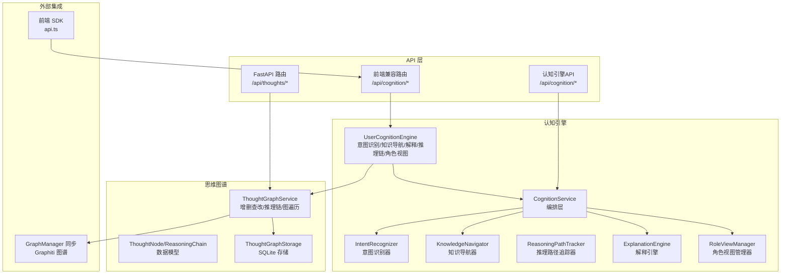
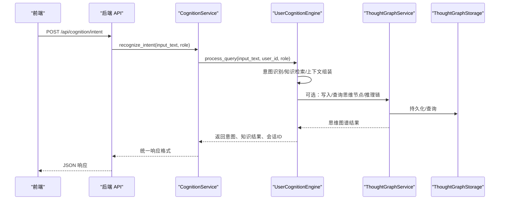
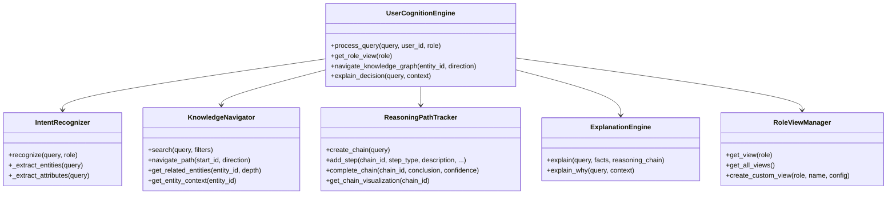
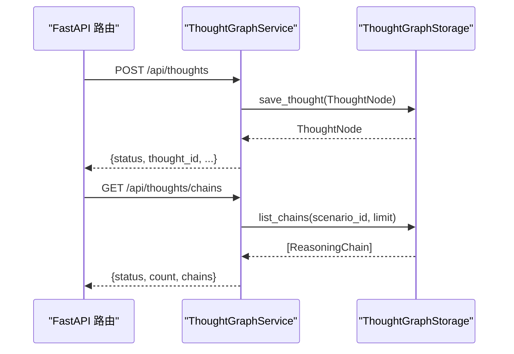
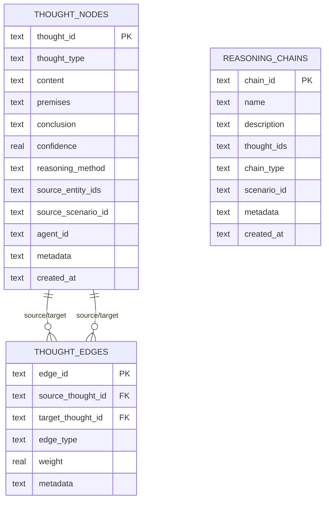
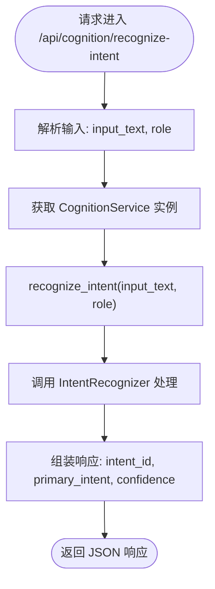
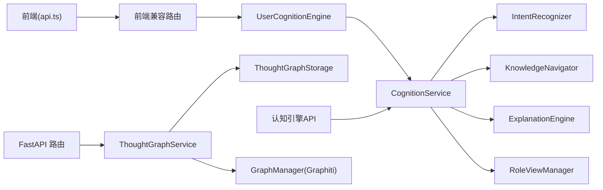
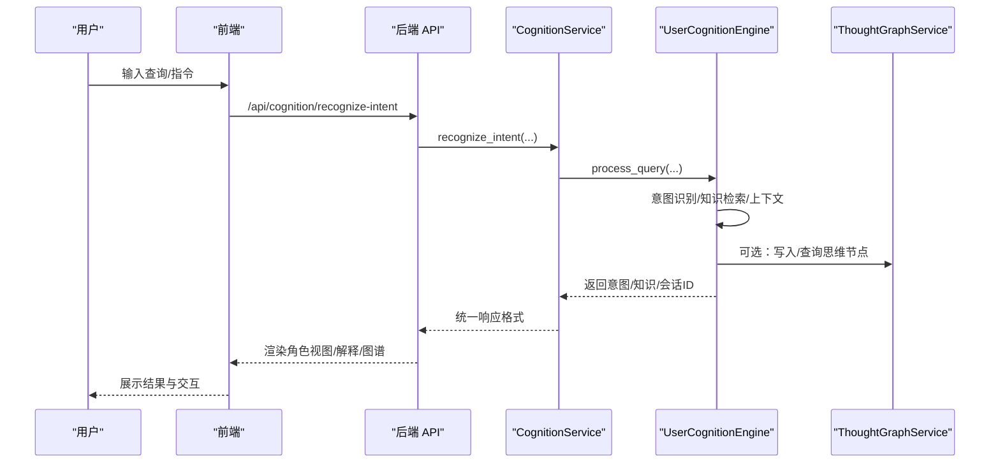

# 认知引擎

<cite>
**本文引用的文件**
- [odap/biz/core/cognition/user_cognition_engine.py](file://odap/biz/core/cognition/user_cognition_engine.py)
- [odap/biz/core/cognition/services/cognition_service.py](file://odap/biz/core/cognition/services/cognition_service.py)
- [odap/biz/core/cognition/thought_graph/models/types.py](file://odap/biz/core/cognition/thought_graph/models/types.py)
- [odap/biz/core/cognition/thought_graph/services/thought_graph_service.py](file://odap/biz/core/cognition/thought_graph/services/thought_graph_service.py)
- [odap/biz/core/cognition/thought_graph/storage/sqlite_thought_storage.py](file://odap/biz/core/cognition/thought_graph/storage/sqlite_thought_storage.py)
- [odap/biz/core/cognition/thought_graph/api/routes.py](file://odap/biz/core/cognition/thought_graph/api/routes.py)
- [odap/biz/core/cognition/thought_graph/__init__.py](file://odap/biz/core/cognition/thought_graph/__init__.py)
- [odap/biz/core/cognition/thought_graph/services/__init__.py](file://odap/biz/core/cognition/thought_graph/services/__init__.py)
- [odap/biz/core/cognition/thought_graph/storage/__init__.py](file://odap/biz/core/cognition/thought_graph/storage/__init__.py)
- [odap/biz/core/cognition/thought_graph/__init__.py](file://odap/biz/core/cognition/thought_graph/__init__.py)
- [odap/biz/core/cognition/api/routes.py](file://odap/biz/core/cognition/api/routes.py)
- [odap/biz/integration/frontend_compat/api/routes.py](file://odap/biz/integration/frontend_compat/api/routes.py)
- [frontend/src/modules/shared/services/api.ts](file://frontend/src/modules/shared/services/api.ts)
- [odap/infra/graph/thought_graph.py](file://odap/infra/graph/thought_graph.py)
- [odap/infra/graph/thought_routes.py](file://odap/infra/graph/thought_routes.py)
- [specs/001-odap-platform/spec.md](file://specs/001-odap-platform/spec.md)
</cite>

## 更新摘要
**变更内容**
- 新增了完整的认知引擎组件架构，包括IntentRecognizer、ExplanationEngine、KnowledgeNavigator、RoleViewManager等核心组件
- 更新了用户认知引擎的实现，采用模块化设计，将各个功能组件组合在一起
- 新增了CognitionService编排层，提供统一的认知引擎服务接口
- 完善了API接口设计，新增了专门的认知引擎API路由
- 增强了思维图谱服务与存储的集成能力

## 目录
1. [简介](#简介)
2. [项目结构](#项目结构)
3. [核心组件](#核心组件)
4. [架构总览](#架构总览)
5. [详细组件分析](#详细组件分析)
6. [依赖分析](#依赖分析)
7. [性能考量](#性能考量)
8. [故障排查指南](#故障排查指南)
9. [结论](#结论)
10. [附录](#附录)

## 简介
本文件为"认知引擎"的技术文档，聚焦于用户认知引擎（User Cognition Engine）的设计与实现，涵盖思维图谱（Thought Graph）的构建、存储与查询机制，以及意图识别、上下文理解、对话历史管理、角色视图、解释引擎、推理链追踪等核心能力。文档还描述了思维图谱服务、SQLite 存储实现、API 接口设计，并给出认知状态管理、记忆持久化与性能优化策略，最后提供实际应用场景与集成示例，帮助开发者理解并扩展认知能力。

**更新** 本次更新重点反映了新增的IntentRecognizer、ExplanationEngine、KnowledgeNavigator、RoleViewManager等认知引擎组件的完整实现，以及CognitionService编排层的设计。

## 项目结构
认知引擎位于 odap 业务域内，围绕"用户认知引擎"与"思维图谱"两条主线展开：
- 用户认知引擎：负责意图识别、知识导航、解释与推理链可视化、角色视图管理等。
- 思维图谱：提供思维节点、推理链、边的增删改查与图遍历查询，后端采用 SQLite 存储。

**图表来源**
- [odap/biz/core/cognition/user_cognition_engine.py](file://odap/biz/core/cognition/user_cognition_engine.py)
- [odap/biz/core/cognition/services/cognition_service.py](file://odap/biz/core/cognition/services/cognition_service.py)
- [odap/biz/core/cognition/thought_graph/services/thought_graph_service.py](file://odap/biz/core/cognition/thought_graph/services/thought_graph_service.py)
- [odap/biz/core/cognition/thought_graph/storage/sqlite_thought_storage.py](file://odap/biz/core/cognition/thought_graph/storage/sqlite_thought_storage.py)
- [odap/biz/core/cognition/thought_graph/api/routes.py](file://odap/biz/core/cognition/thought_graph/api/routes.py)
- [odap/biz/core/cognition/api/routes.py](file://odap/biz/core/cognition/api/routes.py)
- [odap/biz/integration/frontend_compat/api/routes.py](file://odap/biz/integration/frontend_compat/api/routes.py)
- [frontend/src/modules/shared/services/api.ts](file://frontend/src/modules/shared/services/api.ts)
- [odap/infra/graph/thought_graph.py](file://odap/infra/graph/thought_graph.py)

**章节来源**
- [odap/biz/core/cognition/user_cognition_engine.py](file://odap/biz/core/cognition/user_cognition_engine.py)
- [odap/biz/core/cognition/services/cognition_service.py](file://odap/biz/core/cognition/services/cognition_service.py)
- [odap/biz/core/cognition/thought_graph/services/thought_graph_service.py](file://odap/biz/core/cognition/thought_graph/services/thought_graph_service.py)
- [odap/biz/core/cognition/thought_graph/storage/sqlite_thought_storage.py](file://odap/biz/core/cognition/thought_graph/storage/sqlite_thought_storage.py)
- [odap/biz/core/cognition/thought_graph/api/routes.py](file://odap/biz/core/cognition/thought_graph/api/routes.py)
- [odap/biz/core/cognition/api/routes.py](file://odap/biz/core/cognition/api/routes.py)
- [odap/biz/integration/frontend_compat/api/routes.py](file://odap/biz/integration/frontend_compat/api/routes.py)
- [frontend/src/modules/shared/services/api.ts](file://frontend/src/modules/shared/services/api.ts)
- [odap/infra/graph/thought_graph.py](file://odap/infra/graph/thought_graph.py)

## 核心组件
- 用户认知引擎（UserCognitionEngine）
  - 意图识别器：基于正则规则与实体抽取，输出主意图、置信度、候选意图与属性。
  - 知识导航器：封装查询服务或图客户端，提供检索、邻接节点、实体上下文等能力。
  - 推理路径追踪器：维护推理链，支持步骤添加、链完成、可视化数据生成。
  - 解释引擎：根据推理链生成解释文本、来源与备选解释。
  - 角色视图管理器：内置指挥官/情报员/操作员视图，支持自定义视图。
  - 会话上下文：管理用户会话、角色、工作区、场景等上下文信息。
- 认知服务编排层（CognitionService）
  - 统一的服务接口，协调各个认知组件的工作。
  - 提供意图识别、知识导航、解释生成、角色视图管理等服务。
- 思维图谱（Thought Graph）
  - 数据模型：ThoughtNode、ReasoningChain、枚举类型 ThoughtType、ReasoningMethod。
  - 服务层：ThoughtGraphService 提供思维节点/链的增删查改、边连接、图遍历、同步至 Graphiti。
  - 存储层：ThoughtGraphStorage 基于 SQLite 的持久化，包含 thought_nodes、reasoning_chains、thought_edges 表及索引。
  - API 层：FastAPI 路由提供 /api/thoughts/* 接口；前端兼容路由提供 /api/cognition/*。

**更新** 新增了CognitionService编排层，将各个认知组件整合为统一的服务接口。

**章节来源**
- [odap/biz/core/cognition/user_cognition_engine.py](file://odap/biz/core/cognition/user_cognition_engine.py)
- [odap/biz/core/cognition/services/cognition_service.py](file://odap/biz/core/cognition/services/cognition_service.py)
- [odap/biz/core/cognition/thought_graph/models/types.py](file://odap/biz/core/cognition/thought_graph/models/types.py)
- [odap/biz/core/cognition/thought_graph/services/thought_graph_service.py](file://odap/biz/core/cognition/thought_graph/services/thought_graph_service.py)
- [odap/biz/core/cognition/thought_graph/storage/sqlite_thought_storage.py](file://odap/biz/core/cognition/thought_graph/storage/sqlite_thought_storage.py)
- [odap/biz/core/cognition/thought_graph/api/routes.py](file://odap/biz/core/cognition/thought_graph/api/routes.py)

## 架构总览
认知引擎采用"模块化分层 + 服务化接口"的架构：
- 表现层：前端通过 api.ts 调用后端 /api/cognition/* 接口；后端 FastAPI 路由暴露 /api/thoughts/*。
- 业务层：UserCognitionEngine 组合意图识别、知识导航、解释与推理链管理；ThoughtGraphService 封装思维图谱操作。
- 服务层：CognitionService 作为编排层，协调各个认知组件的工作。
- 存储层：ThoughtGraphStorage 使用 SQLite，表结构清晰，索引覆盖常见查询维度。
- 集成层：可将思维节点同步到 GraphManager（Graphiti）进行统一图谱管理。

**图表来源**
- [odap/biz/core/cognition/api/routes.py](file://odap/biz/core/cognition/api/routes.py)
- [odap/biz/core/cognition/services/cognition_service.py](file://odap/biz/core/cognition/services/cognition_service.py)
- [odap/biz/integration/frontend_compat/api/routes.py](file://odap/biz/integration/frontend_compat/api/routes.py)
- [frontend/src/modules/shared/services/api.ts](file://frontend/src/modules/shared/services/api.ts)
- [odap/biz/core/cognition/user_cognition_engine.py](file://odap/biz/core/cognition/user_cognition_engine.py)
- [odap/biz/core/cognition/thought_graph/services/thought_graph_service.py](file://odap/biz/core/cognition/thought_graph/services/thought_graph_service.py)
- [odap/biz/core/cognition/thought_graph/storage/sqlite_thought_storage.py](file://odap/biz/core/cognition/thought_graph/storage/sqlite_thought_storage.py)

## 详细组件分析

### 用户认知引擎（UserCognitionEngine）
- 设计要点
  - 模块化：IntentRecognizer、KnowledgeNavigator、ReasoningPathTracker、ExplanationEngine、RoleViewManager 各司其职。
  - 可扩展：支持自定义实体抽取器、属性提取器、视图布局与过滤器。
  - 会话管理：UserContext 统一承载用户、角色、会话、工作区、场景与偏好。
  - 编排层：通过CognitionService协调各个组件的工作。
- 关键流程
  - 意图识别：对输入文本匹配意图模式，抽取实体与属性，输出主意图与置信度。
  - 知识检索：优先调用查询服务，回退到图客户端；支持邻接节点与实体上下文。
  - 推理链可视化：将推理步骤转换为节点/边结构，便于前端渲染。
  - 决策解释：结合推理链与事实，生成解释文本、来源与备选解释。
  - 角色视图：按角色返回预设或自定义视图配置。

**图表来源**
- [odap/biz/core/cognition/user_cognition_engine.py](file://odap/biz/core/cognition/user_cognition_engine.py)

**章节来源**
- [odap/biz/core/cognition/user_cognition_engine.py](file://odap/biz/core/cognition/user_cognition_engine.py)

### 认知服务编排层（CognitionService）
- 设计要点
  - 单例模式：确保整个应用只有一个认知服务实例。
  - 统一接口：为各个认知组件提供统一的服务接口。
  - 异常处理：集中处理各个组件可能抛出的异常。
- 核心功能
  - 意图识别服务：调用IntentRecognizer处理用户输入。
  - 知识导航服务：调用KnowledgeNavigator进行知识检索。
  - 解释服务：调用ExplanationEngine生成解释。
  - 角色视图服务：调用RoleViewManager管理视图配置。

**新增** CognitionService作为编排层，协调各个认知组件的工作，提供统一的服务接口。

**章节来源**
- [odap/biz/core/cognition/services/cognition_service.py](file://odap/biz/core/cognition/services/cognition_service.py)

### 思维图谱服务（ThoughtGraphService）
- 功能
  - 思维节点：新增、查询、列表、删除。
  - 推理链：创建、查询、列表、删除；自动建立顺序边。
  - 边连接：任意两点间建立边，支持边类型与权重。
  - 图遍历：从指定节点按深度遍历，聚合节点与边。
  - 同步：将思维节点同步到 GraphManager（Graphiti）。
- 错误处理
  - 对"未找到"、"内部异常"分别返回错误状态码与消息。

**图表来源**
- [odap/biz/core/cognition/thought_graph/api/routes.py](file://odap/biz/core/cognition/thought_graph/api/routes.py)
- [odap/biz/core/cognition/thought_graph/services/thought_graph_service.py](file://odap/biz/core/cognition/thought_graph/services/thought_graph_service.py)
- [odap/biz/core/cognition/thought_graph/storage/sqlite_thought_storage.py](file://odap/biz/core/cognition/thought_graph/storage/sqlite_thought_storage.py)

**章节来源**
- [odap/biz/core/cognition/thought_graph/services/thought_graph_service.py](file://odap/biz/core/cognition/thought_graph/services/thought_graph_service.py)
- [odap/biz/core/cognition/thought_graph/api/routes.py](file://odap/biz/core/cognition/thought_graph/api/routes.py)

### 思维图谱存储（SQLite）
- 表结构
  - thought_nodes：思维节点，包含类型、内容、前提、结论、置信度、推理方法、来源实体/场景/代理、元数据、创建时间。
  - reasoning_chains：推理链，包含名称、描述、思维节点ID列表、链类型、场景ID、元数据、创建时间。
  - thought_edges：思维边，包含源/目标节点、边类型、权重、元数据。
- 索引
  - thought_nodes：按类型、场景、代理建立索引；reasoning_chains：按场景建立索引。
- 查询
  - 支持按类型/场景/代理筛选、分页；支持边的入/出/双向查询。

**图表来源**
- [odap/biz/core/cognition/thought_graph/storage/sqlite_thought_storage.py](file://odap/biz/core/cognition/thought_graph/storage/sqlite_thought_storage.py)

**章节来源**
- [odap/biz/core/cognition/thought_graph/storage/sqlite_thought_storage.py](file://odap/biz/core/cognition/thought_graph/storage/sqlite_thought_storage.py)

### API 接口设计
- 思维图谱接口（/api/thoughts/*）
  - POST /api/thoughts：新增思维节点
  - GET /api/thoughts/{thought_id}：查询思维节点
  - GET /api/thoughts：列表查询（支持类型/场景/代理/limit）
  - DELETE /api/thoughts/{thought_id}：删除思维节点
  - POST /api/thoughts/chains：创建推理链
  - GET /api/thoughts/chains/{chain_id}：查询推理链
  - GET /api/thoughts/chains：推理链列表
  - DELETE /api/thoughts/chains/{chain_id}：删除推理链
  - POST /api/thoughts/link：连接两点为边
  - GET /api/thoughts/{thought_id}/graph：图遍历
  - POST /api/thoughts/{thought_id}/sync-graphiti：同步到 Graphiti
- 认知引擎接口（/api/cognition/*）
  - POST /api/cognition/recognize-intent：意图识别
  - POST /api/cognition/navigate：知识图谱导航
  - POST /api/cognition/explain：决策解释
  - GET /api/cognition/role-view：获取角色视图
  - PUT /api/cognition/role-view：更新角色视图
- 前端兼容接口（/api/cognition/*）
  - POST /api/cognition/intent：意图识别与知识检索
  - GET /api/cognition/view：获取角色视图
  - POST /api/cognition/navigate：知识图谱导航
  - POST /api/cognition/explain：决策解释

**图表来源**
- [odap/biz/core/cognition/api/routes.py](file://odap/biz/core/cognition/api/routes.py)
- [odap/biz/core/cognition/services/cognition_service.py](file://odap/biz/core/cognition/services/cognition_service.py)

**章节来源**
- [odap/biz/core/cognition/thought_graph/api/routes.py](file://odap/biz/core/cognition/thought_graph/api/routes.py)
- [odap/biz/core/cognition/api/routes.py](file://odap/biz/core/cognition/api/routes.py)
- [odap/biz/integration/frontend_compat/api/routes.py](file://odap/biz/integration/frontend_compat/api/routes.py)
- [frontend/src/modules/shared/services/api.ts](file://frontend/src/modules/shared/services/api.ts)

### 数据模型与类型
- ThoughtType：观察、推理、假设、决策、反思、计划。
- ReasoningMethod：演绎、归纳、溯因、类比、启发式。
- ThoughtNode：思维节点，包含类型、内容、前提、结论、置信度、推理方法、来源实体/场景/代理、元数据、创建时间。
- ReasoningChain：推理链，包含名称、描述、思维节点ID列表、链类型、场景ID、元数据、创建时间。

**章节来源**
- [odap/biz/core/cognition/thought_graph/models/types.py](file://odap/biz/core/cognition/thought_graph/models/types.py)

### 集成与同步
- Graphiti 同步：ThoughtGraphService 支持将思维节点同步到 GraphManager（Graphiti），用于统一图谱管理与可视化。
- 前端对接：前端通过 api.ts 调用后端认知接口，实现意图识别、角色视图、知识导航与解释。

**章节来源**
- [odap/biz/core/cognition/thought_graph/services/thought_graph_service.py](file://odap/biz/core/cognition/thought_graph/services/thought_graph_service.py)
- [frontend/src/modules/shared/services/api.ts](file://frontend/src/modules/shared/services/api.ts)

## 依赖分析
- 模块内聚与耦合
  - UserCognitionEngine 内部模块职责清晰，通过组合方式协作，耦合度低。
  - CognitionService 作为编排层，降低了各个组件之间的直接依赖。
  - ThoughtGraphService 仅依赖 ThoughtGraphStorage，接口稳定，易于替换存储实现。
- 外部依赖
  - FastAPI 路由层提供 REST 接口。
  - GraphManager（Graphiti）作为外部图谱系统，用于同步与可视化。
  - 前端通过 api.ts 与后端交互。

**图表来源**
- [odap/biz/core/cognition/user_cognition_engine.py](file://odap/biz/core/cognition/user_cognition_engine.py)
- [odap/biz/core/cognition/services/cognition_service.py](file://odap/biz/core/cognition/services/cognition_service.py)
- [odap/biz/core/cognition/thought_graph/services/thought_graph_service.py](file://odap/biz/core/cognition/thought_graph/services/thought_graph_service.py)
- [odap/biz/core/cognition/thought_graph/storage/sqlite_thought_storage.py](file://odap/biz/core/cognition/thought_graph/storage/sqlite_thought_storage.py)
- [odap/biz/core/cognition/thought_graph/api/routes.py](file://odap/biz/core/cognition/thought_graph/api/routes.py)
- [odap/biz/core/cognition/api/routes.py](file://odap/biz/core/cognition/api/routes.py)
- [odap/biz/integration/frontend_compat/api/routes.py](file://odap/biz/integration/frontend_compat/api/routes.py)
- [frontend/src/modules/shared/services/api.ts](file://frontend/src/modules/shared/services/api.ts)
- [odap/infra/graph/thought_graph.py](file://odap/infra/graph/thought_graph.py)

**章节来源**
- [odap/biz/core/cognition/user_cognition_engine.py](file://odap/biz/core/cognition/user_cognition_engine.py)
- [odap/biz/core/cognition/services/cognition_service.py](file://odap/biz/core/cognition/services/cognition_service.py)
- [odap/biz/core/cognition/thought_graph/services/thought_graph_service.py](file://odap/biz/core/cognition/thought_graph/services/thought_graph_service.py)
- [odap/biz/core/cognition/thought_graph/storage/sqlite_thought_storage.py](file://odap/biz/core/cognition/thought_graph/storage/sqlite_thought_storage.py)
- [odap/biz/core/cognition/thought_graph/api/routes.py](file://odap/biz/core/cognition/thought_graph/api/routes.py)
- [odap/biz/core/cognition/api/routes.py](file://odap/biz/core/cognition/api/routes.py)
- [odap/biz/integration/frontend_compat/api/routes.py](file://odap/biz/integration/frontend_compat/api/routes.py)
- [frontend/src/modules/shared/services/api.ts](file://frontend/src/modules/shared/services/api.ts)
- [odap/infra/graph/thought_graph.py](file://odap/infra/graph/thought_graph.py)

## 性能考量
- 存储层面
  - SQLite 表已建立关键索引（类型/场景/代理/场景），可显著提升查询性能。
  - JSON 字段用于存储数组/字典，注意查询时的反序列化开销。
- 服务层面
  - 图遍历采用广度优先，深度参数控制范围，避免全图扫描。
  - 批量写入建议合并事务，减少 IO 次数。
  - CognitionService 使用单例模式，避免重复创建组件实例。
- API 层面
  - 分页参数（limit）限制返回数量，避免大结果集传输。
  - 对高频查询可引入缓存（如 LRU）以降低重复计算与数据库压力。
- 前端层面
  - 合理拆分请求，避免一次性请求过多数据。
  - 对解释与可视化数据进行懒加载与增量渲染。

## 故障排查指南
- 常见错误与定位
  - "思维节点未找到"：检查 thought_id 是否正确，确认存储是否成功写入。
  - "推理链未找到"：确认链ID与场景ID是否匹配。
  - "同步失败"：检查 GraphManager 可用性与网络连通性。
  - "前端接口报错"：核对请求体字段（如 role、entity_id）与后端校验逻辑。
  - "认知服务不可用"：检查 CognitionService 实例是否正确初始化。
- 日志与监控
  - 在服务层捕获异常并返回 HTTP 异常，便于前端统一处理。
  - 建议在关键路径增加结构化日志，记录请求ID、用户ID、角色、查询关键词等。

**章节来源**
- [odap/biz/core/cognition/thought_graph/api/routes.py](file://odap/biz/core/cognition/thought_graph/api/routes.py)
- [odap/biz/core/cognition/thought_graph/services/thought_graph_service.py](file://odap/biz/core/cognition/thought_graph/services/thought_graph_service.py)
- [odap/biz/core/cognition/services/cognition_service.py](file://odap/biz/core/cognition/services/cognition_service.py)

## 结论
用户认知引擎与思维图谱共同构成了系统"理解—推理—解释—可视"的闭环能力。通过模块化设计与清晰的接口划分，既满足了多角色视图与意图识别等业务需求，又提供了可扩展的思维图谱存储与查询能力。结合 Graphiti 同步与前端 SDK，开发者可快速集成并扩展认知能力，实现从"意图理解"到"推理解释"的全流程可视化与可追溯。

**更新** 新增的认知引擎组件进一步增强了系统的智能化水平，CognitionService编排层使得各个组件能够协同工作，为用户提供更加丰富和智能的认知体验。

## 附录

### 实际应用场景与集成示例
- 场景一：态势感知与决策支持
  - 用户以指挥官角色提问"当前态势如何"，系统识别为态势分析意图，返回全局视图与高风险实体，支持"为什么"追问并展示推理链。
- 场景二：情报分析与知识导航
  - 情报员输入"目标X的威胁评估"，系统检索相关实体与上下文，提供邻接关系与历史趋势，支持图谱导航与实体对比。
- 场景三：操作执行与任务管理
  - 操作员输入"执行任务A"，系统识别为动作意图，返回任务清单与系统状态，支持任务执行与告警管理。

**图表来源**
- [odap/biz/core/cognition/api/routes.py](file://odap/biz/core/cognition/api/routes.py)
- [odap/biz/core/cognition/services/cognition_service.py](file://odap/biz/core/cognition/services/cognition_service.py)
- [odap/biz/integration/frontend_compat/api/routes.py](file://odap/biz/integration/frontend_compat/api/routes.py)
- [frontend/src/modules/shared/services/api.ts](file://frontend/src/modules/shared/services/api.ts)
- [odap/biz/core/cognition/user_cognition_engine.py](file://odap/biz/core/cognition/user_cognition_engine.py)
- [odap/biz/core/cognition/thought_graph/services/thought_graph_service.py](file://odap/biz/core/cognition/thought_graph/services/thought_graph_service.py)

**章节来源**
- [specs/001-odap-platform/spec.md](file://specs/001-odap-platform/spec.md)
- [odap/biz/core/cognition/api/routes.py](file://odap/biz/core/cognition/api/routes.py)
- [odap/biz/core/cognition/services/cognition_service.py](file://odap/biz/core/cognition/services/cognition_service.py)
- [odap/biz/integration/frontend_compat/api/routes.py](file://odap/biz/integration/frontend_compat/api/routes.py)
- [frontend/src/modules/shared/services/api.ts](file://frontend/src/modules/shared/services/api.ts)
- [odap/biz/core/cognition/user_cognition_engine.py](file://odap/biz/core/cognition/user_cognition_engine.py)
- [odap/biz/core/cognition/thought_graph/services/thought_graph_service.py](file://odap/biz/core/cognition/thought_graph/services/thought_graph_service.py)