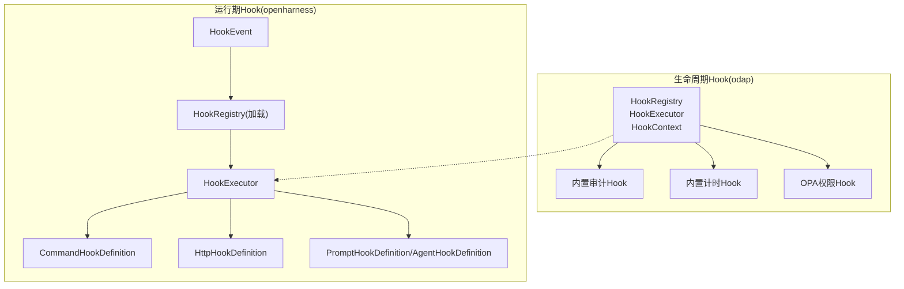
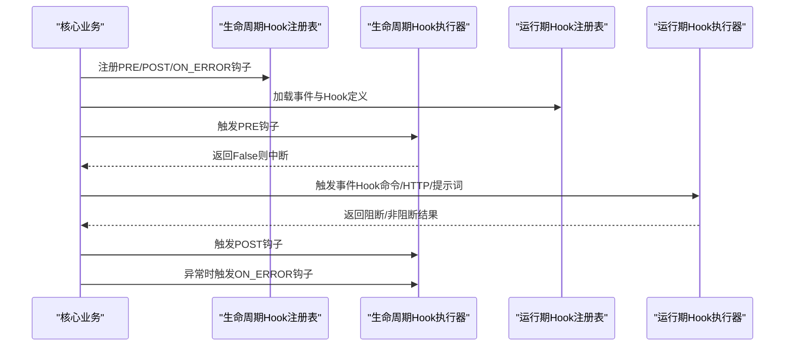
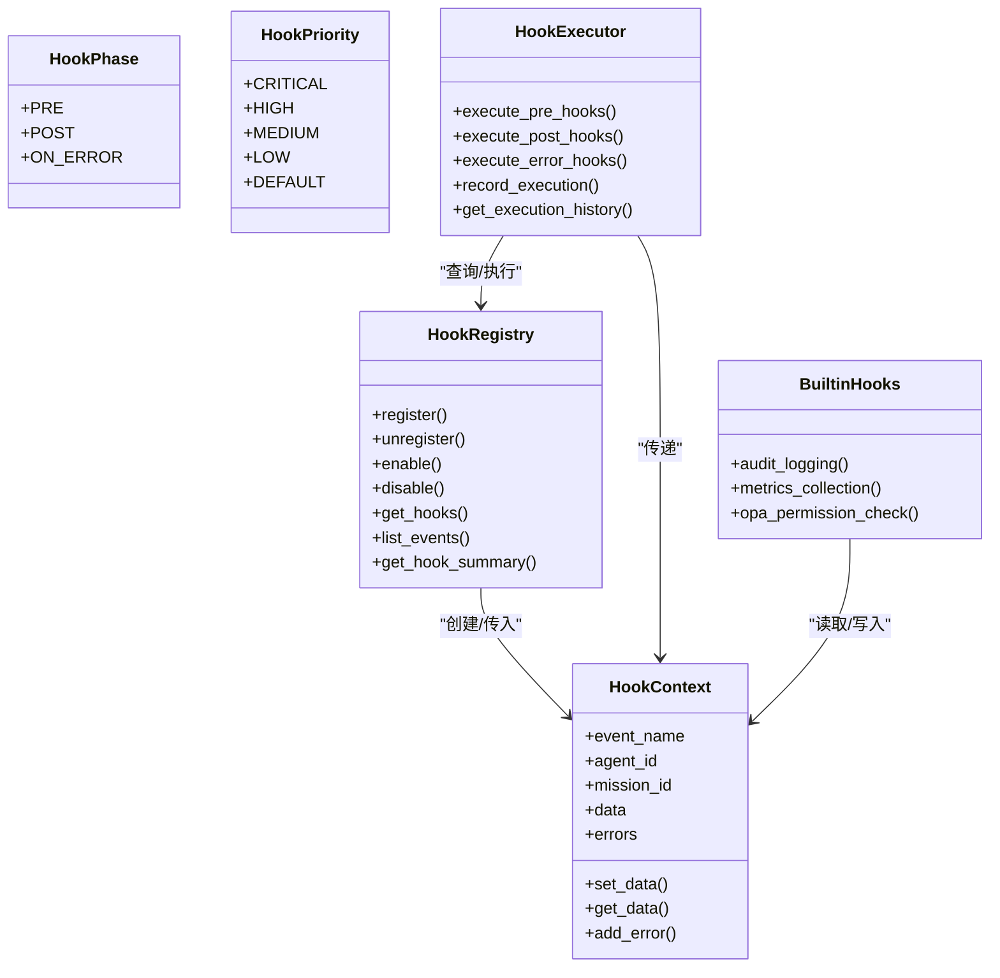
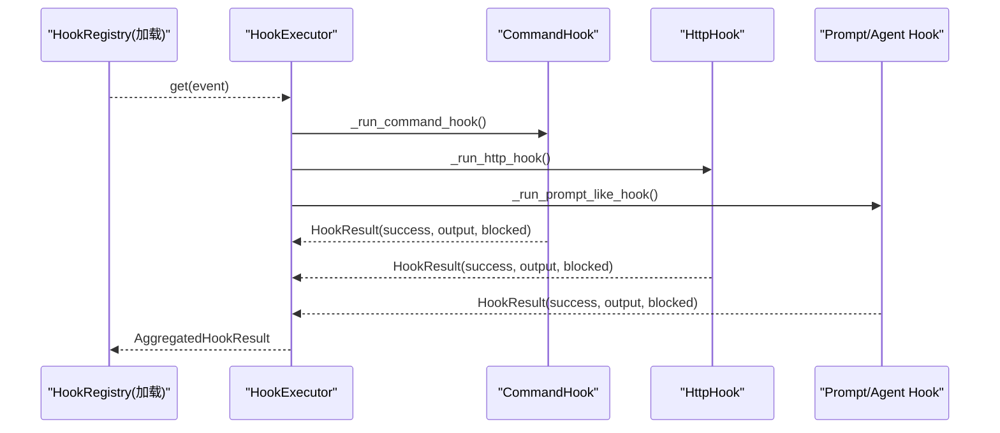
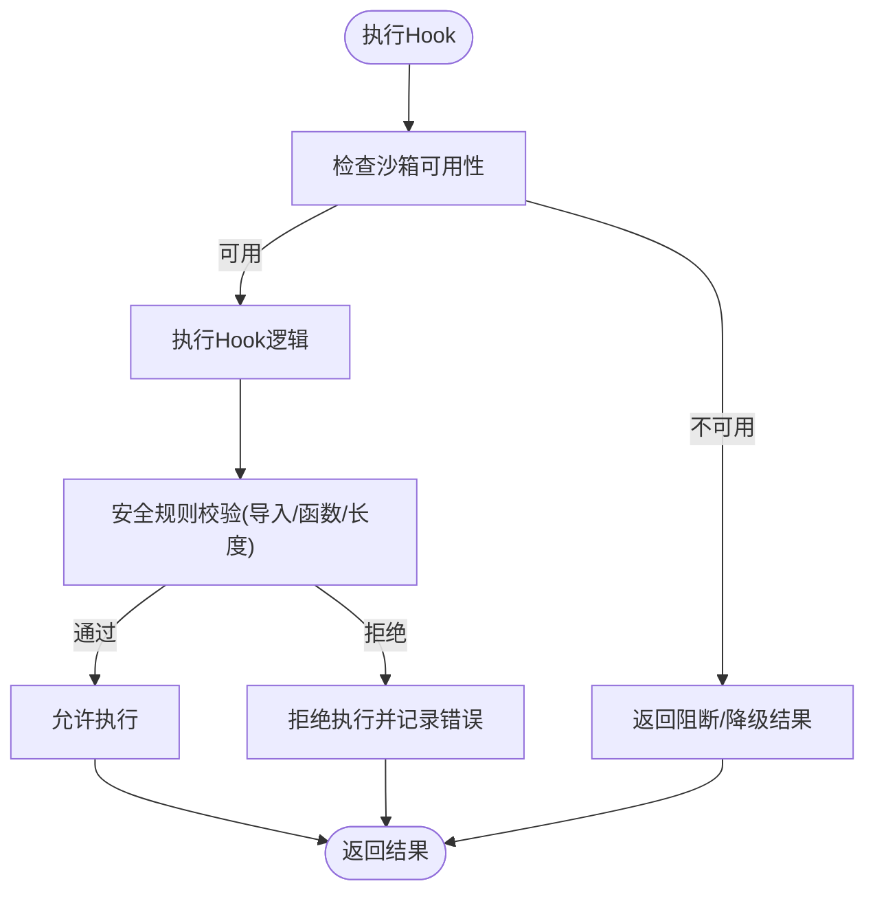
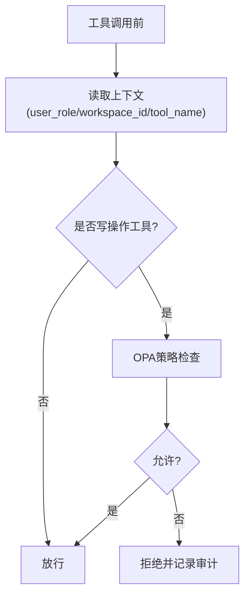
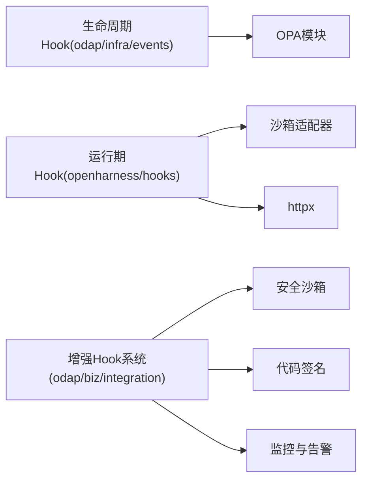

# Hook系统

<cite>
**本文引用的文件**
- [odap/infra/events/hook_system.py](file://odap/infra/events/hook_system.py)
- [openharness/src/openharness/hooks/executor.py](file://openharness/src/openharness/hooks/executor.py)
- [openharness/src/openharness/hooks/events.py](file://openharness/src/openharness/hooks/events.py)
- [openharness/src/openharness/hooks/loader.py](file://openharness/src/openharness/hooks/loader.py)
- [openharness/src/openharness/hooks/schemas.py](file://openharness/src/openharness/hooks/schemas.py)
- [odap/biz/integration/hook_system/models/hook.py](file://odap/biz/integration/hook_system/models/hook.py)
- [odap/biz/integration/hook_system/services/hook_service.py](file://odap/biz/integration/hook_system/services/hook_service.py)
- [odap/biz/integration/hook_system/impl/hook_manager.py](file://odap/biz/integration/hook_system/impl/hook_manager.py)
- [odap/biz/integration/hook_system/impl/sandbox.py](file://odap/biz/integration/hook_system/impl/sandbox.py)
- [odap/infra/openharness/query_guard_hook.py](file://odap/infra/openharness/query_guard_hook.py)
- [tests/unit/test_hook_system.py](file://tests/unit/test_hook_system.py)
- [openharness/tests/test_hooks/test_executor.py](file://openharness/tests/test_hooks/test_executor.py)
- [docs/03-modules/hook_system/DESIGN.md](file://docs/03-modules/hook_system/DESIGN.md)
</cite>

## 目录
1. [简介](#简介)
2. [项目结构](#项目结构)
3. [核心组件](#核心组件)
4. [架构总览](#架构总览)
5. [详细组件分析](#详细组件分析)
6. [依赖分析](#依赖分析)
7. [性能考虑](#性能考虑)
8. [故障排查指南](#故障排查指南)
9. [结论](#结论)
10. [附录](#附录)

## 简介
本文件系统化阐述Hook系统的整体设计与实现，覆盖两类Hook体系：
- 基于生命周期的横切关注点框架（odap/infra/events），面向Agent生命周期事件，提供注册、执行顺序、参数传递、异常处理、内置审计与权限钩子。
- OpenHarness Hook（openharness/src/openharness/hooks），面向运行期事件（如会话、工具调用、消息处理），提供命令、HTTP、提示词驱动的Hook执行与沙箱隔离。

文档重点包括：Hook注册与优先级、执行顺序与阻断机制、参数注入与安全转义、异常与超时处理、沙箱隔离与安全控制、性能监控与告警、开发与调试指南，以及在审计日志、权限验证、数据处理等场景的应用实践。

## 项目结构
Hook系统在仓库中主要分布在两个区域：
- odap/infra/events：生命周期Hook注册与执行器，支持预/后/错误三阶段，内置审计与计时Hook，并提供OPA权限钩子。
- openharness/src/openharness/hooks：运行期事件Hook，支持命令、HTTP、提示词/代理三类Hook定义与执行，具备匹配器、超时、阻断策略与沙箱隔离。

**图表来源**
- [odap/infra/events/hook_system.py:19-428](file://odap/infra/events/hook_system.py#L19-L428)
- [openharness/src/openharness/hooks/events.py:8-21](file://openharness/src/openharness/hooks/events.py#L8-L21)
- [openharness/src/openharness/hooks/loader.py:10-61](file://openharness/src/openharness/hooks/loader.py#L10-L61)
- [openharness/src/openharness/hooks/executor.py:41-243](file://openharness/src/openharness/hooks/executor.py#L41-L243)
- [openharness/src/openharness/hooks/schemas.py:10-59](file://openharness/src/openharness/hooks/schemas.py#L10-L59)

**章节来源**
- [odap/infra/events/hook_system.py:19-428](file://odap/infra/events/hook_system.py#L19-L428)
- [openharness/src/openharness/hooks/executor.py:41-243](file://openharness/src/openharness/hooks/executor.py#L41-L243)
- [openharness/src/openharness/hooks/events.py:8-21](file://openharness/src/openharness/hooks/events.py#L8-L21)
- [openharness/src/openharness/hooks/loader.py:10-61](file://openharness/src/openharness/hooks/loader.py#L10-L61)
- [openharness/src/openharness/hooks/schemas.py:10-59](file://openharness/src/openharness/hooks/schemas.py#L10-L59)

## 核心组件
- 生命周期Hook（odap/infra/events）
  - HookPhase：PRE/POST/ON_ERROR
  - HookPriority：CRITICAL/HIGH/MEDIUM/LOW/DEFAULT
  - HookContext：携带事件名、Agent/任务ID、时间戳、数据字典、错误列表
  - HookRegistry：注册/注销/启用/禁用/查询，按优先级排序
  - HookExecutor：执行Pre/Post/Error钩子，记录执行历史
  - 内置Hook：审计日志、性能计时、OPA权限检查
- 运行期Hook（openharness/hooks）
  - HookEvent：会话、工具调用、消息处理等事件枚举
  - HookRegistry：按事件分组存储Hook定义
  - HookExecutor：执行命令/HTTP/提示词/代理Hook，支持匹配器、超时、阻断
  - Hook定义：Command/Prompt/Http/Agent四类HookSchema

**章节来源**
- [odap/infra/events/hook_system.py:19-428](file://odap/infra/events/hook_system.py#L19-L428)
- [openharness/src/openharness/hooks/events.py:8-21](file://openharness/src/openharness/hooks/events.py#L8-L21)
- [openharness/src/openharness/hooks/loader.py:10-61](file://openharness/src/openharness/hooks/loader.py#L10-L61)
- [openharness/src/openharness/hooks/executor.py:41-243](file://openharness/src/openharness/hooks/executor.py#L41-L243)
- [openharness/src/openharness/hooks/schemas.py:10-59](file://openharness/src/openharness/hooks/schemas.py#L10-L59)

## 架构总览
生命周期Hook与运行期Hook在不同抽象层级协同工作：
- 生命周期Hook负责系统级横切关注点（审计、权限、计时），以事件为中心，强调阶段化与全局开关。
- 运行期Hook负责具体执行路径上的策略注入（如工具调用前的策略校验、外部通知），强调事件匹配、参数注入与沙箱隔离。

**图表来源**
- [odap/infra/events/hook_system.py:171-242](file://odap/infra/events/hook_system.py#L171-L242)
- [openharness/src/openharness/hooks/executor.py:64-78](file://openharness/src/openharness/hooks/executor.py#L64-L78)

## 详细组件分析

### 生命周期Hook（odap/infra/events）
- 注册与优先级
  - 使用优先级数值越小优先级越高；注册后按优先级升序排列。
  - 支持启用/禁用单个Hook，支持全局开关。
- 执行顺序与阻断
  - PRE阶段返回False可中断后续流程；Post/Error阶段仅收集结果与错误。
- 上下文与内置Hook
  - HookContext提供事件名、Agent/任务标识、时间戳、数据与错误列表。
  - 内置审计Hook在任务开始/结束记录上下文；内置计时Hook在OODA阶段统计耗时；OPA权限Hook在关键操作前进行策略校验。
- 执行历史与查询
  - 记录每次Hook执行事件，支持历史查询与上限控制。

**图表来源**
- [odap/infra/events/hook_system.py:19-428](file://odap/infra/events/hook_system.py#L19-L428)

**章节来源**
- [odap/infra/events/hook_system.py:68-169](file://odap/infra/events/hook_system.py#L68-L169)
- [odap/infra/events/hook_system.py:171-258](file://odap/infra/events/hook_system.py#L171-L258)
- [odap/infra/events/hook_system.py:349-428](file://odap/infra/events/hook_system.py#L349-L428)

### 运行期Hook（openharness/hooks）
- 事件与注册
  - HookEvent枚举定义会话、工具调用、消息处理等事件。
  - HookRegistry按事件分组存储Hook定义，支持从配置与插件加载。
- Hook定义与执行
  - CommandHook：执行Shell命令，注入参数，支持阻断失败。
  - HttpHook：向远端POST事件与负载，支持阻断失败。
  - PromptHook/AgentHook：通过模型判断是否允许事件，支持阻断失败。
- 参数注入与安全
  - 支持将payload序列化注入模板；命令Hook默认对JSON进行shell转义，防止注入。
- 超时与阻断
  - 各类Hook均配置超时；失败可阻断当前事件流。
- 上下文与客户端
  - HookExecutionContext包含工作目录、消息流客户端、默认模型，用于提示词/代理Hook与命令Hook的进程执行。

**图表来源**
- [openharness/src/openharness/hooks/executor.py:64-213](file://openharness/src/openharness/hooks/executor.py#L64-L213)
- [openharness/src/openharness/hooks/loader.py:20-37](file://openharness/src/openharness/hooks/loader.py#L20-L37)
- [openharness/src/openharness/hooks/schemas.py:10-59](file://openharness/src/openharness/hooks/schemas.py#L10-L59)

**章节来源**
- [openharness/src/openharness/hooks/events.py:8-21](file://openharness/src/openharness/hooks/events.py#L8-L21)
- [openharness/src/openharness/hooks/loader.py:10-61](file://openharness/src/openharness/hooks/loader.py#L10-L61)
- [openharness/src/openharness/hooks/executor.py:41-243](file://openharness/src/openharness/hooks/executor.py#L41-L243)
- [openharness/src/openharness/hooks/schemas.py:10-59](file://openharness/src/openharness/hooks/schemas.py#L10-L59)

### 沙箱与安全控制
- 运行期Hook的命令执行通过沙箱适配器捕获“沙箱不可用”错误，避免阻断系统。
- 增强Hook系统（odap/biz/integration/hook_system）提供安全沙箱，对代码进行导入/函数/长度等规则校验，拒绝高危模式，支持签名与健康度报告。

**图表来源**
- [openharness/src/openharness/hooks/executor.py:99-136](file://openharness/src/openharness/hooks/executor.py#L99-L136)
- [tests/unit/test_hook_system.py:289-398](file://tests/unit/test_hook_system.py#L289-L398)

**章节来源**
- [openharness/src/openharness/hooks/executor.py:99-136](file://openharness/src/openharness/hooks/executor.py#L99-L136)
- [tests/unit/test_hook_system.py:289-398](file://tests/unit/test_hook_system.py#L289-L398)

### 权限验证与审计日志
- OPA权限钩子：在关键操作前读取上下文中的角色、操作、资源，调用OPA策略判定，拒绝时记录错误并返回拒绝。
- 审计日志钩子：记录事件、Agent/任务ID、时间戳、错误集合、是否出错等，便于合规与追踪。
- 查询服务写操作守卫：针对特定写工具，结合工作空间与角色进行OPA校验，OPA不可用时fail-closed。

**图表来源**
- [odap/infra/openharness/query_guard_hook.py:40-82](file://odap/infra/openharness/query_guard_hook.py#L40-L82)
- [odap/infra/events/hook_system.py:374-395](file://odap/infra/events/hook_system.py#L374-L395)

**章节来源**
- [odap/infra/openharness/query_guard_hook.py:17-175](file://odap/infra/openharness/query_guard_hook.py#L17-L175)
- [odap/infra/events/hook_system.py:353-395](file://odap/infra/events/hook_system.py#L353-L395)

### 自定义Hook实现与开发指南
- 生命周期Hook（odap/infra/events）
  - 使用装饰器注册：自动创建上下文、执行PRE/POST/ON_ERROR钩子，异常时执行ON_ERROR。
  - 推荐：将关键策略封装为独立Hook，设置合理优先级与描述，便于启用/禁用与审计。
- 运行期Hook（openharness/hooks）
  - 定义HookEvent与HookDefinition，通过HookRegistry注册；使用匹配器限定触发范围。
  - 命令Hook注意参数转义，HTTP Hook注意超时与阻断策略，提示词/代理Hook注意输出严格JSON格式。
- 测试建议
  - 单元测试覆盖命令Hook的shell注入保护、提示词Hook的阻断逻辑、沙箱拒绝路径。
  - 集成测试覆盖事件触发、阻断与非阻断分支、错误传播。

**章节来源**
- [odap/infra/events/hook_system.py:260-321](file://odap/infra/events/hook_system.py#L260-L321)
- [openharness/src/openharness/hooks/schemas.py:10-59](file://openharness/src/openharness/hooks/schemas.py#L10-L59)
- [openharness/tests/test_hooks/test_executor.py:33-122](file://openharness/tests/test_hooks/test_executor.py#L33-L122)
- [tests/unit/test_hook_system.py:22-530](file://tests/unit/test_hook_system.py#L22-L530)

## 依赖分析
- 生命周期Hook
  - 依赖：logging、dataclasses、enum、functools、datetime
  - 与OPA模块耦合：内置OPA权限钩子依赖OPAManager
- 运行期Hook
  - 依赖：asyncio、httpx、pydantic、shlex、subprocess
  - 与沙箱适配器耦合：捕获SandboxUnavailableError并降级
- 增强Hook系统
  - 依赖：typing、datetime、pydantic
  - 提供安全沙箱、签名与监控能力

**图表来源**
- [odap/infra/events/hook_system.py:355-371](file://odap/infra/events/hook_system.py#L355-L371)
- [openharness/src/openharness/hooks/executor.py:14-29](file://openharness/src/openharness/hooks/executor.py#L14-L29)
- [tests/unit/test_hook_system.py:8-17](file://tests/unit/test_hook_system.py#L8-L17)

**章节来源**
- [odap/infra/events/hook_system.py:8-16](file://odap/infra/events/hook_system.py#L8-L16)
- [openharness/src/openharness/hooks/executor.py:5-29](file://openharness/src/openharness/hooks/executor.py#L5-L29)
- [tests/unit/test_hook_system.py:8-17](file://tests/unit/test_hook_system.py#L8-L17)

## 性能考虑
- 生命周期Hook
  - 内置计时Hook在OODA阶段统计耗时，便于识别瓶颈。
  - 执行历史上限控制，避免内存膨胀。
- 运行期Hook
  - 命令/HTTP/提示词Hook均配置超时，避免阻塞主流程。
  - 提示词Hook输出严格JSON解析，失败时快速拒绝并记录原因。
- 增强Hook系统
  - 安全沙箱对导入/函数/长度进行限制，降低高风险代码带来的性能与安全风险。
  - 监控模块记录执行次数、成功率、平均/最大/最小延迟、超时次数与最后错误，支持阈值告警。

**章节来源**
- [odap/infra/events/hook_system.py:331-346](file://odap/infra/events/hook_system.py#L331-L346)
- [odap/infra/events/hook_system.py:242-258](file://odap/infra/events/hook_system.py#L242-L258)
- [openharness/src/openharness/hooks/executor.py:108-136](file://openharness/src/openharness/hooks/executor.py#L108-L136)
- [tests/unit/test_hook_system.py:401-530](file://tests/unit/test_hook_system.py#L401-L530)

## 故障排查指南
- 命令Hook注入问题
  - 现象：命令执行结果包含未转义的特殊字符。
  - 处理：确认使用shell_escape对$ARGUMENTS进行转义；参考测试用例验证。
- 提示词/代理Hook阻断
  - 现象：事件被阻断且返回reason。
  - 处理：检查提示词是否返回严格JSON；调整策略或放宽条件。
- 沙箱不可用
  - 现象：命令Hook返回阻断并给出原因。
  - 处理：检查沙箱状态与可用性；必要时降级处理。
- OPA策略拒绝
  - 现象：写操作被拒绝。
  - 处理：检查用户角色、工作空间与工具策略；OPA不可用时fail-closed为预期行为。
- 执行历史与监控
  - 使用执行历史接口查看最近执行记录；结合监控指标定位慢调用与高错误率。

**章节来源**
- [openharness/tests/test_hooks/test_executor.py:76-122](file://openharness/tests/test_hooks/test_executor.py#L76-L122)
- [openharness/src/openharness/hooks/executor.py:99-136](file://openharness/src/openharness/hooks/executor.py#L99-L136)
- [odap/infra/openharness/query_guard_hook.py:58-82](file://odap/infra/openharness/query_guard_hook.py#L58-L82)
- [odap/infra/events/hook_system.py:242-258](file://odap/infra/events/hook_system.py#L242-L258)
- [tests/unit/test_hook_system.py:401-530](file://tests/unit/test_hook_system.py#L401-L530)

## 结论
Hook系统通过生命周期与运行期两条主线，实现了对Agent与平台的细粒度横切控制。生命周期Hook侧重全局策略与可观测性，运行期Hook强调事件级策略注入与安全隔离。两者配合，既能满足审计、权限、计时等横切需求，又能保障在复杂执行路径中的安全性与稳定性。建议在生产环境中：
- 明确Hook优先级与阻断策略，确保关键安全钩子优先执行；
- 对命令Hook严格转义参数，对外部HTTP与提示词Hook设置合理超时；
- 利用沙箱与OPA策略实现fail-closed的安全边界；
- 借助监控与审计日志持续优化Hook性能与稳定性。

## 附录
- Hook事件类型与用途
  - 生命周期事件：任务开始/完成、审计记录、计时统计等。
  - 运行期事件：会话开始/结束、工具调用前/后、消息处理、通知、停止等。
- Hook类型与适用场景
  - 命令Hook：系统运维、外部脚本调用、阻断失败。
  - HTTP Hook：外部通知、上报、阻断失败。
  - 提示词/代理Hook：策略校验、阻断失败。
- 开发最佳实践
  - 为每个Hook提供清晰描述与标签，便于审计与排障；
  - 合理设置超时与阻断策略，避免影响主流程；
  - 对外部依赖（OPA、沙箱）做好降级与容错。

**章节来源**
- [docs/03-modules/hook_system/DESIGN.md:162-216](file://docs/03-modules/hook_system/DESIGN.md#L162-L216)
- [openharness/src/openharness/hooks/events.py:8-21](file://openharness/src/openharness/hooks/events.py#L8-L21)
- [openharness/src/openharness/hooks/schemas.py:10-59](file://openharness/src/openharness/hooks/schemas.py#L10-L59)