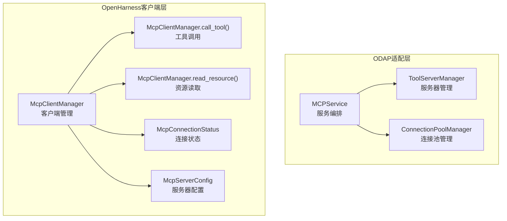
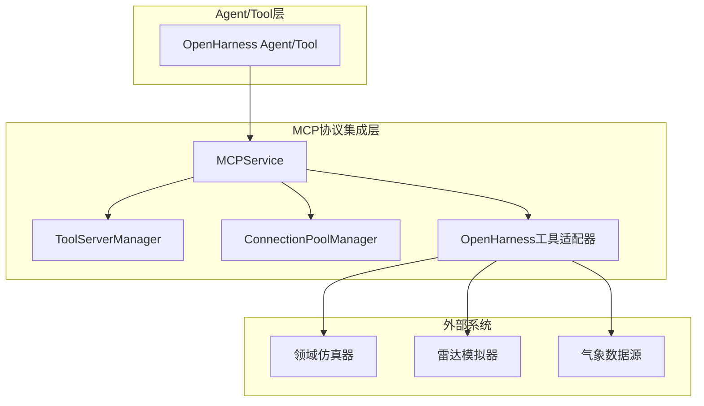
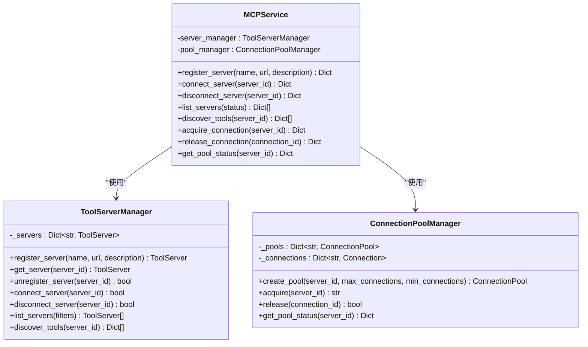
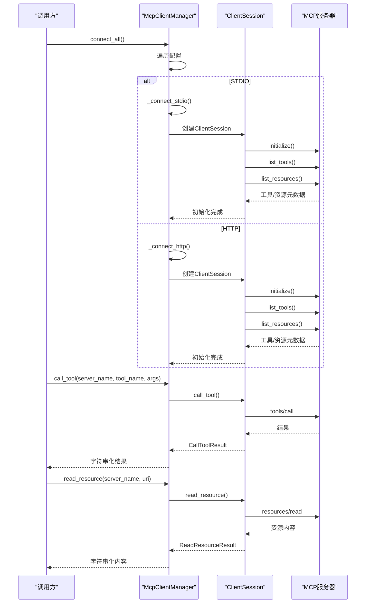
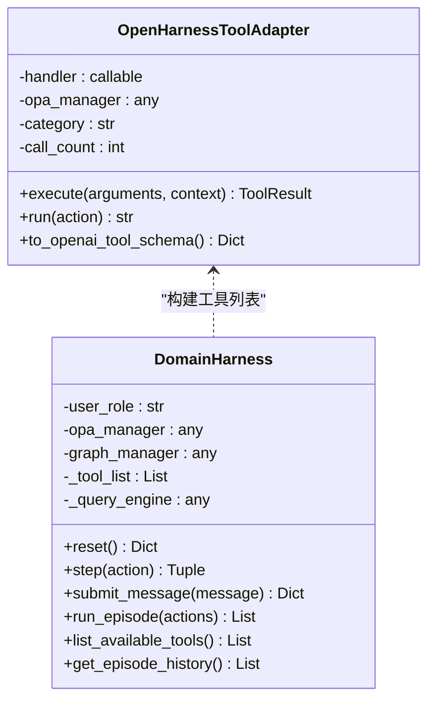
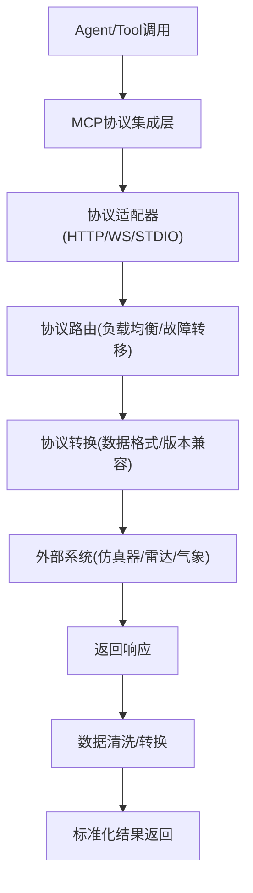
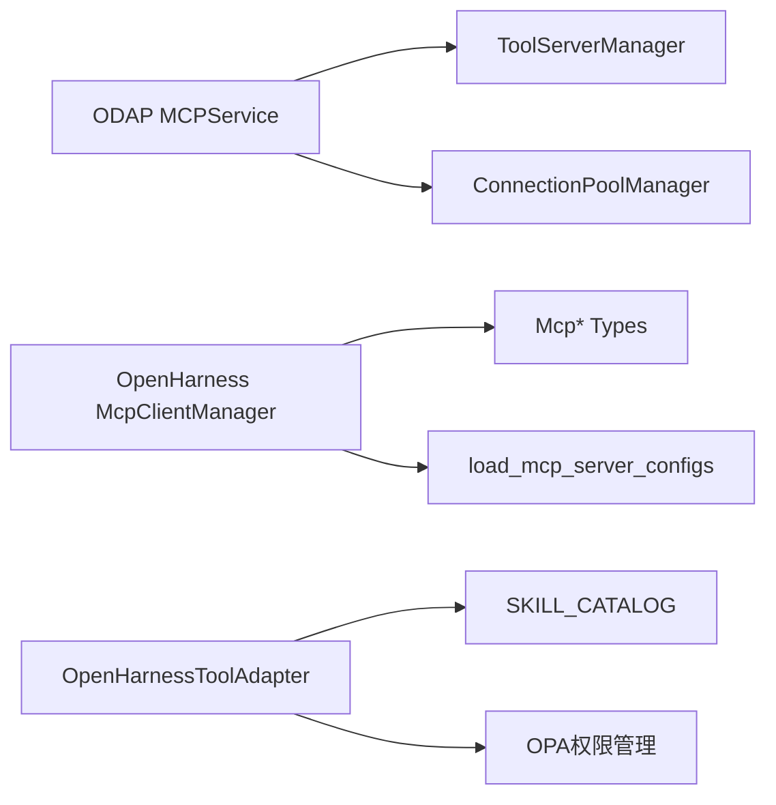
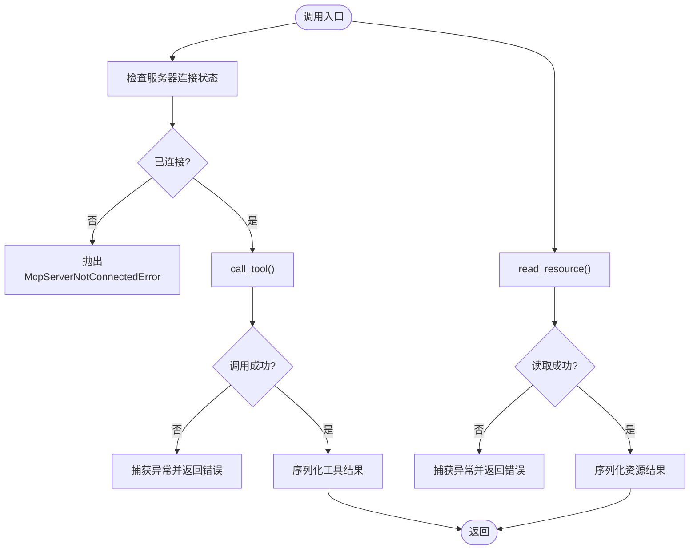

# MCP协议适配器

<cite>
**本文档引用的文件**
- [mcp_service.py](file://odap/biz/integration/mcp_adapter/services/mcp_service.py)
- [server_manager.py](file://odap/biz/integration/mcp_adapter/impl/server_manager.py)
- [connection_pool.py](file://odap/biz/integration/mcp_adapter/impl/connection_pool.py)
- [__init__.py](file://odap/biz/integration/mcp_adapter/__init__.py)
- [client.py](file://openharness/src/openharness/mcp/client.py)
- [types.py](file://openharness/src/openharness/mcp/types.py)
- [config.py](file://openharness/src/openharness/mcp/config.py)
- [__init__.py](file://openharness/src/openharness/mcp/__init__.py)
- [tool_adapter.py](file://odap/infra/openharness/tool_adapter.py)
- [DESIGN.md](file://docs/03-modules/mcp_protocol/DESIGN.md)
- [test_mcp_adapter.py](file://tests/unit/test_mcp_adapter.py)
- [test_integration.py](file://openharness/tests/test_mcp/test_integration.py)
- [fake_mcp_server.py](file://openharness/tests/fixtures/fake_mcp_server.py)
</cite>

## 目录
1. [简介](#简介)
2. [项目结构](#项目结构)
3. [核心组件](#核心组件)
4. [架构总览](#架构总览)
5. [详细组件分析](#详细组件分析)
6. [依赖关系分析](#依赖关系分析)
7. [性能考虑](#性能考虑)
8. [故障排除指南](#故障排除指南)
9. [结论](#结论)
10. [附录](#附录)

## 简介
本文件为MCP（Model Context Protocol）协议适配器的详细技术文档，面向系统集成工程师与平台开发者，全面阐述MCP协议在Graphiti系统中的实现与适配机制。重点涵盖：
- 多方计算协议在系统集成中的作用与价值
- 连接池管理、服务器管理、工具发现与资源访问控制
- MCP客户端实现、消息序列化、错误处理与超时管理策略
- MCP工具开发指南、协议扩展方法与第三方系统集成最佳实践

## 项目结构
MCP协议适配器由两部分组成：
- ODAP侧适配器：提供服务器管理、连接池管理与服务编排
- OpenHarness侧客户端：提供MCP客户端管理、工具与资源发现、会话管理与错误处理

**图表来源**
- [mcp_service.py:1-71](file://odap/biz/integration/mcp_adapter/services/mcp_service.py#L1-L71)
- [server_manager.py:1-81](file://odap/biz/integration/mcp_adapter/impl/server_manager.py#L1-L81)
- [connection_pool.py:1-69](file://odap/biz/integration/mcp_adapter/impl/connection_pool.py#L1-L69)
- [client.py:1-260](file://openharness/src/openharness/mcp/client.py#L1-L260)
- [types.py:1-77](file://openharness/src/openharness/mcp/types.py#L1-L77)

**章节来源**
- [mcp_service.py:1-71](file://odap/biz/integration/mcp_adapter/services/mcp_service.py#L1-L71)
- [server_manager.py:1-81](file://odap/biz/integration/mcp_adapter/impl/server_manager.py#L1-L81)
- [connection_pool.py:1-69](file://odap/biz/integration/mcp_adapter/impl/connection_pool.py#L1-L69)
- [client.py:1-260](file://openharness/src/openharness/mcp/client.py#L1-L260)
- [types.py:1-77](file://openharness/src/openharness/mcp/types.py#L1-L77)

## 核心组件
- ODAP MCPService：统一编排服务器注册、连接、断开、工具发现与连接池获取/释放
- ToolServerManager：管理服务器生命周期与状态，支持按状态过滤与工具发现
- ConnectionPoolManager：管理连接池的创建、连接获取与释放，提供池状态查询
- OpenHarness McpClientManager：管理多MCP服务器连接，支持HTTP/STDIO/WSS传输，提供工具调用与资源读取
- 类型与配置：McpServerConfig/McpConnectionStatus/McpToolInfo/McpResourceInfo等

**章节来源**
- [mcp_service.py:8-71](file://odap/biz/integration/mcp_adapter/services/mcp_service.py#L8-L71)
- [server_manager.py:9-81](file://odap/biz/integration/mcp_adapter/impl/server_manager.py#L9-L81)
- [connection_pool.py:8-69](file://odap/biz/integration/mcp_adapter/impl/connection_pool.py#L8-L69)
- [client.py:29-260](file://openharness/src/openharness/mcp/client.py#L29-L260)
- [types.py:11-77](file://openharness/src/openharness/mcp/types.py#L11-L77)

## 架构总览
MCP协议适配器在系统中的定位与交互如下：

**图表来源**
- [DESIGN.md:25-72](file://docs/03-modules/mcp_protocol/DESIGN.md#L25-L72)
- [mcp_service.py:15-71](file://odap/biz/integration/mcp_adapter/services/mcp_service.py#L15-L71)
- [tool_adapter.py:83-488](file://odap/infra/openharness/tool_adapter.py#L83-L488)

**章节来源**
- [DESIGN.md:1-125](file://docs/03-modules/mcp_protocol/DESIGN.md#L1-L125)

## 详细组件分析

### ODAP MCPService
MCPService作为统一入口，负责：
- 注册服务器并创建对应连接池
- 连接/断开服务器
- 列出服务器并按状态过滤
- 发现工具
- 获取/释放连接并查询连接池状态

**图表来源**
- [mcp_service.py:8-71](file://odap/biz/integration/mcp_adapter/services/mcp_service.py#L8-L71)
- [server_manager.py:9-81](file://odap/biz/integration/mcp_adapter/impl/server_manager.py#L9-L81)
- [connection_pool.py:8-69](file://odap/biz/integration/mcp_adapter/impl/connection_pool.py#L8-L69)

**章节来源**
- [mcp_service.py:15-71](file://odap/biz/integration/mcp_adapter/services/mcp_service.py#L15-L71)
- [server_manager.py:15-81](file://odap/biz/integration/mcp_adapter/impl/server_manager.py#L15-L81)
- [connection_pool.py:15-69](file://odap/biz/integration/mcp_adapter/impl/connection_pool.py#L15-L69)

### OpenHarness McpClientManager
McpClientManager负责：
- 管理多MCP服务器配置与连接状态
- 支持STDIO/HTTP/WSS三种传输方式
- 自动初始化、工具与资源发现
- 工具调用与资源读取的字符串化输出
- 统一的异常处理与状态查询

**图表来源**
- [client.py:45-260](file://openharness/src/openharness/mcp/client.py#L45-L260)

**章节来源**
- [client.py:29-260](file://openharness/src/openharness/mcp/client.py#L29-L260)
- [types.py:11-77](file://openharness/src/openharness/mcp/types.py#L11-L77)
- [config.py:8-17](file://openharness/src/openharness/mcp/config.py#L8-L17)

### OpenHarness工具适配器与领域集成
OpenHarnessToolAdapter将领域技能（SKILL_CATALOG）适配为OpenHarness工具，并提供：
- v1/v2兼容接口
- 异步/同步处理器支持
- 执行计时与错误包装
- OpenAI函数调用schema导出

**图表来源**
- [tool_adapter.py:83-488](file://odap/infra/openharness/tool_adapter.py#L83-L488)

**章节来源**
- [tool_adapter.py:83-488](file://odap/infra/openharness/tool_adapter.py#L83-L488)

### 协议设计与数据流
MCP协议集成模块的设计文档描述了从Agent/Tool到外部系统的完整数据流，包括协议适配、路由、转换与监控层。

**图表来源**
- [DESIGN.md:163-186](file://docs/03-modules/mcp_protocol/DESIGN.md#L163-L186)

**章节来源**
- [DESIGN.md:1-1870](file://docs/03-modules/mcp_protocol/DESIGN.md#L1-L1870)

## 依赖关系分析
- ODAP MCPService依赖ToolServerManager与ConnectionPoolManager
- OpenHarness McpClientManager依赖MCP类型定义与配置加载
- OpenHarness工具适配器依赖ODAP技能目录与OPA权限管理

**图表来源**
- [mcp_service.py:4-5](file://odap/biz/integration/mcp_adapter/services/mcp_service.py#L4-L5)
- [client.py:16-22](file://openharness/src/openharness/mcp/client.py#L16-L22)
- [config.py:8-17](file://openharness/src/openharness/mcp/config.py#L8-L17)
- [tool_adapter.py:296-305](file://odap/infra/openharness/tool_adapter.py#L296-L305)

**章节来源**
- [__init__.py:3-7](file://odap/biz/integration/mcp_adapter/__init__.py#L3-L7)
- [__init__.py:20-32](file://openharness/src/openharness/mcp/__init__.py#L20-L32)

## 性能考虑
- 异步与流式：OpenHarness客户端支持异步HTTP与WebSocket，适合高并发与流式数据
- 连接池：ODAP连接池支持最大/最小连接数配置，减少连接建立开销
- 缓存与预取：设计文档建议数据缓存层（Redis/本地缓存/预取）
- 负载均衡与故障转移：协议路由支持轮询/权重/最少连接与自动切换
- 监控与告警：监控层收集指标、日志与告警规则

**章节来源**
- [DESIGN.md:106-125](file://docs/03-modules/mcp_protocol/DESIGN.md#L106-L125)

## 故障排除指南
常见问题与处理策略：
- 服务器未连接或会话丢失：McpServerNotConnectedError异常，需检查连接状态与重连
- 传输不支持：当前构建不支持的MCP传输类型，需调整配置
- 工具调用失败：捕获异常并返回详细错误信息
- 资源读取失败：捕获异常并返回详细错误信息
- 配置合并冲突：插件与设置的MCP服务器配置需正确合并

**图表来源**
- [client.py:104-154](file://openharness/src/openharness/mcp/client.py#L104-L154)

**章节来源**
- [client.py:25-27](file://openharness/src/openharness/mcp/client.py#L25-L27)
- [client.py:104-154](file://openharness/src/openharness/mcp/client.py#L104-L154)
- [test_integration.py:28-80](file://openharness/tests/test_mcp/test_integration.py#L28-L80)

## 结论
MCP协议适配器通过ODAP与OpenHarness两端协同，实现了对外部系统（仿真器、雷达、气象）的标准化接入。ODAP侧重于服务器与连接池的管理，OpenHarness侧重于客户端会话与工具/资源的统一暴露。该方案具备良好的扩展性、安全性与性能特征，适用于复杂多源数据集成场景。

## 附录

### MCP工具开发指南
- 定义工具输入Schema：确保与McpToolInfo.input_schema一致
- 实现工具处理器：支持同步/异步，返回可序列化结果
- 注册到工具适配器：通过OpenHarnessToolAdapter封装并注册
- 权限与审计：结合OPA策略与审计日志

**章节来源**
- [types.py:47-54](file://openharness/src/openharness/mcp/types.py#L47-L54)
- [tool_adapter.py:83-194](file://odap/infra/openharness/tool_adapter.py#L83-L194)

### 协议扩展方法
- 新增传输类型：在McpClientManager中扩展连接逻辑
- 新增配置项：在McpServerConfig中扩展字段并更新加载逻辑
- 新增路由策略：在协议路由层实现新的负载均衡/故障转移算法

**章节来源**
- [client.py:45-60](file://openharness/src/openharness/mcp/client.py#L45-L60)
- [types.py:37-44](file://openharness/src/openharness/mcp/types.py#L37-L44)

### 第三方系统集成最佳实践
- 使用STDIO/HTTP/WSS三种传输方式，根据场景选择
- 在OpenHarness中通过McpClientManager集中管理连接与状态
- 通过MCP Inspector工具进行协议调试与可视化
- 配置插件化的MCP服务器，支持运行时动态启用/禁用

**章节来源**
- [DESIGN.md:25-72](file://docs/03-modules/mcp_protocol/DESIGN.md#L25-L72)
- [config.py:8-17](file://openharness/src/openharness/mcp/config.py#L8-L17)
- [test_integration.py:35-50](file://openharness/tests/test_mcp/test_integration.py#L35-L50)