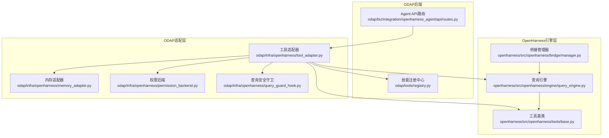
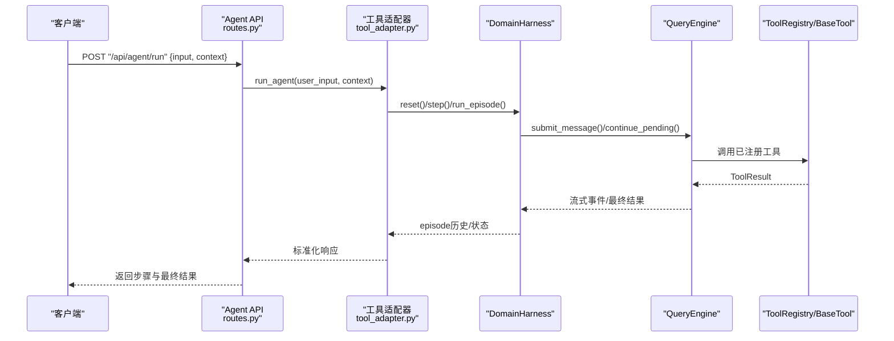
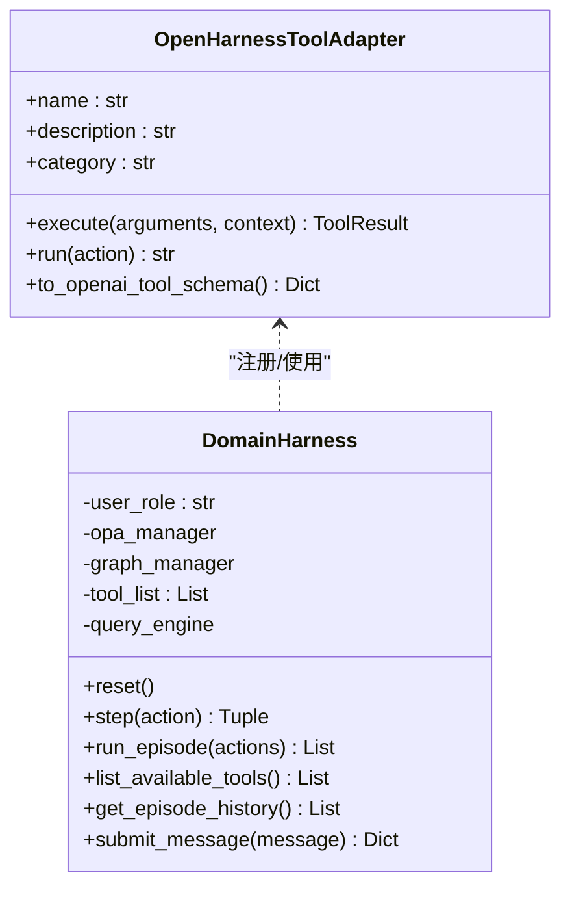
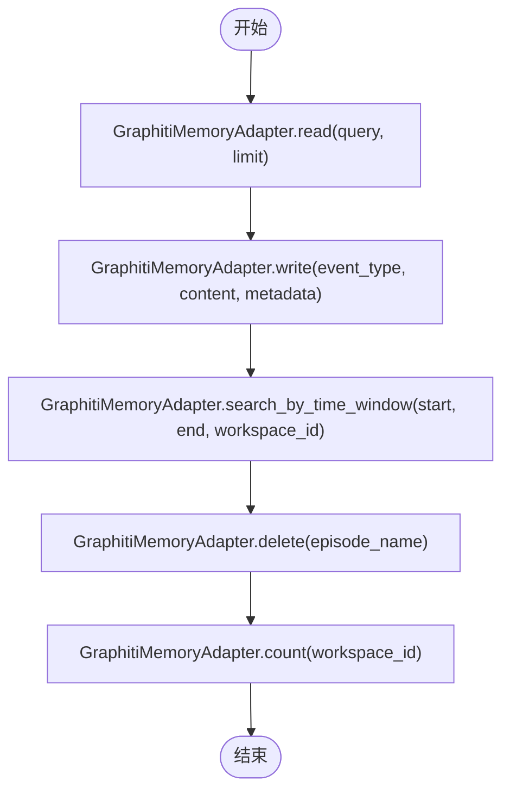
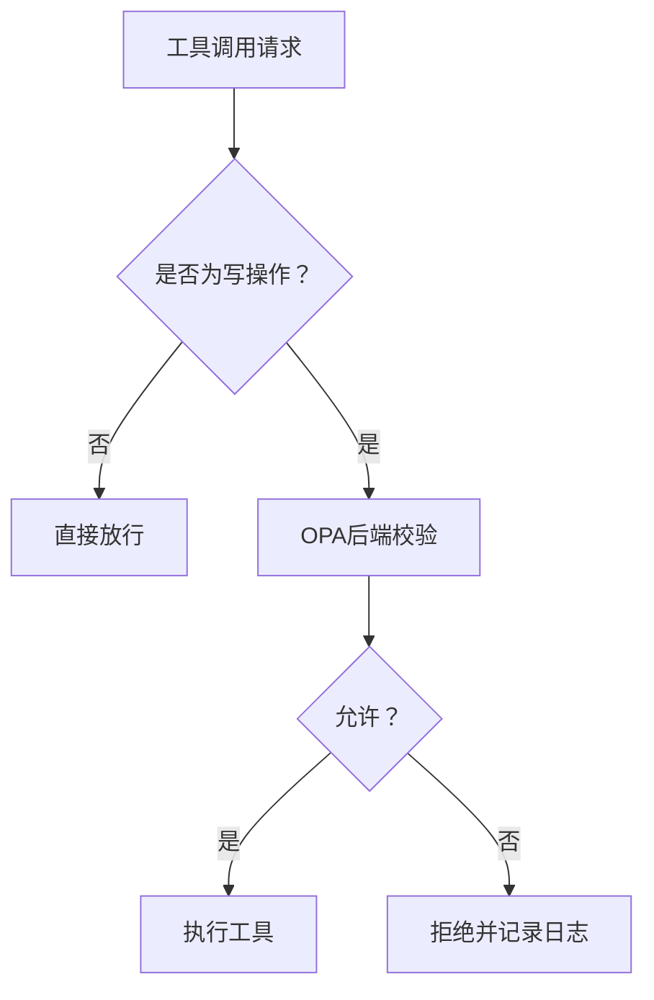
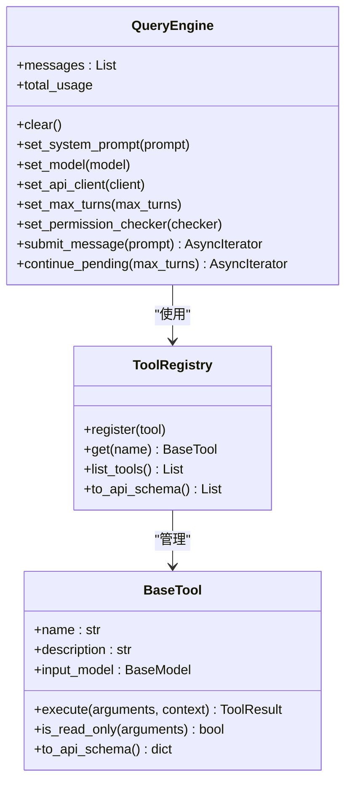
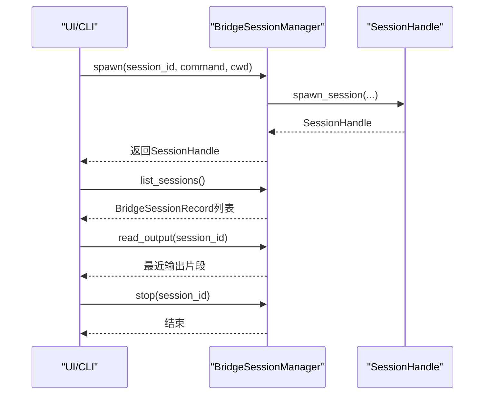
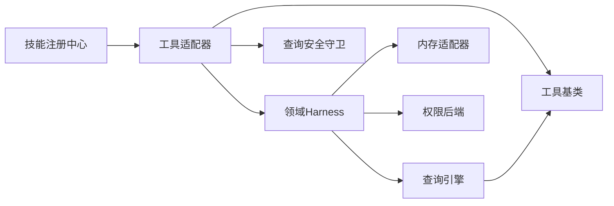

# OpenHarness智能体集成

<cite>
**本文档引用的文件**
- [odap/biz/integration/openharness_agent/api/routes.py](file://odap/biz/integration/openharness_agent/api/routes.py)
- [odap/infra/openharness/tool_adapter.py](file://odap/infra/openharness/tool_adapter.py)
- [odap/infra/openharness/memory_adapter.py](file://odap/infra/openharness/memory_adapter.py)
- [odap/infra/openharness/permission_backend.py](file://odap/infra/openharness/permission_backend.py)
- [odap/infra/openharness/query_guard_hook.py](file://odap/infra/openharness/query_guard_hook.py)
- [odap/tools/registry.py](file://odap/tools/registry.py)
- [openharness/src/openharness/engine/query_engine.py](file://openharness/src/openharness/engine/query_engine.py)
- [openharness/src/openharness/tools/base.py](file://openharness/src/openharness/tools/base.py)
- [openharness/src/openharness/bridge/manager.py](file://openharness/src/openharness/bridge/manager.py)
</cite>

## 目录
1. [简介](#简介)
2. [项目结构](#项目结构)
3. [核心组件](#核心组件)
4. [架构总览](#架构总览)
5. [详细组件分析](#详细组件分析)
6. [依赖分析](#依赖分析)
7. [性能考虑](#性能考虑)
8. [故障排查指南](#故障排查指南)
9. [结论](#结论)
10. [附录](#附录)

## 简介
本文件面向ODAP平台的智能体集成场景，系统性阐述OpenHarness框架在ODAP中的集成原理与实现方式，重点覆盖以下方面：
- 如何将第三方智能体无缝接入ODAP平台
- 智能体生命周期管理、会话协调、权限控制与状态同步机制
- 智能体注册流程、通信协议、错误处理与性能优化策略
- 提供实际的集成示例与最佳实践，帮助开发者快速实现智能体的标准化接入

## 项目结构
OpenHarness集成主要分布在以下区域：
- ODAP后端集成层：负责对外暴露API、编排智能体生命周期、桥接会话与权限
- ODAP适配层：将ODAP内部技能（Skills）适配为OpenHarness工具，并提供内存与权限后端
- OpenHarness引擎层：提供查询引擎、工具抽象、会话桥接等核心能力
- 技能注册中心：维护技能目录与注册表，确保ODAP与OpenHarness工具生态一致

**图表来源**
- [odap/biz/integration/openharness_agent/api/routes.py:1-278](file://odap/biz/integration/openharness_agent/api/routes.py#L1-L278)
- [odap/infra/openharness/tool_adapter.py:1-488](file://odap/infra/openharness/tool_adapter.py#L1-L488)
- [odap/infra/openharness/memory_adapter.py:1-64](file://odap/infra/openharness/memory_adapter.py#L1-L64)
- [odap/infra/openharness/permission_backend.py:1-83](file://odap/infra/openharness/permission_backend.py#L1-L83)
- [odap/infra/openharness/query_guard_hook.py:1-175](file://odap/infra/openharness/query_guard_hook.py#L1-L175)
- [odap/tools/registry.py:1-53](file://odap/tools/registry.py#L1-L53)
- [openharness/src/openharness/engine/query_engine.py:1-214](file://openharness/src/openharness/engine/query_engine.py#L1-L214)
- [openharness/src/openharness/tools/base.py:1-81](file://openharness/src/openharness/tools/base.py#L1-L81)
- [openharness/src/openharness/bridge/manager.py:1-107](file://openharness/src/openharness/bridge/manager.py#L1-L107)

**章节来源**
- [odap/biz/integration/openharness_agent/api/routes.py:1-278](file://odap/biz/integration/openharness_agent/api/routes.py#L1-L278)
- [odap/infra/openharness/tool_adapter.py:1-488](file://odap/infra/openharness/tool_adapter.py#L1-L488)
- [odap/infra/openharness/memory_adapter.py:1-64](file://odap/infra/openharness/memory_adapter.py#L1-L64)
- [odap/infra/openharness/permission_backend.py:1-83](file://odap/infra/openharness/permission_backend.py#L1-L83)
- [odap/infra/openharness/query_guard_hook.py:1-175](file://odap/infra/openharness/query_guard_hook.py#L1-L175)
- [odap/tools/registry.py:1-53](file://odap/tools/registry.py#L1-L53)
- [openharness/src/openharness/engine/query_engine.py:1-214](file://openharness/src/openharness/engine/query_engine.py#L1-L214)
- [openharness/src/openharness/tools/base.py:1-81](file://openharness/src/openharness/tools/base.py#L1-L81)
- [openharness/src/openharness/bridge/manager.py:1-107](file://openharness/src/openharness/bridge/manager.py#L1-L107)

## 核心组件
- 工具适配器（OpenHarnessToolAdapter）：将ODAP技能（Skill）适配为OpenHarness工具，支持v1/v2接口差异，统一输出格式并记录调用统计
- 领域Harness（DomainHarness）：封装工具注册、权限校验、图谱记忆与对话执行，提供reset/step/run_episode等Agent Loop接口
- 内存适配器（GraphitiMemoryAdapter）：将Graphiti双时态图谱作为OpenHarness长期记忆，支持读写与时间窗口检索
- 权限后端（OPAPermissionBackend）：基于OPA策略引擎进行ABAC权限校验，fail-closed保障安全
- 查询安全守卫（QueryServiceWriteGuard）：拦截写操作，结合OPA进行细粒度授权
- 查询引擎（QueryEngine）：承载对话历史、工具感知的模型循环、流式事件与成本追踪
- 工具基类（BaseTool/ToolRegistry）：定义工具抽象与注册表，统一工具schema与执行结果
- 桥接管理器（BridgeSessionManager）：管理子进程会话、输出捕获与生命周期

**章节来源**
- [odap/infra/openharness/tool_adapter.py:83-488](file://odap/infra/openharness/tool_adapter.py#L83-L488)
- [odap/infra/openharness/memory_adapter.py:8-64](file://odap/infra/openharness/memory_adapter.py#L8-L64)
- [odap/infra/openharness/permission_backend.py:7-83](file://odap/infra/openharness/permission_backend.py#L7-L83)
- [odap/infra/openharness/query_guard_hook.py:17-175](file://odap/infra/openharness/query_guard_hook.py#L17-L175)
- [openharness/src/openharness/engine/query_engine.py:19-214](file://openharness/src/openharness/engine/query_engine.py#L19-L214)
- [openharness/src/openharness/tools/base.py:35-81](file://openharness/src/openharness/tools/base.py#L35-L81)
- [openharness/src/openharness/bridge/manager.py:26-107](file://openharness/src/openharness/bridge/manager.py#L26-L107)

## 架构总览
OpenHarness集成采用“ODAP适配层 + OpenHarness引擎层”的双层架构：
- 适配层负责将ODAP内部能力（技能、权限、记忆、会话）与OpenHarness工具/引擎对接
- 引擎层负责执行智能体对话循环、工具调用与流式事件输出
- API层对外提供标准化REST接口，统一会话、状态与工具管理

**图表来源**
- [odap/biz/integration/openharness_agent/api/routes.py:107-127](file://odap/biz/integration/openharness_agent/api/routes.py#L107-L127)
- [odap/infra/openharness/tool_adapter.py:319-394](file://odap/infra/openharness/tool_adapter.py#L319-L394)
- [openharness/src/openharness/engine/query_engine.py:147-214](file://openharness/src/openharness/engine/query_engine.py#L147-L214)
- [openharness/src/openharness/tools/base.py:35-81](file://openharness/src/openharness/tools/base.py#L35-L81)

## 详细组件分析

### 工具适配器与领域Harness
- 适配器职责
  - 将ODAP技能(handler)包装为OpenHarness工具，兼容v1/v2接口
  - 统一工具输入参数（query+params），并规范化输出为ToolResult或JSON字符串
  - 记录调用次数与耗时，便于监控与审计
- DomainHarness职责
  - 构建工具列表（来自SKILL_CATALOG），注入OPA权限与Graphiti记忆
  - 提供reset/step/run_episode接口，支持单步与批量执行
  - v2模式下初始化QueryEngine，绑定工具注册表与权限检查器

**图表来源**
- [odap/infra/openharness/tool_adapter.py:83-488](file://odap/infra/openharness/tool_adapter.py#L83-L488)

**章节来源**
- [odap/infra/openharness/tool_adapter.py:83-488](file://odap/infra/openharness/tool_adapter.py#L83-L488)
- [odap/tools/registry.py:26-53](file://odap/tools/registry.py#L26-L53)

### 内存适配器与会话协调
- GraphitiMemoryAdapter
  - 读取：基于图谱搜索返回内容与分数
  - 写入：将事件以episode形式写入Graphiti，带UTC参考时间
  - 时间窗口查询：支持按时间范围检索历史
  - 删除与计数：删除不支持；计数基于实体查询
- 会话协调
  - API层通过SessionStore加载/保存会话，将用户与助手消息持久化
  - 支持按workspace_id隔离会话，提供会话列表与删除接口

**图表来源**
- [odap/infra/openharness/memory_adapter.py:21-64](file://odap/infra/openharness/memory_adapter.py#L21-L64)

**章节来源**
- [odap/infra/openharness/memory_adapter.py:8-64](file://odap/infra/openharness/memory_adapter.py#L8-L64)
- [odap/biz/integration/openharness_agent/api/routes.py:163-278](file://odap/biz/integration/openharness_agent/api/routes.py#L163-L278)

### 权限控制与安全守卫
- OPAPermissionBackend
  - 将工具名映射到OPA策略键，支持ABAC校验
  - 默认策略fail-closed，异常时拒绝访问
- QueryServiceWriteGuard
  - 识别写工具集合，拦截写操作并调用OPA校验
  - 读工具默认放行，写工具需明确授权
- 工具注册表
  - 提供读/写工具清单与安全级别标注，便于统一管控

**图表来源**
- [odap/infra/openharness/permission_backend.py:40-76](file://odap/infra/openharness/permission_backend.py#L40-L76)
- [odap/infra/openharness/query_guard_hook.py:40-83](file://odap/infra/openharness/query_guard_hook.py#L40-L83)

**章节来源**
- [odap/infra/openharness/permission_backend.py:7-83](file://odap/infra/openharness/permission_backend.py#L7-L83)
- [odap/infra/openharness/query_guard_hook.py:17-175](file://odap/infra/openharness/query_guard_hook.py#L17-L175)

### 查询引擎与工具抽象
- QueryEngine
  - 维护对话历史、最大轮次、成本追踪
  - 支持流式事件输出，结合HookExecutor触发事件
  - 提供submit_message/continue_pending，驱动工具循环
- BaseTool/ToolRegistry
  - 统一工具接口与schema，支持API格式导出
  - 注册工具并提供列表与API schema

**图表来源**
- [openharness/src/openharness/engine/query_engine.py:19-214](file://openharness/src/openharness/engine/query_engine.py#L19-L214)
- [openharness/src/openharness/tools/base.py:35-81](file://openharness/src/openharness/tools/base.py#L35-L81)

**章节来源**
- [openharness/src/openharness/engine/query_engine.py:19-214](file://openharness/src/openharness/engine/query_engine.py#L19-L214)
- [openharness/src/openharness/tools/base.py:35-81](file://openharness/src/openharness/tools/base.py#L35-L81)

### 桥接管理与会话生命周期
- BridgeSessionManager
  - 管理子进程会话，记录命令、工作目录、PID与状态
  - 异步复制stdout到文件，支持读取最近输出
  - 提供停止会话与会话列表查询

**图表来源**
- [openharness/src/openharness/bridge/manager.py:26-107](file://openharness/src/openharness/bridge/manager.py#L26-L107)

**章节来源**
- [openharness/src/openharness/bridge/manager.py:26-107](file://openharness/src/openharness/bridge/manager.py#L26-L107)

## 依赖分析
- 组件耦合
  - DomainHarness依赖工具适配器、OPA权限后端与Graphiti内存适配器
  - 工具适配器依赖ODAP技能注册中心（SKILL_CATALOG）与OpenHarness工具基类
  - QueryEngine依赖工具注册表与权限检查器，支持Hook执行
- 外部依赖
  - OpenHarness v1/v2兼容导入与API客户端
  - OPA策略引擎（OPAManager/OPAManagerV2）
  - Graphiti图谱服务（GraphManager）

**图表来源**
- [odap/tools/registry.py:26-53](file://odap/tools/registry.py#L26-L53)
- [odap/infra/openharness/tool_adapter.py:292-309](file://odap/infra/openharness/tool_adapter.py#L292-L309)
- [openharness/src/openharness/engine/query_engine.py:19-56](file://openharness/src/openharness/engine/query_engine.py#L19-L56)

**章节来源**
- [odap/infra/openharness/tool_adapter.py:292-309](file://odap/infra/openharness/tool_adapter.py#L292-L309)
- [openharness/src/openharness/engine/query_engine.py:19-56](file://openharness/src/openharness/engine/query_engine.py#L19-L56)

## 性能考虑
- 工具调用性能
  - 适配器内记录执行耗时与调用次数，便于监控与优化
  - 对异步handler优先使用协程执行，减少阻塞
- 查询引擎优化
  - 限制最大轮次与上下文窗口，避免过长对话导致资源消耗
  - 成本追踪（CostTracker）用于量化token与调用成本
- 内存与存储
  - Graphiti写入带UTC时间戳，便于后续时间窗口查询与归档
  - 输出文件采用追加写入，避免大输出导致内存压力

[本节为通用指导，无需特定文件来源]

## 故障排查指南
- OpenHarness不可用
  - 现象：导入失败或模拟模式启用
  - 处理：确认openharness包路径与版本，检查环境变量（如API密钥与基础URL）
- 权限拒绝
  - 现象：工具调用被拒绝
  - 处理：检查OPA策略键映射与上下文字段（user_role/workspace_id），确认策略可用
- 写操作被拒
  - 现象：写工具返回拒绝
  - 处理：确认QueryServiceWriteGuard拦截逻辑与OPA策略，必要时降级为只读工具
- 会话输出异常
  - 现象：无法读取或停止会话
  - 处理：检查BridgeSessionManager输出路径与任务状态，确认进程PID与返回码

**章节来源**
- [odap/infra/openharness/tool_adapter.py:38-76](file://odap/infra/openharness/tool_adapter.py#L38-L76)
- [odap/infra/openharness/permission_backend.py:54-68](file://odap/infra/openharness/permission_backend.py#L54-L68)
- [odap/infra/openharness/query_guard_hook.py:58-82](file://odap/infra/openharness/query_guard_hook.py#L58-L82)
- [openharness/src/openharness/bridge/manager.py:79-94](file://openharness/src/openharness/bridge/manager.py#L79-L94)

## 结论
通过ODAP适配层与OpenHarness引擎层的协同，平台实现了对第三方智能体的标准化接入与统一管理。工具适配器、权限后端、内存适配器与查询引擎共同构成了可扩展、可观测、可审计的智能体运行时。结合API层的会话与状态管理，开发者可以快速将现有技能转化为OpenHarness工具，并在安全可控的前提下完成复杂推理与行动。

[本节为总结，无需特定文件来源]

## 附录

### API接口一览（摘要）
- 初始化Agent
  - POST /api/agent/initialize
  - 参数：user_role, provider_config
- 运行Agent
  - POST /api/agent/run
  - 参数：input, context, max_steps
- 获取状态
  - GET /api/agent/status
- 列出工具
  - GET /api/agent/tools
- 聊天交互
  - POST /api/agent/chat
  - 参数：message, session_id, workspace_id, role
- 会话管理
  - GET /api/agent/sessions?workspace_id=default&limit=20
  - DELETE /api/agent/sessions/{session_id}

**章节来源**
- [odap/biz/integration/openharness_agent/api/routes.py:53-278](file://odap/biz/integration/openharness_agent/api/routes.py#L53-L278)