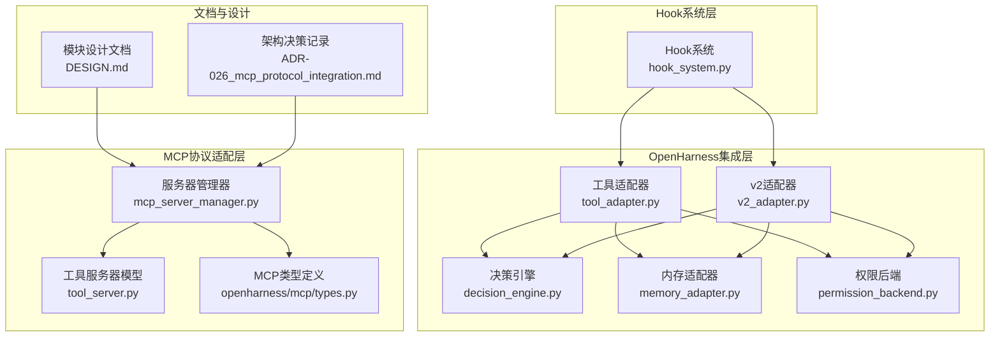
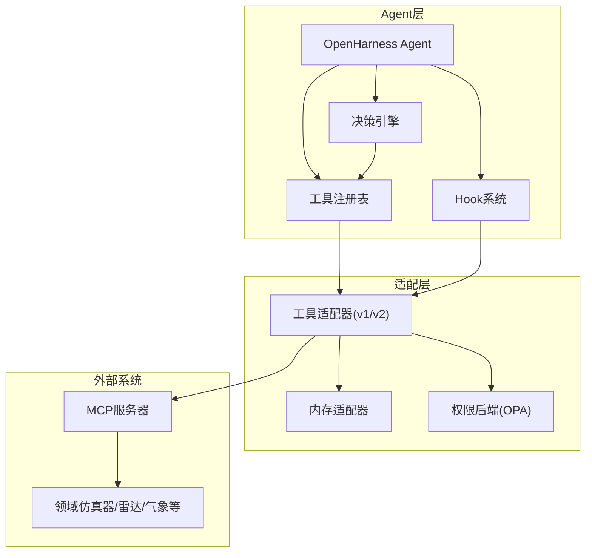
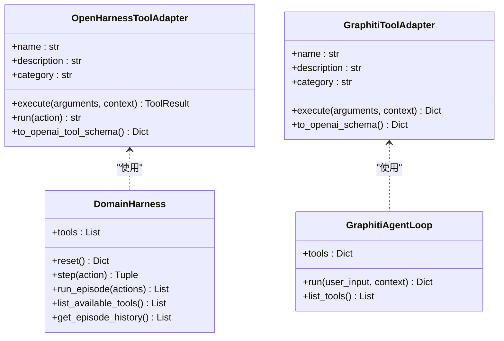
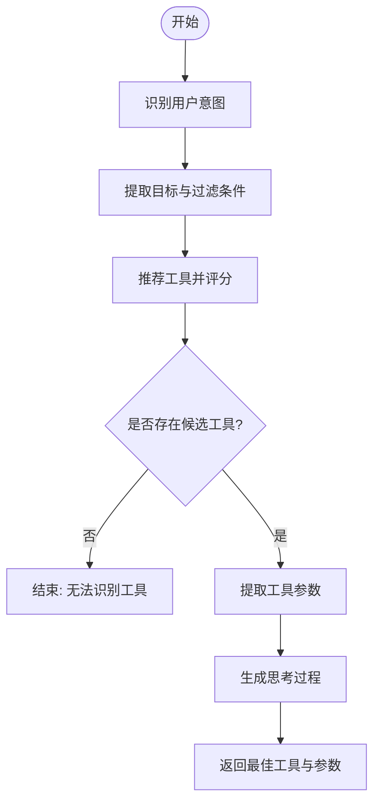
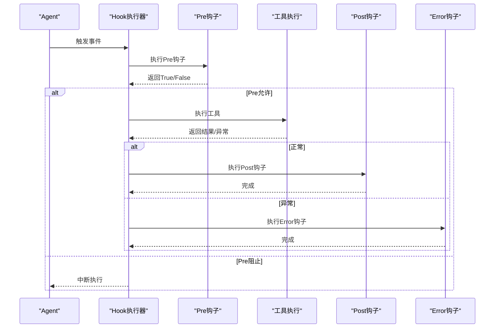
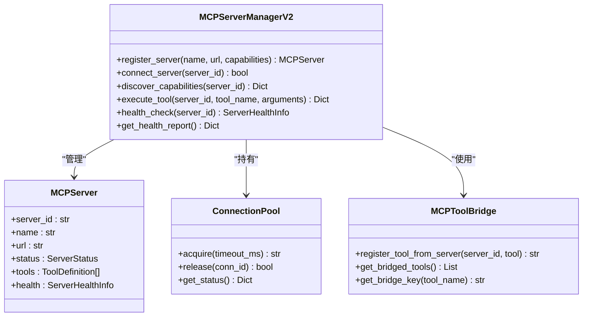
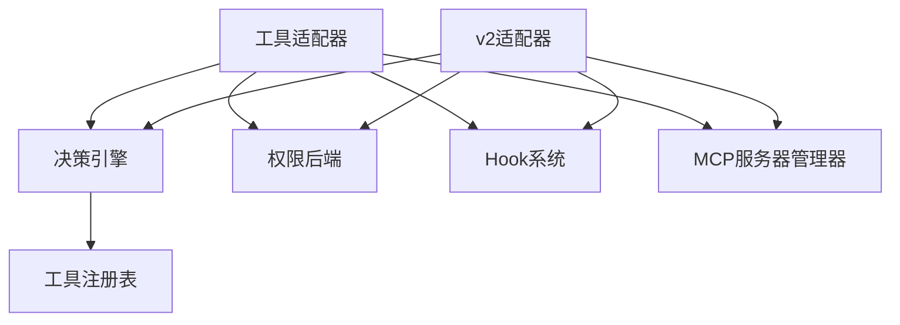

# 集成适配模块

<cite>
**本文档引用的文件**
- [decision_engine.py](file://odap/infra/openharness/decision_engine.py)
- [tool_adapter.py](file://odap/infra/openharness/tool_adapter.py)
- [v2_adapter.py](file://odap/infra/openharness/v2_adapter.py)
- [memory_adapter.py](file://odap/infra/openharness/memory_adapter.py)
- [permission_backend.py](file://odap/infra/openharness/permission_backend.py)
- [hook_system.py](file://odap/infra/events/hook_system.py)
- [mcp_server_manager.py](file://odap/biz/integration/mcp_adapter/mcp_server_manager.py)
- [tool_server.py](file://odap/biz/integration/mcp_adapter/models/tool_server.py)
- [types.py](file://openharness/src/openharness/mcp/types.py)
- [DESIGN.md](file://docs/03-modules/mcp_protocol/DESIGN.md)
- [ADR-026_mcp_protocol_integration.md](file://docs/07-adr/ADR-026_mcp_protocol_integration.md)
</cite>

## 目录
1. [简介](#简介)
2. [项目结构](#项目结构)
3. [核心组件](#核心组件)
4. [架构总览](#架构总览)
5. [详细组件分析](#详细组件分析)
6. [依赖关系分析](#依赖关系分析)
7. [性能考虑](#性能考虑)
8. [故障排查指南](#故障排查指南)
9. [结论](#结论)
10. [附录](#附录)

## 简介
本模块聚焦于OpenHarness智能体集成、MCP协议适配与Hook系统三大关键集成能力，旨在实现第三方智能体的无缝接入、多系统集成的协议标准化以及横切关注点的生命周期管理。通过统一的工具适配层、MCP协议桥接与Hook系统，系统能够以最小侵入的方式扩展Agent能力，同时保证安全性、可观测性与可维护性。

## 项目结构
集成适配模块主要分布在以下层次：
- OpenHarness集成层：工具适配、决策引擎、内存适配、权限后端
- Hook系统层：生命周期钩子、上下文与执行器、内置钩子
- MCP协议适配层：服务器管理、连接池、能力发现与桥接
- 文档与设计：模块设计文档与架构决策记录

**图表来源**
- [tool_adapter.py:1-488](file://odap/infra/openharness/tool_adapter.py#L1-488)
- [v2_adapter.py:1-528](file://odap/infra/openharness/v2_adapter.py#L1-528)
- [decision_engine.py:1-330](file://odap/infra/openharness/decision_engine.py#L1-330)
- [memory_adapter.py:1-64](file://odap/infra/openharness/memory_adapter.py#L1-64)
- [permission_backend.py:1-83](file://odap/infra/openharness/permission_backend.py#L1-83)
- [hook_system.py:1-428](file://odap/infra/events/hook_system.py#L1-428)
- [mcp_server_manager.py:1-663](file://odap/biz/integration/mcp_adapter/mcp_server_manager.py#L1-663)
- [tool_server.py:1-38](file://odap/biz/integration/mcp_adapter/models/tool_server.py#L1-38)
- [types.py:1-55](file://openharness/src/openharness/mcp/types.py#L1-55)
- [DESIGN.md:1-800](file://docs/03-modules/mcp_protocol/DESIGN.md#L1-L800)
- [ADR-026_mcp_protocol_integration.md:1-206](file://docs/07-adr/ADR-026_mcp_protocol_integration.md#L1-L206)

**章节来源**
- [tool_adapter.py:1-488](file://odap/infra/openharness/tool_adapter.py#L1-488)
- [v2_adapter.py:1-528](file://odap/infra/openharness/v2_adapter.py#L1-528)
- [hook_system.py:1-428](file://odap/infra/events/hook_system.py#L1-428)
- [mcp_server_manager.py:1-663](file://odap/biz/integration/mcp_adapter/mcp_server_manager.py#L1-663)

## 核心组件
- OpenHarness工具适配器：将领域技能（SKILL_CATALOG）适配为OpenHarness工具，支持v1/v2接口，并提供统一的执行与结果封装。
- 决策引擎：基于规则与模式匹配的意图识别、工具推荐与参数提取，支撑Agent的智能决策。
- 内存适配器：将双时态图谱作为OpenHarness长期记忆，提供读写与时间窗口查询能力。
- 权限后端：基于OPA的ABAC权限检查，统一拦截与放行策略。
- Hook系统：生命周期钩子注册、执行与监控，支持Pre/Post/Error三阶段与优先级管理。
- MCP协议适配：MCP服务器注册、健康检查、连接池与能力发现，实现多系统标准化接入。

**章节来源**
- [tool_adapter.py:83-194](file://odap/infra/openharness/tool_adapter.py#L83-194)
- [decision_engine.py:25-323](file://odap/infra/openharness/decision_engine.py#L25-323)
- [memory_adapter.py:8-64](file://odap/infra/openharness/memory_adapter.py#L8-64)
- [permission_backend.py:7-83](file://odap/infra/openharness/permission_backend.py#L7-83)
- [hook_system.py:68-428](file://odap/infra/events/hook_system.py#L68-428)
- [mcp_server_manager.py:235-611](file://odap/biz/integration/mcp_adapter/mcp_server_manager.py#L235-611)

## 架构总览
集成适配模块通过“工具适配层 + 决策引擎 + Hook系统 + MCP协议适配”的组合，形成可扩展、可观测、可治理的智能体集成架构。OpenHarness Agent通过工具注册表与Hook系统获得统一的生命周期管理；通过MCP协议桥接第三方系统能力；通过权限后端确保操作合规；通过内存适配器持久化与检索知识。

**图表来源**
- [v2_adapter.py:171-392](file://odap/infra/openharness/v2_adapter.py#L171-392)
- [tool_adapter.py:217-406](file://odap/infra/openharness/tool_adapter.py#L217-406)
- [hook_system.py:171-320](file://odap/infra/events/hook_system.py#L171-320)
- [mcp_server_manager.py:235-480](file://odap/biz/integration/mcp_adapter/mcp_server_manager.py#L235-480)

## 详细组件分析

### OpenHarness工具适配器与DomainHarness
- 适配器职责：将SKILL_CATALOG中的技能封装为OpenHarness工具，兼容v1/v2接口，统一执行结果格式。
- DomainHarness：封装Agent循环，提供reset/step/run_episode等接口，集成OPA权限与图谱管理。
- v2适配器：基于OpenHarness v2的QueryEngine与ToolRegistry，提供更完善的工具执行与观察机制。

**图表来源**
- [tool_adapter.py:83-194](file://odap/infra/openharness/tool_adapter.py#L83-194)
- [tool_adapter.py:217-406](file://odap/infra/openharness/tool_adapter.py#L217-406)
- [v2_adapter.py:90-169](file://odap/infra/openharness/v2_adapter.py#L90-169)
- [v2_adapter.py:171-392](file://odap/infra/openharness/v2_adapter.py#L171-392)

**章节来源**
- [tool_adapter.py:83-406](file://odap/infra/openharness/tool_adapter.py#L83-406)
- [v2_adapter.py:90-392](file://odap/infra/openharness/v2_adapter.py#L90-392)

### 决策引擎（Intent Recognition & Tool Recommendation）
- 意图识别：基于正则模式匹配识别动作类型（查询、分析、创建、更新、删除）。
- 工具推荐：结合意图与目标，计算工具匹配度并排序。
- 参数提取：针对不同工具提取实体类型、区域、数量限制等参数。
- 思考过程：生成可解释的决策说明，便于审计与调试。

**图表来源**
- [decision_engine.py:99-323](file://odap/infra/openharness/decision_engine.py#L99-323)

**章节来源**
- [decision_engine.py:25-323](file://odap/infra/openharness/decision_engine.py#L25-323)

### Hook系统（生命周期管理与横切关注点）
- 阶段与优先级：PRE/POST/ON_ERROR三阶段，支持优先级排序与启用/禁用。
- 注册与执行：注册表集中管理，执行器按阶段顺序执行，支持异步与错误处理。
- 内置钩子：审计日志、性能计时、OPA权限检查等。
- 应用场景：在工具执行前后自动记录审计、统计耗时、强制权限校验。

**图表来源**
- [hook_system.py:178-241](file://odap/infra/events/hook_system.py#L178-241)
- [hook_system.py:260-320](file://odap/infra/events/hook_system.py#L260-320)

**章节来源**
- [hook_system.py:68-428](file://odap/infra/events/hook_system.py#L68-428)

### MCP协议适配（多系统标准化接入）
- 服务器管理：注册/连接/断开、健康检查、自动监控与熔断。
- 能力发现：按能力/工具标签索引，支持动态发现与路由。
- 连接池：线程安全连接池，支持最大/最小连接数与超时控制。
- 桥接器：将外部工具映射为内部统一键，便于工具注册表集成。
- 类型定义：MCP配置与工具信息的Pydantic模型，确保跨组件一致性。

**图表来源**
- [mcp_server_manager.py:235-611](file://odap/biz/integration/mcp_adapter/mcp_server_manager.py#L235-611)
- [tool_server.py:25-38](file://odap/biz/integration/mcp_adapter/models/tool_server.py#L25-38)

**章节来源**
- [mcp_server_manager.py:1-663](file://odap/biz/integration/mcp_adapter/mcp_server_manager.py#L1-663)
- [tool_server.py:1-38](file://odap/biz/integration/mcp_adapter/models/tool_server.py#L1-38)
- [types.py:11-55](file://openharness/src/openharness/mcp/types.py#L11-L55)
- [DESIGN.md:1-800](file://docs/03-modules/mcp_protocol/DESIGN.md#L1-L800)
- [ADR-026_mcp_protocol_integration.md:1-206](file://docs/07-adr/ADR-026_mcp_protocol_integration.md#L1-L206)

## 依赖关系分析
- 工具适配器依赖SKILL_CATALOG与OPA权限后端，确保工具调用具备权限校验。
- 决策引擎依赖工具注册表，提供意图识别与参数提取。
- Hook系统贯穿工具执行前后，提供审计、计时与权限拦截。
- MCP适配器依赖外部MCP服务器，通过连接池与健康检查保障稳定性。
- v2适配器进一步整合OpenHarness v2的QueryEngine与工具注册表，提供更强的执行与观察能力。

**图表来源**
- [tool_adapter.py:292-310](file://odap/infra/openharness/tool_adapter.py#L292-310)
- [v2_adapter.py:216-228](file://odap/infra/openharness/v2_adapter.py#L216-228)
- [hook_system.py:68-132](file://odap/infra/events/hook_system.py#L68-132)
- [mcp_server_manager.py:235-298](file://odap/biz/integration/mcp_adapter/mcp_server_manager.py#L235-298)

**章节来源**
- [tool_adapter.py:292-310](file://odap/infra/openharness/tool_adapter.py#L292-310)
- [v2_adapter.py:216-228](file://odap/infra/openharness/v2_adapter.py#L216-228)
- [hook_system.py:68-132](file://odap/infra/events/hook_system.py#L68-132)
- [mcp_server_manager.py:235-298](file://odap/biz/integration/mcp_adapter/mcp_server_manager.py#L235-298)

## 性能考虑
- 工具执行：统一结果封装与元数据记录，便于性能统计与回溯。
- Hook系统：异步执行与错误隔离，避免阻塞主流程；提供计时钩子辅助性能分析。
- MCP适配：连接池与健康检查降低连接开销与失败率；自动熔断与重试提升稳定性。
- 决策引擎：基于规则与模式匹配，复杂度可控；可通过缓存与索引优化工具匹配。

[本节为通用指导，无需特定文件引用]

## 故障排查指南
- OpenHarness不可用：检查导入路径与版本兼容性，确认v1/v2接口差异。
- 工具执行失败：查看工具返回的错误信息与元数据，结合Hook系统审计日志定位问题。
- 权限拒绝：核对OPA策略映射与用户角色，确认权限后端可用性。
- MCP服务器异常：检查健康检查状态、连接池占用与错误计数，必要时重启或熔断。
- Hook执行异常：查看执行历史与错误记录，确认钩子优先级与启用状态。

**章节来源**
- [tool_adapter.py:412-443](file://odap/infra/openharness/tool_adapter.py#L412-443)
- [permission_backend.py:40-76](file://odap/infra/openharness/permission_backend.py#L40-76)
- [mcp_server_manager.py:481-517](file://odap/biz/integration/mcp_adapter/mcp_server_manager.py#L481-517)
- [hook_system.py:242-257](file://odap/infra/events/hook_system.py#L242-257)

## 结论
集成适配模块通过工具适配、决策引擎、Hook系统与MCP协议适配，构建了统一、可扩展且安全的智能体集成框架。该框架既满足第三方系统接入的标准化需求，又能在Agent生命周期内提供细粒度的横切关注点管理，为复杂业务场景下的多系统协同提供了坚实基础。

[本节为总结性内容，无需特定文件引用]

## 附录
- 最佳实践
  - 工具开发：遵循统一输入/输出约定，提供清晰描述与分类，便于Hook与权限管理。
  - Hook设计：将审计、计时、权限等横切关注点下沉至Hook系统，保持业务代码纯净。
  - MCP集成：实现健康检查与熔断策略，合理配置连接池大小与超时参数。
  - 决策引擎：持续优化意图识别规则与工具匹配算法，提升决策准确性与可解释性。
- 扩展点
  - 自定义适配器：基于OpenHarness工具基类实现新工具，快速接入Agent循环。
  - Hook扩展：注册自定义钩子，拦截Pre/Post/Error阶段，实现业务增强。
  - MCP桥接：新增外部系统MCP Server，通过桥接器映射为内部工具键。

[本节为通用指导，无需特定文件引用]