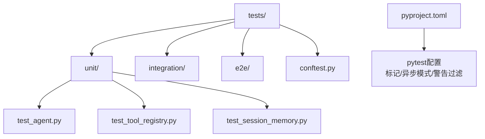
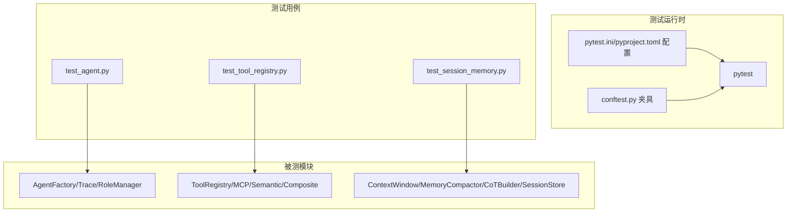
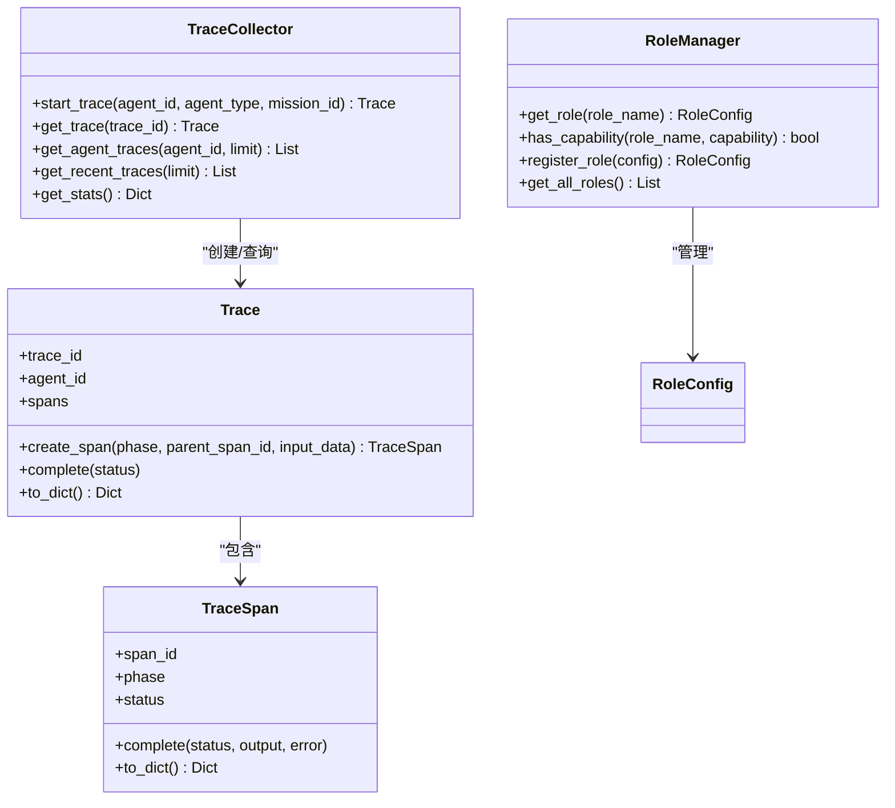
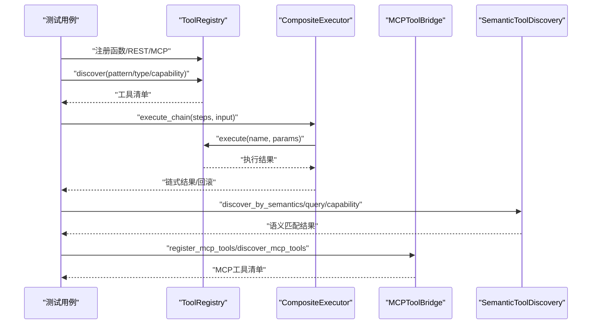
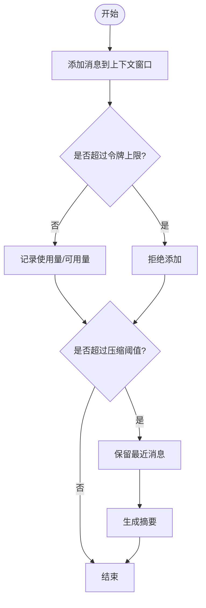
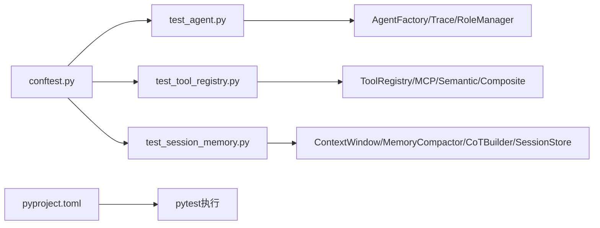

# 单元测试

<cite>
**本文引用的文件**
- [tests/conftest.py](file://tests/conftest.py)
- [pyproject.toml](file://pyproject.toml)
- [odap/biz/core/agent/agent_factory.py](file://odap/biz/core/agent/agent_factory.py)
- [odap/biz/core/cognition/user_cognition_engine.py](file://odap/biz/core/cognition/user_cognition_engine.py)
- [tests/unit/test_agent.py](file://tests/unit/test_agent.py)
- [tests/unit/test_tool_registry.py](file://tests/unit/test_tool_registry.py)
- [tests/unit/test_session_memory.py](file://tests/unit/test_session_memory.py)
</cite>

## 目录
1. [引言](#引言)
2. [项目结构](#项目结构)
3. [核心组件](#核心组件)
4. [架构总览](#架构总览)
5. [详细组件分析](#详细组件分析)
6. [依赖分析](#依赖分析)
7. [性能考量](#性能考量)
8. [故障排查指南](#故障排查指南)
9. [结论](#结论)
10. [附录](#附录)

## 引言
本指南面向ODAP平台开发者，提供一套系统化的单元测试实施方法论与实操建议。内容涵盖测试设计原则、断言策略、Mock技巧、核心模块覆盖范围（本体引擎、Agent系统、工具注册表、会话记忆）、异步函数与错误处理测试、边界条件覆盖、测试数据与夹具复用、环境隔离、执行方式与覆盖率统计、性能优化要点，并给出可直接落地的测试示例路径与最佳实践。

## 项目结构
ODAP平台采用Python后端与前端混合架构，测试位于tests目录，包含单元测试、集成测试与端到端测试。单元测试主要集中在tests/unit，覆盖Agent系统、工具注册表、会话记忆等关键模块；同时通过tests/conftest.py提供通用夹具与Mock支持；pyproject.toml配置了pytest参数、标记与异步模式。

**图示来源**
- [tests/conftest.py:1-52](file://tests/conftest.py#L1-L52)
- [pyproject.toml:1-17](file://pyproject.toml#L1-L17)

**章节来源**
- [tests/conftest.py:1-52](file://tests/conftest.py#L1-L52)
- [pyproject.toml:1-17](file://pyproject.toml#L1-L17)

## 核心组件
- Agent系统：包含Agent生命周期管理、追踪与角色能力体系，核心类包括AgentFactory、Trace/TraceSpan/TraceCollector、RoleManager等。
- 工具注册表：提供函数、REST、MCP等工具注册与发现，支持语义检索、健康监控、复合执行链与工具链编排。
- 会话记忆：围绕上下文窗口、记忆压缩、思维链构建与持久化存储，支撑对话与推理的上下文控制。

**章节来源**
- [odap/biz/core/agent/agent_factory.py:1-442](file://odap/biz/core/agent/agent_factory.py#L1-L442)
- [odap/biz/core/cognition/user_cognition_engine.py:1-800](file://odap/biz/core/cognition/user_cognition_engine.py#L1-L800)
- [tests/unit/test_agent.py:1-229](file://tests/unit/test_agent.py#L1-L229)
- [tests/unit/test_tool_registry.py:1-649](file://tests/unit/test_tool_registry.py#L1-L649)
- [tests/unit/test_session_memory.py:1-181](file://tests/unit/test_session_memory.py#L1-L181)

## 架构总览
单元测试围绕以下原则组织：
- 测试隔离：通过夹具与Mock隔离外部依赖（数据库、网络、第三方服务）。
- 可重复性：使用临时数据库与固定时间戳，确保跨环境一致性。
- 可维护性：集中定义夹具与通用Mock，减少重复代码。
- 可观测性：对关键流程进行断言与统计验证（如追踪统计、健康指标）。

**图示来源**
- [tests/conftest.py:1-52](file://tests/conftest.py#L1-L52)
- [pyproject.toml:1-17](file://pyproject.toml#L1-L17)
- [tests/unit/test_agent.py:1-229](file://tests/unit/test_agent.py#L1-L229)
- [tests/unit/test_tool_registry.py:1-649](file://tests/unit/test_tool_registry.py#L1-L649)
- [tests/unit/test_session_memory.py:1-181](file://tests/unit/test_session_memory.py#L1-L181)

## 详细组件分析

### Agent系统测试
- 关注点
  - 追踪模型：TraceSpan、Trace、TraceCollector的创建、完成、序列化与统计。
  - 角色能力：RoleManager的角色初始化、能力查询、注册自定义角色。
  - 工厂模式：AgentFactory的注册、创建、销毁与追踪接口。
- 断言策略
  - 结构断言：字段存在性与默认值校验。
  - 行为断言：状态转换、时间计算、统计聚合。
  - 边界断言：空输入、不存在对象、并发安全。
- 示例路径
  - [tests/unit/test_agent.py:16-85](file://tests/unit/test_agent.py#L16-L85)（TraceSpan）
  - [tests/unit/test_agent.py:87-133](file://tests/unit/test_agent.py#L87-L133)（Trace）
  - [tests/unit/test_agent.py:135-181](file://tests/unit/test_agent.py#L135-L181)（TraceCollector）
  - [tests/unit/test_agent.py:183-227](file://tests/unit/test_agent.py#L183-L227)（RoleManager）

**图示来源**
- [odap/biz/core/agent/agent_factory.py:86-242](file://odap/biz/core/agent/agent_factory.py#L86-L242)
- [odap/biz/core/agent/agent_factory.py:267-338](file://odap/biz/core/agent/agent_factory.py#L267-L338)
- [tests/unit/test_agent.py:16-227](file://tests/unit/test_agent.py#L16-L227)

**章节来源**
- [tests/unit/test_agent.py:16-227](file://tests/unit/test_agent.py#L16-L227)
- [odap/biz/core/agent/agent_factory.py:86-242](file://odap/biz/core/agent/agent_factory.py#L86-L242)
- [odap/biz/core/agent/agent_factory.py:267-338](file://odap/biz/core/agent/agent_factory.py#L267-L338)

### 工具注册表测试
- 关注点
  - 工具类型与元数据：ToolType、ToolMetadata默认值与字段完整性。
  - 注册与发现：函数、REST、MCP桥接工具的注册与按类型/模式/能力筛选。
  - 执行链与回滚：CompositeExecutor的异步执行、失败回滚与清理。
  - 健康监控：ToolHealthMonitor的调用记录、健康状态与告警。
  - 语义发现：SemanticToolDiscovery与TF-IDF评分。
- 断言策略
  - 正向路径：成功返回、结果正确、计数与时间统计。
  - 错误路径：工具不存在、执行异常、超时与降级。
  - 边界路径：空集合、空字符串、空能力、空标签。
- 示例路径
  - [tests/unit/test_tool_registry.py:100-126](file://tests/unit/test_tool_registry.py#L100-L126)（ToolType）
  - [tests/unit/test_tool_registry.py:128-143](file://tests/unit/test_tool_registry.py#L128-L143)（ToolRegistration）
  - [tests/unit/test_tool_registry.py:145-190](file://tests/unit/test_tool_registry.py#L145-L190)（注册与发现）
  - [tests/unit/test_tool_registry.py:191-224](file://tests/unit/test_tool_registry.py#L191-L224)（执行函数）
  - [tests/unit/test_tool_registry.py:266-313](file://tests/unit/test_tool_registry.py#L266-L313)（MCP桥接）
  - [tests/unit/test_tool_registry.py:315-364](file://tests/unit/test_tool_registry.py#L315-L364)（语义发现）
  - [tests/unit/test_tool_registry.py:366-426](file://tests/unit/test_tool_registry.py#L366-L426)（健康监控）
  - [tests/unit/test_tool_registry.py:428-467](file://tests/unit/test_tool_registry.py#L428-L467)（健康告警）
  - [tests/unit/test_tool_registry.py:511-578](file://tests/unit/test_tool_registry.py#L511-L578)（复合执行链）
  - [tests/unit/test_tool_registry.py:580-622](file://tests/unit/test_tool_registry.py#L580-L622)（工具链）
  - [tests/unit/test_tool_registry.py:624-649](file://tests/unit/test_tool_registry.py#L624-L649)（执行历史与健康报告）

**图示来源**
- [tests/unit/test_tool_registry.py:145-190](file://tests/unit/test_tool_registry.py#L145-L190)
- [tests/unit/test_tool_registry.py:511-578](file://tests/unit/test_tool_registry.py#L511-L578)
- [tests/unit/test_tool_registry.py:315-364](file://tests/unit/test_tool_registry.py#L315-L364)
- [tests/unit/test_tool_registry.py:266-313](file://tests/unit/test_tool_registry.py#L266-L313)

**章节来源**
- [tests/unit/test_tool_registry.py:100-649](file://tests/unit/test_tool_registry.py#L100-L649)

### 会话记忆测试
- 关注点
  - 上下文窗口：消息添加、令牌配额、使用率与清理。
  - 记忆压缩：阈值判断、保留最近消息、生成摘要。
  - 思维链构建：意图节点、实体链接、LLM推理、路径回溯。
  - 会话存储：保存、加载、列表、删除与持久化。
- 断言策略
  - 状态断言：容量限制、使用率阈值、摘要生成。
  - 行为断言：时间度量、父子关系、路径长度。
  - 持久化断言：序列化/反序列化一致性。
- 示例路径
  - [tests/unit/test_session_memory.py:14-70](file://tests/unit/test_session_memory.py#L14-L70)（ContextWindow）
  - [tests/unit/test_session_memory.py:71-100](file://tests/unit/test_session_memory.py#L71-L100)（MemoryCompactor）
  - [tests/unit/test_session_memory.py:102-150](file://tests/unit/test_session_memory.py#L102-L150)（CoTBuilder）
  - [tests/unit/test_session_memory.py:152-181](file://tests/unit/test_session_memory.py#L152-L181)（SessionStore）

**图示来源**
- [tests/unit/test_session_memory.py:34-100](file://tests/unit/test_session_memory.py#L34-L100)

**章节来源**
- [tests/unit/test_session_memory.py:14-181](file://tests/unit/test_session_memory.py#L14-L181)

## 依赖分析
- 测试夹具与Mock
  - tests/conftest.py提供SQLite Mock、临时数据库、工具注册表、技能注册表与审计日志夹具，统一测试环境。
- 配置与标记
  - pyproject.toml启用pytest配置、异步模式、测试标记（unit/integration/slow/e2e）与警告过滤，便于分类执行与CI集成。
- 组件耦合
  - Agent系统内部高内聚，对外通过工厂与追踪接口交互；工具注册表通过桥接与语义模块解耦；会话记忆通过接口与存储模块解耦。

**图示来源**
- [tests/conftest.py:1-52](file://tests/conftest.py#L1-L52)
- [pyproject.toml:1-17](file://pyproject.toml#L1-L17)
- [tests/unit/test_agent.py:1-229](file://tests/unit/test_agent.py#L1-L229)
- [tests/unit/test_tool_registry.py:1-649](file://tests/unit/test_tool_registry.py#L1-L649)
- [tests/unit/test_session_memory.py:1-181](file://tests/unit/test_session_memory.py#L1-L181)

**章节来源**
- [tests/conftest.py:1-52](file://tests/conftest.py#L1-L52)
- [pyproject.toml:1-17](file://pyproject.toml#L1-L17)

## 性能考量
- 异步测试
  - 使用pytest-asyncio自动模式，结合AsyncMock与异步夹具，避免阻塞与超时。
- 资源隔离
  - 临时数据库与Mock外部依赖，降低I/O与网络波动对测试稳定性的影响。
- 断言粒度
  - 将复杂流程拆分为多个小断言，定位问题更快，同时减少单测耗时。
- 并发与锁
  - 对共享状态（如TraceCollector）进行并发断言，确保线程安全。
- 建议
  - 优先使用内存型存储与本地Mock，必要时使用轻量容器或进程隔离。
  - 对热点路径增加基准测试（benchmark），持续监控回归。

[本节为通用指导，无需具体文件来源]

## 故障排查指南
- 常见问题
  - 外部依赖不可用：通过夹具替换为Mock，确保测试稳定。
  - 时间与时区：统一使用UTC时间戳，避免跨时区差异。
  - 并发竞态：对共享状态加锁或使用线程安全的数据结构。
  - 覆盖率不足：针对分支与异常路径补充用例，特别是边界条件。
- 定位方法
  - 使用pytest的详细输出与短回溯，结合断言失败信息快速定位。
  - 对异步流程使用事件循环与异步断言，避免同步等待导致的假失败。
- 建议
  - 在CI中开启覆盖率统计与慢测试告警，定期审查低覆盖模块。

**章节来源**
- [tests/conftest.py:11-52](file://tests/conftest.py#L11-L52)
- [pyproject.toml:1-17](file://pyproject.toml#L1-L17)

## 结论
通过统一的夹具与Mock策略、清晰的断言与边界覆盖、以及对异步与错误路径的专项测试，ODAP平台的单元测试能够有效保障核心模块的稳定性与可维护性。建议持续完善覆盖率、引入基准测试与静态分析，形成从开发到CI的全链路质量保障。

[本节为总结，无需具体文件来源]

## 附录

### 单元测试设计原则与最佳实践
- 设计原则
  - 单一职责：每个测试聚焦一个行为或边界。
  - 可读性：命名清晰、断言明确、前置条件显式。
  - 可重复：使用夹具与Mock，避免随机性。
  - 可维护：抽象公共逻辑，减少重复。
- 断言策略
  - 结构断言：字段存在、类型正确、默认值合理。
  - 行为断言：状态转换、时间度量、统计聚合。
  - 错误断言：异常类型、错误码、错误信息片段。
- Mock技巧
  - 使用unittest.mock与pytest-mock，区分同步与异步Mock。
  - 对外部依赖（数据库、HTTP、文件系统）进行最小化替换。
  - 对并发场景使用线程安全的Mock与锁保护。
- 覆盖范围建议
  - Agent系统：追踪、角色、工厂生命周期。
  - 工具注册表：注册/发现/执行/健康/语义/链式执行。
  - 会话记忆：上下文窗口、压缩、思维链、持久化。
- 异步与错误测试
  - 异步：使用AsyncMock与事件循环，断言协程行为。
  - 错误：断言异常抛出、错误码、降级策略。
- 边界条件
  - 空输入、空集合、空能力、空标签、超长字符串、负数、零值。
- 测试数据与夹具复用
  - 使用pytest fixture与conftest集中管理，提升复用性与一致性。
- 执行方式与覆盖率
  - 使用pytest标记分类执行，结合coverage或pytest-cov统计覆盖率。
  - CI中开启覆盖率阈值与慢测试检测，保证质量门槛。

[本节为通用指导，无需具体文件来源]