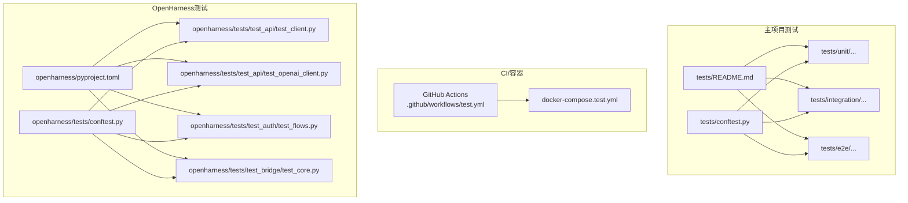
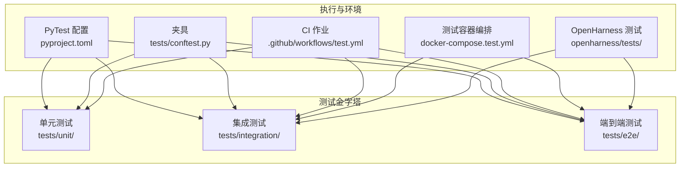
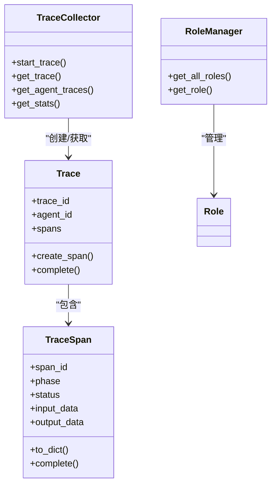
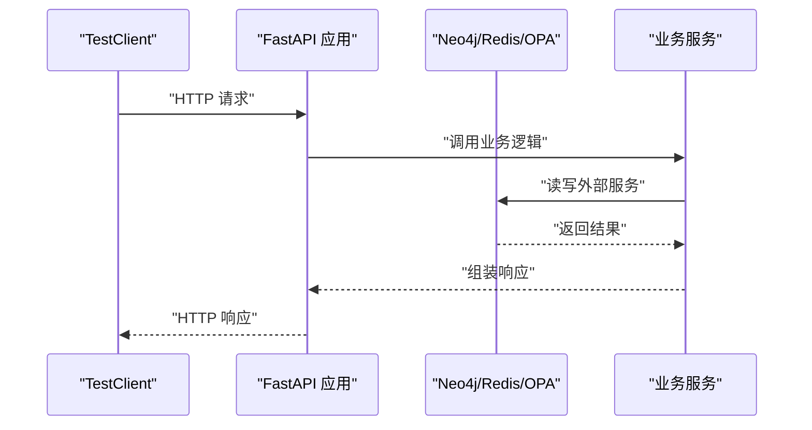
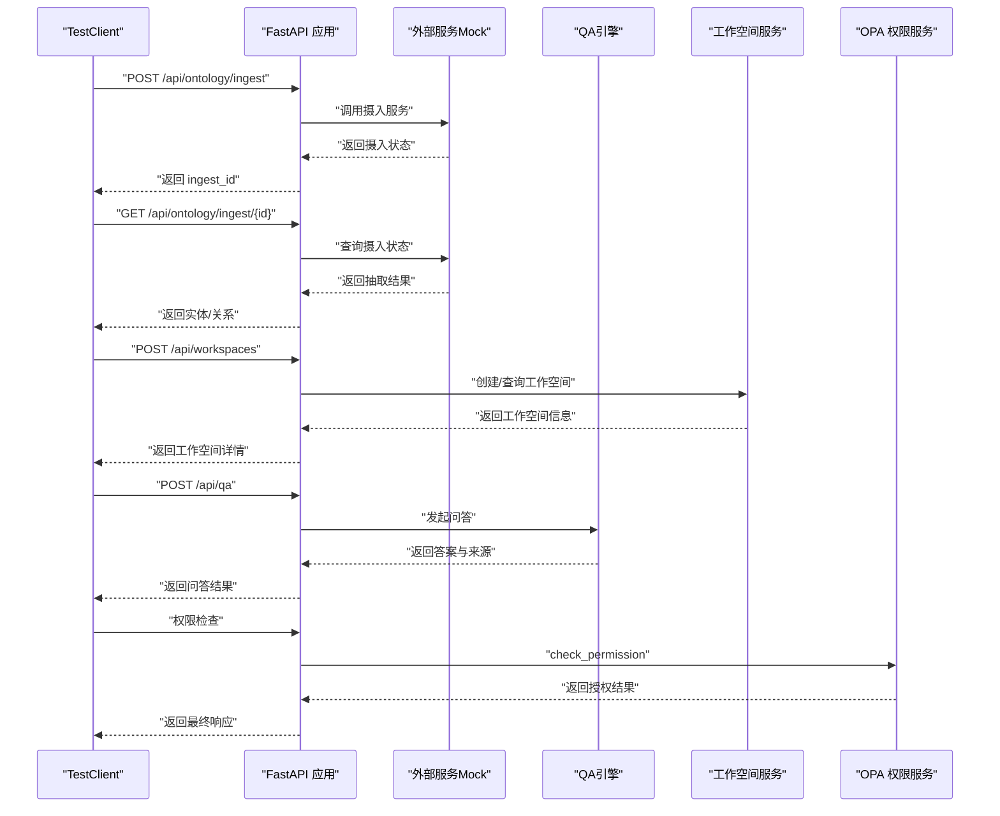
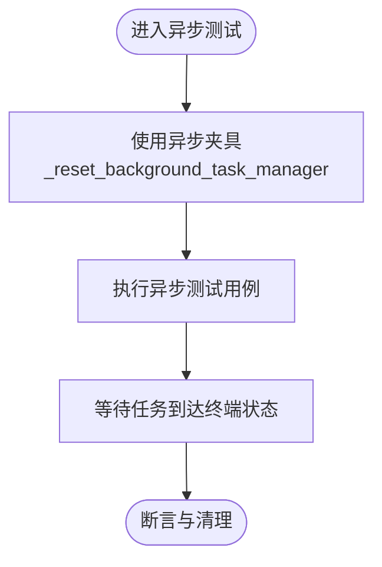
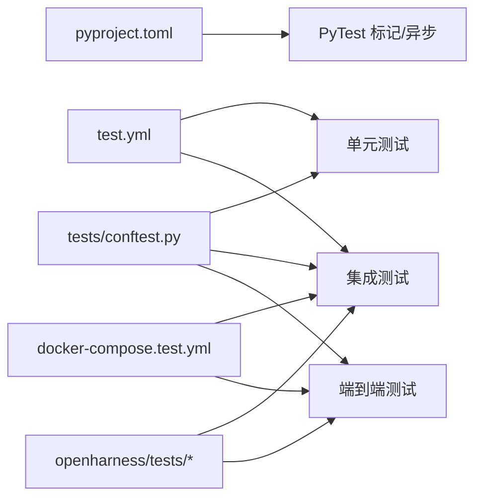

# 测试架构

<cite>
**本文引用的文件**
- [tests/README.md](file://tests/README.md)
- [tests/conftest.py](file://tests/conftest.py)
- [pyproject.toml](file://pyproject.toml)
- [docker/docker-compose.test.yml](file://docker/docker-compose.test.yml)
- [.github/workflows/test.yml](file://.github/workflows/test.yml)
- [tests/unit/test_agent.py](file://tests/unit/test_agent.py)
- [tests/integration/test_api_integration.py](file://tests/integration/test_api_integration.py)
- [tests/e2e/test_e2e_flows.py](file://tests/e2e/test_e2e_flows.py)
- [openharness/tests/conftest.py](file://openharness/tests/conftest.py)
- [openharness/pyproject.toml](file://openharness/pyproject.toml)
- [openharness/tests/test_api/test_client.py](file://openharness/tests/test_api/test_client.py)
- [openharness/tests/test_api/test_openai_client.py](file://openharness/tests/test_api/test_openai_client.py)
- [openharness/tests/test_auth/test_flows.py](file://openharness/tests/test_auth/test_flows.py)
- [openharness/tests/test_bridge/test_core.py](file://openharness/tests/test_bridge/test_core.py)
</cite>

## 目录
1. [引言](#引言)
2. [项目结构](#项目结构)
3. [核心组件](#核心组件)
4. [架构总览](#架构总览)
5. [详细组件分析](#详细组件分析)
6. [依赖分析](#依赖分析)
7. [性能考虑](#性能考虑)
8. [故障排查指南](#故障排查指南)
9. [结论](#结论)
10. [附录](#附录)

## 引言
本文件面向ODAP平台的测试工程师，系统化阐述测试金字塔与三层测试结构（单元测试、集成测试、端到端测试）的职责分工与协作关系；给出PyTest配置、测试标记系统、异步测试支持等关键能力；说明测试环境搭建（测试数据库、Mock服务、测试数据准备）；总结测试组织最佳实践（命名规范、类设计、夹具使用）；解释测试隔离策略、并行执行与覆盖率统计方法，并提供可操作的实施建议。

## 项目结构
ODAP仓库包含两套测试体系：
- 主项目测试：tests/ 下按“单元/集成/端到端”分层组织，配合通用夹具与运行配置
- OpenHarness子项目测试：独立的测试工程，拥有自身的夹具与PyTest配置

下图展示主项目测试目录与关键文件的关系：

**图表来源**
- [tests/README.md:1-134](file://tests/README.md#L1-L134)
- [tests/conftest.py:1-52](file://tests/conftest.py#L1-L52)
- [.github/workflows/test.yml:1-122](file://.github/workflows/test.yml#L1-L122)
- [docker/docker-compose.test.yml:1-99](file://docker/docker-compose.test.yml#L1-L99)
- [openharness/tests/conftest.py:1-36](file://openharness/tests/conftest.py#L1-L36)
- [openharness/pyproject.toml:1-86](file://openharness/pyproject.toml#L1-L86)

**章节来源**
- [tests/README.md:1-134](file://tests/README.md#L1-L134)
- [tests/conftest.py:1-52](file://tests/conftest.py#L1-L52)
- [.github/workflows/test.yml:1-122](file://.github/workflows/test.yml#L1-L122)
- [docker/docker-compose.test.yml:1-99](file://docker/docker-compose.test.yml#L1-L99)
- [openharness/tests/conftest.py:1-36](file://openharness/tests/conftest.py#L1-L36)
- [openharness/pyproject.toml:1-86](file://openharness/pyproject.toml#L1-L86)

## 核心组件
- 测试框架与配置
  - PyTest配置：通过工具配置集中定义测试路径、异步模式、测试标记、输出与警告策略
  - 标记系统：unit/integration/slow/e2e四类标记，便于按需筛选执行
  - 异步支持：自动异步模式，适配协程与异步夹具
- 测试夹具（Fixtures）
  - 主项目：提供SQLite内存连接、临时数据库、工具/技能注册表、审计日志器等通用夹具
  - OpenHarness：提供后台任务管理器重置、等待任务终止等异步夹具
- 测试环境
  - CI：GitHub Actions按层级拆分作业，分别运行单元/集成/覆盖率
  - 容器：Compose测试编排Neo4j、OPA、Redis与测试应用，一键拉起集成环境
- 测试组织
  - tests/README.md定义目录结构、文件命名与位置选择规范
  - OpenHarness独立工程，拥有自身测试路径与PyTest配置

**章节来源**
- [pyproject.toml:1-17](file://pyproject.toml#L1-L17)
- [tests/conftest.py:11-52](file://tests/conftest.py#L11-L52)
- [openharness/tests/conftest.py:12-36](file://openharness/tests/conftest.py#L12-L36)
- [.github/workflows/test.yml:14-122](file://.github/workflows/test.yml#L14-L122)
- [docker/docker-compose.test.yml:6-99](file://docker/docker-compose.test.yml#L6-L99)
- [tests/README.md:103-127](file://tests/README.md#L103-L127)
- [openharness/pyproject.toml:75-86](file://openharness/pyproject.toml#L75-L86)

## 架构总览
下图展示ODAP测试金字塔与执行路径：单元测试优先、集成测试复用外部服务、端到端测试覆盖真实业务闭环；CI按层次拆分，容器编排提供稳定环境；OpenHarness作为独立子项目，具备自洽的测试生态。

**图表来源**
- [pyproject.toml:1-17](file://pyproject.toml#L1-L17)
- [tests/conftest.py:11-52](file://tests/conftest.py#L11-L52)
- [.github/workflows/test.yml:14-122](file://.github/workflows/test.yml#L14-L122)
- [docker/docker-compose.test.yml:6-99](file://docker/docker-compose.test.yml#L6-L99)
- [openharness/tests/conftest.py:12-36](file://openharness/tests/conftest.py#L12-L36)

## 详细组件分析

### 单元测试层
- 职责
  - 验证最小可测试单元（类、函数、模块）的行为与边界条件
  - 快速反馈、高内聚、低耦合，避免外部依赖
- 组织与夹具
  - tests/unit/ 下按模块/功能划分文件
  - 通过 tests/conftest.py 提供通用夹具（如工具/技能注册表、审计日志器），减少重复
- 示例
  - 测试追踪与角色管理：验证Trace/TraceSpan/TraceCollector/RoleManager等对象的构造、状态变更与统计逻辑

**图表来源**
- [tests/unit/test_agent.py:16-200](file://tests/unit/test_agent.py#L16-L200)

**章节来源**
- [tests/unit/test_agent.py:1-229](file://tests/unit/test_agent.py#L1-L229)
- [tests/conftest.py:37-52](file://tests/conftest.py#L37-L52)

### 集成测试层
- 职责
  - 验证模块间接口、API端点、外部服务交互（Neo4j、OPA、Redis等）
  - 在可控环境中模拟真实调用链路
- 组织与环境
  - tests/integration/ 下按功能域划分文件
  - docker-compose.test.yml 提供Neo4j、OPA、Redis与测试应用的服务编排
  - GitHub Actions中独立作业运行集成测试
- 示例
  - API端点集成测试：覆盖工作空间、场景、本体摄入、问答、权限校验等全流程

**图表来源**
- [tests/integration/test_api_integration.py:23-200](file://tests/integration/test_api_integration.py#L23-L200)
- [docker/docker-compose.test.yml:6-99](file://docker/docker-compose.test.yml#L6-L99)

**章节来源**
- [tests/integration/test_api_integration.py:1-736](file://tests/integration/test_api_integration.py#L1-L736)
- [docker/docker-compose.test.yml:1-99](file://docker/docker-compose.test.yml#L1-L99)
- [.github/workflows/test.yml:42-85](file://.github/workflows/test.yml#L42-L85)

### 端到端测试层
- 职责
  - 模拟真实用户场景，从入口到闭环输出，验证跨模块、跨服务的真实业务流
- 组织与隔离
  - tests/e2e/ 下按业务闭环划分文件
  - 通过夹具对外部服务进行Mock，保证测试可重复与可隔离
- 示例
  - 本体摄入到问答的完整闭环：Mock QA引擎、工作空间服务、OPA权限校验等

**图表来源**
- [tests/e2e/test_e2e_flows.py:15-147](file://tests/e2e/test_e2e_flows.py#L15-L147)

**章节来源**
- [tests/e2e/test_e2e_flows.py:1-430](file://tests/e2e/test_e2e_flows.py#L1-L430)

### 测试标记与筛选
- 标记定义
  - unit：单元测试
  - integration：需要外部服务的集成测试
  - slow：慢速测试
  - e2e：端到端测试
- 使用方式
  - 在CI中按标记过滤执行，例如仅运行单元或集成测试
  - 在本地开发中按需选择测试范围

**章节来源**
- [pyproject.toml:4-9](file://pyproject.toml#L4-L9)
- [.github/workflows/test.yml:40](file://.github/workflows/test.yml#L40)
- [.github/workflows/test.yml:84](file://.github/workflows/test.yml#L84)

### 异步测试支持
- 主项目
  - PyTest异步模式自动开启，适合协程与异步夹具
- OpenHarness
  - 使用pytest-asyncio，提供后台任务管理器重置与任务终端状态等待夹具
  - 示例：桥接与认证模块的异步测试

**图表来源**
- [openharness/tests/conftest.py:12-36](file://openharness/tests/conftest.py#L12-L36)
- [openharness/tests/test_bridge/test_core.py:25-62](file://openharness/tests/test_bridge/test_core.py#L25-L62)
- [openharness/tests/test_auth/test_flows.py:55-125](file://openharness/tests/test_auth/test_flows.py#L55-L125)

**章节来源**
- [pyproject.toml:15-17](file://pyproject.toml#L15-L17)
- [openharness/tests/conftest.py:1-36](file://openharness/tests/conftest.py#L1-L36)
- [openharness/pyproject.toml:75-86](file://openharness/pyproject.toml#L75-L86)

### 测试环境搭建
- 测试数据库
  - 主项目：tests/README.md 明确测试数据库存放于tests/data/，并强调独立运行与清理要求
- Mock服务
  - 集成测试与端到端测试通过夹具对第三方服务进行Mock，降低外部依赖风险
- 容器化环境
  - docker-compose.test.yml 提供Neo4j、OPA、Redis与测试应用，一键启动
  - CI中通过GitHub Actions拉起服务后执行对应测试

**章节来源**
- [tests/README.md:72-127](file://tests/README.md#L72-L127)
- [docker/docker-compose.test.yml:6-99](file://docker/docker-compose.test.yml#L6-L99)
- [.github/workflows/test.yml:42-85](file://.github/workflows/test.yml#L42-L85)

### 测试组织最佳实践
- 文件命名与位置
  - 以test_前缀命名，清晰表达功能；简单快速测试置于tests/根目录，复杂依赖测试置于tests/unit/或tests/integration/
- 类设计
  - 每个测试类聚焦单一职责，方法命名体现前置条件与期望结果
- 夹具使用
  - 将公共依赖抽象为夹具，避免重复初始化；注意作用域与生命周期
- 标记与并行
  - 合理使用标记区分层级；慢速测试标注slow，避免默认并行执行

**章节来源**
- [tests/README.md:103-127](file://tests/README.md#L103-L127)
- [tests/conftest.py:11-52](file://tests/conftest.py#L11-L52)

### 测试隔离策略
- 外部依赖隔离
  - 通过夹具替换真实外部服务，确保测试可重复
- 数据隔离
  - 使用临时数据库或内存数据库，测试结束后清理
- 并发隔离
  - 不同测试之间避免共享可变状态；必要时使用进程/线程安全的锁或队列

**章节来源**
- [tests/e2e/test_e2e_flows.py:15-147](file://tests/e2e/test_e2e_flows.py#L15-L147)
- [tests/conftest.py:26-34](file://tests/conftest.py#L26-L34)

### 并行测试执行
- PyTest默认支持并行执行（可通过插件启用），建议：
  - 对慢速测试（slow标记）禁用并行
  - 对纯CPU计算型单元测试适度并行
  - 对依赖共享资源的测试串行执行

**章节来源**
- [pyproject.toml:4-9](file://pyproject.toml#L4-L9)

### 测试覆盖率统计
- CI中通过pytest-cov生成XML与HTML报告，并上传至Codecov
- 建议：
  - 为关键模块设置覆盖率阈值
  - 结合单元/集成测试共同提升整体覆盖率

**章节来源**
- [.github/workflows/test.yml:99-122](file://.github/workflows/test.yml#L99-L122)

## 依赖分析
- 主项目测试依赖
  - PyTest配置与标记驱动执行策略
  - 通用夹具降低重复代码，提升可维护性
  - CI与容器编排保障环境一致性
- OpenHarness测试依赖
  - 独立的PyTest与异步夹具，确保其测试生态自洽
  - 与主项目测试在组织上互补，共同支撑ODAP平台

**图表来源**
- [pyproject.toml:1-17](file://pyproject.toml#L1-L17)
- [tests/conftest.py:11-52](file://tests/conftest.py#L11-L52)
- [.github/workflows/test.yml:14-122](file://.github/workflows/test.yml#L14-L122)
- [docker/docker-compose.test.yml:6-99](file://docker/docker-compose.test.yml#L6-L99)
- [openharness/tests/conftest.py:12-36](file://openharness/tests/conftest.py#L12-L36)

**章节来源**
- [pyproject.toml:1-17](file://pyproject.toml#L1-L17)
- [tests/conftest.py:11-52](file://tests/conftest.py#L11-L52)
- [.github/workflows/test.yml:14-122](file://.github/workflows/test.yml#L14-L122)
- [docker/docker-compose.test.yml:6-99](file://docker/docker-compose.test.yml#L6-L99)
- [openharness/tests/conftest.py:12-36](file://openharness/tests/conftest.py#L12-L36)

## 性能考虑
- 测试执行速度
  - 将慢速测试标记为slow，避免默认并行执行
  - 使用Mock减少网络与IO开销
- 资源占用
  - 容器化测试环境按需启动，测试结束后回收
  - 临时数据库与文件在夹具中自动清理
- 覆盖率与质量
  - 通过覆盖率报告识别薄弱模块，有针对性地补充单元与集成测试

[本节为通用指导，无需列出章节来源]

## 故障排查指南
- 常见问题
  - 外部服务不可用：确认docker-compose.test.yml中的服务健康检查与端口映射
  - 权限/认证失败：检查OPA策略与认证流程的Mock是否正确
  - 异步测试超时：确认异步夹具是否正确等待任务终端状态
- 排查步骤
  - 在本地容器环境中复现问题
  - 使用更详细的日志与断言定位失败点
  - 分离关注点，逐步缩小问题范围

**章节来源**
- [docker/docker-compose.test.yml:23-27](file://docker/docker-compose.test.yml#L23-L27)
- [openharness/tests/conftest.py:18-36](file://openharness/tests/conftest.py#L18-L36)

## 结论
ODAP平台测试架构以PyTest为核心，结合标记系统、异步支持与容器化环境，形成清晰的三层测试金字塔。主项目与OpenHarness各自独立又相互补充，既保证了核心功能的稳定性，也为复杂业务闭环提供了端到端验证能力。建议持续完善覆盖率、优化慢速测试、强化Mock隔离，以进一步提升测试效率与质量。

[本节为总结性内容，无需列出章节来源]

## 附录
- 关键参考文件清单
  - 测试组织与规范：tests/README.md
  - 通用夹具：tests/conftest.py
  - PyTest配置：pyproject.toml
  - CI与容器：.github/workflows/test.yml、docker/docker-compose.test.yml
  - OpenHarness测试生态：openharness/tests/*、openharness/pyproject.toml

[本节为概览性内容，无需列出章节来源]