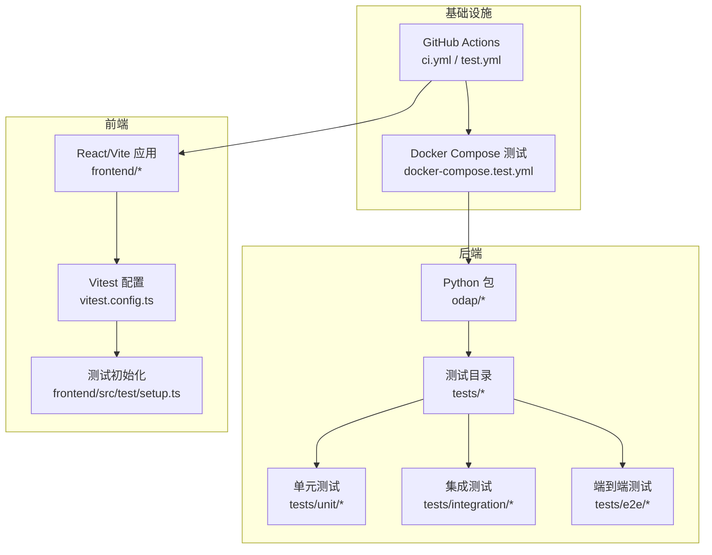
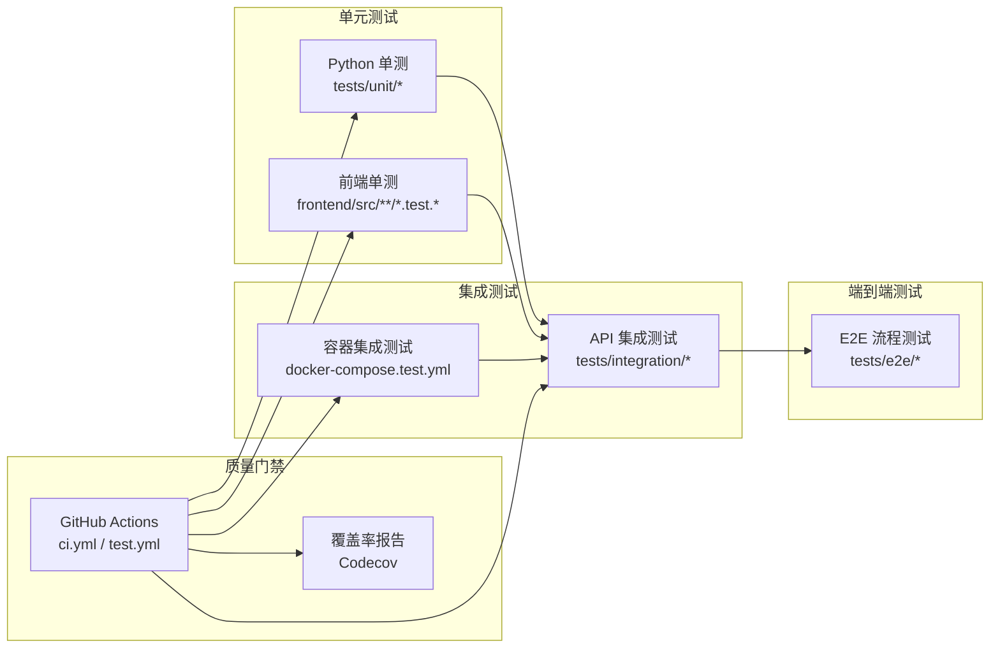
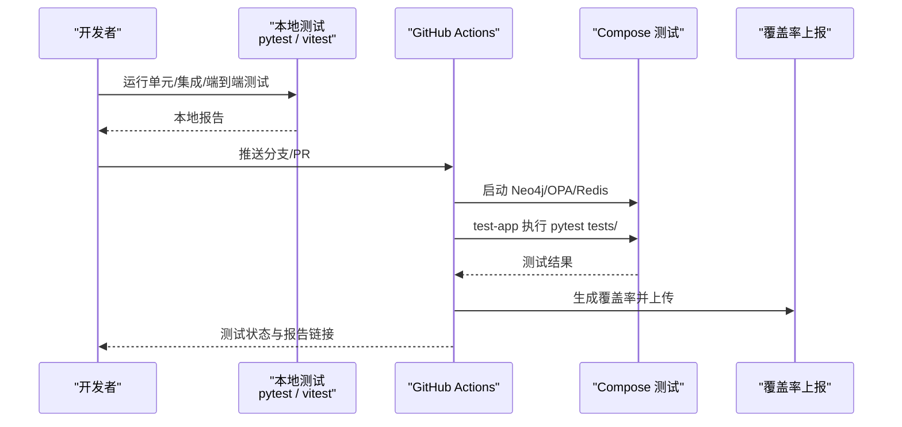

# 测试策略

<cite>
**本文引用的文件**
- [ci.yml](file://.github/workflows/ci.yml)
- [test.yml](file://.github/workflows/test.yml)
- [vitest.config.ts](file://frontend/vitest.config.ts)
- [package.json](file://frontend/package.json)
- [pyproject.toml](file://pyproject.toml)
- [docker-compose.test.yml](file://docker/docker-compose.test.yml)
- [conftest.py](file://tests/conftest.py)
- [setup.ts](file://frontend/src/test/setup.ts)
- [test_ontology_engine.py](file://tests/unit/test_ontology_engine.py)
- [test_api_integration.py](file://tests/integration/test_api_integration.py)
- [test_e2e_flows.py](file://tests/e2e/test_e2e_flows.py)
- [test_agent.py](file://tests/unit/test_agent.py)
- [test_query_guard.py](file://tests/unit/test_query_guard.py)
- [requirements.txt](file://requirements.txt)
</cite>

## 目录
1. [引言](#引言)
2. [项目结构](#项目结构)
3. [核心组件](#核心组件)
4. [架构总览](#架构总览)
5. [详细组件分析](#详细组件分析)
6. [依赖分析](#依赖分析)
7. [性能考虑](#性能考虑)
8. [故障排查指南](#故障排查指南)
9. [结论](#结论)
10. [附录](#附录)

## 引言
本测试策略面向 ODAP 平台，围绕测试金字塔（单元测试、集成测试、端到端测试）设计测试架构与实施策略，覆盖后端 Python 与前端 Vite/Vitest 双栈测试配置，明确测试框架（PyTest、Vitest）、测试数据与 Mock 策略、测试环境与容器编排、持续集成中的测试自动化与覆盖率上报流程，并给出核心功能（本体管理、智能体系统、查询服务等）的测试用例设计指南与质量门禁建议。

## 项目结构
ODAP 仓库包含后端 Python 代码、前端 React/Vite 应用、OpenHarness 子模块、以及 Docker 化测试环境与 GitHub Actions 工作流。测试相关的关键位置如下：
- 后端测试：tests/unit、tests/integration、tests/e2e
- 前端测试：frontend/src/**/*.test.{ts,tsx}，配合 vitest.config.ts
- 测试环境：docker/docker-compose.test.yml
- CI/CD：.github/workflows/ci.yml、.github/workflows/test.yml
- 测试框架配置：pyproject.toml、frontend/package.json、frontend/vitest.config.ts

**图表来源**
- [ci.yml:1-99](file://.github/workflows/ci.yml#L1-L99)
- [test.yml:1-122](file://.github/workflows/test.yml#L1-L122)
- [docker-compose.test.yml:1-99](file://docker/docker-compose.test.yml#L1-L99)
- [vitest.config.ts:1-29](file://frontend/vitest.config.ts#L1-L29)
- [setup.ts:1-32](file://frontend/src/test/setup.ts#L1-L32)

**章节来源**
- [ci.yml:1-99](file://.github/workflows/ci.yml#L1-L99)
- [test.yml:1-122](file://.github/workflows/test.yml#L1-L122)
- [docker-compose.test.yml:1-99](file://docker/docker-compose.test.yml#L1-L99)
- [vitest.config.ts:1-29](file://frontend/vitest.config.ts#L1-L29)
- [setup.ts:1-32](file://frontend/src/test/setup.ts#L1-L32)

## 核心组件
- 测试框架与标记
  - PyTest：通过 pyproject.toml 配置测试路径、异步模式、自定义标记（unit、integration、slow、e2e），并启用短错误回溯。
  - Vitest：前端测试运行器，配置 jsdom 环境、全局 setup 文件、覆盖率输出格式。
- 测试夹具与 Mock
  - tests/conftest.py：提供 SQLite Mock、临时数据库、工具/技能注册表、审计日志器等通用夹具。
  - frontend/src/test/setup.ts：为前端测试注入 fetch、matchMedia、ResizeObserver、全局样式与 API 基础地址等。
- 测试环境与容器
  - docker/docker-compose.test.yml：以服务形式提供 Neo4j、OPA、Redis，后端应用容器作为测试执行器，自动运行 pytest。
  - GitHub Actions：ci.yml 与 test.yml 分别提供后端/前端类型任务与覆盖率上传。

**章节来源**
- [pyproject.toml:1-17](file://pyproject.toml#L1-L17)
- [vitest.config.ts:1-29](file://frontend/vitest.config.ts#L1-L29)
- [conftest.py:1-52](file://tests/conftest.py#L1-L52)
- [setup.ts:1-32](file://frontend/src/test/setup.ts#L1-L32)
- [docker-compose.test.yml:1-99](file://docker/docker-compose.test.yml#L1-L99)
- [ci.yml:1-99](file://.github/workflows/ci.yml#L1-L99)
- [test.yml:1-122](file://.github/workflows/test.yml#L1-L122)

## 架构总览
下图展示测试金字塔在 ODAP 中的落地：单元测试聚焦纯函数与小对象；集成测试通过容器编排连接外部服务；端到端测试覆盖真实用户路径并结合 Mock。

**图表来源**
- [test.yml:1-122](file://.github/workflows/test.yml#L1-L122)
- [docker-compose.test.yml:1-99](file://docker/docker-compose.test.yml#L1-L99)
- [test_api_integration.py:1-736](file://tests/integration/test_api_integration.py#L1-L736)
- [test_e2e_flows.py:1-430](file://tests/e2e/test_e2e_flows.py#L1-L430)

## 详细组件分析

### 测试框架与配置
- PyTest
  - 标记与过滤：通过 markers 定义 unit/integration/slow/e2e，结合命令行 -m 过滤运行。
  - 异步支持：开启 asyncio_mode，适配 FastAPI/异步服务。
  - 覆盖率：CI 中使用 pytest-cov 输出 xml/html，供 Codecov 上报。
- Vitest
  - 环境：jsdom，便于 DOM/React 组件测试。
  - 覆盖率：v8 provider，输出 text/json/html。
  - 全局初始化：setup.ts 注入 polyfill 与 API 基础地址，避免运行时差异。

**章节来源**
- [pyproject.toml:1-17](file://pyproject.toml#L1-L17)
- [vitest.config.ts:1-29](file://frontend/vitest.config.ts#L1-L29)
- [setup.ts:1-32](file://frontend/src/test/setup.ts#L1-L32)

### 测试数据管理与 Mock 策略
- 后端
  - SQLite Mock：通过 MagicMock 模拟连接/游标，避免真实数据库副作用。
  - 临时数据库：使用 tmp_path 生成临时 SQLite 文件，断言事务与行工厂。
  - 服务级 Mock：在 E2E 测试中对 ingest、workspace、QA 引擎、OPA 管理器进行 Patch，隔离外部依赖。
- 前端
  - fetch 拦截：vi.fn 替代全局 fetch，便于断言网络调用。
  - 全局 polyfill：matchMedia、ResizeObserver、scrollIntoView，保证组件渲染稳定性。
  - 配置 Mock：对 API 基础地址进行模块级替换，确保测试环境一致性。

**章节来源**
- [conftest.py:1-52](file://tests/conftest.py#L1-L52)
- [setup.ts:1-32](file://frontend/src/test/setup.ts#L1-L32)
- [test_e2e_flows.py:15-147](file://tests/e2e/test_e2e_flows.py#L15-L147)

### 测试环境与容器编排
- docker-compose.test.yml
  - 提供 Neo4j（图数据库）、OPA（策略服务）、Redis（缓存）三类外部依赖。
  - test-app 服务以 pytest 作为命令入口，自动执行 tests/ 下所有测试。
  - 健康检查保障依赖可用性，网络隔离 odap-test-network。
- GitHub Actions
  - test.yml：分别运行 unit/integration/docker-tests 三类作业，最后汇总覆盖率并上传至 Codecov。
  - ci.yml：后端/前端并行作业，后端包含 MongoDB/Neo4j，前端执行类型检查、Linter、单元测试。

**章节来源**
- [docker-compose.test.yml:1-99](file://docker/docker-compose.test.yml#L1-L99)
- [test.yml:1-122](file://.github/workflows/test.yml#L1-L122)
- [ci.yml:1-99](file://.github/workflows/ci.yml#L1-L99)

### 核心功能测试用例设计指南

#### 本体管理引擎
- 关注点
  - 数据转换：JSON/CSV 输入、质量校验、统计指标。
  - QA 驱动构建：问题处理、进度查询、意图分析。
  - 构建服务：实体/关系抽取、变化检测。
  - API 版本控制：版本信息、兼容性检查、变更日志。
- 测试要点
  - 使用 AsyncMock 验证异步流程；使用 Pydantic 模型构造输入，断言输出结构。
  - 对转换统计与质量校验进行边界值与异常路径覆盖。
  - 通过 Patch 模拟外部 LLM/存储，确保测试稳定。

**章节来源**
- [test_ontology_engine.py:1-219](file://tests/unit/test_ontology_engine.py#L1-L219)

#### 智能体系统
- 关注点
  - 追踪与统计：TraceSpan/Trace/TraceCollector 的生命周期与统计。
  - 角色能力：RoleManager 的默认角色、能力判定、自定义角色注册。
- 测试要点
  - 断言状态机转换、时间戳与耗时计算、按 Agent 类型的统计聚合。
  - 能力矩阵覆盖正反例，确保权限与能力一致。

**章节来源**
- [test_agent.py:1-229](file://tests/unit/test_agent.py#L1-L229)

#### 查询服务与架构守卫
- 关注点
  - Query First 原则：Agent/Cognition 模块禁止直接导入 GraphManager，必须经由 QueryService。
  - 写操作守卫：QueryServiceWriteGuard 限制写工具集，防止越权写入。
- 测试要点
  - 使用 AST/glob 检查导入模式，排除白名单文件。
  - 确认 QueryService 与各数据源实现存在性与接口完整性。

**章节来源**
- [test_query_guard.py:1-107](file://tests/unit/test_query_guard.py#L1-L107)

#### API 集成测试（本体、问答、工作空间、事件模拟器、技能、代理、角色、策略）
- 关注点
  - 完整数据摄入流程：文本/JSON/自然语言/手动录入 → 构建本体 → 查询验证 → 问答。
  - 错误处理与边界条件：空载荷、畸形 JSON、缺失字段、大请求、无效场景 ID。
  - 健康检查与性能指标：/health、/api/v1/monitoring/performance。
- 测试要点
  - 使用 FastAPI TestClient 发起请求，断言状态码与响应结构。
  - 对每个模块的 CRUD 与业务流程进行正向与负向覆盖。

**章节来源**
- [test_api_integration.py:1-736](file://tests/integration/test_api_integration.py#L1-L736)

#### 端到端测试（E2E）
- 关注点
  - 数据摄入到本体构建 → 问答会话 → 工作空间隔离与切换 → 策略创建与权限强制。
- 测试要点
  - 通过 autouse fixture 对外部服务进行 Patch，确保跨模块交互可重复。
  - 断言会话生命周期、历史记录、权限策略生效。

**章节来源**
- [test_e2e_flows.py:1-430](file://tests/e2e/test_e2e_flows.py#L1-L430)

### 测试流程与质量门禁

**图表来源**
- [test.yml:1-122](file://.github/workflows/test.yml#L1-L122)
- [docker-compose.test.yml:1-99](file://docker/docker-compose.test.yml#L1-L99)

**章节来源**
- [test.yml:1-122](file://.github/workflows/test.yml#L1-L122)
- [docker-compose.test.yml:1-99](file://docker/docker-compose.test.yml#L1-L99)

## 依赖分析
- 测试依赖
  - 后端：pytest、pytest-asyncio、pytest-mock、httpx、coverage（pytest-cov）。
  - 前端：vitest、@vitest/coverage-v8、jsdom、@testing-library/jest-dom。
- 外部服务
  - Neo4j、OPA、Redis 在容器中提供，test-app 作为测试执行器。
- 项目依赖与测试依赖分离，避免污染生产环境。

**章节来源**
- [requirements.txt:1-48](file://requirements.txt#L1-L48)
- [package.json:1-55](file://frontend/package.json#L1-L55)
- [docker-compose.test.yml:1-99](file://docker/docker-compose.test.yml#L1-L99)

## 性能考虑
- 单元测试优先：保持测试快速、可重复，减少对外部服务依赖。
- 集成测试限域：仅在必要时启动容器，缩短等待与资源占用。
- 前端测试隔离：通过 setup.ts 注入 polyfill，避免第三方库差异导致的不稳定。
- 覆盖率与回归：通过 CI 汇总覆盖率，结合慢测试标记（slow）定位潜在性能瓶颈。

## 故障排查指南
- 常见问题
  - 前端测试失败：检查 setup.ts 中的全局注入是否正确，尤其是 matchMedia、ResizeObserver。
  - 后端测试超时：确认容器依赖（Neo4j/OPA/Redis）健康检查通过，或在本地使用 docker-compose.test.yml 启动。
  - 覆盖率未上传：核对 CI 中 pytest-cov 生成的 xml/html 与 Codecov 步骤。
- 排查步骤
  - 本地先运行 pytest/tests/unit 与 vitest，缩小问题范围。
  - 查看 CI 日志中的服务健康检查与 pytest 输出。
  - 对 Mock 层面进行最小复现，逐步放开依赖。

**章节来源**
- [setup.ts:1-32](file://frontend/src/test/setup.ts#L1-L32)
- [docker-compose.test.yml:23-27](file://docker/docker-compose.test.yml#L23-L27)
- [test.yml:115-122](file://.github/workflows/test.yml#L115-L122)

## 结论
ODAP 的测试策略以测试金字塔为核心，结合 PyTest 与 Vitest 实现全栈测试，辅以 Docker 容器化集成测试与 GitHub Actions 自动化流水线。通过严格的 Mock 与夹具管理、清晰的标记体系与质量门禁，确保核心功能（本体管理、智能体系统、查询服务）的稳定性与可维护性。建议持续完善 E2E 场景与性能测试，强化安全与兼容性测试覆盖面。

## 附录
- 测试标记使用建议
  - unit：纯函数与小对象，无外部依赖。
  - integration：需要外部服务（Neo4j/OPA/Redis），通过容器或本地服务。
  - slow：耗时较长的测试，可在 PR 中过滤，主干保留。
  - e2e：端到端流程，建议在 CI 中单独作业运行。
- 建议的测试覆盖目标
  - 单元测试：核心模块与工具函数 > 80%
  - 集成测试：关键 API 与数据流 > 90%
  - E2E：关键业务闭环 > 80%