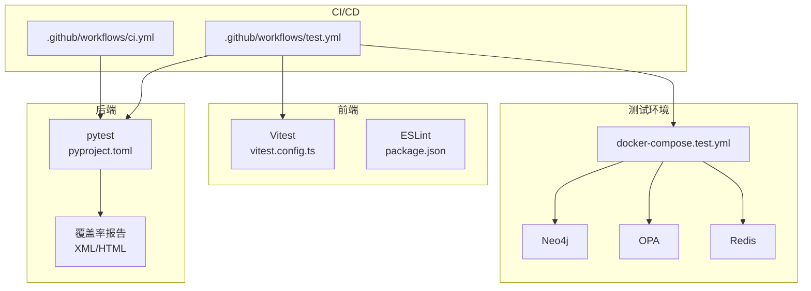
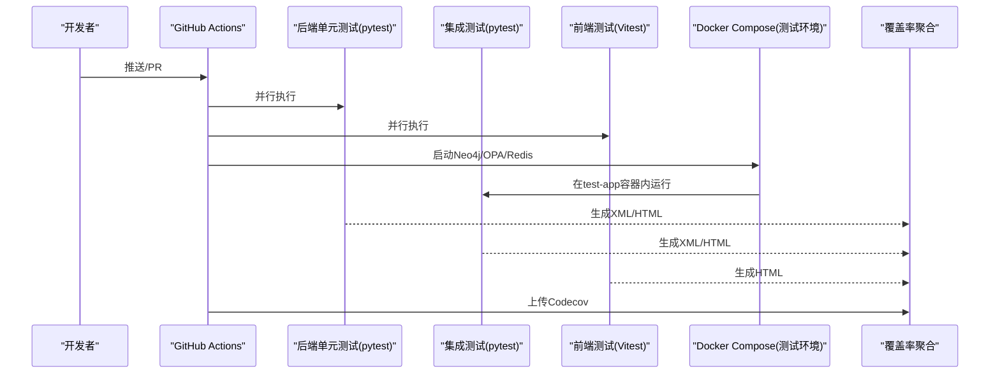
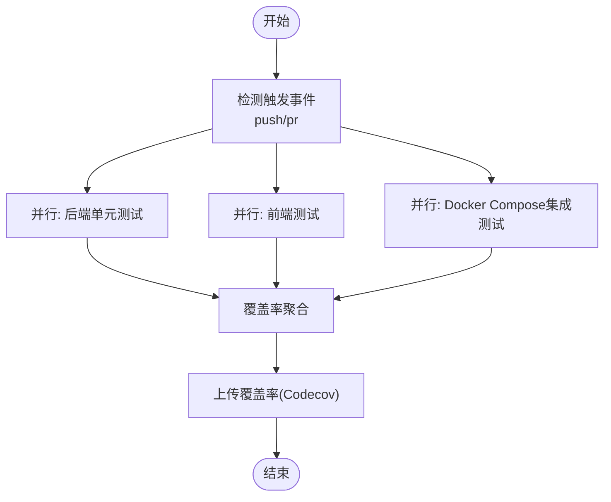
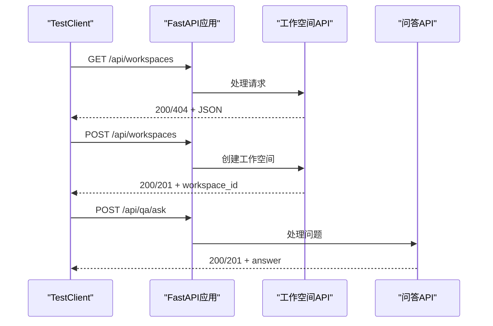
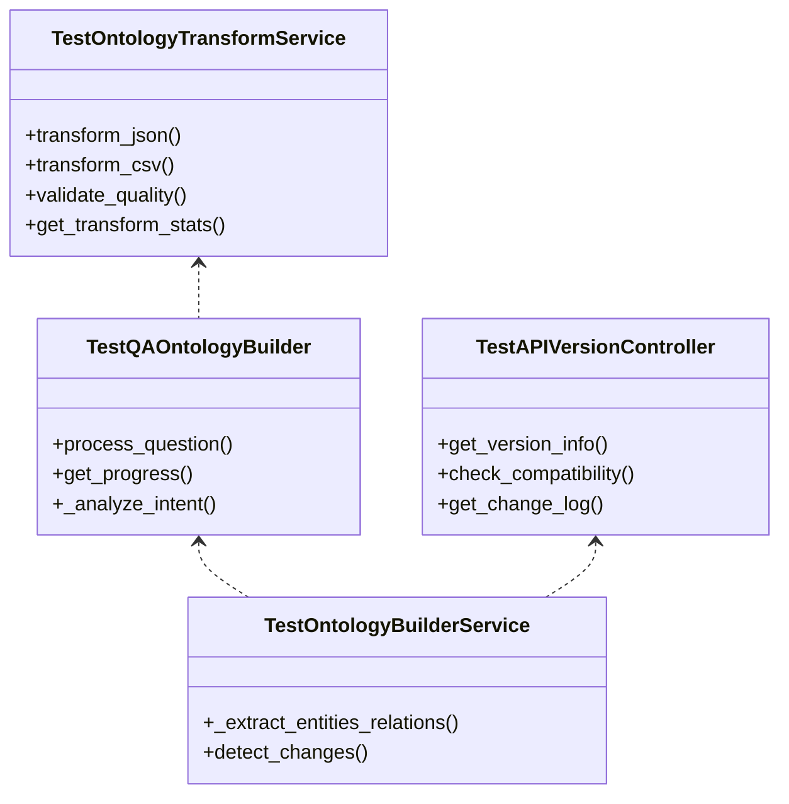
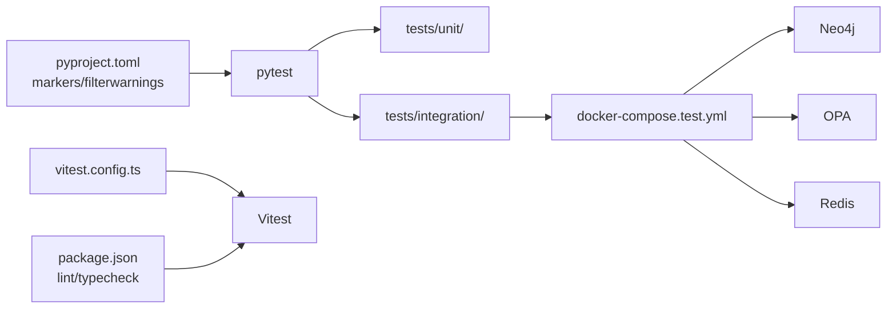

# 测试自动化

<cite>
**本文引用的文件**
- [ci.yml](file://.github/workflows/ci.yml)
- [test.yml](file://.github/workflows/test.yml)
- [docker-compose.test.yml](file://docker/docker-compose.test.yml)
- [vitest.config.ts](file://frontend/vitest.config.ts)
- [pyproject.toml](file://pyproject.toml)
- [conftest.py](file://tests/conftest.py)
- [setup.ts](file://frontend/src/test/setup.ts)
- [package.json](file://frontend/package.json)
- [requirements.txt](file://requirements.txt)
- [README.md](file://README.md)
- [test_api_integration.py](file://tests/integration/test_api_integration.py)
- [test_ontology_engine.py](file://tests/unit/test_ontology_engine.py)
- [CHECKLIST_v2.md](file://docs/09-checklists/CHECKLIST_v2.md)
- [test_gateway.py](file://openharness/tests/test_ohmo/test_gateway.py)
- [DESIGN.md](file://docs/03-modules/swarm_orchestrator/DESIGN.md)
</cite>

## 目录
1. [简介](#简介)
2. [项目结构](#项目结构)
3. [核心组件](#核心组件)
4. [架构总览](#架构总览)
5. [详细组件分析](#详细组件分析)
6. [依赖分析](#依赖分析)
7. [性能考量](#性能考量)
8. [故障排查指南](#故障排查指南)
9. [结论](#结论)
10. [附录](#附录)

## 简介
本指南面向DevOps与测试团队，围绕ODAP平台的测试自动化落地，系统阐述CI/CD流水线中的测试配置、触发条件、并行策略；测试报告与质量门禁（覆盖率、失败重试、通知）；测试数据自动化管理（生成、清理、环境初始化）；以及性能测试、安全测试、兼容性测试的自动化实施方案，并给出测试工具链集成建议与最佳实践。

## 项目结构
ODAP平台采用“后端Python/FastAPI + 前端React/Vite + Docker容器化”的多模块架构。测试覆盖单元、集成与端到端三个层次，配合GitHub Actions工作流与Docker Compose测试环境，形成从本地到云端的完整测试闭环。

**图表来源**
- [.github/workflows/ci.yml:1-99](file://.github/workflows/ci.yml#L1-L99)
- [.github/workflows/test.yml:1-122](file://.github/workflows/test.yml#L1-L122)
- [docker/docker-compose.test.yml:1-99](file://docker/docker-compose.test.yml#L1-L99)
- [pyproject.toml:1-17](file://pyproject.toml#L1-L17)
- [vitest.config.ts:1-29](file://frontend/vitest.config.ts#L1-L29)

**章节来源**
- [README.md:1-241](file://README.md#L1-L241)
- [.github/workflows/ci.yml:1-99](file://.github/workflows/ci.yml#L1-L99)
- [.github/workflows/test.yml:1-122](file://.github/workflows/test.yml#L1-L122)
- [docker/docker-compose.test.yml:1-99](file://docker/docker-compose.test.yml#L1-L99)
- [pyproject.toml:1-17](file://pyproject.toml#L1-L17)
- [vitest.config.ts:1-29](file://frontend/vitest.config.ts#L1-L29)

## 核心组件
- GitHub Actions工作流
  - ci.yml：后端单元/集成测试与前端类型检查/代码规范/单元测试；随后构建镜像并健康检查。
  - test.yml：拆分为单元测试、集成测试、Docker Compose测试与覆盖率聚合；并上传Codecov。
- 测试运行与配置
  - 后端：pytest + pytest-asyncio + pytest-cov；通过pyproject.toml定义标记与默认参数。
  - 前端：Vitest + jsdom环境 + 覆盖率（v8）。
- 测试环境
  - docker-compose.test.yml：Neo4j、OPA、Redis容器化服务，test-app容器内直接运行pytest，依赖健康检查。
- 测试夹具与工具
  - tests/conftest.py：通用数据库/工具注册表/AuditLogger夹具。
  - frontend/src/test/setup.ts：DOM/ResizeObserver等全局mock与API基地址配置。

**章节来源**
- [.github/workflows/ci.yml:1-99](file://.github/workflows/ci.yml#L1-L99)
- [.github/workflows/test.yml:1-122](file://.github/workflows/test.yml#L1-L122)
- [docker/docker-compose.test.yml:1-99](file://docker/docker-compose.test.yml#L1-L99)
- [pyproject.toml:1-17](file://pyproject.toml#L1-L17)
- [tests/conftest.py:1-52](file://tests/conftest.py#L1-L52)
- [frontend/src/test/setup.ts:1-32](file://frontend/src/test/setup.ts#L1-L32)

## 架构总览
下图展示测试自动化在CI中的整体交互：工作流触发后，分别执行后端与前端测试，集成测试通过Docker Compose拉起依赖服务并在应用容器内运行；最终生成覆盖率报告并上传。

**图表来源**
- [.github/workflows/ci.yml:1-99](file://.github/workflows/ci.yml#L1-L99)
- [.github/workflows/test.yml:1-122](file://.github/workflows/test.yml#L1-L122)
- [docker/docker-compose.test.yml:1-99](file://docker/docker-compose.test.yml#L1-L99)

## 详细组件分析

### GitHub Actions工作流与触发条件
- 触发条件
  - main/develop分支推送与main分支PR触发。
- 并行策略
  - 后端测试与前端测试并行；构建阶段依赖两者完成。
  - test.yml中单元测试、集成测试、Docker Compose测试并行执行。
- 失败重试与质量门禁
  - 当前未内置重试机制；可通过GitHub Actions的job级重试策略补充。
  - 覆盖率上传至Codecov，可结合仓库设置覆盖率阈值作为质量门禁。

**章节来源**
- [.github/workflows/ci.yml:3-9](file://.github/workflows/ci.yml#L3-L9)
- [.github/workflows/ci.yml:80-99](file://.github/workflows/ci.yml#L80-L99)
- [.github/workflows/test.yml:8-12](file://.github/workflows/test.yml#L8-L12)
- [.github/workflows/test.yml:86-98](file://.github/workflows/test.yml#L86-L98)
- [.github/workflows/test.yml:99-122](file://.github/workflows/test.yml#L99-L122)

### 测试触发与执行策略
- 后端
  - 单元测试：tests/unit/，使用pytest与asyncio模式。
  - 集成测试：tests/integration/，依赖Neo4j/OPA/Redis，通过环境变量注入。
- 前端
  - Vitest运行，jsdom环境，启用覆盖率（v8）。
  - ESLint与类型检查在CI中执行，失败不会阻断构建（使用|| true）。
- Docker Compose测试
  - 通过docker-compose.test.yml启动依赖服务，test-app容器内直接运行pytest，健康检查确保服务可用。

**图表来源**
- [.github/workflows/test.yml:1-122](file://.github/workflows/test.yml#L1-L122)
- [docker/docker-compose.test.yml:1-99](file://docker/docker-compose.test.yml#L1-L99)

**章节来源**
- [.github/workflows/test.yml:14-84](file://.github/workflows/test.yml#L14-L84)
- [docker/docker-compose.test.yml:65-91](file://docker/docker-compose.test.yml#L65-L91)

### 测试报告与质量门禁
- 报告生成
  - 后端：pytest --cov=odap --cov-report=xml --cov-report=html。
  - 前端：Vitest配置开启text/json/html三种报告。
- 质量门禁
  - 建议在仓库设置Codecov覆盖率阈值；当前项目质量清单目标：单元测试覆盖率 > 80%。
  - 可结合ESLint与类型检查结果作为代码质量门禁的一部分。

**章节来源**
- [.github/workflows/test.yml:115-122](file://.github/workflows/test.yml#L115-L122)
- [vitest.config.ts:22-26](file://frontend/vitest.config.ts#L22-L26)
- [CHECKLIST_v2.md:64-90](file://docs/09-checklists/CHECKLIST_v2.md#L64-L90)

### 测试数据自动化管理
- 生成
  - 使用pytest夹具与测试数据生成工具（如odap/infra/utils/data_generator.py）在测试前构造最小化数据集。
  - 集成测试通过docker-compose.test.yml挂载策略与数据目录，确保OPA策略与Redis缓存初始状态一致。
- 清理
  - Docker卷与容器在测试结束后自动清理；Neo4j/Redis数据卷在compose文件中声明，便于重复使用或重建。
- 环境初始化
  - 通过环境变量注入（NEO4J_URI/USER/PASSWORD、OPA_URL、REDIS_URL）与健康检查确保服务就绪。

**章节来源**
- [docker/docker-compose.test.yml:14-27](file://docker/docker-compose.test.yml#L14-L27)
- [docker/docker-compose.test.yml:38-45](file://docker/docker-compose.test.yml#L38-L45)
- [docker/docker-compose.test.yml:57-61](file://docker/docker-compose.test.yml#L57-L61)
- [docker/docker-compose.test.yml:73-86](file://docker/docker-compose.test.yml#L73-L86)
- [tests/conftest.py:1-52](file://tests/conftest.py#L1-L52)

### 性能测试自动化
- 指标与目标
  - 问答响应时间（P95）< 3s；图谱查询延迟（P95）< 500ms；并发用户数≥100；系统可用性≥99.9%。
- 实施建议
  - 在CI中新增性能测试Job，使用压测工具（如k6/JMeter）对关键API端点进行基准测试。
  - 将性能报告与历史趋势对比，结合健康监控（见Swarm Orchestrator健康检查设计）进行回归分析。

**章节来源**
- [CHECKLIST_v2.md:64-76](file://docs/09-checklists/CHECKLIST_v2.md#L64-L76)
- [DESIGN.md:783-1357](file://docs/03-modules/swarm_orchestrator/DESIGN.md#L783-L1357)

### 安全测试自动化
- 指标与目标
  - 认证方式支持SSO/OAuth2/本地认证；传输加密TLS 1.3；工作空间级别数据隔离；审计覆盖100%。
- 实施建议
  - 集成安全扫描（依赖扫描、漏洞检测）到CI；对OPA策略与权限控制进行专项测试（策略有效性、RBAC覆盖）。
  - 结合审计日志测试，验证所有关键操作均有记录。

**章节来源**
- [CHECKLIST_v2.md:66-81](file://docs/09-checklists/CHECKLIST_v2.md#L66-L81)
- [test_api_integration.py:517-557](file://tests/integration/test_api_integration.py#L517-L557)

### 兼容性测试自动化
- 覆盖范围
  - 多场景支持（不绑定垂直领域）；多数据源（Kafka/API/文件）；外部系统集成（MCP协议）。
- 实施建议
  - 在CI中增加不同浏览器/Node版本的前端兼容性矩阵；对API端点进行跨版本兼容性回归测试。

**章节来源**
- [CHECKLIST_v2.md:95-96](file://docs/09-checklists/CHECKLIST_v2.md#L95-L96)
- [test_api_integration.py:612-646](file://tests/integration/test_api_integration.py#L612-L646)

### 测试工具链集成
- 静态代码分析
  - 后端：flake8/black（requirements.txt/dev依赖）。
  - 前端：ESLint（package.json/scripts/lint）。
- 依赖扫描与漏洞检测
  - 建议在CI中集成安全扫描（如OSV、npm audit、pip-audit）与许可证检查。
- 测试工具链
  - 后端：pytest + pytest-asyncio + pytest-cov。
  - 前端：Vitest + jsdom + 覆盖率（v8）。

**章节来源**
- [requirements.txt:43-48](file://requirements.txt#L43-L48)
- [package.json:9-13](file://frontend/package.json#L9-L13)
- [vitest.config.ts:1-29](file://frontend/vitest.config.ts#L1-L29)

### API集成测试示例（序列图）
以下序列图展示一次典型API集成测试流程：前端/后端通过TestClient发起请求，后端路由处理并返回结果，集成测试断言状态码与响应结构。

**图表来源**
- [tests/integration/test_api_integration.py:23-52](file://tests/integration/test_api_integration.py#L23-L52)
- [tests/integration/test_api_integration.py:205-253](file://tests/integration/test_api_integration.py#L205-L253)

**章节来源**
- [tests/integration/test_api_integration.py:1-736](file://tests/integration/test_api_integration.py#L1-L736)

### 单元测试示例（类图）
单元测试覆盖本体转换、QA本体构建、本体构建服务等核心模块，使用pytest异步测试与夹具。

**图表来源**
- [tests/unit/test_ontology_engine.py:10-219](file://tests/unit/test_ontology_engine.py#L10-L219)

**章节来源**
- [tests/unit/test_ontology_engine.py:1-219](file://tests/unit/test_ontology_engine.py#L1-L219)

## 依赖分析
- 测试标记与过滤
  - 通过pyproject.toml定义unit/integration/slow/e2e标记，便于按需选择测试集合。
- 外部依赖
  - 集成测试依赖Neo4j、OPA、Redis；Docker Compose负责服务编排与健康检查。
- 前端依赖
  - Vitest、jsdom、Ant Design、React生态；ESLint与TypeScript参与静态检查。

**图表来源**
- [pyproject.toml:4-9](file://pyproject.toml#L4-L9)
- [docker/docker-compose.test.yml:6-91](file://docker/docker-compose.test.yml#L6-L91)
- [vitest.config.ts:1-29](file://frontend/vitest.config.ts#L1-L29)
- [package.json:9-13](file://frontend/package.json#L9-L13)

**章节来源**
- [pyproject.toml:1-17](file://pyproject.toml#L1-L17)
- [docker/docker-compose.test.yml:1-99](file://docker/docker-compose.test.yml#L1-L99)
- [vitest.config.ts:1-29](file://frontend/vitest.config.ts#L1-L29)
- [package.json:1-55](file://frontend/package.json#L1-L55)

## 性能考量
- 测试执行效率
  - 使用并行作业与缓存（pip cache、Docker Buildx）提升CI速度。
  - 对慢速测试（slow标记）进行隔离，避免阻塞主流水线。
- 覆盖率与质量
  - 通过Codecov阈值与报告对比，持续改进测试覆盖面。
- 健康监控
  - 参考Swarm Orchestrator健康监控设计，将关键指标纳入CI告警与回归分析。

**章节来源**
- [.github/workflows/test.yml:25-31](file://.github/workflows/test.yml#L25-L31)
- [.github/workflows/test.yml:91-98](file://.github/workflows/test.yml#L91-L98)
- [DESIGN.md:783-1357](file://docs/03-modules/swarm_orchestrator/DESIGN.md#L783-L1357)

## 故障排查指南
- 常见问题定位
  - 集成测试失败：检查Neo4j/OPA/Redis健康检查与容器日志；确认环境变量配置正确。
  - 前端测试DOM相关报错：确认setup.ts中的全局mock与API基地址配置。
  - 覆盖率缺失：确认pytest与Vitest覆盖率开关已启用且上传成功。
- 建议流程
  - 在PR中复现问题，缩小测试范围（仅运行失败用例）；查看CI日志与容器健康状态；必要时在本地使用相同compose配置复现。

**章节来源**
- [docker/docker-compose.test.yml:23-27](file://docker/docker-compose.test.yml#L23-L27)
- [docker/docker-compose.test.yml:41-45](file://docker/docker-compose.test.yml#L41-L45)
- [docker/docker-compose.test.yml:57-61](file://docker/docker-compose.test.yml#L57-L61)
- [frontend/src/test/setup.ts:1-32](file://frontend/src/test/setup.ts#L1-L32)
- [.github/workflows/test.yml:115-122](file://.github/workflows/test.yml#L115-L122)

## 结论
ODAP平台已具备完善的测试自动化基础：后端pytest与前端Vitest并行执行、Docker Compose集成测试环境、覆盖率聚合与上传。建议进一步完善失败重试、覆盖率阈值门禁、安全扫描与性能回归，形成更稳健的CI质量保障体系。

## 附录
- 最佳实践清单
  - 为关键Job添加重试与超时配置。
  - 在仓库设置Codecov覆盖率阈值与报告对比。
  - 增加安全扫描（依赖/漏洞/许可证）与OWASP Top 10专项测试。
  - 将性能测试纳入CI，建立基线与回归阈值。
  - 对OpenHarness子模块进行独立测试与质量门禁。