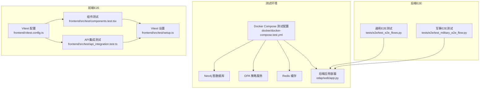
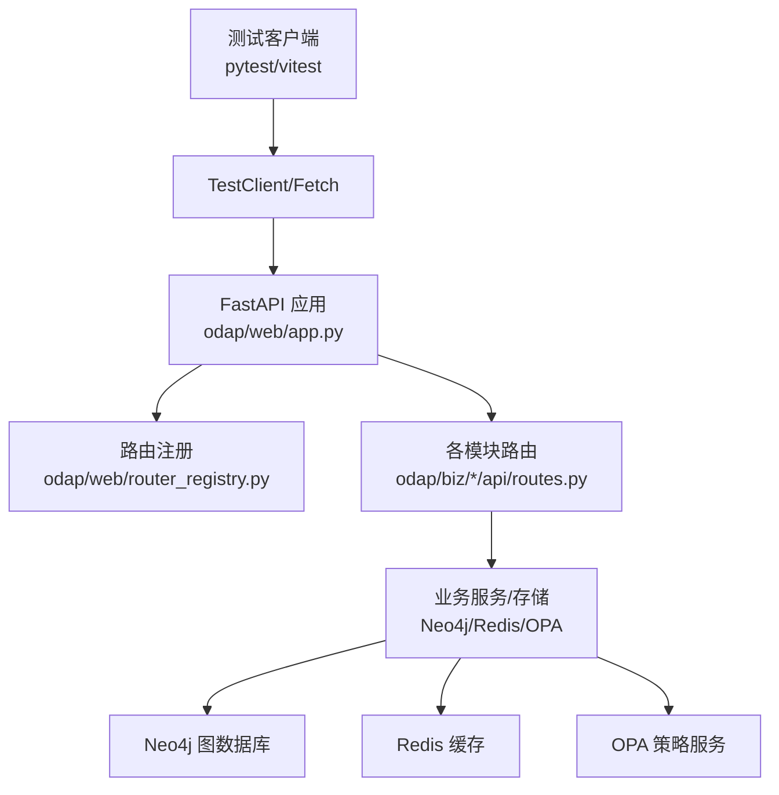
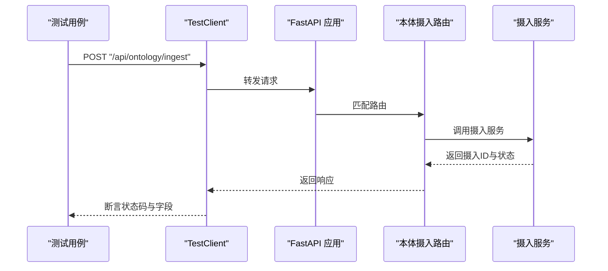
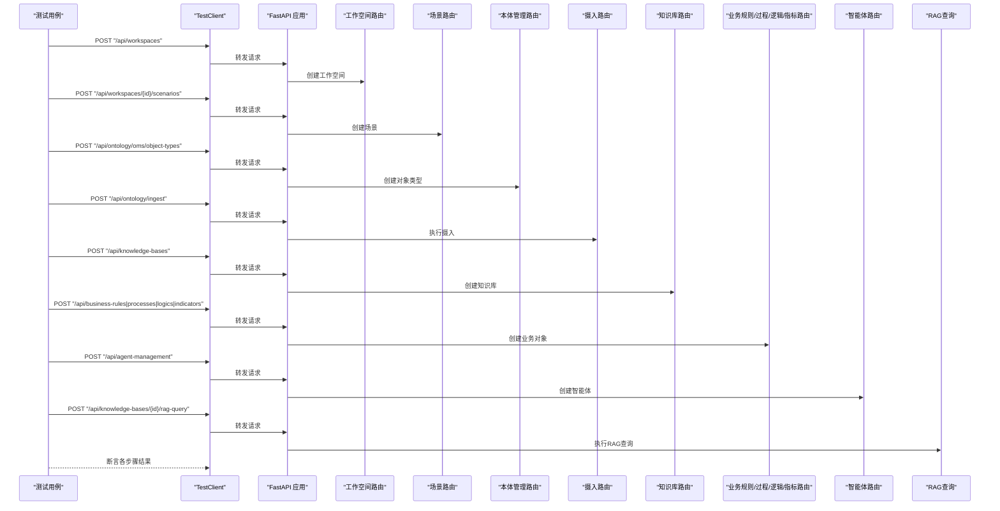
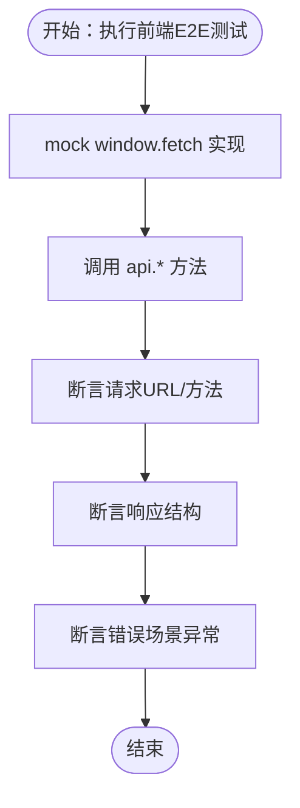
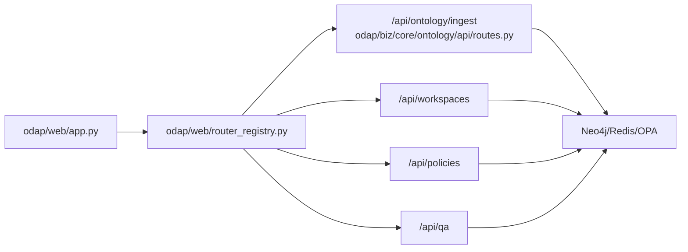

# 端到端测试

<cite>
**本文档引用的文件**   
- [tests/e2e/test_e2e_flows.py](file://tests/e2e/test_e2e_flows.py)
- [tests/e2e/test_military_e2e_flow.py](file://tests/e2e/test_military_e2e_flow.py)
- [frontend/src/test/components.test.tsx](file://frontend/src/test/components.test.tsx)
- [frontend/src/test/api_integration.test.ts](file://frontend/src/test/api_integration.test.ts)
- [frontend/src/test/setup.ts](file://frontend/src/test/setup.ts)
- [frontend/vitest.config.ts](file://frontend/vitest.config.ts)
- [docker/docker-compose.test.yml](file://docker/docker-compose.test.yml)
- [.github/workflows/test.yml](file://.github/workflows/test.yml)
- [tests/conftest.py](file://tests/conftest.py)
- [odap/web/app.py](file://odap/web/app.py)
- [odap/biz/core/ontology/api/routes.py](file://odap/biz/core/ontology/api/routes.py)
- [odap/web/router_registry.py](file://odap/web/router_registry.py)
</cite>

## 目录
1. [简介](#简介)
2. [项目结构](#项目结构)
3. [核心组件](#核心组件)
4. [架构总览](#架构总览)
5. [详细组件分析](#详细组件分析)
6. [依赖分析](#依赖分析)
7. [性能考虑](#性能考虑)
8. [故障排查指南](#故障排查指南)
9. [结论](#结论)
10. [附录](#附录)

## 简介
本指南面向ODAP平台测试团队，提供端到端（E2E）测试的完整实施方法论与实践路径。内容涵盖设计理念、测试场景设计（用户工作流、业务流程、跨模块功能）、前后端E2E测试策略、复杂业务流程（如军事冲突场景）的测试案例、测试环境搭建、测试数据准备、测试脚本编写、自动化执行、截图对比与视频录制、测试报告生成等。目标是帮助测试团队快速落地可维护、可扩展、可回归的E2E测试体系。

## 项目结构
ODAP平台采用前后端分离与多模块集成架构，E2E测试覆盖后端API链路、本体摄入与构建、工作空间与场景管理、策略与权限、智能体与知识库、以及前端组件与API集成。测试相关的关键位置如下：
- 后端E2E测试位于 tests/e2e，包含通用E2E流程与军事场景E2E流程
- 前端测试位于 frontend/src/test，包含组件与API集成测试
- 测试运行与环境由 docker-compose.test.yml 提供容器化依赖（Neo4j、Redis、OPA）
- CI流水线由 .github/workflows/test.yml 定义，包含单元、集成与Docker测试任务

**图表来源**
- [docker/docker-compose.test.yml:1-99](file://docker/docker-compose.test.yml#L1-L99)
- [tests/e2e/test_e2e_flows.py:1-430](file://tests/e2e/test_e2e_flows.py#L1-L430)
- [tests/e2e/test_military_e2e_flow.py:1-439](file://tests/e2e/test_military_e2e_flow.py#L1-L439)
- [frontend/src/test/setup.ts:1-32](file://frontend/src/test/setup.ts#L1-L32)
- [frontend/vitest.config.ts:1-29](file://frontend/vitest.config.ts#L1-L29)
- [frontend/src/test/components.test.tsx:1-42](file://frontend/src/test/components.test.tsx#L1-L42)
- [frontend/src/test/api_integration.test.ts:1-378](file://frontend/src/test/api_integration.test.ts#L1-L378)
- [odap/web/app.py:1-262](file://odap/web/app.py#L1-L262)

**章节来源**
- [docker/docker-compose.test.yml:1-99](file://docker/docker-compose.test.yml#L1-L99)
- [.github/workflows/test.yml:1-122](file://.github/workflows/test.yml#L1-L122)

## 核心组件
- 后端E2E测试框架
  - 使用FastAPI TestClient对路由进行端到端调用，结合unittest.mock对外部服务进行桩/替身，保证测试隔离与可控性
  - 通过pytest标记区分E2E与其它测试类别
- 前端E2E测试框架
  - Vitest + jsdom环境，模拟浏览器行为；通过mock fetch实现API集成测试
  - 组件测试验证模块导出与类型定义
- 测试环境
  - Docker Compose提供Neo4j、OPA、Redis等依赖服务，后端容器内运行pytest
- CI流水线
  - GitHub Actions定义单元测试、集成测试、Docker测试与覆盖率上报

**章节来源**
- [tests/e2e/test_e2e_flows.py:1-430](file://tests/e2e/test_e2e_flows.py#L1-L430)
- [tests/e2e/test_military_e2e_flow.py:1-439](file://tests/e2e/test_military_e2e_flow.py#L1-L439)
- [frontend/src/test/components.test.tsx:1-42](file://frontend/src/test/components.test.tsx#L1-L42)
- [frontend/src/test/api_integration.test.ts:1-378](file://frontend/src/test/api_integration.test.ts#L1-L378)
- [frontend/src/test/setup.ts:1-32](file://frontend/src/test/setup.ts#L1-L32)
- [frontend/vitest.config.ts:1-29](file://frontend/vitest.config.ts#L1-L29)
- [docker/docker-compose.test.yml:1-99](file://docker/docker-compose.test.yml#L1-L99)
- [.github/workflows/test.yml:1-122](file://.github/workflows/test.yml#L1-L122)

## 架构总览
ODAP后端基于FastAPI，路由按功能模块注册；E2E测试通过TestClient直接调用路由，绕过前端UI，聚焦API链路与业务流程。前端E2E通过Vitest模拟fetch，验证API调用契约与错误处理。

**图表来源**
- [odap/web/app.py:122-191](file://odap/web/app.py#L122-L191)
- [odap/web/router_registry.py:10-98](file://odap/web/router_registry.py#L10-L98)
- [odap/biz/core/ontology/api/routes.py:13-527](file://odap/biz/core/ontology/api/routes.py#L13-L527)
- [docker/docker-compose.test.yml:6-91](file://docker/docker-compose.test.yml#L6-L91)

## 详细组件分析

### 后端E2E测试：通用工作流与业务流程
- 设计理念
  - 以“最小可验证路径”为核心，覆盖从数据摄入、本体构建、工作空间隔离、策略与权限到问答与会话管理的完整链路
  - 使用pytest fixture对依赖服务进行mock，避免真实外部依赖波动影响测试稳定性
- 关键测试场景
  - 数据摄入：自然语言、新闻、URL、手动、JSON等多源摄入，状态轮询与历史查询
  - 工作空间：创建、查询、切换、隔离与资源字段持久化
  - 策略与权限：策略创建、启用/禁用、角色与权限绑定
  - QA与会话：提问、会话管理、历史查询与关闭
- 断言要点
  - HTTP状态码、响应字段存在性与基本格式校验
  - 关键业务对象（工作空间、策略、角色、会话）的标识符与状态一致性

**图表来源**
- [tests/e2e/test_e2e_flows.py:149-173](file://tests/e2e/test_e2e_flows.py#L149-L173)
- [odap/biz/core/ontology/api/routes.py:74-125](file://odap/biz/core/ontology/api/routes.py#L74-L125)

**章节来源**
- [tests/e2e/test_e2e_flows.py:149-430](file://tests/e2e/test_e2e_flows.py#L149-L430)
- [odap/biz/core/ontology/api/routes.py:13-399](file://odap/biz/core/ontology/api/routes.py#L13-L399)

### 后端E2E测试：军事冲突场景（复杂业务流程）
- 设计理念
  - 将复杂业务流程拆分为多个步骤（工作空间、场景、本体对象/动作类型、数据摄入、知识库、业务规则/过程/逻辑/指标、智能体、RAG查询、策略持久化、资源字段验证等），每个步骤独立断言并共享上下文ID
  - 使用模块级fixture生成唯一测试ID，确保测试可重复与可追溯
- 关键测试场景
  - 本体对象与动作类型：舰队、基地、导弹等类型定义与动作参数
  - 业务规则与过程：高价值目标识别、威胁评估、威胁响应流程
  - 业务逻辑与指标：威胁等级计算、战备状态指数
  - 智能体：关联规则/过程/逻辑/指标与知识库，支持聊天与引用选项
  - 数据摄入：手动录入军事数据，验证摄入状态与抽取结构
  - 策略与资源：策略持久化、工作空间成员与资源字段
- 断言要点
  - 步骤间ID传递正确性与最终查询结果存在性
  - 业务对象与规则的结构完整性与字段一致性

**图表来源**
- [tests/e2e/test_military_e2e_flow.py:55-439](file://tests/e2e/test_military_e2e_flow.py#L55-L439)
- [odap/web/app.py:146-191](file://odap/web/app.py#L146-L191)

**章节来源**
- [tests/e2e/test_military_e2e_flow.py:1-439](file://tests/e2e/test_military_e2e_flow.py#L1-L439)

### 前端E2E测试：组件与API集成
- 组件测试
  - 验证模块导出、类型定义与store导出，确保模块边界稳定
- API集成测试
  - 通过mock fetch模拟后端响应，覆盖工作空间、本体摄入、版本管理、审计日志、智能问答、技能管理、角色与策略、事件模拟器、系统健康检查等API
  - 断言请求URL、方法、参数与响应结构
  - 断言错误场景（404、500、400）的异常抛出与消息格式
- 运行环境
  - Vitest + jsdom，setup中统一mock window.fetch与ResizeObserver，确保测试环境稳定

**图表来源**
- [frontend/src/test/api_integration.test.ts:6-23](file://frontend/src/test/api_integration.test.ts#L6-L23)
- [frontend/src/test/setup.ts:5-28](file://frontend/src/test/setup.ts#L5-L28)

**章节来源**
- [frontend/src/test/components.test.tsx:1-42](file://frontend/src/test/components.test.tsx#L1-L42)
- [frontend/src/test/api_integration.test.ts:1-378](file://frontend/src/test/api_integration.test.ts#L1-L378)
- [frontend/src/test/setup.ts:1-32](file://frontend/src/test/setup.ts#L1-L32)
- [frontend/vitest.config.ts:1-29](file://frontend/vitest.config.ts#L1-L29)

### 测试环境搭建与数据准备
- 本地开发环境
  - 使用Docker Compose启动Neo4j、OPA、Redis，并在test-app容器内运行pytest，自动依赖健康检查
- 环境变量与依赖
  - 后端容器设置Neo4j/Redis/OPA连接参数，确保E2E测试可访问真实依赖
- 测试数据准备
  - 后端E2E通过TestClient直接构造请求体；前端E2E通过mock返回预设响应，避免真实后端依赖
  - 复杂场景（如军事E2E）使用模块级fixture生成唯一ID，确保测试幂等

**章节来源**
- [docker/docker-compose.test.yml:65-91](file://docker/docker-compose.test.yml#L65-L91)
- [tests/e2e/test_military_e2e_flow.py:28-36](file://tests/e2e/test_military_e2e_flow.py#L28-L36)

### 测试脚本编写与组织
- 后端E2E
  - 使用pytest类组织测试用例，每个类聚焦一类业务域（如数据摄入、QA、工作空间隔离、策略与权限）
  - 使用autouse fixture对关键外部服务进行mock，减少测试耦合
- 前端E2E
  - 使用describe/it组织测试套件，每个describe聚焦一类API域
  - 使用beforeEach清理mock，确保测试隔离
- 共享配置
  - Vitest配置统一入口，包含别名、jsx自动导入、覆盖率与测试文件匹配规则

**章节来源**
- [tests/e2e/test_e2e_flows.py:15-146](file://tests/e2e/test_e2e_flows.py#L15-L146)
- [frontend/vitest.config.ts:17-28](file://frontend/vitest.config.ts#L17-L28)
- [frontend/src/test/api_integration.test.ts:25-27](file://frontend/src/test/api_integration.test.ts#L25-L27)

### 测试自动化执行、截图对比与视频录制
- 自动化执行
  - 使用GitHub Actions在push与pull_request触发，分别运行单元测试、集成测试与Docker测试
  - Docker测试通过docker compose -f docker-compose.test.yml up --abort-on-container-exit执行
- 截图对比与视频录制
  - 当前仓库未提供前端E2E截图对比与视频录制的实现；可在CI中引入Selenium/Playwright与屏幕录制工具，在测试失败时输出截图与视频
- 测试报告生成
  - 单元测试与集成测试使用pytest-cov生成XML与HTML报告，上传至Codecov

**章节来源**
- [.github/workflows/test.yml:86-122](file://.github/workflows/test.yml#L86-L122)

## 依赖分析
- 路由注册与模块化
  - 应用通过router_registry集中注册各模块路由，便于E2E测试覆盖全量API
- 外部依赖
  - Neo4j用于图数据存储，OPA用于策略与权限，Redis用于缓存
- 测试耦合度
  - 后端E2E通过mock隔离外部依赖，降低耦合；前端E2E通过mock fetch隔离网络层

**图表来源**
- [odap/web/app.py:146-191](file://odap/web/app.py#L146-L191)
- [odap/web/router_registry.py:34-98](file://odap/web/router_registry.py#L34-L98)
- [odap/biz/core/ontology/api/routes.py:13-527](file://odap/biz/core/ontology/api/routes.py#L13-L527)

**章节来源**
- [odap/web/app.py:1-262](file://odap/web/app.py#L1-L262)
- [odap/web/router_registry.py:1-98](file://odap/web/router_registry.py#L1-L98)
- [odap/biz/core/ontology/api/routes.py:1-527](file://odap/biz/core/ontology/api/routes.py#L1-L527)

## 性能考虑
- 测试并发与隔离
  - 使用pytest fixture与mock减少外部依赖，提升测试执行速度
  - 前端测试通过jsdom与mock fetch避免真实网络开销
- 数据与状态复用
  - 在同一测试会话内复用已创建的工作空间与场景ID，减少重复创建成本
- 容器化依赖
  - Docker Compose提供健康检查，确保依赖服务就绪后再执行测试，避免重试与失败

## 故障排查指南
- 后端E2E常见问题
  - 依赖服务未就绪：检查docker-compose.test.yml中的healthcheck与depends_on配置
  - 路由未注册：确认odap/web/router_registry.py中路由是否包含对应模块
  - 权限策略导致失败：检查OPA策略与角色绑定，必要时在fixture中放宽策略
- 前端E2E常见问题
  - fetch未mock：确认frontend/src/test/setup.ts中window.fetch已被mock
  - ResizeObserver/媒体查询：确认setup.ts中相关polyfill已注入
  - 路由不匹配：核对Vitest配置中的alias与include规则
- CI问题
  - Docker测试退出：查看compose日志，确认test-app容器命令与依赖健康状态
  - 覆盖率报告缺失：确认pytest-cov安装与报告生成命令

**章节来源**
- [docker/docker-compose.test.yml:23-89](file://docker/docker-compose.test.yml#L23-L89)
- [frontend/src/test/setup.ts:5-28](file://frontend/src/test/setup.ts#L5-L28)
- [.github/workflows/test.yml:86-122](file://.github/workflows/test.yml#L86-L122)

## 结论
ODAP平台已具备完善的后端E2E与前端E2E测试基础：后端通过TestClient与mock覆盖关键API链路，前端通过Vitest与fetch mock实现API契约验证。建议在现有基础上补充前端E2E可视化测试（截图对比/视频录制）、完善CI中的失败重试与产物收集，并持续扩展复杂业务流程（如军事场景）的端到端覆盖，以保障平台在演进过程中的质量与稳定性。

## 附录
- 快速开始（后端E2E）
  - 启动测试环境：docker compose -f docker/docker-compose.test.yml up -d
  - 运行测试：pytest tests/e2e/ -v -m e2e
- 快速开始（前端E2E）
  - 运行测试：cd frontend && npm run test
- CI执行
  - 推送代码后自动触发GitHub Actions，查看测试与覆盖率报告