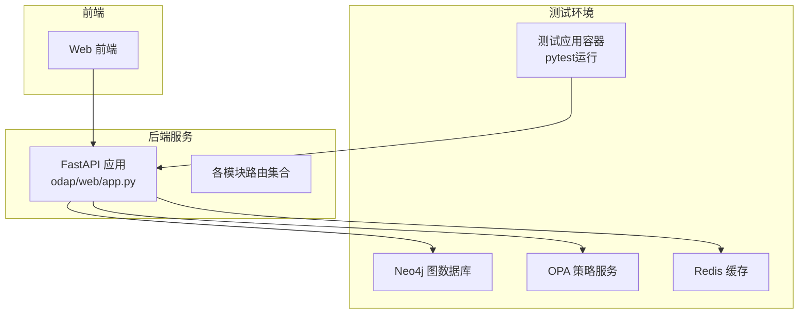
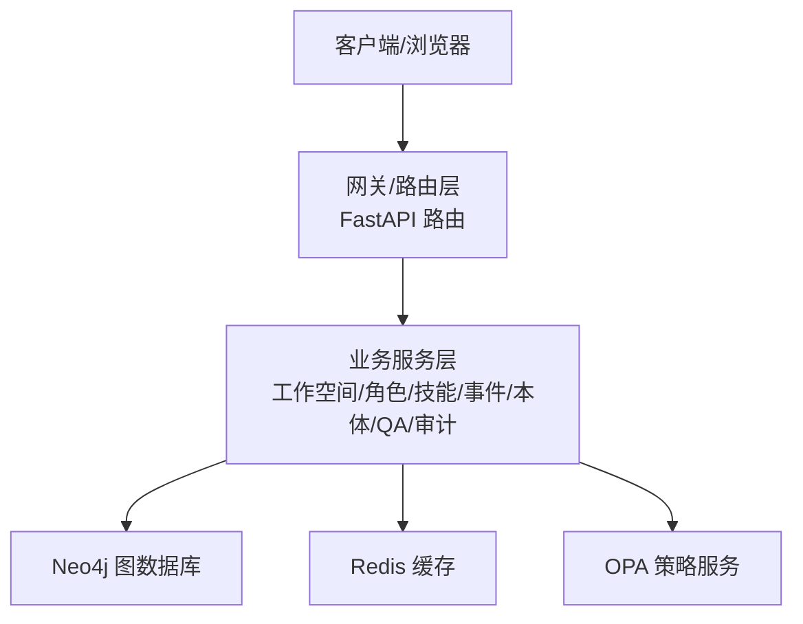
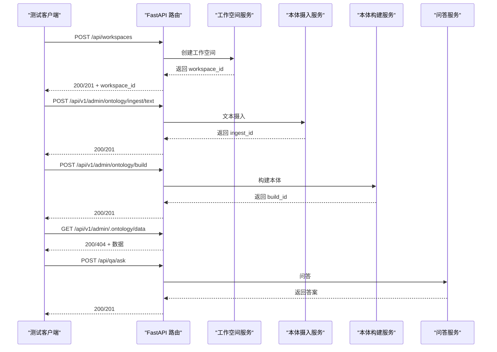
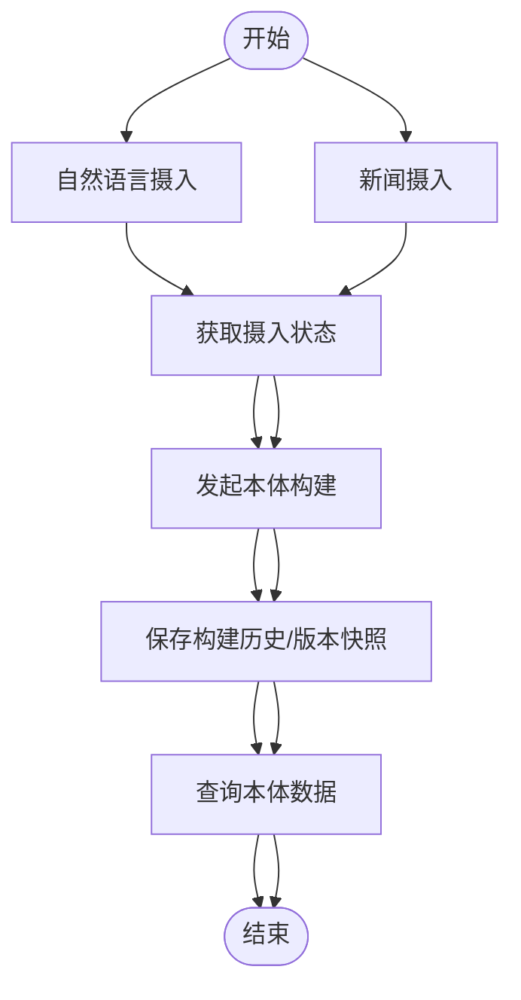
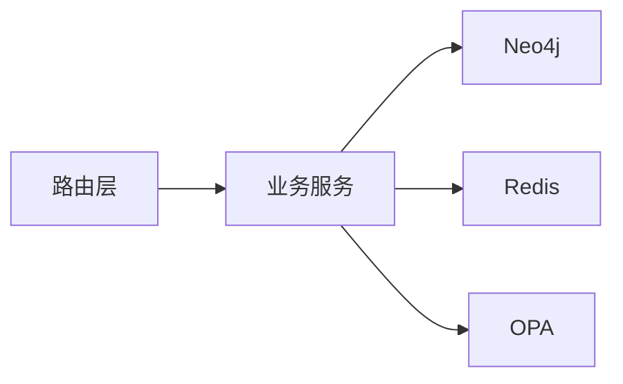

# 集成测试

<cite>
**本文引用的文件**
- [odap/web/app.py](file://odap/web/app.py)
- [tests/integration/test_api_integration.py](file://tests/integration/test_api_integration.py)
- [tests/integration/test_ontology_integration.py](file://tests/integration/test_ontology_integration.py)
- [tests/integration/test_ingest_pipeline.py](file://tests/integration/test_ingest_pipeline.py)
- [tests/integration/test_real_data_integration.py](file://tests/integration/test_real_data_integration.py)
- [tests/integration/test_v2_integration.py](file://tests/integration/test_v2_integration.py)
- [tests/integration/test_oadp_loop.py](file://tests/integration/test_oadp_loop.py)
- [tests/integration/test_opa_integration.py](file://tests/integration/test_opa_integration.py)
- [docker/docker-compose.test.yml](file://docker/docker-compose.test.yml)
- [docker/docker-compose.yml](file://docker/docker-compose.yml)
- [tests/conftest.py](file://tests/conftest.py)
- [odap/biz/integration/mcp_adapter/api/routes.py](file://odap/biz/integration/mcp_adapter/api/routes.py)
- [odap/infra/opa/opa_service.py](file://odap/infra/opa/opa_service.py)
- [config/agent_config.yaml](file://config/agent_config.yaml)
</cite>

## 更新摘要
**所做更改**
- 移除了OpenHarness集成测试相关内容，因为该功能已被移除
- 移除了MCP协议集成测试相关内容，因为该功能已被移除
- 移除了Ontology Graphiti集成测试相关内容，因为该功能已被移除
- 更新了测试范围和目标，聚焦于核心API集成测试、数据流测试、工具/技能集成测试、审计日志集成测试、图数据库集成测试、OPA策略集成测试和端到端测试
- 更新了架构图和测试流程，反映了移除的组件

## 目录
1. [引言](#引言)
2. [项目结构](#项目结构)
3. [核心组件](#核心组件)
4. [架构总览](#架构总览)
5. [详细组件分析](#详细组件分析)
6. [依赖分析](#依赖分析)
7. [性能考虑](#性能考虑)
8. [故障排查指南](#故障排查指南)
9. [结论](#结论)
10. [附录](#附录)

## 引言
本指南面向测试工程师，提供ODAP平台的集成测试实施方法论与实操步骤。目标涵盖：
- 模块间接口测试：验证API路由、中间件、安全与审计链路协同
- 外部服务集成测试：Neo4j图数据库、Redis缓存、OPA策略服务
- 数据流测试：从数据摄入、本体构建到查询与可视化的端到端验证
- API集成测试：REST端点、参数校验、响应格式、错误码处理
- 数据库集成测试：本体数据一致性、查询性能、事务处理
- 测试环境配置、Mock服务搭建、测试数据管理
- 执行策略、失败排查、性能基准测试

## 项目结构
ODAP平台采用FastAPI后端与React前端，使用Docker Compose编排Neo4j、Redis、OPA等外部依赖。集成测试主要位于tests/integration目录，并通过docker-compose.test.yml启动受控测试环境。

**图表来源**
- [docker/docker-compose.test.yml:66-91](file://docker/docker-compose.test.yml#L66-L91)
- [odap/web/app.py:122-191](file://odap/web/app.py#L122-L191)

**章节来源**
- [docker/docker-compose.test.yml:1-99](file://docker/docker-compose.test.yml#L1-L99)
- [docker/docker-compose.yml:1-97](file://docker/docker-compose.yml#L1-L97)
- [odap/web/app.py:1-262](file://odap/web/app.py#L1-L262)

## 核心组件
- FastAPI应用与路由注册：集中于odap/web/app.py，包含工作空间、角色、技能、事件模拟器、本体管理、QA、审计、OPA策略、MCP适配等路由。
- 集成测试套件：覆盖API端点、本体摄入与构建、真实数据一致性、工具/技能注册与执行、图数据库与OPA集成、Docker环境连通性等。
- 外部依赖：Neo4j（图存储）、Redis（缓存）、OPA（策略引擎）。
- 测试基础设施：pytest + TestClient；Docker Compose测试编排；conftest.py提供通用fixture。

**章节来源**
- [odap/web/app.py:10-191](file://odap/web/app.py#L10-L191)
- [tests/integration/test_api_integration.py:1-736](file://tests/integration/test_api_integration.py#L1-L736)
- [tests/integration/test_ingest_pipeline.py:1-320](file://tests/integration/test_ingest_pipeline.py#L1-L320)
- [tests/integration/test_real_data_integration.py:1-556](file://tests/integration/test_real_data_integration.py#L1-L556)
- [tests/integration/test_v2_integration.py:1-240](file://tests/integration/test_v2_integration.py#L1-L240)
- [tests/conftest.py:1-52](file://tests/conftest.py#L1-L52)

## 架构总览
下图展示ODAP平台在集成测试中的关键交互：前端通过HTTP访问后端API，后端路由调用业务服务，持久化依赖Neo4j与SQLite，缓存依赖Redis，权限控制依赖OPA。

**图表来源**
- [odap/web/app.py:146-191](file://odap/web/app.py#L146-L191)
- [docker/docker-compose.test.yml:6-91](file://docker/docker-compose.test.yml#L6-L91)

## 详细组件分析

### API集成测试设计
- 目标：验证REST端点行为、参数校验、响应格式、错误码处理与边界条件。
- 设计要点：
  - 使用FastAPI TestClient直接驱动路由，覆盖工作空间、场景、本体摄入、问答、审计、事件模拟器、技能、代理、角色、策略、系统健康与本体图查询等。
  - 对错误场景进行断言：空载荷、畸形JSON、缺失必填字段、大请求、无效场景ID等。
  - 端到端流程：完整摄入流程（文本摄入 → 构建本体 → 查询验证 → QA问答）。
- 关键断言示例（路径参考）：
  - 工作空间列表/创建/更新/删除/成员/导入导出
  - 场景创建/列表/获取/删除/更新
  - 本体摄入（文本/JSON/手动/自然语言）、构建本体
  - 问答（提问/会话/意图识别/角色视图/反馈/统计）
  - 审计日志（列表/筛选/时间线/统计/导出）
  - 事件模拟器（模板/生成/状态/采纳/批量采纳）
  - 技能（列表/扫描/分类/全部/已加载/注册）
  - 代理（初始化/状态/工具/运行/对话）
  - 角色（列表/创建/更新/删除）
  - 策略（列表/创建/获取/更新/切换）
  - 系统健康与性能指标
  - 本体图查询（图查询/实体/关系/状态）
  - 前端兼容层（本体数据/时间线/钩子/连接状态）
  - 完整摄入流程与错误处理

**图表来源**
- [tests/integration/test_api_integration.py:23-100](file://tests/integration/test_api_integration.py#L23-L100)
- [tests/integration/test_api_integration.py:146-203](file://tests/integration/test_api_integration.py#L146-L203)
- [tests/integration/test_api_integration.py:648-694](file://tests/integration/test_api_integration.py#L648-L694)

**章节来源**
- [tests/integration/test_api_integration.py:1-736](file://tests/integration/test_api_integration.py#L1-L736)

### 数据摄入与本体构建集成测试
- 目标：验证从自然语言/新闻摄入到本体构建与状态查询的完整数据流。
- 设计要点：
  - 使用Mock替换异步服务，确保可重复性与可控性。
  - 断言摄入状态、提取实体/关系、版本快照与构建历史。
  - 错误场景：无效源类型、缺失字段、空文本等。
- 关键断言示例（路径参考）：
  - 自然语言摄入创建实体与关系
  - 新闻摄入提取实体与关系
  - 构建后状态查询与版本信息
  - 错误处理（无效源、缺失字段）

**图表来源**
- [tests/integration/test_ingest_pipeline.py:177-293](file://tests/integration/test_ingest_pipeline.py#L177-L293)

**章节来源**
- [tests/integration/test_ingest_pipeline.py:1-320](file://tests/integration/test_ingest_pipeline.py#L1-L320)

### 真实数据与跨模块集成测试
- 目标：验证OMS种子数据完整性、仿真数据一致性、动作触发与状态传播、本体记忆与团队智能体、服务物化（Servitization）与跨模块流水线。
- 设计要点：
  - 使用临时SQLite存储，断言对象类型/动作类型、统计属性、关系链接等。
  - 行为驱动：低士气触发撤退、低战损触发增援、状态衰减与去重合并、跨模块触发-记忆-服务物化链路。
- 关键断言示例（路径参考）：
  - OMS种子数据加载与类型/动作/属性校验
  - 仿真数据实体完整性与关系存在性
  - 动作触发器注册、评估与执行、历史记录
  - 本体记忆存储/检索/衰减/去重/遗忘
  - 团队智能体规划/建模/全流水线产出
  - 服务物化模板生成与多服务产出
  - 跨模块触发-记忆-物化-合约链路

**章节来源**
- [tests/integration/test_real_data_integration.py:66-556](file://tests/integration/test_real_data_integration.py#L66-L556)

### 工具/技能与审计、图数据库、OPA集成测试
- 目标：验证工具注册与执行、技能发现与健康报告、审计日志记录、图客户端集成、OPA权限检查。
- 设计要点：
  - 工具/技能：注册自定义技能与函数，执行链式工具，验证健康报告。
  - 审计：异步记录审计事件，断言事件ID。
  - 图数据库：图客户端实例化与可用性。
  - OPA：权限检查返回布尔值。
- 关键断言示例（路径参考）：
  - 技能注册与执行
  - 统一工具发现与跨工具执行
  - 审计日志记录
  - 图客户端集成
  - OPA权限检查

**章节来源**
- [tests/integration/test_v2_integration.py:1-240](file://tests/integration/test_v2_integration.py#L1-L240)
- [tests/conftest.py:36-52](file://tests/conftest.py#L36-L52)

### OADP决策循环集成测试
- 目标：验证感知-认知-决策-行动-反馈的完整闭环流程。
- 设计要点：
  - 感知阶段：事件提取、存储到图数据库、映射到本体模型。
  - 认知阶段：意图识别、知识检索、会话管理。
  - 决策阶段：威胁分析、风险评估、选项推荐、OPA审批。
  - 行动阶段：任务提交、执行器执行、状态回写。
  - 反馈阶段：偏差分析、经验总结、知识更新。
- 关键断言示例（路径参考）：
  - 感知-认知：事件提取与意图识别
  - 决策分析：威胁评估与风险分析
  - 决策执行：行动提交与批准
  - 反馈学习：偏差分析与经验总结

**章节来源**
- [tests/integration/test_oadp_loop.py:1-345](file://tests/integration/test_oadp_loop.py#L1-L345)

### OPA策略集成测试
- 目标：验证Markdown到Rego策略编译、策略CRUD操作、策略评估与健康检查。
- 设计要点：
  - Markdown策略编译：支持多角色、允许/禁止操作、规则映射。
  - 策略数据库：SQLite存储策略元数据、版本管理、状态控制。
  - 策略评估：ABAC权限检查、决策结果验证、健康状态检查。
- 关键断言示例（路径参考）：
  - 策略编译：多角色支持、规则生成
  - 策略CRUD：创建/更新/删除、状态变更
  - 策略评估：权限检查、决策结果
  - 健康检查：服务可用性

**章节来源**
- [tests/integration/test_opa_integration.py:1-215](file://tests/integration/test_opa_integration.py#L1-L215)

## 依赖分析
- 组件耦合：
  - 路由层高度聚合，包含大量模块路由，便于统一管理与测试覆盖。
  - 外部依赖通过环境变量注入（Neo4j、Redis、OPA），测试环境通过Compose统一提供。
- 直接依赖：
  - FastAPI TestClient用于API端到端测试。
  - unittest.mock用于服务层Mock，保证测试稳定性。
- 外部依赖：
  - Neo4j：图数据存储与查询
  - Redis：缓存与会话状态
  - OPA：权限策略评估

**图表来源**
- [odap/web/app.py:146-191](file://odap/web/app.py#L146-L191)
- [docker/docker-compose.test.yml:6-91](file://docker/docker-compose.test.yml#L6-L91)

**章节来源**
- [odap/web/app.py:1-262](file://odap/web/app.py#L1-L262)
- [docker/docker-compose.test.yml:1-99](file://docker/docker-compose.test.yml#L1-L99)

## 性能考虑
- 健康检查与性能指标：
  - 系统健康端点与性能监控端点用于快速评估服务可用性与负载。
- 数据摄入与构建：
  - 大文本/新闻摄入与本体构建可能产生延迟，建议在测试中设置合理超时与重试。
- 缓存与查询：
  - Redis缓存命中率与查询复杂度对整体性能影响显著，建议在测试中关注慢查询与缓存失效策略。
- 并发与资源：
  - 多并发请求下的锁竞争与资源争用可能导致性能波动，建议在压力测试中观察。

**章节来源**
- [tests/integration/test_api_integration.py:569-576](file://tests/integration/test_api_integration.py#L569-L576)
- [tests/integration/test_ingest_pipeline.py:295-320](file://tests/integration/test_ingest_pipeline.py#L295-L320)

## 故障排查指南
- 环境准备：
  - 使用docker-compose.test.yml启动测试环境，确保Neo4j、OPA、Redis健康检查通过。
  - 确认应用容器以pytest命令运行，输出测试结果。
- 常见问题：
  - 400/422参数错误：检查必填字段、JSON格式、场景ID有效性。
  - 500内部错误：检查后端服务日志与Mock配置是否正确。
  - 外部服务不可达：确认Docker网络、端口映射与健康检查。
- 排查步骤：
  - 启动测试环境并观察容器健康状态
  - 单独验证关键端点（/health、/api/workspaces、/api/ontology/ingest）
  - 使用更详细的日志级别定位异常
  - 对Mock层进行隔离验证，逐步缩小问题范围

**章节来源**
- [docker/docker-compose.test.yml:23-27](file://docker/docker-compose.test.yml#L23-L27)
- [docker/docker-compose.test.yml:41-45](file://docker/docker-compose.test.yml#L41-L45)
- [docker/docker-compose.test.yml:58-61](file://docker/docker-compose.test.yml#L58-L61)
- [tests/integration/test_api_integration.py:695-736](file://tests/integration/test_api_integration.py#L695-L736)

## 结论
本指南提供了ODAP平台集成测试的系统化实施方法，覆盖API端点、数据摄入与构建、真实数据一致性、工具/技能与审计、图数据库与OPA、OADP决策循环和端到端测试。通过Docker编排与pytest测试框架，结合Mock与真实外部依赖，能够稳定、高效地验证模块间接口、数据流与系统行为。建议在CI中定期运行集成测试，并结合性能基准测试持续优化系统稳定性与吞吐能力。

## 附录

### 测试环境配置与Mock服务
- 测试环境：
  - 使用docker-compose.test.yml启动Neo4j、OPA、Redis与测试应用容器。
  - 应用容器以pytest命令运行，自动执行tests/integration下的测试套件。
- Mock服务：
  - 使用unittest.mock对异步服务进行替换，确保测试可重复。

**章节来源**
- [docker/docker-compose.test.yml:1-99](file://docker/docker-compose.test.yml#L1-L99)
- [tests/integration/test_ingest_pipeline.py:17-86](file://tests/integration/test_ingest_pipeline.py#L17-L86)

### 测试数据管理
- 临时数据库：
  - 使用tests/conftest.py提供的临时SQLite连接，断言OMS、运行时、记忆、团队智能体、服务物化等存储的数据一致性。
- 种子数据与仿真数据：
  - OMS种子数据与仿真数据用于验证对象类型、动作类型、属性与关系的完整性。

**章节来源**
- [tests/conftest.py:26-52](file://tests/conftest.py#L26-L52)
- [tests/integration/test_real_data_integration.py:14-64](file://tests/integration/test_real_data_integration.py#L14-L64)

### 执行策略与最佳实践
- 执行顺序：
  - 先运行API端点与数据摄入/构建测试，再进行跨模块与真实数据一致性测试。
  - 最后运行工具/技能与审计、图数据库与OPA集成测试。
- 失败排查：
  - 优先检查外部依赖健康状态与网络连通性。
  - 使用更细粒度的测试用例定位问题模块。
- 性能基准：
  - 在CI中增加性能指标采集与告警阈值，持续跟踪关键端点与构建耗时。

**章节来源**
- [tests/integration/test_api_integration.py:1-736](file://tests/integration/test_api_integration.py#L1-L736)
- [tests/integration/test_ingest_pipeline.py:1-320](file://tests/integration/test_ingest_pipeline.py#L1-L320)
- [tests/integration/test_real_data_integration.py:1-556](file://tests/integration/test_real_data_integration.py#L1-L556)
- [tests/integration/test_v2_integration.py:1-240](file://tests/integration/test_v2_integration.py#L1-L240)

### OPA策略集成要点
- 权限检查：
  - 通过OPAManagerV2进行权限评估，返回布尔值。
  - 支持ABAC策略模型、策略热更新Bundle、策略沙箱。
- 配置参考：
  - agent_config.yaml提供LLM提供商配置，可用于与策略评估相关的上下文。

**章节来源**
- [tests/integration/test_v2_integration.py:132-147](file://tests/integration/test_v2_integration.py#L132-L147)
- [odap/infra/opa/opa_service.py:1-200](file://odap/infra/opa/opa_service.py#L1-L200)
- [config/agent_config.yaml:1-23](file://config/agent_config.yaml#L1-L23)