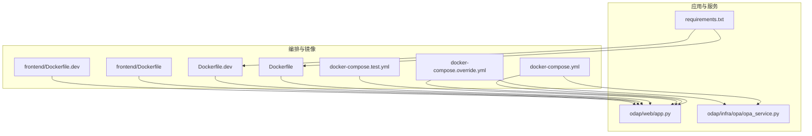
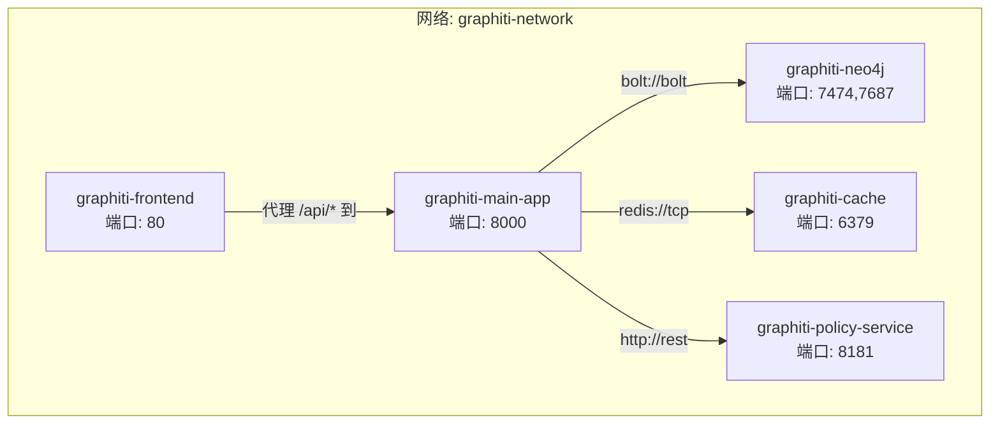
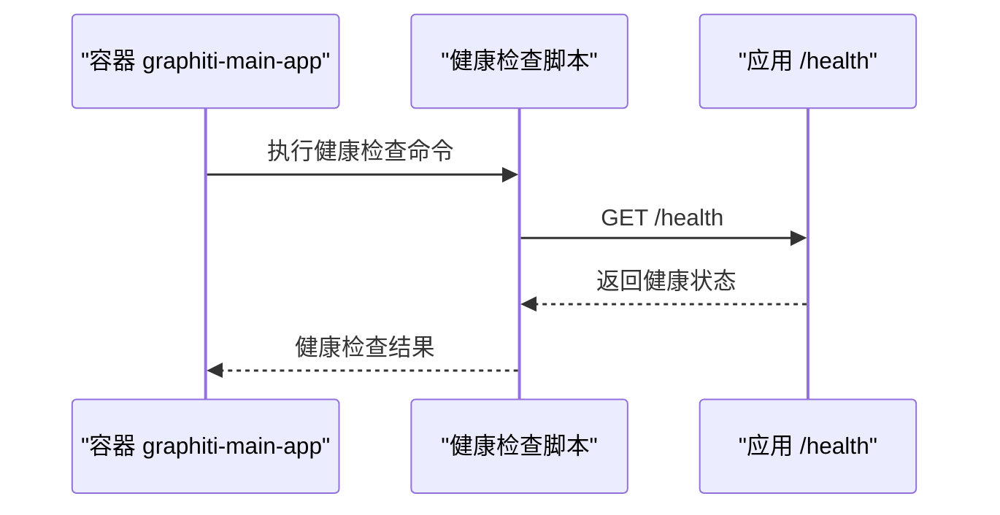
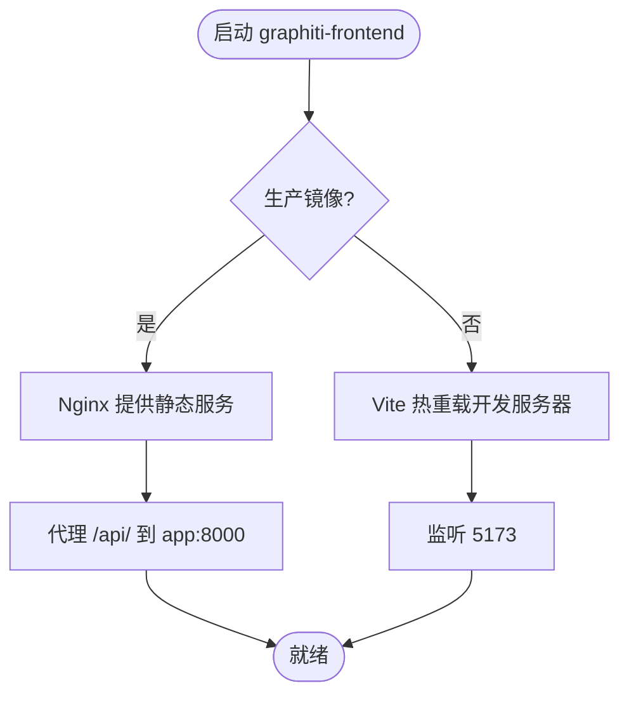
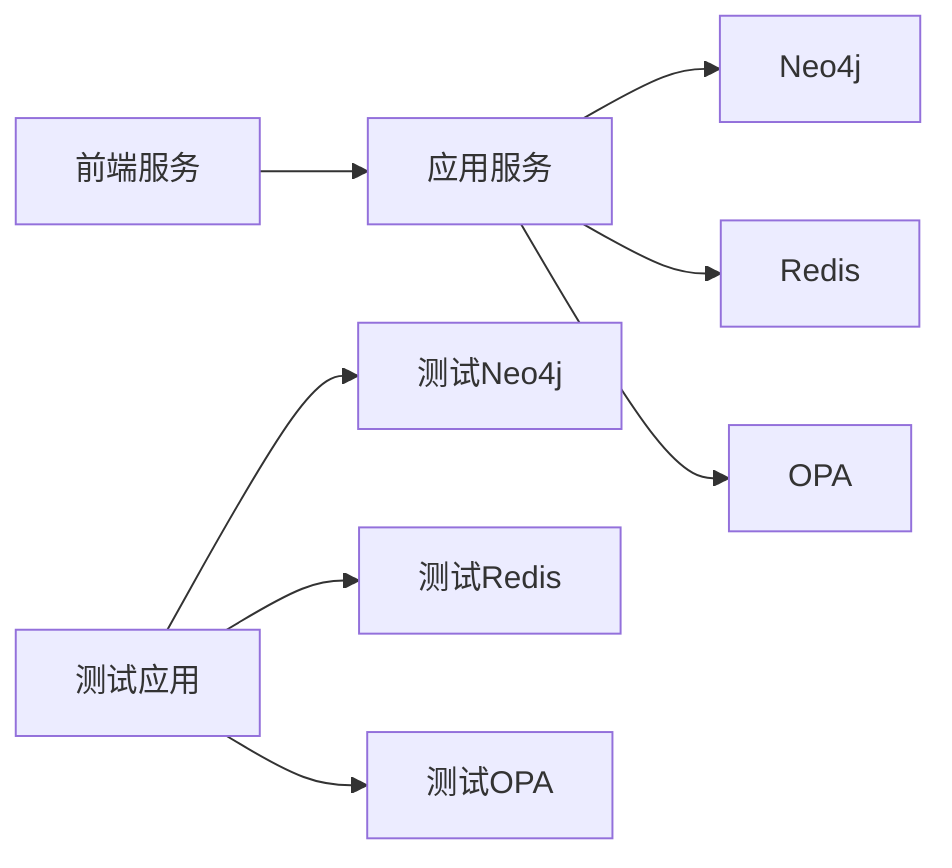

# 容器化部署

<cite>
**本文引用的文件**
- [docker-compose.yml](file://docker/docker-compose.yml)
- [docker-compose.override.yml](file://docker/docker-compose.override.yml)
- [docker-compose.test.yml](file://docker/docker-compose.test.yml)
- [Dockerfile](file://docker/Dockerfile)
- [Dockerfile.dev](file://docker/Dockerfile.dev)
- [frontend/Dockerfile](file://frontend/Dockerfile)
- [frontend/Dockerfile.dev](file://frontend/Dockerfile.dev)
- [podman-compose-win-fix.py](file://docker/podman-compose-win-fix.py)
- [odap/web/app.py](file://odap/web/app.py)
- [odap/infra/opa/opa_service.py](file://odap/infra/opa/opa_service.py)
- [requirements.txt](file://requirements.txt)
</cite>

## 目录
1. [简介](#简介)
2. [项目结构](#项目结构)
3. [核心组件](#核心组件)
4. [架构总览](#架构总览)
5. [详细组件分析](#详细组件分析)
6. [依赖关系分析](#依赖关系分析)
7. [性能考量](#性能考量)
8. [故障排查指南](#故障排查指南)
9. [结论](#结论)
10. [附录](#附录)

## 简介
本文件面向ODAP平台的容器化部署，围绕Docker Compose服务编排进行系统性说明，涵盖应用服务、Neo4j图数据库、Redis缓存、OPA策略服务的容器配置；解释服务间依赖关系、网络与数据卷配置；提供开发与生产环境的差异化compose文件使用方法；说明环境变量、健康检查与重启策略；给出容器启动顺序、服务发现与端口映射的关键配置要点，并总结最佳实践与常见问题解决方案。

## 项目结构
ODAP平台的容器化部署主要由以下文件支撑：
- 后端应用与前端镜像构建：docker/Dockerfile、docker/Dockerfile.dev、frontend/Dockerfile、frontend/Dockerfile.dev
- 服务编排：docker/docker-compose.yml（生产）、docker/docker-compose.override.yml（开发覆盖）、docker/docker-compose.test.yml（集成测试）
- 平台运行时与策略：odap/web/app.py（后端入口与健康检查）、odap/infra/opa/opa_service.py（OPA客户端与权限管理）
- 依赖清单：requirements.txt

**图表来源**
- [docker-compose.yml:1-97](file://docker/docker-compose.yml#L1-L97)
- [docker-compose.override.yml:1-73](file://docker/docker-compose.override.yml#L1-L73)
- [docker-compose.test.yml:1-99](file://docker/docker-compose.test.yml#L1-L99)
- [Dockerfile:1-34](file://docker/Dockerfile#L1-L34)
- [Dockerfile.dev:1-34](file://docker/Dockerfile.dev#L1-L34)
- [frontend/Dockerfile:1-45](file://frontend/Dockerfile#L1-L45)
- [frontend/Dockerfile.dev:1-12](file://frontend/Dockerfile.dev#L1-L12)
- [odap/web/app.py:1-262](file://odap/web/app.py#L1-L262)
- [odap/infra/opa/opa_service.py:1-750](file://odap/infra/opa/opa_service.py#L1-L750)
- [requirements.txt:1-48](file://requirements.txt#L1-L48)

**章节来源**
- [docker-compose.yml:1-97](file://docker/docker-compose.yml#L1-L97)
- [docker-compose.override.yml:1-73](file://docker/docker-compose.override.yml#L1-L73)
- [docker-compose.test.yml:1-99](file://docker/docker-compose.test.yml#L1-L99)
- [Dockerfile:1-34](file://docker/Dockerfile#L1-L34)
- [Dockerfile.dev:1-34](file://docker/Dockerfile.dev#L1-L34)
- [frontend/Dockerfile:1-45](file://frontend/Dockerfile#L1-L45)
- [frontend/Dockerfile.dev:1-12](file://frontend/Dockerfile.dev#L1-L12)
- [odap/web/app.py:1-262](file://odap/web/app.py#L1-L262)
- [odap/infra/opa/opa_service.py:1-750](file://odap/infra/opa/opa_service.py#L1-L750)
- [requirements.txt:1-48](file://requirements.txt#L1-L48)

## 核心组件
- 应用服务（后端）：基于FastAPI，提供健康检查端点与多路由集合；通过环境变量控制CORS与服务端口；依赖Neo4j、Redis、OPA。
- 前端服务：Nginx静态资源服务，代理/api/到后端；开发模式下由Vite提供热重载。
- Neo4j图数据库：提供图存储与查询能力，暴露Web与Bolt端口，配置内存与插件。
- Redis缓存：提供键值缓存与会话存储，支持持久化。
- OPA策略服务：提供策略服务端口，挂载策略目录，支持策略热更新与健康检查。
- 测试环境：独立网络与卷，按健康状态依赖Neo4j、OPA、Redis后执行测试命令。

**章节来源**
- [docker-compose.yml:2-33](file://docker/docker-compose.yml#L2-L33)
- [docker-compose.yml:35-46](file://docker/docker-compose.yml#L35-L46)
- [docker-compose.yml:48-63](file://docker/docker-compose.yml#L48-L63)
- [docker-compose.yml:65-75](file://docker/docker-compose.yml#L65-L75)
- [docker-compose.yml:77-86](file://docker/docker-compose.yml#L77-L86)
- [docker-compose.test.yml:66-89](file://docker/docker-compose.test.yml#L66-L89)
- [odap/web/app.py:221-242](file://odap/web/app.py#L221-L242)
- [odap/infra/opa/opa_service.py:373-450](file://odap/infra/opa/opa_service.py#L373-L450)

## 架构总览
ODAP平台采用“应用+前端+Nginx代理”的三层容器编排，后端通过环境变量连接Neo4j、Redis与OPA；各服务位于同一自定义bridge网络，便于服务发现与通信；数据持久化通过命名卷完成。

**图表来源**
- [docker-compose.yml:1-97](file://docker/docker-compose.yml#L1-L97)

## 详细组件分析

### 应用服务（graphiti-main-app）
- 构建与镜像：基于项目根目录构建，生产镜像使用Dockerfile，开发镜像使用Dockerfile.dev。
- 端口映射：容器内8000对外映射至主机8000。
- 环境变量：IN_DOCKER、NEO4J_URI/USER/PASSWORD、OPA_URL、REDIS_URL、CORS_ORIGINS等。
- 依赖声明：显式依赖Neo4j、OPA、Redis容器启动。
- 数据卷：挂载应用数据卷，确保数据持久化。
- 网络：加入graphiti-network，便于服务发现。
- 重启策略：unless-stopped。
- 健康检查：调用应用内部健康端点，间隔与重试策略明确。

**图表来源**
- [docker-compose.yml:28-33](file://docker/docker-compose.yml#L28-L33)
- [odap/web/app.py:221-242](file://odap/web/app.py#L221-L242)

**章节来源**
- [docker-compose.yml:2-33](file://docker/docker-compose.yml#L2-L33)
- [Dockerfile:1-34](file://docker/Dockerfile#L1-L34)
- [Dockerfile.dev:1-34](file://docker/Dockerfile.dev#L1-L34)
- [odap/web/app.py:221-242](file://odap/web/app.py#L221-L242)

### 前端服务（graphiti-frontend）
- 构建与镜像：生产镜像基于Nginx，构建产物复制至静态目录；开发镜像基于Node，使用Vite提供热重载。
- 端口映射：容器内80对外映射至主机80（生产）或5173（开发）。
- 代理配置：Nginx将/api/转发至后端应用，根路径返回静态页面。
- 开发覆盖：开发compose覆盖前端镜像与端口，挂载源码与配置文件，启用热重载与匿名卷保护node_modules。

**图表来源**
- [docker-compose.yml:35-46](file://docker/docker-compose.yml#L35-L46)
- [docker-compose.override.yml:44-72](file://docker/docker-compose.override.yml#L44-L72)
- [frontend/Dockerfile:1-45](file://frontend/Dockerfile#L1-L45)
- [frontend/Dockerfile.dev:1-12](file://frontend/Dockerfile.dev#L1-L12)

**章节来源**
- [docker-compose.yml:35-46](file://docker/docker-compose.yml#L35-L46)
- [docker-compose.override.yml:44-72](file://docker-compose.override.yml#L44-L72)
- [frontend/Dockerfile:1-45](file://frontend/Dockerfile#L1-L45)
- [frontend/Dockerfile.dev:1-12](file://frontend/Dockerfile.dev#L1-L12)

### Neo4j图数据库（graphiti-neo4j）
- 镜像与标签：使用本地镜像，容器名graphiti-neo4j。
- 端口映射：Web端口7474、Bolt端口7687。
- 环境变量：认证、堆大小、存储过程白名单等。
- 数据卷：数据与日志卷，确保持久化。
- 重启策略：unless-stopped。

**章节来源**
- [docker-compose.yml:48-63](file://docker/docker-compose.yml#L48-L63)

### Redis缓存（graphiti-cache）
- 镜像与标签：使用本地Redis镜像，容器名graphiti-cache。
- 端口映射：容器内6379对外映射。
- 数据卷：持久化数据卷。
- 重启策略：unless-stopped。

**章节来源**
- [docker-compose.yml:77-86](file://docker/docker-compose.yml#L77-L86)

### OPA策略服务（graphiti-policy-service）
- 镜像与标签：使用本地OPA镜像，容器名graphiti-policy-service。
- 端口映射：容器内8181对外映射。
- 卷挂载：挂载策略目录，启动参数指定策略目录与日志级别。
- 重启策略：unless-stopped。

**章节来源**
- [docker-compose.yml:65-75](file://docker/docker-compose.yml#L65-L75)

### 测试环境（odap-test-*）
- 独立网络与卷：odap-test-network，测试专用数据卷。
- 服务：test-neo4j、test-opa、test-redis、test-app。
- 依赖健康：test-app依赖上述服务健康后再执行测试命令。
- 端口映射：与生产一致，便于一致性验证。

**章节来源**
- [docker-compose.test.yml:1-99](file://docker/docker-compose.test.yml#L1-L99)

## 依赖关系分析
- 启动顺序：应用服务声明依赖Neo4j、OPA、Redis；测试应用依赖上述服务健康。
- 服务发现：所有服务位于同一bridge网络，可通过服务名访问（如bolt://graphiti-neo4j:7687）。
- 网络隔离：测试环境使用独立网络，避免与生产冲突。
- 数据持久化：命名卷分别挂载Neo4j、Redis、应用数据，确保重启不丢失。
- 环境变量：通过env_file与environment统一注入，前端通过Vite环境变量控制代理目标。

**图表来源**
- [docker-compose.yml:19-22](file://docker/docker-compose.yml#L19-L22)
- [docker-compose.test.yml:80-86](file://docker/docker-compose.test.yml#L80-L86)

**章节来源**
- [docker-compose.yml:19-22](file://docker/docker-compose.yml#L19-L22)
- [docker-compose.test.yml:80-86](file://docker/docker-compose.test.yml#L80-L86)

## 性能考量
- 端口与代理：前端Nginx代理超时参数合理设置，避免长连接阻塞。
- 健康检查：应用健康检查间隔与超时适配实际响应时间，减少误判。
- 缓存与策略：OPA策略热更新与缓存命中率需结合业务流量评估；Redis持久化策略与内存上限需按容量规划。
- 数据库：Neo4j内存与pagecache按负载调整，避免频繁GC。
- 镜像体积与构建：生产镜像最小化安装依赖，减少镜像体积与拉取时间。

## 故障排查指南
- 应用健康检查失败
  - 现象：容器未进入健康状态。
  - 排查：确认应用内部健康端点可达；检查环境变量与依赖服务连通性。
  - 参考
    - [docker-compose.yml:28-33](file://docker/docker-compose.yml#L28-L33)
    - [odap/web/app.py:221-242](file://odap/web/app.py#L221-L242)
- 前端无法访问后端接口
  - 现象：浏览器访问/api/返回异常。
  - 排查：确认Nginx代理配置指向app:8000；检查CORS配置与后端路由注册。
  - 参考
    - [frontend/Dockerfile:20-28](file://frontend/Dockerfile#L20-L28)
    - [odap/web/app.py:129-139](file://odap/web/app.py#L129-L139)
- Neo4j连接失败
  - 现象：应用无法连接图数据库。
  - 排查：确认Bolt端口映射与URI；检查认证与网络连通。
  - 参考
    - [docker-compose.yml:13-15](file://docker/docker-compose.yml#L13-L15)
    - [docker-compose.yml:51-53](file://docker/docker-compose.yml#L51-L53)
- Redis连接失败
  - 现象：缓存相关功能异常。
  - 排查：确认端口映射与URI；检查持久化卷权限。
  - 参考
    - [docker-compose.yml:17-17](file://docker/docker-compose.yml#L17-L17)
    - [docker-compose.yml:80-81](file://docker/docker-compose.yml#L80-L81)
- OPA策略服务不可用
  - 现象：权限检查失败或回退到Mock。
  - 排查：确认OPA端口映射与策略挂载；检查健康检查与策略加载逻辑。
  - 参考
    - [docker-compose.yml:16-16](file://docker/docker-compose.yml#L16-L16)
    - [docker-compose.yml:70-72](file://docker/docker-compose.yml#L70-L72)
    - [odap/infra/opa/opa_service.py:485-498](file://odap/infra/opa/opa_service.py#L485-L498)
- Podman在Windows路径识别错误
  - 现象：podman-compose无法正确解析Windows绝对路径。
  - 解决：使用提供的wrapper脚本替代podman-compose。
  - 参考
    - [podman-compose-win-fix.py:1-73](file://docker/podman-compose-win-fix.py#L1-L73)

**章节来源**
- [docker-compose.yml:13-17](file://docker/docker-compose.yml#L13-L17)
- [docker-compose.yml:28-33](file://docker/docker-compose.yml#L28-L33)
- [frontend/Dockerfile:20-28](file://frontend/Dockerfile#L20-L28)
- [odap/web/app.py:129-139](file://odap/web/app.py#L129-L139)
- [odap/web/app.py:221-242](file://odap/web/app.py#L221-L242)
- [odap/infra/opa/opa_service.py:485-498](file://odap/infra/opa/opa_service.py#L485-L498)
- [podman-compose-win-fix.py:1-73](file://docker/podman-compose-win-fix.py#L1-L73)

## 结论
ODAP平台的容器化部署通过Docker Compose实现了应用、前端、数据库、缓存与策略服务的一体化编排。生产与开发环境通过不同compose文件实现差异化配置，测试环境独立网络保障稳定性。建议在生产环境中严格管理环境变量与健康检查策略，结合性能监控持续优化数据库与缓存配置。

## 附录

### 开发与生产环境使用方法
- 生产环境
  - 使用主编排文件启动：服务名与端口映射、网络与数据卷均按生产配置。
  - 参考
    - [docker-compose.yml:1-97](file://docker/docker-compose.yml#L1-L97)
- 开发环境
  - 使用覆盖文件启用热重载：替换镜像为开发镜像，挂载源码与配置，前端监听5173。
  - 参考
    - [docker-compose.override.yml:1-73](file://docker/docker-compose.override.yml#L1-L73)
- 测试环境
  - 使用测试编排文件：独立网络与卷，按健康状态依赖启动测试应用。
  - 参考
    - [docker-compose.test.yml:1-99](file://docker/docker-compose.test.yml#L1-L99)

**章节来源**
- [docker-compose.yml:1-97](file://docker/docker-compose.yml#L1-L97)
- [docker-compose.override.yml:1-73](file://docker/docker-compose.override.yml#L1-L73)
- [docker-compose.test.yml:1-99](file://docker/docker-compose.test.yml#L1-L99)

### 环境变量与健康检查
- 关键环境变量
  - IN_DOCKER、ENVIRONMENT（开发）、CORS_ORIGINS、NEO4J_*、OPA_URL、REDIS_URL等。
  - 参考
    - [docker-compose.yml:11-18](file://docker/docker-compose.yml#L11-L18)
    - [docker-compose.override.yml:14-22](file://docker/docker-compose.override.yml#L14-L22)
- 健康检查
  - 应用健康端点：/health；OPA、Redis、Neo4j均有健康检查配置。
  - 参考
    - [docker-compose.yml:28-33](file://docker/docker-compose.yml#L28-L33)
    - [docker-compose.yml:65-75](file://docker/docker-compose.yml#L65-L75)
    - [docker-compose.yml:77-86](file://docker/docker-compose.yml#L77-L86)
    - [docker-compose.test.yml:23-27](file://docker/docker-compose.test.yml#L23-L27)
    - [docker-compose.test.yml:41-45](file://docker/docker-compose.test.yml#L41-L45)
    - [docker-compose.test.yml:57-61](file://docker/docker-compose.test.yml#L57-L61)

**章节来源**
- [docker-compose.yml:11-18](file://docker/docker-compose.yml#L11-L18)
- [docker-compose.override.yml:14-22](file://docker/docker-compose.override.yml#L14-L22)
- [docker-compose.yml:28-33](file://docker/docker-compose.yml#L28-L33)
- [docker-compose.yml:65-75](file://docker/docker-compose.yml#L65-L75)
- [docker-compose.yml:77-86](file://docker/docker-compose.yml#L77-L86)
- [docker-compose.test.yml:23-27](file://docker/docker-compose.test.yml#L23-L27)
- [docker-compose.test.yml:41-45](file://docker/docker-compose.test.yml#L41-L45)
- [docker-compose.test.yml:57-61](file://docker/docker-compose.test.yml#L57-L61)

### 服务发现与端口映射
- 服务发现：同网段内通过服务名访问（如graphiti-neo4j、graphiti-policy-service、graphiti-cache）。
- 端口映射：应用8000、前端80/5173、Neo4j 7474/7687、Redis 6379、OPA 8181。
- 参考
  - [docker-compose.yml:7-8](file://docker/docker-compose.yml#L7-L8)
  - [docker-compose.yml:40-41](file://docker/docker-compose.yml#L40-L41)
  - [docker-compose.yml:51-53](file://docker/docker-compose.yml#L51-L53)
  - [docker-compose.yml:80-81](file://docker/docker-compose.yml#L80-L81)
  - [docker-compose.yml:68-69](file://docker/docker-compose.yml#L68-L69)

**章节来源**
- [docker-compose.yml:7-8](file://docker/docker-compose.yml#L7-L8)
- [docker-compose.yml:40-41](file://docker/docker-compose.yml#L40-L41)
- [docker-compose.yml:51-53](file://docker/docker-compose.yml#L51-L53)
- [docker-compose.yml:80-81](file://docker/docker-compose.yml#L80-L81)
- [docker-compose.yml:68-69](file://docker/docker-compose.yml#L68-L69)

### 最佳实践
- 使用独立网络隔离测试环境，避免与生产冲突。
- 明确健康检查策略，避免误判重启。
- 对关键服务配置持久化卷与备份策略。
- 控制镜像体积与构建缓存，提升部署效率。
- 通过覆盖文件实现开发与生产的差异化配置。